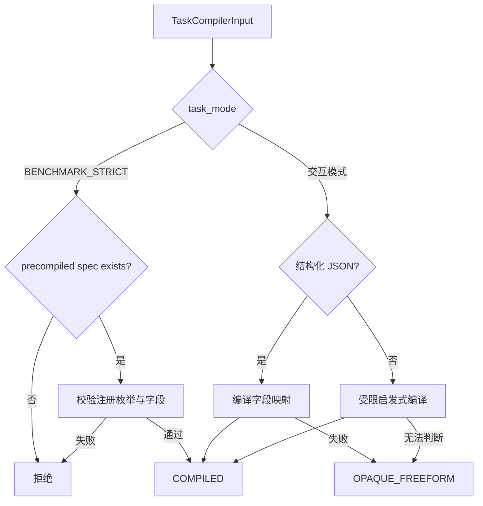
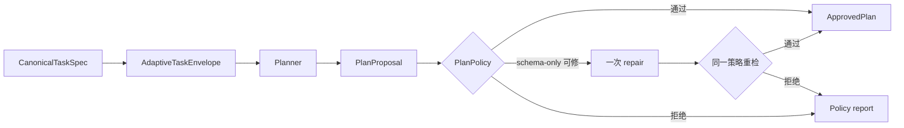
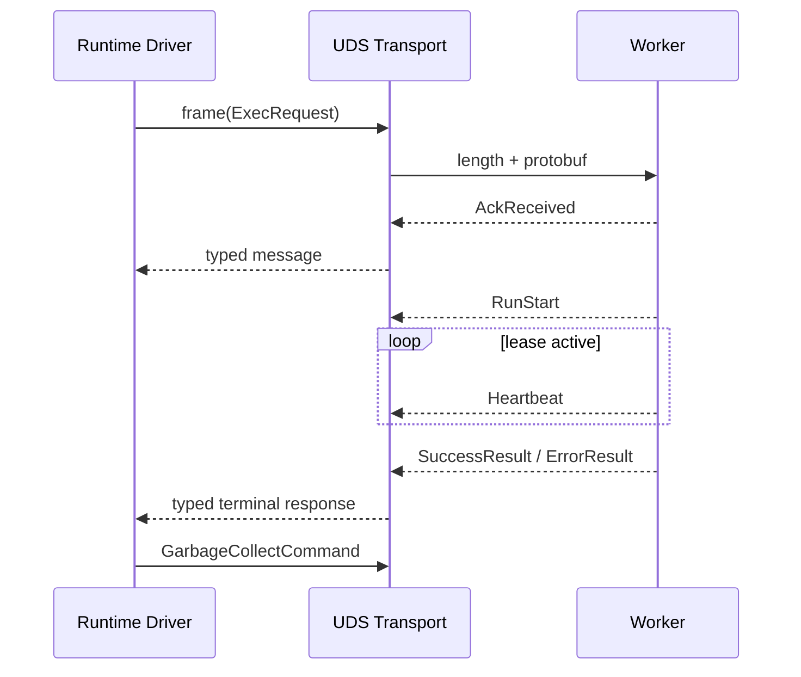
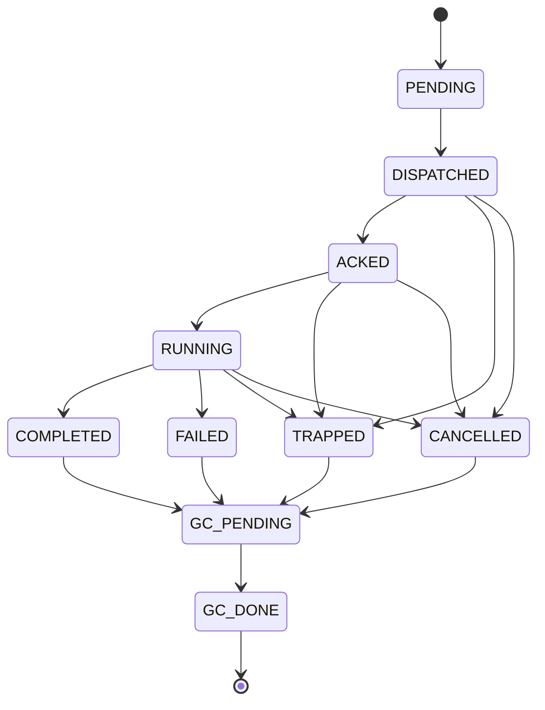
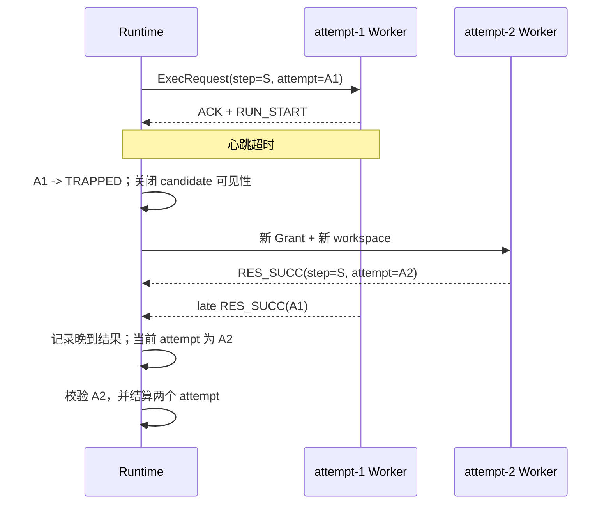

# Runtime、协议与模型路径

## 任务编译与正式任务合同

[`TaskCompiler`](../../src/statebus/runtime/compiler.py) 是 Runtime 的任务入口。它把调用方请求
整理为 `CanonicalTaskSpec`，让 Planner、Retriever、Executor、Summarizer 和 Replay 检查
使用同一个任务信息；执行计划在后续 Planner 阶段生成。

`TaskCompilerInput` 包含原始 request text、任务模式、可选的 corpus family、requested outputs，
以及可选的预编译 spec。交互模式解析带 `task_family` 与 `intent_op` 的 JSON，也支持受限
启发式规则；规范化结果为 `OPAQUE_FREEFORM` 时进入交互路径。正式 benchmark 使用版本化的
预编译 spec。



在 `BENCHMARK_STRICT` 模式下，预编译 spec 是任务入口；缺失时返回
`benchmark_strict_requires_precompiled_canonical_spec`。同一 case 的 task family、intent、
目标实体、期间、输出和工具要求均由版本化样本固定。

| 字段 | 含义 | 使用方 |
|:--|:--|:--|
| `task_family` | 注册任务族 | capability 路由、记忆过滤、覆盖统计 |
| `intent_op` | 规范化操作 | Planner 约束、Replay 检查、Validator |
| `target_entities` | 公司、指标、产品等目标 | 检索 query、tag、证据范围 |
| `time_scope` | 当前数据期间 | locator 过滤、记忆兼容 |
| `required_outputs` | 必须交付的字段或结论 | 输出合同与质量检查 |
| `required_tools` | 允许/需要的注册工具 | capability catalog |
| `arguments` | 任务族定义的参数 | Executor 与业务 Validator |

`CanonicalTaskSpec.canonical_payload()` 对字典字段做稳定排序，`spec_hash` 由此计算。后续计划、Grant、MemoryRef 与 ReplayLedger 保存这个 hash，从而把一次结果绑定到明确的任务定义。

任务合同保存任务族定义的参数；自由 Python、文件路径和 shell 由后续 capability 与 workspace
策略管理。编译成功后任务进入 Planner 阶段，执行资格再由 PlanPolicy 和 CapabilityGrant 签发。

与 task spec 分开的 [`RuntimeCompatibilitySignature`](../../src/statebus/contracts/models.py) 保存
OS、Python、依赖、工具注册表、Prompt bundle 和 extractor bundle 摘要。运行签名变化时，
历史记忆按兼容判断进入 assist、validated replay 或当前任务重算。

正式任务样本和任务族在 [`src/statebus/benchmark/samples`](../../src/statebus/benchmark/samples)；相关合同回归可从 [`tests/unit/contracts/test_contracts_and_refs.py`](../../tests/unit/contracts/test_contracts_and_refs.py)、[`tests/integration/runtime/test_adaptive_driver.py`](../../tests/integration/runtime/test_adaptive_driver.py) 和 [`tests/benchmarks/mainline/test_contest_main_chain.py`](../../tests/benchmarks/mainline/test_contest_main_chain.py) 开始阅读。

---

## 计划策略与能力授权

Planner 输出 `PlanProposal`。一个 proposal 由多个 `PlanStepProposal` 组成，每步声明 role、
capability、goal、依赖、输入 Ref 及类型、输出合同、完成条件、失败策略和必需字段。Runtime
用 [`PlanPolicyValidator`](../../src/statebus/runtime/plan_policy.py) 将候选计划映射到当前任务
envelope 和 capability registry。



策略检查覆盖 schema validation、task ID、步骤预算、最终输出合同、记忆策略、Planner Token 预算、step ID 唯一性、角色基数、capability owner、输入 Ref 类型、DAG 环、依赖深度、多段 Executor 字段流和总 attempt 预算。通过后生成的 `ApprovedPlan` 保存 policy report hash、capability registry digest 和 total attempt budget。

`validate_with_single_repair()` 提供一次 schema-only repair，处理编码或 schema 层问题。
capability、DAG、Ref、预算和任务事实保持不变；修复结果与注册的 deterministic fallback
proposal 都重新经过完整策略检查。

`ApprovedPlan` 描述执行图；Runtime 在准备某个 step/attempt 时创建 `CapabilityGrant`，把以下信息绑定在同一个可 hash 合同中：

| Grant 字段 | 约束作用 |
|:--|:--|
| task/session/step/attempt | 防止授权跨任务或跨重试复用 |
| capability ID/version | 固定实际调用的注册能力及版本 |
| `input_ref_ids` | 限制本次执行可以读取的对象 |
| output contract version | 限制允许产生的结果 schema |
| workspace root ID | 限制可写目录 |
| max runtime / expires at | 限制运行时长与授权寿命 |
| approved plan hash | 防止 Grant 脱离已批准计划 |

```text
ApprovedPlan step
   capability = bounded_python.table_anomaly
   refs       = evidence-pack-X, semantic-state-Y
   output     = anomaly_result.v1
               │
               ▼
CapabilityGrant
   session + attempt + exact refs + workspace + expiry
               │
               ▼
ExecRequest.capability_grant_hash
```

dispatch 前，Runtime 再根据当前 Ref Registry 和 ApprovedPlan 复核 Grant。这样即使早期批准之后某个 Ref 已失效、输出合同被替换或授权已过期，请求也会在进入 Worker 前被拒绝。

一个 capability descriptor 包含 owner role、版本、输入 Ref kind、输出合同、风险等级、Validator
和预算。LLM Python capability 同时在 envelope 中启用 `allow_llm_python`，由 Planner 在已登记
已登记的执行路径中选择。

主要类型位于 [`src/statebus/contracts/adaptive.py`](../../src/statebus/contracts/adaptive.py)，能力表与校验测试可参考 [`tests/integration/runtime/test_adaptive_dispatcher.py`](../../tests/integration/runtime/test_adaptive_dispatcher.py) 和 [`tests/unit/runtime/test_runtime_identity.py`](../../tests/unit/runtime/test_runtime_identity.py)。

---

## Protobuf 与 UDS 控制协议

正式控制消息定义在 [`messages.py`](../../src/statebus/control/messages.py) 与 [`statebus_control.proto`](../../src/statebus/control/statebus_control.proto)。消息共享 `ControlHeader`，具体 body 通过 Protobuf `oneof` 选择。Header 固定 trace、task、step、attempt、目标角色、timeout、event type 和 schema version，使每条事件都能回到具体执行尝试。

| 消息 | 主要字段 | 语义 |
|:--|:--|:--|
| `ExecRequest` | ReusePolicy、state/artifact/memory refs、operation、workspace、manifest、encoder signature、Grant hash | 请求一个已批准 attempt |
| `AckReceived` | `acked_at_ns` | Worker 已接收并解析 |
| `RunStart` | 开始时间、heartbeat interval、lease timeout | Worker 进入运行态 |
| `Heartbeat` | 时间与 worker state | 刷新 attempt 活性 |
| `SuccessResult` | 输出 Ref、消费状态、选择 ID/分数/行号、PIDs、encoder signature 或 DecisionReceipt 字段 | 进程执行完成，等待 Runtime 复核 |
| `ErrorResult` | error code/detail、失败时间 | 可归因的执行失败 |
| `CancelCommand` | 原因与发出时间 | 主动终止 |
| `TrapFatal` | trap reason/detail | timeout 或不可恢复 Worker 异常 |
| `GarbageCollectCommand` | Ref IDs | 终态后的资源结算 |

`ExecRequest` 把 `state_refs`、`artifact_refs` 与 `memory_refs` 分开，字段类型由合同直接给出。`input_manifest_hash` 和 `hydrate_manifest_id` 固定来源字段，`expected_encoder_signature` 限制稠密状态兼容，`capability_grant_hash` 关联请求与授权对象。

Logit 决策复用同一消息合同：`operation="logit_gate_v1"` 的请求只携带 `LogitStateRef` handle 和输入 manifest hash，独立 Worker 返回 consumed ref、producer/consumer PID、action/reason、selected/top-1 alias、margin、entropy 与 decision ID。Protobuf 能保存这些结构化字段，Runtime 根据模式和尝试次数决定执行、重查或 fail closed。

[`transport.py`](../../src/statebus/control/transport.py) 使用 `AF_UNIX/SOCK_STREAM`。每个序列化 payload 前有 4 字节 big-endian 长度，接收端通过 `_recv_exact()` 读取完整帧。长度不一致、body 缺失或 schema 无法解析都会失败，不会把残帧当成合法消息。

```text
wire frame
┌──────────────────────────┬─────────────────────────────────────┐
│ 4-byte payload length BE │ serialized ControlEnvelope protobuf │
└──────────────────────────┴─────────────────────────────────────┘
```

UDS 路径受 `sockaddr_un.sun_path` 长度限制。`effective_unix_socket_path()` 在路径过长时使用原绝对路径的 SHA-256 摘要生成稳定短路径，并在必要时落到用户相关的 `/tmp/statebus-uds-<uid>/`，避免深层 Run 目录导致 bind 失败。



仓库保留 canonical JSON/text carrier 作为 comparator 和诊断路径，用于比较相同逻辑消息的
不同线路表示；正式控制合同由 Protobuf 字段和状态语义定义。

协议负责消息解析与关联；`SuccessResult` 返回后，Runtime 继续检查 Ref、hash、schema、
PID/encoder 回执和 Validator。消息携带小型类型化字段，完整文档、矩阵和产物通过 Ref 进入
对象存储。

协议测试可从 [`test_control_plane.py`](../../tests/unit/runtime/test_control_plane.py) 和 [`test_runtime_session_and_ledger.py`](../../tests/unit/runtime/test_runtime_session_and_ledger.py) 查找；若具体文件名发生变化，可在 `tests` 中检索 `ExecRequest` 与 `ControlEnvelope`。

---

## Worker 生命周期与 attempt 隔离

[`RuntimeSupervisor`](../../src/statebus/runtime/supervisor.py) 将一个 step 的网络接收、实际运行
和业务终态拆开管理。`step_id` 表示批准计划中的逻辑步骤，`attempt_id` 表示这个步骤的一次
具体执行。重试沿用 step ID，并创建新的 attempt、Grant 和 workspace。



`ACKED` 只说明 Worker 已收到请求；`RUNNING` 从 `RunStart` 开始，并用 heartbeat 刷新 lease。ACK timeout 表示请求没有及时确认，heartbeat timeout 表示已经接收或启动的 Worker 失去活性，两者进入 `TRAPPED`。业务程序返回明确错误则进入 `FAILED`，用户或上层调度取消进入 `CANCELLED`。

FAILED 通常有稳定 ErrorResult、stdout/stderr 或候选文件；TRAPPED 表示 Worker 状态未知，
系统先关闭下游可见性，再处理进程和资源；CANCELLED 保留取消来源。三类终态分别进入对应
恢复和结算流程。



控制 Header、CapabilityGrant、workspace、ArtifactRef 与 Telemetry 都携带 attempt ID。Runtime
按当前 attempt 接受合法状态迁移；旧 attempt 的晚到结果保留 hash 和诊断记录，candidate
维持原终态。

重试可以复用内容 hash 未变、状态仍为 verified/active 且可重新授权的上游 Ref。新 Grant
只接收这些上游对象，失败 attempt 产生的 candidate 留在原 workspace 作为诊断材料。

所有终态最终进入 `GC_PENDING -> GC_DONE`。GC 处理 StateRef lease、shared memory/mmap、
Worker 进程组、workspace candidate 与未提交 Memory proposal。清理逻辑采用幂等实现，以
处理取消、timeout 与进程退出同时触发结算的情况。

Supervisor 是内存状态机，持久诊断由 Telemetry、sidecar 和 Ledger 补充。进程重启后的恢复不尝试复活原进程，而是把原 QUEUED/RUNNING 作业整理为中断终态并保留事件，再允许用户新建 Run。

---

## 模型侧状态路径

模型侧路径插在 Runtime 默认任务流程的不同位置：

~~~mermaid
flowchart LR
    T[CanonicalTaskSpec] --> R[Retriever]
    R --> E[Embedding / SemanticStateRef]
    E --> X[EvidencePack]
    X --> G[Executor]
    G --> L[LogitStateRef / DecisionReceipt]
    L --> C[CodeAct / Artifact]
    C --> S[Summarizer]
    X -. common token prefix .-> P[APC / vLLM engine-local cache]
    G -. producer handle .-> K[Explicit KV / same Worker]
    K -. suffix continuation .-> S
~~~

| 路径 | 当前对象 | 接入点 | 默认状态 |
| --- | --- | --- | --- |
| Embedding | SemanticStateRef | Retriever candidate/evidence 选择 | 由 task/runtime 配置决定 |
| Logit | LogitStateRef、LogitGateReceipt | Executor 闭集选择后、dispatch 前 | off |
| APC | canonical prefix、exact-token identity、counter delta | 完整请求发送到同一 vLLM engine 前 | alignment independent、policy off |
| 显式 KV | EngineLocalKVHandle、forward proof | Producer Executor 到 Consumer Summarizer | off |

Embedding 和 Logit 使用 StateBus 的 Ref、sidecar 和 typed control path。APC 观察同一 vLLM engine 的 token block reuse；显式 KV 在兼容的 engine generation 和 Worker registry 内传递短生命周期 handle。Task、EvidencePack、Artifact 和 quality check 继续沿用默认任务流程。

### 当前可达行为

- Embedding 发布 query/candidate matrix；consumer 解析 SemanticStateRef，选择 row，再由 Runtime hydrate 回 evidence ID。
- Logit 路径使用闭集候选概率。独立决策进程校验 state、candidate surface、PID 和 receipt；retry_once 在首次 retry 后最多再请求一次，第二次仍不满足时 fail closed。
- APC 先构造参与角色共同可见且 digest 一致的 evidence prefix，再用真实 tokenizer 计算 exact-token identity；counter delta 无效时把观测记为 unavailable。
- 显式 KV 由 producer capture、consumer load、forward proof 和 finally release 组成。handle unavailable 的处理由实验或产品 profile 明确选择，默认任务流程保持原有对象合同。

### 机制边界

APC 记录 engine-local cache hit；显式 KV 使用同一 vLLM Worker 的 connector/registry 路径。provider tokens、logical tokens、computed prefill 和 KV bytes 分别记录，各自对应不同的观测层级。

### 代码与结果

| 主题 | 代码 | 证据/说明 |
| --- | --- | --- |
| Semantic State | src/statebus/state/semantic_state.py、src/statebus/runtime/state_consumption.py | [稠密语义状态](state.md) |
| Logit decision | src/statebus/runtime/logit_gate.py、logit_state.py | [Logit Retry Decision](runtime.md#logit-retry-decision) |
| APC | src/statebus/runtime/prefix_identity.py、prefix_feedback.py | [Engine-Local Prefix Reuse](runtime.md#engine-local-prefix-reuse) |
| 显式 KV | src/statebus/integrations/vllm_kv/、contracts/engine_local_kv.py | [Engine-Local KV Continuation](runtime.md#engine-local-kv-continuation) |
| utility runner | src/statebus/benchmark/model_assist_utility/ | [实验与证据](../experiments/README.md) |

APC、KV、Logit 的当前计分分母分别为 8、8、12，共 28 个位置；它们是独立 utility suite，与 48 个标准任务位置分开统计。

---

## Logit Retry Decision

Logit 决策位于 Executor 的闭集候选选择之后、业务 dispatch 之前。Executor 产生候选概率，独立 decision Worker 解析 LogitStateRef，返回 LogitGateReceipt；Runtime 决定接受、重查一次或 fail closed。

### 执行路径

~~~mermaid
sequenceDiagram
    participant E as Executor
    participant S as State store
    participant G as decision worker
    participant R as Runtime
    E->>S: publish candidate probabilities
    S-->>E: LogitStateRef
    E->>G: typed request + RefHandle
    G->>S: resolve and validate state
    G-->>R: DecisionReceipt + transport audit
    R->>R: cross-check PID, candidate and state identity
    R->>S: release state and write tombstone
~~~

候选 surface 绑定 alias、candidate ID、route、tool 和 digest。决策进程接收单字段 JSON 选择和候选概率投影；自由文本与完整词表 logits 留在上游模型接口。概率提取失败、候选缺失、state/lease/hash/PID 不一致都形成明确的 unavailable/error receipt。

retry_once 首次 retry 后最多再取一次候选概率；第二次仍未通过时结束 Worker dispatch。所有已发布 state 通过 finally release。

### 配置

~~~dotenv
STATEBUS_LOGIT_GATE_MODE=off
# telemetry 或 retry_once
~~~

- off：不发布 Logit state，沿原选择路径；
- telemetry：发布并记录 accept/retry/unavailable/error，业务控制流保持原路径；
- retry_once：首次 retry 重新选择，第二次 retry 或 state 错误时 fail closed。

### 当前 utility 结果

当前精选 run 的 Logit 分母为 12 个计分位置，见 tests/evidence/model-assist/summary.md：

- 9 个 resolved case 通过；
- 3 个 unresolved case 正确 abstention；
- 在 3 个 resolved case 上，compact/selective logical input 平均减少 75.21%；
- compact/selective provider request wall 方向性下降 17.18%/18.51%。

正确 abstention 计入质量结果分母。request wall 和 logical input 分别描述请求耗时与输入规模；当前数字对应本次模型和任务集合。

### 代码入口

| 文件 | 职责 |
| --- | --- |
| src/statebus/contracts/logit.py | candidate surface、receipt 和概率语义 |
| src/statebus/runtime/logit_state.py | exact choice token 定位和概率提取 |
| src/statebus/runtime/logit_gate.py | subprocess decision、cross-check 和 release |
| src/statebus/state/logit_state.py | State store 发布、消费、释放和 tombstone |
| src/statebus/benchmark/model_assist_utility/runner.py | Logit utility phase 和 records |

---

## Engine-Local Prefix Reuse

APC 将 Executor、Summarizer 或其他获准角色共同可见的 evidence 编译到 prompt 的相同 token prefix，再由同一 vLLM engine 自动复用缓存 block。StateBus 负责 evidence 交集、稳定渲染、exact-token identity 和 counter delta；vLLM 负责 block 的驻留和淘汰。

### 调用路径

~~~mermaid
sequenceDiagram
    participant R as Runtime
    participant P as Prefix compiler
    participant V as vLLM
    R->>P: role-visible evidence
    P->>P: stable-key intersection + digest check
    P->>P: tokenizer / chat template / block alignment
    P->>V: full prompt with shared prefix
    V-->>R: response + metrics counters
    R->>R: compute task-local query/hit delta
~~~

共同前缀只有在参与角色集合、stable key 和 entry digest 都一致时才 eligible。compile_exact_token_prefix_identity() 以真实 tokenizer 和 chat template 计算最长公共 token prefix，并按 block size 对齐；公共范围不足时保持独立布局。

STATEBUS_PREFIX_ALIGNMENT_MODE=shared_evidence_prefix 选择共同布局；STATEBUS_PREFIX_POLICY=observe|on 选择观测或启用策略。默认 independent + off。

### 观察字段

- prefix text hash、layout/normalizer/visibility policy version；
- participant roles、authorized common keys、entry digest；
- exact token identity、full block token count、eligibility reason；
- vLLM /metrics 的 query/hit counter delta；
- task wall、consumer TTFT 和服务 instance/cache epoch。

服务 counter 不可读、series 不一致或窗口不独占时，业务请求可以完成，观测标为 unavailable；unavailable 与 zero hit 分开记录。

### 当前 utility 结果

当前精选 run 的 APC 分母为 8 个计分位置，见 tests/evidence/model-assist/summary.md：

- consumer TTFT 平均 2540.2 -> 264.3 ms，下降 89.59%；
- 观测命中 token 平均 48 -> 5168；
- 完整 task_wall_ms 平均下降 4.29%。

这些数来自独立 long-text utility suite；服务切换和清理成本单独记录。APC 的局部 TTFT 与 48 项标准任务流程整体耗时分别报告。

### 代码入口

| 文件 | 职责 |
| --- | --- |
| src/statebus/contracts/prefix.py | prefix contract 和 exact identity model |
| src/statebus/runtime/prefix_identity.py | common prefix intersection、token LCP、block alignment |
| src/statebus/runtime/prefix_feedback.py | predicted/observed counter delta feedback |
| src/statebus/benchmark/model_assist_utility/runner.py | APC utility phase 和记录聚合 |
| scripts/experiments/contest_model_assist/run_utility_suite.sh | utility launcher |

---

## Engine-Local KV Continuation

显式 KV continuation 在 producer Executor 请求完成后捕获 parent KV，并把短生命周期 EngineLocalKVHandle 交给同一 vLLM Worker 的 consumer。consumer 仍按同一 logical prompt 生成结果，但物理 prefill 由 inherited parent 加 suffix 组成。

### 调用路径

~~~mermaid
sequenceDiagram
    participant E as Executor
    participant K as vLLM Worker registry
    participant C as CodeAct / Artifact
    participant S as Summarizer
    E->>K: capture parent KV
    K-->>E: READY handle
    E->>C: normal artifact and validation path
    C-->>S: verified artifact
    S->>K: load handle + suffix
    K-->>S: tokens + KVForwardProof
    S->>K: release in finally
~~~

handle 绑定 engine/model/tokenizer identity、task/attempt、parent token digest、block/layout、TTL 和实际 KV bytes。consumer 必须同时提供 scheduler proof 与 Worker forward proof；identity、token 账本或 proof 不一致时拒绝 continuation。capture、load、release 的计数和 registry 清理写入 suite record。

full_replay 与 continuation 使用相同 task、model、sampling、quality check 和 APC 关闭条件。`continuation` 在 utility profile 中显式启用；标准任务流程保持 `STATEBUS_ENGINE_LOCAL_KV_MODE=off`。

### 当前 utility 结果

当前精选 run 的 KV 分母为 8 个计分位置，见 tests/evidence/model-assist/summary.md：

- consumer computed prefill 平均 5666.5 -> 545.5 tokens，下降 90.37%；
- consumer TTFT 平均 2570.6 -> 1005.7 ms，下降 60.88%；
- consumer request wall 平均下降 11.88%，完整 task_wall_ms 平均下降 3.58%；
- 这些数字包含 utility runner 记录的 capture/load/release 账本；服务切换成本不归因于某个 slot。

局部 prefill 和 TTFT 属于模型服务观测；标准任务流程的整体耗时单独统计，跨进程数据字段另有记录。KV bytes、logical tokens 和 provider tokens 保持独立字段。

### 代码入口

| 文件 | 职责 |
| --- | --- |
| src/statebus/contracts/engine_local_kv.py | handle、proof 和兼容 identity contract |
| src/statebus/integrations/vllm_kv/ | client、connector、middleware、role client |
| src/statebus/runtime/kv_budget.py | budget、load/capture/release 约束 |
| src/statebus/benchmark/model_assist_utility/runner.py | KV utility phase 和记录聚合 |
| scripts/experiments/contest_model_assist/run_utility_suite.sh | utility launcher |
