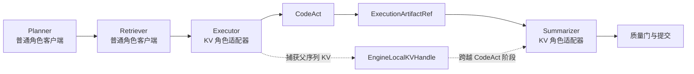
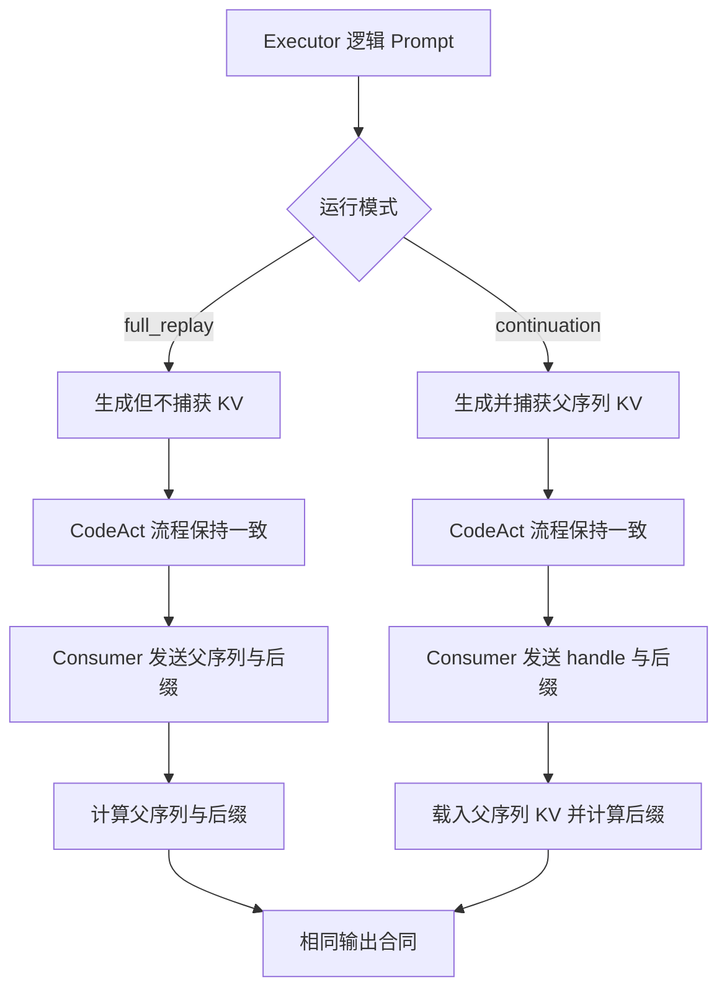
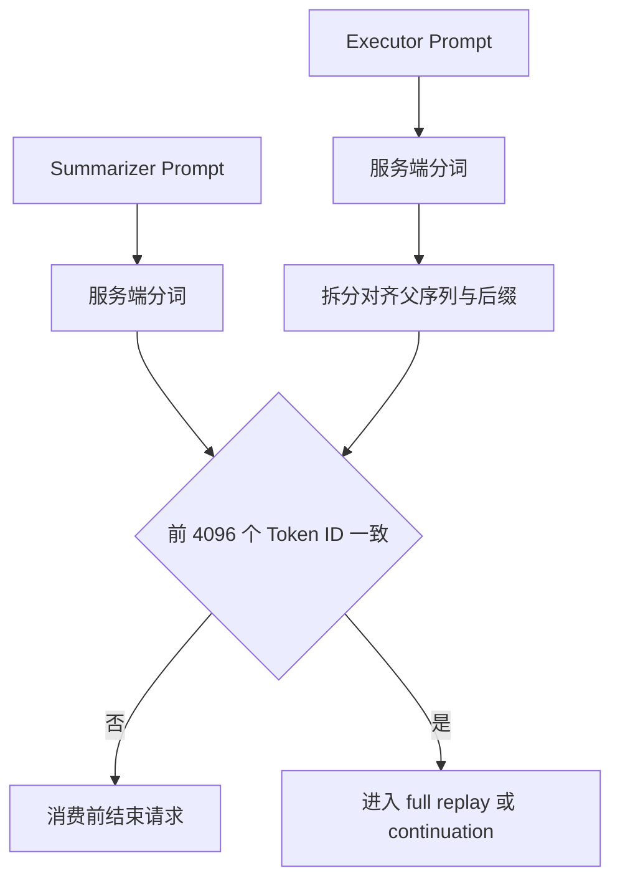
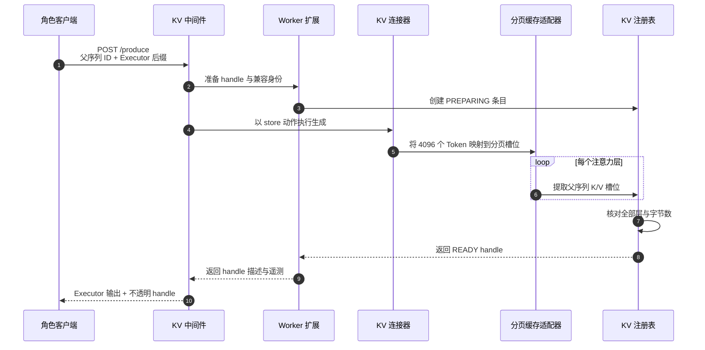
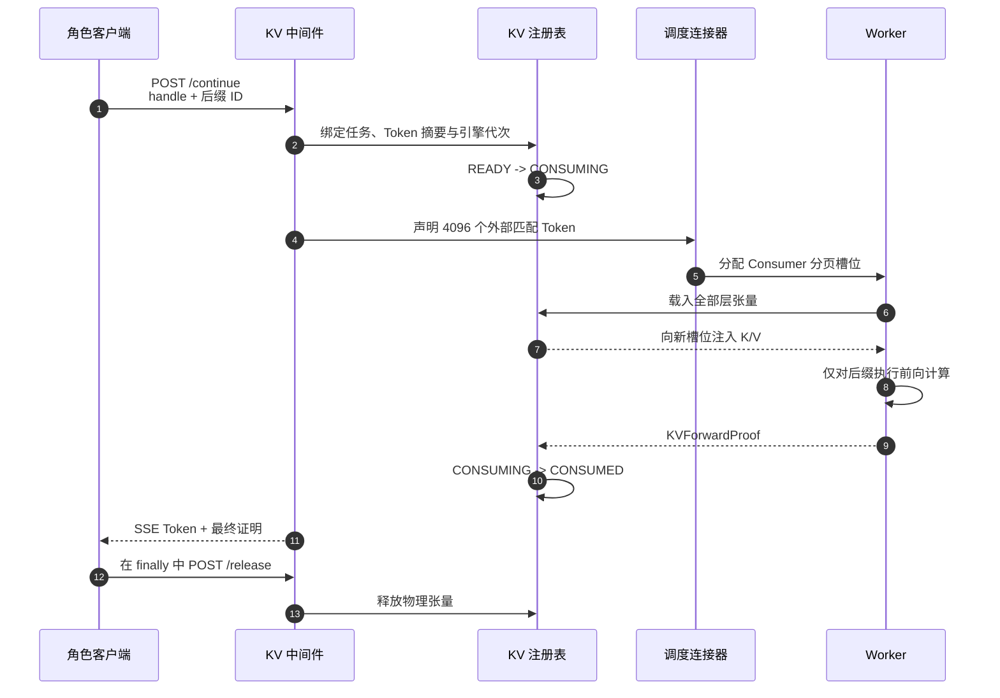
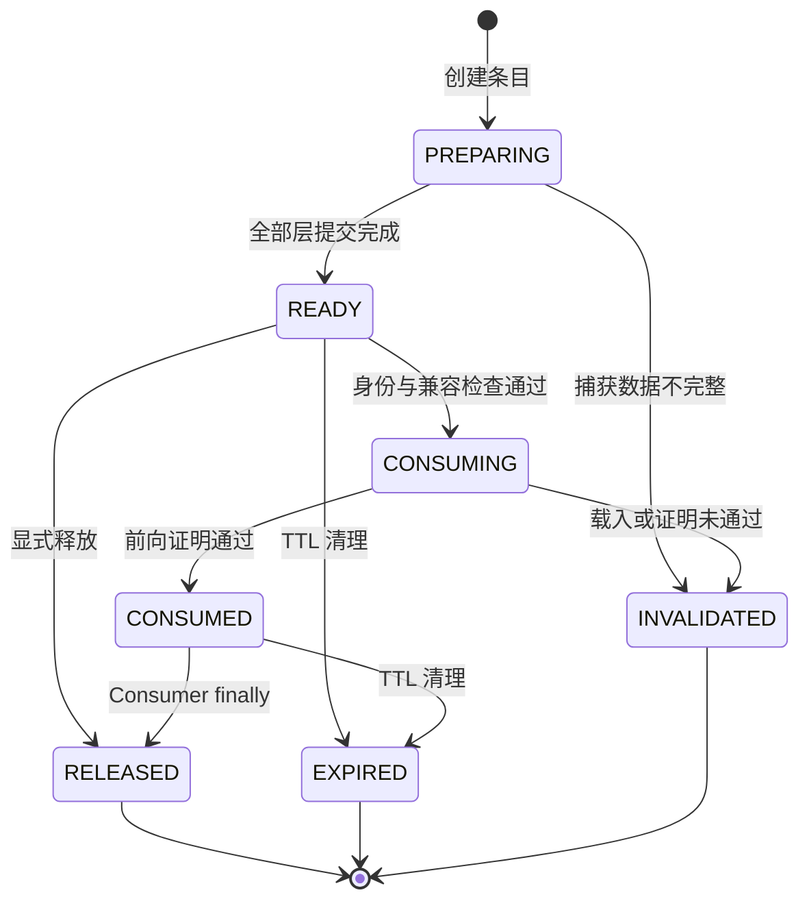
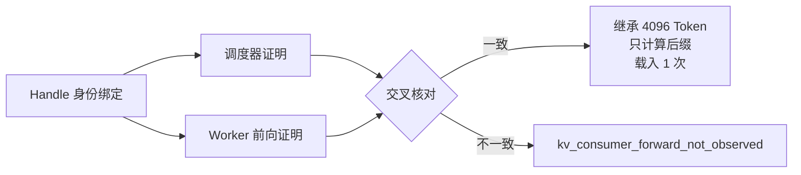
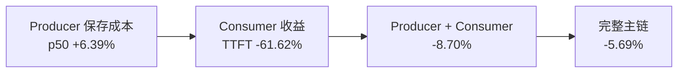

# 显式引擎内 KV 延续

显式引擎内 KV 延续（Engine-Local KV Continuation）在 Executor 模型调用时捕获一段
按 block 对齐的父序列 KV，通过短生命周期 handle 交给同一 vLLM Worker 上的 Summarizer。
Consumer 的逻辑 Prompt 保持一致，请求载荷由完整父序列变为 handle 与后缀，模型只计算
后缀部分的 Prefill。

这条路径已经接入完整 `Planner -> Retriever -> Executor -> CodeAct -> Summarizer` 主链，
并作为默认关闭的 engine-local sideband 运行。`EngineLocalKVHandle` 由 vLLM Worker registry
管理，正式 Protobuf、Ref Registry、`StateRef` 与 `MemoryProxy` 继续承载原有系统对象。

## 接入位置



`run_smoke()` 先创建普通 `RoleDispatchLLMClient`，再调用
`maybe_wrap_engine_local_kv_role_client()`。模式为 `off` 时直接返回原 delegate；开启后只适配
Executor 和 Summarizer，Planner 与 Retriever 继续走原客户端。上层 `RolePathRunner` 收到的
仍是通用 `LLMResult`，KV handle 对 CodeAct、Artifact、Validator 和 GC 保持透明。

KV 来自 Executor 的模型 Prefill，并在 CodeAct 阶段暂存；CodeAct 输出仍通过
`ExecutionArtifactRef` 进入 Summarizer 后缀。

## 两条可比路径

`full_replay` 和 `continuation` 使用同一私有 middleware，使 A/B 两侧具有相同的接口、
采样参数和统计路径。



两条 lane 保持相同文档、`CanonicalTaskSpec`、parent token IDs、角色 prompt、temperature 和 seed。唯一机制差异是 Producer 是否捕获 KV，以及 Consumer 的 parent 来自请求体还是 handle。

## 父序列与后缀

运行时用同一 vLLM 服务的 `/tokenize` 编码最终 rendered prompt。目标 parent 长度按服务 block size 向下对齐；当前实验固定 4,096 token，block size 为 16，共 256 个完整 block。

```text
Executor logical prompt = shared parent + Executor suffix
Summarizer logical prompt = same shared parent + Summarizer suffix
```

Consumer 调用前重新编码完整 Summarizer Prompt，并逐 Token 比较前 4,096 个 ID。长度、
父序列、block 对齐和后缀长度共同形成消费前身份检查。



这一步核对 Token identity。logical Prompt digest 在两条路径中相同，KV 只改变 Token 的
物理来源。

## 生产端捕获



Connector 只提取父序列槽位，Executor 后缀与生成 Token 保持在普通生成路径。层数、长度、
dtype 和 byte count 全部核对完成后，entry 从 `PREPARING` 进入 `READY`。

Qwen3-32B BF16、64 层、8 个 KV heads、head dim 128 的 4k handle 为：

```text
4096 tokens * 64 layers * 2(K,V) * 8 heads * 128 * 2 bytes
= 1,073,741,824 bytes
```

当前 registry 使用 Worker host tensor，实验配置为 pageable host memory；handle 的生命周期
由 Worker registry 管理。

## 消费端载入



Scheduler 报告的 4,096 cached Token 来自 external connector。实验关闭 Automatic Prefix
Caching，本地 APC computed Token 为 0，因此 inherited Token 全部来自显式 handle。

## 句柄生命周期



Registry 同时限制 entry 数量、总字节、TTL 和 one-shot 消费。实验配置为 `max_entries=2`、`max_bytes=2 GiB`、`TTL=300 s`、`one_shot=true`。10 次正式 continuation 均走完 `PREPARING -> READY -> CONSUMING -> CONSUMED -> RELEASED`，结束后 registry 为 0 entry / 0 byte。

## 兼容身份与双证明

Handle 绑定以下身份：

- engine ID 和 generation；
- model ID、revision 和 tokenizer digest；
- task、Producer request 和 parent token digest；
- block size、layer count、dtype 和 storage tier；
- 创建时间、过期时间和实际 KV bytes。

Consumer 同时提供服务 health 返回的 compatibility digest。模型、tokenizer、engine generation、
layout 和 Token identity 一起决定 handle 与当前请求的兼容状态。

一次 load 同时产生 scheduler proof 和 Worker proof，并在 Runtime 中交叉核对：



`KVForwardProof` 记录以下恒等关系：

```text
logical_prompt_tokens = inherited_kv_tokens + computed_prefill_tokens
computed_prefill_tokens = suffix_tokens
connector_load_count = 1
layer_count > 0
kv_bytes_actual > 0
producer and consumer identity match
```

命中记录由 handle 身份、调度器证明和 Worker 前向证明共同组成。

## 私有接口

| 接口 | 输入 | 输出 |
|:--|:--|:--|
| `GET /statebus/kv/health` | Bearer token | engine/model/tokenizer/layout signature、registry counters |
| `POST /statebus/kv/produce` | parent IDs、Producer suffix、capture、TTL、sampling | Executor output、可选 handle、store telemetry |
| `POST /statebus/kv/continue` | lane、suffix，以及 parent IDs 或 handle | SSE token events、final payload、forward proof |
| `POST /statebus/kv/release` | handle ID | release status |

Client 使用 loopback URL，并从权限为 `0600` 的文件读取 Token。Middleware 串行处理私有推理
请求，核对 Bearer Token、模型、上下文预算、采样参数和兼容身份。该接口服务于同一主机、
同一 vLLM Worker 内的 KV 延续。

## 运行配置

| 环境变量 | 含义 |
|:--|:--|
| `STATEBUS_ENGINE_LOCAL_KV_MODE` | `off`、`full_replay` 或 `continuation` |
| `STATEBUS_ENGINE_LOCAL_KV_MODEL` | 私有服务中的模型名 |
| `STATEBUS_ENGINE_LOCAL_KV_PARENT_TOKENS` | 目标 parent 长度，按 block 对齐 |
| `STATEBUS_ENGINE_LOCAL_KV_TTL_S` | handle TTL |
| `STATEBUS_ENGINE_LOCAL_KV_SEED` | Producer/Consumer sampling seed |
| `STATEBUS_KV_API_BASE_URL` | loopback KV 服务地址 |
| `STATEBUS_KV_API_TOKEN_FILE` | mode `0600` 的 Bearer token 文件 |

服务启动脚本为 `scripts/experiments/engine_local_kv/start_engine_local_kv_probe_service.sh`。
它加载 connector、Worker extension 和 middleware，并关闭 APC，使显式 KV 的 inherited Token
与 Prefix 缓存计数保持分离。

## 10 任务主链实验

实验使用 Qwen3-32B、物理 GPU 1、Nova/Orion 两份离线运营报告和 10 个不同指标抽取任务。先串行运行 10 个 `full_replay`，再串行运行 10 个 `continuation`；每阶段一次预热不计入统计。temperature 为 0，seed 为 7，APC、semantic pruning 和 replay 均关闭。

| 指标 | Full replay p50 | Continuation p50 | 变化 | 正向任务 |
|:--|--:|--:|--:|--:|
| Consumer computed prefill | 4,806.5 tokens | 710.5 tokens | `-85.22%` | 10/10 |
| Consumer TTFT | 1,618.138 ms | 620.980 ms | `-61.62%` | 10/10 |
| Consumer wall | 5,218.342 ms | 4,110.769 ms | `-21.22%` | 10/10 |
| Consumer request body | 20,151.0 B | 3,210.5 B | `-84.07%` | 10/10 |
| Producer wall | 4,346.624 ms | 4,624.557 ms | `+6.39%` | 1/10 |
| Producer + Consumer wall | 9,575.671 ms | 8,742.196 ms | `-8.70%` | 10/10 |
| 完整主链 wall | 30,917.693 ms | 29,158.521 ms | `-5.69%` | 10/10 |

每个任务都继承 4,096 Token。store p50 为 `1,712.952 ms`，load p50 为 `297.430 ms`。
Producer 侧保存 1 GiB KV 的耗时已计入 Producer wall 和完整主链 wall。



### 逐任务结果

| # | 任务 | computed A -> B | TTFT A -> B | 主链 wall 降幅 | store / load |
|--:|:--|--:|--:|--:|--:|
| 1 | Nova 收入 | 4,808 -> 712 | 1,611.4 -> 620.9 ms | 5.02% | 1,697.9 / 295.6 ms |
| 2 | Nova 毛利率 | 4,806 -> 710 | 1,616.3 -> 672.2 ms | 12.19% | 1,747.0 / 349.4 ms |
| 3 | Nova 运营费用 | 4,810 -> 714 | 1,615.4 -> 620.6 ms | 5.51% | 1,726.3 / 294.9 ms |
| 4 | Nova 客户流失率 | 4,807 -> 711 | 1,617.5 -> 616.4 ms | 6.60% | 1,693.5 / 297.4 ms |
| 5 | Nova 准时交付率 | 4,807 -> 711 | 1,618.2 -> 621.2 ms | 4.94% | 1,686.9 / 297.9 ms |
| 6 | Orion 收入 | 4,805 -> 709 | 1,621.5 -> 663.3 ms | 5.43% | 1,792.3 / 342.0 ms |
| 7 | Orion 毛利率 | 4,803 -> 707 | 1,621.7 -> 621.0 ms | 6.05% | 1,706.7 / 297.4 ms |
| 8 | Orion 运营费用 | 4,807 -> 711 | 1,618.1 -> 620.5 ms | 5.55% | 1,699.1 / 296.8 ms |
| 9 | Orion 客户流失率 | 4,804 -> 708 | 1,620.4 -> 663.5 ms | 3.51% | 1,719.2 / 341.7 ms |
| 10 | Orion 准时交付率 | 4,804 -> 708 | 1,619.4 -> 613.8 ms | 5.20% | 1,763.0 / 295.0 ms |

原始汇总位于：

```text
/home/qcrs/statebus/runs/engine_local_kv_mainline_10round/
  mainline-10round-grouped-20260730_085030/summary.json
```

## 正确率与输出等价

| 检查 | 结果 |
|:--|--:|
| 20 次执行通过确定性质量门 | 20/20 |
| A/B 必需事实一致 | 10/10 |
| 结构化 Artifact core 一致 | 10/10 |
| Producer 输出 Token 一致 | 10/10 |
| Consumer 原始输出 Token 一致 | 4/10 |
| 完整 Artifact hash 一致 | 7/10 |
| KV proof / capture / load / release | 10/10 |
| 回退次数 | 0 |

模型生成文本中的自由措辞使原始 Token 一致率为 4/10，包含自由文本摘要的完整 hash 一致率
为 7/10；任务必需事实、质量门和结构化 core 均为 10/10。

## 运行范围与资源成本

当前显式 KV 运行在以下角色关系中：

- Producer 与 Consumer 使用同一模型、tokenizer、engine generation 和 KV layout；
- 两个请求从 position 0 开始共享较长且完全一致的 token parent；
- Consumer suffix 足够短，重算 parent 的成本高于 store/load；
- handle 能在 TTL 内由同一 Worker 消费；
- KV 状态由 engine-local registry 在 TTL 内管理。

当前实验配置为单 Worker、单 Consumer、one-shot、串行 4k parent。一个 Qwen3-32B 4k
handle 占用 1 GiB host memory；registry 通过 `max_entries=2`、`max_bytes=2 GiB` 和
`TTL=300 s` 控制驻留数量、总字节与生命周期。跨模型、跨 GPU、长期重放与多 Consumer
fan-out 由普通状态和请求路径承载。

## 状态处理

| 状态 | 处理方式 |
|:--|:--|
| 服务启动中或健康检查未完成 | 请求保持在普通路径 |
| URL、Token 文件或 Bearer Token 校验未通过 | 在 Middleware 入口结束请求 |
| 模型、Tokenizer、引擎代次或 layout 摘要不同 | handle 标记为不兼容 |
| 父序列 Token、task 或 generation 不匹配 | 消费前结束请求 |
| entry 已消费、过期或达到 registry 容量 | 返回对应生命周期状态 |
| 层数、字节数或载入证明不完整 | entry 进入 INVALIDATED 并释放 |
| scheduler proof 与 Worker proof 不一致 | 记录 `kv_consumer_forward_not_observed` |

`continuation` 实验分别记录 continuation、full replay 和 fallback count。本次 10 任务
continuation 的 fallback 为 0，capture、load、forward proof 与 release 均为 10/10。

## 代码与测试

| 文件 | 职责 |
|:--|:--|
| `statebus/contracts/engine_local_kv.py` | handle、状态和前向证明合同 |
| `statebus/integrations/vllm_kv/role_client.py` | 主链包装、Token 身份、路径和任务审计 |
| `statebus/integrations/vllm_kv/middleware.py` | 私有接口、鉴权、串行请求和证明校验 |
| `statebus/integrations/vllm_kv/worker_extension.py` | Worker RPC、兼容身份与生命周期 |
| `statebus/integrations/vllm_kv/connector.py` | 调度器与 Worker 的保存/载入钩子 |
| `statebus/integrations/vllm_kv/paged_cache.py` | 分页槽位提取与注入 |
| `statebus/integrations/vllm_kv/registry.py` | 有界 one-shot registry、TTL 和容量 |
| `statebus/integrations/vllm_kv/client.py` | loopback HTTP、SSE TTFT 和请求字节 |
| `statebus/benchmark/engine_local_kv_experiment.py` | full replay / continuation A/B 与证明门 |
| `scripts/experiments/engine_local_kv/` | 服务、任务编译、单次与 10 任务运行入口 |

专项测试位于 `tests/test_engine_local_kv_*.py`，覆盖 contract、registry、paged layout、middleware/client、role adapter、Worker proof、任务编译和 10 任务聚合。

与 Automatic Prefix Caching 的区别和组合顺序见 [模型侧状态路径](model-state-paths.md) 与 [Engine-Local Prefix Reuse](engine-local-prefix-reuse.md)。
