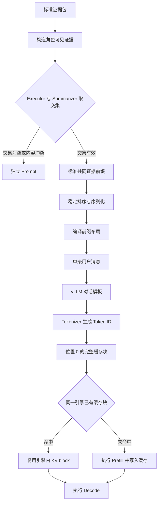
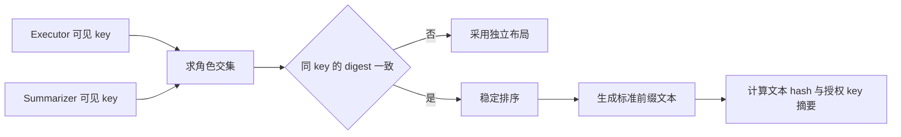
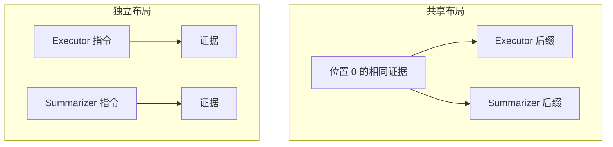
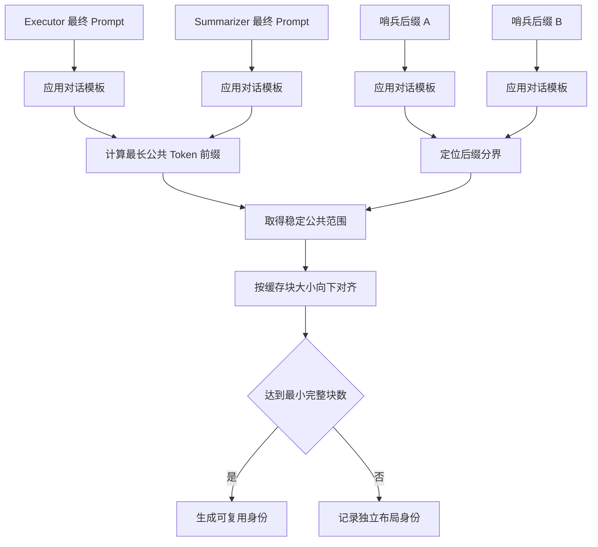
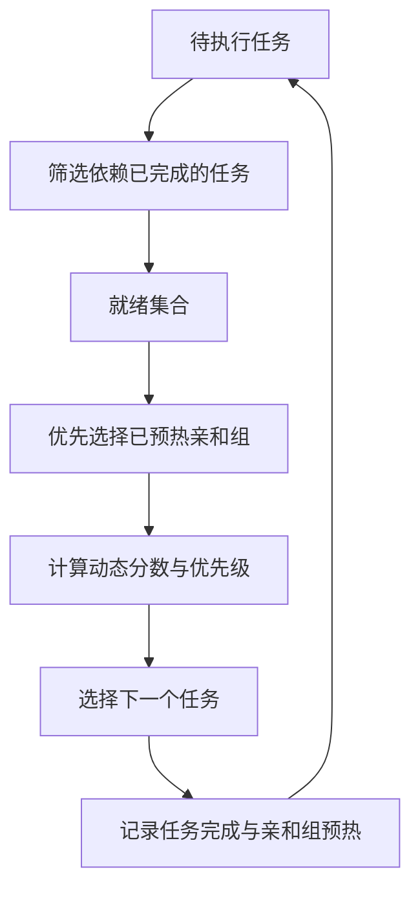

# 引擎内前缀复用

引擎内前缀复用（Engine-Local Prefix Reuse）把多个模型请求共同可见的证据编译到 Token
位置 0，由同一个 vLLM 实例的自动前缀缓存复用已经驻留的完整 KV block。StateBus 负责
证据交集、Prompt 布局、精确 Token 身份、亲和调度和命中观测，vLLM 负责 KV block 的
创建、存储与淘汰。

这条路径始终提交完整逻辑请求，KV 状态保留在同一 vLLM 引擎内。它与通过 handle 传递
KV 的显式 KV Continuation 是两套独立机制。

## 从证据到缓存块



当前共同前缀由 Executor 与 Summarizer 参与构造。Executor 可见硬事实，Summarizer 可见
硬事实和语义上下文；两个集合中 stable key 相同且 entry digest 完全一致的证据进入共同前缀。

## 共同前缀构造

`build_canonical_shared_evidence_prefix()` 依次完成四项处理：

1. 检查参与角色列表的唯一性；
2. 检查每个角色内部 stable key 的唯一性；
3. 对各角色 stable key 求交集；
4. 核对交集中同一 key 的 entry digest。

stable key 由源文档 hash 和 locator 组成。文本片段使用 canonical text ID 与字符范围，
表格事实使用 table、sheet、row 和 column。通过核对的 entry 按来源、locator、
evidence kind 和 stable key 稳定排序，再编码成 canonical JSON Lines。



`CanonicalSharedEvidencePrefix` 保存参与角色、授权 key、证据 entry、渲染文本、
layout/normalizer/visibility policy version 和布局选择原因。它作为 Prompt 编译与审计对象，
vLLM 缓存仍由引擎自身管理。

## 提示词布局

独立模式先放角色说明和动态字段，相同证据之前的 Token 会随角色发生分叉。

```text
你是 StateBus Executor。
<角色指令>
<动态载荷>
<已装载证据>
```

共享模式先放标准证据信封，再放角色后缀。

```text
<statebus-shared-prefix-v2>
<标准共同证据>
</statebus-shared-prefix-v2>

<statebus-role-suffix-v2 role="executor">
<角色指令>
<移除完全重复证据后的动态载荷>
</statebus-role-suffix-v2>
```



`compile_prefix_layout()` 从 suffix 中移除与共同前缀完全相同的 `e` payload、
text section 或 evidence block，并在后缀中保留共同前缀的合同摘要。较大 evidence slice
中的非完全匹配部分继续保留在后缀中，后续可通过 stable-key 差集进一步压缩。

## 精确 Token 身份

字符串相同经过对话模板后仍可能产生不同 Token。`compile_exact_token_prefix_identity()`
使用真实 tokenizer 和 chat template 对 Executor、Summarizer 以及两个 sentinel suffix
编码，计算最长公共 Token 前缀，再按 vLLM block size 向下对齐。



身份绑定完整请求 Token hash、共同 Token hash、block size、position base、message shape、
前缀文本 hash 和 template kwargs。共同内容位置、tokenizer/template、消息结构、完整块数
和参与请求数共同决定 `eligible` 状态。

`smoke.py` 在角色调用完成后读取 rendered request audit 并生成 exact-token identity，
用于记录最终进入模型的真实 Prompt。缓存是否命中由同一窗口内的 vLLM counter 继续确认。

## 亲和调度

相同 corpus 的请求连续执行时，cache block 更容易保留到下一次消费。
`DependencyAwarePrefixScheduler` 在依赖已满足的 ready set 内，综合 affinity、动态分数、
优先级和估算前缀长度选择下一个任务，DAG 依赖顺序保持不变。



调度 hint 只包含 corpus/evidence hash、估算 Token、affinity group 和 priority。缺失依赖、
环、自依赖和失败上游会在 ready-set 构造阶段形成对应调度状态。

## 命中观测

`smoke.py` 在任务窗口前后抓取 vLLM `/metrics`，通过单调 query/hit Token counter
计算当前任务的 delta：

```text
task_local_hit_rate = hit_token_delta / query_token_delta
```

一次有效观测由同标签 counter series、单调 delta、同一 engine instance、同一 cache epoch
和独占请求窗口共同确定。服务生命周期 hit-rate gauge 作为引擎背景指标，任务命中率使用
当前窗口的 counter delta。

结果写入 `logs/prefix_cache_observation.json`，其中包含 counter delta、控制面估算、
lineage identity、canonical prefix 和 exact-token identity。metrics 暂时不可读时，
业务请求照常完成，观测状态记为 `unavailable`。

## 运行配置

```bash
export STATEBUS_PREFIX_ALIGNMENT_MODE=shared_evidence_prefix
export STATEBUS_PREFIX_POLICY=observe
export STATEBUS_PREFIX_BLOCK_SIZE=16
export STATEBUS_PREFIX_MIN_FULL_BLOCKS=1
export STATEBUS_VLLM_TOKENIZER_PATH=/data/models/Qwen3-32B
```

vLLM 服务启用 Automatic Prefix Caching。`STATEBUS_PREFIX_ALIGNMENT_MODE` 选择共同前缀
或独立布局，`STATEBUS_PREFIX_POLICY` 控制 exact-token identity 观测。默认配置为
`independent` 和 `off`，此时角色请求采用普通 Prefill。

## 对照实验

实验使用同一 Qwen3-32B、同一 Orion 长证据、相同生成参数和五类角色请求，仅改变共同
证据是否位于 Token 位置 0。四组配对交替采用 `shared-first` 与
`independent-first` 顺序；每种模式的第一个 Planner 请求建立冷缓存，Retriever、
Executor、Summarizer 和 Verifier 构成后续复用请求。

### 全量结果

| 指标 | 未启用 | 启用 Shared Prefix | 变化 |
|:--|--:|--:|--:|
| 请求数 | 20 | 20 | 40/40 完成 |
| 平均 Prompt bytes | 29,439.6 | 29,362.0 | `-0.26%` |
| query tokens | 7,200 | 6,996 | `-204` |
| hit tokens | 0 | 5,458 | `+5,458` |
| task-local block hit | 0% | 78.016% | `+78.016 pp` |
| 全部请求平均 TTFT | 2,356.536 ms | 738.322 ms | `-68.7%` |
| 全部请求平均端到端时间 | 4,116.549 ms | 2,345.346 ms | `-43.0%` |
| 请求成功 | 20/20 | 20/20 | 40/40 |
| JSON 与角色合同 | 20/20 | 20/20 | 40/40 |

Planner 是每种模式的首个请求，因此两侧冷请求耗时接近；其余四类请求在 Shared 模式下
复用已经建立的前缀块。

| 请求角色 | TTFT 未启用 -> 启用 | 端到端未启用 -> 启用 |
|:--|--:|--:|
| Planner | 2,650.941 -> 2,624.921 ms | 4,374.059 -> 4,363.384 ms |
| Retriever | 2,275.529 -> 270.228 ms | 4,077.681 -> 2,069.348 ms |
| Executor | 2,282.767 -> 266.365 ms | 4,010.147 -> 1,619.358 ms |
| Summarizer | 2,286.492 -> 264.826 ms | 4,100.918 -> 1,755.816 ms |
| Verifier | 2,286.952 -> 265.269 ms | 4,019.940 -> 1,918.825 ms |

### 配对复用请求

| Pair | 执行顺序 | Shared warm TTFT | Independent warm TTFT | Shared warm 端到端 | Independent warm 端到端 |
|--:|:--|--:|--:|--:|--:|
| 1 | Shared-first | 268.361 ms | 2,259.095 ms | 1,877.435 ms | 4,021.576 ms |
| 2 | Independent-first | 266.034 ms | 2,273.344 ms | 1,855.560 ms | 4,080.579 ms |
| 3 | Shared-first | 268.085 ms | 2,292.431 ms | 1,794.934 ms | 4,055.210 ms |
| 4 | Independent-first | 264.208 ms | 2,306.869 ms | 1,835.419 ms | 4,051.323 ms |
| 均值 | 交替 | 266.672 ms | 2,282.935 ms | 1,840.837 ms | 4,052.172 ms |

四组配对的复用请求 TTFT 均下降，平均变化为 `-88.3%`；复用请求端到端时间下降
`54.6%`。两侧平均 Prompt 字节仅相差 `0.26%`，耗时变化来自长前缀 Prefill 的 block
复用。Decode 仍逐请求执行，因此端到端降幅小于 TTFT 降幅。

Formal 25-case 质量检查中 L0、L1、L2、L3 均为 `25/25`。40 个专项请求的输出合同为
`40/40`，共同前缀布局与独立布局均完成角色 JSON 校验。

原始汇总位于：

```text
/home/qcrs/statebus/runs/targeted_prefix_alignment_repeats_json_contract_20260714/repeat_summary.json
```

## 运行状态处理

| 状态 | 处理方式 |
|:--|:--|
| 可见性交集为空 | 编译独立 Prompt |
| 同 key 内容冲突 | 记录 `eligible=false` 并编译独立 Prompt |
| tokenizer/template 暂时不可读 | 记录 `exact_identity=unavailable` |
| 公共范围不足完整 block | 可复用 Token 记为 0 |
| metrics schema 或 delta 无效 | 业务任务完成，观测记为 `unavailable` |
| dependency 未完成 | 任务保留在待执行集合 |

canonical intersection 只序列化 Executor 与 Summarizer 已共同获权且 digest 一致的证据。
服务部署在同一信任域，`/metrics` 与完整 rendered Prompt 通过受控审计接口访问。

## 代码与测试

| 文件 | 职责 |
|:--|:--|
| `statebus/contracts/prefix.py` | 标准前缀、精确 Token 身份、意图和观测合同 |
| `statebus/runtime/prefix_identity.py` | 可见性交集、稳定渲染、Token LCP 与 block 对齐 |
| `statebus/runtime/role_path.py` | 共同信封、后缀编译和最终请求审计 |
| `statebus/runtime/smoke.py` | 运行时共同前缀、metrics 窗口和审计落盘 |
| `statebus/runtime/vllm_metrics.py` | Prometheus counter 解析与前后窗口 delta |
| `statebus/runtime/prefix_feedback.py` | 预测值与观测值的滑动窗口校准 |
| `statebus/benchmark/kv_prefix_schedule.py` | 依赖感知的语料亲和调度 |
| `statebus/benchmark/kv_prefix_experiment.py` | Shared/Independent 对照实验 |

回归测试集中在 `tests/test_prefix_render_identity.py`、
`tests/test_prefix_dependency_schedule.py`、`tests/test_prefix_metrics_observation.py`、
`tests/test_prefix_feedback.py` 和 `tests/test_kv_prefix_control_plane.py`。

Prefix、Logit 与显式 KV 在主链中的位置见[模型侧状态路径](model-state-paths.md)。
