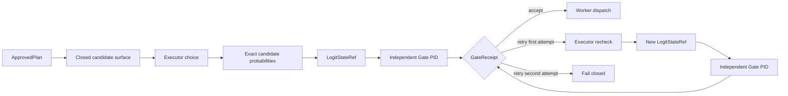
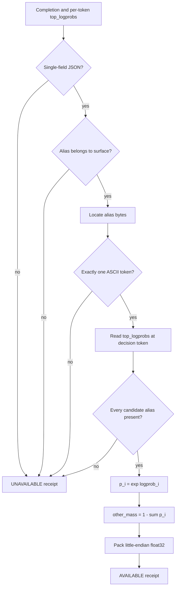
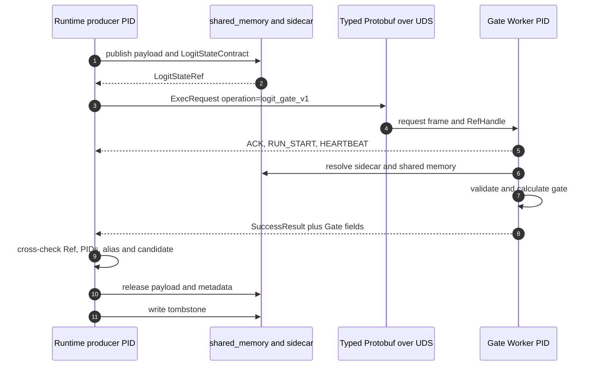
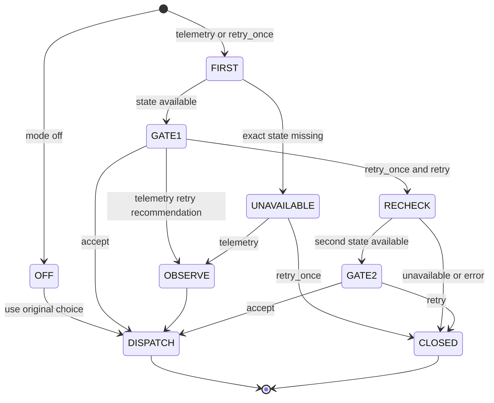

# Logit Retry Gate

Logit Retry Gate 位于 Executor 完成闭集候选选择之后、业务 Worker dispatch 之前。Executor 产生候选概率，独立 Gate PID 计算确定性判据，Runtime 再决定直接执行、重查一次或终止 dispatch。

这条路径传递的是 2 到 8 个候选的概率向量和 `other_mass`，不是完整词表 logits、hidden state 或 KV cache。

## 执行位置



Planner 不选择执行别名，Gate 不批准计划，Worker 也不自行解释概率。PlanPolicy、CapabilityGrant、Logit Gate 和 Artifact Validator 是连续但不同的授权边界。

## 候选面与选择 token

`CandidateSurfaceV2` 为每个候选绑定一个稳定 ASCII alias：

```text
A -> candidate ID + candidate digest
B -> candidate ID + candidate digest
...
H -> candidate ID + candidate digest
```

候选 digest 覆盖 candidate ID、route、tool name 和 supporting document IDs。`candidate_surface_digest` 绑定候选内容，`alias_mapping_digest` 绑定 ordinal、alias 与 candidate ID 的映射。两个摘要贯穿 Producer Receipt、sidecar 和 GateReceipt，防止把一组候选的概率用于另一组候选。

开启 Gate 后，Executor 只返回一个封闭字段：

```json
{"choice_code":"B"}
```

JSON schema 禁止额外字段。业务 route 和 tool 由 alias mapping 恢复，不从自由文本中解析。这样可以把决策位置定位到一个 ASCII token，并读取该位置的真实 `top_logprobs`。

## 概率提取

生产路径使用 `extract_exact_choice_logit_state()`：



提取失败时不做 softmax 补全，也不采用模型自报 confidence。常见 unavailable 原因包括 JSON 不合法、alias 不在候选面、alias 跨多个 token、completion bytes 不能重建、某个候选缺失 top logprob，以及概率和超出容差。

## 二进制状态

载荷布局固定为候选顺序加 `other_mass`：

```text
dtype                 little-endian float32
probability semantics candidate_order_plus_other_mass_v1
payload bytes         4 * (candidate_count + 1)
```

两候选 case 的布局为：

```text
0          4          8          12
+----------+----------+----------+
| p(A) f32 | p(B) f32 | other f32|
+----------+----------+----------+
```

两候选状态为 12 B，八候选状态为 36 B。`other_mass` 保留候选集合之外的概率质量，参与 entropy 计算，但当前 top-1 与 margin 只在候选概率之间计算。

## 发布、跨进程消费与释放



`LogitStateContract` 绑定 state/task/trace/request/attempt、候选面、selected alias、producer PID、lease、payload hash、size、dtype 和 storage kind。当前实现要求物理载体为 shared memory；若存储策略降级到其他后端，发布直接失败。

Gate Worker 校验 lease、Ref、hash、shape、概率范围和概率和。Runtime 收到结果后再次核对 consumed state ID、transport worker PID、producer PID、selected alias 和 candidate ID。`LogitGateReceipt` 禁止 producer PID 与 consumer PID 相同。

`run_logit_gate_attempt()` 在 `finally` 中释放状态。Gate 错误或回执校验失败也会清理 shared memory，并留下 release tombstone。

## 判定公式

候选概率降序后的前两项为 `p1` 和 `p2`：

```text
top_margin = p1 - p2

ACCEPT iff
  selected alias is candidate top-1
  and top_margin >= 0.10

otherwise RETRY
```

| 条件 | Gate action | reason |
|:--|:--|:--|
| selected 不是候选 top-1 | `RETRY` | `selected_alias_not_top1` |
| selected 是 top-1，但 margin 小于 0.10 | `RETRY` | `top_margin_below_threshold` |
| selected 是 top-1，且 margin 至少 0.10 | `ACCEPT` | `selected_alias_is_top1_and_margin_passed` |

Gate 只返回 `ACCEPT` 或 `RETRY`。`fail_closed` 是 Runtime 对第二次 `RETRY`、第二次状态 unavailable 或 Gate 错误形成的终态。

## 三种模式



| 模式 | 发布状态 | Gate 改变控制流 | 错误处理 |
|:--|:--:|:--:|:--|
| `off` | 否 | 否 | 使用原候选路径 |
| `telemetry` | 是 | 否 | 记录 accept/retry/unavailable/error 后继续 |
| `retry_once` | 是 | 是 | 首次 retry 重查；其后 fail closed |

一次角色调用内部的 JSON/schema 修复与 Logit Gate retry 不是同一件事。前者只修复输出格式；后者在第一次完整选择已经合法但数值门不授权时，再发起一次 Executor 选择。

## 运行时记录

每次尝试形成：

- `LogitProducerReceipt`：提取状态、候选摘要、selected alias 和 unavailable 原因；
- `LogitStateRef` 与 sidecar：物理载体和租约；
- typed control exchange audit：ACK、Worker PID 和结果帧；
- `LogitGateReceipt`：action、reason、top-1、margin、entropy 和 PIDs；
- release tombstone：释放原因、字节数、hash 和 producer/consumer PID。

任务级汇总写入 `logs/logit_gate.json` 和 `logs/task_metrics.json`。终态包括 `accepted_initial`、`accepted_after_retry`、`telemetry_accept`、`telemetry_retry_recommended`、`logit_unavailable` 与 `fail_closed`。

## 受控实验

自然任务通常不会稳定地产生低 margin，因此验证集分成三组：

| 分组 | 数量 | 首次可见信息 | 预期行为 |
|:--|--:|:--|:--|
| 简单对照 | 5 | 合同完整 | 首次接受，不误触发 retry |
| 受控歧义 | 5 | 最小 RoleView，候选在可见信息下等价 | 低 margin 后展开完整合同，只重查一次 |
| 不可判定负例 | 2 | 即使展开后也没有合法选择 | 第二次仍不授权，阻止 Worker dispatch |

挑战中的 vLLM 对 alias `A` 有明显位置偏差。实验对同一 RoleView 运行 AB/BA 两次，交换候选与 alias 的绑定，按 candidate ID 对齐概率后取均值。AB/BA 只用于受控挑战校准，正式 Runtime 的单次 Gate 不会自动增加这一对反事实请求。

24 次 A/B 运行串行且交替顺序，`off` 与 `retry_once` 的首次选择在 12/12 配对任务中一致。Gold 与模型可见 manifest 分离。

### 结果

| 分组 | Gate off | Retry once | Retry 触发 | 行为变化 |
|:--|--:|--:|--:|:--|
| 简单对照 | 5/5 | 5/5 | 0/5 | 无误触发 |
| 受控歧义 | 3/5 | 5/5 | 5/5 | 2 个错误路由被纠正 |
| 不可判定负例 | 0/2 | 2/2 | 2/2 | 错误放行 `2 -> 0` |
| 全部 Validator | 8/12 | 12/12 | 7/12 | challenge gate pass |

受控歧义的 5 个任务都在 recheck 后获得授权，其中 2 个改变候选，3 个保持原候选但 margin 达标。不可判定的 2 个任务都没有进入 Worker。

| 状态闭环 | 结果 |
|:--|--:|
| Gate 状态尝试 | 19 |
| 跨 PID 消费 | 19/19 |
| 正确释放 | 19/19 |
| 两候选单次状态 | 12 B |
| 发布并释放总量 | 228 B |

原始汇总位于：

```text
/home/qcrs/statebus/runs/logit_retry_challenge_20260727_222823/summary.json
```

### 成本

| 模式 | vLLM 调用 | 总 Token |
|:--|--:|--:|
| Gate off | 24 | 6,110 |
| Retry once | 38 | 9,952 |

这组结果证明概率状态能够改变 dispatch，不构成 Token 或时延优化。`12/12` 属于独立诊断套件，不能并入正式 `95/95` 基线。

## 失败策略

| 失败 | `telemetry` | `retry_once` |
|:--|:--|:--|
| exact probability unavailable | 记录后继续 | fail closed |
| shared memory、lease 或 hash 无效 | 记录 error 后继续 | fail closed |
| selected 不是 top-1 | 记录 retry 建议后继续 | 首次重查，第二次关闭 |
| margin 小于 0.10 | 记录 retry 建议后继续 | 首次重查，第二次关闭 |
| Ref、PID 或候选绑定不一致 | 记录 error 后继续 | fail closed |

所有已经发布的状态都由 `finally` 路径释放。业务 Worker 只有在 Runtime 确认最终授权后才会收到 dispatch。

## 配置、代码与测试

```bash
export STATEBUS_LOGIT_GATE_MODE=telemetry
# 或在受控场景启用：
export STATEBUS_LOGIT_GATE_MODE=retry_once
```

| 文件 | 职责 |
|:--|:--|
| `statebus/contracts/logit.py` | candidate surface、概率语义、Producer/Gate receipts |
| `statebus/runtime/logit_state.py` | exact choice token 定位、概率提取与 float32 序列化 |
| `statebus/state/logit_state.py` | 发布、解析、Gate 计算、释放和 tombstone |
| `statebus/runtime/logit_gate.py` | 独立 Worker 调用和 Runtime 交叉验证 |
| `statebus/runtime/role_path.py` | 闭集 schema、首次选择和 recheck prompt |
| `statebus/control/subprocess_worker.py` | `logit_gate_v1` 的独立 PID 消费 |
| `statebus/runtime/smoke.py` | 三种模式、业务 dispatch 边界和审计落盘 |
| `statebus/benchmark/logit_retry_challenge.py` | 12-case challenge、AB/BA 和配对汇总 |

主要回归位于 `tests/test_logit_gate.py`、`tests/test_logit_state.py` 和 `tests/test_logit_retry_challenge.py`。完整挑战走读见 [Logit Retry Gate 受控挑战](../walkthrough/logit-retry-challenge.md)，与 Prefix/KV 的位置关系见 [模型侧状态路径](model-state-paths.md)。
