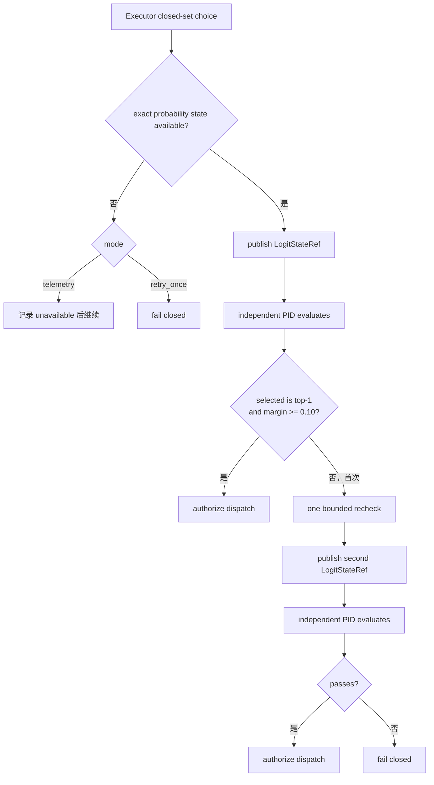

# Logit Retry Gate：执行前的数值授权门

Logit Retry Gate 位于 Executor 完成闭集候选选择之后、CodeAct 或其他业务 Worker 真正执行之前。它解决的不是“再让模型想一次”这么简单，而是把候选概率物化成独立的非文本状态，由另一个 PID 计算确定性判据，再让 Runtime 根据结构化回执选择继续、重查或拒绝。Agent 负责产生候选分布，Gate 负责计算，Runtime 保留最终控制权。

机制提供三种模式。`off` 沿用候选选择，不发布 `LogitStateRef`；`telemetry` 真实发布、跨进程消费并记录 Gate 建议，但不改变业务控制流；`retry_once` 将 Gate 回执接入授权边界，首次不通过时只允许一次重新选择，第二次仍不通过或概率状态不可用时 fail closed。

Gate 的 margin 是候选概率中第一名与第二名之差，不把 `other_mass` 当成候选。只有模型实际选中的别名同时也是 top-1，且 `top_margin >= 0.10`，`LogitGateAction` 才是 `ACCEPT`；否则返回 `RETRY`。`LogitGateAction` 本身只有 accept/retry，第二次 retry 后的 fail-closed 终态由 Runtime 形成。

当前通用 Runtime recheck 会向 Executor 明确说明“先前选择未通过数值置信门”，要求在同一闭集候选中重新判断，不能为了保持一致而机械沿用旧别名。具体能否展开更多 RoleView 由调用场景决定：受控挑战会在第二次显式展开完整候选合同；普通 Runtime 不应凭 Gate 自行扩大语料、CapabilityGrant 或输入 Ref 范围。

Gate 调用仍使用正式控制协议。Runtime 发送 `ExecRequest(operation="logit_gate_v1")`，其中只含 `RefHandle(ref_kind="logit_state")`、身份字段和 output contract；独立 Worker 返回带 Gate 字段的 `SuccessResult`。传输成功不自动等于授权成功，Runtime 还要确认消费 state ID、worker/consumer PID、producer PID、selected alias 和 candidate ID 全部与发布合同一致。

每次尝试都会形成 `LogitProducerReceipt`、`LogitGateReceipt`、UDS transport audit 和 release tombstone。`smoke.py` 将最终状态归一为 `accepted_initial`、`accepted_after_retry`、`telemetry_accept`、`telemetry_retry_recommended`、`logit_unavailable` 或 `fail_closed`，并把完整记录写入 `logs/logit_gate.json`。这使“模型犹豫过”与“犹豫真的改变了执行路径”能够分开审计。

该机制不承诺降低 Token 或时延。真实概率提取需要模型返回 top logprobs，retry 会增加一次角色请求；受控挑战的 AB/BA 校准还会让每个选择阶段执行两次反事实探测。它的价值是把不确定性变成可测、可回执、可拒绝的授权条件，而不是把额外调用包装成性能收益。

主要实现位于 [`runtime/logit_gate.py`](../../../v2/runtime/logit_gate.py)、[`runtime/role_path.py`](../../../v2/runtime/role_path.py)、[`runtime/smoke.py`](../../../v2/runtime/smoke.py) 和 [`control/subprocess_worker.py`](../../../v2/control/subprocess_worker.py)。状态载体见[LogitState](../state/logit-state.md)，受控效果见[挑战实验走读](../walkthrough/logit-retry-challenge.md)。

