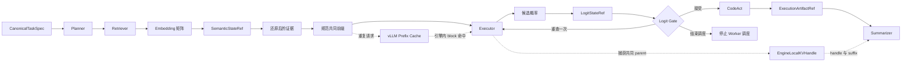
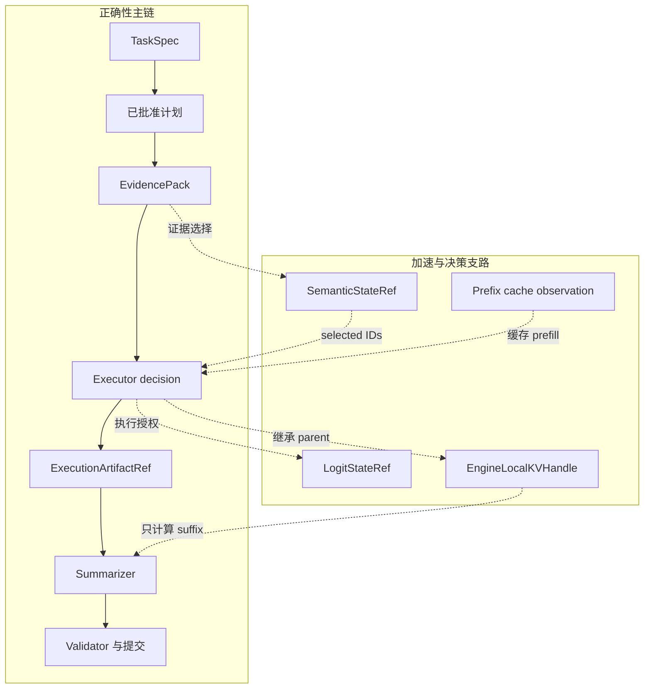
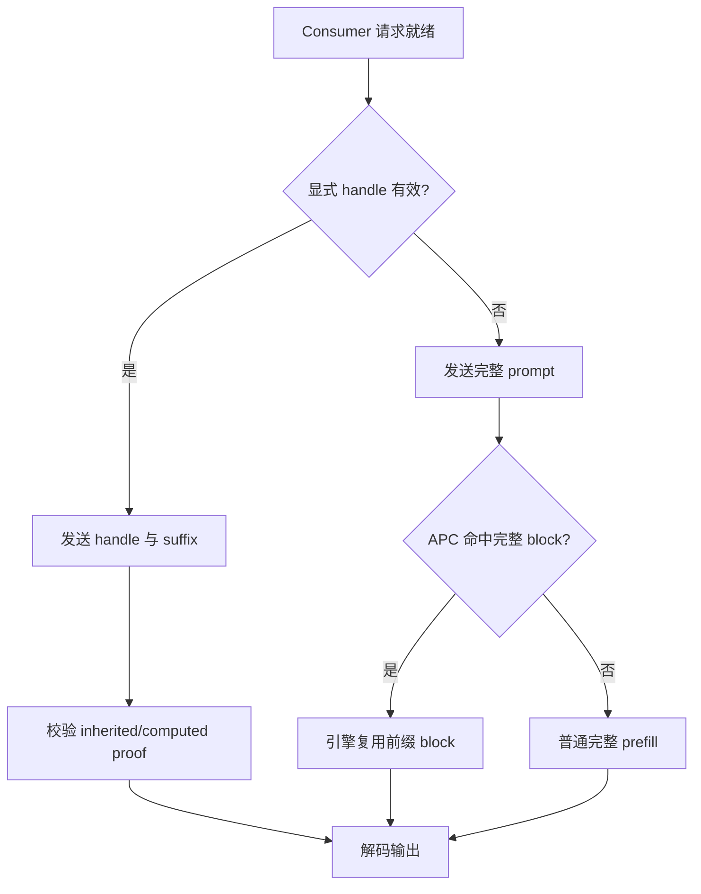

# 模型侧状态路径

StateBus 在模型调用前后处理四类数值或计算状态。它们处在不同阶段，解决的问题也不同：Embedding 负责筛选证据，Logit Gate 负责执行授权，Prefix Reuse 负责跨请求复用相同前缀，显式 KV Continuation 负责在同一任务的相邻角色之间继承已经计算的前缀。

## 四条路径与作用范围

| 路径 | StateBus 管理的对象 | 主要动作 | 作用范围 | 默认状态 |
|:--|:--|:--|:--|:--|
| Embedding | `SemanticStateRef` | 发布 float32 query/candidate matrix，跨 PID 选择行号 | 检索和证据选择 | 由状态层配置决定 |
| Logit | `LogitStateRef`、`LogitGateReceipt` | 发布候选概率，独立 PID 计算 top-1 与 margin | Executor 到业务 Worker 的授权阶段 | `off` |
| Prefix | canonical prefix、exact-token identity、counter observation | 把共同证据放在 token position 0，由 vLLM 自动命中 block | 同一 engine 的独立请求 | alignment `independent`，policy `off` |
| 显式 KV | `EngineLocalKVHandle`、`KVForwardProof` | Producer 捕获 paged KV，Consumer 加载后只计算 suffix | 同一 engine、同一任务、相邻角色 | `off` |

Embedding 和 Logit 使用 StateBus 的 Ref、sidecar 和 typed control path。Prefix 由 vLLM
Automatic Prefix Caching 创建和淘汰缓存。显式 KV 使用独立的 engine-local handle，并通过
feature flag 接在角色客户端外侧。

## 正确性主链与加速支路

无论 Prefix 或显式 KV 是否开启，任务事实、计划、证据、CodeAct 产物和质量门都沿原主链流动。模型侧复用只改变前缀的物理计算来源。

Prefix metrics unavailable 时任务继续执行并把 observation 标为 `unavailable`；KV handle
unavailable 时实验模式进入失败终态，产品模式可显式回到 full replay，并分别记录 load 与
fallback；Logit `retry_once` 的状态或回执不完整时进入 `fail_closed`。

## Prefix 与显式 KV 的关系

两者都减少重复 prefill，但命中方式和请求形态不同。

| 维度 | Engine-Local Prefix Reuse | Explicit KV Continuation |
|:--|:--|:--|
| 发现方式 | vLLM 根据相同 token block 自动匹配 | StateBus 显式创建并传递 handle |
| 典型方向 | 横向：多个独立请求 | 纵向：同一任务的 Producer 到 Consumer |
| Consumer 请求 | 仍发送完整 prompt | 只发送 handle 和 suffix token IDs |
| 状态所有者 | vLLM prefix cache | Worker-local bounded registry |
| 真实性证据 | before/after block counter delta | capture/load/release、scheduler proof、Worker proof |
| 生命周期控制 | 引擎自行驻留和淘汰 | one-shot、TTL、容量门和显式 release |

统一运行时可以同时配置两者，并对 inherited token 采用单一来源记账：已有合法显式 handle
时走 continuation；其余请求发送完整 prompt，让 APC 尝试自动命中。当前两组实验各自关闭
另一条路径，使指标直接对应单一机制。

## 三组专项实验

这些数字来自不同任务和不同 A/B，分别按各自分母汇总。

| 机制 | 对照设计 | 主要结果 | 资源与统计 |
|:--|:--|:--|:--|
| Logit Gate | 12 个 case，`off` 对 `retry_once` | Validator `8/12 -> 12/12`；歧义任务 `3/5 -> 5/5`；不可判定错误放行 `2 -> 0` | vLLM 调用 `24 -> 38`，Token `6,110 -> 9,952` |
| Prefix Reuse | 四组交替顺序，20 shared 对 20 independent 请求 | block hit rate `0% -> 78.016%`；全部请求平均 TTFT `2,356.536 -> 738.322 ms`；端到端 `4,116.549 -> 2,345.346 ms` | 输入规模只差约 `0.26%`，收益来自 prefill 复用 |
| 显式 KV | 10 个完整主链任务，full replay 对 continuation | computed prefill p50 `4,806.5 -> 710.5`；TTFT `1,618.138 -> 620.980 ms`；主链 wall 下降 `5.69%` | 每个 4k handle 为 1 GiB；Producer p50 增加 `6.39%` |

Logit 将候选概率用于降低错误执行；Prefix 的请求体保留完整前缀并复用 prefill；显式 KV
保持 logical prompt 一致，将 4,096 个 token 的物理来源从 Consumer 重算改为继承。

## 开关与审计文件

| 机制 | 主要开关 | 关键审计文件 |
|:--|:--|:--|
| Logit | `STATEBUS_LOGIT_GATE_MODE=off|telemetry|retry_once` | `logs/logit_gate.json`、Logit tombstone、runtime events |
| Prefix | `STATEBUS_PREFIX_ALIGNMENT_MODE=independent|shared_evidence_prefix`、`STATEBUS_PREFIX_POLICY=off|observe|on` | `logs/prefix_cache_observation.json`、rendered request audit、task metrics |
| 显式 KV | `STATEBUS_ENGINE_LOCAL_KV_MODE=off|full_replay|continuation` | `engine_local_kv_mainline.json`、service telemetry、suite `summary.json` |

详细实现分别见 [Logit Retry Gate](logit-retry-gate.md)、[Engine-Local Prefix Reuse](engine-local-prefix-reuse.md) 和 [显式 Engine-Local KV Continuation](engine-local-kv-continuation.md)。Embedding 路径见 [稠密语义状态](../state/dense-semantic-state.md)。
