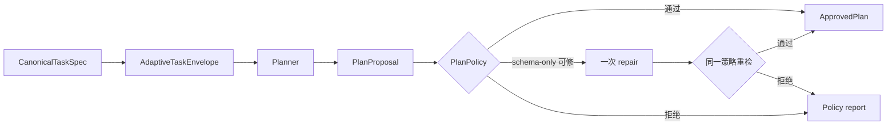

# 计划策略与能力授权

Planner 输出的是 `PlanProposal`，不是可以直接发给 Worker 的命令。一个 proposal 由多个 `PlanStepProposal` 组成，每步声明 role、capability、goal、依赖、输入 Ref、输入 Ref 类型、输出合同、完成条件、失败策略和必需字段。Runtime 用 [`PlanPolicyValidator`](../../../statebus/runtime/plan_policy.py) 把模型建议限制在当前任务 envelope 和 capability registry 内。



策略检查不是单纯的 schema validation。它覆盖 task ID、步骤预算、最终输出合同、记忆策略、Planner Token 预算、step ID 唯一性、角色基数、capability owner、输入 Ref 类型、DAG 环、依赖深度、多段 Executor 字段流和总 attempt 预算。通过后生成的 `ApprovedPlan` 保存 policy report hash、capability registry digest 和 total attempt budget。

`validate_with_single_repair()` 允许一次 schema-only repair。修复只能处理编码或 schema 层问题，不能更换 capability、改变 DAG、增加 Ref、扩大预算或改写任务权威。修复结果继续走完整策略门。注册的 deterministic fallback proposal 也必须重新校验，不是绕过 Planner 风险的隐藏通道。

ApprovedPlan 仍然不是执行权限。Runtime 在准备某个 step/attempt 时创建 `CapabilityGrant`，把以下信息绑定在同一个可 hash 合同中：

| Grant 字段 | 约束作用 |
|:--|:--|
| task/session/step/attempt | 防止授权跨任务或跨重试复用 |
| capability ID/version | 固定实际调用的注册能力及版本 |
| `input_ref_ids` | 限制本次执行可以读取的对象 |
| output contract version | 限制允许产生的结果 schema |
| workspace root ID | 限制可写目录 |
| max runtime / expires at | 限制运行时长与授权寿命 |
| approved plan hash | 防止 Grant 脱离已批准计划 |

```text
ApprovedPlan step
   capability = bounded_python.table_anomaly
   refs       = evidence-pack-X, semantic-state-Y
   output     = anomaly_result.v1
               │
               ▼
CapabilityGrant
   session + attempt + exact refs + workspace + expiry
               │
               ▼
ExecRequest.capability_grant_hash
```

dispatch 前，Runtime 再根据当前 Ref Registry 和 ApprovedPlan 复核 Grant。这样即使早期批准之后某个 Ref 已失效、输出合同被替换或授权已过期，请求也会在进入 Worker 前被拒绝。

新增 capability 时，不能只登记一个函数名。它至少需要 owner role、版本、输入 Ref kind、输出合同、风险等级、Validator 和预算；若允许 LLM Python，还要显式开启 envelope 的 `allow_llm_python`，而不是让 Planner 自行选择任意执行面。

主要类型位于 [`statebus/contracts/adaptive.py`](../../../statebus/contracts/adaptive.py)，能力表与校验测试可参考 [`test_adaptive_capability_surface.py`](../../../tests/test_adaptive_capability_surface.py) 和 [`test_adaptive_mainline_integration.py`](../../../tests/test_adaptive_mainline_integration.py)。

