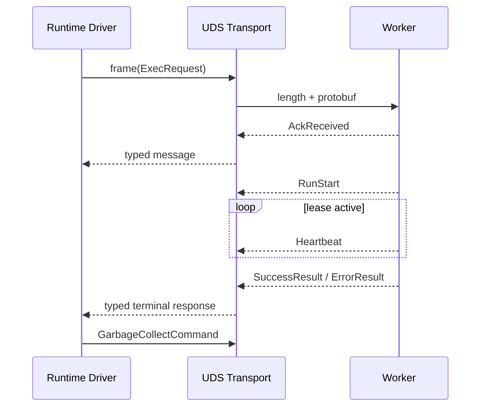

# Protobuf 与 UDS 控制协议

正式 v2 控制消息定义在 [`messages.py`](../../../v2/control/messages.py) 与 [`statebus_v2.proto`](../../../v2/control/statebus_v2.proto)。消息共享 `ControlHeader`，具体 body 通过 Protobuf `oneof` 选择。Header 固定 trace、task、step、attempt、目标角色、timeout、event type 和 schema version，使每条线路事件都能回到具体执行尝试。

| 消息 | 主要字段 | 语义 |
|:--|:--|:--|
| `ExecRequest` | ReusePolicy、state/artifact/memory refs、operation、workspace、manifest、encoder signature、Grant hash | 请求一个已批准 attempt |
| `AckReceived` | `acked_at_ns` | Worker 已接收并解析，不代表开始执行 |
| `RunStart` | 开始时间、heartbeat interval、lease timeout | Worker 进入运行态 |
| `Heartbeat` | 时间与 worker state | 刷新 attempt 活性 |
| `SuccessResult` | 输出 Ref、消费状态、选择 ID/分数/行号、PIDs、encoder signature 或 GateReceipt 字段 | 进程执行完成，等待 Runtime 复核 |
| `ErrorResult` | error code/detail、失败时间 | 可归因的执行失败 |
| `CancelCommand` | 原因与发出时间 | 主动终止 |
| `TrapFatal` | trap reason/detail | timeout 或不可恢复 Worker 异常 |
| `GarbageCollectCommand` | Ref IDs | 终态后的资源结算 |

`ExecRequest` 把 `state_refs`、`artifact_refs` 与 `memory_refs` 分开，避免下游仅凭字符串 ID 猜类型。`input_manifest_hash` 和 `hydrate_manifest_id` 固定来源面，`expected_encoder_signature` 限制稠密状态兼容，`capability_grant_hash` 连接线路请求与授权对象。

Logit Gate 复用同一控制合同：`operation="logit_gate_v1"` 的请求只携带 `LogitStateRef` handle 和输入 manifest hash，独立 Worker 返回 consumed ref、producer/consumer PID、gate action/reason、selected/top-1 alias、margin、entropy 与 decision ID。Protobuf 能保存这些结构化字段，但最终是否执行、重查或 fail closed 仍由 Runtime 根据 Gate 模式和尝试次数决定。

[`transport.py`](../../../v2/control/transport.py) 使用 `AF_UNIX/SOCK_STREAM`。每个序列化 payload 前有 4 字节 big-endian 长度，接收端通过 `_recv_exact()` 读取完整帧。长度不一致、body 缺失或 schema 无法解析都会失败，不会把残帧当成合法消息。

```text
wire frame
┌──────────────────────────┬─────────────────────────────────────┐
│ 4-byte payload length BE │ serialized ControlEnvelope protobuf │
└──────────────────────────┴─────────────────────────────────────┘
```

UDS 路径受 `sockaddr_un.sun_path` 长度限制。`effective_unix_socket_path()` 在路径过长时使用原绝对路径的 SHA-256 摘要生成稳定短路径，并在必要时落到用户相关的 `/tmp/statebus-v2-uds-<uid>/`，避免深层 Run 目录导致 bind 失败。



仓库保留 canonical JSON/text carrier 作为 comparator 和诊断路径，使相同逻辑消息可以比较不同表示的线路载荷。它不是正式 v2 主合同，也不应反向影响 Protobuf 的字段和状态语义。

协议只保证消息可解析和关联，不保证业务正确。`SuccessResult` 返回后仍要检查 Ref、hash、schema、PID/encoder 回执和 Validator。新增消息字段时，应保持控制面“小而可验证”；若字段实际承载完整文档、矩阵或产物，应改为 Ref。

协议测试可从 [`test_control_plane.py`](../../../tests/v2/test_control_plane.py) 和 [`test_runtime_session_and_ledger.py`](../../../tests/v2/test_runtime_session_and_ledger.py) 查找；若具体文件名发生变化，可在 `tests/v2` 中检索 `ExecRequest` 与 `ControlEnvelope`。
