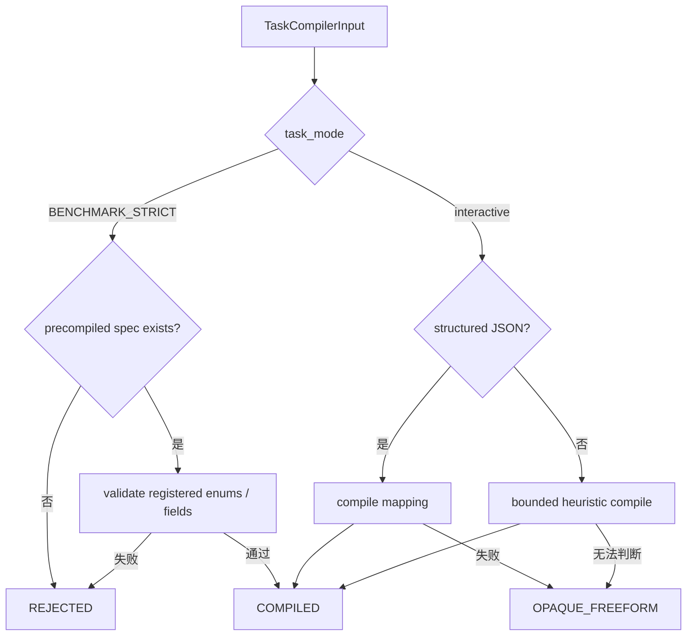

# 任务编译与正式任务合同

[`TaskCompiler`](../../../statebus/runtime/compiler.py) 是 Runtime 的入口边界。它不负责生成执行计划，而是把调用方的请求收敛为 `CanonicalTaskSpec`，让 Planner、Retriever、Executor、Summarizer 和 Replay Gate 使用同一个任务事实面。

`TaskCompilerInput` 包含原始 request text、任务模式、可选的 corpus family、requested outputs，以及可选的预编译 spec。交互模式可以解析带 `task_family` 与 `intent_op` 的 JSON，也可以使用受限启发式规则。无法可靠规范化时返回 `OPAQUE_FREEFORM` 和 warning，上层可以选择交互降级，但不能把它当成正式 benchmark 输入。

在 `BENCHMARK_STRICT` 模式下，缺少预编译 spec 会返回 `benchmark_strict_requires_precompiled_canonical_spec`。这样做是为了固定实验任务：同一 case 的 task family、intent、目标实体、期间、输出和工具要求由版本化样本定义，而不是由模型临场猜测。

| 字段 | 含义 | 使用方 |
|:--|:--|:--|
| `task_family` | 注册任务族 | capability 路由、记忆过滤、覆盖统计 |
| `intent_op` | 规范化操作 | Planner 约束、Replay Gate、Validator |
| `target_entities` | 公司、指标、产品等目标 | 检索 query、tag、证据范围 |
| `time_scope` | 当前数据期间 | locator 过滤、记忆兼容 |
| `required_outputs` | 必须交付的字段或结论 | 输出合同与质量门 |
| `required_tools` | 允许/需要的注册工具 | capability catalog |
| `arguments` | 任务族定义的参数 | Executor 与业务 Validator |

`CanonicalTaskSpec.canonical_payload()` 对字典字段做稳定排序，`spec_hash` 由此计算。后续计划、Grant、MemoryRef 与 ReplayLedger 保存这个 hash，从而把一次结果绑定到明确的任务定义。

任务合同并不包含自由 Python，也不允许调用方用 `arguments` 塞入任意路径或 shell。具体 capability 会再次验证参数、输入 Ref 和 workspace。编译成功只表示任务可以进入 Planner 阶段，不表示任务已经获准执行。

与 task spec 分开的 [`RuntimeCompatibilitySignature`](../../../statebus/contracts/models.py) 保存 OS、Python、依赖、工具注册表、Prompt bundle 和 extractor bundle 摘要。任务相同但运行签名变化时，历史记忆可以降级为 assist 或被拒绝，不能只依赖自然语言相似度恢复结果。

正式任务样本和任务族在 [`statebus/benchmark/samples`](../../../statebus/benchmark/samples/)；相关合同回归可从 [`test_runtime_and_benchmark.py`](../../../tests/test_runtime_and_benchmark.py) 与 [`test_contracts_and_refs.py`](../../../tests/test_contracts_and_refs.py) 开始阅读。

