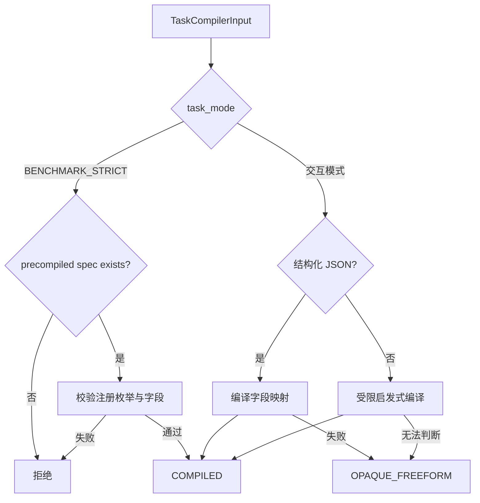

# 任务编译与正式任务合同

[`TaskCompiler`](../../../statebus/runtime/compiler.py) 是 Runtime 的任务入口。它把调用方请求
收敛为 `CanonicalTaskSpec`，让 Planner、Retriever、Executor、Summarizer 和 Replay Gate
使用同一个任务事实面；执行计划在后续 Planner 阶段生成。

`TaskCompilerInput` 包含原始 request text、任务模式、可选的 corpus family、requested outputs，
以及可选的预编译 spec。交互模式解析带 `task_family` 与 `intent_op` 的 JSON，也支持受限
启发式规则；规范化结果为 `OPAQUE_FREEFORM` 时进入交互路径。正式 benchmark 使用版本化的
预编译 spec。

在 `BENCHMARK_STRICT` 模式下，预编译 spec 是任务入口；缺失时返回
`benchmark_strict_requires_precompiled_canonical_spec`。同一 case 的 task family、intent、
目标实体、期间、输出和工具要求均由版本化样本固定。

| 字段 | 含义 | 使用方 |
|:--|:--|:--|
| `task_family` | 注册任务族 | capability 路由、记忆过滤、覆盖统计 |
| `intent_op` | 规范化操作 | Planner 约束、Replay Gate、Validator |
| `target_entities` | 公司、指标、产品等目标 | 检索 query、tag、证据范围 |
| `time_scope` | 当前数据期间 | locator 过滤、记忆兼容 |
| `required_outputs` | 必须交付的字段或结论 | 输出合同与质量门 |
| `required_tools` | 允许/需要的注册工具 | capability catalog |
| `arguments` | 任务族定义的参数 | Executor 与业务 Validator |

`CanonicalTaskSpec.canonical_payload()` 对字典字段做稳定排序，`spec_hash` 由此计算。后续计划、Grant、MemoryRef 与 ReplayLedger 保存这个 hash，从而把一次结果绑定到明确的任务定义。

任务合同保存任务族定义的参数；自由 Python、文件路径和 shell 由后续 capability 与 workspace
策略管理。编译成功后任务进入 Planner 阶段，执行资格再由 PlanPolicy 和 CapabilityGrant 签发。

与 task spec 分开的 [`RuntimeCompatibilitySignature`](../../../statebus/contracts/models.py) 保存
OS、Python、依赖、工具注册表、Prompt bundle 和 extractor bundle 摘要。运行签名变化时，
历史记忆按兼容判断进入 assist、validated replay 或当前任务重算。

正式任务样本和任务族在 [`statebus/benchmark/samples`](../../../statebus/benchmark/samples/)；相关合同回归可从 [`test_runtime_and_benchmark.py`](../../../tests/test_runtime_and_benchmark.py) 与 [`test_contracts_and_refs.py`](../../../tests/test_contracts_and_refs.py) 开始阅读。
