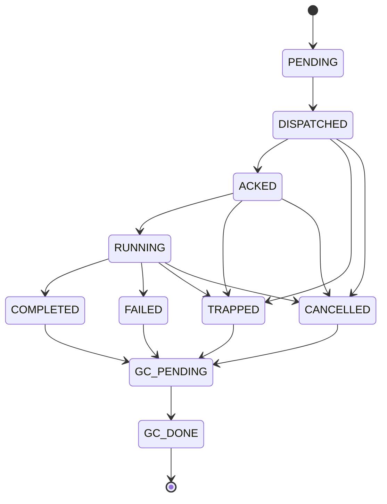
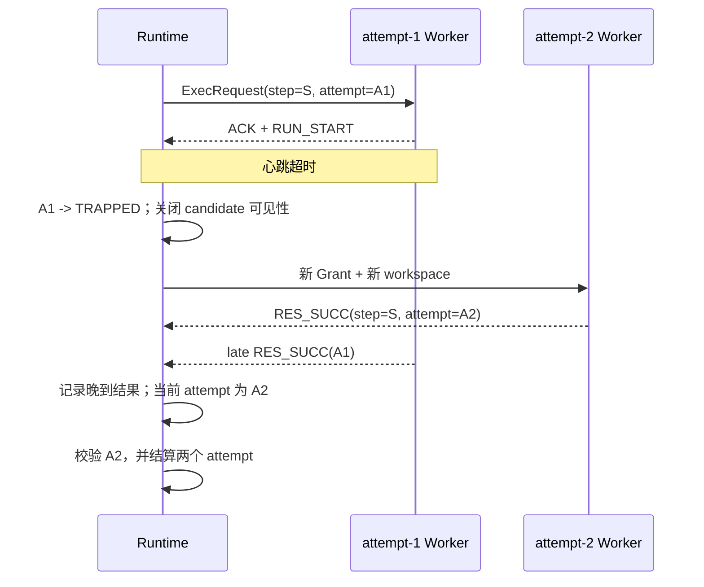

# Worker 生命周期与 attempt 隔离

[`RuntimeSupervisor`](../../../statebus/runtime/supervisor.py) 将一个 step 的网络接收、实际运行
和业务终态拆开管理。`step_id` 表示批准计划中的逻辑步骤，`attempt_id` 表示这个步骤的一次
具体执行。重试沿用 step ID，并创建新的 attempt、Grant 和 workspace。

`ACKED` 只说明 Worker 已收到请求；`RUNNING` 从 `RunStart` 开始，并用 heartbeat 刷新 lease。ACK timeout 表示请求没有及时确认，heartbeat timeout 表示已经接收或启动的 Worker 失去活性，两者进入 `TRAPPED`。业务程序返回明确错误则进入 `FAILED`，用户或上层调度取消进入 `CANCELLED`。

FAILED 通常有稳定 ErrorResult、stdout/stderr 或候选文件；TRAPPED 表示 Worker 状态未知，
系统先关闭下游可见性，再处理进程和资源；CANCELLED 保留取消来源。三类终态分别进入对应
恢复和结算流程。

控制 Header、CapabilityGrant、workspace、ArtifactRef 与 Telemetry 都携带 attempt ID。Runtime
按当前 attempt 接受合法状态迁移；旧 attempt 的晚到结果保留 hash 和诊断记录，candidate
维持原终态。

重试可以复用内容 hash 未变、状态仍为 verified/active 且可重新授权的上游 Ref。新 Grant
只接收这些上游对象，失败 attempt 产生的 candidate 留在原 workspace 作为诊断材料。

所有终态最终进入 `GC_PENDING -> GC_DONE`。GC 处理 StateRef lease、shared memory/mmap、
Worker 进程组、workspace candidate 与未提交 Memory proposal。清理逻辑采用幂等实现，以
处理取消、timeout 与进程退出同时触发结算的情况。

Supervisor 是内存状态机，持久诊断由 Telemetry、sidecar 和 Ledger 补充。Studio 作业重启后的恢复不尝试复活原进程，而是把原 QUEUED/RUNNING 作业收敛为中断终态并保留事件，再允许用户新建 Run。
