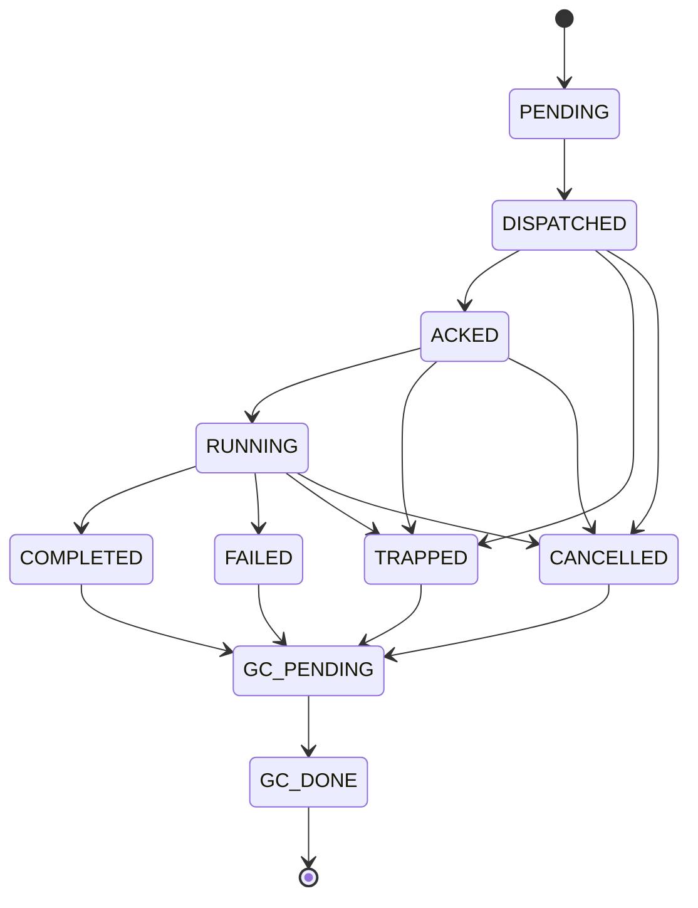

# Worker 生命周期与 attempt 隔离

[`RuntimeSupervisor`](../../../statebus/runtime/supervisor.py) 将一个 step 的网络接收、实际运行和业务终态拆开管理。`step_id` 表示批准计划中的逻辑步骤，`attempt_id` 表示这个步骤的一次具体执行。重试沿用 step ID，但必须更换 attempt、Grant 和 workspace。



`ACKED` 只说明 Worker 已收到请求；`RUNNING` 从 `RunStart` 开始，并用 heartbeat 刷新 lease。ACK timeout 表示请求没有及时确认，heartbeat timeout 表示已经接收或启动的 Worker 失去活性，两者进入 `TRAPPED`。业务程序返回明确错误则进入 `FAILED`，用户或上层调度取消进入 `CANCELLED`。

这些状态必须区分。FAILED 通常有稳定 ErrorResult、stdout/stderr 或候选文件；TRAPPED 代表 Worker 状态未知，需要先关闭下游可见性，再处理进程和资源；CANCELLED 则保留取消来源。把它们都写成一个 `error` 会失去恢复策略所需的信息。

```mermaid
sequenceDiagram
    participant RT as Runtime
    participant A1 as attempt-1 Worker
    participant A2 as attempt-2 Worker
    RT->>A1: ExecRequest(step=S, attempt=A1)
    A1-->>RT: ACK + RUN_START
    Note over RT,A1: heartbeat timeout
    RT->>RT: A1 -> TRAPPED; close candidate visibility
    RT->>A2: new Grant + new workspace
    A2-->>RT: RES_SUCC(step=S, attempt=A2)
    A1-->>RT: late RES_SUCC(A1)
    RT->>RT: reject late result; current attempt is A2
    RT->>RT: validate A2 and settle both attempts
```

旧 attempt 的晚到成功不能覆盖新 attempt。控制 Header、CapabilityGrant、workspace、ArtifactRef 与 Telemetry 都携带 attempt ID；Runtime 只接受当前 attempt 的合法状态迁移。旧 candidate 可以保留 hash 和诊断记录，但不会重新提升为 verified。

重试并不要求复制整个上游。内容 hash 未变、状态仍为 verified/active 且可重新授权的上游 Ref，可以进入新 Grant；失败 attempt 自己产生的 candidate 不得复用。这样既避免从头重复检索，也阻止失败结果泄漏。

所有终态最终进入 `GC_PENDING → GC_DONE`。GC 处理 StateRef lease、shared memory/mmap、Worker 进程组、workspace candidate 与未提交 Memory proposal。清理逻辑要幂等，因为取消、timeout 与进程退出可能同时触发结算。

Supervisor 是内存状态机，持久诊断由 Telemetry、sidecar 和 Ledger 补充。Studio 作业重启后的恢复不尝试复活原进程，而是把原 QUEUED/RUNNING 作业收敛为中断终态并保留事件，再允许用户新建 Run。

