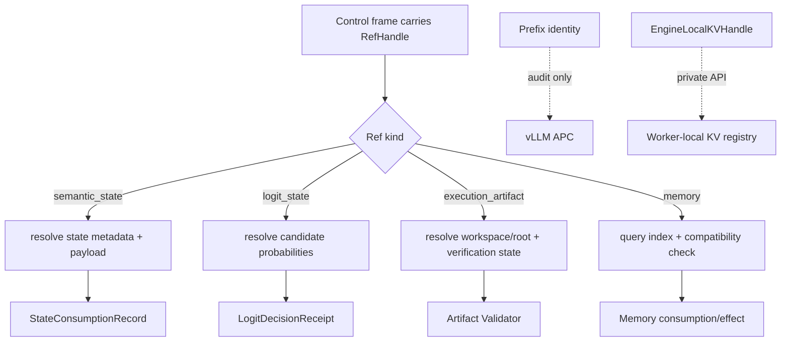
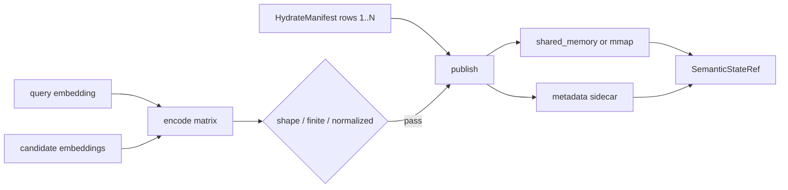
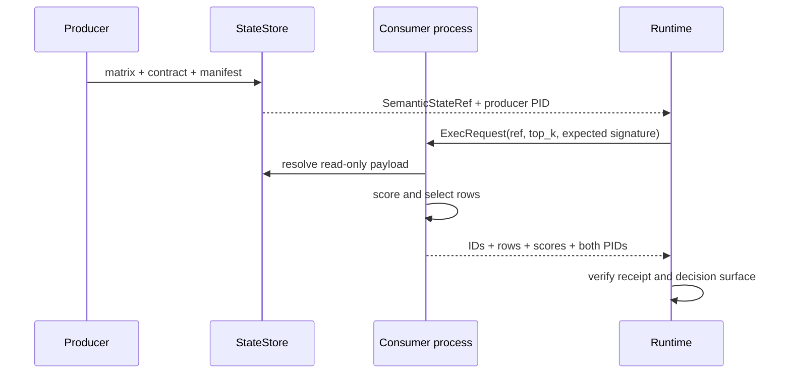
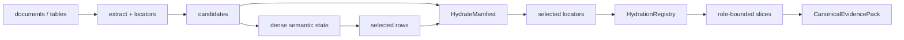
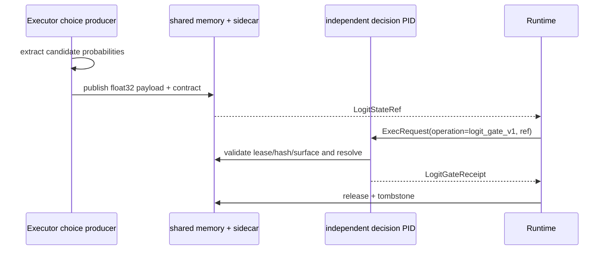
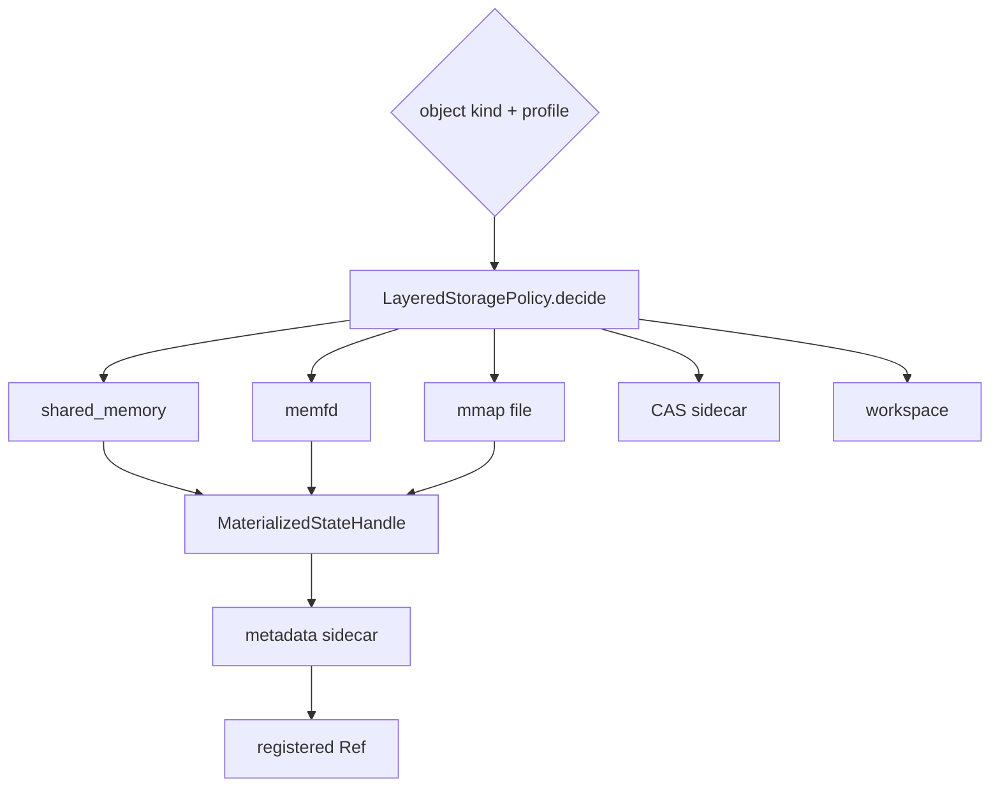
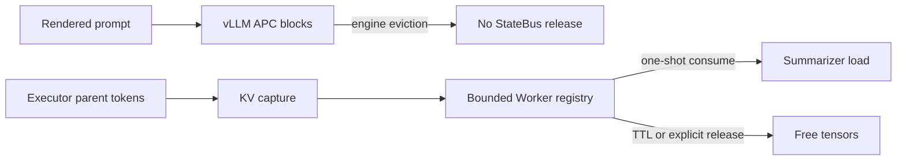

# State、Ref 与存储

## Ref 类型职责

StateBus 的消息帧携带受 Registry 管理的 Ref，重对象保留在对象存储。Ref 记录对象类型、存储
类型、状态、内容 hash、manifest/schema 和受控 root。消费方凭 Ref 与 CapabilityGrant 完成
身份核对并取得对应只读视图。

| 引用 | 对象形态 | 典型载体 | 状态提升依据 | 主要生命周期 |
|:--|:--|:--|:--|:--|
| `SemanticStateRef` | embedding、query/candidate 数值矩阵 | shared memory、memfd、mmap | shape/dtype/hash/manifest/encoder/lease | 单任务或单 step，消费后释放 |
| `LogitStateRef` | Executor 闭集候选概率 + `other_mass` | shared memory | candidate surface/hash/lease/PID/DecisionReceipt | 单次选择尝试，决策后立即释放 |
| `ExecutionArtifactRef` | Python/DSL 生成的 JSON、表格或文件 | workspace、artifact root、CAS | schema、业务 Validator、provenance、提交检查 | candidate → verified/invalidated |
| `MemoryRef` | 摘要、策略、来源关系、已验证产物关系 | SQLite/FTS、向量索引、sidecar | commit status、兼容性检查、角色视图 | 跨任务，支持失效与重放 |

Prefix 与显式 KV 有独立合同对象：

| 对象 | 对象类型 | 当前所有者与范围 |
|:--|:--|:--|
| `CanonicalSharedEvidencePrefix` / `ExactTokenPrefixIdentity` | Prompt 布局与 Token 身份合同 | Runtime 编译和审计；KV block 由同一 vLLM APC 管理 |
| `EngineLocalKVHandle` | Worker-local 短生命周期句柄 | 单一 vLLM Worker registry；同 engine generation、one-shot、TTL |

`SemanticStateRef` 的核心字段包括 state ID/kind、storage kind、length、blob hash、manifest ID、source document hashes、compatibility hint 和 metadata。它强调“这段数值状态如何解释和由谁消费”。

`LogitStateRef` 绑定 candidate surface、别名映射、选中候选、producer/consumer 角色、概率载荷、
lease 与 blob hash。它记录闭集选择进入执行所需的数值依据。当前 payload 为候选级概率，
消费完成后释放并留下 tombstone。

`ExecutionArtifactRef` 包含 artifact/task/step ID、artifact type、root ID、相对路径、blob hash、
大小、producer、verification state、replay-ready、workspace relpath 和 manifest hash。Artifact
的对象状态由自身 Validator 与 verification state 决定。

`MemoryRef` 记录 memory ID、来源角色和任务、创建时间、任务主题、summary、tags、schema/lineage/runtime 条件、artifact/embedding 关联与 commit status。它强调“历史知识是否能在另一任务中安全进入角色视图”。



Ref Registry 使用小型索引字段维护 `ref_id`、`ref_kind`、`storage_kind`、`status`、
blob/manifest hash、root/relpath 和 schema version。消费方交叉验证 Registry、sidecar 与
CapabilityGrant；未通过项返回对应类型、状态、路径、hash 或授权错误。

四类 Ref 分离使 Telemetry 保持清晰：Embedding 状态消费、Logit 决策尝试、Artifact 验证
和 Memory 复用分别使用自己的事件与统计分母。

Prefix hit 与显式 KV load 也使用独立指标。Prefix 记录任务窗口内 APC query/hit Token counter
delta；显式 KV 记录 capture/load/release、scheduler proof 和 Worker forward proof。

主要模型位于 [`src/statebus/refs/models.py`](../../src/statebus/refs/models.py)、[`src/statebus/contracts/models.py`](../../src/statebus/contracts/models.py)、[`src/statebus/contracts/logit.py`](../../src/statebus/contracts/logit.py)、[`src/statebus/contracts/prefix.py`](../../src/statebus/contracts/prefix.py)、[`src/statebus/contracts/engine_local_kv.py`](../../src/statebus/contracts/engine_local_kv.py) 和 [`src/statebus/memory/models.py`](../../src/statebus/memory/models.py)。

---

## 稠密语义状态

[`semantic_state.py`](../../src/statebus/state/semantic_state.py) 将 query embedding 与候选 embedding 保持为原生 float32 数值矩阵。编码格式固定为 little-endian `<f4`、C-order；第 0 行是 query，第 1 行起是候选。所有向量必须维数相同、来自同一 encoding、数值有限且归一化。

```text
row 0   query       [q0, q1, ... q(d-1)]
row 1   candidate A [a0, a1, ... a(d-1)]
row 2   candidate B [b0, b1, ... b(d-1)]
...
row n   candidate N [n0, n1, ... n(d-1)]

dtype = little-endian float32
order = C
shape = (candidate_count + 1, embedding_dims)
```

`DenseSemanticStateContract` 保存 shape，并绑定 encoder ID/revision/signature、每行来源文本 hash、HydrateManifest ID/hash、blob hash、字节数、owner session、lease、producer PID、storage kind、byte order、row layout 和 normalization。`encoder_signature` 将 encoder、revision、维数、归一化与 dtype 一起摘要，确保编码空间匹配。

发布前，`encode_dense_semantic_matrix()` 检查候选非空、维数/encoder 一致、矩阵 shape、NaN/Inf 和单位范数。Manifest 必须精确覆盖候选行 `1..N`，每行都要有 candidate ID。随后 `publish_dense_semantic_state()` 写 manifest，调用 `LayeredStateStore.publish()`，再比对物理 handle 的大小与 blob hash；不一致时释放状态并删除未完成 manifest。



消费方调用 `resolve_dense_semantic_state()`，从 state root 读取 sidecar，恢复合同并验证 Ref、expected encoder signature 和 lease。shared memory 通过登记名称映射；mmap 路径必须直接位于受控 `state_root/mmap` 下。读取后重新计算 hash，建立只读 NumPy view，再检查有限值和归一化。

消费者使用 query 行与候选行进行相似度选择，通过 `semantic_top_k` 选出行号。`DenseSemanticSelection` 和 `SuccessResult` 返回 selected candidate IDs、scores、row indices、selected evidence bytes、consumer PID、producer PID 和 encoder signature。Runtime 可以同时证明“另一个进程读了哪段数值状态”和“该状态选中了哪些业务候选”。



`ResolvedDenseSemanticState` 使用 context manager/`close()` 释放 memoryview、mmap 文件和
shared memory handle，物理对象的最终 unlink 由 Store release/GC 完成。

完整状态记录包含 publish、跨 PID consume、选择/行为效果与 release 四个阶段。本次 Embedding
实验的 9 个状态均完成跨 PID 消费并改变候选选择。

---

## Hydration 与证据合并

embedding 行本身没有可引用业务含义。StateBus 用 `HydrateManifest` 将每个候选行绑定到 candidate ID、稳定 key、证据 bucket、字节提示、重要性和 source locator。source locator 可以是文本区间、表格单元格或文档 fragment，均带源文档 hash 与 extractor version。

```text
matrix row 1 -> candidate_id=rev-q1
             -> TableCellLocator(doc_hash, table_id, row, col)
matrix row 2 -> candidate_id=rev-q4
             -> TableCellLocator(doc_hash, table_id, row, col)
matrix row 3 -> candidate_id=note-7
             -> TextSpanLocator(doc_hash, text_id, start, end)
```

[`HydrationRegistry`](../../src/statebus/provenance/hydration.py) 保存 locator 到 rendered text 的受控映射。数值选择完成后，Runtime 只 hydrate 被选中的 locator，并按角色与预算生成 `RoleHydratedSlice`。这样 Planner、Executor 与 Summarizer 可以看到不同的证据投影，而不必把原始长文档重复放进每个 Prompt。



`CanonicalEvidencePack` 将证据分成五个 bucket：hard facts 保存必须保留的硬事实，structured evidence 保存表格/结构化记录，semantic contexts 保存语义相关上下文，lexical hints 保存检索线索，conflicts 明确保留冲突证据。Pack 同时记录 source document hashes、预算元数据、schema 与自身 hash。

[`DeterministicFanInBuilder`](../../src/statebus/provenance/hydration.py) 负责把多路 EvidenceCandidate 合并为稳定 EvidencePack。它先按稳定 key 去重，再用确定性 RRF 排序，结果与 Python 集合遍历顺序无关。预算不足时，hard facts 和冲突处理优先级由合同决定。

Hydration 让“数值选择”和“最终可引用证据”重新汇合：选择过程使用的是非文本矩阵，Executor/Summarizer 最终仍能回到具体表格单元格或文本区间。缺少 Manifest 会让 row index 无法解释；缺少 dense state 和消费回执则只能证明文本筛选，二者都不完整。

来源 hash 与 extractor version 也是 Replay key 的组成部分。源文档或抽取器变化时，历史
EvidencePack 进入兼容检查，再决定当前任务的恢复级别。

---

## LogitState：候选概率的短生命周期状态

Logit Retry Decision 使用的 `LogitStateRef` 与检索阶段的 `SemanticStateRef` 承担不同职责。后者
保存 query/candidate embedding 并选择证据；前者保存 Executor 闭集选择时的候选级概率，
用于决定候选执行、重查或 fail closed。载荷按 `CandidateSurfaceV2` 顺序排列候选概率，末尾
追加 `other_mass`。

```text
CandidateSurfaceV2 = [candidate A, candidate B, ..., candidate N]
binary payload      = [p(A), p(B), ..., p(N), other_mass]
candidate count     = 2..8
dtype               = little-endian float32 (<f4)
payload bytes       = 4 × (candidate_count + 1)
```

`CandidateSurfaceV2` 把连续的 ASCII 别名 `A..H` 与稳定 candidate ID、candidate digest 和 ordinal 绑定。模型只返回 `{"choice_code":"A"}` 这类闭集结果，`extract_exact_choice_logit_state()` 再从该选择 token 的真实 top-logprob 分布中恢复每个候选的概率。缺少任一候选别名、选中别名与 completion 不一致、概率质量非法或 token 位置无法确认时，Producer Receipt 标记为 unavailable；`retry_once` 模式记录 fail-closed 决策并结束当前尝试。

发布时，`publish_logit_state()` 将概率向量写入 shared memory，并在 sidecar 中绑定 task、trace、request、attempt、候选集合摘要、别名映射摘要、选中候选、producer PID、lease、大小和 blob hash。当前实现明确要求 `StorageKind.SHARED_MEMORY`；载体被静默降级为其他后端时会拒绝发布。



Decision Worker 通过 UDS + typed Protobuf 取得 Ref，只读打开 shared memory，重新核对 lease、大小、hash、概率范围和总和。回执包含 action、reason、selected/top-1 alias、候选 ID、selected probability、top margin、normalized entropy、other mass，以及不同的 producer/consumer PID。Runtime 还会交叉验证消费 Ref、PID 和候选绑定，避免一个格式正确但身份不匹配的回执获得授权。

action 为接受、重查或异常时，`run_logit_gate_attempt()` 最终都会调用
`release_logit_state()`。物理对象和 metadata 清理后，Runtime 写入 tombstone，记录释放原因、
字节数、PIDs 和 blob hash。受控实验使用两个候选，因此每次传递
`3 × float32 = 12 B`；一般载荷大小为 `4 × (candidate_count + 1) B`。

AB/BA 反事实校准属于[受控挑战实验](walkthroughs.md)的公平性设计。它在发布前交换候选与 A/B 的绑定、按 candidate ID 对齐后取均值，用来抵消模型对首个别名的位置偏差；基础 `LogitState` 合同本身不强制每次线上运行都做两次 AB/BA 请求。

主要实现位于 [`contracts/logit.py`](../../src/statebus/contracts/logit.py)、[`runtime/logit_state.py`](../../src/statebus/runtime/logit_state.py)、[`state/logit_state.py`](../../src/statebus/state/logit_state.py) 与 [`refs/models.py`](../../src/statebus/refs/models.py)。

---

## 分层存储与生命周期

[`LayeredStoragePolicy`](../../src/statebus/state/store.py) 根据 object kind 和运行 profile 选择物理后端。Ref 合同保持稳定，后端可以在 shared memory、memfd、mmap、CAS sidecar、inline 和 workspace 之间按对象大小与生命周期选择。

| object kind | 默认倾向 | 原因 |
|:--|:--|:--|
| `DENSE_SEMANTIC_STATE` / `EMBEDDING_STATE` | shared memory，后备 mmap | 短期同机跨进程只读数值对象 |
| `LOGIT_STATE` | shared memory | 独立 Worker 读取跨 PID 传递的短期候选概率。完整 logits 与 KV 使用各自的存储和运行路径 |
| `HYDRATE_MANIFEST` / `CANONICAL_EVIDENCE_PACK` | CAS sidecar/mmap | 小型、可 hash、需要回溯 |
| `MEMORY_MATCH_RESULT` / `MEMORY_COMMIT` | CAS sidecar/mmap | 跨任务持久化与审计 |
| `EXECUTION_ARTIFACT` | workspace root/CAS sidecar | attempt 隔离与 Validator 写入 |

Prefix APC block 与显式 KV handle 由模型引擎侧管理：前者驻留在 vLLM cache，后者由
`src/statebus/integrations/vllm_kv/registry.py` 管理 Worker host tensor。`LayeredStoragePolicy`
继续处理表中的正式 object kind。





Store 记录 preferred backend、selected backend、fallback 与 publish count。任务的实际存储
后端由 handle 和 Telemetry 共同确认；后端选择异常以事件和 fallback 字段记录。

shared memory 消费方只打开登记名称并建立只读 view；mmap 文件必须位于 `state_root/mmap` 的直接受控范围；memfd 需要传递并验证描述符元数据。所有载体都要重新核对大小和 blob hash。

状态合同带 owner session 与 lease。lease 到期后停止新消费；Runtime 在 success、failed、trapped 或 cancelled 后统一进入 settlement，随后发出 GC。`LayeredStateStore.release()` 根据实际后端 close/unlink shared memory、关闭 memfd 或删除受控 mmap 文件，并移除 handle。

清理采用幂等实现。取消、timeout、Worker 退出和上层异常可同时触发 release；重复调用返回
当前状态，各 attempt 只处理自己的对象。新的 Run 创建新的 session、attempt、root 和 active Ref。

ExecutionArtifact 与 SemanticState 使用不同的清理流程：失败 candidate 保留 hash、Validator
报告和诊断文件，并关闭下游可见性；长期保留由 Artifact settlement 与运行归档策略决定。
Memory proposal 经过提交检查后由记忆索引生命周期单独管理。

显式 KV 使用独立释放流程。Consumer 在 `finally` 中调用私有 release；registry 同时按 TTL
清理 READY/CONSUMED entry。身份或 forward proof 未通过时，entry 进入 invalidated/释放路径。
完整状态机见[显式 KV Continuation](runtime.md#engine-local-kv-continuation)。
