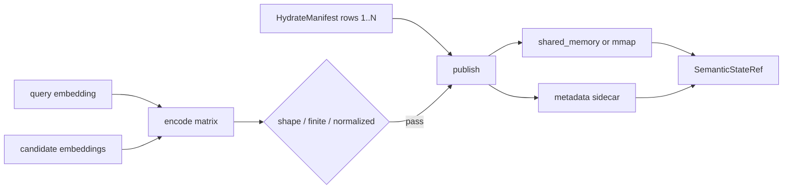
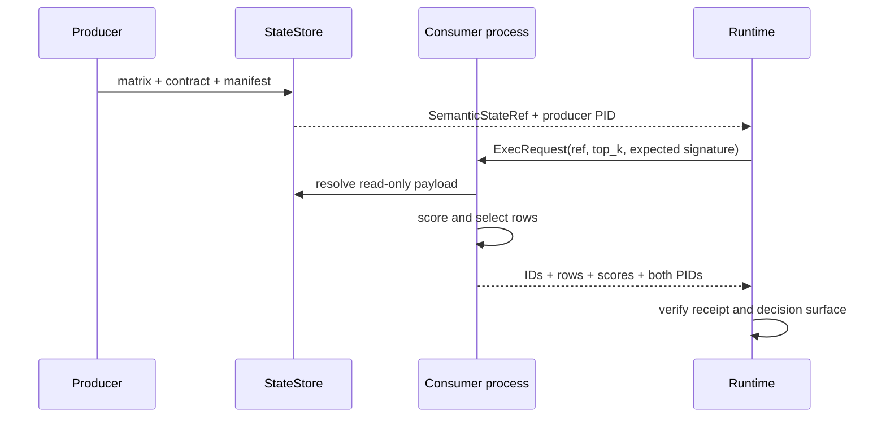

# 稠密语义状态

[`semantic_state.py`](../../../statebus/state/semantic_state.py) 将 query embedding 与候选 embedding 保持为原生 float32 数值矩阵。编码格式固定为 little-endian `<f4`、C-order；第 0 行是 query，第 1 行起是候选。所有向量必须维数相同、来自同一 encoding、数值有限且归一化。

```text
row 0   query       [q0, q1, ... q(d-1)]
row 1   candidate A [a0, a1, ... a(d-1)]
row 2   candidate B [b0, b1, ... b(d-1)]
...
row n   candidate N [n0, n1, ... n(d-1)]

dtype = little-endian float32
order = C
shape = (candidate_count + 1, embedding_dims)
```

`DenseSemanticStateContract` 不只保存 shape。它同时绑定 encoder ID/revision/signature、每行来源文本 hash、HydrateManifest ID/hash、blob hash、字节数、owner session、lease、producer PID、storage kind、byte order、row layout 和 normalization。`encoder_signature` 将 encoder、revision、维数、归一化与 dtype 一起摘要，避免同 shape 的不同编码空间被误用。

发布前，`encode_dense_semantic_matrix()` 检查候选非空、维数/encoder 一致、矩阵 shape、NaN/Inf 和单位范数。Manifest 必须精确覆盖候选行 `1..N`，每行都要有 candidate ID。随后 `publish_dense_semantic_state()` 写 manifest，调用 `LayeredStateStore.publish()`，再比对物理 handle 的大小与 blob hash；不一致时释放状态并删除未完成 manifest。



消费方调用 `resolve_dense_semantic_state()`，从 state root 读取 sidecar，恢复合同并验证 Ref、expected encoder signature 和 lease。shared memory 通过登记名称映射；mmap 路径必须直接位于受控 `state_root/mmap` 下。读取后重新计算 hash，建立只读 NumPy view，再检查有限值和归一化。

消费者使用 query 行与候选行进行相似度选择，通过 `semantic_top_k` 选出行号。`DenseSemanticSelection` 和 `SuccessResult` 返回 selected candidate IDs、scores、row indices、selected evidence bytes、consumer PID、producer PID 和 encoder signature。Runtime 可以同时证明“另一个进程读了哪段数值状态”和“该状态选中了哪些业务候选”。



`ResolvedDenseSemanticState` 使用 context manager/`close()` 释放 memoryview、mmap 文件和 shared memory handle。物理对象的最终 unlink 由 Store release/GC 完成，不能依赖 Python 对象析构时机。

正式主张应同时检查 publish、跨 PID consume、选择/行为效果与 release。只看到 encoder 调用、shared memory 配置或 `STATE_PUBLISHED` 都不足以证明有效的非文本传递。

