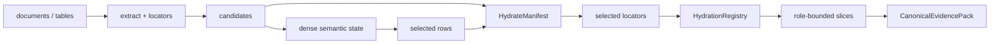

# Hydration 与证据扇入

embedding 行本身没有可引用业务含义。StateBus 用 `HydrateManifest` 将每个候选行绑定到 candidate ID、稳定 key、证据 bucket、字节提示、重要性和 source locator。source locator 可以是文本区间、表格单元格或文档 fragment，均带源文档 hash 与 extractor version。

```text
matrix row 1 -> candidate_id=rev-q1
             -> TableCellLocator(doc_hash, table_id, row, col)
matrix row 2 -> candidate_id=rev-q4
             -> TableCellLocator(doc_hash, table_id, row, col)
matrix row 3 -> candidate_id=note-7
             -> TextSpanLocator(doc_hash, text_id, start, end)
```

[`HydrationRegistry`](../../../v2/provenance/hydration.py) 保存 locator 到 rendered text 的受控映射。数值选择完成后，Runtime 只 hydrate 被选中的 locator，并按角色与预算生成 `RoleHydratedSlice`。这样 Planner、Executor 与 Summarizer 可以看到不同的证据投影，而不必把原始长文档重复放进每个 Prompt。



`CanonicalEvidencePack` 将证据分成五个 bucket：hard facts 保存必须保留的硬事实，structured evidence 保存表格/结构化记录，semantic contexts 保存语义相关上下文，lexical hints 保存检索线索，conflicts 明确保留冲突证据。Pack 同时记录 source document hashes、预算元数据、schema 与自身 hash。

[`DeterministicFanInBuilder`](../../../v2/provenance/hydration.py) 负责把多路 EvidenceCandidate 合并为稳定 EvidencePack。它先按稳定 key 去重，再用确定性 RRF 排序；相同输入不会因 Python 集合遍历顺序改变结果。预算不足时，hard facts 和冲突处理优先级由合同决定，而不是由模型自由删减。

Hydration 让“数值选择”和“最终可引用证据”重新汇合：选择过程使用的是非文本矩阵，Executor/Summarizer 最终仍能回到具体表格单元格或文本区间。缺少 Manifest 会让 row index 无法解释；缺少 dense state 和消费回执则只能证明文本筛选，二者都不完整。

来源 hash 与 extractor version 也是 Replay 的一部分。即使文字表面相同，源文档或抽取器变化也可能使 locator 失效，因此历史 EvidencePack 不能只靠字符串相似度直接恢复。

