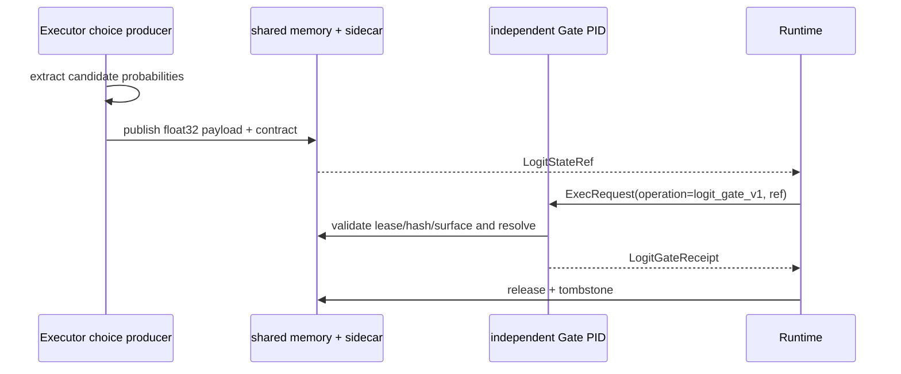

# LogitState：候选概率的短生命周期状态

Logit Retry Gate 使用的 `LogitStateRef` 与检索阶段的 `SemanticStateRef` 不同。后者保存 query/candidate embedding，用来选择证据；前者保存 Executor 闭集选择时的候选级概率，用来决定候选是否足以越过 Worker 放行边界。当前载荷不是完整词表 logits、hidden state 或 KV cache，而是按 `CandidateSurfaceV2` 顺序排列的候选概率，再追加一个 `other_mass`。

```text
CandidateSurfaceV2 = [candidate A, candidate B, ..., candidate N]
binary payload      = [p(A), p(B), ..., p(N), other_mass]
candidate count     = 2..8
dtype               = little-endian float32 (<f4)
payload bytes       = 4 × (candidate_count + 1)
```

`CandidateSurfaceV2` 把连续的 ASCII 别名 `A..H` 与稳定 candidate ID、candidate digest 和 ordinal 绑定。模型只返回 `{"choice_code":"A"}` 这类闭集结果，`extract_exact_choice_logit_state()` 再从该选择 token 的真实 top-logprob 分布中恢复每个候选的概率。缺少任一候选别名、选中别名与 completion 不一致、概率质量非法或 token 位置无法确认时，Producer Receipt 标记为 unavailable；`retry_once` 模式会按 fail-closed 处理，而不是伪造置信度。

发布时，`publish_logit_state()` 将概率向量写入 shared memory，并在 sidecar 中绑定 task、trace、request、attempt、候选面摘要、别名映射摘要、选中候选、producer PID、lease、大小和 blob hash。当前实现明确要求 `StorageKind.SHARED_MEMORY`；载体被静默降级为其他后端时会拒绝发布。



Gate Worker 通过 UDS + typed Protobuf 取得 Ref，只读打开 shared memory，重新核对 lease、大小、hash、概率范围和总和。回执包含 action、reason、selected/top-1 alias、候选 ID、selected probability、top margin、normalized entropy、other mass，以及不同的 producer/consumer PID。Runtime 还会交叉验证消费 Ref、PID 和候选绑定，避免一个格式正确但身份不匹配的回执获得授权。

无论 Gate 接受、建议重试还是消费过程抛错，`run_logit_gate_attempt()` 最终都会调用 `release_logit_state()`。物理对象和 metadata 被清理后，Runtime 写入 tombstone，记录释放原因、字节数、PIDs 和 blob hash。受控实验中的两个候选因此每次只传 `3 × float32 = 12 B`；这是该实验候选面的结果，不是所有候选数量下都固定为 12 B。

AB/BA 反事实校准属于[受控挑战实验](../walkthrough/logit-retry-challenge.md)的公平性设计。它在发布前交换候选与 A/B 的绑定、按 candidate ID 对齐后取均值，用来抵消模型对首个别名的位置偏差；基础 `LogitState` 合同本身不强制每次线上运行都做两次 AB/BA 请求。

主要实现位于 [`contracts/logit.py`](../../../v2/contracts/logit.py)、[`runtime/logit_state.py`](../../../v2/runtime/logit_state.py)、[`state/logit_state.py`](../../../v2/state/logit_state.py) 与 [`refs/models.py`](../../../v2/refs/models.py)。

