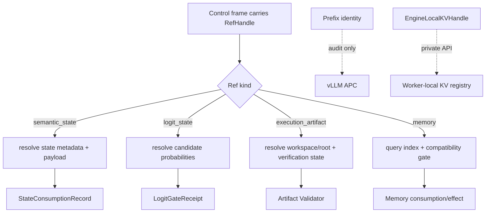

# Ref 类型职责

StateBus 的控制帧携带受 Registry 管理的 Ref，重对象保留在数据面。Ref 记录对象类型、存储
类型、状态、内容 hash、manifest/schema 和受控 root。消费方凭 Ref 与 CapabilityGrant 完成
身份核对并取得对应只读视图。

| 引用 | 对象形态 | 典型载体 | 状态提升依据 | 主要生命周期 |
|:--|:--|:--|:--|:--|
| `SemanticStateRef` | embedding、query/candidate 数值矩阵 | shared memory、memfd、mmap | shape/dtype/hash/manifest/encoder/lease | 单任务或单 step，消费后释放 |
| `LogitStateRef` | Executor 闭集候选概率 + `other_mass` | shared memory | candidate surface/hash/lease/PID/GateReceipt | 单次选择尝试，Gate 后立即释放 |
| `ExecutionArtifactRef` | Python/DSL 生成的 JSON、表格或文件 | workspace、artifact root、CAS | schema、业务 Validator、provenance、Commit Gate | candidate → verified/invalidated |
| `MemoryRef` | 摘要、策略、证据链、已验证产物关系 | SQLite/FTS、向量索引、sidecar | commit status、兼容门、角色视图 | 跨任务，支持失效与重放 |

Prefix 与显式 KV 有合同对象，但不是上述 Ref：

| 对象 | 对象类型 | 当前所有者与范围 |
|:--|:--|:--|
| `CanonicalSharedEvidencePrefix` / `ExactTokenPrefixIdentity` | Prompt 布局与 Token 身份合同 | Runtime 编译和审计；KV block 由同一 vLLM APC 管理 |
| `EngineLocalKVHandle` | Worker-local 短生命周期句柄 | 单一 vLLM Worker registry；同 engine generation、one-shot、TTL |

`SemanticStateRef` 的核心字段包括 state ID/kind、storage kind、length、blob hash、manifest ID、source document hashes、compatibility hint 和 metadata。它强调“这段数值状态如何解释和由谁消费”。

`LogitStateRef` 绑定 candidate surface、别名映射、选中候选、producer/consumer 角色、概率载荷、
lease 与 blob hash。它记录闭集选择进入执行所需的数值依据。当前 payload 为候选级概率，
Gate 消费后释放并留下 tombstone。

`ExecutionArtifactRef` 包含 artifact/task/step ID、artifact type、root ID、相对路径、blob hash、
大小、producer、verification state、replay-ready、workspace relpath 和 manifest hash。Artifact
的可信状态由自身 Validator 与 verification state 决定。

`MemoryRef` 记录 memory ID、来源角色和任务、创建时间、任务主题、summary、tags、schema/lineage/runtime 条件、artifact/embedding 关联与 commit status。它强调“历史知识是否能在另一任务中安全进入角色视图”。

Ref Registry 使用小型索引字段维护 `ref_id`、`ref_kind`、`storage_kind`、`status`、
blob/manifest hash、root/relpath 和 schema version。消费方交叉验证 Registry、sidecar 与
CapabilityGrant；未通过项返回对应类型、状态、路径、hash 或授权错误。

四类 Ref 分离使 Telemetry 保持清晰：Embedding 状态消费、Logit Gate 尝试、Artifact 验证
和 Memory 复用分别使用自己的事件与统计分母。

Prefix hit 与显式 KV load 也使用独立指标。Prefix 记录任务窗口内 APC query/hit Token counter
delta；显式 KV 记录 capture/load/release、scheduler proof 和 Worker forward proof。

主要模型位于 [`statebus/refs/models.py`](../../../statebus/refs/models.py)、[`statebus/contracts/models.py`](../../../statebus/contracts/models.py)、[`statebus/contracts/logit.py`](../../../statebus/contracts/logit.py)、[`statebus/contracts/prefix.py`](../../../statebus/contracts/prefix.py)、[`statebus/contracts/engine_local_kv.py`](../../../statebus/contracts/engine_local_kv.py) 和 [`statebus/memory/models.py`](../../../statebus/memory/models.py)。
