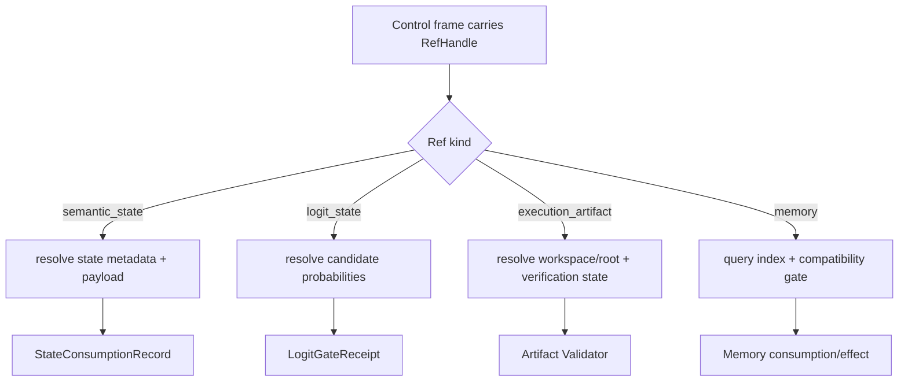

# Ref 类型边界

StateBus 的控制帧不会携带完整重对象，而是携带受 Registry 管理的 Ref。Ref 并不是可随意解析的路径字符串；它至少要说明对象类型、存储类型、状态、内容 hash、manifest/schema 和受控 root。取得 Ref 只表示调用方获得了一个待验证句柄，不表示拥有写权限或可以绕过 CapabilityGrant。

| 引用 | 对象形态 | 典型载体 | 状态提升依据 | 主要生命周期 |
|:--|:--|:--|:--|:--|
| `SemanticStateRef` | embedding、query/candidate 数值矩阵 | shared memory、memfd、mmap | shape/dtype/hash/manifest/encoder/lease | 单任务或单 step，消费后释放 |
| `LogitStateRef` | Executor 闭集候选概率 + `other_mass` | shared memory | candidate surface/hash/lease/PID/GateReceipt | 单次选择尝试，Gate 后立即释放 |
| `ExecutionArtifactRef` | Python/DSL 生成的 JSON、表格或文件 | workspace、artifact root、CAS | schema、业务 Validator、provenance、Commit Gate | candidate → verified/invalidated |
| `MemoryRef` | 摘要、策略、证据链、已验证产物关系 | SQLite/FTS、向量索引、sidecar | commit status、兼容门、角色视图 | 跨任务，支持失效与重放 |

`SemanticStateRef` 的核心字段包括 state ID/kind、storage kind、length、blob hash、manifest ID、source document hashes、compatibility hint 和 metadata。它强调“这段数值状态如何解释和由谁消费”。

`LogitStateRef` 绑定 candidate surface、别名映射、选中候选、producer/consumer 角色、概率载荷、lease 与 blob hash。它强调“这次闭集选择是否有足够数值依据进入执行”。当前 payload 是候选级概率，不是完整输出词表 logits；Gate 消费后必须释放并留下 tombstone。

`ExecutionArtifactRef` 包含 artifact/task/step ID、artifact type、root ID、相对路径、blob hash、大小、producer、verification state、replay-ready、workspace relpath 和 manifest hash。它强调“一个文件结果是否已经验证”，因此不能因为 SemanticState 是 active 就推断 Artifact 也可信。

`MemoryRef` 记录 memory ID、来源角色和任务、创建时间、任务主题、summary、tags、schema/lineage/runtime 条件、artifact/embedding 关联与 commit status。它强调“历史知识是否能在另一任务中安全进入角色视图”。

Ref Registry 使用小型索引字段维护 `ref_id`、`ref_kind`、`storage_kind`、`status`、blob/manifest hash、root/relpath 和 schema version。消费方要交叉验证 Registry、sidecar 与 CapabilityGrant：类型不符、状态失效、路径越界、hash 不一致或输入不在 Grant 中都应拒绝。

四类 Ref 分离也让 Telemetry 语义清楚。embedding 状态消费、Logit Gate 尝试、Artifact 验证和 Memory 复用分别具有不同分母；把它们统一记成“state hit”会破坏实验统计和故障定位。

主要模型位于 [`statebus/refs/models.py`](../../../statebus/refs/models.py)、[`statebus/contracts/models.py`](../../../statebus/contracts/models.py)、[`statebus/contracts/logit.py`](../../../statebus/contracts/logit.py) 和 [`statebus/memory/models.py`](../../../statebus/memory/models.py)。
