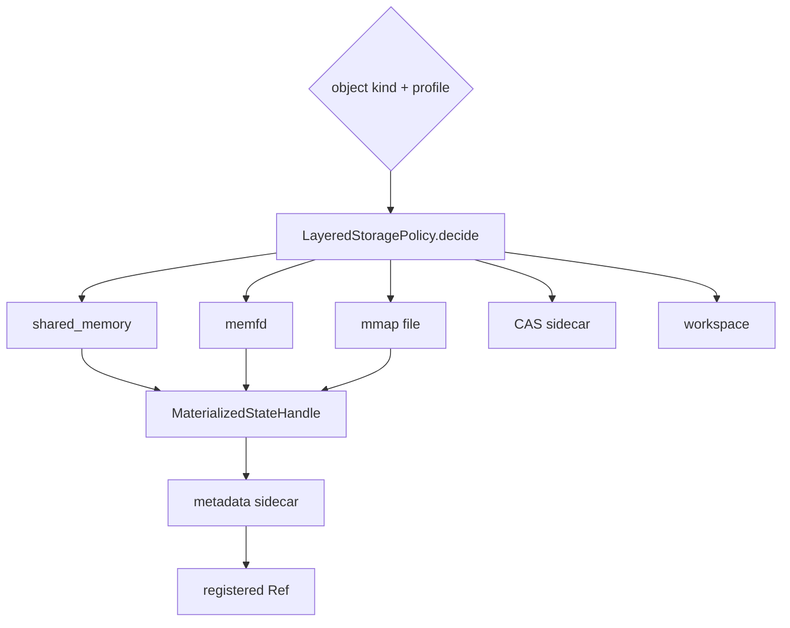
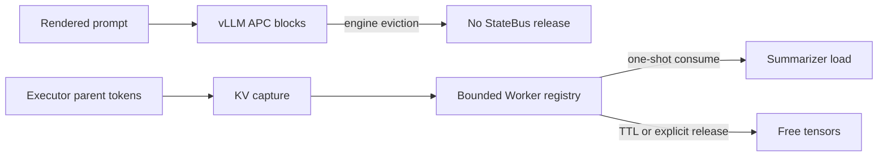

# 分层存储与生命周期

[`LayeredStoragePolicy`](../../../statebus/state/store.py) 根据 object kind 和运行 profile 选择物理后端。Ref 合同保持稳定，后端可以在 shared memory、memfd、mmap、CAS sidecar、inline 和 workspace 之间按能力与生命周期选择。

| object kind | 默认倾向 | 原因 |
|:--|:--|:--|
| `DENSE_SEMANTIC_STATE` / `EMBEDDING_STATE` | shared memory，后备 mmap | 短期同机跨进程只读数值对象 |
| `LOGIT_STATE` | shared memory | 当前 Gate 强制跨 PID 消费的短期候选概率；不等于完整 logits 或 KV 主链 |
| `HYDRATE_MANIFEST` / `CANONICAL_EVIDENCE_PACK` | CAS sidecar/mmap | 小型、可 hash、需要回溯 |
| `MEMORY_MATCH_RESULT` / `MEMORY_COMMIT` | CAS sidecar/mmap | 跨任务持久化与审计 |
| `EXECUTION_ARTIFACT` | workspace root/CAS sidecar | attempt 隔离与 Validator 写入 |

Prefix APC block 与显式 KV handle 由模型引擎侧管理：前者驻留在 vLLM cache，后者由
`statebus/integrations/vllm_kv/registry.py` 管理 Worker host tensor。`LayeredStoragePolicy`
继续处理表中的正式 object kind。

Store 记录 preferred backend、selected backend、fallback 与 publish count。任务的实际存储
后端由 handle 和 Telemetry 共同确认；后端选择异常以事件和 fallback 字段记录。

shared memory 消费方只打开登记名称并建立只读 view；mmap 文件必须位于 `state_root/mmap` 的直接受控范围；memfd 需要传递并验证描述符元数据。所有载体都要重新核对大小和 blob hash。

状态合同带 owner session 与 lease。lease 到期阻止新消费，但物理资源不会因此自动可靠消失。Runtime 在 success、failed、trapped 或 cancelled 后统一进入 settlement，随后发出 GC。`LayeredStateStore.release()` 根据实际后端 close/unlink shared memory、关闭 memfd 或删除受控 mmap 文件，并移除 handle。

清理采用幂等实现。取消、timeout、Worker 退出和上层异常可同时触发 release；重复调用返回
当前状态，各 attempt 只处理自己的对象。新的 Run 创建新的 session、attempt、root 和 active Ref。

ExecutionArtifact 与 SemanticState 使用不同的清理流程：失败 candidate 保留 hash、Validator
报告和诊断文件，并关闭下游可见性；长期保留由 Artifact settlement 与运行归档策略决定。
Memory proposal 经过 Commit Gate 后由记忆索引生命周期单独管理。

显式 KV 使用独立释放流程。Consumer 在 `finally` 中调用私有 release；registry 同时按 TTL
清理 READY/CONSUMED entry。身份或 forward proof 未通过时，entry 进入 invalidated/释放路径。
完整状态机见[显式 KV Continuation](../runtime/engine-local-kv-continuation.md#句柄生命周期)。
