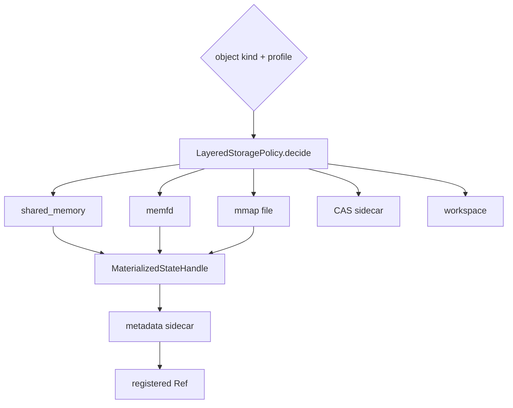

# 分层存储与生命周期

[`LayeredStoragePolicy`](../../../v2/state/store.py) 根据 object kind 和运行 profile 选择物理后端。Ref 合同保持稳定，后端可以在 shared memory、memfd、mmap、CAS sidecar、inline 和 workspace 之间按能力与生命周期选择。

| object kind | 默认倾向 | 原因 |
|:--|:--|:--|
| `DENSE_SEMANTIC_STATE` / `EMBEDDING_STATE` | shared memory，后备 mmap | 短期同机跨进程只读数值对象 |
| `LOGIT_STATE` | shared memory | 当前 Gate 强制跨 PID 消费的短期候选概率；不等于完整 logits 或 KV 主链 |
| `HYDRATE_MANIFEST` / `CANONICAL_EVIDENCE_PACK` | CAS sidecar/mmap | 小型、可 hash、需要回溯 |
| `MEMORY_MATCH_RESULT` / `MEMORY_COMMIT` | CAS sidecar/mmap | 跨任务持久化与审计 |
| `EXECUTION_ARTIFACT` | workspace root/CAS sidecar | attempt 隔离与 Validator 写入 |

Store 记录 preferred backend、selected backend、fallback 与 publish count。若要声明某个任务使用了 shared memory，应读取实际 handle/telemetry，而不是只看配置。后端选择失败也必须可观察，不能静默把所有状态内联回文本控制帧。

shared memory 消费方只打开登记名称并建立只读 view；mmap 文件必须位于 `state_root/mmap` 的直接受控范围；memfd 需要传递并验证描述符元数据。所有载体都要重新核对大小和 blob hash。

状态合同带 owner session 与 lease。lease 到期阻止新消费，但物理资源不会因此自动可靠消失。Runtime 在 success、failed、trapped 或 cancelled 后统一进入 settlement，随后发出 GC。`LayeredStateStore.release()` 根据实际后端 close/unlink shared memory、关闭 memfd 或删除受控 mmap 文件，并移除 handle。

清理必须幂等。取消、timeout、Worker 退出和上层异常可能同时触发 release；重复调用应返回当前状态，而不是删除其他 attempt 的对象。新的 Run 使用新的 session、attempt 和 root，不应沿用上一 Run 的 active Ref。

ExecutionArtifact 的清理与 SemanticState 不同：失败 candidate 通常保留 hash、Validator 报告和诊断文件，但关闭下游可见性；是否长期保留由 artifact settlement 与运行归档策略决定。Memory proposal 也需要 Commit Gate 判定，不能随一般 StateRef GC 一起误删已提交索引。
