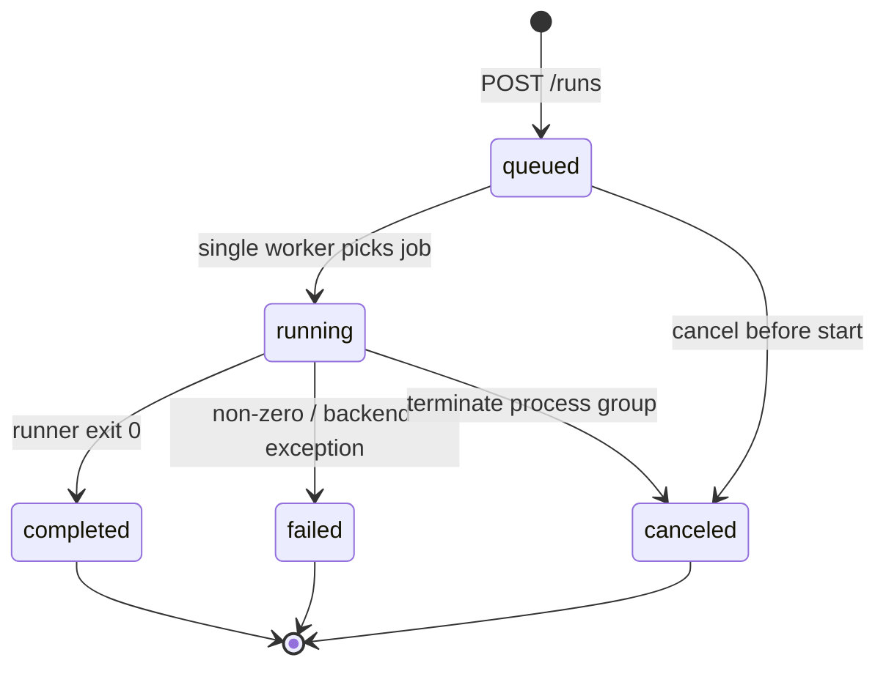

# FastAPI 与受控作业

Studio 后端入口是 [`statebus/studio/app.py`](../../../statebus/studio/app.py)，服务默认监听 `127.0.0.1:8765`。[`scripts/run_statebus_studio.sh`](../../../scripts/run_statebus_studio.sh) 负责选择项目 Python：容器内先加载 `docker/activate_statebus_container.sh`，宿主机使用 `$HOME/statebus/conda-envs/statebus_host`，并显式设置项目 `PYTHONPATH`、Run/Model 目录和 Embedding device。脚本只复用现有模型服务，不负责重启 vLLM。

```bash
cd /home/qcrs/statebus/project
bash scripts/run_statebus_studio.sh
```

若 `studio-ui/dist` 已构建，FastAPI 同时提供静态前端；开发阶段也可以在 `studio-ui` 中启动 Vite，再通过 CORS 访问后端。

后端的主要接口如下：

| API | 实现职责 |
|:--|:--|
| `GET /api/v1/system/health` | 检查 FastAPI、单 Worker 队列、角色 Worker import、项目 PYTHONPATH、模型配置、Embedding 模型/device 与 vLLM health |
| `GET /api/v1/evidence/current` | 返回固定 evidence snapshot |
| `GET /api/v1/catalog` | 返回任务、数据集和公开 recipe 描述 |
| `GET /api/v1/runs` | 列出当前与历史 Run |
| `POST /api/v1/runs` | 根据 recipe ID 创建受控 Run，返回 202 |
| `GET /api/v1/runs/{id}` | 返回 Run 状态、进度、结果和最近事件 |
| `GET /api/v1/runs/{id}/events` | 通过 SSE 增量发送结构化事件 |
| `GET /api/v1/runs/{id}/task-flow` | 重建四 Agent 输入/转换/输出/验证视图 |
| `GET /api/v1/runs/{id}/artifacts` | 返回 Run 根目录内受限深度的文件索引 |
| `POST /api/v1/runs/{id}/cancel` | 取消排队或终止运行进程组 |

健康检查不只看 API 自身。角色 Worker probe 会从临时目录启动当前 Python 并导入 `statebus.integrations.llm` 与 `statebus.contracts`，用于暴露缺少项目 `PYTHONPATH` 的问题；Embedding probe 检查模型目录和指定 device；vLLM 通过既有 53334 health URL 检查。任何关键项未就绪，`POST /runs` 返回 503，而不是先创建一个必然失败的长任务。

[`JobManager`](../../../statebus/studio/jobs.py) 使用一个 `asyncio.Queue` 和一个 Worker task，确保 GPU/模型型作业串行执行。创建 Run 时生成独立 run ID 和目录，写 `RUN_QUEUED` 事件并持久化 `studio_job.json`。Worker 从队列取出 ID 后，调用 [`build_command()`](../../../statebus/studio/recipes.py) 把 recipe 映射为固定 argv。



子进程使用 `create_subprocess_exec(*argv)`，不是 shell 字符串；cwd 固定为项目根，stdout/stderr 合并写入 `console.log`，进程使用独立 session，取消时终止整个进程组。`command.json` 保存实际 argv，便于审计。

JobManager 同时读取 runner stdout 中的阶段 JSON，并 tail 当前 Run 内的 `telemetry/runtime_events.jsonl`。只有白名单 event type、metric key 和 payload key会进入前端事件，长字符串和数组会截断；原始日志仍留在 Run 目录，不通过 SSE 无限制推送。

SSE 使用递增 sequence，客户端可以带 `after` 游标恢复；终态发送 `stream-end`，空闲时发送 keepalive。Job 状态与事件分别持久化到 `studio_job.json` 和 `studio_events.jsonl`。服务重启时，已到终态的 Run 可恢复；尚在 queued/running 的旧记录被标为“Studio 重启中断”，不会伪造进程仍在继续。

