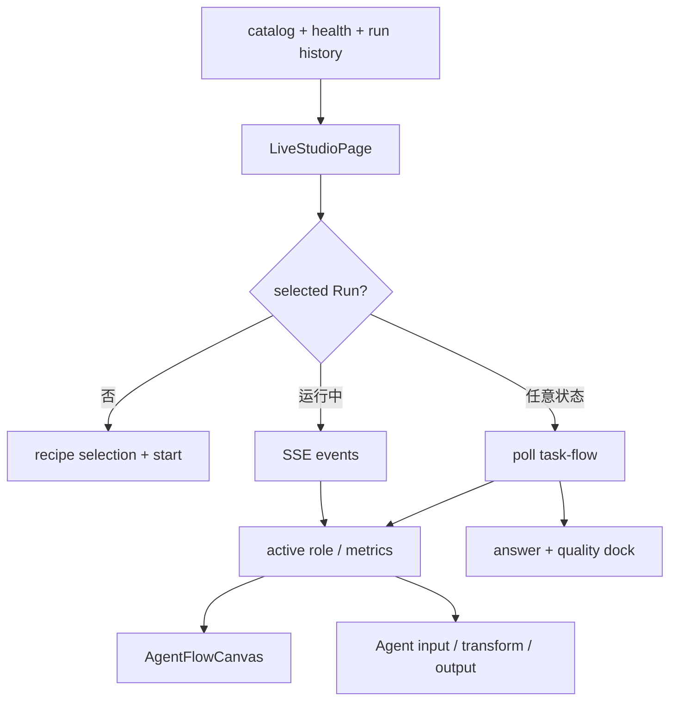

# React 前端与交互状态

前端位于 [`studio-ui`](../../../studio-ui/)，技术栈是 React、TypeScript、React Router、React Flow、ECharts 与 Lucide。一级页面只有“实验与证据”和“任务演示”，数据集、完整记录和技术细节通过抽屉展开，避免把产品拆成过多导航页。

[`AppShell`](../../../studio-ui/src/components/AppShell.tsx) 提供全局导航与健康状态，每 15 秒刷新 vLLM、Embedding 和单 Worker 队列。Live 页采用更紧凑的 shell，让流程、当前 Agent 和最终结果尽量在一屏内展示；左侧 recipe 栏可收起，为答辩投屏释放空间。

Evidence 页从 `/api/v1/evidence/current` 读取固定结构化快照，再绘制总 Token、wire bytes、总耗时、质量、结构化通信、非文本状态、记忆漏斗和能力覆盖。它不扫描最新 Run，也不在浏览器中重新计算实验数字。任务与数据抽屉来自 catalog，便于解释任务族、字段和 Validator，但不会在运行前泄露 golden answer。

Live 页的核心状态包括当前 mode/recipe、selected Run、task-flow index、selected task、selected role、auto-follow、sidebar、record drawer 和 artifacts。创建新 Run 前会清空当前 flow、task、artifact 与 Agent 选择，后端返回 Run 后再建立 SSE 与 task-flow polling。

[`AgentFlowCanvas`](../../../studio-ui/src/components/AgentFlowCanvas.tsx) 使用 React Flow 绘制 Planner、Retriever、Executor、Summarizer 和类型化对象节点。节点状态来自真实 step/event，分为 waiting、active、done、error；连接线在 active 时动画，完成后呈验证态。画布展示的是对象交接，不伪造模型逐 Token 思维过程。

当前 Agent inspector 展示输入对象、Ref、结构化数据、转换摘要、模型与 Token、输出对象/hash 和 Validator。Executor 额外显示 Python/DSL 程序链：生成/选择、Policy、sandbox/解释器、Artifact 与质量结果。用户点击某个 Agent 后关闭自动跟随；重新启用 auto-follow 时随当前运行角色切换。

完整记录抽屉按 Agent、程序、回执、产物、质量与事件分页。这里可以查看生成源码和稳定诊断，但默认主舞台只显示高信号内容。原始 console 不直接铺在页面上，避免日志噪声压过任务流。

`resetWorkspace()` 对应“新建运行”按钮。它只把 `selectedRun`、flow、task、artifact、role 与 drawer 状态复位，并通过 `keepWorkspaceClearRef` 阻止周期刷新立即自动选回最近 Run；历史列表和磁盘 Run 都保留。用户随后点击“开始运行”才创建新的后端 Run。该行为解决了第一次运行完成后旧状态残留、第二次界面消失或按钮不可用的问题。

前端还使用页面级 Error Boundary 与中文故障信息。Planner import、Embedding GPU、vLLM 连接和 Runner 非零退出由后端诊断为可读原因，前端保留完整记录入口，而不是只显示 `exit code 1`。

