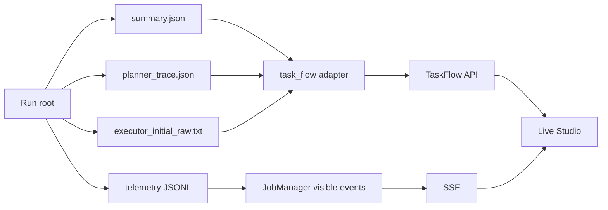

# Run 事实重建与安全边界

Studio 的动态流程不是独立模拟器。[`task_flow.py`](../../../v2/studio/task_flow.py) 在指定 Run 根目录中发现 case `summary.json` 与 `planner_trace.json`，把 Runtime 已写出的对象重建为 `TaskFlow`。它优先使用完整 summary；任务仍在运行时，也可以从 Planner trace 先展示已批准计划。

Planner step 的输入来自 CanonicalTaskSpec，输出来自 effective/approved plan 和 policy report；Retriever step 使用 EvidenceRequest 与 EvidencePack hash；Executor step组合输入 Ref、completion criteria、execution record、实际业务输出和 quality report；Summarizer step 使用依赖、ClaimSet 与验证信息。

生成程序视图不会从网页状态猜测。bounded Python 从 case 目录中的初始 raw response 和 execution record 恢复 source、model、policy hash、sandbox backend/UID/GID、exit code、artifact ID、output hash 与质量状态；DSL 从 Executor structured output 恢复 operations、input refs、output contract 和 Validator 结果。

task-flow 文件读取始终以已解析 Run root 为边界。候选路径必须能 `relative_to(root)`，文件数量、递归深度和读取大小受限，task ID 也由 API 正则限制。`/artifacts` 只返回相对路径和 size，不提供任意文件下载端点。

运行入口同样使用白名单。浏览器只能提交 Pydantic `RunCreate {recipe_id}`，extra 字段被拒绝；recipe ID 在服务端映射成固定 argv。客户端不能提交 shell、Python 源码、工作目录、文件路径、CUDA device 或任意 runner 参数。子进程通过 `create_subprocess_exec` 启动，不经过 shell 展开。

现有 recipe 包括快速运营 IQR、跨期财务三步链、完整效率矩阵、语义状态 holdout、记忆真实性、双任务族连续运行和 25 任务能力覆盖。公开 catalog 只暴露名称、模式、描述、时长、数据集/任务 ID 和 accent，不暴露可编辑命令。

固定证据与实时 Run 彻底分离。`/evidence/current` 读取 [`evidence_snapshot_20260726.json`](../../../v2/studio/data/evidence_snapshot_20260726.json)，Live 页读取 `$STATEBUS_STUDIO_RUNS_DIR/<run-id>`。Run 完成不会覆盖 snapshot；更新正式数字需要独立审计和显式发布步骤。

Studio 也不拥有 vLLM 生命周期。health 只检查指定 URL，启动脚本与 recipe 复用现有服务，不执行 stop/restart。GPU 作业由单 Worker 队列串行化，避免网页并发启动多个正式实验破坏资源与时延口径。

