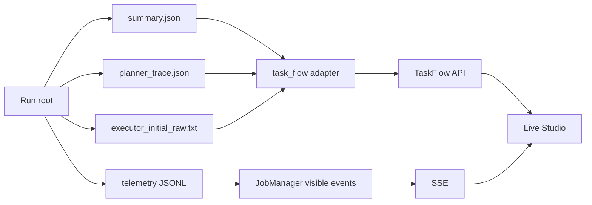

# Run 事实重建与访问控制

Studio 的动态流程来自真实 Run。[`task_flow.py`](../../../statebus/studio/task_flow.py) 在指定
Run 根目录中发现 case `summary.json` 与 `planner_trace.json`，把 Runtime 已写出的对象重建为
`TaskFlow`。完整 summary 提供终态视图，运行中的 Planner trace 提供已批准计划。

Planner step 的输入来自 CanonicalTaskSpec，输出来自 effective/approved plan 和 policy report；Retriever step 使用 EvidenceRequest 与 EvidencePack hash；Executor step组合输入 Ref、completion criteria、execution record、实际业务输出和 quality report；Summarizer step 使用依赖、ClaimSet 与验证信息。

生成程序视图从 case 目录中的初始 raw response 和 execution record 恢复 bounded Python 的
source、model、policy hash、sandbox backend/UID/GID、exit code、Artifact ID、output hash 与
质量状态；DSL 从 Executor structured output 恢复 operations、input refs、output contract 和
Validator 结果。

task-flow 文件读取限定在已解析 Run root。候选路径通过 `relative_to(root)` 核对，文件数量、
递归深度和读取大小使用固定预算，task ID 由 API 正则校验。`/artifacts` 返回相对路径与 size。

运行入口使用 recipe 白名单。浏览器提交 Pydantic `RunCreate {recipe_id}`，服务端将 recipe ID
映射成固定 argv；shell、Python 源码、工作目录、文件路径、CUDA device 和 runner 参数由服务端
recipe 配置。子进程通过 `create_subprocess_exec` 启动。

现有 recipe 包括快速运营 IQR、跨期财务三步链、完整效率矩阵、语义状态 holdout、记忆真实性、
双任务族连续运行和 25 任务能力覆盖。公开 catalog 展示名称、模式、描述、时长、数据集/任务 ID
和 accent，执行命令由服务端固定映射。

固定证据与实时 Run 分开存储。`/evidence/current` 读取
[`evidence_snapshot_20260726.json`](../../../statebus/studio/data/evidence_snapshot_20260726.json)，
Live 页读取 `$STATEBUS_STUDIO_RUNS_DIR/<run-id>`。Run 完成后保留独立运行目录，证据快照通过
发布步骤更新。

Studio health 检查指定 vLLM URL，启动脚本与 recipe 复用现有服务。GPU 作业进入单 Worker
队列串行执行，使资源占用与时延实验顺序保持稳定。
