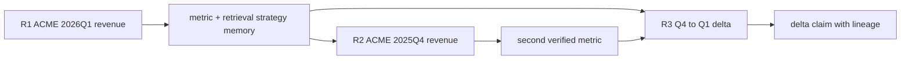

# 三轮财务任务：记忆如何进入下一轮

Studio 的 `financial-three-step` 配方运行 `formal_financial_reports` 前三轮。任务清单位于 [`manifest.json`](../../../v2/benchmark/samples/continuous_task_families/formal_financial_reports/manifest.json)，三轮分别提取 ACME 2026Q1 收入、提取 ACME 2025Q4 收入，再计算两期差额。它适合展示“历史候选不等于直接恢复答案”。

## 三轮依赖



R1 的 spec 为 `cross_period_financial_analysis / compare_metric`，读取 2026Q1 ACME revenue。结果通过 exact value 与来源检查后，verified Artifact 和执行/检索策略可以形成 MemoryCommit。Manifest 中的 expected fact 为 120，用于确定性 Validator，不会在运行前暴露给生成角色。

R2 保持 task family、intent、metric 和数据集，但 quarter 改为 2025Q4。混合检索可以找到 R1 的 strategy memory。Compatibility Gate 看到 task arguments 变化，因此不会把 120 当成本轮答案；若输出合同、Validator、Runtime 和 schema 兼容，历史检索/执行策略可以成为 validated replay 或 assist，当前季度数值仍从获准来源获得并验证。该轮 expected fact 为 109。

R3 的 intent 变为 `compute_delta`，required outputs 是 delta value、delta percent 和 summary。它消费前两轮 verified metric 对象及 lineage，计算 2025Q4 到 2026Q1 的变化。Manifest expected delta 为 11。因为 intent 改变，前两轮不是 R3 的 exact replay 结果，而是可验证输入与 assist；最终 ClaimSet 应同时引用两期来源。

## 记忆泳道

```mermaid
sequenceDiagram
    participant RT as Runtime
    participant IDX as MemoryIndexStore
    participant G as Compatibility Gate
    participant R as Retriever
    participant E as Executor
    participant V as Validators

    Note over RT,V: Round 1
    RT->>R: ACME 2026Q1 request
    R->>E: current evidence
    E-->>V: revenue artifact
    V-->>RT: verified value + lineage
    RT->>IDX: committed strategy/metric memory

    Note over RT,V: Round 2
    RT->>IDX: keyword + tags + vector query
    IDX-->>G: ranked R1 candidates
    G-->>RT: strategy compatible; old value not exact replay
    RT->>R: current request + compatible strategy view
    R->>E: 2025Q4 evidence
    E-->>V: current revenue artifact
    V-->>RT: verified value + consumption/effect record
    RT->>IDX: second committed metric

    Note over RT,V: Round 3
    RT->>IDX: query delta task
    IDX-->>G: R1/R2 verified metric candidates
    G-->>RT: assist/input reuse with lineage
    RT->>E: two verified metric refs
    E-->>V: delta artifact
    V-->>RT: verified delta + cited ClaimSet
```

## 兼容门拒绝时发生什么

如果后续文档出现 schema drift、Runtime signature/Validator 变化、memory 未 committed 或 task family 不同，候选会得到 `INCOMPATIBLE/DISALLOWED`，并记录具体 reason。Runtime 回到当前数据重新检索和计算；这种拒绝不是 Run 失败。

```text
similar memory found
  ├─ compatible -> bind to target role -> consume -> record effect
  └─ incompatible -> record rejection -> recompute current task
```

只有 MemoryRef 真正进入 Retriever/Executor/Summarizer 输入并生成 `MemoryConsumptionRecord`，该查询才算 actual-use。若只是候选被 RRF 找到，或兼容后没有改变任何 decision surface，不能称为跳步收益。跳过 generation step、跳过 LLM call 和 recipe recomputed 分别记录，避免用一个“命中率”掩盖不同效果。

这条三轮链也说明了记忆的主要价值：复用的是经过验证的策略、产物和来源关系，而不是把上轮自然语言答案无条件拼进本轮 Prompt。

