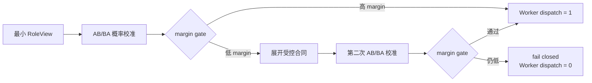

# Logit Retry Gate 受控挑战走读

普通任务经常直接产生高 margin 选择，只运行自然任务很难判断 Gate 是否真正改变了控制流。2026-07-27 的独立挑战套件因此构造了 12 个候选选择 case，并为每个 case 配对运行 `off` 与 `retry_once`，共 24 次串行运行。该套件在 Worker dispatch 边界结束，验证路由与授权，不执行后续完整业务计算。

任务分为三组。5 个简单对照从第一次 RoleView 起就给出足够合同，用来检查误重试；5 个受控歧义首次只显示两个表面等价的候选，低 margin 后才展开 IQR、连接键、多期序列、极值输出或 Python/DSL 能力边界；2 个不可判定负例即使展开合同仍没有合法选择，用来检查第二次低置信是否会被错误放行。



AB/BA 校准是实验公平性的一部分。同一 RoleView 分别使用正向和反向 alias 绑定请求模型，再按 candidate ID 对齐概率并取均值，避免受约束 JSON 对第一个别名 A 的位置偏好被误当成语义置信度。`off` 与 `retry_once` 共享相同首次 RoleView 和相同首次校准，12/12 配对任务的首次选择保持一致；Gold 与模型可见 manifest 分离。

| 场景 | Gate off | Retry once | 机制效果 |
|:--|--:|--:|:--|
| 简单对照 5 个 | 5/5 | 5/5 | 0 次误重试 |
| 受控歧义 5 个 | 3/5 | 5/5 | 5/5 展开合同，纠正 2 个错误路由 |
| 不可判定负例 2 个 | 0/2 | 2/2 | 错误放行判定由 2 降为 0 |
| 全部 Validator | 8/12 | 12/12 | 机制效果门通过 |

`retry_once` 路径共发生 19 次 Gate 尝试：5 个简单 case 各一次，5 个歧义 case 和 2 个负例各两次。19/19 状态由不同 PID 真实消费，19/19 在使用后释放。由于本套件固定两个候选，每次状态是两个候选概率加 `other_mass`，即 12 B；累计发布并释放 228 B。

机制成本也必须保留。Gate off 发生 24 次 vLLM 调用、共 6,110 Token；Retry once 发生 38 次调用、共 9,952 Token。差异来自每个阶段的 AB/BA 双探测和 7 个低 margin case 的二次选择。这组数据用于证明控制效果，不用于声称 Token 或时延下降。

结果不能与正式 `95/95` 基线合并：`12/12` 只是挑战套件的 Validator，正式证据快照没有被修改。机制交付时容器内 `tests/v2` 为 582 passed，说明合同、控制帧、跨 PID 状态、Runtime 接入和既有回归同时通过，但测试数量也不替代业务实验分母。

详细实验口径与 PPT 绘图建议见[受控机制实验报告](../../reports/StateBus-v2-LogitRetryGate受控机制实验-20260727.md)。复现入口为：

```bash
cd /home/qcrs/statebus/project
bash scripts/v2_diagnostics/run_logit_retry_challenge_gpu2.sh
```

脚本复用健康的 vLLM，不负责启动或重启模型服务；正式运行仍应遵守容器环境和 GPU 映射约束。

