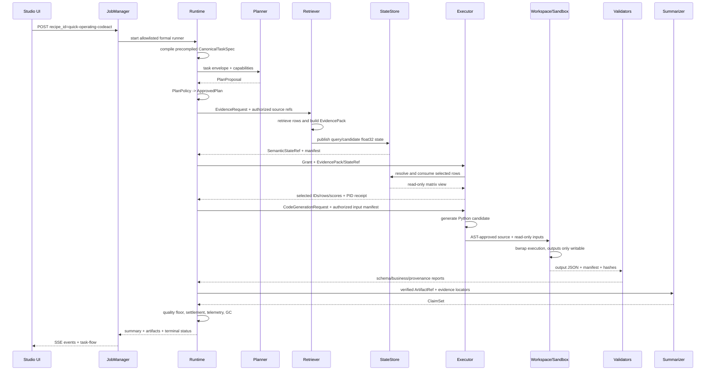

# 单任务全链路：运营指标 IQR 异常分析

Studio 的快速配方 `quick-operating-codeact` 通过 [`recipes.py`](../../../v2/studio/recipes.py) 启动 adaptive formal mainline，并选择 `formal-anomaly-001`。业务目标是对获准的运营指标列执行 IQR 异常检测，输出异常相关统计与可引用结论。下面关注运行对象，而不是固定某一次模型措辞。

## 启动到计划批准

用户点击“开始运行”后，浏览器只提交 recipe ID。JobManager 创建独立 Run 目录并排队；健康检查已确认 vLLM、Embedding、角色 Worker import 和单 Worker 队列正常后，Runner 才开始。

formal adapter 提供预编译 `CanonicalTaskSpec`，其中 task family、`detect_outliers` intent、目标列、IQR 方法、required outputs、required tools 和 quality checks 均来自注册样本。Planner 获得这份 spec 与 capability catalog，生成包含 Retriever、Executor 和 Summarizer 的 proposal。PlanPolicy 检查角色、DAG、capability、Ref 类型、输出合同和预算，产生 ApprovedPlan。

Planner 的模型输出不会原样传给 Retriever。Runtime 给 Retriever 的是批准步骤、EvidenceRequest、task/spec hash 和获准 corpus scope；Studio 显示 Planner input/output 时，也分别展示 CanonicalTaskSpec 与 ApprovedPlan。

## 完整泳道

## Retriever 具体产生什么

Retriever 从批准的数据对象中构造 source rows 和 locator，不向 Executor 暴露原始任意路径。它形成 `CanonicalEvidencePack`，并可将 query 与候选编码为 float32 dense state。Manifest 把 row 1..N 绑定到候选 ID 和表格位置。

另一个进程解析 `SemanticStateRef`，执行 top-k 选择并返回 row indices、candidate IDs、scores、producer/consumer PID 与 encoder signature。Runtime 生成 `StateConsumptionRecord`，记录选择前后 decision surface 与 behavioral effect。Executor 最终得到的是被选证据的受控 hydration，而不是整份数据集的自由读取权限。

## Executor 的两种可能表示

ApprovedPlan 中 capability 决定实际执行表示。若为 `execute_bounded_python_v2`，模型根据 task goal、operation semantics、授权 schema、输入路径和输出合同生成 Python。源码先过 AST/路径策略，再在真实 bwrap profile 中运行；输入只读、网络关闭、唯一 outputs mount 可写。结果还要通过 IQR 业务 Validator，而不是只检查 JSON 字段。

若注册 capability 选择 Transform DSL，Executor 产生结构化 operations，由解释器执行 `filter`、`sort`、`anomaly`、`aggregate` 等允许操作。DSL 不使用 eval，也不能携带任意路径。两条路径都会生成 ExecutionArtifactRef 和质量报告；Studio 的程序面板根据真实 execution record 显示 Python 或 DSL。

## 对象台账

| 阶段 | 输入对象 | 转换 | 输出对象 | 验证点 |
|:--|:--|:--|:--|:--|
| Task Compiler | precompiled sample | enum/schema normalization | CanonicalTaskSpec | strict formal contract |
| Planner | spec + envelope + catalog | LLM proposal | PlanProposal | PlanPolicy |
| Runtime | proposal | normalize/approve | ApprovedPlan | policy report/registry digest |
| Retriever | EvidenceRequest + source refs | retrieve/fan-in/encode | EvidencePack + SemanticStateRef | locator/hash/manifest |
| State consumer | dense matrix | top-k selection | selection receipt | PIDs/signature/decision effect |
| Executor | Grant + verified inputs | Python sandbox 或 DSL | Artifact candidate | policy/exit/schema/business facts |
| Commit path | candidate + reports | settlement | verified ArtifactRef | input/artifact/quality gate |
| Summarizer | verified artifact + evidence | cited composition | ClaimSet | claim/provenance validation |
| Runtime terminal | claims + all reports | metrics/GC | result + ledgers | system gate |

## 界面为何能实时变化

Runtime 发出 `ADAPTIVE_PLAN_APPROVED`、`STEP_RUNNING`、`STATE_PUBLISHED`、`STATE_CONSUMED`、`ARTIFACT_PUBLISHED`、`ARTIFACT_VALIDATED`、`STEP_COMPLETED` 和 `TASK_SUMMARY_METRICS` 等事件。JobManager tail JSONL，筛选安全字段后通过 SSE 推送；task-flow adapter 同时轮询 summary/trace，补充 Agent 输入、生成程序和 Validator。

React Flow 节点的 active/done/error 来自这些事实。动画只表示当前对象正在交接，不表示模型的隐式推理内容。任务完成后，“新建运行”只清空前端当前工作台，历史 Run 与磁盘证据仍保留。

