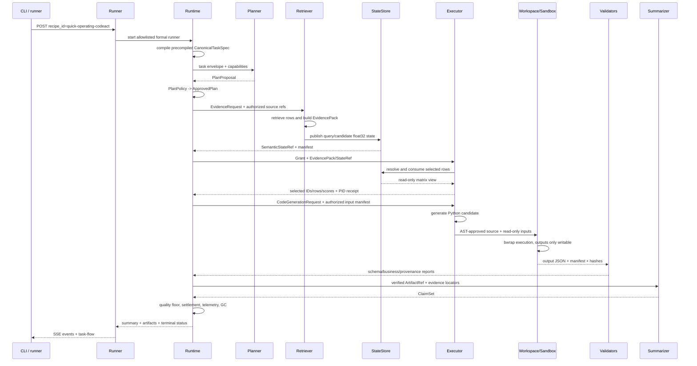
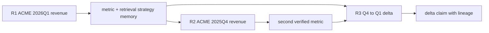
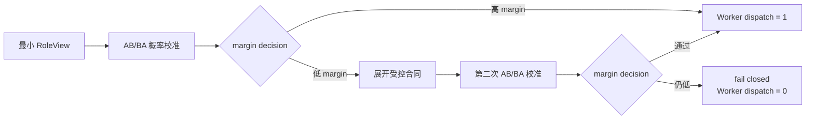

# 任务梳理与实验流程

## 端到端任务梳理

一次正常任务从 task input 到结果的主要对象关系如下：

~~~mermaid
sequenceDiagram
    participant I as CLI / Benchmark input
    participant R as Runtime
    participant W as Role provider
    participant S as State / Artifact store
    I->>R: task input
    R->>R: compile CanonicalTaskSpec
    R->>R: approve PlanProposal
    R->>W: dispatch attempt + CapabilityGrant
    W->>S: resolve StateRef / write Artifact
    W-->>R: result + receipt
    R->>R: validate and settle attempt
    R-->>I: ClaimSet / task result
~~~

### 关键检查点

1. task_id、step_id、attempt_id 和 trace_id 在当前调用过程中保持可关联。
2. PlanPolicy 先产生批准计划，provider 通过对应 grant 取得下游权限。
3. StateRef 解析、Artifact verification、quality check 和 Memory commit 分别留下 receipt 或 telemetry。
4. timeout 或 late result 仅更新匹配的 current attempt，已结算步骤保持不变。
5. task_wall_ms 包含 Runtime、provider、State/Artifact、服务切换和清理成本。

### 结果入口

走读代码：

~~~text
src/statebus/runtime/driver.py
src/statebus/runtime/adaptive_mainline.py
src/statebus/runtime/adaptive_runtime.py
src/statebus/runtime/adaptive_dispatcher.py
src/statebus/runtime/telemetry.py
~~~

配对结果：

- 标准任务流程：48 个任务位置、24 对 SB-FULL/P-TEXT，见 tests/evidence/mainline/；
- 机制：24 个计划位置，当前汇总见 [`tests/evidence/mechanisms/`](../../tests/evidence/mechanisms)；
- utility：28 个计分位置，见 tests/evidence/model-assist/。

完整事件、ledger 和服务日志按 run ID 位于 `runs/`；本页不重复复制实验表。

---

## 单任务全调用路径：运营指标 IQR 异常分析

示例 `quick-operating-codeact` 启动 adaptive formal mainline，并选择 `formal-anomaly-001`。业务目标是对获准的运营指标列执行 IQR 异常检测，输出异常相关统计与可引用结论。下面关注运行对象和记录字段。

### 启动到计划批准

Runner 创建独立 Run 目录并排队；健康检查已确认 vLLM、Embedding 和角色 Worker import 正常后，任务才开始。

formal adapter 提供预编译 `CanonicalTaskSpec`，其中 task family、`detect_outliers` intent、目标列、IQR 方法、required outputs、required tools 和 quality checks 均来自注册样本。Planner 获得这份 spec 与 capability catalog，生成包含 Retriever、Executor 和 Summarizer 的 proposal。PlanPolicy 检查角色、DAG、capability、Ref 类型、输出合同和预算，产生 ApprovedPlan。

Planner 的模型输出不会原样传给 Retriever。Runtime 给 Retriever 的是批准步骤、EvidenceRequest、task/spec hash 和获准 corpus scope；运行记录分别保存 CanonicalTaskSpec 与 ApprovedPlan。

### 完整泳道



### Retriever 具体产生什么

Retriever 从批准的数据对象中构造 source rows 和 locator，不向 Executor 暴露原始任意路径。它形成 `CanonicalEvidencePack`，并可将 query 与候选编码为 float32 dense state。Manifest 把 row 1..N 绑定到候选 ID 和表格位置。

另一个进程解析 `SemanticStateRef`，执行 top-k 选择并返回 row indices、candidate IDs、scores、producer/consumer PID 与 encoder signature。Runtime 生成 `StateConsumptionRecord`，记录选择前后 decision surface 与 behavioral effect。Executor 得到被选证据的受控 hydration，读取范围由 capability grant 和输入 Ref 决定。

### Executor 的两种可能表示

ApprovedPlan 中 capability 决定实际执行表示。若为 `execute_bounded_python_v2`，模型根据 task goal、operation semantics、授权 schema、输入路径和输出合同生成 Python。源码先过 AST/路径策略，再在真实 bwrap profile 中运行；输入只读、网络关闭、唯一 outputs mount 可写。结果还要通过 IQR 业务 Validator 和 JSON 字段检查。

若注册 capability 选择 Transform DSL，Executor 产生结构化 operations，由解释器执行
`filter`、`sort`、`anomaly`、`aggregate` 等注册操作。DSL 输入由字段、Ref 和结构化参数组成。
两条路径都会生成 ExecutionArtifactRef 和质量报告；execution record 记录 Python 或 DSL。

### 对象台账

| 阶段 | 输入对象 | 转换 | 输出对象 | 验证点 |
|:--|:--|:--|:--|:--|
| Task Compiler | precompiled sample | enum/schema normalization | CanonicalTaskSpec | strict formal contract |
| Planner | spec + envelope + catalog | LLM proposal | PlanProposal | PlanPolicy |
| Runtime | proposal | normalize/approve | ApprovedPlan | policy report/registry digest |
| Retriever | EvidenceRequest + source refs | retrieve/fan-in/encode | EvidencePack + SemanticStateRef | locator/hash/manifest |
| State consumer | dense matrix | top-k selection | selection receipt | PIDs/signature/decision effect |
| Executor | Grant + verified inputs | Python sandbox 或 DSL | Artifact candidate | policy/exit/schema/business facts |
| Commit path | candidate + reports | settlement | verified ArtifactRef | input/artifact/quality checks |
| Summarizer | verified artifact + evidence | cited composition | ClaimSet | claim/provenance validation |
| Runtime terminal | claims + all reports | metrics/GC | result + ledgers | terminal checks |

### 运行记录

Runtime 发出 `ADAPTIVE_PLAN_APPROVED`、`STEP_RUNNING`、`STATE_PUBLISHED`、`STATE_CONSUMED`、`ARTIFACT_PUBLISHED`、`ARTIFACT_VALIDATED`、`STEP_COMPLETED` 和 `TASK_SUMMARY_METRICS` 等事件。JSONL 保存 Agent 输入、生成程序、Validator 和终态记录。

---

## 三轮财务任务：记忆如何进入下一轮

`financial-three-step` 示例运行 `formal_financial_reports` 前三轮。任务清单位于 [`manifest.json`](../../src/statebus/benchmark/samples/continuous_task_families/formal_financial_reports/manifest.json)，三轮分别提取 ACME 2026Q1 收入、提取 ACME 2025Q4 收入，再计算两期差额。它展示历史候选如何经过兼容性检查后参与当前任务。

### 三轮依赖



R1 的 spec 为 `cross_period_financial_analysis / compare_metric`，读取 2026Q1 ACME revenue。结果通过 exact value 与来源检查后，verified Artifact 和执行/检索策略可以形成 MemoryCommit。Manifest 中的 expected fact 为 120，用于确定性 Validator，不会在运行前暴露给生成角色。

R2 保持 task family、intent、metric 和数据集，但 quarter 改为 2025Q4。混合检索可以找到 R1 的 strategy memory。兼容性检查看到 task arguments 变化，因此不会把 120 当成本轮答案；若输出合同、Validator、Runtime 和 schema 兼容，历史检索/执行策略可以成为 validated replay 或 assist，当前季度数值仍从获准来源获得并验证。该轮 expected fact 为 109。

R3 的 intent 变为 `compute_delta`，required outputs 是 delta value、delta percent 和 summary。它消费前两轮 verified metric 对象及 lineage，计算 2025Q4 到 2026Q1 的变化。Manifest expected delta 为 11。由于 R3 的 intent 改变，前两轮以可验证输入和 assist 参与计算；最终 ClaimSet 应同时引用两期来源。


### 兼容检查分支

如果后续文档出现 schema drift、Runtime signature/Validator 变化、memory 未 committed 或 task family 不同，候选会得到 `INCOMPATIBLE/DISALLOWED`，并记录具体 reason。Runtime 回到当前数据重新检索和计算；Run 继续保留该判定记录。

```text
similar memory found
  ├─ compatible -> bind to target role -> consume -> record effect
  └─ incompatible -> record rejection -> recompute current task
```

actual-use 查询由进入 Retriever/Executor/Summarizer 输入并生成 `MemoryConsumptionRecord` 的
MemoryRef 计数。候选发现、兼容、消费、decision surface 变化、跳过 generation step、跳过
LLM call 和 recipe recomputed 分别记录。

这条三轮过程也说明了记忆的主要价值：复用经过验证的策略、产物和来源关系，并为本轮 Prompt 提供结构化输入。

---

## Logit Retry Decision 受控流程

独立任务构造 12 个候选选择 case，并为每个 case 配对运行 `off` 与 `retry_once`，共
24 次串行运行。任务在 Worker dispatch 判定后结束，集中测量路由与授权控制。

任务分为三组。5 个简单对照从第一次 RoleView 起给出完整合同；5 个受控歧义首次显示两个
表面等价的候选，低 margin 后展开 IQR、连接键、多期序列、极值输出或 Python/DSL 能力信息；
2 个不可判定负例在展开合同后仍没有合法选择。



AB/BA 校准是实验公平性的一部分。同一 RoleView 分别使用正向和反向 alias 绑定请求模型，再按 candidate ID 对齐概率并取均值，避免受约束 JSON 对第一个别名 A 的位置偏好被误当成语义置信度。`off` 与 `retry_once` 共享相同首次 RoleView 和相同首次校准，12/12 配对任务的首次选择保持一致；Gold 与模型可见 manifest 分离。

| 场景 | Decision off | Retry once | 机制效果 |
|:--|--:|--:|:--|
| 简单对照 5 个 | 5/5 | 5/5 | 0 次误重试 |
| 受控歧义 5 个 | 3/5 | 5/5 | 5/5 展开合同，纠正 2 个错误路由 |
| 不可判定负例 2 个 | 0/2 | 2/2 | 错误放行判定由 2 降为 0 |
| 全部 Validator | 8/12 | 12/12 | 机制效果检查通过 |

`retry_once` 路径共发生 19 次决策尝试：5 个简单 case 各一次，5 个歧义 case 和 2 个负例各两次。19/19 状态由不同 PID 真实消费，19/19 在使用后释放。由于本套件固定两个候选，每次状态是两个候选概率加 `other_mass`，即 12 B；累计发布并释放 228 B。

Decision off 发生 24 次 vLLM 调用、共 6,110 Token；Retry once 发生 38 次调用、共 9,952 Token。
差异来自每个阶段的 AB/BA 双探测和 7 个低 margin case 的二次选择。该机制用额外调用换取
Validator `8/12 -> 12/12`、歧义任务 `3/5 -> 5/5` 和错误放行 `2 -> 0`。

挑战套件以 12 个任务为分母，系统基线以 95 个检查项为分母。机制交付时容器内测试结果为
582 passed，覆盖合同、控制帧、跨 PID 状态、Runtime 接入和既有回归。

详细任务、实验结果与日志索引见[实验结果总览](../experiments/README.md)。
复现入口为：

```bash
# 在仓库根目录执行
bash scripts/diagnostics/run_logit_retry_challenge_gpu2.sh
```

脚本复用已运行的 vLLM，容器环境和 GPU 映射由部署配置提供。

