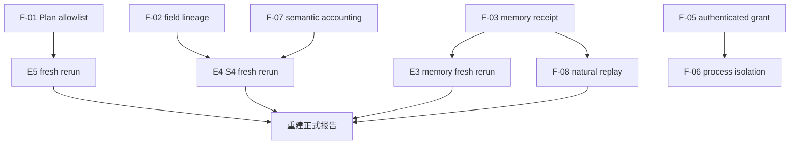

# StateBus v2 Review 问题详细修复说明

日期：2026-07-20
文档状态：待实施修复方案，不代表下列问题已经修复
代码基线：`feat/yzm-v2-migration`，当前 HEAD `bda17745ecb8a160221efe3b58ca678644dac81a`
实验基线：`/home/qcrs/statebus/runs/contest_evidence_closure_20260720` 中 E0-E6 canonical runs
适用范围：StateBus v2 的结构化协议、字段级证据、非文本中间状态、共享记忆、CodeAct、权限边界、Telemetry 与赛题实验口径

## 0. 这份文档解决什么问题

本文件把全面 Review 中发现的问题转换为可以直接实施的修复工作包，回答四个问题：

1. 当前实现中具体有什么问题；
2. 为什么这个问题会影响正确性、安全边界或赛题结论；
3. 应该修改哪些合同、运行时路径、测试和实验；
4. 什么证据出现后，才可以把问题标记为已修复。

本文件不是重新设计 StateBus，也不否定已经成立的能力。当前已经有真实实现和实验证据支持：

- UDS 上的 typed Protobuf 控制帧与 Ref 传递；
- little-endian float32 embedding matrix 的跨进程发布、读取和数值 top-k；
- selected IDs 对 EvidencePack hydration 的真实影响；
- SQLite 与向量检索结合的 MemoryRef 检索、兼容性判断和 commit gate；
- bounded Python CodeAct 的静态检查、隔离执行、运行时修复和质量重算；
- Planner、Retriever、Executor、Summarizer 四个角色的不同能力面；
- openEuler 24.03 LTS-SP3 单容器中的 fresh E0-E6 收口。

需要修复的是这些机制之间仍未闭合的边界，以及部分指标把“准备发送”误写成“实际消费”的真实性问题。

配套阅读：

- [全面 Review 报告](../../reports/statebus_v2_comprehensive_review_20260720.md)
- [正式系统、任务与实验报告](../../reports/statebus_v2_system_task_experiment_report_20260720.md)
- [S4 与 Q1 到 Q2 端到端任务流转](../../reports/statebus_v2_end_to_end_task_walkthrough_20260720.md)
- [赛题原文](../../reference/题目.md)
- [上一轮完成审计](../25_contest_evidence_closure_20260720/01_completion_audit_20260720.md)

## 1. 修复时必须保持的事实边界

### 1.1 不改写旧实验身份

canonical E0-E6 manifest 记录的代码身份是：

```text
git_head = a3a5ec836d13c5e9d77811edd25d58d24af227b6
git_dirty = true
```

当前工作树 HEAD 已经是 `bda17745...`。后续修复必须产生新的 commit 和新的 run root，不能覆盖旧 artifact，也不能把旧 run 追认为“基于干净的 bda17745 提交运行”。旧证据继续用于说明修复前事实，新证据用于说明修复后结果。

### 1.2 不扩大当前能力名称

本轮修复仍不得把 embedding semantic state 写成：

- hidden-state transfer；
- KV cache transfer；
- 跨推理引擎的 tensor handoff。

KV cache / hidden-state handoff 仍按仓库规则写为 Future Work，当前实现只可称为 embedding semantic state 和 Engine-Local Prefix Reuse。

### 1.3 不把内部相关性描述成强安全边界

在 CapabilityGrant 完成跨进程认证前，当前机制只能称为：

```text
进程内 capability binding + 跨进程 grant hash correlation
```

不能称为不可伪造、可抗重放的跨信任边界授权。

### 1.4 不把候选、批准、披露、消费和收益混成一个数字

Memory 至少需要分开统计：

```text
candidate
  -> policy_approved
  -> disclosed_to_role
  -> rendered_or_executed
  -> accepted_output_effect
  -> validated_replay
  -> skipped_llm
```

任何一层都不能自动推出下一层。特别是：

- 检索到不等于批准使用；
- 加入 Python payload 不等于进入 Prompt；
- 进入 Prompt 不等于模型依赖；
- 执行旧 recipe 不等于执行成功；
- recipe reuse 不等于跳过 LLM；
- output hash 改变不等于质量提升。

## 2. 修复原则

### 2.1 Fail closed

任务级 allowlist、字段级来源、grant 校验和 replay eligibility 只要缺少一个必要条件，就拒绝当前动作，而不是依赖“另一个条件恰好合法”继续执行。

### 2.2 Producer 必须有明确 Consumer

每个进入正式 claim 的中间对象都要回答：

- 谁生成；
- 谁被允许读取；
- 谁实际读取；
- 读取了哪些字段；
- 产生了什么可观察效果；
- 对应的 audit artifact 在哪里。

只生成但没有业务或治理 consumer 的对象，不计入“被消费”；只用于审计的对象要明确标记为 governance consumption。

### 2.3 权限由 Controller 授予，角色不能自行继承或扩大

Planner 只能提出 capability；Retriever 只能提出 query；Executor 只能读取 step-scoped input 并写单一输出；Summarizer 只能看到 verified row、必要来源和明确允许的记忆摘要。embedding selector 是 Runtime 数值组件，不是获得额外权限的第五个 Agent。

### 2.4 合同先于 Prompt

字段来源、消费回执、grant 和 telemetry identity 都应成为结构化合同。不能只在 Prompt 里告诉模型“请引用完整”，也不能靠日志字符串推断实际消费。

### 2.5 指标必须从事实事件聚合

PID、role、step ID 属于 identity/event attribute，不能相加。Counter 只能由互不重复的原子事件产生，不能把 stage summary 和 event summary 再次求和。

### 2.6 旧证据不可变，新结论必须 fresh rerun

修复代码、单元测试通过以后，还要重新运行受到影响的 E1、E3、E4、E5、E6。只有新 run manifest、checksum、角色请求、消费记录和 summary 同时闭合，报告才可以升级口径。

## 3. 优先级总表

| ID | 优先级 | 要修复什么 | 为什么必须修 | 完成后的核心证据 |
| --- | --- | --- | --- | --- |
| F-01 | P0 | PlanPolicy output allowlist 布尔漏洞 | descriptor 合法时可绕过 task envelope | 排除 descriptor contract 的计划稳定返回 `step_output_contract_not_allowed` |
| F-02 | P0 | S4 字段级 source lineage 与 citation coverage | Claim 同时断言数值和 qualifier，却只引用数值表 | 缺 table 或 narrative 任一来源均 fail closed |
| F-03 | P0 | Memory 实际消费回执与记账 | E3 的 23 条中有 15 条 Summarizer 假阳性 | 仅 rendered/executed 的 memory ID 生成 consumption event |
| F-04 | P0 | 修复前报告和聚合口径 | 错误数字会直接影响赛题核心 claim | 旧 23 条改称 recorded consumption，并披露角色拆分 |
| F-05 | P1 | CapabilityGrant 跨进程认证 | worker 目前只检查 hash 非空 | 篡改、过期、跨 task、跨 step、重放均拒绝 |
| F-06 | P1 | semantic selector 最小 OS 权限 | worker 继承 Controller Unix identity | fd-only 或只读最小 mount，且进程凭据/可见路径受限 |
| F-07 | P1 | semantic state owner、consumer 与计数分离 | 当前 Executor/Retriever 身份混写，PID 被求和 | 三个 matrix 对应三个消费事件和 PID 集合，不再出现 PID sum |
| F-08 | P1 | 参数化 recipe 与真实 LLM skip | Q1 到 Q2 发生 repair，未节省 LLM | paired run 中出现真实非零 skip 且质量不回退 |
| F-09 | P2 | wire-level Hello/Capability negotiation | 当前只有进程内 registry discovery | worker 与 Controller 交换并校验协议版本和 registry digest |
| F-10 | P2 | 普通 subprocess worker-owned computation | L0-L3 普通 worker 只回显 Ref | 至少一个业务 operation 在 worker 内计算并由 hash 验证 |
| F-11 | P2 | Planner normalization 分层统计 | 25/25 normalized 掩盖 raw plan 可执行率 | 四类 plan outcome 独立统计 |
| F-12 | P2 | 实验随机化、重复、区间和 warnings | 单次固定顺序不足以支持稳定时延结论 | ABBA/随机顺序重复、置信区间、warnings 清零或受控豁免 |

依赖关系如下：



## 4. P0-1：修复 PlanPolicy output allowlist 绕过

### 4.1 当前问题

位置：[v2/runtime/plan_policy.py](../../../v2/runtime/plan_policy.py#L285)

当前逻辑是：

```python
if step.output_contract_version != descriptor.output_contract_version:
    issues.append(... "capability_output_contract_mismatch" ...)

if step.output_contract_version not in envelope.allowed_output_contracts \
        and step.output_contract_version != descriptor.output_contract_version:
    issues.append(... "step_output_contract_not_allowed" ...)
```

第二个判断把两条独立规则错误地用 `and` 绑定：

1. step output 必须匹配 capability descriptor；
2. step output 必须位于当前 task envelope 的 allowlist。

当 step output 与 descriptor 一致、但被 envelope 排除时，第二项的右半部分为 false，整个判断不报错。结果是 capability registry 的静态合同可以覆盖任务级动态权限边界。

### 4.2 为什么必须修

`AdaptiveTaskEnvelope.allowed_output_contracts` 的职责是限定“这个任务本次允许产出什么”，而不是重复 descriptor 的全局声明。如果 task envelope 不能独立收紧 contract，Controller 对 Planner 的任务级约束就不是闭合的。

当前 canonical E5 没有因此产生错误结果，因为 envelope 恰好包含所选 capability 的 output contract。但安全和正确性测试必须覆盖被排除的组合，不能以“现有样本没触发”代替修复。

### 4.3 怎么修

第一步，将两条规则完全独立：

```python
if step.output_contract_version != descriptor.output_contract_version:
    issues.append(self._issue(
        "capability_output_contract_mismatch",
        step,
        "output_contract_version",
        step.output_contract_version,
    ))

if step.output_contract_version not in envelope.allowed_output_contracts:
    issues.append(self._issue(
        "step_output_contract_not_allowed",
        step,
        "output_contract_version",
        step.output_contract_version,
    ))
```

第二步，检查 final output contract 是否也同时满足：

- proposal 声明；
- terminal step descriptor；
- task envelope allowlist。

如果现有代码已经分别检查，则只补测试，不重复实现。

第三步，保证 fallback 和 single-repair 路径重新经过同一 validator，不允许 fallback 绕过 task envelope。

### 4.4 修改位置

- `v2/runtime/plan_policy.py`
- `tests/v2/test_adaptive_planner_policy.py`
- 如 final contract 检查分散，再核对 `v2/runtime/adaptive_plan_compiler.py`

### 4.5 必须新增的测试

至少覆盖以下真值表：

| descriptor match | envelope allow | 预期 |
| --- | --- | --- |
| true | true | 不因 output contract 被拒绝 |
| true | false | `step_output_contract_not_allowed` |
| false | true | `capability_output_contract_mismatch` |
| false | false | 同时包含两个 issue |

还要覆盖：

- single repair 返回被 envelope 排除的 contract，必须拒绝；
- registered fallback 使用被排除的 contract，必须拒绝；
- terminal output 与 step output 不一致，必须拒绝；
- 合法 E5 计划继续通过，避免误伤现有 capability pack。

建议定向命令：

```bash
python -m pytest -q tests/v2/test_adaptive_planner_policy.py
```

### 4.6 验收标准

- 复现 Review 漏洞的测试由 `approved=True` 变为 `approved_plan is None`；
- issue 中稳定出现 `step_output_contract_not_allowed`；
- descriptor mismatch 与 envelope mismatch 可独立观察；
- fallback、repair、normal path 使用同一规则；
- 相关测试和完整 `tests/v2` 均通过。

## 5. P0-2：补齐字段级 source lineage 与 citation coverage

### 5.1 当前问题

主要位置：

- [v2/runtime/claims.py](../../../v2/runtime/claims.py#L17)
- [v2/benchmark/adaptive_formal_mainline.py](../../../v2/benchmark/adaptive_formal_mainline.py#L714)
- [v2/contracts/adaptive.py](../../../v2/contracts/adaptive.py#L459)

S4 最终 Claim 同时包含：

```text
throughput_units = 760
shipment_qualifier = capacity-capped pending rail-slot approval
```

但 Claim 只引用 `ctx-section-4`。该 item 的 Throughput table 支持 `760`，不支持 qualifier；qualifier 来自另一个 Operating constraint evidence item。

当前 `_row_scoped_evidence_items()` 对每个 output row 只选 token-overlap 最佳的一条 evidence。一个 row 同时由表格字段和叙述字段组成时，第二来源天然可能被丢弃。

当前 `ClaimSetValidator` 验证 ID、locator、artifact provenance 和数值是否存在于 verified artifact，却没有验证每个事实字段是否有完整 source support。

### 5.2 为什么必须修

ExecutionArtifactRef 能证明“程序算出了这个 row”，但不能单独替代面向原始材料的引用。对用户和评委而言，最终句子中的每一个事实都应能沿 lineage 回到原始表格或文本，而不是只能回到一个程序输出。

如果 citation 只覆盖数值，不覆盖限定语，系统会出现一种危险状态：

- 结果值可能正确；
- artifact 可能 verified；
- ClaimSet validator 可能通过；
- 用户点击 citation 却看不到完整陈述的依据。

这会直接削弱“结构化状态让结果更可验证”的核心论点。

### 5.3 修复目标数据模型

不要用更复杂的 Prompt 替代合同。建议新增字段级支持对象，名称可按实现风格调整：

```python
@dataclass(frozen=True)
class ClaimFieldSupport:
    field_path: str
    normalized_value_hash: str
    support_kind: str
    evidence_item_ids: tuple[str, ...]
    artifact_ref_id: str = ""
    artifact_field_path: str = ""
    source_locators: tuple[str, ...] = ()
```

每个 Claim 增加：

```python
factual_fields: dict[str, JSONScalar]
field_support: tuple[ClaimFieldSupport, ...]
```

设计约束：

- `field_path` 必须指向 Claim 的结构化事实字段；
- `normalized_value_hash` 防止支持关系被复用于不同值；
- `evidence_item_ids` 指向 CanonicalEvidencePack 中真实存在的 item；
- derived value 同时给出 `artifact_ref_id` 和 `artifact_field_path`；
- `source_locators` 必须是 evidence item 自带 locator 的子集；
- 一个字段允许多来源，一个来源也允许支持多个字段；
- `claim_text` 是呈现层，validator 以结构化事实字段为主，不依赖脆弱的全文 token-overlap。

### 5.4 合同版本策略

推荐不要静默改变 `statebus.claim_set.v1` 的语义。采用两阶段策略：

1. 立即修复 projection，使当前 S4 同时把 table 和 Operating constraint 放入 Summarizer reference catalog，并增加 formal 专用 coverage gate；
2. 引入 `statebus.claim_set.v2` / `statebus.cited_report.v2`，将 `field_support` 设为正式必填合同，保留 v1 reader 只用于读取历史 artifact。

如果赛题时间要求先做最小改动，可以先在 v1 dataclass 中添加有默认值的字段，但新 formal run 必须启用 strict validator。不能因为兼容旧 artifact，就允许新 artifact 缺字段继续标为 ready。

### 5.5 怎么修 projection

建议将 `_row_scoped_evidence_items()` 从“每行只返回一个最高分 item”改为“按输出字段收集最小完备来源集合”。

推荐流程：

1. Executor 在 verified output row 中保留每个字段的 derivation metadata；
2. derivation metadata 指向输入 row 字段、evidence item 和 locator；
3. projection 根据当前 Claim 要呈现的 factual fields 求来源并集；
4. Summarizer 只能从这个完备 reference catalog 选择 citation；
5. 如果任一必需字段无法回溯到 source，进入 `missing_field_support`，不调用或不接受 Summarizer ready 输出。

S4 的目标映射至少应为：

| factual field | artifact field | 原始来源 |
| --- | --- | --- |
| `region` | `rows[0].region` | Delta Hub table row / task selector |
| `period` | `rows[0].period` | 2026Q2 table row / task selector |
| `throughput_units` | `rows[0].throughput_units` | Throughput table，`ctx-section-4` |
| `shipment_qualifier` | `rows[0].shipment_qualifier` | Operating constraint，`ctx-section-1` |
| `qualifier_locator` | `rows[0].qualifier_locator` | Operating constraint heading / locator |

### 5.6 怎么修 Summarizer Prompt 和输出解析

Summarizer request 中增加只读的 `field_support_catalog`，每个条目包含：

- field path；
- verified value；
- allowed evidence item IDs；
- allowed locators；
- derived artifact field；
- 是否为必须引用字段。

Prompt 要求模型返回结构化 `field_support`，但最终可信性不能依赖模型自报。Parser 和 validator 必须重新检查：

- 模型给出的 ID 是否在 catalog 中；
- 是否覆盖所有非空 factual fields；
- 是否引用了不允许的 item；
- 同一个 locator 是否真的属于对应 evidence item；
- value hash 是否与 verified row 一致。

### 5.7 怎么修 ClaimSetValidator

在现有 ID/provenance/numeric 检查之后增加 coverage gate：

```text
for every non-empty factual field:
    support entry exists
    support value hash matches
    at least one allowed source exists
    all evidence IDs exist in the current EvidencePack
    all locators belong to those evidence items
    derived artifact is verified and belongs to current task/session
```

错误码建议保持细分：

- `claim_field_support_missing:<field_path>`
- `claim_field_value_hash_mismatch:<field_path>`
- `claim_field_evidence_unknown:<field_path>`
- `claim_field_locator_mismatch:<field_path>`
- `claim_field_artifact_unverified:<field_path>`
- `claim_field_source_lineage_incomplete:<field_path>`

不要只返回笼统的 `missing_citation`，否则 repair Prompt 无法知道应补哪一个字段。

### 5.8 必须新增的测试

修改或新增：

- `tests/v2/test_adaptive_claims.py`
- `tests/v2/test_evidence_projection.py`
- `tests/v2/test_adaptive_formal_compare.py`
- `tests/v2/test_adaptive_mainline_integration.py`

测试用例至少包括：

1. 数值和 qualifier 两个来源都存在，验证通过；
2. 只缺 qualifier source，必须 fail closed；
3. 只缺 table source，必须 fail closed；
4. evidence ID 存在但 locator 属于另一个 item，必须拒绝；
5. artifact verified 但 source lineage 不完整，必须拒绝；
6. value hash 与 verified row 不一致，必须拒绝；
7. 多行 batch 中每一行独立覆盖，不能借用另一行 citation；
8. citation repair 只能从 allowlisted catalog 补充，不能创造新 ID。

定向命令：

```bash
python -m pytest -q \
  tests/v2/test_adaptive_claims.py \
  tests/v2/test_evidence_projection.py \
  tests/v2/test_adaptive_formal_compare.py \
  tests/v2/test_adaptive_mainline_integration.py
```

### 5.9 验收标准

- 修复前的 S4 单 citation Claim 稳定失败；
- 同时引用 Throughput table 与 Operating constraint 后通过；
- 每个最终事实字段均可回到 source locator；
- Summarizer 不可引用当前 EvidencePack 之外的 ID；
- verified artifact 不能替代缺失的 source lineage；
- E4 fresh holdout 4/4 通过，且 S4 artifact 中保存 field-level lineage；
- 报告可以展示字段到 source 的机器可读映射，而不是人工解释。

## 6. P0-3：让 Memory consumption 只反映真实消费

### 6.1 当前问题

主要位置：

- [v2/runtime/adaptive_dispatcher.py](../../../v2/runtime/adaptive_dispatcher.py#L590)
- [v2/benchmark/adaptive_formal_mainline.py](../../../v2/benchmark/adaptive_formal_mainline.py#L1394)
- [scripts/v2_diagnostics/run_adaptive_agent_smoke.py](../../../scripts/v2_diagnostics/run_adaptive_agent_smoke.py#L540)
- [v2/runtime/role_path.py](../../../v2/runtime/role_path.py)

当前 Dispatcher 为 Executor 和 Summarizer 准备相同的 memory payload，其中含完整 `execution_recipe.source`。formal mainline 把它作为 `compatible_memory_inputs` 发送给 isolated Summarizer worker。

但 Summarizer worker 只读取：

- evidence items；
- artifact summaries；
- task goal；
- expected claim count。

它没有把 `compatible_memory_inputs` 传给 `build_claim_set()`，该方法也没有 memory 参数。persisted Summarizer rendered request 中没有 memory ID、旧任务 recipe 或 source。

Dispatcher 仍在角色返回后，对所有准备好的 memory inputs 无条件调用 `_record_memory_consumption()`。因此：

```text
E3 canonical recorded consumption = 23
Executor records = 8
Summarizer records = 15
```

其中 15 条 Summarizer record 是明确假阳性。Executor 的多候选场景也会把所有候选统一记账，即使只有一条 recipe 被实际尝试。

### 6.2 为什么必须修

共享记忆是赛题核心能力之一。若系统把“Controller 准备了 payload”记成“Agent 消费了 memory”，会同时造成三个问题：

1. 指标不再能证明 producer 到 consumer 闭环；
2. 下游 Agent 的真实输入面和权限披露范围无法审计；
3. `reuse_gain`、`skipped_step_count`、`skipped_llm_call_count` 很容易被错误解释。

更严重的是，完整 Python recipe 被发送到一个不需要它的通用 worker stdin。即使没有进入 LLM Prompt，这仍违反最小披露原则。

### 6.3 先定义清楚事件语义

建议将原来的单一 consumption 概念拆成原子事件：

| 事件 | 含义 | 是否可称实际消费 |
| --- | --- | --- |
| `memory_candidate_selected` | 检索器返回候选 | 否 |
| `memory_policy_approved` | compatibility/policy 允许进入某 step | 否 |
| `memory_disclosed_to_role` | Controller 将 narrow view 交给角色边界 | 否，表示披露 |
| `memory_rendered_in_request` | ID/摘要进入实际持久化 Prompt | 是，Prompt 消费 |
| `memory_recipe_executed` | 指定 recipe hash 被沙箱实际尝试 | 是，执行消费 |
| `memory_output_accepted` | 消费后的输出通过 validator | 是，且有有效结果 |
| `memory_validated_replay` | 无重新生成/修复即通过严格 replay gate | 是，replay 成功 |
| `memory_caused_llm_skip` | 对照计数证明少调用一次 LLM | 是，效率收益 |

失败的旧 recipe 可以记为 `memory_recipe_executed`，但必须同时记录 `outcome=failed`，不能记为 validated replay 或 skip。

### 6.4 修改角色调用合同

当前 role factory 直接返回 `TransformProgram`、`ExecutionArtifactRef` 或 `ClaimSet`。建议用统一回执包裹实际结果：

```python
@dataclass(frozen=True)
class RoleExecutionReceipt(Generic[T]):
    result: T
    consumed_memory_ids: tuple[str, ...] = ()
    consumption_modes: dict[str, str] = field(default_factory=dict)
    rendered_request_hash: str = ""
    executed_recipe_hashes: tuple[str, ...] = ()
    output_decision_surface_hash: str = ""
```

约束：

- Dispatcher 不再根据传入 `memory_inputs` 推断消费；
- 只有 role factory / CodeAct runner 能报告实际渲染或执行的 ID；
- Dispatcher 校验回执 ID 必须是本 step 已批准且已披露集合的子集；
- 不在批准集合中的 ID 触发 `unapproved_memory_consumption_receipt` 并 fail closed；
- consumption record 由回执生成，不由输入列表循环生成；
- 每条 record 绑定实际 rendered request hash 或实际 execution trace hash。

### 6.5 收窄不同角色看到的 MemoryView

不能继续把同一完整 payload 交给所有角色。建议定义至少两种 view：

```text
ExecutorRecipeView
  memory_id
  recipe_hash
  recipe_source
  input_contract
  output_contract
  compatibility
  validator_digest

SummarizerMemoryView
  memory_id
  summary
  source_task_id
  source_role
  artifact_lineage
  recipe_hash
  compatibility
  verification_status
```

`SummarizerMemoryView` 明确禁止包含：

- Python source；
- 原任务未裁剪的输入；
- Executor workspace path；
- 不属于当前 EvidencePack 的 source text；
- 任何可执行 payload。

当前没有证据证明 Summarizer 需要跨任务 memory。最小且推荐的第一步是：

1. 停止向 Summarizer 发送 memory；
2. Summarizer consumption 必须变成 0；
3. 保留 Executor 的真实 recipe reuse；
4. 只有设计出明确的报告复用任务和 paired test 后，再启用 `SummarizerMemoryView`。

这比为了保住“跨角色复用”数字而把摘要硬塞进 Prompt 更符合最小权限和实验真实性。

### 6.6 修复 decision-surface hash

当前 before/after hash 基于 Dispatcher 准备的 Python dict。应改为：

- LLM 角色：hash persisted rendered request 的 canonical payload；
- CodeAct：hash 实际执行的 recipe source hash、materialized input manifest hash 和参数绑定；
- deterministic transform：hash 实际传给 operation 的 canonical args；
- output surface：hash validator 接受的结果，不使用尚未验证的候选。

如果 memory 没有进入 rendered request 或 execution trace，before/after hash 必须相同，且不能生成 consumed record。

### 6.7 修改位置

- `v2/runtime/adaptive_dispatcher.py`
- `v2/runtime/role_path.py`
- `v2/runtime/codeact.py` 或实际 recipe 执行入口
- `v2/contracts/adaptive.py`
- `v2/benchmark/adaptive_formal_mainline.py`
- `scripts/v2_diagnostics/run_adaptive_agent_smoke.py`
- memory telemetry / ledger 序列化相关模块

### 6.8 必须新增的测试

至少覆盖：

1. memory 候选存在但 role factory 不回执，consumption 为 0；
2. Summarizer outer payload 即使误带 memory，未渲染时 consumption 为 0；
3. 默认 Summarizer request 不含 Python source；
4. Executor 只执行一个候选 recipe，只记录该 memory ID；
5. recipe 执行失败，记录 attempted/failed，不记录 validated replay 或 skip；
6. role 回执未批准 ID，Dispatcher fail closed；
7. persisted Prompt 删除 memory view 后 hash 与 no-memory 基线一致；
8. narrow Summarizer view 启用时只包含 allowlisted 字段；
9. 多候选负例不会为未选择的四个 ID 生成 actual consumption；
10. ledger、summary 和 artifact 中的消费基数一致。

建议修改或新增：

- `tests/v2/test_adaptive_dispatcher.py`
- `tests/v2/test_adaptive_mainline_integration.py`
- `tests/v2/test_adaptive_role_prompts.py`
- `tests/v2/test_memory_runtime.py`
- `tests/v2/test_replay_gate.py`
- `tests/v2/test_runtime_session_and_ledger.py`

### 6.9 验收标准

- canonical-style E3 rerun 不再出现 Summarizer 假阳性；
- 未渲染、未执行的 memory ID 不产生 consumption record；
- Executor 的消费记录能定位到具体 recipe hash 和 execution attempt；
- `actual_consumed_count` 等于 consumption artifact 的真实行数；
- `validated_replay_count` 只来自无需 generation/repair 的通过记录；
- `skipped_llm_call_count` 有独立调用账支持；
- 任意通用 Summarizer worker payload 和 Prompt 中均无 Python source。

## 7. P0-4：立即修正文档与实验口径

这项工作不依赖代码修复，应在任何对外汇总前完成。

### 7.1 修复前允许的 Memory 表述

可以写：

> E3 canonical artifact 记录 23 条 memory consumption events，其中 8 条标记为 Executor、15 条标记为 Summarizer。Review 发现 Summarizer payload 未进入其实际 rendered Prompt，因此 23 是系统记录数，不是真实消费总数。当前可靠证明的是 bounded-Python Executor 对跨任务 recipe 的检索、兼容性判断、尝试执行和失败后 repair。

不能写：

- “四个 Agent 共真实消费 23 条 memory”；
- “Summarizer 复用了 Executor 的 CodeAct 记忆”；
- “自然任务通过 memory 跳过了 LLM”；
- “23 条消费都改变了下游输出”。

### 7.2 修复前允许的协议表述

可以写：

- E1 证明 matched subprocess topology 下的 text 与 typed Protobuf carrier 差异；
- typed Protobuf 降低 control bytes 和 total wire bytes；
- 普通 worker 路径证明 lifecycle、framing 和 Ref transport。

不能写：

- L0-L3 所有业务计算都在 subprocess worker 内完成；
- typed Protobuf 必然降低 Prompt token；
- 当前 UDS 已有 Hello/Capability wire handshake。

### 7.3 修复前允许的非文本状态表述

可以写：

- float32 embedding matrix 跨 PID 读取；
- selector 数值 top-k 影响 selected IDs；
- selected IDs 影响 EvidencePack hydration。

不能写：

- embedding Agent 被赋予更高权限；
- semantic selector 已经运行在独立 OS trust domain；
- PID 聚合值代表一个真实 PID；
- 当前机制是 hidden-state 或 KV tensor handoff。

### 7.4 修复前允许的 citation 表述

可以写：

- S4 最终值和 verified artifact 一致；
- 数值字段通过 formal recompute；
- 当前 Claim 的原始 source citation 对 qualifier 不完整。

不能写：

- S4 每个最终事实字段都已由 Claim citation 完整覆盖。

## 8. P1-1：把 CapabilityGrant 变成可验证的跨进程授权

### 8.1 当前问题

位置：

- [v2/contracts/adaptive.py](../../../v2/contracts/adaptive.py#L541)
- [v2/control/statebus_v2.proto](../../../v2/control/statebus_v2.proto#L40)
- [v2/control/subprocess_worker.py](../../../v2/control/subprocess_worker.py#L166)
- [v2/control/transport.py](../../../v2/control/transport.py#L559)

进程内 `CapabilityGrant` 已绑定 task、session、step、attempt、capability、input refs、output contract、workspace、runtime、expiry 和 approved plan hash。但跨进程 `ExecRequest` 只携带 `capability_grant_hash`，worker 仅检查该字符串非空。

任意非空字符串都能通过这一步。worker 没有验证：

- hash 是否由 Runtime 签发；
- grant 是否过期；
- task/step/attempt 是否一致；
- state ref 是否完全属于 grant；
- output contract 是否一致；
- grant 是否已被使用；
- 连接对端是否是预期 Controller。

### 8.2 推荐修复方案

推荐采用“完整 canonical grant + 进程级临时 HMAC + 单次 nonce”，而不是只传裸 hash。

Proto 新增建议字段：

```text
CapabilityGrantEnvelope
  grant_payload
  grant_hash
  key_id
  nonce
  issued_at_ns
  expires_at_ns
  mac
```

Runtime 在每个 worker 生命周期创建临时 key，通过继承的匿名 fd 或受限环境外通道交付，不能把 key 写入 artifact、命令行或普通环境日志。worker 验证顺序：

1. canonicalize payload；
2. 重算 grant hash；
3. 校验 HMAC；
4. 校验 issued/expiry 和允许的 clock skew；
5. 校验 header 的 task/step/attempt；
6. 校验 operation 对应 capability；
7. 校验每个 state/artifact/memory ref 是 grant input 的精确子集；
8. 校验 output contract、workspace identity 和 plan hash；
9. 原子消费 nonce，拒绝重放。

另一种可接受方案是 runtime-owned grant registry：worker 用短期 opaque grant ID 经已认证 UDS 回查完整 payload。无论采用哪一种，都不能继续把“非空 hash”当授权。

### 8.3 Peer credential

Linux UDS server 侧读取 `SO_PEERCRED`，把实际 PID/UID/GID 写入不可求和的审计事件，并校验：

- worker PID 与 Runtime 刚创建的 PID 一致；
- UID/GID 符合预期隔离策略；
- 同一个 socket 不接受额外客户端；
- credential mismatch 立即关闭连接并记 error event。

`SO_PEERCRED` 只能证明本机进程身份，不能替代 grant payload 校验，两者必须同时存在。

### 8.4 必须新增的测试

- 空 grant 拒绝；
- 随机非空 hash 拒绝；
- payload 任一字段被篡改后拒绝；
- 过期 grant 拒绝；
- task/step/attempt mismatch 拒绝；
- input ref 超出 grant 拒绝；
- output contract mismatch 拒绝；
- 同一 nonce 第二次使用拒绝；
- 错误 peer PID/UID 拒绝；
- 合法 semantic selection 正常完成。

建议入口：

- `tests/v2/test_control_plane.py`
- `tests/v2/test_subprocess_executor.py`
- `tests/v2/test_adaptive_capability_surface.py`
- 新增 `tests/v2/test_capability_grant_auth.py`

### 8.5 验收标准

- worker 不再接受任意非空 grant hash；
- grant 的 task/step/ref/output/expiry 全部由 worker 自主验证；
- replay test 稳定失败并产生明确错误码；
- secret 不出现在 persisted request、stdout、stderr、manifest 和 telemetry；
- 正常 E4 semantic selector path 不受破坏。

## 9. P1-2：收窄 semantic selector 的 OS 权限

### 9.1 当前问题

semantic selector 虽然逻辑上只执行矩阵读取和 cosine top-k，但由普通 `subprocess.Popen` 启动，继承 Controller 的 Unix identity、环境和可访问文件范围。

现有 state-root containment、hash、shape、lease、encoder signature 检查很重要，但它们是应用层约束，不等于 OS 最小权限。

### 9.2 推荐修复顺序

第一层，优先实现 fd-only handoff：

1. Controller 以只读方式打开目标 state object；
2. 校验 inode、hash、size、shape、dtype、lease 和 registry metadata；
3. 通过 `pass_fds` 只传一个只读 fd；
4. worker 不接收任意 `state_root` 路径；
5. worker 仅从 fd 读取固定长度字节；
6. 完成后关闭 fd，Controller release lease。

对 memfd，继续使用现有 fd handoff；对 mmap/CAS 文件，也应由 Controller 打开后传 fd，避免 worker 自行解析路径。

第二层，将 worker 放入最小 mount namespace：

- 项目代码只读；
- 无任务 workspace 写权限；
- 无 memory store 路径；
- 无宿主 state root 浏览权限；
- `/tmp` 使用独立空目录；
- unshare network；
- 降到非特权 UID/GID；
- 仅保留运行 Python 和读取传入 fd 所需内容。

第三层，若容器环境无法可靠降权，至少保证：

- `env` 使用显式 allowlist，不传完整 `_os.environ`；
- `cwd` 指向只读代码根；
- `close_fds=True`，`pass_fds` 精确列举；
- no-new-privileges；
- resource limits 限制 CPU、地址空间、打开文件数和输出大小。

### 9.3 必须新增的负向测试

- worker 尝试打开未授权 state path，失败；
- worker 尝试读取 task workspace，失败；
- worker 尝试创建网络连接，失败；
- fd 指向的 object 与 metadata 不一致，失败；
- fd 已过 lease，失败；
- 额外继承 fd 不可见；
- 合法矩阵仍能计算相同 selected IDs 和 scores。

### 9.4 验收标准

- semantic worker 的数据输入只来自已授权 fd；
- audit 中有实际 PID/UID/GID 与 sandbox policy digest；
- worker 无法枚举或打开 StatePool 其他对象；
- selected IDs 与修复前数值结果一致；
- 报告可写“最小只读数据面 worker”，但仍不夸大为 production-grade sandbox。

## 10. P1-3：修复 semantic state 身份和 Telemetry 聚合

### 10.1 当前问题

位置：[v2/runtime/adaptive_dispatcher.py](../../../v2/runtime/adaptive_dispatcher.py#L382)

semantic 请求发生在 Retriever step 内，但 consumption record 写为：

```text
consumer_step_id = retrieve-evidence
consumer_role = executor
```

这把三种不同概念混在一起：

- 逻辑上谁拥有 retrieval step；
- 物理上哪个组件读取 matrix；
- selected evidence 最终交给哪个下游角色。

S4 有三份 matrix、三个 selector PID、三条 selection/consumption record，但 summary 中出现：

```text
semantic_state_publish_count = 6
semantic_state_consume_count = 6
semantic_state_transfer_count = 6
semantic_state_consumer_pid = 929607
```

`929607` 是三个 PID 的和，不是一个进程号。publish/consume 也混合了 stage metric 与 event metric，发生重复聚合。

### 10.2 建议的新事件模型

将 state consumption event 改为：

```text
state_ref_id
logical_owner_role = retriever
logical_step_id = retrieve-evidence
physical_consumer_component = runtime_semantic_selector
physical_consumer_pid
physical_consumer_uid
downstream_role = executor
operation = cosine_top_k
read_field_ids
selected_ids
input_surface_hash
output_surface_hash
occurred_at_ns
```

如果保留 `consumer_role` 兼容字段，应明确它是 logical owner 还是 downstream，不允许不同路径使用不同含义。

### 10.3 指标类型注册

为 telemetry key 建立显式类型：

| 类型 | 示例 | 聚合方式 |
| --- | --- | --- |
| Counter | publish_count、consume_count、released_bytes | sum 原子事件 |
| Gauge | active_lease_count、peak_bytes | last/max |
| Distribution | latency_ms、selected_score | histogram/quantile |
| Set | consumer_pid、state_ref_id | union/cardinality |
| Attribute | role、step、component | 不参与数值聚合 |

禁止把所有 number 都默认求和。`semantic_state_consumer_pid` 应移出 numeric summary，改为 `semantic_state_consumer_pids` 列表或 event attributes。

### 10.4 去重规则

一个 matrix 生命周期只产生：

1. 一个 publish event；
2. 零或一个 transfer event；
3. 每个实际 reader 一个 consume event；
4. 一个 release event。

stage summary 必须从这些 events 聚合，不再把已经聚合的 stage count 与 event count相加。为 event 增加稳定 `event_id`，聚合器按 ID 去重。

### 10.5 测试和验收

测试至少覆盖：

- 三个 matrix、三个 reader，publish/consume/transfer 均为物理事实 3；
- PID 输出是三个元素的集合，不是求和；
- logical owner 为 Retriever，physical component 为 selector，downstream 为 Executor；
- 重复 ingest 同一 event ID 不增加 counter；
- release bytes 与 published bytes 守恒；
- single-process no-transfer path 的 transfer count 为 0。

建议入口：

- `tests/v2/test_metric_aggregation.py`
- `tests/v2/test_embedding_state_consumer.py`
- `tests/v2/test_adaptive_mainline_integration.py`
- `tests/v2/test_provenance_and_evidence.py`

验收时必须直接核对 E4 S4 metadata、events 和 summary 三层 cardinality 相等。

## 11. P1-4：让自然任务 Memory 真正具备可证明的效率收益

### 11.1 当前问题

Q1 到 Q2 的真实流程是：

1. Q2 检索到 Q1 recipe；
2. compatibility 为 `degraded`；
3. Q1 recipe 把 `2026Q1` 写成 literal；
4. 在 Q2 输入上执行失败；
5. 触发一次 LLM repair；
6. 最终得到正确的 Q2 结果。

对应计数：

```text
llm_codeact_generation_count = 0
llm_codeact_repair_count = 1
skipped_llm_call_count = 0
validated_replay_count = 0
```

它证明 recipe 被尝试和 repair，不证明省掉 LLM。

### 11.2 怎么修 recipe 设计

将 task-specific literal 与可复用程序结构分离。Memory 中保存：

```text
recipe_template
parameter_schema
allowed_parameter_bindings
input_contract
output_contract
validator_digest
source_lineage_constraints
runtime_compatibility_signature
```

例如 period 不再写死在 source 中，而由经过 canonical validation 的参数绑定提供：

```python
period = params["period"]
entity = params["entity"]
metric = params["metric"]
```

参数化不能变成任意代码注入：

- 参数只允许 JSON scalar / enum；
- 参数名来自预先声明 schema；
- recipe source 不允许通过参数拼接代码；
- 参数值仍要经过 task envelope 和 input lineage 校验；
- validator 必须用当前输入重算，而不是复用旧答案。

### 11.3 收紧 replay eligibility

只有同时满足下列条件，才进入 validated replay 候选：

- recipe hash 和 runtime signature 兼容；
- parameter schema 覆盖本次 task argument 变化；
- input contract 和 output contract 一致；
- 当前 refs 均经过 grant；
- 没有 source lineage 越界；
- 静态 policy 通过；
- 执行成功；
- quality validator 通过；
- generation 和 repair 调用均为 0。

如果执行失败后调用 LLM repair，分类必须降为 `assist_then_repair`，不能计入 replay 或 skip。

### 11.4 加 paired no-memory counterfactual

每个主张 efficiency gain 的 case 必须成对运行：

```text
A: memory disabled
B: memory enabled
```

两边保持：

- 同一模型和 endpoint；
- 同一输入和任务顺序；
- 同一温度与 seed 策略；
- 同一 sandbox 和 validator；
- 同一并发度；
- serialized 执行；
- 交替或随机 lane 顺序。

比较：

- generation calls；
- repair calls；
- prompt/completion tokens；
- executor attempts；
- wall latency；
- final quality；
- citation coverage；
- skipped step / skipped LLM。

### 11.5 验收标准

在声明“自然任务 memory 节省 LLM”之前，至少需要：

- 一个非合成、repo-local formal 连续任务族；
- 多个独立 case，而不是单一 Q1/Q2；
- memory-enabled 侧出现非零 `skipped_llm_call_count`；
- 调用账证明 generation 和 repair 都没有发生；
- final quality、field support 和 validator 状态不低于 no-memory；
- 结果在重复运行中稳定，并报告区间而不是只报最好一次。

达不到这些条件时，统一称为 assist-style recipe reuse。

## 12. P2-1：增加 wire-level Hello 与 Capability negotiation

### 12.1 为什么要补

当前 `CapabilityRegistry.public_view()` 能向 Planner 提供进程内能力发现，已经满足“能力发现或协议映射”的基本要求。但 worker 与 Controller 之间没有协议版本、operation 和 contract 的 wire negotiation。

当 worker 版本、generated Protobuf 或 capability registry 不一致时，系统只能在执行请求阶段失败，错误位置太晚。

### 12.2 建议协议

新增事件：

```text
HELLO
HELLO_ACK
```

HELLO 至少包含：

- protocol major/minor；
- supported carriers；
- supported operations；
- supported input/output contract versions；
- capability registry digest；
- worker build/runtime signature；
- max frame size；
- optional feature flags。

Controller 只在交集非空且 major version 兼容时发送 `REQ_EXEC`。协商结果写入 transport audit。

### 12.3 验收

- major mismatch 在执行前拒绝；
- unsupported operation 在执行前拒绝；
- registry digest mismatch 有明确错误；
- text 与 typed lane 的 benchmark 都记录 negotiation 开销；
- 报告区分“进程内 registry discovery”和“wire negotiation”。

## 13. P2-2：增加普通 worker-owned business operation

### 13.1 当前边界

`semantic_select_v1` 确实在 worker 内读取矩阵并计算 top-k。普通 L0-L3 subprocess 路径主要回显 state/artifact refs 和 output contract，业务 artifact 在 exchange 前已由主 Runtime 生成。

所以 E1 是 carrier benchmark，不是远端 Agent 业务计算 benchmark。

### 13.2 怎么补强

增加一个小而可验证的 worker-owned operation，例如：

```text
verified_metric_projection_v1
```

它只读取一个授权的只读 input fd，执行固定的 typed projection，生成：

- output artifact hash；
- row count；
- schema digest；
- consumed input ref ID；
- worker PID；
- validator receipt。

不要一开始把完整 LLM Agent 放进 worker。先用确定性 operation 证明：

```text
REQ_EXEC -> worker read -> worker compute -> worker output -> Controller validate
```

### 13.3 验收

- 修改输入后 output hash 随之改变；
- 主进程不预先生成同一 output；
- worker 越权读取其他 ref 失败；
- text/protocol 两 lane 执行同一 operation 并得到相同业务结果；
- E1 报告把 carrier bytes 与 worker compute time 分开。

## 14. P2-3：拆开 Planner 原始能力与 Controller normalization

### 14.1 当前问题

E5 25/25 都记录 `planner_schema_normalization_used=true`，其中 20/25 的原始 Summarizer dependency 缺少 Retriever evidence，由 Controller 补齐。

这不表示 Planner 没有作用。Planner 真实选择 capability、语义 goal、DSL/Python route 和 completion criteria；Controller 负责稳定 ID、typed wiring、contract 和 fail-closed policy。需要修复的是指标表达，不是强行移除 Controller normalization。

### 14.2 新分类

每个 case 只落入一个最终分类：

```text
raw_directly_executable
controller_normalized
model_repaired
hard_rejected_or_fallback
```

同时单独记录 normalized fields：

- step IDs；
- dependency wiring；
- input refs；
- output contracts；
- completion criteria；
- empty sentinel；
- authority expansion attempt。

### 14.3 验收

- 四类计数之和等于总 case 数；
- 一个 case 不重复落入多个最终分类；
- normalization 不得扩大 envelope 权限；
- 报告能分别回答“模型提了什么”和“Controller 修了什么”；
- E5 不再用 25/25 pass 隐含 raw plan 25/25 可执行。

## 15. P2-4：强化实验设计与工程门

### 15.1 lane 顺序与重复

当前 E1 固定 L0 到 L3，模型 warm state 和运行顺序可能影响时延。后续正式时延实验应使用：

- ABBA 或拉丁方顺序；
- 每个 case 多次独立冷/热重复；
- serialized API 调用；
- 预先固定剔除规则；
- median、P90/P95 和 bootstrap confidence interval；
- 分开报告模型时间、transport 时间、hydration 时间和 validation 时间。

在完成前，不声明 latency superiority。

### 15.2 semantic holdout

当前 holdout 是 Runtime 内容冻结后的独立样本，不是双盲第三方集。改进方向：

- 由不参与实现的人冻结题目和 gold；
- 在 run 前只公开 schema，不公开答案；
- 保存数据集 hash、freeze time 和生成来源；
- 加入 table+narrative 多来源、相似数值干扰和 locator 冲突；
- 让 E5 自然选择一部分 semantic route，而不只由 E4 覆盖。

### 15.3 Protobuf warnings

E6 当前是 `558 passed, 100 warnings`。应升级 generated code/toolchain，或将明确不可立即修的第三方 warning 变成有到期日的精确 filter。

禁止使用全局 `ignore all warnings`。验收目标是：

- StateBus 自有代码 warning 为 0；
- 第三方 warning 有精确模块、类别、原因和移除条件；
- Python/Protobuf 升级后重新生成代码并跑完整 suite。

## 16. 推荐实施顺序

### 阶段 A：先修正确性和真实性

1. 修 F-01 PlanPolicy allowlist；
2. 修 F-02 field-level lineage/citation；
3. 修 F-03 memory receipt 与最小披露；
4. 修 F-04 报告口径；
5. 跑定向测试和完整 `tests/v2`。

这一阶段完成后，系统至少不会继续生成已知错误的批准、citation ready 状态和 consumption 数字。

### 阶段 B：修安全与可审计性

1. 实现 F-05 signed/registry-backed grant；
2. 实现 F-06 fd-only semantic worker；
3. 实现 F-07 typed telemetry identity；
4. 跑跨进程负向测试与 E4 rerun。

### 阶段 C：证明收益，不预设收益

1. 实现 F-08 参数化 recipe；
2. 增加 paired no-memory counterfactual；
3. 随机化 lane 顺序并重复；
4. 根据实际结果决定能否升级 efficiency claim。

### 阶段 D：协议和展示增强

1. F-09 Hello/Capability negotiation；
2. F-10 worker-owned operation；
3. F-11 Planner outcome 分类；
4. F-12 warning 与统计收口。

## 17. 推荐提交拆分

每个提交应只承担一种可独立审查的语义，建议顺序：

```text
fix: enforce plan output contract allowlist
fix: bind claim fields to complete source support
fix: make memory consumption reflect rendered and executed inputs
docs: correct pre-remediation memory and citation claims
security: authenticate capability grants across subprocess boundaries
security: isolate semantic state workers with read-only fd handoff
telemetry: separate semantic identities from additive counters
feat: parameterize validated codeact recipe replay
protocol: negotiate worker capabilities before execution
test: add consumer truth and contest claim gates
```

不要把全部修复压成一个大提交。尤其不要把实验 artifact 与核心 runtime 逻辑混在同一 commit 中，否则无法判断数字变化来自代码、任务还是报告生成器。

## 18. 完整测试计划

### 18.1 静态与定向测试

```bash
source deploy/activate_statebus_host.sh

python -m pytest -q \
  tests/v2/test_adaptive_planner_policy.py \
  tests/v2/test_adaptive_claims.py \
  tests/v2/test_evidence_projection.py \
  tests/v2/test_adaptive_dispatcher.py \
  tests/v2/test_adaptive_mainline_integration.py \
  tests/v2/test_adaptive_role_prompts.py \
  tests/v2/test_memory_runtime.py \
  tests/v2/test_replay_gate.py \
  tests/v2/test_control_plane.py \
  tests/v2/test_subprocess_executor.py \
  tests/v2/test_metric_aggregation.py \
  tests/v2/test_embedding_state_consumer.py
```

### 18.2 完整回归

```bash
python -m pytest -q tests/v2
python -m pytest -q
python -m runtime.smoke
```

如果 v1 测试与 v2 环境依赖冲突，应分别执行并在 manifest 中记录，不能只跑更容易通过的一组。

### 18.3 容器回归

在已有 openEuler v2 单容器环境中运行：

```bash
export STATEBUS_UID="$(id -u)"
export STATEBUS_GID="$(id -g)"
export STATEBUS_DOCKER_TARGET=core
docker compose -f docker/compose.yaml build
docker compose -f docker/compose.yaml up -d
docker exec -it statebus-dev-qcrs bash
```

容器内必须重新执行受影响测试，不得只把 host 结果复制进容器 artifact。

### 18.4 Fresh E0-E6

使用新的、不可覆盖的 run root，例如：

```text
/home/qcrs/statebus/runs/contest_remediation_20260720_<timestamp>/
```

每个 run 必须保存：

- clean Git HEAD；
- `git status --porcelain`；
- Runtime freeze checksum；
- 环境与容器 image identity；
- 模型 endpoint 和模型名；
- seed / temperature / lane order；
- role rendered request audit；
- grant validation events；
- state/memory atomic events；
- field-support lineage；
- stdout/stderr/exit code；
- canonical summary 和 machine-readable manifest。

需要重点复查：

| 实验 | 修复后重点 |
| --- | --- |
| E1 | carrier 公平性、worker operation、顺序随机化 |
| E3 | Summarizer false consumption 为 0、Executor 精确 ID、真实 skip |
| E4 | S4 双来源 citation、三个 matrix 的三条原子事件 |
| E5 | allowlist 负例、Planner 四类 outcome、semantic route 自然覆盖 |
| E6 | 全测试、warning、freeze、checksum、clean tree |

## 19. 赛题级验收门

### 19.1 协议门

- typed Protobuf schema 与 generated code 一致；
- text/protocol 使用 matched topology 和相同业务输入；
- worker operation 和 contract version 可追溯；
- output allowlist 不可绕过；
- 如声明 handshake，必须有 HELLO/ACK artifact。

### 19.2 非文本状态门

- StateRef 指向真实二进制 embedding matrix；
- producer PID 与 physical consumer PID 可分别读取；
- dtype、shape、encoder signature 和 content hash 均验证；
- selected IDs 改变 hydration；
- publish/consume/release cardinality 守恒；
- identity 字段不参与求和。

### 19.3 Memory 门

- candidate、approved、disclosed、consumed、replay、skip 独立计数；
- consumption 由角色回执而不是 Dispatcher 输入推断；
- Summarizer 不接收 Python source；
- 每条消费记录对应实际 Prompt 或 execution trace；
- repair 后成功不计 validated replay；
- efficiency claim 有 paired counterfactual。

### 19.4 CodeAct 门

- source 来自实际 LLM 或明确标注 deterministic；
- static reject、runtime reject、quality reject 可区分；
- sandbox 为 non-root、network disabled、readonly inputs、single output；
- verified artifact 与当前 task/session/input lineage 绑定；
- memory recipe 的参数化不允许代码注入。

### 19.5 Claim 门

- 每个 factual field 有 field support；
- 数值和非数值字段都覆盖；
- locator 属于实际 evidence item；
- derived field 能回到 verified artifact 和 source；
- S4 缺任一来源 fail closed；
- citation repair 不能创造来源。

### 19.6 权限门

- capability grant 可认证、可过期、单次使用；
- task/step/ref/output exact binding；
- peer credential 可追溯；
- semantic worker 只读授权 fd；
- 角色的可见输入与其职责一致；
- Agent 不能自行扩大 capability 或继承上一步 grant。

## 20. 修复完成定义

只有同时满足下列条件，才能把本计划标为完成：

- [ ] F-01 到 F-04 全部实现并有负向测试；
- [ ] P0 定向测试和完整 `tests/v2` 通过；
- [ ] S4 旧单来源 Claim 被测试证明会失败；
- [ ] S4 新 Claim 的每个事实字段有机器可读 lineage；
- [ ] Summarizer 未使用 memory 时 consumption 为 0；
- [ ] Executor consumption 精确对应实际执行 recipe ID；
- [ ] 旧 E3 的 23 条只保留为修复前 recorded count；
- [ ] F-05 到 F-07 安全和 telemetry 负例通过；
- [ ] 新 run 使用 clean Git HEAD 和独立 run root；
- [ ] E0-E6 受影响阶段 fresh rerun，而非复用旧 summary；
- [ ] 报告从新 artifact 自动生成并通过 claim boundary 审计；
- [ ] 所有新增指标有明确定义、单位、聚合类型和原子来源；
- [ ] 未实现的 P2 功能仍标 planned，不写成已经具备；
- [ ] Runtime freeze、checksums、manifest 和复查命令齐全。

## 21. 修复前后可以怎样表述

| 主题 | 修复前准确表述 | 达到验收后可升级表述 |
| --- | --- | --- |
| Plan 权限 | capability 与 envelope 均有检查，但 output allowlist 存在逻辑漏洞 | descriptor 与 task envelope 双重独立 fail-closed |
| Citation | verified artifact 和数值检查成立，S4 qualifier source citation 不完整 | 每个事实字段均有 source-level machine-readable support |
| Memory | 检索、兼容性和 Executor recipe 尝试成立；23 为 recorded count | actual consumption 由 rendered/executed receipt 证明 |
| Summarizer reuse | 未证明，现有 15 条为假阳性 | 只有 narrow view 真正进入 Prompt 且有对照时才可声明 |
| LLM skip | 自然 Q1 到 Q2 没有 skip | paired natural tasks 出现非零、可审计 skip 后再声明 |
| Grant | 进程内 binding + hash correlation | authenticated、expiring、single-use cross-process grant |
| Selector 权限 | 逻辑 operation 窄，OS identity 继承 Controller | fd-only、readonly、最小进程权限的数据面 worker |
| Telemetry | 事件真实存在，但 role/PID/count 聚合混杂 | logical owner、physical consumer、downstream 和 counter 分离 |
| Worker computation | semantic selector 真计算；普通 E1 worker 主要验证 carrier | 至少一个普通业务 operation 由 worker 拥有并计算 |
| Planner | 受控自主选择，Controller 广泛 normalization | raw/normalized/repaired/rejected 比例透明可读 |

## 22. 最终建议

第一批实现只做三件事：

1. 让不允许的 output contract 必然被拒绝；
2. 让最终 Claim 的每个事实字段都有完整来源；
3. 让 memory 指标只记录真正进入 Prompt 或真正被执行的 ID。

这三项完成后，再做 grant 强认证、semantic worker 降权和 telemetry 重构。原因不是后者不重要，而是前三项直接决定当前结果是否正确、当前实验数字是否可信，以及赛题汇总能否经受逐字段复查。

自然任务效率收益应放在正确性修复之后重新实验。不要预设参数化 recipe 一定带来优势；按 paired counterfactual 运行，结果有收益就报告收益，没有收益就保留为 assist-style reuse。这样的结论边界与 StateBus 当前最有价值的特征一致：结构化、可验证、可追溯，并且不会把系统准备做的事情误写成系统已经完成的事情。
