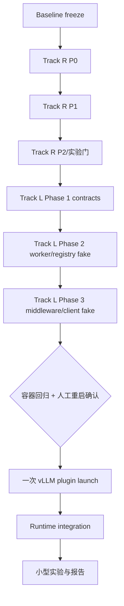

# StateBus v2 既有修复与 Native Latent Handoff 联合执行 Prompt

日期：2026-07-21

状态：可直接交给实现 AI 的执行指令

工作目录：`/home/qcrs/statebus/project`

目标分支基线：当前 `feat/yzm-v2-migration`，执行时必须重新读取实际分支和 HEAD

## 0. 给执行 AI 的直接指令

你是本任务唯一的主实现 Agent。不要只写计划，不要重新做一轮泛化调研；先完整读取两份主合同，再按照本 Prompt 的顺序完成代码、测试、容器验证、一次计划内 vLLM 插件加载、实验和报告。

你必须持续工作到以下任一终止条件出现：

1. 当前阶段全部实现并通过验收；
2. 到达本文明确规定的“vLLM 重启人工确认门”；
3. 遇到无法通过只读检查和局部实现解决、且需要用户新增权限或业务选择的真实 blocker。

除 vLLM 重启人工确认门外，不要把普通实现细节反复抛回给用户。采用仓库既有风格做最小、可验证、可回滚的实现。

## 1. 最高优先级工作纪律

### 1.1 禁止子代理

全程禁止启动、委派或调用任何子代理，包括但不限于：

- `spawn_agent`；
- agent delegation；
- parallel agent；
- background coding agent；
- 让另一个 Agent 代读、代测或代写。

所有源码阅读、设计判断、编辑、测试、错误分析和报告均由当前主 Agent 串行完成。

这条规则不禁止 shell 子进程、pytest worker、vLLM 自身 multiprocessing worker 或 Docker 进程。它禁止的是 AI 子代理。不要把 vLLM 正常的 parent、resource tracker、model worker 误判为多个 AI Agent。

### 1.2 测试期间必须静默等待

任何测试、构建、模型加载、benchmark 或其他长命令启动后，必须立即进入等待状态：

1. 一次只启动一个测试或构建命令；
2. 如果工具返回运行中的 session/cell ID，只能继续等待同一个 ID；
3. 等待期间禁止分析代码；
4. 等待期间禁止读取其他文件；
5. 等待期间禁止修改文件；
6. 等待期间禁止启动第二条测试、第二个 benchmark 或第二个服务；
7. 等待期间禁止因为长时间无 stdout 就判断失败；
8. 只有原命令返回成功、失败、异常或预先设置的超时错误后，才开始分析；
9. 命令失败后先读完整错误，再决定修复，不能边跑边猜；
10. 不得用 `nohup pytest`、后台 `pytest &` 或重复启动来绕过等待。

对工具调用的准确行为要求：

```text
启动一个命令
  -> 返回完成：读取结果并继续
  -> 返回 session/cell ID：只调用 wait/poll 同一 session
  -> 无新增输出：继续等待同一 session
  -> 返回错误/exit code：此时才分析
```

测试期间不发送推测性状态更新。测试前可以简短说明即将运行什么；测试返回后再报告结果。

### 1.3 禁止重复启动 GPU 服务

长时间没有输出不代表 vLLM 没有运行。任何服务启动前必须先检查：

- `53334` 是否已经监听；
- 当前 vLLM parent PID、worker PID、process group 和完整命令；
- GPU 上已有进程属于谁；
- `statebus-dev-qcrs` 是否已经运行；
- 是否已有同名 tmux session；
- 是否已有未结束的测试或 benchmark。

看到两个 Python GPU 进程不等于启动了两个模型。vLLM 通常至少包含 API/engine parent、resource tracker 和 model worker。不得只根据 `nvidia-smi` 行数终止进程，也不得单独 kill model worker。

### 1.4 保留用户工作树

工作树可能是 dirty 的。所有已有修改和未跟踪文件都视为用户所有：

- 不执行 `git reset --hard`；
- 不执行 `git checkout -- <path>`；
- 不删除未知文件；
- 不执行 `git add .` 或 `git add -A`；
- 不覆盖两份冻结主文档；
- 每次只用显式 pathspec 暂存本阶段自己修改的文件；
- 不 push；
- 允许在阶段门通过后创建本地提交，但提交前必须检查 staged diff。

## 2. 两份主合同与读取顺序

### 2.1 必须先完整读取

按以下顺序完整读取，不得只读摘要或标题：

1. [仓库规则](../../../AGENTS.md)
2. [StateBus v2 Review 问题详细修复说明](../26_statebus_v2_review_remediation_20260720/00_detailed_remediation_plan_zh.md)
3. [StateBus vLLM Native Latent Handoff 详细实现与验证文档](../../planning/vllm_native_latent_handoff_implementation_20260720.md)

同时读取仓库规则要求的：

- `README.md`
- `docs/constraints/current_host_and_migration.md`
- `docs/constraints/current_feature_scope.md`
- `docs/planning/implementation_plan.md`
- `docs/reference/题目.md`

### 2.2 两份主合同各自管什么

Review 修复说明是 Track R 的权威来源，负责：

- PlanPolicy allowlist；
- Claim field-level source support；
- Memory 实际消费记账；
- 修复前 claim boundary；
- CapabilityGrant 跨进程认证；
- semantic selector 最小权限；
- semantic state identity/telemetry；
- 参数化 recipe 与真实 LLM skip；
- Hello/capability negotiation；
- worker-owned computation；
- Planner normalization 分类；
- 正式实验与 warning 收口。

Native Latent 冻结稿是 Track L 的权威来源，负责：

- hidden producer；
- aligned latent recurrence；
- engine-local registry；
- `LatentStateRef` 和 `NeuralCompatibilitySignature`；
- middleware 与 worker extension；
- consumer `prompt_embeds` forward proof；
- Planner intent 与 Runtime gate；
- text fallback；
- token、TTL、capacity、one-shot 与鉴权；
- vLLM 0.9.2/V0/Qwen3-32B 支持矩阵；
- C0/T0/A0/L1/N1 实验；
- latent 的防作弊和 claim boundary。

### 2.3 冲突处理顺序

若文档之间出现冲突，按以下优先级处理：

```text
用户最新明确指令
  > AGENTS.md
  > 本联合执行 Prompt 的阶段顺序和操作纪律
  > Native Latent 1663 行冻结稿对 latent 路径的技术定义
  > Review 修复说明对既有代码正确性/安全/指标的定义
  > 当前源码与测试所揭示的事实
  > 旧规划或历史报告
```

[较早的 KV/hidden-state 设计稿](../../planning/kv_hidden_state_transfer_design_20260720.md) 只作背景参考，不能覆盖 1663 行 Native Latent 冻结稿。特别是旧稿中的 HF-first、neural-lab 或 vLLM 0.7.3 假设，不得覆盖当前 vLLM 0.9.2 native experimental path。

### 2.4 论文边界不得改变

LatentMAS 论文包含 layer-wise KV working memory；StateBus 第一版只实现有界的 aligned latent embedding sequence。因此：

- 不是 LatentMAS 复现；
- 不实现 layer-wise KV handoff；
- 不继承论文的 lossless 声明；
- 不继承论文的提速、token 降幅或准确率数字；
- 不复制其 vLLM fork；
- 只参考末层 hidden recurrence、alignment 和 prompt-embedding consumer 思路；
- StateBus 的新增价值是 Ref、权限、生命周期、兼容、审计、validator 和 fallback。

## 3. 最终目标

在不破坏当前 embedding StateRef、结构化协议、Memory、CodeAct 和普通文本路径的前提下，完成两条闭环。

### Track R：既有代码修复

必须把 Review 中 F-01 到 F-12 逐项变为：

```text
问题有失败测试
  -> 实现修复
  -> 定向测试通过
  -> 容器完整回归通过
  -> fresh artifact 证明指标口径正确
```

### Track L：Native Latent Handoff

必须真实证明：

```text
Retriever 真实模型 hidden
  -> 有界 latent recurrence
  -> 对齐到 input embedding space
  -> engine-local tensor commit
  -> opaque LatentStateRef
  -> Runtime grant / signature / anchor gate
  -> Summarizer prompt_embeds forward
  -> worker forward receipt
  -> ClaimSetValidator
  -> release
```

失败或不适用时，确定性回退现有 text lane。不能用随机 embedding、Ref lookup、HTTP 200 或 fallback 最终成功冒充 latent success。

## 4. 为什么 Track R 必须先开始

Track L 会复用 Track R 的四个边界：

| Track R 修复 | Track L 如何复用 |
| --- | --- |
| F-01 output allowlist | Planner 的 `handoff_intent` 不能扩大 task envelope |
| F-02 field support | latent 不能替代最终 Claim 的 source citation |
| F-03 consumption receipt | `LatentStateRef` 只有 worker forward 后才算 consumed |
| F-05 authenticated grant | latent produce/consume/release 必须绑定 task/step/ref |
| F-07 typed telemetry identity | latent PID、role、event 不能再次混合求和 |
| F-11 Planner outcome class | Planner 只提出 intent，Runtime activation 单独统计 |

因此执行顺序固定为：



禁止两个 Track 并行修改相同合同。先把 Track R 的通用合同稳定下来，再在其上添加 latent 类型。

## 5. Phase B0：只读基线冻结

进入仓库：

```bash
cd /home/qcrs/statebus/project
```

记录但不修改：

```bash
git status --short --branch
git rev-parse HEAD
git log -5 --oneline
git diff --stat
git diff --cached --stat
```

记录两份合同 hash：

```bash
sha256sum \
  docs/improvement/26_statebus_v2_review_remediation_20260720/00_detailed_remediation_plan_zh.md \
  docs/planning/vllm_native_latent_handoff_implementation_20260720.md
```

记录运行环境：

```bash
docker ps --format '{{.Names}}\t{{.Image}}\t{{.Status}}'
docker compose -f docker/compose.yaml ps
curl -sS --max-time 3 http://127.0.0.1:53334/health
pgrep -af 'vllm serve|Qwen3-32B'
nvidia-smi --query-gpu=index,uuid,memory.used,memory.total --format=csv,noheader
nvidia-smi --query-compute-apps=pid,gpu_uuid,used_memory --format=csv,noheader
```

把以下内容写入新的执行 artifact，不改写旧 E0-E6：

- Git HEAD 和 dirty paths；
- Docker image ID/digest；
- `statebus-dev-qcrs` 状态；
- vLLM 完整命令、服务端口和模型；
- vLLM parent/worker 关系；
- GPU UUID 映射；
- vLLM/torch/transformers 版本；
- 普通 health、models、structured JSON 和 prompt embeds readiness。

此阶段不得：

- 创建 latent token；
- 停止或重启 vLLM；
- 重新 build Docker image；
- 运行正式 benchmark；
- 修改冻结文档。

退出门：能够准确说明当前服务是谁启动的、在哪个 GPU、使用什么参数，且保留用户 dirty worktree。

## 6. Track R：完成既有代码修复

### 6.1 R-P0A：PlanPolicy allowlist

严格按 F-01 实现：

- descriptor output match 与 task envelope allowlist 独立检查；
- final output contract 同样审计；
- normal、repair、fallback 使用同一 policy；
- 增加四格真值表和 fallback/repair 负例。

首个失败测试必须复现“descriptor 合法但 envelope 排除仍被批准”。修复后该测试返回 `step_output_contract_not_allowed`。

定向测试：

```bash
docker exec statebus-dev-qcrs bash -lc '
  cd /workspace/statebus/project &&
  source docker/activate_statebus_container.sh &&
  python3 -m pytest -q tests/v2/test_adaptive_planner_policy.py
'
```

启动后静默等待该命令完成，不做其他工作。

### 6.2 R-P0B：Claim 字段级 source support

严格按 F-02 实现，并优先采用正式合同而不是 Prompt-only 补丁：

- factual fields；
- field support；
- value hash；
- evidence item 和 locator；
- verified artifact field path；
- source lineage coverage gate；
- 可区分的稳定错误码；
- v1 历史读取与新 strict artifact 的版本策略。

S4 必须成为硬回归：

```text
throughput_units -> Throughput table
shipment_qualifier -> Operating constraint
```

缺任一来源时 fail closed。verified artifact 不能代替缺失的原始 source citation。

定向测试：

```bash
docker exec statebus-dev-qcrs bash -lc '
  cd /workspace/statebus/project &&
  source docker/activate_statebus_container.sh &&
  python3 -m pytest -q \
    tests/v2/test_adaptive_claims.py \
    tests/v2/test_evidence_projection.py \
    tests/v2/test_adaptive_formal_compare.py \
    tests/v2/test_adaptive_mainline_integration.py
'
```

启动后静默等待该命令完成。

### 6.3 R-P0C：Memory actual consumption receipt

严格按 F-03 实现：

- candidate、approved、disclosed、rendered/executed、accepted、replay、skip 分开；
- role factory/runner 返回实际 `consumed_memory_ids`；
- Dispatcher 不能再按 prepared input 列表循环记 consumed；
- Prompt hash 绑定 persisted rendered request；
- recipe hash 绑定实际 execution trace；
- Summarizer 默认不接收 memory；
- 如果未来启用，只接收不含 Python source 的 narrow view；
- 未批准 ID 的 consumption receipt 必须 fail closed；
- 执行失败可记 attempted/failed，不能记 replay/skip。

必须证明：修复后的 equivalent E3 不再产生 15 条 Summarizer 假阳性，多候选负例只记录实际尝试的 recipe ID。

定向测试：

```bash
docker exec statebus-dev-qcrs bash -lc '
  cd /workspace/statebus/project &&
  source docker/activate_statebus_container.sh &&
  python3 -m pytest -q \
    tests/v2/test_adaptive_dispatcher.py \
    tests/v2/test_adaptive_mainline_integration.py \
    tests/v2/test_adaptive_role_prompts.py \
    tests/v2/test_memory_runtime.py \
    tests/v2/test_replay_gate.py \
    tests/v2/test_runtime_session_and_ledger.py
'
```

启动后静默等待该命令完成。

### 6.4 R-P0D：报告口径

更新后续生成器和新报告，不篡改 canonical 原始 artifact：

- `23` 只能称 recorded consumption；
- 8 Executor / 15 Summarizer 是修复前记录拆分；
- 当前可靠证明是 Executor recipe assist/recompute/repair；
- 自然 Q1 到 Q2 的 `skipped_llm_call_count=0`；
- S4 修复前 qualifier citation 不完整。

不要为了让旧报告“看起来正确”而编辑旧 JSON 或删掉失败 run。

### 6.5 R-P1A：跨进程 grant 认证

按 F-05 实现完整 grant payload + HMAC/registry-backed verification、expiry、nonce、single-use、task/step/attempt/ref/output exact binding 和 `SO_PEERCRED`。

要求：

- 随机非空 hash 不再通过；
- secret 不进入命令行、Prompt、artifact 或日志；
- worker 独立验证；
- replay、过期、跨 task、跨 step、ref 扩大均拒绝；
- 当前 semantic selector 正常路径继续通过。

### 6.6 R-P1B：semantic selector 最小权限

按 F-06 优先实现 read-only fd handoff：

- Controller 打开和校验 object；
- worker 不接收可遍历的 state root；
- `pass_fds` 精确列举；
- 显式 env allowlist；
- no-new-privileges、network isolation 和 resource limits；
- worker 不能读取其他 StatePool object 或 task workspace。

不要把逻辑 path containment 冒充 OS 权限隔离。

### 6.7 R-P1C：semantic identity 和 telemetry

按 F-07 分离：

```text
logical_owner_role
logical_step_id
physical_consumer_component
physical_consumer_pid
physical_consumer_uid
downstream_role
```

PID 是 attribute/set，不是可求和 metric。Counter 只从原子事件聚合，并以稳定 event ID 去重。

S4 三个 matrix 的目标事实是三个 publish、三个 consume、三个 release，以及三个 consumer PID 的集合。不得再出现 PID sum。

### 6.8 R-P1D：自然 Memory 效率

按 F-08 实现 parameterized recipe、严格 replay eligibility 和 paired no-memory counterfactual。

修复目标不是强行制造 skip。若 paired experiment 中仍无真实 skip，应保留 assist-style 结论。任何 LLM repair 发生后，该 case 不得计入 validated replay 或 skipped LLM。

### 6.9 R-P2：协议和实验增强

依次完成：

1. F-09 wire-level HELLO/HELLO_ACK 与 capability negotiation；
2. F-10 至少一个普通 worker-owned typed business operation；
3. F-11 Planner 的 raw/normalized/repaired/rejected 四类统计；
4. F-12 lane 顺序、重复、区间和 Protobuf warning 收口。

不要用 P2 的新功能掩盖 P0/P1 未通过。P0/P1 失败时停止进入 Track L。

### 6.10 Track R 集成回归

先运行定向集合：

```bash
docker exec statebus-dev-qcrs bash -lc '
  cd /workspace/statebus/project &&
  source docker/activate_statebus_container.sh &&
  python3 -m pytest -q \
    tests/v2/test_adaptive_planner_policy.py \
    tests/v2/test_adaptive_claims.py \
    tests/v2/test_evidence_projection.py \
    tests/v2/test_adaptive_dispatcher.py \
    tests/v2/test_adaptive_mainline_integration.py \
    tests/v2/test_adaptive_role_prompts.py \
    tests/v2/test_memory_runtime.py \
    tests/v2/test_replay_gate.py \
    tests/v2/test_control_plane.py \
    tests/v2/test_subprocess_executor.py \
    tests/v2/test_metric_aggregation.py \
    tests/v2/test_embedding_state_consumer.py
'
```

静默等待完成后，才运行：

```bash
docker exec statebus-dev-qcrs bash -lc '
  cd /workspace/statebus/project &&
  source docker/activate_statebus_container.sh &&
  python3 -m pytest -q tests/v2
'
```

再次静默等待完成。不得同时运行两组 pytest。

Track R 退出门：F-01 到 F-12 都有代码、负向测试、容器结果和准确的未完成边界。

## 7. Track L Phase 1：合同、SPI 和 fake backend

在 Track R 合同稳定后，按 Native Latent 冻结稿第 6、7、12、14 节实现：

- `RefKind.LATENT_STATE`；
- `StorageKind.ENGINE_LOCAL`；
- `HandoffIntent`；
- `LatentStateRef`；
- `NeuralCompatibilitySignature`；
- lifecycle state machine；
- `RoleModelBackend` SPI；
- `LatentHandoffDecision`；
- Planner proposal field；
- Runtime post-retrieval activation gate；
- 四态开关，默认 `off`；
- fake backend commit/lease/consume/reject/expire；
- telemetry schema；
- deterministic text fallback。

硬约束：

- Planner 只能提出 intent；
- Runtime 根据 task、role edge、evidence、model signature、budget 和 mode 决定；
- 不按 task ID、family 名或 expected answer 开启；
- latent 不进入长期 MemoryIndex；
- `ExecutionArtifactRef`、`StateRef`、`MemoryRef`、`LatentStateRef` 不互相折叠；
- fake handle 永远不能记录为真实 tensor consumption；
- latent 不能绕过 Track R 的 field support 和 ClaimSetValidator。

这一阶段禁止重启 vLLM。

定向测试仅在容器内运行：

```bash
docker exec statebus-dev-qcrs bash -lc '
  cd /workspace/statebus/project &&
  source docker/activate_statebus_container.sh &&
  python3 -m pytest -q tests/v2/neural/test_neural_contracts.py tests/v2/neural/test_latent_gate.py
'
```

启动后静默等待。

## 8. Track L Phase 2：registry 和 worker extension fake tests

实现：

- 有界 engine-local CPU BF16 registry；
- PREPARE/COMMIT/LEASE/CONSUME/RELEASE/EXPIRE；
- TTL、capacity、one-shot 和幂等 release；
- 真实内容 digest，但 API 不返回 tensor；
- fake Qwen/model runner hidden hook；
- active capture 与 request ID 绑定；
- 至少两步 recurrence；
- `soft_token_topk_v1` alignment；
- normal request 无 capture 时完全透传；
- incomplete capture 不 commit；
- tensor 不进入 model dump、JSON、stdout/stderr；
- begin/finish consume 事务预留 worker forward proof。

vLLM import 必须 lazy 或通过 adapter 隔离，使 embed 容器的 fake tests 不要求安装宿主 vLLM 环境。

支持矩阵严格限定：

```text
vLLM 0.9.2
V0 engine
Qwen3ForCausalLM
hidden_size 5120
TP=1
PP=1
max_num_seqs=1
eager
BF16
same model revision
```

任一不满足时返回 not-ready 并走 text fallback，不做兼容猜测。

这一阶段禁止重启 vLLM。

测试：

```bash
docker exec statebus-dev-qcrs bash -lc '
  cd /workspace/statebus/project &&
  source docker/activate_statebus_container.sh &&
  python3 -m pytest -q \
    tests/v2/neural/test_latent_registry.py \
    tests/v2/neural/test_vllm_latent_worker_extension.py
'
```

启动后静默等待。

## 9. Track L Phase 3：middleware、client 和 fallback fake tests

实现 frozen design 中的同端口 API：

- `/statebus/latent/health`；
- `/statebus/latent/produce`；
- `/statebus/latent/complete`；
- `/statebus/latent/release`。

要求：

- 原生 ASGI middleware；
- 从 `scope["app"].state.engine_client` 取已初始化 engine；
- streaming 请求直到最后一个 body 才释放全局锁；
- collective RPC 固定 allowlist；
- request、ref、shape、digest、anchor 和 signature 绑定；
- loopback only；
- bearer token 从文件读取；
- token 不出现在日志、命令行、Prompt 或 artifact；
- body size limit；
- 稳定错误码；
- `GuidedDecodingParams` 保持 ClaimSet JSON；
- completion 成功但无 worker forward proof 时，不能把 ref 标为 consumed；
- consumer 失败时 text fallback，且 latent success counter 不增加。

新增并校验：

- `scripts/check_vllm_latent_readiness.sh`；
- `scripts/smoke_vllm_latent_from_container.sh`；
- 可审计的 plugin launch script 或现有 32B launch script 的默认关闭扩展；
- `bash -n`；
- 不打印 token value。

这一阶段禁止重启 vLLM，也禁止创建真实 token。fake token 只能存在于测试临时目录。

测试：

```bash
docker exec statebus-dev-qcrs bash -lc '
  cd /workspace/statebus/project &&
  source docker/activate_statebus_container.sh &&
  python3 -m pytest -q \
    tests/v2/neural/test_vllm_latent_middleware.py \
    tests/v2/neural/test_vllm_latent_client.py \
    tests/v2/neural/test_vllm_latent_integration.py
'
```

启动后静默等待。

## 10. Docker 与环境命令

### 10.1 宿主编排环境

从宿主执行：

```bash
cd /home/qcrs/statebus/project
source deploy/activate_statebus_host.sh

export STATEBUS_UID="$(id -u)"
export STATEBUS_GID="$(id -g)"
export STATEBUS_DOCKER_TARGET=embed

docker compose -f docker/compose.yaml ps
```

当前目标容器应为：

```text
container: statebus-dev-qcrs
image: statebus-dev-openeuler:24.03-lts-sp3-embed
```

执行时以实际只读检查为准。

### 10.2 什么时候不需要重建容器

仓库通过 bind mount 映射到容器。只修改以下内容通常不需要 rebuild image：

- `v2/*.py`；
- `tests/v2/*.py`；
- `scripts/*.sh`；
- Prompt；
- validator；
- benchmark manifest；
- 文档。

容器未运行时只启动现有 image：

```bash
docker compose -f docker/compose.yaml up -d statebus-dev
```

### 10.3 什么时候需要重建容器

只有以下发生变化才 rebuild：

- `docker/Dockerfile`；
- image 内 Python/system 依赖；
- build target；
- 安装步骤；
- 容器用户或 mount 合同。

命令：

```bash
export STATEBUS_UID="$(id -u)"
export STATEBUS_GID="$(id -g)"
export STATEBUS_DOCKER_TARGET=embed

docker compose -f docker/compose.yaml build statebus-dev
```

启动构建后静默等待完成。构建成功后才执行：

```bash
docker compose -f docker/compose.yaml up -d statebus-dev
docker compose -f docker/compose.yaml ps
```

重启 StateBus 容器不等于重启宿主 vLLM。不要为了普通 Python 改动反复 rebuild/recreate 容器。

### 10.4 容器内环境

所有正式 StateBus pytest 和实验使用：

```bash
docker exec statebus-dev-qcrs bash -lc '
  cd /workspace/statebus/project &&
  source docker/activate_statebus_container.sh &&
  python3 --version &&
  python3 -c "import torch; print(torch.__version__)"
'
```

宿主只负责：

- Git；
- Docker 编排；
- vLLM host process；
- GPU/process/port 检查；
- vLLM host compatibility import；
- 读取 artifact。

宿主 pytest 不能作为正式结果。

## 11. vLLM 重启判断表

| 变更 | 是否需要重启 vLLM |
| --- | --- |
| 首次加载 `--middleware` | 必须 |
| 首次加载 `--worker-extension-cls` | 必须 |
| 修改已被当前 vLLM import 的 plugin Python | 必须 |
| 修改 registry 的宿主启动配置 | 必须 |
| 修改 StateBus Runtime gate/client | 不需要 |
| 修改 Planner/Summarizer Prompt | 不需要 |
| 修改 ClaimSetValidator | 不需要 |
| 修改 container tests | 不需要 |
| 修改 benchmark manifest | 不需要 |
| 修改 `STATEBUS_LATENT_HANDOFF_MODE` 的 StateBus 进程配置 | 只重启相应 StateBus 进程，不重启 vLLM |

必须先完成 Track R 和 Track L Phase 1-3 的容器测试，再进入一次计划内重启。不要每改一个 plugin 文件就重启 32B 服务。

## 12. 重启前统一回归门

按顺序运行，每次只运行一条并静默等待结果。

第一条：

```bash
docker exec statebus-dev-qcrs bash -lc '
  cd /workspace/statebus/project &&
  source docker/activate_statebus_container.sh &&
  python3 -m pytest -q tests/v2/neural
'
```

第二条：

```bash
docker exec statebus-dev-qcrs bash -lc '
  cd /workspace/statebus/project &&
  source docker/activate_statebus_container.sh &&
  python3 -m pytest -q \
    tests/v2/test_adaptive_contracts.py \
    tests/v2/test_adaptive_dispatcher.py \
    tests/v2/test_adaptive_planner_policy.py \
    tests/v2/test_adaptive_role_prompts.py \
    tests/v2/test_local_vllm_wrappers.py \
    tests/v2/test_kv_prefix_control_plane.py
'
```

第三条：

```bash
docker exec statebus-dev-qcrs bash -lc '
  cd /workspace/statebus/project &&
  source docker/activate_statebus_container.sh &&
  STATEBUS_LATENT_HANDOFF_MODE=off python3 -m pytest -q tests/v2
'
```

三条全部通过后，做宿主 compatibility preflight：

```bash
source /home/qcrs/statebus/conda-envs/vllm-qwen-cu121/bin/activate
export PYTHONPATH=/home/qcrs/statebus/project

python - <<'PY'
from v2.integrations.vllm_latent.middleware import LatentHandoffMiddleware
from v2.integrations.vllm_latent.worker_extension import LatentWorkerExtension

print(LatentHandoffMiddleware.__module__)
print(LatentWorkerExtension.__module__)
PY

vllm serve --help | rg -n \
  'enable-prompt-embeds|enable-prefix-caching|worker-extension-cls|middleware'
```

这是宿主启动兼容预检，不是 StateBus 正式测试证据。

退出门：所有 fake/contract/fallback tests 通过，ordinary path 在 mode off 下通过，plugin import 和 vLLM flags 存在。

## 13. vLLM 重启人工确认门

到达这里必须暂停并向用户报告，不得自行停止服务。报告必须包含：

- Track R 完成项和测试结果；
- Track L Phase 1-3 完成项和测试结果；
- 当前 Git HEAD 和 dirty paths；
- 当前 `53334` health；
- 当前 vLLM 完整命令；
- 解析出的 parent PID、worker PID、process group；
- 当前 GPU UUID/index 和占用；
- 即将使用的完整新启动命令；
- 回滚命令；
- 预计模型加载时间；
- 为什么此时确实需要重启。

只有用户明确批准后，才允许：

- 创建 `/home/qcrs/statebus/work/latent_api.token`；
- 给当前 vLLM parent 发送 SIGINT；
- 释放 `53334`；
- 带两个 plugin 参数重新启动。

不得把“用户之前说可能要重启”解释为对具体 PID 的永久 kill 授权。

## 14. 批准后的安全停止流程

先重新解析，而不是使用旧 PID：

```bash
pgrep -af 'vllm serve|Qwen3-32B'
nvidia-smi --query-compute-apps=pid,gpu_uuid,used_memory --format=csv,noheader
curl -sS --max-time 3 http://127.0.0.1:53334/health
```

确认以下内容完全一致：

- owner 是当前用户；
- command 是 `/data/models/Qwen3-32B`；
- port 是 `53334`；
- served model 是 `qwen3-32b`；
- 目标是 parent，不是 multiprocessing worker；
- process group 中没有其他无关任务。

优先在原拥有终端发送 `Ctrl-C`。若必须从另一个 shell 停止，只对确认后的 parent 使用：

```bash
kill -INT "${CONFIRMED_VLLM_PARENT_PID}"
```

不要单独 kill worker，不要直接 `kill -9`。等待原进程退出并确认：

```bash
curl -sS --max-time 2 http://127.0.0.1:53334/health
nvidia-smi --query-compute-apps=pid,gpu_uuid,used_memory --format=csv,noheader
```

如果 SIGINT 后未正常退出，停止操作并报告实际状态；不要自行升级到 SIGKILL。

## 15. Token 创建

只有重启已获批准后执行：

```bash
umask 077
STATEBUS_LATENT_TOKEN_FILE=/home/qcrs/statebus/work/latent_api.token
if [ ! -s "$STATEBUS_LATENT_TOKEN_FILE" ]; then
  openssl rand -hex 32 > "$STATEBUS_LATENT_TOKEN_FILE"
fi
chmod 600 "$STATEBUS_LATENT_TOKEN_FILE"
test -s "$STATEBUS_LATENT_TOKEN_FILE"
docker exec statebus-dev-qcrs test -s /statebus/work/latent_api.token
```

绝对禁止：

- `cat` token；
- 把 token 作为 CLI 参数；
- 把 token 放进 repo；
- 把 bearer value 打进日志；
- 把 token 放进 Prompt 或 artifact。

## 16. 首次插件启动：tmux 优先，不用 nohup

### 16.1 结论

第一次插件加载不建议直接用 `nohup`。推荐用 `tmux`：

- vLLM 在 tmux 内以前台方式运行；
- 可以观察完整 import、worker injection、ASGI startup 日志；
- 终端断开后服务仍持续；
- 可以随时 attach；
- 首次成功后不需要为了改成后台服务再重启一次。

当前主机已提供 `/usr/bin/tmux`。因此第一次计划内重启优先使用名为 `statebus-vllm-latent` 的 tmux session。

`nohup` 只适合插件已经通过至少一次真实启动验证后的后续长期启动。它不是进程监督器，PID file 可能陈旧，首次 import 失败也不如 tmux 直观。不要用 nohup 运行 pytest。

### 16.2 启动脚本要求

在 Phase 3 完成一个经过 `bash -n` 和 review 的启动入口。可以新增 latent 专用脚本，或为现有 32B 脚本增加默认关闭的 plugin flag，但必须满足：

- 默认普通启动行为不变；
- 使用当前记录的 GPU，不硬编码猜测；
- 原有 model、port、dtype、TP、context、GPU utilization、prefix cache、prompt embeds 和 eager 参数不变；
- plugin 模式只增加 middleware、worker extension 和 registry 环境；
- token 只传文件路径；
- script 使用 `exec`；
- 不输出 token；
- 支持在启动前打印非敏感 resolved config；
- shell syntax test 通过。

第一次只允许相对旧命令增加：

```text
--worker-extension-cls v2.integrations.vllm_latent.worker_extension.LatentWorkerExtension
--middleware v2.integrations.vllm_latent.middleware.LatentHandoffMiddleware
STATEBUS_LATENT_* registry/token-file environment
```

不同时改变模型、端口、context、GPU utilization、TP、sampling default 或 prefix 策略。

启动脚本最终必须等价于以下命令。`STATEBUS_VLLM_CUDA_VISIBLE_DEVICES` 不设默认值，必须来自重启前冻结的现有服务/GPU 映射；2026-07-21 的一次只读观察不能替代执行时重新确认。

```bash
source /home/qcrs/statebus/conda-envs/vllm-qwen-cu121/bin/activate

: "${STATEBUS_VLLM_CUDA_VISIBLE_DEVICES:?must match the recorded service GPU}"

export PYTHONPATH=/home/qcrs/statebus/project
export STATEBUS_LATENT_API_TOKEN_FILE=/home/qcrs/statebus/work/latent_api.token
export STATEBUS_LATENT_REGISTRY_MAX_BYTES=67108864
export STATEBUS_LATENT_REGISTRY_MAX_ENTRIES=64
export STATEBUS_LATENT_TTL_S=60
export STATEBUS_LATENT_MAX_STEPS=32
export STATEBUS_LATENT_ONE_SHOT=true
export STATEBUS_LATENT_ALIGNMENT=soft_token_topk_v1
export STATEBUS_LATENT_ALIGNMENT_TOP_K=32
export STATEBUS_LATENT_ALIGNMENT_TEMPERATURE=1.0

export CUDA_VISIBLE_DEVICES="$STATEBUS_VLLM_CUDA_VISIBLE_DEVICES"
export VLLM_USE_V1=0

exec vllm serve /data/models/Qwen3-32B \
  --host 127.0.0.1 \
  --port 53334 \
  --served-model-name qwen3-32b \
  --dtype bfloat16 \
  --tensor-parallel-size 1 \
  --max-model-len 8192 \
  --max-num-seqs 1 \
  --max-num-batched-tokens 8192 \
  --gpu-memory-utilization 0.82 \
  --enable-prefix-caching \
  --enable-prompt-embeds \
  --enforce-eager \
  --worker-extension-cls v2.integrations.vllm_latent.worker_extension.LatentWorkerExtension \
  --middleware v2.integrations.vllm_latent.middleware.LatentHandoffMiddleware
```

若重启前冻结的原服务参数与上面任一非 plugin 参数不同，以冻结的原参数为准，并在人工确认报告中列出差异。禁止无说明地采用仓库启动脚本的旧默认值。

### 16.3 tmux 启动模板

先准备日志路径和确认不存在旧 session：

```bash
STATEBUS_VLLM_START_TS="$(date +%Y%m%d_%H%M%S)"
STATEBUS_VLLM_LOG="/home/qcrs/statebus/logs/vllm_latent_${STATEBUS_VLLM_START_TS}.log"

test ! -e "$STATEBUS_VLLM_LOG"
tmux has-session -t statebus-vllm-latent 2>/dev/null && {
  echo '停止：statebus-vllm-latent session 已存在'
  exit 1
}
```

使用实现阶段已经验证的启动脚本。以下名称是推荐值，若实现选择扩展现有脚本，替换为实际路径并在人工确认报告中给出：

```bash
tmux new-session -d -s statebus-vllm-latent \
  "bash -lc 'cd /home/qcrs/statebus/project && exec bash scripts/start_vllm_qwen3_32b_latent.sh 2>&1 | tee -a ${STATEBUS_VLLM_LOG}'"
```

随后运行一个单独的 readiness 等待命令，并在该命令执行期间静默等待，不做其他操作：

```bash
STATEBUS_VLLM_LOG="${STATEBUS_VLLM_LOG}" bash -lc '
  deadline=$((SECONDS + 900))
  while (( SECONDS < deadline )); do
    if curl -fsS --max-time 2 http://127.0.0.1:53334/health >/dev/null; then
      echo READY
      exit 0
    fi
    if ! tmux has-session -t statebus-vllm-latent 2>/dev/null; then
      echo "ERROR: tmux session exited before readiness"
      tail -n 120 "$STATEBUS_VLLM_LOG"
      exit 1
    fi
    sleep 10
  done
  echo "ERROR: readiness timeout"
  tail -n 120 "$STATEBUS_VLLM_LOG"
  exit 1
'
```

该命令返回后才分析日志。成功时检查：

```bash
tmux capture-pane -pt statebus-vllm-latent -S -200
rg -n \
  'LatentWorkerExtension|latent middleware initialized|latent worker extension ready|Application startup complete' \
  "$STATEBUS_VLLM_LOG"
```

缺少 worker injection 证据时，即使 health 是 200，也不能进入 latent probe。

### 16.4 nohup 备选模板

只有满足以下全部条件才考虑 nohup：

- tmux 不可用，或用户明确要求 nohup；
- plugin 已经完成一次真实启动验证；
- 启动脚本使用 `exec`；
- 独立日志和 PID file 已确定；
- `53334` 已确认空闲；
- 不会因此额外制造一次无意义重启。

模板：

```bash
STATEBUS_VLLM_START_TS="$(date +%Y%m%d_%H%M%S)"
STATEBUS_VLLM_LOG="/home/qcrs/statebus/logs/vllm_latent_${STATEBUS_VLLM_START_TS}.log"
STATEBUS_VLLM_PID_FILE="/home/qcrs/statebus/work/vllm_latent.pid"

nohup bash -lc '
  cd /home/qcrs/statebus/project
  exec bash scripts/start_vllm_qwen3_32b_latent.sh
' </dev/null >>"$STATEBUS_VLLM_LOG" 2>&1 &

STATEBUS_VLLM_PID=$!
printf '%s\n' "$STATEBUS_VLLM_PID" > "$STATEBUS_VLLM_PID_FILE"
```

随后仍必须用同一个 readiness 等待逻辑验证，并确认 PID file 对应的命令。不得只因为 shell 返回 0 就认为模型服务已启动。

## 17. 启动失败与回滚

如果 plugin import、worker injection、模型加载或 middleware 初始化失败：

1. 保存完整日志；
2. 不连续猜参数并多次重启；
3. 不升级/降级 vLLM、Torch 或 Transformers；
4. 不卸载现有环境；
5. 不修改模型或 GPU utilization 来掩盖插件错误；
6. 按冻结稿删除两个 plugin 参数，使用原完整命令恢复普通服务；
7. ordinary health 和 text path 恢复后，记录 blocker；
8. latent 保持 planned/experimental failed，不伪造成功。

回滚保留：

```text
VLLM_USE_V1=0
--enable-prefix-caching
--enable-prompt-embeds
--enforce-eager
原 model/port/TP/context/GPU 参数
```

回滚只删除：

```text
--worker-extension-cls ...LatentWorkerExtension
--middleware ...LatentHandoffMiddleware
```

## 18. Track L Phase 4：真实 vLLM mechanism probe

服务带 plugin 成功启动后，严格按顺序运行，每条命令完成后再运行下一条。

### 18.1 Ordinary path

```bash
docker exec statebus-dev-qcrs curl -fsS \
  http://127.0.0.1:53334/health
```

```bash
docker exec statebus-dev-qcrs curl -fsS \
  http://127.0.0.1:53334/v1/models
```

再运行现有 structured JSON client smoke。ordinary text 不通过时，不进入 latent endpoint。

### 18.2 Plugin readiness

```bash
docker exec \
  -e STATEBUS_LATENT_API_TOKEN_FILE=/statebus/work/latent_api.token \
  statebus-dev-qcrs \
  bash scripts/check_vllm_latent_readiness.sh
```

必须解析 JSON 字段，不只看 HTTP 200。

### 18.3 Producer

真实 producer 必须证明：

- hidden 来自真实 Qwen3 worker；
- shape `[latent_steps, 5120]`；
- dtype BF16；
- captured steps 等于 requested steps；
- recurrence injection 等于 steps - 1；
- tensor bytes 等于 `steps * 5120 * 2`；
- digest 非空；
- API 不返回 tensor/base64/internal text。

依次跑 2、4、8 steps，不并行。

### 18.4 Consumer

真实 consumer 必须证明：

- consumed ref ID 与 produced ref ID 相同；
- `consumer_forward_observed=true`；
- request ID、shape 和 digest 与 begin consume 一致；
- prompt embed last dimension 为 5120；
- ClaimSet JSON 可解析；
- one-shot 二次消费返回稳定拒绝；
- finish consume 后状态才是 consumed。

### 18.5 Negative tests

按冻结稿覆盖 model、alignment、position、anchor、TTL、unknown ref、duplicate marker、incomplete capture、capacity、concurrent capture、loopback、token、forward proof 和 mode off。

所有不兼容都必须在 materialize/forward 前拒绝。

## 19. Track L Phase 5：Adaptive Runtime 集成

真实 probe 通过后再接主 Runtime：

1. Planner 输出 `handoff_intent`；
2. PlanPolicy 使用 Track R 修复后的 envelope 规则；
3. Runtime post-retrieval gate 独立批准或拒绝；
4. Retriever 只在长叙事且 evidence coverage 完整时作为 producer；
5. Summarizer 只持有 opaque ref、anchors、verified artifact 和必要合同；
6. tensor 不进入 Protobuf、Prompt、HTTP body、MemoryIndex 或 artifact；
7. worker forward receipt 才产生 actual consumed event；
8. final ClaimSet 继续走 Track R field-support validator；
9. 任一 latent failure 走确定性 C0/text fallback；
10. fallback 通过不计 latent success；
11. mode 默认 `off`；
12. 只在独立实验进程使用 `planner_assist`。

开关示例必须在容器进程中设置，而不是只在宿主 export：

```bash
docker exec \
  -e STATEBUS_LATENT_HANDOFF_MODE=off \
  -e STATEBUS_LATENT_API_TOKEN_FILE=/statebus/work/latent_api.token \
  statebus-dev-qcrs \
  bash -lc '
    cd /workspace/statebus/project &&
    source docker/activate_statebus_container.sh &&
    python3 -m pytest -q tests/v2/neural
  '
```

启动后静默等待。

## 20. Track L Phase 6：最小实验

只使用冻结稿预注册的 6 个离线长叙事 case 和五条 lane：

| Lane | 目的 |
| --- | --- |
| C0 | full selected evidence 上限 |
| T0 | 128-token Retriever 文本 handoff |
| A0 | anchors + artifact，无 analysis/latent |
| L1 | anchors + artifact + engine-local latent |
| N1 | signature 破坏，forward 前拒绝并 C0 fallback |

固定：

- 同一 Qwen3-32B；
- 同一 vLLM 0.9.2/V0；
- 同一 role topology；
- temperature 0；
- 相同 seed/max tokens；
- 串行请求；
- memory 关闭；
- CodeAct 不参与；
- expected facts 只在生成后评分；
- lane 顺序使用预注册 ABBA/随机化方案；
- 原始样本全部保留。

必须分别报告：

- readiness；
- mechanism；
- quality；
- performance。

判定规则：

- C0 不可解时，任务设计失败，不能评价 latent；
- L1 与 A0 无差异时，当前 workload 没有 latent 需求，停止扩展；
- L1 低于 T0/C0 时，如实报告质量回退；
- mechanism 成立但 latency 更差时，只声明机制成立；
- 只有串行正式重复显示正收益后，才讨论时延；
- N1 fallback 最终正确不能计为 latent success；
- tensor bytes、producer compute、D2H/H2D 不得隐藏。

## 21. 最终完整回归

先运行 latent 定向回归并静默等待：

```bash
docker exec statebus-dev-qcrs bash -lc '
  cd /workspace/statebus/project &&
  source docker/activate_statebus_container.sh &&
  python3 -m pytest -q \
    tests/v2/neural \
    tests/v2/test_adaptive_contracts.py \
    tests/v2/test_adaptive_dispatcher.py \
    tests/v2/test_adaptive_planner_policy.py \
    tests/v2/test_adaptive_role_prompts.py \
    tests/v2/test_local_vllm_wrappers.py \
    tests/v2/test_kv_prefix_control_plane.py
'
```

返回后再运行完整 v2 回归并静默等待：

```bash
docker exec statebus-dev-qcrs bash -lc '
  cd /workspace/statebus/project &&
  source docker/activate_statebus_container.sh &&
  STATEBUS_LATENT_HANDOFF_MODE=off python3 -m pytest -q tests/v2
'
```

返回后再运行仓库完整回归并静默等待：

```bash
docker exec statebus-dev-qcrs bash -lc '
  cd /workspace/statebus/project &&
  source docker/activate_statebus_container.sh &&
  STATEBUS_LATENT_HANDOFF_MODE=off python3 -m pytest -q
'
```

不要并行运行三条命令。不要在测试静默期间做报告或代码分析。

## 22. Fresh artifact 和报告

不得覆盖：

```text
/home/qcrs/statebus/runs/contest_evidence_closure_20260720
```

新 run root 使用：

```text
/home/qcrs/statebus/runs/statebus_v2_remediation_latent_20260721_<timestamp>/
```

至少包含：

- Git HEAD、dirty status 和 runtime freeze；
- 两份主合同 SHA256；
- Docker image ID；
- vLLM/torch/transformers/model revision；
- 完整非敏感启动参数；
- plugin compatibility snapshot；
- ordinary path regression；
- grant、peer credential 和 lifecycle events；
- field support lineage；
- Memory actual consumption receipts；
- latent capture/recurrence/commit/consume/release events；
- consumer forward proof；
- fallback reason；
- C0/T0/A0/L1/N1 原始结果；
- tensor bytes 和 latency decomposition；
- test stdout/stderr/exit codes；
- checksums 和 machine-readable manifest。

新增正式报告建议路径：

```text
docs/reports/statebus_v2_remediation_and_native_latent_validation_20260721.md
```

报告必须明确：

- 哪些是既有修复；
- 哪些是 fake/contract proof；
- 哪些是真实 vLLM mechanism proof；
- 哪些是 quality result；
- 哪些是 performance result；
- 哪些仍是 negative/Future Work；
- StateBus aligned latent 与 LatentMAS layer-wise KV working memory 的差异。

## 23. 本地提交规则

阶段门通过后可以创建本地提交，不 push。推荐拆分：

```text
fix: enforce plan and claim truth boundaries
fix: make memory consumption receipt based
security: authenticate grants and isolate state consumers
telemetry: type semantic ownership and event aggregation
protocol: negotiate worker capabilities and execute owned operations
feat: add latent handoff contracts and runtime gate
feat: add bounded vllm latent registry and worker extension
feat: add authenticated latent middleware and client
test: validate native latent producer consumer and fallback
docs: report remediation and native latent evidence
```

每次提交前：

```bash
git status --short
git diff -- <本阶段路径>
git add -- <逐个列出的本阶段路径>
git diff --cached --check
git diff --cached --stat
git diff --cached
git commit -m '<对应消息>'
```

不得把执行前已经存在的用户文件顺手加入提交。若必须修改一个已经 dirty 的同名文件，先区分用户改动和本阶段改动，保留全部用户内容，并在报告中说明。

## 24. 错误处理

### 24.1 测试失败

测试返回失败后才开始：

1. 读取完整 traceback；
2. 确认失败是新回归、旧基线还是环境问题；
3. 写最小复现；
4. 修改最小所有权范围；
5. 先重跑失败测试；
6. 通过后重跑所属定向集合；
7. 最后重跑完整集合。

不得在失败测试仍运行时修改代码，也不得启动第二个 pytest 猜测结果。

### 24.2 vLLM 启动失败

只分析第一次完整日志。先恢复 ordinary service，再决定是否继续。不要通过连续重启试错。

### 24.3 GPU OOM

先保存参数和日志，确认是 registry、temporary hidden、KV 还是其他进程造成。不得杀死其他用户进程，也不得随意改变 GPU。按冻结稿停止条件处理，不通过降低真实性标准绕过。

### 24.4 文档与代码冲突

若冻结稿要求的 vLLM 0.9.2 方法签名与实际 site-packages 不一致：

- 保存只读源码证据；
- plugin health 返回 not-ready；
- ordinary path 保持可用；
- 在执行报告记录偏差；
- 核心 architecture 需要变化时暂停请求用户确认；
- 不静默改写冻结稿来掩盖冲突。

## 25. 完成定义

只有以下全部满足，任务才算完成。

### Track R

- [ ] F-01 到 F-12 均有实现状态；
- [ ] Plan allowlist 漏洞有负向回归；
- [ ] S4 双来源 field support 闭合；
- [ ] Summarizer 假 consumption 清零；
- [ ] Executor 只记录实际 recipe；
- [ ] grant 可认证、过期、单次、exact-bound；
- [ ] semantic selector 最小只读权限；
- [ ] PID/role/counter 正确聚合；
- [ ] natural memory 不夸大 skip；
- [ ] Planner normalization 透明；
- [ ] 容器完整回归通过。

### Track L mechanism

- [ ] contracts/canonical hash；
- [ ] lifecycle/TTL/capacity/one-shot；
- [ ] worker fake；
- [ ] middleware fake；
- [ ] Runtime gate/fallback；
- [ ] ordinary OpenAI path 无回归；
- [ ] 真实 Qwen3 hidden capture；
- [ ] 真实 recurrence injection；
- [ ] engine-local tensor commit；
- [ ] opaque ref；
- [ ] consumer prompt embeds forward proof；
- [ ] ClaimSetValidator；
- [ ] incompatible signature forward 前拒绝；
- [ ] release/expire；
- [ ] embed 容器定向和完整测试通过。

### Track L claim

- [ ] 没有声称 LatentMAS 复现；
- [ ] 没有声称 layer-wise KV handoff；
- [ ] 没有继承论文 lossless/速度/准确率；
- [ ] readiness、mechanism、quality、performance 分开；
- [ ] 没有把 fallback success 算 latent success；
- [ ] 没有把 random prompt embeds 算 hidden handoff；
- [ ] 没有把 Ref lookup 算 forward consumption；
- [ ] 没有隐藏 tensor bytes 和 producer compute；
- [ ] 不满足收益门时如实记录负结果。

### 运维和证据

- [ ] 全程未启动 AI 子代理；
- [ ] 测试期间只等待同一命令；
- [ ] 未重复启动 vLLM；
- [ ] vLLM 重启获得具体人工批准；
- [ ] token 未泄露；
- [ ] 使用 tmux 保留首次启动可观察性；
- [ ] 未终止其他用户进程；
- [ ] 旧 E0-E6 未覆盖；
- [ ] fresh run、自足 manifest、checksum 和报告完整；
- [ ] 只创建本地提交，未 push。

## 26. 最终向用户汇报格式

最终响应必须先给结论，再给证据。至少包括：

1. 实际完成哪些 F-01 到 F-12；
2. latent 当前是 planned、fake-complete、mechanism-complete 还是 experiment-complete；
3. 测试命令、通过数、warning 和失败；
4. 是否以及何时重启 vLLM；
5. 当前服务如何运行，tmux session、日志和 health；
6. fresh run root 和报告路径；
7. 本地 commits；
8. 可声明与不可声明边界；
9. 未完成项和真实 blocker。

不要只说“已完成”或“测试通过”。每个核心结论必须能指向源码、测试或 artifact。

## 27. 从这里开始执行

现在按以下动作开始：

1. 确认没有启动任何子代理；
2. 完整读取两份主合同和仓库规则；
3. 执行 Phase B0 只读冻结；
4. 从 Track R F-01 的失败回归开始；
5. 串行完成 Track R；
6. 再完成 Track L Phase 1-3；
7. 完成容器统一回归；
8. 到 vLLM 重启人工确认门时暂停并提交具体 PID/命令/回滚方案；
9. 获批后使用 tmux 做首次插件启动并静默等待 readiness；
10. 完成真实 mechanism probe、Runtime 集成、小型实验和报告；
11. 不推送远端。

除人工重启确认门和真实 blocker 外，不停在方案描述阶段，直接实施、验证并收口。
