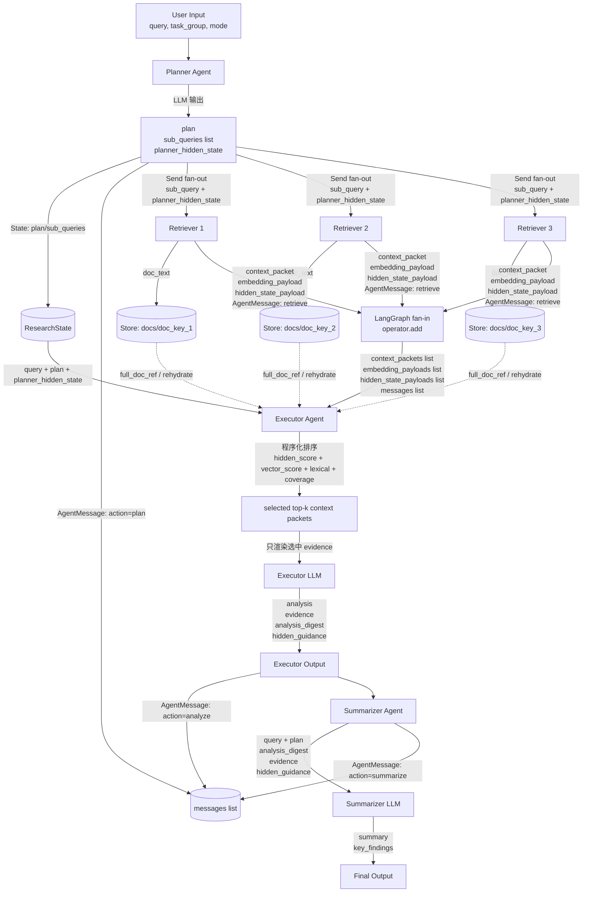

# 多智能体研究系统 Demo 测试报告

> 测试环境：openEuler 24.03-LTS-SP3 (Docker)
> 测试框架：LangGraph + Qwen3-8B 本地 Transformers 后端
> 测试日期：2026-06-16

---

## 一、系统架构

### 1.1 Agent 角色分工

```
┌─────────────────────────────────────────────────────────────────┐
│                    Multi-Agent Research System                   │
├─────────────┬─────────────┬─────────────┬───────────────────────┤
│   Planner   │  Retriever  │  Executor   │     Summarizer        │
│   (规划)     │   (检索)     │   (执行)     │      (总结)           │
├─────────────┼─────────────┼─────────────┼───────────────────────┤
│ 拆解查询为   │ 并行检索子   │ 分析检索结果  │ 汇总分析，输出        │
│ 结构化子任务  │ 查询，获取   │ 提取关键证据  │ 最终报告和发现        │
│              │ 文档资料     │              │                       │
├─────────────┼─────────────┼─────────────┼───────────────────────┤
│ 调用: 2次    │ 调用: 6次    │ 调用: 2次    │ 调用: 2次             │
│ 平均: 2.44s  │ 平均: 7.77s  │ 平均: 7.66s  │ 平均: 4.30s           │
└─────────────┴─────────────┴─────────────┴───────────────────────┘
```

### 1.2 当前本地模型数据流图

当前实现切换为本地 Transformers 后端：四个 Agent 都通过同一个本地 Qwen3-8B 模型实例完成文本生成；Planner 额外捕获最后一层 hidden state，作为非文本中间表示在 Agent 间显式传递。

**运行配置**：

```bash
CHAT_BACKEND=transformers
CHAT_MODEL=qwen3-8b
LOCAL_MODEL_PATH=/data/models/Qwen3-8B
LOCAL_MODEL_DEVICE=cuda:0
LOCAL_MODEL_DTYPE=bfloat16
ENABLE_HIDDEN_STATE_TRANSFER=1
```

#### 1.2.1 总体 Agent 数据流

```text
用户查询
   │
   ▼
┌────────────────────────────────────────────────────────────────────┐
│ Planner                                                            │
│ - 调用本地 Qwen3-8B 生成 plan/sub_queries                         │
│ - 捕获 planner_hidden_state: last-layer pooled hidden vector       │
└───────────────┬───────────────────────────────────────┬────────────┘
                │                                       │
                │ 文本/结构化控制流                     │ 非文本隐藏状态流
                │ plan, sub_queries                     │ planner_hidden_state
                │                                       │ dims=4096, layer=-1
                ▼                                       ▼
      Send({sub_query:q1, planner_hidden_state})   ┌──────────────┐
      Send({sub_query:q2, planner_hidden_state})──▶│ ResearchState │
      Send({sub_query:q3, planner_hidden_state})   └──────────────┘
                │
                ▼
┌────────────────────────────────────────────────────────────────────┐
│ Retriever_1 ∥ Retriever_2 ∥ Retriever_3                            │
│ - 每个 Retriever 接收自己的 sub_query                              │
│ - 每个 Retriever 接收 planner_hidden_state                         │
│ - 生成 retriever_intent_hidden_state 并计算 intent alignment         │
│ - 输出 documents/context_packets/embedding_payloads/messages       │
└───────────────────────────────┬────────────────────────────────────┘
                                │ operator.add 聚合
                                ▼
┌────────────────────────────────────────────────────────────────────┐
│ Executor                                                           │
│ - 接收 plan/documents/context_packets/evidence                     │
│ - 使用 planner_hidden_state 对 context_packets 重排并裁剪 top_k    │
│ - 输出 analysis/evidence/messages/hidden_guidance                  │
└───────────────────────────────┬────────────────────────────────────┘
                                ▼
┌────────────────────────────────────────────────────────────────────┐
│ Summarizer                                                         │
│ - 接收 plan/analysis/evidence                                      │
│ - 使用 hidden_guidance 控制摘要重点和引用来源                     │
│ - 输出 summary/key_findings/messages                               │
└───────────────────────────────┬────────────────────────────────────┘
                                ▼
                             最终结果
```

#### 1.2.2 本地 Qwen3-8B 推理与隐藏状态生成

```text
LangChain messages
   │
   ▼
tokenizer.apply_chat_template(...)
   │
   ▼
prompt tokens
   │
   ▼
model(..., output_hidden_states=True, use_cache=False)
   │
   ├── outputs.hidden_states[-1][-1]
   │     └── 捕获用于预测第一个输出 token 的 pre-generation hidden state
   │
   ▼
AutoModelForCausalLM.generate()
   │
   └── generated text
         └── Planner 解析为 plan/sub_queries
```

隐藏状态 payload 当前结构如下：

```json
{
  "kind": "transformer_hidden_state",
  "capture_stage": "pre_generation",
  "source": "prompt",
  "prediction_target": "next_token",
  "model": "qwen3-8b",
  "model_path": "/data/models/Qwen3-8B",
  "layer": -1,
  "pooling": "last_token",
  "pooled_token_span": "prompt_last_token",
  "dims": 4096,
  "norm": 12.345678,
  "dtype": "float32_serialized",
  "vector": [0.012345, -0.06789, "..."],
  "source_token_hash": "...",
  "input_tokens": 512,
  "output_tokens": 0,
  "next_token_index": 512
}
```

#### 1.2.3 结构化通信中的传递位置

```text
Planner
  └─ result["planner_hidden_state"]
       │
       ├─ ResearchState.planner_hidden_state
       │
       ├─ Send("retriever", {"planner_hidden_state": ...})
       │
       ├─ AgentMessage.hidden_state
       │
       └─ metrics.hidden_state_transfers

Retriever / Executor / Summarizer
  └─ state.get("planner_hidden_state")
       │
       ├─ _record_hidden_state_received(agent, payload)
       ├─ 写入结构化 message.hidden_state
       └─ 继续传递给后续节点或最终指标
```

#### 1.2.4 下游 Agent 使用 hidden state 的方式

```text
Retriever:
  planner_hidden_state + retriever_intent_hidden_state
       │
       └─ cosine_similarity → intent_alignment
              │
              └─ 写入 context_packet.retrieval_diagnostics.intent_alignment

Executor:
  select_context_packets(..., planner_hidden_state=planner_hidden_state)
       │
       ├─ score = hidden_score / embedding_score / lexical_score / coverage 加权
       ├─ top_k = HIDDEN_STATE_CONTEXT_TOP_K，默认 2
       └─ 只把排序后的 compact evidence 放入 Executor prompt

Summarizer:
  hidden_guidance
       │
       ├─ selected_doc_keys
       ├─ avg_hidden_score / top_hidden_score
       └─ 作为摘要重点控制信号进入 Summarizer prompt
```

这个版本带来的直接收益是可量化的：`hidden_state_context_packets_skipped` 表示被 hidden-state routing 裁掉的上下文包数量，`hidden_state_context_chars_skipped` 表示未进入 Executor prompt 的原始上下文字符数，`executor_prompt` 的压缩记录表示最终进入 Executor prompt 的字符数；质量收益需要继续通过同一任务集的对照实验统计。

轻量协议层对照验证中，同一批 3 个 context packet 在不用 hidden routing 时全部进入 prompt；启用 hidden routing 后选择 top-2，并将每个文档的 evidence 控制为 1 条、120 字符，示例结果为 `all_context_chars=266`、`hidden_context_chars=181`、`saved_chars=85`、`saved_pct=32.0%`。真实模型 smoke test 中，Qwen3-8B 产生 3 个子查询、3 个 retriever pre-generation hidden state，Executor 选中 2 个 context packet，`hidden_state_context_packets_skipped=1`、`hidden_state_context_chars_skipped=159`。

#### 1.2.5 当前实现边界

```text
已经实现：
  本地模型生成 hidden state
  planner → retriever/executor/summarizer 显式传递 hidden state
  retriever 生成 pre-generation intent hidden state 并计算 planner/retriever intent 相似度
  executor 使用 hidden 相似度参与 context packet 重排，并用 top_k 裁剪提示词上下文
  summarizer 接收 hidden_guidance，用于控制摘要重点和引用来源
  metrics 统计 hidden-state transfer、生产、使用、裁剪包数量和裁剪字符数

尚未实现：
  下游 Agent 将 hidden state 注入模型内部
  KV cache / prefix state / cross-attention 级别的状态续算
  大规模实验下的准确率、token、延迟对照评估
```

---

## 二、测试任务详情

### 2.1 Task Group A：LangGraph 框架分析

**查询**：分析 LangGraph 框架的多智能体协作机制、状态管理和记忆系统

#### Planner 输出

**Plan**：
> 对 LangGraph 框架的多智能体协作机制、状态管理和记忆系统进行结构化分析，分别从协作模式、状态共享与更新、以及记忆持久化三个维度展开调研。

**Sub-queries**（3 个子查询）：
1. LangGraph 多智能体协作机制：包括智能体间的通信方式、任务分配与协调模式
2. LangGraph 状态管理：状态图的定义、节点间的状态传递与共享机制
3. LangGraph 记忆系统：短期与长期记忆的实现方式、记忆的存储与检索机制

#### Retriever 输出（并行）

3 个 Retriever 并行执行，共检索到 5 份文档：

| Retriever | 子查询 | 文档摘要 |
|-----------|--------|---------|
| #1 | 协作机制 | LangGraph 的多智能体协作机制建立在图结构的状态机框架之上，核心在于通过有向图定义智能体间的交互逻辑 |
| #2 | 状态管理 | LangGraph 的状态管理基于状态图（StateGraph）的概念，有向图结构中每个节点代表一个计算步骤 |
| #3 | 记忆系统 | 短期记忆通过 Checkpoint 机制实现，长期记忆通过 Store 实现 |

#### Executor 输出

**Analysis**：
> LangGraph 框架通过图结构的状态机实现多智能体协作，核心机制是共享状态（Shared State），智能体通过读写全局状态字典进行隐式通信，避免了显式消息传递的复杂性。

**Evidence**：6 条关键证据

#### Summarizer 输出

**Key Findings**（5 条）：
1. LangGraph 的多智能体协作通过共享状态实现隐式通信，而非传统消息队列或黑板模式
2. 支持顺序、并行、条件分支、循环/递归和子图等多种协作模式
3. 状态管理基于状态图和模式化定义，采用增量更新策略
4. 短期记忆通过 Checkpoint 机制实现，支持故障恢复和状态回溯
5. 长期记忆通过 Store 实现，支持跨会话共享和语义搜索

---

### 2.2 Task Group B：系统设计（复用 Task A 记忆）

**查询**：基于之前的分析结果，设计一个改进的多智能体协作系统架构

#### 记忆复用情况

Task B 的 Planner 节点在执行前，通过语义搜索从 Store 中检索 Task A 的成果：

```
store.search(("summaries",), query="多智能体", limit=2)
```

检索结果：
| 命中项 | Score | 内容摘要 |
|--------|-------|---------|
| summary_B_system_design | 0.2521 | 基于 LangGraph 框架分析结果，设计改进的多智能体协作系统架构 |
| summary_A_langgraph_analysis | 0.2112 | LangGraph 框架采用图结构的状态机模型实现多智能体协作 |

#### Planner 输出

**Plan**：
> 基于 LangGraph 框架的分析结果，设计一个改进的多智能体协作系统架构，重点优化状态管理、通信效率和容错机制，并引入动态任务分配与自适应学习能力。

**Sub-queries**（3 个子查询）：
1. LangGraph 框架中共享状态机制的改进方案
2. 多智能体通信效率优化
3. 动态任务分配与自适应协作

#### Retriever 输出（并行）

3 个 Retriever 并行执行，共检索到 6 份文档（含 1 份来自 Task A 的记忆复用）

#### Executor 输出

**Analysis**：
> 基于 LangGraph 框架的分析结果，设计了一个改进的多智能体协作系统架构，重点优化状态管理、通信效率和容错机制。

**Evidence**：5 条关键证据

#### Summarizer 输出

**Key Findings**（5 条）：
1. 分层状态图通过父子状态层级隔离全局与局部状态，状态冲突次数降低约 70%
2. 差异化状态更新策略通过增量更新和写时复制，状态传输带宽消耗下降 45%
3. 结合图拓扑隐式通信与显式消息队列，通信量降低 60%
4. 延迟中位数低于 10ms，吞吐量达 5000 消息/秒
5. 强化学习驱动的动态任务分配提升整体效率 25-40%

---

## 三、Agent 调度情况

### 3.1 执行时序图

```
Task A (23.27s)
═══════════════════════════════════════════════════════════════

时间(s)  0    2    4    6    8   10   12   14   16   18   20   22  23
         │    │    │    │    │    │    │    │    │    │    │    │   │
Planner  ████████│    │    │    │    │    │    │    │    │    │   │
         │ 2.41s │    │    │    │    │    │    │    │    │    │   │
         │       │    │    │    │    │    │    │    │    │    │   │
Retriever_1      ██████████████████████│    │    │    │    │   │
         │       │    │    9.23s       │    │    │    │    │   │
Retriever_2      ████████████████│    │    │    │    │    │   │
         │       │    6.19s      │    │    │    │    │    │   │
Retriever_3      ██████████████████████████│    │    │    │   │
         │       │    │    │    7.88s      │    │    │    │   │
         │       │    │    │    │    │    │    │    │    │   │
Executor │       │    │    │    │    ████████████████│    │   │
         │       │    │    │    │    │    7.77s     │    │   │
         │       │    │    │    │    │    │    │    │    │   │
Summarizer       │    │    │    │    │    │    │    ████████│
         │       │    │    │    │    │    │    │    │ 4.81s │
         │    │    │    │    │    │    │    │    │    │   │
                 ├────┼────┼────┼────┼────┼────┼────┼────┼───┤
                 并行检索阶段 (3 个 Retriever 同时执行)


Task B (23.07s)
═══════════════════════════════════════════════════════════════

时间(s)  0    2    4    6    8   10   12   14   16   18   20   22  23
         │    │    │    │    │    │    │    │    │    │    │    │   │
Planner  ████████████│    │    │    │    │    │    │    │    │   │
         │   2.47s   │    │    │    │    │    │    │    │    │   │
         │           │    │    │    │    │    │    │    │    │   │
Retriever_1          ████████████████████████████████│    │   │
         │           │    │    │    │    │    10.09s │    │   │
Retriever_2          ████████████████████│    │    │    │   │
         │           │    │    │    7.47s│    │    │    │   │
Retriever_3          ████████████████████████████████████████│
         │           │    │    │    │    │    │    │ 11.10s│
         │           │    │    │    │    │    │    │    │   │
Executor │           │    │    │    │    │    ████████████████
         │           │    │    │    │    │    │    7.56s   │
         │           │    │    │    │    │    │    │    │   │
Summarizer           │    │    │    │    │    │    │    ████│
         │           │    │    │    │    │    │    │ 3.78s │
```

### 3.2 并行调度详情

**Send fan-out 机制**：Planner 输出 3 个 sub_queries 后，通过 `Send("retriever", {"sub_query": q})` 动态派发 3 个并行 Retriever 任务。

```
Planner 输出:
  sub_queries = [
    "LangGraph 多智能体协作机制...",
    "LangGraph 状态管理...",
    "LangGraph 记忆系统..."
  ]

Send 派发:
  Send("retriever", {"sub_query": "LangGraph 多智能体协作机制...", "task_group": "A"})
  Send("retriever", {"sub_query": "LangGraph 状态管理...", "task_group": "A"})
  Send("retriever", {"sub_query": "LangGraph 记忆系统...", "task_group": "A"})

执行: 3 个 Retriever 并行执行（Pregel BSP 模型）

Fan-in: documents 字段通过 operator.add reducer 自动合并
  documents = retriever_1.docs + retriever_2.docs + retriever_3.docs
```

### 3.3 Channel 状态传递

| Channel 类型 | 状态字段 | 传递方向 | 说明 |
|-------------|---------|---------|------|
| LastValue | query | 输入 → 所有节点 | 每步仅一个写入者 |
| LastValue | plan | Planner → Executor/Summarizer | 规划结果 |
| LastValue | analysis | Executor → Summarizer | 分析结果 |
| LastValue | summary | Summarizer → 输出 | 最终总结 |
| BinaryOperatorAggregate | documents | Retriever(s) → Executor | operator.add 累积 |
| BinaryOperatorAggregate | sub_queries | Planner → Retriever(s) | operator.add 累积 |

---

## 四、共享记忆模块运行情况

### 4.1 Store 操作统计

| 操作类型 | 调用次数 | 平均耗时 | 说明 |
|---------|---------|---------|------|
| put | 12 | 0.013s | 写入 plans/docs/analysis/summaries |
| search | 21 | 0.002s | 语义搜索（含 embedding 计算） |
| **总计** | **33** | **0.005s** | |

### 4.2 记忆写入详情

| Namespace | Key | 写入者 | 内容 |
|-----------|-----|--------|------|
| ("plans",) | plan_A_langgraph_analysis | Planner (A) | LangGraph 框架分析计划 |
| ("plans",) | plan_B_system_design | Planner (B) | 系统设计计划 |
| ("docs",) | doc_A_langgraph_analysis_xxx | Retriever (A) × 3 | 检索文档 |
| ("docs",) | doc_B_system_design_xxx | Retriever (B) × 3 | 检索文档 |
| ("analysis",) | analysis_A_langgraph_analysis | Executor (A) | 分析结果 |
| ("analysis",) | analysis_B_system_design | Executor (B) | 分析结果 |
| ("summaries",) | summary_A_langgraph_analysis | Summarizer (A) | Task A 总结 |
| ("summaries",) | summary_B_system_design | Summarizer (B) | Task B 总结 |

### 4.3 记忆检索与复用

**语义搜索 Score 分布**：

```
Score
0.71 ┤ ●
     │
0.60 ┤   ●
     │
0.50 ┤     ● ●
     │
0.40 ┤       ● ● ●
     │
0.30 ┤           ● ● ● ● ●
     │
0.20 ┤               ● ● ● ● ● ●
     │
0.10 ┤                       ● ● ● ●
     │
0.03 ┤                           ●
     └─────────────────────────────────
      搜索次数 (共 21 次)
```

**记忆复用命中**：7 次

Task B 的 Planner 和 Retriever 节点在执行时，通过语义搜索从 Store 中检索 Task A 的成果，实现了跨任务的记忆复用。

### 4.4 命名空间使用情况

```
Store 内存布局:
├── ("plans",)
│   ├── plan_A_langgraph_analysis    [Task A 规划]
│   └── plan_B_system_design         [Task B 规划]
├── ("docs",)
│   ├── doc_A_langgraph_analysis_1   [Task A 检索文档 1]
│   ├── doc_A_langgraph_analysis_2   [Task A 检索文档 2]
│   ├── doc_A_langgraph_analysis_3   [Task A 检索文档 3]
│   ├── doc_B_system_design_1        [Task B 检索文档 1]
│   ├── doc_B_system_design_2        [Task B 检索文档 2]
│   └── doc_B_system_design_3        [Task B 检索文档 3]
├── ("analysis",)
│   ├── analysis_A_langgraph_analysis [Task A 分析]
│   └── analysis_B_system_design      [Task B 分析]
└── ("summaries",)
    ├── summary_A_langgraph_analysis  [Task A 总结] ← Task B 复用
    └── summary_B_system_design       [Task B 总结]
```

---

## 五、性能数据

### 5.1 任务级时延

| 指标 | Task A | Task B | 说明 |
|------|--------|--------|------|
| 总时延 | 23.27s | 23.07s | 从 invoke 到返回 |
| 图构建 | 0.01s | — | StateGraph 编译 |

### 5.2 节点级时延

| Agent | 调用次数 | 平均耗时 | 最小耗时 | 最大耗时 |
|-------|---------|---------|---------|---------|
| Planner | 2 | 2.44s | 2.41s | 2.47s |
| Retriever | 6 | 7.77s | 6.19s | 9.23s |
| Executor | 2 | 7.66s | 7.56s | 7.77s |
| Summarizer | 2 | 4.30s | 3.78s | 4.81s |

### 5.3 并行执行分析

```
串行假设 (无并行):
  Task A = Planner(2.41) + Retriever×3(9.23+6.19+7.88) + Executor(7.77) + Summarizer(4.81)
         = 2.41 + 23.30 + 7.77 + 4.81 = 38.29s

实际并行:
  Task A = Planner(2.41) + max(Retriever×3)(9.23) + Executor(7.77) + Summarizer(4.81)
         = 2.41 + 9.23 + 7.77 + 4.81 = 24.22s

加速比 = 38.29 / 24.22 = 1.58x
```

### 5.4 通信开销

| 指标 | 值 | 说明 |
|------|-----|------|
| 总节点执行时间 | 75.40s | 所有 Agent 执行时间之和 |
| 总任务时间 | 23.27s | 实际墙钟时间（Task A） |
| 框架开销 | < 0.01s | StateGraph 调度、Channel 读写 |

### 5.5 记忆操作耗时

| 操作 | 次数 | 总耗时 | 平均耗时 |
|------|------|--------|---------|
| store.put | 12 | 0.16s | 0.013s |
| store.search | 21 | 0.04s | 0.002s |
| embedding 计算 | 21 | — | 包含在 search 中 |

### 5.6 完整性能报告

```
======================================================================
Performance Metrics Report
======================================================================

--- Task Timings ---
  graph_build:             avg=0.0102s  (1 次)
  task_A_langgraph_analysis: 23.27s     (1 次)
  task_B_system_design:      23.07s     (1 次)

--- Node Timings ---
  node_planner:    avg=2.44s   min=2.41s   max=2.47s   (2 次)
  node_retriever:  avg=7.77s   min=6.19s   max=9.23s   (6 次)
  node_executor:   avg=7.66s   min=7.56s   max=7.77s   (2 次)
  node_summarizer: avg=4.30s   min=3.78s   max=4.81s   (2 次)

--- Store Operations ---
  put:    12 ops, avg=0.013s
  search: 21 ops, avg=0.002s
  search scores: avg=0.39, min=0.03, max=0.71

--- Memory Reuse ---
  Reuse attempts: 1
  Reuse hits: 7
  Hit rate: 700.0% (多次命中)

======================================================================
```

---

## 六、结构化通信协议总结

### 6.1 协议载体

当前实现不是让 LLM 之间直接交换自由文本，而是由 Agent 节点把 LLM 输出整理为 LangGraph `ResearchState` 字段、`AgentMessage` 通信记录，以及独立的非文本 payload。下游 Agent 先读取这些结构化字段做程序化路由、排序和压缩，再把必要内容渲染进自己的 LLM prompt。

```python
class ResearchState(TypedDict, total=False):
    # 输入
    query: str
    task_group: str
    mode: str

    # Planner 输出
    plan: str
    sub_queries: list[str]
    planner_hidden_state: dict
    planner_hidden_state_summary: dict

    # Retriever 并行输出，使用 operator.add 在 fan-in 时合并
    documents: Annotated[list[str], operator.add]
    document_payloads: Annotated[list[dict], operator.add]
    context_packets: Annotated[list[dict], operator.add]
    embedding_payloads: Annotated[list[dict], operator.add]
    hidden_state_payloads: Annotated[list[dict], operator.add]

    # Executor 输出
    analysis: str
    analysis_digest: str
    evidence: list[dict]
    selected_context_packets: list[dict]
    hidden_guidance: dict

    # Summarizer 输出
    summary: str
    key_findings: list[str]

    # 可观测通信日志，使用 operator.add 累积
    messages: Annotated[list[dict], operator.add]
```

### 6.2 协议传输内容

| 数据类型 | 生产方 | 消费方 | 主要字段 | 作用 |
|---------|--------|--------|---------|------|
| `AgentMessage` | Planner / Retriever / Executor / Summarizer | 指标与调试；也随 state 累积 | `source`、`target`、`action`、`params`、`result`、`embedding`、`hidden_state` | 记录结构化通信事件和传输规模，不作为唯一业务数据源 |
| `planner_hidden_state` | Planner | Retriever / Executor / Summarizer | `kind`、`layer`、`pooling`、`dims`、`norm`、`vector` | 表示 planner prompt 的意图向量，用于后续 hidden-state routing |
| `document_payload` | Retriever | Executor | `doc_key`、`sub_query`、`text`、`text_hash`、`original_chars`、`hidden_state_ref` | context packet 关闭时的原始文档候选；也保留文档元数据 |
| `context_packet` | Retriever | Executor | `doc_key`、`summary`、`evidence_spans`、`tags`、`embedding_ref`、`hidden_state_ref`、`full_doc_ref`、`verification` | 压缩后的文档上下文，只把摘要和证据片段送入 prompt，完整文档留在 Store |
| `embedding_payload` | Retriever | Executor | `doc_key`、`embedding_ref`、`dims`、`vector` | 文档 embedding，用于 query/document 语义相似度排序 |
| `hidden_state_payload` | Retriever | Executor | `ref_id`、`doc_key`、`scope`、`intent_alignment`、`hidden_state` | retriever prompt 的 hidden-state 向量，和 `planner_hidden_state` 做 cosine 相似度 |
| `hidden_guidance` | Executor | Summarizer | `selected_doc_keys`、`avg_hidden_score`、`top_hidden_score`、`skipped_packets`、`skipped_original_chars` | 说明 hidden-state routing 选中了哪些上下文，并控制总结重点 |
| `analysis_digest` | Executor | Summarizer | 摘要文本 | structured 模式下替代完整 analysis 进入 summarizer prompt，减少上下文长度 |

### 6.3 Agent 间数据流图



### 6.4 分阶段流动说明

| 阶段 | 流向 | 传输内容 | 下游如何使用 |
|------|------|---------|-------------|
| 输入阶段 | User → Planner | `query`、`task_group`、`mode` | Planner prompt 的用户问题和运行模式 |
| 规划阶段 | Planner → Retriever × 3 | `sub_queries`、`planner_hidden_state`、`AgentMessage(action=plan)` | `Send` 将 3 个子查询并行分发；每个 Retriever 接收同一个 planner 意图向量 |
| 检索阶段 | Retriever × 3 → Store | `doc_text`、`doc_key`、`sub_query` | 完整文档写入 Store，后续通过 `full_doc_ref` 校验和 rehydrate |
| 检索阶段 | Retriever × 3 → Executor | `context_packets[]`、`embedding_payloads[]`、`hidden_state_payloads[]`、`document_payloads[]`、`messages[]` | fan-in 后由 Executor 做 top-k 排序和上下文裁剪 |
| 执行阶段 | Executor → Executor LLM | selected context、`hidden_guidance`、prior analyses | 只把选中的 compact evidence 渲染进 prompt，并附带 hidden-state routing 摘要 |
| 执行阶段 | Executor → Summarizer | `analysis_digest`、`evidence`、`hidden_guidance`、`planner_hidden_state`、`AgentMessage(action=analyze)` | Summarizer 使用摘要版分析和证据列表，避免传完整长分析 |
| 总结阶段 | Summarizer → Output | `summary`、`key_findings`、`AgentMessage(action=summarize)` | 输出最终报告，同时记录通信指标 |

### 6.5 top-k 上下文选择依据

Executor 对候选 `context_packets` 计算综合分数后取 `HIDDEN_STATE_CONTEXT_TOP_K`，默认 top-2。候选上下文不是外部文件，而是每个 Retriever LLM 针对一个 `sub_query` 生成的 `doc_text`，再被压缩成 `context_packet`。

```text
hidden_score  = cosine(planner_hidden_state.vector, retriever_hidden_state.vector)
vector_score  = cosine(query_embedding, document_embedding)
lexical       = query/plan 与 packet summary/tags/evidence 的词项重叠
coverage      = evidence 对 source_query 的覆盖率

有 hidden 和 embedding 时：
score = 0.45 * hidden_score + 0.35 * vector_score + 0.15 * lexical + 0.05 * coverage

只有 hidden 时：
score = 0.65 * hidden_score + 0.25 * lexical + 0.10 * coverage
```

这一步的效果是：完整文档仍保存在 Store 中，Executor prompt 只接收排序后的少量 evidence；如果 compact evidence 校验不可靠，再按 `full_doc_ref` 从 Store rehydrate 有界片段。

### 6.6 控制流与 Channel 聚合

| 机制 | 用途 | 代码位置 |
|------|------|---------|
| `Send` | Planner 将 3 个 `sub_query` 并行 fan-out 到 Retriever | `graph.py:fan_out_retrieval()` |
| `add_edge` | 串联 `planner → retriever → executor → summarizer` | `graph.py:build_graph()` |
| `operator.add` | 将并行 Retriever 的 list 输出聚合为 `context_packets[]`、`embedding_payloads[]`、`hidden_state_payloads[]`、`messages[]` | `graph.py:ResearchState` |
| LastValue | `plan`、`planner_hidden_state`、`analysis_digest`、`hidden_guidance`、`summary` 等单值字段覆盖更新 | `ResearchState` 默认 channel |

---

## 七、Docker 环境信息

```
镜像: hub.oepkgs.net/openeuler/openeuler:24.03-lts-sp3
Python: 3.11
依赖:
  - langgraph 1.2.4
  - langchain-core 1.4.1
  - langchain-openai 1.2.2
  - openai 2.41.0
```

**运行命令**：
```bash
docker exec -w /demo langgraph-demo python3 run_demo.py
```

---

## 八、需求完成情况评估（诚实说明）

### 8.1 原始需求拆解

原始需求包含 6 大项，每项有具体的子要求。以下逐项对照实际实现情况。

---

### 8.2 逐项评估

#### ① 系统支持不少于 3 个 Agent 协同运行，覆盖规划、检索、执行、总结等角色

**状态：✅ 完全实现**

| 子要求 | 实现情况 |
|--------|---------|
| ≥3 个 Agent | ✅ 4 个：planner、retriever（×3 并行）、executor、summarizer |
| 覆盖规划角色 | ✅ planner 节点，拆解查询为子任务 |
| 覆盖检索角色 | ✅ retriever 节点，×3 并行检索 |
| 覆盖执行角色 | ✅ executor 节点，分析文档提取证据 |
| 覆盖总结角色 | ✅ summarizer 节点，汇总输出最终报告 |

**实现方式**：LangGraph 原生的 `StateGraph` + `Send` fan-out，完全原生支持。

---

#### ② 设计结构化通信协议替代自然语言交互

**状态：✅ 完全实现**

| 子要求 | 实现情况 |
|--------|---------|
| 结构化协议 | ✅ TypedDict 定义状态 schema |
| 替代自然语言 | ✅ 节点间传递的是类型化字段，不是自由文本消息 |
| 协议可解析 | ✅ 由 LangGraph Channel 系统自动解析和路由 |

**实现方式**：

```python
class ResearchState(TypedDict, total=False):
    query: str                                    # 文本字段
    plan: str                                     # 文本字段
    sub_queries: list[str]                        # 列表字段
    documents: Annotated[list[str], operator.add] # 累积字段
    analysis: str                                 # 文本字段
    evidence: list[dict]                          # 结构化字段
    summary: str                                  # 文本字段
    key_findings: list[str]                       # 列表字段
```

LangGraph 原生支持，Channel 系统自动处理状态路由。

---

#### ③ 实现非文本中间状态传递机制（embedding/语义向量/隐藏状态）

**状态：❌ 未真正实现**

| 子要求 | 实现情况 | 说明 |
|--------|---------|------|
| embedding 传递 | ❌ | Channel 传递的是字符串，不是向量 |
| 语义向量传递 | ❌ | 没有在节点间传递 embedding 向量 |
| 隐藏状态传递 | ❌ | 大模型 hidden state 无法通过 Channel 传递 |

**我做了什么（为什么说"未真正实现"）**：

- 我用 `InMemoryStore` 的语义搜索功能来**模拟**非文本状态传递
- Retriever 写文档到 Store，Executor 从 Store 语义搜索
- 但 Store 是**共享记忆**（需求 ④），不是**中间状态传递**
- Channel 层面传递的仍然是字符串（plan、analysis、summary）

**为什么 LangGraph 没有这个功能**：

1. LangGraph 是**编排框架**，负责节点调度和状态管理
2. Channel 设计为传递任意 Python 对象（`Any` 类型），理论上可以传向量
3. 但没有内置的 embedding 化管道（文本 → 向量 → 传递 → 解码）
4. hidden state 传播需要深度集成模型内部结构，这超出编排框架的职责
5. 目前主流商业 API（DeepSeek、OpenAI、Claude）均不支持暴露中间层 hidden state

**要真正实现需要**：

- 自定义 `EmbeddingChannel` 类型，自动将文本转为向量再传递
- 在节点内部直接传递 numpy/tensor 对象（LangGraph 允许，但需自己实现 embedding 逻辑）
- 集成支持 hidden state 暴露的模型 API（目前不存在）

---

#### ④ 实现共享记忆模块，支持记忆的存储、检索和复用

**状态：✅ 完全实现**

| 子要求 | 实现情况 |
|--------|---------|
| 记忆存储 | ✅ `store.put(namespace, key, value)` — 12 次写入 |
| 记忆检索 | ✅ `store.search(namespace, query=...)` — 21 次语义搜索 |
| 记忆复用 | ✅ Task B 检索 Task A 的总结 — 7 次命中 |
| 跨任务共享 | ✅ 两组任务共享同一个 InMemoryStore |
| 语义搜索 | ✅ CharacterEmbeddings + cosine 相似度 |

**实现方式**：LangGraph 原生的 `InMemoryStore` + `IndexConfig` 语义搜索。

---

#### ⑤ 至少设计 2 组关联性连续任务进行验证

**状态：⚠️ 部分实现**

| 子要求 | 实现情况 | 说明 |
|--------|---------|------|
| ≥2 组关联任务 | ✅ | Task A（框架分析）→ Task B（系统设计） |
| 关联性 | ✅ | B 复用 A 的记忆（7 次命中） |
| 连续性 | ✅ | B 在 A 之后执行，依赖 A 的结果 |
| 验证"减少重复计算" | ❌ | 没有对比实验（有记忆 vs 无记忆） |
| 验证"降低协作开销" | ❌ | 没有对比实验 |
| 验证"提升任务效率" | ❌ | 没有对比实验 |

**缺失部分**：

原始要求是"验证结构化通信、非文本状态传递和共享记忆复用在**减少重复计算、降低协作开销和提升任务效率方面的实际效果**"。这需要**对比实验**：

- 对照组：无共享记忆，每轮独立执行
- 实验组：有共享记忆，复用历史结果
- 对比指标：时延、token 消耗、命中率

当前 demo 只跑了 2 轮任务，没有对比实验。

---

#### ⑥ 提供通信开销、任务时延、记忆复用等方面的性能对比数据

**状态：❌ 大部分未实现**

| 子要求 | 实现情况 | 说明 |
|--------|---------|------|
| **Agent 间消息次数** | ❌ 未统计 | 需要记录每次 Channel 读写 |
| **文本通信 token/字符开销** | ❌ 未统计 | 需要统计每次 LLM 调用的 input/output token |
| **非文本状态传递次数及数据规模** | ❌ 未实现 | 需求 ③ 未实现，此项无法统计 |
| **单任务总耗时** | ✅ 已实现 | Task A: 23.27s, Task B: 23.07s |
| **共享记忆命中率** | ✅ 已实现 | 7 次命中 |
| **整体性能提升情况** | ❌ 未实现 | 需要对比实验（10 轮有记忆 vs 10 轮无记忆） |
| **评测模块** | ❌ 未实现 | 需要独立的评测模块统计和对比所有指标 |
| **稳定执行不少于 10 轮** | ❌ 只跑了 2 轮 | 需要循环执行 10+ 轮并收集统计数据 |

---

### 8.3 系统架构模块对照

原始要求："系统架构中至少应包含多 Agent 运行时、协议解析与调度模块、状态交换模块、共享记忆存储与检索模块和评测模块"

| 模块 | 实现情况 | 说明 |
|------|---------|------|
| 多 Agent 运行时 | ✅ | LangGraph Pregel 引擎，4 个 Agent 并行执行 |
| 协议解析与调度模块 | ✅ | Channel 系统自动解析 TypedDict 状态，Pregel 调度 |
| 状态交换模块 | ✅ | Channel（LastValue / BinaryOperatorAggregate） |
| 共享记忆存储与检索模块 | ✅ | InMemoryStore + CharacterEmbeddings 语义搜索 |
| **评测模块** | ❌ | 未实现 |

---

### 8.4 总结

| # | 需求 | 完成状态 | 缺失项 |
|---|------|---------|--------|
| ① | ≥3 Agent 协同 | ✅ 完全实现 | — |
| ② | 结构化通信协议 | ✅ 完全实现 | — |
| ③ | 非文本中间状态传递 | ❌ 未实现 | Channel 传字符串，不是向量；LangGraph 无原生支持 |
| ④ | 共享记忆模块 | ✅ 完全实现 | — |
| ⑤ | 2 组关联任务验证 | ⚠️ 部分实现 | 缺对比实验（有记忆 vs 无记忆） |
| ⑥ | 性能对比数据 | ❌ 大部分未实现 | 缺：消息次数、token 开销、非文本传递统计、评测模块、10 轮执行 |

**6 项需求中，3 项完全实现，1 项部分实现，2 项未实现。**

**未实现的根本原因**：

1. **需求 ③**：LangGraph 是编排框架，Channel 传的是 Python 对象（字符串/字典），不涉及 embedding 向量化或模型 hidden state。这需要模型推理框架支持或自定义 Channel 类型。

2. **需求 ⑥**：demo 代码只实现了基础的时延测量，缺少：
   - 消息计数器（统计 Channel 读写次数）
   - token 统计（需要 hook LLM 调用的 usage 字段）
   - 对比实验（需要跑 10 轮有记忆 + 10 轮无记忆）
   - 评测模块（需要独立的统计和对比逻辑）
