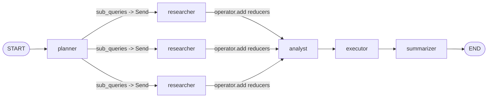
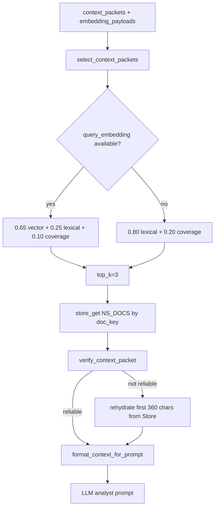
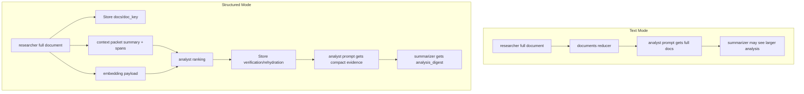

# 结构化文本传输协议说明

本文档说明 SynapseX 主线 `structured` 模式中的结构化文本传输机制。这里的“结构化文本传输”不是把自然语言全文在 Agent 之间继续拼接传递，而是把中间结果拆成可追踪的控制消息、压缩证据包、Store 引用和可选 embedding 排序信号。

模型级 KV cache 或 trueKV 状态传递不属于本文范围，相关设计见 `docs/openos/notext_state_transfer/kv_cache_handoff_design.md`、`src/agent/cache_agents.py` 和 `src/true_kv_handoff_runtime.py`。

## 1. 目标和边界

主线工作流包含 5 类业务 Agent：

```text
planner -> researcher(s) -> analyst -> executor -> summarizer
```

`structured` 模式要解决的问题是：在多 Agent 流程中降低冗长文本透传开销，同时保留足够证据供下游校验和回补。

核心设计如下：

| 通道 | State 字段 | 传递内容 | 用途 |
|---|---|---|---|
| 控制通道 | `messages` | `AgentMessage`，包含 action、params、result、trace metadata | 记录 Agent 间动作和结构化输入输出 |
| 压缩文本通道 | `context_packets` | query-focused summary、evidence spans、doc reference、verification | 替代 researcher 全文透传给 analyst |
| 原文引用通道 | Store `("docs", doc_key)` | researcher 生成的完整文档 | analyst 校验和必要时 rehydrate |
| 向量排序通道 | `embedding_payloads` | `{doc_key, dims, vector}` | 只参与 Python 层排序，不拼进 LLM prompt |
| 降级通道 | `documents`、`document_payloads` | 全文或全文元数据 | 关闭 context packet 或 text 模式时使用 |

因此，structured 模式仍会让 LLM 看到必要的短文本证据，但不会把 researcher 生成的完整自然语言文档无条件传给 analyst、executor 和 summarizer。

### 1.1 相对纯文本传输的优势

| 维度 | 纯文本传输 | 结构化通信协议 |
|---|---|---|
| 传输粒度 | 上游把完整自然语言段落继续拼给下游 | 把控制信息、证据片段、原文引用和排序信号拆开传递 |
| Token 开销 | analyst 往往看到多个 researcher 全文 | analyst 只看到 top-k 证据短片段，summarizer 优先看 `analysis_digest` |
| 可验证性 | 下游难以判断某句话来自哪段原文 | `doc_key`、offset、span hash、全文 hash 可回 Store 校验 |
| 可回补性 | 信息遗漏时通常只能要求上游重新生成或透传更多文本 | packet 失效时通过 `doc_key` 从 Store rehydrate 有界原文片段 |
| 可观测性 | 缺少统一动作、参数和结果统计 | `AgentMessage` 记录 action、params、result、source/target 和消息开销 |
| 可扩展性 | 排序、过滤和能力路由都混在 prompt 中 | Python 协议层可独立接入 lexical score、embedding score、能力注册和指标采集 |

这套协议的重点不是消灭所有文本，而是避免“无差别全文透传”。LLM 仍读取必要证据，但原文、校验元数据、向量和传输统计留在系统层处理。

### 1.2 协议实现要点

1. **控制面和数据面分离**：`AgentMessage` 只记录动作、结构化输入输出摘要和追踪元数据；大段文档不塞进控制消息。
2. **压缩证据替代全文透传**：researcher 生成完整 `doc_text` 后写入 Store，同时构造 `context_packets`，把 `summary`、`evidence_spans`、`doc_key` 和校验信息交给 analyst。
3. **原文可追溯**：每个 evidence span 都带 `char_start`、`char_end` 和 `text_hash`；packet 还带 `full_doc_ref.text_hash`，避免压缩后证据失真。
4. **下游先排序再校验**：analyst 用 `select_context_packets()` 选 top-k，再用 `verify_context_packet()` 回 Store 校验，必要时调用 rehydrate 降级路径。
5. **非文本信号不进 prompt**：`embedding_payloads` 只参与 Python 层 cosine 排序；LLM 只看到 `format_context_for_prompt()` 渲染出的短证据文本。
6. **指标和实验可复现**：`metrics.py` 同时记录 token、message chars、context compression、Store 操作和 packet 校验计数，便于和 `text` 模式做 A/B 对照。

## 2. 代码位置

| 文件 | 职责 |
|---|---|
| `src/graph.py` | 定义 `AgentWorkflowState`、LangGraph 拓扑、fan-out/fan-in reducer |
| `src/protocol.py` | 定义 `AgentMessage`、`ActionType`、`AgentCard`、context packet 构建、排序、校验工具 |
| `src/agent/planner.py` | 生成 plan 和 3 个 sub-query，写入 `NS_PLANS` |
| `src/agent/researcher.py` | 生成文档、写 Store、构造 `context_packets` 和 `embedding_payloads` |
| `src/agent/analyst.py` | 选择 context packet，回 Store 校验/回补，生成 analysis/evidence |
| `src/agent/executor.py` | 执行受限 CodeAct 校验，生成 `execution_result` 和 `final_answer` |
| `src/agent/summarizer.py` | 使用 digest、evidence 和 executor artifact 生成最终摘要 |
| `src/memory.py` | `InMemoryStore`、embedding、MemoryUnit、JSONL 持久化 |
| `src/metrics.py` | 消息、token、压缩率、Store、时延指标 |
| `src/config.py` | 运行后端、Store namespace、context/embedding 开关 |

## 3. 运行拓扑

LangGraph 拓扑在 `src/graph.py::build_graph()` 中构建：



`fan_out_research()` 将 `planner` 输出的每个 `sub_query` 包装为 LangGraph `Send`：

```python
Send("researcher", {
    "sub_query": sq,
    "task_group": task_group,
    "mode": mode,
})
```

并行 researcher 的输出通过 `AgentWorkflowState` 中的 reducer 聚合：

```python
documents: Annotated[list[str], operator.add]
document_payloads: Annotated[list[dict], operator.add]
context_packets: Annotated[list[dict], operator.add]
messages: Annotated[list[dict], operator.add]
embedding_payloads: Annotated[list[dict], operator.add]
```

这些 reducer 是 fan-in 的关键。每个 researcher 只返回自己的局部结果，LangGraph 在进入 analyst 前把多个列表追加到同一个 state。

## 4. AgentWorkflowState 数据协议

`AgentWorkflowState` 是所有节点共享的状态结构。主字段如下：

| 字段 | 生产者 | 消费者 | 说明 |
|---|---|---|---|
| `query` | runner | 全部 Agent | 原始任务 |
| `source_context` | runner/cache path | cache path | 主线 structured 通常不用 |
| `task_group` | runner | 全部 Agent | 任务分组，用于 Store key、记忆隔离和指标统计 |
| `mode` | runner | 全部 Agent | `text`、`structured`、`cache` 或 `latent_kv` |
| `plan` | planner | analyst、executor、summarizer | 规划文本 |
| `sub_queries` | planner | `fan_out_research()` | 3 个检索/研究子问题 |
| `documents` | researcher | analyst | text 模式全文通道，或 structured 降级通道 |
| `document_payloads` | researcher | analyst | structured 模式关闭 packet 时的全文元数据 |
| `context_packets` | researcher | analyst | structured 模式核心压缩证据包 |
| `embedding_payloads` | researcher | analyst | 文档向量载荷，只用于排序 |
| `analysis` | analyst | executor、summarizer | 完整分析文本 |
| `analysis_digest` | analyst | summarizer | structured 模式下给 summarizer 的短摘要 |
| `candidate_answers` | analyst | executor | 面向机器评测的候选字段答案 |
| `evidence` | analyst | executor、summarizer | 结构化证据列表 |
| `selected_context_packets` | analyst | executor | 排序、校验和回补后的 packet |
| `context_verification` | analyst | runner/metrics | packet 校验统计 |
| `execution_code` | executor | runner/debug | 受限 CodeAct 程序 |
| `execution_result` | executor | summarizer | 执行结果、指标、错误信息 |
| `execution_summary` | executor | summarizer | 执行摘要 |
| `final_answer` | executor | summarizer/runner | 机器评测友好的最终答案 |
| `extracted_answers` | executor | summarizer/runner | 结构化字段答案 |
| `summary` | summarizer | runner/Store | 人类可读最终摘要 |
| `key_findings` | summarizer | runner | 关键发现 |
| `messages` | 全部 Agent | runner/metrics | `AgentMessage` 事件流 |

## 5. 端到端传输时序

```mermaid
sequenceDiagram
    participant U as Runner
    participant P as Planner
    participant R as Researcher x3
    participant S as Store
    participant A as Analyst
    participant E as Executor
    participant M as Summarizer

    U->>P: {query, task_group, mode=structured}
    P->>S: put(NS_PLANS, plan_id, plan/sub_queries)
    P-->>U: plan, sub_queries, AgentMessage(plan)
    U->>R: Send({sub_query, task_group, mode})
    R->>S: put(NS_DOCS, doc_key, full doc text)
    R-->>U: context_packet(doc_key, summary, spans), embedding_payload, AgentMessage(research)
    U->>A: reducer fan-in packets/messages/vectors
    A->>A: select_context_packets()
    A->>S: get(NS_DOCS, doc_key)
    A->>A: verify_context_packet(); rehydrate if needed
    A->>S: put(NS_ANALYSIS, analysis_id, analysis/evidence)
    A-->>E: analysis_digest, evidence, selected_context_packets, AgentMessage(analyze)
    E->>S: put(NS_EXECUTIONS, execution_id, code/result/final_answer)
    E-->>M: execution_summary, execution_result, AgentMessage(execute)
    M->>S: put(NS_SUMMARIES, summary_id, summary/key_findings)
    M-->>U: summary, final_answer, AgentMessage(summarize)
```

关键点：

- researcher 到 analyst 的主传输对象是 `context_packets`，不是完整 `doc_text`。
- 完整文档只写入 Store，下游通过 `doc_key` 按需读取。
- embedding 向量只在 `select_context_packets()` 中参与打分，不进入 LLM prompt。
- summarizer 在 structured 模式优先读取 `analysis_digest`，避免把完整 `analysis` 再传一遍。

## 6. AgentMessage 控制消息

`AgentMessage` 定义在 `src/protocol.py`：

```python
@dataclass
class AgentMessage:
    msg_id: str
    timestamp: float
    source: str
    target: str
    action: ActionType
    params: dict
    result: dict
    embedding: list | None
    task_group: str
    round_id: int
    status: str = "success"
```

`ActionType` 包含：

```text
plan, research, retrieve, analyze, execute, summarize, query_memory, store_memory
```

典型消息示例：

```json
{
  "msg_id": "msg_3a1f8c2b",
  "timestamp": 1783090000.123,
  "source": "researcher",
  "target": "analyst",
  "action": "research",
  "params": {
    "sub_query": "LangGraph StateGraph reducer mechanism",
    "doc_key": "doc_foundation_ab12cd34ef56"
  },
  "result": {
    "doc_key": "doc_foundation_ab12cd34ef56",
    "document_chars": 4200,
    "summary": "ev1: ...",
    "evidence_count": 4,
    "query_coverage": 0.63,
    "reliable": true,
    "original_chars": 4200,
    "compressed_chars": 760,
    "compression_ratio": 0.181,
    "context_packets_enabled": true
  },
  "embedding": [0.012, -0.044],
  "task_group": "foundation",
  "round_id": 0,
  "status": "success"
}
```

`metrics.record_message()` 会记录：

- `source`、`target`、`action`
- `param_chars`
- `result_chars`
- 是否携带 embedding
- embedding 维度

这些指标用于和 text 模式比较 Agent 间协议开销。

### 6.1 AgentCard 和能力发现

`src/protocol.py` 还定义了轻量的 `AgentCard` / `AgentRegistry`，用于描述 Agent 能力和做协议动作映射：

```python
@dataclass
class AgentCard:
    name: str
    description: str
    actions: list[str]
    input_schema: dict
    output_schema: dict
    supports_embedding: bool = False
```

`create_default_registry()` 注册 5 个业务 Agent：

| Agent | actions | supports_embedding | 主要输入/输出 |
|---|---|---:|---|
| `planner` | `plan` | 否 | `query` -> `plan`、`sub_queries` |
| `researcher` | `research` | 是 | `sub_query` -> `doc_key`、`context_packet`、`embedding_payload` |
| `analyst` | `analyze` | 是 | `context_packets`、`embedding_payloads` -> `analysis`、`analysis_digest`、`evidence` |
| `executor` | `execute` | 否 | `analysis`、`evidence` -> `execution_result`、`final_answer` |
| `summarizer` | `summarize` | 否 | `analysis`、`execution_result` -> `summary`、`key_findings` |

`AgentRegistry.discover(action)` 支持按动作发现可执行 Agent，并把历史兼容动作 `retrieve` 映射为 `research`；`get_card("retriever")` 也会映射到 `researcher`。当前 LangGraph 主链路仍是静态拓扑，registry 主要用于能力描述、demo 展示和协议兼容映射，不把能力发现逻辑塞进 LLM prompt。

## 7. Context Packet 压缩文本包

`context_packets` 是 structured 模式的核心文本传输单元，由 `src/protocol.py::build_context_packet()` 构造。

### 7.1 Packet 字段

典型结构如下：

```json
{
  "protocol": "context-packet",
  "schema_version": 2,
  "doc_key": "doc_foundation_ab12cd34ef56",
  "task_group": "foundation",
  "source_query": "LangGraph reducer and channel mechanism",
  "summary": "ev1: reducer merges parallel branch outputs ...",
  "evidence_spans": [
    {
      "span_id": "ev1",
      "text": "Annotated[list, operator.add] lets parallel researchers append outputs ...",
      "score": 0.7342,
      "matched_terms": ["reducer", "parallel"],
      "coverage": 0.5,
      "density": 0.2,
      "char_start": 128,
      "char_end": 276,
      "source_ref": {
        "doc_key": "doc_foundation_ab12cd34ef56",
        "char_start": 128,
        "char_end": 276,
        "text_hash": "f4ab9d0a91c7e420"
      },
      "retrieval_method": "lexical_span_retrieval"
    }
  ],
  "tags": ["langgraph", "reducer"],
  "embedding_ref": "doc_foundation_ab12cd34ef56",
  "original_chars": 4200,
  "compressed_chars": 760,
  "compression_ratio": 0.181,
  "retrieval_diagnostics": {
    "method": "lexical_span_retrieval",
    "evidence_count": 4,
    "query_coverage": 0.63,
    "covered_terms": ["reducer", "stategraph"],
    "missing_terms": ["checkpoint"],
    "requires_full_doc_lookup": false,
    "coverage_warning": false
  },
  "full_doc_ref": {
    "namespace": "docs",
    "key": "doc_foundation_ab12cd34ef56",
    "text_hash": "76efac01d14e5320"
  },
  "verification": {
    "reliable": true,
    "full_doc_hash_matches": true,
    "evidence_count": 4,
    "valid_ref_count": 4,
    "invalid_refs": [],
    "query_coverage": 0.63,
    "coverage_warning": false,
    "requires_full_doc_lookup": false,
    "reliability_basis": "structural"
  },
  "score": 0.0
}
```

### 7.2 构造算法

`build_context_packet()` 的步骤：

1. `retrieve_evidence_spans()` 将文档按句子切片，超长句子按窗口切分。
2. 对每个候选 span 计算词面分数：

```text
score = 0.72 * query_term_coverage
      + 0.18 * term_density
      + position_bonus
      + phrase_bonus
```

3. 过滤低分片段，去除重叠范围，最多保留 `DEFAULT_EVIDENCE_PER_DOC=4` 个 span。
4. `summarize_evidence_spans()` 从高分 span 抽取摘要，默认 `DEFAULT_SUMMARY_CHARS=360`。
5. 写入 `full_doc_ref`，包含 Store namespace、doc key 和全文 hash。
6. `verify_context_packet()` 立即用原文做一次结构校验。
7. 记录 `original_chars`、`compressed_chars` 和 `compression_ratio`。

默认参数在 `src/protocol.py`：

| 参数 | 默认值 | 含义 |
|---|---:|---|
| `DEFAULT_CONTEXT_TOP_K` | 3 | analyst 最多选择的 packet 数 |
| `DEFAULT_EVIDENCE_PER_DOC` | 4 | 每个文档最多证据片段数 |
| `DEFAULT_SUMMARY_CHARS` | 360 | packet 摘要长度上限 |
| `DEFAULT_EVIDENCE_CHARS` | 180 | 单个证据片段长度上限 |
| `DEFAULT_MIN_QUERY_COVERAGE` | 0.35 | coverage warning 阈值 |
| `DEFAULT_MIN_EVIDENCE_SCORE` | 0.05 | 候选证据最低分 |

## 8. Analyst 选择、校验和回补

analyst 在 `src/agent/analyst.py` 中处理 researcher fan-in 后的 packet。



### 8.1 排序公式

`select_context_packets()` 使用两种模式。

有 embedding 时：

```text
score = 0.65 * cosine(query_embedding, doc_embedding)
      + 0.25 * lexical_relevance(query, packet)
      + 0.10 * query_coverage
```

无 embedding 时：

```text
score = 0.80 * lexical_relevance(query, packet)
      + 0.20 * query_coverage
```

`score_components` 会写回 packet，便于调试排序来源。

### 8.2 校验规则

`verify_context_packet()` 回 Store 读取完整 `doc_text` 后检查：

- `full_doc_ref.text_hash` 是否匹配 Store 里的全文 hash。
- 每个 `evidence_span.source_ref.char_start/char_end` 是否在原文范围内。
- 原文切片归一化后是否等于 span 文本。
- span hash 是否匹配。
- query coverage 是否低于阈值。coverage 只作为 warning，不直接判定结构失败。

如果结构可靠，packet 原样进入 prompt 渲染。如果结构不可靠，analyst 调用 `_rehydrate_packet_from_store()` 从 Store 读取原文前 360 字符并构造 fallback evidence：

```text
doc_key#rehydrated -> bounded original document excerpt
```

`context_verification` 统计如下：

```json
{
  "checked": 3,
  "reliable": 2,
  "rehydrated": 1,
  "failed": 0,
  "missing_docs": []
}
```

### 8.3 Prompt 渲染

LLM 不会看到完整 packet JSON。`format_context_for_prompt()` 只渲染经过选择和校验的短证据文本：

```text
[doc_foundation_ab12cd34ef56#ev1] Annotated[list, operator.add] lets ...
[doc_foundation_ab12cd34ef56#ev2] Send dispatches each sub-query ...
```

offset、hash、diagnostics、compression stats 保留在 Python 协议层。

## 9. Embedding Payload

当 `ENABLE_EMBEDDING_TRANSFER=1` 时，researcher 对文档前 500 字符生成 embedding：

```python
embedding = embedder.embed_query(doc_text[:500])
```

payload 结构：

```json
{
  "doc_key": "doc_foundation_ab12cd34ef56",
  "embedding_ref": "doc_foundation_ab12cd34ef56",
  "dims": 1024,
  "vector": [0.012, -0.044, 0.031]
}
```

embedding 来源：

- 设置 `DASHSCOPE_API_KEY` 时使用 DashScope `text-embedding-v4`。
- 未设置时使用 `LocalHashEmbeddings`，即确定性的本地 hashed bag-of-words 向量，便于离线演示。

接收侧 analyst 会对 `query + plan` 生成 query embedding，再按 `doc_key` 找到文档向量并计算 cosine similarity。向量不写入 prompt，不要求 LLM 解析。

## 10. Store 和共享记忆

Store 由 `src/memory.py::create_store()` 创建：

```python
InMemoryStore(index={
    "dims": EMBEDDING_DIMS,
    "embed": embeddings,
    "fields": ["text"],
})
```

所有写入都通过 `store_put()` 包装成统一 `MemoryUnit`。MemoryUnit 至少包含：

```json
{
  "memory_schema_version": 1,
  "memory_id": "doc_foundation_ab12cd34ef56",
  "memory_type": "document",
  "source_agent": "researcher",
  "created_at": 1783090000.123,
  "created_at_iso": "2026-07-03T12:00:00+00:00",
  "task_group": "foundation",
  "task_topic": "LangGraph reducer and channel mechanism",
  "summary": "short summary",
  "text": "indexed text",
  "tags": ["document", "researcher", "foundation"],
  "evidence_refs": [],
  "payload": {}
}
```

主线 namespace：

| Namespace | 写入 Agent | 内容 |
|---|---|---|
| `NS_PLANS = ("plans",)` | planner | plan、sub_queries、query |
| `NS_DOCS = ("docs",)` | researcher | 完整文档、sub_query、task_group |
| `NS_ANALYSIS = ("analysis",)` | analyst | analysis、digest、candidate_answers、evidence、selected_doc_keys |
| `NS_EXECUTIONS = ("executions",)` | executor | CodeAct code、execution_result、execution_summary、final_answer |
| `NS_SUMMARIES = ("summaries",)` | summarizer | summary、key_findings、recommendations |

长期记忆默认写入：

```text
.memory/shared_memory.jsonl
```

下一次 `create_store()` 会自动加载 JSONL 中最新记录，并重新建立语义索引。做隔离实验时应设置：

```bash
export PERSISTENT_MEMORY_ENABLED=0
```

## 11. Agent 级传输细节

### 11.1 planner -> researcher

输入：

```json
{"query": "...", "task_group": "foundation", "mode": "structured"}
```

输出：

```json
{
  "plan": "A concise research plan...",
  "sub_queries": ["...", "...", "..."],
  "messages": [{"action": "plan", "source": "planner", "target": "researcher"}]
}
```

planner 同时写 Store：

```text
namespace: ("plans",)
key: plan_{task_group}_{hash_text(query)}
```

### 11.2 researcher -> analyst

每个 researcher 分支输入：

```json
{"sub_query": "...", "task_group": "foundation", "mode": "structured"}
```

输出分两种。

启用 context packet：

```json
{
  "context_packets": ["context packet dict"],
  "embedding_payloads": ["embedding payload dict"],
  "messages": [{"action": "research"}]
}
```

关闭 context packet：

```json
{
  "documents": ["full doc text"],
  "document_payloads": [{
    "doc_key": "...",
    "sub_query": "...",
    "text": "full doc text",
    "text_hash": "...",
    "original_chars": 4200
  }],
  "embedding_payloads": ["embedding payload dict"],
  "messages": [{"action": "research"}]
}
```

### 11.3 analyst -> executor

structured 模式下 analyst 传递：

```json
{
  "analysis": "full analysis",
  "analysis_digest": "short digest",
  "candidate_answers": {},
  "evidence": [
    {"claim": "...", "support": "...", "doc_key": "...", "span_id": "ev1"}
  ],
  "selected_context_packets": ["verified or rehydrated packets"],
  "context_verification": {"checked": 3, "reliable": 3, "rehydrated": 0, "failed": 0},
  "messages": [{"action": "analyze"}]
}
```

`AgentMessage.result` 不塞完整 analysis，只记录 `analysis_digest`、`analysis_chars`、`evidence_count`、校验统计等摘要字段。

### 11.4 executor -> summarizer

executor 根据结构化 evidence 和 analysis 构造受限 Python 程序，AST 白名单执行，不访问 shell、文件或网络。输出：

```json
{
  "execution_code": "...",
  "execution_result": {"ok": true, "metrics": {}, "stdout": ""},
  "execution_summary": "ok=True; ...",
  "final_answer": "@field[value]",
  "extracted_answers": {"field": "value"},
  "messages": [{"action": "execute"}]
}
```

### 11.5 summarizer -> output

summarizer 在 structured 模式使用：

- `analysis_digest`
- `evidence`
- `execution_summary`
- `execution_result`
- `final_answer`

输出：

```json
{
  "summary": "human-readable report",
  "key_findings": ["...", "..."],
  "final_answer": "@field[value]",
  "extracted_answers": {"field": "value"},
  "messages": [{"action": "summarize"}]
}
```

## 12. Text 模式和 Structured 模式差异



| 项目 | `text` | `structured` |
|---|---|---|
| researcher 输出 | `documents` 全文 | `context_packets`、`embedding_payloads`、`messages` |
| analyst 输入 | 全文拼接 | top-k compact evidence |
| 原文保存 | 可写 Store，但传输仍靠全文 | 必须通过 `doc_key` 回 Store 校验/回补 |
| 消息追踪 | 无统一控制消息 | `AgentMessage` 事件流 |
| 向量使用 | 不使用 | 用于 packet/document 排序 |
| summarizer 上下文 | 通常使用完整 analysis | 优先使用 `analysis_digest` |
| 指标 | token、时延 | token、时延、消息字符、embedding 次数、压缩率、packet 校验 |

## 13. 指标采集

`src/metrics.py` 采集以下指标：

| 指标 | 来源 | 含义 |
|---|---|---|
| `message_count` | `record_message()` | structured AgentMessage 数量 |
| `param_chars` | `record_message()` | params 字符数 |
| `result_chars` | `record_message()` | result 字符数 |
| `embedding_transfers` | `record_message()` | 携带 embedding 的消息数 |
| `context_original_chars` | `record_context_compression()` | 压缩前文本字符数 |
| `context_compressed_chars` | `record_context_compression()` | prompt 可见压缩文本字符数 |
| `context_saved_chars` | `record_context_compression()` | 节省字符数 |
| `context_packets_enabled` | counter | 构造 packet 次数 |
| `context_packets_checked` | counter | analyst 校验 packet 次数 |
| `context_packets_reliable` | counter | 校验可靠次数 |
| `context_packets_rehydrated` | counter | 回 Store 回补次数 |
| `context_packets_failed` | counter | Store 缺失或校验失败次数 |
| `embedding_received` | counter | analyst 收到 embedding payload 数 |
| `llm_calls/input_tokens/output_tokens` | `record_tokens()` | LLM 调用和 token 统计 |
| `memory_reuse_hits` | counter | Store 历史记忆命中 |
| `store_ops` | `record_store_op()` | Store put/get/search 时延和命中分数 |

`metrics.report()` 会打印文本报告，`metrics.summary_dict()` 会生成实验 JSON 中可比较的摘要。

## 14. 失败和降级路径

structured 模式有明确降级逻辑：

1. `ENABLE_CONTEXT_PACKETS=0`：researcher 发送 `documents` 和 `document_payloads`，analyst 调用 `select_document_payloads()` 排序。
2. embedding 生成失败或 `ENABLE_EMBEDDING_TRANSFER=0`：packet 排序退化为 lexical relevance + coverage。
3. packet 校验失败：analyst 从 Store 读取原文前 360 字符进行 rehydrate。
4. Store 中找不到 `doc_key`：packet 标记 failed，`context_verification.missing_docs` 记录缺失 key。
5. LLM JSON 解析失败：各 Agent 使用本地 fallback 结构，保证图继续运行。

## 15. 与 trueKV/cache 路径的边界

| 机制 | 入口 | 是否复用模型内部 KV | 传输对象 |
|---|---|---:|---|
| `structured` | `build_graph(mode="structured")` | 否 | `AgentMessage`、`context_packets`、Store 引用、embedding vector |
| `text` | `build_graph(mode="text")` | 否 | 自然语言全文字段 |
| `cache/trueKV` | `build_cache_graph()` 和 cache 实验脚本 | 是 | vLLM prefix-cache/KV handle、cache trace metadata |

如果实验目标是结构化文本传输、压缩上下文和共享记忆复用，使用 `structured`。如果目标是模型级非文本中间状态或 KV cache 复用，使用 trueKV/cache 路径。

## 16. 实验任务设计和 A/B 对比结果

本节对应通信协议实验产物：

| 文件 | 内容 |
|---|---|
| `task/data_anas/run_group1_single.py` | 单协议 10 轮任务 runner |
| `task/data_anas/group1_tasks.json` | Group1 Titanic 任务定义 |
| `task/data_anas/group1_gold.json` | 自动评测 gold 字段 |
| `exp/comm_exp/task1_protocol_a_text.json` | Protocol A 纯文本结果 |
| `exp/comm_exp/task1_protocol_b_structured.json` | Protocol B 结构化结果 |
| `exp/comm_exp/task1_context_packets.md` | 本次 A/B 汇总报告 |

实验使用同一条 LangGraph 业务链路：

```text
planner -> researcher(s) -> analyst -> executor -> summarizer
```

`run_group1_single.py` 每轮把任务问题、约束、期望输出格式和 `titanic.csv` 前 40 行样本拼成 query。planner 默认生成 3 个 `sub_queries`，因此 10 轮任务共有 10 次 planner、30 次 researcher、10 次 analyst、10 次 executor 和 10 次 summarizer 调用。

### 16.1 实验口径

| 项目 | Protocol A | Protocol B |
|---|---|---|
| 运行模式 | `mode=text` | `mode=structured` |
| researcher -> analyst | `documents` 全文透传 | `context_packets` 压缩证据包 |
| Context packet | `ENABLE_CONTEXT_PACKETS=0` | `ENABLE_CONTEXT_PACKETS=1` |
| Embedding 排序 | `ENABLE_EMBEDDING_TRANSFER=0` | `ENABLE_EMBEDDING_TRANSFER=0` |
| 长期记忆 | `PERSISTENT_MEMORY_ENABLED=0` | `PERSISTENT_MEMORY_ENABLED=0` |
| 模型服务 | OpenAI-compatible vLLM API，`/data/models/Qwen3-8B` | 同左 |
| 自动评测来源 | executor 的 `extracted_answers` / `final_answer` | 同左 |

这里故意关闭 embedding，是为了单独评估结构化文本协议和 `context_packets` 的收益，不把向量排序收益混入对比。

### 16.2 任务设计

| Round | Task ID | 任务目标 | Gold 评分字段 | 关联复用设计 |
|---:|---:|---|---|---|
| 1 | 129 | 计算 Fare 均值和总体标准差 | `std_dev_fare` | 无 |
| 2 | 174 | 用 pandas `skew()` 计算 Fare 偏度 | `fare_skewness` | 无 |
| 3 | 517 | 计算 Pclass 与 Fare 的 Pearson 相关系数 | `correlation_pclass_fare` | 无 |
| 4 | 516 | 用 Pearson moment coefficient 检查 Fare 偏度 | `skewness_fare` | 复用 Round 2 的 Fare 偏度主题 |
| 5 | 130 | 用 Shapiro-Wilk 检验 Age 是否正态 | `is_normal` | 无 |
| 6 | 304 | 用 Shapiro-Wilk 检验 Fare 是否正态 | `normality_test_result` | 无 |
| 7 | 132 | 用 Z-score 统计 Fare 异常值数量 | `outlier_count` | 复用 Round 1 的 Fare 均值和标准差主题 |
| 8 | 175 | 用 Z-score 统计 Age 异常值数量 | `outliers_count` | 无 |
| 9 | 179 | 计算幸存且一等舱乘客 Age 与 Fare 相关系数 | `correlation_coefficient` | 复用 Round 1 的统计量主题 |
| 10 | 520 | 构造 `FamilySize` 并计算其与 `Survived` 的相关系数 | `correlation_coefficient` | 无 |

部分任务的 `answer_format` 包含多个字段，但本次自动评分只比较 `group1_gold.json` 中列出的字段。

### 16.3 总体结果

| 指标 | Protocol A 纯文本 | Protocol B 结构化 | B - A |
|---|---:|---:|---:|
| LLM 调用 | 60 | 60 | 0 |
| 输入 tokens | 95,226 | 79,597 | -15,629 (-16.4%) |
| 输出 tokens | 18,795 | 18,825 | +30 (+0.2%) |
| 总 tokens | 114,021 | 98,422 | -15,599 (-13.7%) |
| 总耗时 | 218.69s | 284.01s | +65.32s (+29.9%) |
| 平均每轮耗时 | 21.87s | 28.40s | +6.53s |
| 答案字段准确率 | 2/10 | 2/10 | 0 |
| Context 压缩 | N/A | 104,414 -> 41,574 chars | 节省 62,840 chars (60.2%) |

本次结果能支持的结论是：结构化协议明显减少了 prompt 侧上下文开销，尤其是 researcher 输出进入 analyst 前的材料；但当前实现没有带来端到端耗时收益，Protocol B 反而更慢。耗时增加来自额外 packet 构造、Store 校验、prompt 差异和模型服务波动等因素，后续优化应单独分析。

### 16.4 分 Agent Token 明细

| Agent | A calls | A tokens | B calls | B tokens | B - A tokens |
|---|---:|---:|---:|---:|---:|
| analyst | 10 | 49,096 | 10 | 33,806 | -15,290 |
| planner | 10 | 23,439 | 10 | 23,357 | -82 |
| researcher | 30 | 13,097 | 30 | 12,798 | -299 |
| summarizer | 10 | 28,389 | 10 | 28,461 | +72 |

Token 节省主要发生在 analyst：Protocol B 不再把 researcher 全文直接拼进 analyst prompt，而是先经过 `context_packets` 选取和渲染短证据。

### 16.5 Protocol B 协议指标

| 指标 | 值 |
|---|---:|
| `context_packets_enabled` | 30 |
| `context_packets_checked` | 30 |
| `context_packets_reliable` | 30 |
| `context_packets_rehydrated` | 0 |
| `context_packets_failed` | 0 |
| `context_packet_fallback_documents` | 0 |
| `context_original_chars` | 104,414 |
| `context_compressed_chars` | 41,574 |
| `context_saved_chars` | 62,840 |
| `message_count` | 70 |
| `param_chars` | 59,327 |
| `result_chars` | 31,152 |
| `embedding_transfers` | 0 |

Action 分布：

| Action | 消息数 |
|---|---:|
| `plan` | 10 |
| `research` | 30 |
| `analyze` | 10 |
| `execute` | 10 |
| `summarize` | 10 |

这组指标说明 30 个 researcher packet 全部通过结构校验，没有触发 Store rehydrate 或全文 fallback；70 条 `AgentMessage` 覆盖了每轮的 5 类业务动作和 3 个 researcher 分支。

### 16.6 逐轮正确性

| Round | Gold | Protocol A 输出 | Protocol B 输出 | 结果 |
|---:|---|---|---|---|
| 1 | `std_dev_fare=49.67` | `29.46` | `29.46` | A/B 均错 |
| 2 | `fare_skewness=4.79` | `1.44` | `4.00` | A/B 均错 |
| 3 | `correlation_pclass_fare=-0.55` | `-0.68` | `0.00` | A/B 均错 |
| 4 | `skewness_fare=4.79` | `1.55` | `4.00` | A/B 均错 |
| 5 | `is_normal=False` | `False` | `False` | A/B 均对 |
| 6 | `normality_test_result=False` | `False` | `False` | A/B 均对 |
| 7 | `outlier_count=20` | `0` | `2` | A/B 均错 |
| 8 | `outliers_count=2` | `3` | `1` | A/B 均错 |
| 9 | `correlation_coefficient=-0.123` | `-0.680` | `0.123` | A/B 均错 |
| 10 | `correlation_coefficient=0.02` | `-0.23` | `-0.43` | A/B 均错 |

准确率没有提升，说明当前 Group1 任务瓶颈主要在模型对样本数据统计计算的可靠性，而不是通信协议是否能保留证据。通信协议实验的主要收益体现在 token 降低、证据可校验和链路可观测。

## 17. 如何运行

以下命令均在仓库根目录执行：

```bash
cd /data/mingwei/yzmxdzntxzddkxtxztcdygxjyjz
export PYTHONPATH="$PWD/src${PYTHONPATH:+:$PYTHONPATH}"
```

### 17.1 安装基础依赖

```bash
python -m pip install langgraph langchain-core langchain-openai dashscope numpy
```

如果使用本地 Transformers 后端，再安装：

```bash
python -m pip install transformers torch accelerate
```

### 17.2 使用 OpenAI 兼容后端运行完整 demo

```bash
export CHAT_BACKEND=openai
export CHAT_API_KEY="你的 Chat API key"
export CHAT_BASE_URL="https://api.deepseek.com"
export CHAT_MODEL="deepseek-chat"

# 可选。未设置时自动使用 LocalHashEmbeddings。
export DASHSCOPE_API_KEY="你的 DashScope API key"

python -u exp/run_demo.py
```

`exp/run_demo.py` 会先跑 text 模式，再跑 structured 模式，并在终端输出 token、消息数、压缩率、记忆复用等对比指标。

### 17.3 使用本机 vLLM OpenAI-compatible 服务

如果本机已有 vLLM 服务监听 `127.0.0.1:8000/v1`：

```bash
unset http_proxy https_proxy HTTP_PROXY HTTPS_PROXY
export CHAT_BACKEND=openai
export CHAT_API_KEY=EMPTY
export CHAT_BASE_URL=http://127.0.0.1:8000/v1
export CHAT_MODEL=/data/models/Qwen3-8B
export CHAT_DISABLE_THINKING=1

python -u exp/run_demo.py
```

可先检查服务是否可用：

```bash
python - <<'PY'
import urllib.request
print(urllib.request.urlopen("http://127.0.0.1:8000/v1/models", timeout=3).read().decode()[:500])
PY
```

### 17.4 使用本地 Transformers 后端

```bash
export CHAT_BACKEND=transformers
export CHAT_MODEL=qwen3-8b
export LOCAL_MODEL_PATH=/data/models/Qwen3-8B
export LOCAL_MODEL_DEVICE=cuda:0
export LOCAL_MODEL_DTYPE=bfloat16
export CHAT_DISABLE_THINKING=1

python -u exp/run_demo.py
```

### 17.5 只运行 structured 12 轮实验

```bash
export CHAT_BACKEND=openai
export CHAT_API_KEY="你的 Chat API key"
export CHAT_BASE_URL="https://api.deepseek.com"
export CHAT_MODEL="deepseek-chat"
export ENABLE_CONTEXT_PACKETS=1
export ENABLE_EMBEDDING_TRANSFER=1

python -u exp/comm_exp/run_structured_only.py
```

输出文件：

```text
exp/comm_exp/results_structured_only.json
```

### 17.6 跑 Protocol A/B 对照

Protocol A，纯文本：

```bash
export CHAT_BACKEND=openai
export CHAT_API_KEY=EMPTY
export CHAT_BASE_URL=http://127.0.0.1:8000/v1
export CHAT_MODEL=/data/models/Qwen3-8B
export CHAT_DISABLE_THINKING=1
export PERSISTENT_MEMORY_ENABLED=0
export ENABLE_CONTEXT_PACKETS=0
export ENABLE_EMBEDDING_TRANSFER=0

python -u task/data_anas/run_group1_single.py --mode text \
  > exp/comm_exp/task1_protocol_a_text.json \
  2> exp/comm_exp/task1_protocol_a_text.log
```

Protocol B，结构化文本传输：

```bash
export CHAT_BACKEND=openai
export CHAT_API_KEY=EMPTY
export CHAT_BASE_URL=http://127.0.0.1:8000/v1
export CHAT_MODEL=/data/models/Qwen3-8B
export CHAT_DISABLE_THINKING=1
export PERSISTENT_MEMORY_ENABLED=0
export ENABLE_CONTEXT_PACKETS=1
export ENABLE_EMBEDDING_TRANSFER=0

python -u task/data_anas/run_group1_single.py --mode structured \
  > exp/comm_exp/task1_protocol_b_structured.json \
  2> exp/comm_exp/task1_protocol_b_structured.log
```

运行中查看日志：

```bash
tail -f exp/comm_exp/task1_protocol_a_text.log
tail -f exp/comm_exp/task1_protocol_b_structured.log
```

完成后检查结果：

```bash
python - <<'PY'
import json
for path in [
    "exp/comm_exp/task1_protocol_a_text.json",
    "exp/comm_exp/task1_protocol_b_structured.json",
]:
    data = json.load(open(path, encoding="utf-8"))
    print(path)
    print("mode =", data.get("mode"))
    print("rounds =", len(data.get("rounds", [])))
    print("total_tokens =", data.get("metrics_summary", {}).get("total_tokens"))
    if data.get("rounds"):
        first = data["rounds"][0]
        print("answer_source =", first.get("answer_source"))
        print("final_answer =", first.get("final_answer"))
PY
```

### 17.7 常用开关

```bash
# 是否启用 researcher -> analyst 的 compact context packet
export ENABLE_CONTEXT_PACKETS=1

# 是否启用 researcher -> analyst 的 embedding payload
export ENABLE_EMBEDDING_TRANSFER=1

# embedding 参数
export EMBEDDING_MODEL=text-embedding-v4
export EMBEDDING_DIMS=1024
export EMBEDDING_BATCH_SIZE=10

# 是否启用长期记忆。做干净实验建议关闭。
export PERSISTENT_MEMORY_ENABLED=0

# 长期记忆路径，默认 .memory/shared_memory.jsonl
export PERSISTENT_MEMORY_PATH=.memory/shared_memory.jsonl
```
