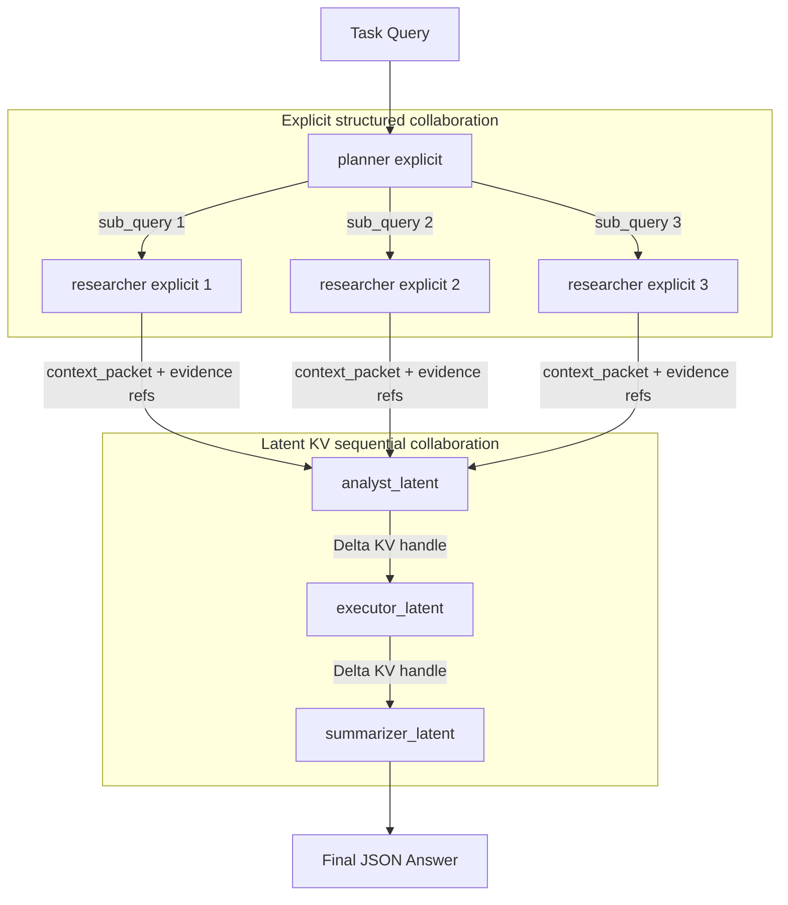
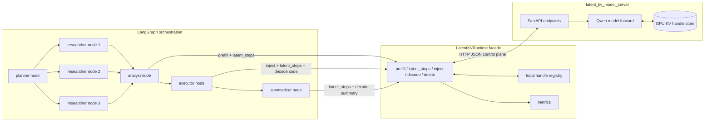
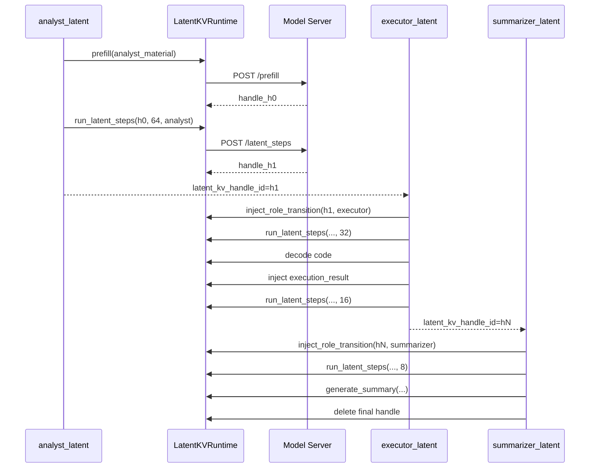

# D 模式 Latent KV 非文本状态传递设计

本文档描述当前仓库中的 D 模式实现：

```text
planner -> 3×researcher -> analyst_latent -> executor_latent -> summarizer_latent
```

当前 D 模式没有专门的 reducer agent。planner 和 researcher 仍通过显式结构化协议协作；planner 会生成 3 个互补 sub-query，LangGraph 将 3 个 researcher 分支 fan-out 并通过 state reducer fan-in 给 analyst。从 analyst 开始，系统把中间推理状态转入 latent KV 链，并在后续 Agent 间传递 KV handle，而不是传递长自然语言分析文本。

## 1. 设计目标

D 模式用于验证一种混合式多 Agent 协作：

1. 前半段保留显式结构化协作，保证任务拆解和证据包可检查。
2. 后半段使用 latent KV 顺序协作，减少长分析文本在 Agent 间反复解码、编码和传输。
3. A/B/D 保持业务 Agent 拓扑一致，不额外增加 reducer agent。
4. D 的 3 个 researcher 是显式 structured researcher，不携带 KV 分支；latent KV 从 analyst 才开始，因此避免多分支 KV fork/merge 问题。

对比组含义：

| 模式 | 拓扑 | Agent 间状态形式 |
|---|---|---|
| A/text | planner -> 3×researcher -> analyst -> executor -> summarizer | 自然语言文本 |
| B/structured | planner -> 3×researcher -> analyst -> executor -> summarizer | AgentMessage + context packet + embedding |
| D/latent_kv | planner -> 3×researcher -> analyst_latent -> executor_latent -> summarizer_latent | 前半段结构化文本，后半段 Latent KV handle |

## 2. 当前拓扑

### 2.1 业务拓扑

```text
┌─────────┐
│ planner │
└────┬────┘
     │ plan + 3 sub_queries
     ├───────────────┬───────────────┐
     ▼               ▼               ▼
┌────────────┐  ┌────────────┐  ┌────────────┐
│ researcher │  │ researcher │  │ researcher │
└─────┬──────┘  └─────┬──────┘  └─────┬──────┘
      └───────────────┴───────────────┘
              context_packets + evidence refs
                         ▼
┌────────────────┐
│ analyst_latent │
└───────┬────────┘
        │ ΔKV handle
        ▼
┌────────────────┐
│ executor_latent│
└───────┬────────┘
        │ ΔKV handle + execution result injected
        ▼
┌──────────────────┐
│ summarizer_latent│
└──────────────────┘
        │ final JSON / answer
        ▼
      output
```

### 2.2 显式区与 latent 区分界

```text
显式结构化协作区
──────────────────────────────────────────────────────────
planner
  └─ emits:
       plan: str
       sub_queries: list[str], exactly 3 effective queries

researcher
  └─ emits:
       context_packets: compact evidence packets, accumulated from 3 branches
       document_payloads: doc metadata / refs
       messages: structured AgentMessage

一次 analyst prefill
──────────────────────────────────────────────────────────
analyst_latent receives explicit planner/researcher fields
  └─ runtime.prefill(analyst_material)
       creates first latent_kv_handle_id

Latent KV 顺序协作区
──────────────────────────────────────────────────────────
analyst_latent ──ΔKV──> executor_latent ──ΔKV──> summarizer_latent
      reasoning          tool/decode/check            final decode
```

### 2.3 Mermaid 数据流图



### 2.4 运行时分层图



这一层次里，LangGraph 只负责 Agent 调度和状态字典合并；`LatentKVRuntime` 负责把 Agent 操作转换为 KV server API；真实 KV tensor 存在模型服务进程里，不进入 LangGraph state。

### 2.5 Control plane / data plane

```text
Control plane: small JSON fields in graph state
──────────────────────────────────────────────────────────
{
  "latent_kv_handle_id": "h_...",
  "analysis_digest": "[Delta KV analyst: 64 latent steps, ... KB]",
  "execution_summary": "ok=True; latent_kv_mode"
}

Data plane: server-side tensors
──────────────────────────────────────────────────────────
handle h_... ──> past_key_values[layer][key/value]
                 shape roughly depends on:
                 num_layers × seq_len × num_kv_heads × head_dim × dtype
```

因此 D 模式不是把所有状态压缩成一个小字符串，而是把“可读文本状态传递”换成“server-side KV 状态继续推理”。Agent 之间显式传递的是 handle；模型继续计算时访问的是 handle 指向的 KV tensor。

## 3. 模块映射

| 位置 | 作用 |
|---|---|
| `src/graph.py` | `build_latent_kv_graph()` 定义 D 拓扑 |
| `src/graph.py` | `fan_out_latent_explicit_research()` dispatch 最多 3 个显式 researcher query |
| `src/agent/planner.py` | planner prompt 要求生成 3 个互补 sub-query |
| `src/agent/shared.py` | `_normalize_sub_queries()` 保留最多 3 个非重复 query，不足时补 fallback |
| `src/agent/latent_kv_agents.py` | D 专用 explicit wrapper 和 latent Agent |
| `src/latent_kv_runtime.py` | Latent KV runtime facade，负责 prefill、latent steps、decode、delete handle |
| `src/latent_kv_model_server.py` | FastAPI 模型服务，管理 GPU 上的真实 KV tensors |
| `exp/latent_kv_exp/run_incident_response_abd.py` | A/B/D benchmark runner 和通信指标采集 |
| `exp/latent_kv_exp/run_7city_abd.py` | 7city A/B/D benchmark runner |

关键 graph 连接：

```python
builder.add_node("planner", planner_explicit_for_latent)
builder.add_node("researcher", researcher_explicit_for_latent)
builder.add_node("analyst", analyst_latent)
builder.add_node("executor", executor_latent)
builder.add_node("summarizer", summarizer_latent)

builder.add_edge(START, "planner")
builder.add_conditional_edges("planner", fan_out_latent_explicit_research, ["researcher"])
builder.add_edge("researcher", "analyst")
builder.add_edge("analyst", "executor")
builder.add_edge("executor", "summarizer")
builder.add_edge("summarizer", END)
```

## 4. 状态传递协议

### 4.1 planner -> researcher

planner 复用普通结构化 planner，但在 D wrapper 中强制 `mode="structured"`。

输出：

```json
{
  "plan": "任务拆解计划",
  "sub_queries": ["研究问题1", "研究问题2", "研究问题3"],
  "messages": ["AgentMessage(plan)"]
}
```

D 的 fan-out 会取最多 3 个有效 `sub_query`：

```text
sub_queries[0] -> researcher_1
sub_queries[1] -> researcher_2
sub_queries[2] -> researcher_3
```

这里的 researcher 是显式 structured 分支，不创建 latent KV handle。3 个分支的 `context_packets`、`research_evidence`、`messages` 等字段通过 LangGraph state reducer 汇总后交给 `analyst_latent`。因此当前方案不需要 KV fork/merge，也不会在 researcher 阶段同时保留 3 条 KV 链。

### 4.2 researcher -> analyst_latent

每个 researcher 输出 compact context packet：

```json
{
  "context_packets": [
    {
      "doc_key": "...",
      "source_query": "...",
      "summary": "...",
      "evidence_spans": [...],
      "full_doc_ref": {
        "namespace": "docs",
        "key": "...",
        "text_hash": "..."
      }
    }
  ],
  "document_payloads": [...],
  "messages": ["AgentMessage(research)"]
}
```

这些字段仍是显式、可检查、可落 Store 的结构化状态。

fan-in 后，`analyst_latent` 会看到来自 3 个 researcher 的合并 `context_packets`。这保持了 A/B/D 在 researcher 数量上的可比性，同时把 latent KV 的边界放在 analyst 之后。

### 4.3 analyst_latent -> executor_latent -> summarizer_latent

从 analyst 开始，Agent 间只传递轻量 handle：

```json
{
  "latent_kv_handle_id": "handle-id-on-server"
}
```

handle 是 control plane，真正的 data plane 是模型服务器内 GPU 上的 `past_key_values` tensors。下游 Agent 使用 handle 继续追加 role token、latent steps 或 decode prompt。

## 5. Latent KV 运行机制

### 5.1 analyst 首次 prefill

`analyst_latent` 将显式区输出合成为 analyst input：

```text
<|agent_analyst_input|>
# Task
...
# Explicit Planner Plan
...
# Explicit Sub Queries
- ...
# Explicit Research Context Packets
[doc#span] evidence ...
# Document References
{"refs":[...]}
# Analyst Contract
Do main reasoning in latent space...
</|agent_analyst_input|>
```

然后执行：

```text
runtime.prefill(analyst_material)
runtime.run_latent_steps(handle, ANALYST_LATENT_STEPS, "analyst")
```

默认 `ANALYST_LATENT_STEPS=64`。

### 5.2 executor 继承 analyst KV

executor 不接收长 analysis 文本，而是继承 analyst 的 KV handle：

```text
inject_role_transition("<|agent_executor|>")
run_latent_steps(EXECUTOR_LATENT_STEPS=32)
decode small CodeAct snippet
execute sandboxed code
inject execution_result
run_latent_steps(POST_EXEC_LATENT_STEPS=16)
```

executor 的输出仍包含少量显式 execution metadata，但主推理状态通过 KV 继续传递。

### 5.3 summarizer 继承 full KV chain

summarizer 注入 role token，运行少量 latent steps 后做最终 decode：

```text
inject_role_transition("<|agent_summarizer|>")
run_latent_steps(SUMMARIZER_LATENT_STEPS=8)
generate_summary(...)
```

当前默认 D 总 latent steps：

```text
64 + 32 + 16 + 8 = 120
```

7city runner 也可在运行时覆盖为更低配置，例如：

```text
32 + 16 + 8 + 0 = 56
```

降低 latent steps 会减少 latent forward 次数和 KV 状态增长，但 wall time 还受 3 个显式 researcher、decode token、prefill 长度、GPU/server 负载影响，不保证小样本实验中单调变快。

## 6. 为什么可以节省推理耗时

### 6.1 文本链路的重复成本

普通文本链路中，每个下游 Agent 都要重新读取上游自然语言输出：

```text
analyst output text
        ↓
executor prompt prefill
        ↓
executor output text
        ↓
summarizer prompt prefill
```

这会重复发生：

1. 上游将隐式推理状态 decode 成文本。
2. 下游再把文本 tokenize。
3. 模型重新 prefill 这些 token。
4. 长文本越多，prompt prefill 越重。

### 6.2 D 模式消除后半段长文本再编码

D 模式在 analyst 内部形成的推理状态不需要先变成长 analysis 文本再传给 executor。executor 直接从 analyst 的 KV cache 继续：

```text
analyst hidden/KV state
        │ no long analysis text decode
        │ no downstream re-tokenize/prefill of that text
        ▼
executor continues from KV
```

同理，summarizer 也继承 executor 后的 KV chain。节省来自：

- 少 decode 长中间文本。
- 少 tokenize 长中间文本。
- 少 prefill 下游 prompt 中的长中间文本。
- 避免 prompt 上下文膨胀导致的注意力计算开销。

### 6.3 简化成本模型

文本链路可以近似写成：

```text
T_text
  = T_prefill(task + plan + evidence)
  + T_decode(analysis_text)
  + T_prefill(executor_prompt + analysis_text)
  + T_decode(executor_text)
  + T_prefill(summary_prompt + analysis_text + executor_text)
  + T_decode(final_answer)
```

D 链路可以近似写成：

```text
T_D
  = T_prefill(task + plan + evidence)       # analyst 首次读显式材料
  + T_latent(analyst_steps)
  + T_inject(executor_role)
  + T_latent(executor_steps)
  + T_decode(short_code_or_small_payload)
  + T_inject(execution_result)
  + T_latent(post_exec_steps + summarizer_steps)
  + T_decode(final_answer)
```

关键差别：

```text
文本模式: analysis_text/executor_text 被 decode 出来，再作为下游 prompt 被重新 prefill
D 模式:   analysis/execution 的中间状态保留在 KV chain 中，下游从 handle 继续
```

如果中间分析文本越长，`T_decode(analysis_text)` 和后续重复 `T_prefill(analysis_text)` 越重，D 的收益越明显。当前实验里 D 仍有 HTTP、Python、KV 管理和额外 latent step 开销，所以收益不是“免费”的，而是用较大的非文本状态换取少重复文本计算。

### 6.4 当前实验中的耗时收益

当前 3 researcher 7city benchmark（GPU1，A/B/D 各 3 轮，真实 KV server，port 8102）：

```text
exp/latent_kv_exp/7city_abd_3researcher_gpu1_3round_20260706_085705
```

默认 `latent_steps=120` 时：

| 模式 | 平均耗时 | LLM调用 | Token(in) | Token(out) | Latent steps | KV传输(KB) | 路线正确率 | 成本正确率 |
|---|---:|---:|---:|---:|---:|---:|---:|---:|
| A/text | 108.2s | 6 | 6917 | 3072 | 0 | 0 | 0/3 | 0/3 |
| B/structured | 105.7s | 6 | 6917 | 3072 | 0 | 0 | 0/3 | 0/3 |
| D/latent_kv | 100.5s | 6 | 9119 | 2816 | 120 | 1,751,136 | 1/3 | 0/3 |

在这组实验中，D 相比 A 快约 7.1%，相比 B 快约 4.9%。`LLM调用=6` 说明 A/B/D 均回到了 3 researcher 拓扑。

同样 3 researcher，但将 D latent steps 覆盖为 `56`：

```text
exp/latent_kv_exp/7city_abd_3researcher_latent56_gpu1_3round_20260706_091752
```

| 模式 | 平均耗时 | LLM调用 | Token(in) | Token(out) | Latent steps | KV传输(KB) | 路线正确率 | 成本正确率 |
|---|---:|---:|---:|---:|---:|---:|---:|---:|
| A/text | 122.5s | 6 | 6917 | 3072 | 0 | 0 | 0/3 | 0/3 |
| B/structured | 113.4s | 6 | 6917 | 3072 | 0 | 0 | 0/3 | 0/3 |
| D/latent_kv | 106.9s | 6 | 9010 | 2816 | 56 | 1,266,384 | 1/3 | 0/3 |

`latent_steps=56` 时，D 的计算/状态开销按指标下降：latent steps 从 120 降到 56，KV 传输从约 1.75GB/轮降到约 1.27GB/轮，Token(in) 也略降。但该 3 轮 wall time 受运行时波动影响，D 平均耗时反而高于上一组 120 steps。单次 3 轮结果不适合证明 latent steps 与 wall time 的单调关系。

注意：当前 server 是 HuggingFace Transformers 单请求推理，D 的 latency 优势还受到 Python/FastAPI、KV handle 管理、decode 策略和 GPU 共享负载限制。更优化的 batch/engine integration 下，KV 复用收益通常会更明显。

## 7. 为什么可以节省 token 消耗

### 7.1 输出 token 节省

文本模式会让 analyst/executor/summarizer 生成更多自然语言中间内容。D 模式让 analyst 和 executor 主要在 latent space 推理，最终只在 summarizer 处 decode 答案。

当前 3 researcher 7city 3 轮平均 output tokens：

| 模式 | Avg output tokens |
|---|---:|
| A/text | 3072 |
| B/structured | 3072 |
| D/latent_kv | 2816 |

D 的 output tokens 比 A/B 少，原因是 analyst/executor 不需要完整输出长中间文本。

### 7.2 prompt token 与 KV 的关系

D 的 input token 数不一定总是低于 A/B，因为 analyst 首次 prefill 仍要读任务、plan 和 context packet；同时 runner 统计的是 API 层 token 使用，不完全等价于“有效重复 prefill tokens”。D 的核心节省点不是让所有显式 token 消失，而是：

```text
后半段 Agent 不再重复接收并 prefill 上游长推理文本
```

换言之，D 把一部分“文本 prompt 通信”转换成“KV state continuation”。

### 7.3 Token 节省路径图

```mermaid
flowchart TB
    subgraph AText["A/B text style handoff"]
      A1[analyst internal reasoning] --> A2[decode long analysis tokens]
      A2 --> A3[executor prompt includes analysis tokens]
      A3 --> A4[prefill same analysis tokens again]
      A4 --> A5[decode executor tokens]
      A5 --> A6[summarizer prompt includes previous text]
      A6 --> A7[prefill repeated text again]
    end

    subgraph DKV["D latent KV handoff"]
      D1[analyst latent reasoning] --> D2[KV handle]
      D2 --> D3[executor continues from KV]
      D3 --> D4[small decode / tool result]
      D4 --> D5[updated KV handle]
      D5 --> D6[summarizer final decode]
    end
```



D 的 token 节省主要体现在 output token 和重复 prompt token 两个方面：

| 项目 | A/B 文本链路 | D latent KV 链路 |
|---|---|---|
| Analyst 中间分析 | 需要 decode 成文本 | 主要保留在 KV |
| Executor 输入 | 重新 prefill analyst 文本 | 继承 analyst KV |
| Executor 中间结果 | 容易产生长文本解释 | 只 decode 小代码/小结果 |
| Summarizer 输入 | 再次读取上游文本 | 继承 full KV chain |
| 最终输出 | decode final answer | decode final answer |

需要注意：runner 中的 `input_tokens` 来自各 LLM/API 调用统计，D 的 `generate_code` 和 `generate_summary` 会按 parent `seq_len` 记账，因此它不等价于“实际新输入文本 token”。更适合观察 D 的指标是：中间自然语言输出减少、后半段重复文本 prefill 减少、latent steps 和 KV 传输量是否按配置下降。

### 7.4 当前指标解释

以下是此前 incident response 3 轮实验的通信指标口径；7city runner 当前报告尚未迁移这些通信字段：

| 模式 | AgentMessage | Handoffs | Text chars | Text tok est | Non-text transfers | Non-text MB |
|---|---:|---:|---:|---:|---:|---:|
| A/text | 0.0 | 4.0 | 4,781 | 1,196 | 0.0 | 0.00 |
| B/structured | 5.0 | 4.0 | 13,595 | 3,399 | 1.0 | 0.00 |
| D/latent_kv | 2.0 | 4.0 | 18,004 | 4,501 | 5.0 | 983.91 |

解释：

- `AgentMessage` 是显式结构化消息数量。A/text 不使用 AgentMessage，所以为 0，但逻辑 handoff 仍是 4。
- `Text chars` 是 runner 对最终 state 中显式文本/JSON payload 的估算，不等于模型实际 prompt token，也不是唯一通信成本。
- `Non-text transfers` 中，B 主要是 embedding transfer；D 是 KV state transfer。
- D 的 non-text MB 大，表示完整 KV state 常驻/传递的是高维 tensor 状态。它用显存/内存中的 KV 数据规模换取少文本 decode 和少重复 prefill。

## 8. 质量结果与原因

以下是此前 incident response 3 轮实验的字段准确率：

| 模式 | Field accuracy | Full correct |
|---|---:|---:|
| A/text | 0/18 | 0/3 |
| B/structured | 0/18 | 0/3 |
| D/latent_kv | 11/18 | 0/3 |

D 的字段命中更高，说明 latent KV 链在当前 incident task 上保留了更多关键状态。但 D 仍未 full correct，主要错误集中在：

- `root_cause_code` 需要精确 snake_case，模型有时输出语义等价但字符串不匹配。
- `estimated_loss_usd` 需要严格按公式计算。
- P0/P1 severity 边界需要确定性规则执行。

因此 D 当前适合展示“非文本状态传递可以减少后半段通信和 decode 开销，并保持较强任务状态”，但如果追求满分，需要把 severity/loss/action/code 映射改为确定性规则或更强的 executor 校验。

## 9. KV handle 生命周期



当前实现中，最终 handle 会在 summarizer 结束时 best-effort 删除。中间 handle 由 server 的 handle store 管理，实验结束后通常通过停止 server 清理 GPU 状态。

## 10. 当前限制

1. **3 researcher 只在显式区并行**  
   当前 D 已支持 3 个 explicit structured researcher fan-out，但 latent KV 仍从 analyst 开始。也就是说，当前实现没有 3 条 latent KV researcher 分支，也不支持多分支 KV fork/merge。若未来要让 researcher 本身也 latent 化，需要额外设计 server-side fork/clone、merge 或串行累积策略，并重新评估峰值显存。

2. **KV 数据规模大**  
   D 的 non-text transfer 以 KV tensor 规模计，MB 数很大。它减少的是文本 decode/prefill 开销，不是减少底层状态字节数。

3. **最终精确字段仍需规则化**  
   对 incident 这类严格字段任务，loss/severity/action/code 适合放入 deterministic executor，而不是完全依赖生成式 summarizer。

4. **当前统计是实验估算口径**  
   `text_comm_chars` 来自最终 state payload 估算，`text_tok_est=chars/4`。它用于横向观察通信趋势，不等同于真实 tokenizer 精确 token 数。

## 11. 推荐下一步

1. 在 executor 中加入 incident 专用 deterministic rule checker：
   - severity rule evaluator
   - loss formula evaluator
   - root cause code canonical mapping
   - valid action canonical mapping

2. 为 D 增加 handle cleanup audit：
   - 每轮结束后记录 server handles
   - 删除中间无用 handles
   - 区分 live KV bytes 与 cumulative transfer bytes

3. 为 A/B/D 统一 final JSON contract：
   - 已在普通 executor/summarizer 中补充 JSON contract 支持
   - 后续应重新跑更多轮，避免 A/B 因 contract mismatch 被低估

4. 若需要 latent researcher：
   - 先评估每个 latent 分支的 KV bytes 和峰值显存预算
   - 优先尝试 researcher 串行累积、缩短 context、降低 latent steps 或及时释放中间 handle
   - 显存预算充足后，再考虑多分支 KV fork/merge 或 server-side clone 策略
