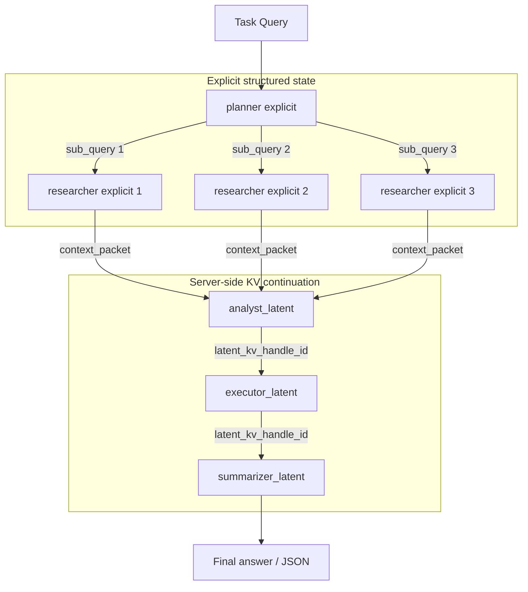
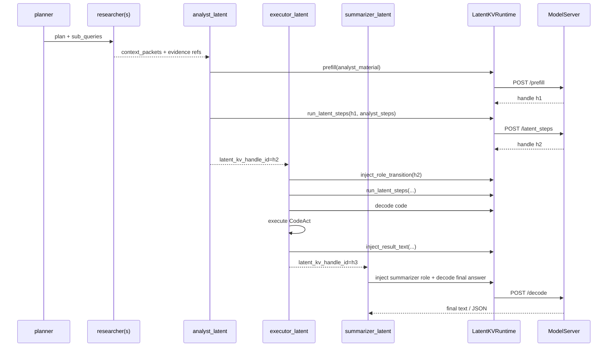

# KV Latent 详细设计说明

生成时间：2026-07-08

本文档说明本仓库中 `kv_latent` / `D_latent_kv` 路径的设计。它面向 PPT、实验报告和代码维护，重点解释主要思路、系统边界、运行流程、实现细节、设计优势、当前限制和后续演进方向。

相关文件：

| 文件 | 作用 |
|---|---|
| `src/graph.py` | 定义 A/B/D 图拓扑，`build_latent_kv_graph()` 是 D 模式入口 |
| `src/agent/latent_kv_agents.py` | D 模式 planner/researcher wrapper、analyst/executor/summarizer latent agent |
| `src/latent_kv_runtime.py` | Agent 侧 runtime facade，封装 prefill、latent steps、inject、decode、delete |
| `src/latent_kv_model_server.py` | 模型服务，加载 Qwen3-8B 并在 GPU 上保存真实 KV tensors |
| `docs/openos/notext_state_transfer/kv_latent/D_latent_kv_design.md` | 当前 D 模式拓扑说明 |
| `docs/openos/notext_state_transfer/kv_latent/exp/` | A/B/D 实验记录和 PPT 材料 |

## 1. 核心问题

多 Agent 系统里，传统文本 handoff 通常是：

```text
Agent A 内部推理 -> 解码成长文本 -> Agent B 重新 tokenize/prefill -> Agent B 继续推理
```

这会带来三个问题：

1. **重复编解码**：上游内部状态先被压缩成自然语言，下游再把自然语言读回模型。
2. **显式文本膨胀**：analyst 的长因果分析、executor 的长计算过程、summarizer 的摘要草稿容易在 Agent 间反复传递。
3. **状态损失**：自然语言只能保留模型内部状态的一部分；一些隐含约束、候选分支、注意力上下文会在文本化时丢失或变形。

`kv_latent` 的目标是验证另一种状态传递方式：

```text
Agent A 产生的模型 KV 状态 -> 传递轻量 handle -> Agent B 在同一 KV 链上继续推理
```

这里传递的不是完整 tensor 本身，而是一个 `latent_kv_handle_id`。真实 KV cache 保留在模型服务进程的 GPU 内存中。

## 2. 总体思路

D 模式不是把整个系统都变成黑盒 latent 状态。当前设计采用混合式分层：

```text
显式结构化区：
planner -> researcher(s)

Latent KV 区：
analyst_latent -> executor_latent -> summarizer_latent
```

### 2.1 为什么前半段保持显式

planner 和 researcher 阶段承担任务拆解和证据采集，必须可检查、可审计：

- planner 输出 `plan` 和 `sub_queries`，用于明确任务分解。
- researcher 输出 `context_packets`、`document_refs`、`evidence_spans`，用于保留证据来源。
- context packet 带 `doc_key`、offset、hash 和 `full_doc_ref`，可以回 Store 校验。

如果从 planner/researcher 就完全 latent 化，会立刻遇到并行 KV fork/merge 问题：3 个 researcher 分支各自生成 KV 后，如何无损合并成 analyst 的一个 KV 上下文并不简单。因此当前 D 模式选择在 researcher fan-in 之后，从 analyst 开始进入 latent KV。

### 2.2 为什么后半段使用 latent KV

analyst、executor、summarizer 是长中间状态最重的链路：

- analyst 需要综合多个 context packet，形成长因果分析、候选答案和约束排序。
- executor 需要继承 analyst 的分析，生成 CodeAct 或计算验证，并把执行结果再注入推理链。
- summarizer 需要继承前面所有判断，只解码最终 JSON 或最终答案。

这些内容如果都以自然语言传给下游，会产生大量显式文本通信和重复 prefill。D 模式让 analyst 之后的推理保持在 server-side KV chain 中，下游只继承 handle。

## 3. 当前业务拓扑

当前 D 模式拓扑：

```text
planner_explicit_for_latent
  -> researcher_explicit_for_latent x N
  -> analyst_latent
  -> executor_latent
  -> summarizer_latent
```

图形化表示：



A/B/D 对比口径：

| 模式 | Agent 拓扑 | Agent 间状态 |
|---|---|---|
| A_text | planner -> researcher(s) -> analyst -> executor -> summarizer | 自然语言文本 |
| B_structured | planner -> researcher(s) -> analyst -> executor -> summarizer | AgentMessage + context packet + Store refs + embedding |
| D_latent_kv | planner -> researcher(s) -> analyst_latent -> executor_latent -> summarizer_latent | 前半段结构化文本，后半段 KV handle |

## 4. Control Plane 与 Data Plane

KV Latent 的关键分层是 control plane / data plane 分离。

| 平面 | 内容 | 存放位置 | 是否进入 LangGraph state |
|---|---|---|---|
| Control plane | `latent_kv_handle_id`、`seq_len`、`kv_bytes`、agent name、父 handle id、少量 digest | Python 进程 / LangGraph state | 是 |
| Data plane | `past_key_values`、`last_hidden`、模型内部 KV tensors | `latent_kv_model_server` GPU 内存 | 否 |

LangGraph state 里只传：

```json
{
  "latent_kv_handle_id": "lkv_task_xxx_analyst_ab12cd",
  "analysis_digest": "[Delta KV analyst: 64 latent steps, 700000 KB]",
  "execution_summary": "ok=True; latent_kv_mode"
}
```

真实 KV tensor 留在 server：

```text
handle_id
  -> past_key_values[layer][key/value]
  -> last_hidden
  -> seq_len
  -> kv_bytes
  -> parent_handle_id
```

这个设计避免把大 tensor 复制进 Python graph state，也避免跨 Agent 复制 GPU tensor。

## 5. 核心对象：LatentKVHandle

Agent 侧的 `LatentKVHandle` 是一个可序列化代理，不包含真实 tensor：

```text
handle_id: str
seq_len: int
latent_steps_added: int
kv_bytes: int
agent: str
parent_handle_id: str | None
created_at: float
mode: "prefill" | "latent" | "decode" | "inject" | "sim"
```

字段含义：

| 字段 | 说明 |
|---|---|
| `handle_id` | server-side KV 状态的引用 ID |
| `seq_len` | 当前 KV chain 的序列长度 |
| `latent_steps_added` | 本次操作追加的 latent step 数 |
| `kv_bytes` | 当前 handle 估算 KV 占用 |
| `agent` | 创建或推进该 handle 的 Agent |
| `parent_handle_id` | 父 handle，用于追踪链路 |
| `mode` | handle 由 prefill、latent step、token injection 还是 decode 产生 |

注意：handle 是引用，不是数据本体。删除 handle 时需要通知 server 释放 GPU KV。

## 6. 模型服务设计

`latent_kv_model_server.py` 是真实 KV data plane。它在启动时加载模型，并保存 KV store：

```text
_kv_store: handle_id -> {
  past_key_values,
  last_hidden,
  seq_len,
  latent_steps_added,
  kv_bytes,
  agent,
  parent_handle_id,
  created_at,
  mode
}
```

### 6.1 HTTP API

| API | 请求 | 作用 |
|---|---|---|
| `GET /health` | 无 | 检查模型是否加载、handle 数、GPU free memory |
| `POST /prefill` | `{text, task_group, created_by}` | 对显式文本做 prefill，创建初始 KV handle |
| `POST /latent_steps` | `{handle_id, n_steps, agent_name}` | 从已有 handle 继续跑 N 个 latent step |
| `POST /inject_tokens` | `{handle_id, text}` | 把角色切换、工具结果或少量显式文本追加进 KV chain |
| `POST /decode` | `{handle_id, prompt, max_new_tokens, temperature}` | 从 KV 状态解码小段显式输出 |
| `GET /handle/{id}` | handle id | 查看 handle 元数据 |
| `DELETE /handle/{id}` | handle id | 删除 handle 并释放 GPU tensor |
| `GET /handles` | 无 | 列出当前 server-side handles |

### 6.2 Latent step 是什么

普通解码流程是：

```text
hidden_state -> LM head -> token id -> embedding lookup -> next forward
```

当前 latent step 流程是：

```text
last_hidden -> latent_aligner -> next_input_embedding -> forward with past_key_values
```

也就是绕过 LM head 和离散 token 采样，直接把上一步 hidden state 对齐成下一步 input embedding。

当前实现的 aligner 是 `normalized_identity`：

```text
next_embed = normalize(last_hidden) * average_embedding_norm
```

它没有训练参数，优点是实现简单、可直接跑真实 forward；限制是它不一定是最佳 latent transition，质量可能不如训练过的 projector/adapter。

### 6.3 KV 大小估算

KV 占用按当前模型配置估算：

```text
kv_bytes = 2 * num_layers * num_kv_heads * head_dim * dtype_bytes * seq_len
```

其中 `2` 表示 key/value 两份缓存。`seq_len` 会随着 prefill token、latent step、injected token 和 decoded token 增长。

## 7. Runtime Facade 设计

`LatentKVRuntime` 是 Agent 侧入口。Agent 不直接调用 HTTP API，而是通过 runtime：

```text
prefill(prefix_text, task_group, created_by)
run_latent_steps(handle_id, n_steps, agent_name)
inject_role_transition(handle_id, role_text)
inject_result_text(handle_id, result_text)
decode_text(handle_id, instruction, max_tokens, temperature)
generate_code(handle_id, max_tokens)
generate_summary(handle_id, instruction, max_tokens)
delete_handle(handle_id)
```

Runtime 有两个 backend：

| Backend | 作用 |
|---|---|
| `RealLatentKVBackend` | 调用 `latent_kv_model_server`，使用真实 GPU KV tensors |
| `SimLatentKVBackend` | fallback simulation，不依赖模型服务，主要用于接口兼容和 smoke |

Runtime 会自动检测 `/health`，可用则走真实 server，不可用则 fallback 到 sim。实验报告中要区分 backend，否则 sim 结果不能作为真实 KV 结论。

## 8. Agent 生命周期

### 8.1 planner_explicit_for_latent

planner 保持显式输出：

```json
{
  "plan": "concise plan",
  "sub_queries": ["focused sub-query 1", "focused sub-query 2", "focused sub-query 3"]
}
```

它的作用是让任务拆解可检查，并控制 researcher fan-out 的范围。`RESEARCHER_FANOUT` 默认是 3，可通过环境变量调整。

### 8.2 researcher_explicit_for_latent

每个 researcher 处理一个 sub-query，输出：

```json
{
  "context_packets": [...],
  "document_payloads": [...],
  "research_evidence": [...],
  "messages": ["AgentMessage(research)"]
}
```

这些输出通过 LangGraph reducer fan-in 给 analyst。当前 researcher 不创建 KV handle，这是为了避免多个并行 KV 分支的 merge 问题。

### 8.3 analyst_latent

analyst 将显式材料合成一次 analyst material：

```text
Task
Planner plan
Sub queries
Selected context packets
Document refs
Analyst contract
```

然后：

```text
prefill(analyst_material)
run_latent_steps(ANALYST_LATENT_STEPS, "analyst")
return latent_kv_handle_id
```

输出给下游的是 handle 和少量 digest，而不是完整 analysis 文本：

```json
{
  "latent_kv_handle_id": "...",
  "analysis": "",
  "analysis_digest": "[Delta KV analyst: 64 latent steps, ... KB]"
}
```

### 8.4 executor_latent

executor 继承 analyst handle：

```text
inject_role_transition("<|agent_executor|>")
run_latent_steps(EXECUTOR_LATENT_STEPS, "executor")
decode compact CodeAct snippet
execute sandboxed code
inject execution_result JSON
run_latent_steps(POST_EXEC_LATENT_STEPS, "executor_post")
```

这里有两个关键点：

- executor 不需要接收 analyst 的长文本分析。
- 工具执行结果会通过 `inject_result_text()` 回写进 KV chain，让 summarizer 能继承工具结果。

### 8.5 summarizer_latent

summarizer 继承 executor handle：

```text
inject_role_transition("<|agent_summarizer|>")
run_latent_steps(SUMMARIZER_LATENT_STEPS)
decode final JSON / final answer
```

如果任务指定 JSON contract，summarizer 应只输出该 JSON。后处理会尝试用统一 JSON contract cleanup 抽取字段。

## 9. 状态传递时序



## 10. 设计优势

### 10.1 减少显式文本通信

D 模式后半段不再传完整 analysis / execution rationale，而是传 handle。实验中常见指标是：

- `Agent消息/轮` 下降。
- `text_comm_chars` 下降。
- `context_packets` 仍保留证据可追踪性。

注意：LLM usage 的 `input_tokens` 不一定下降，因为 latent decode 时会按继承 KV 的序列长度记账。显式文本通信减少和 LLM 记账 token 减少不是同一个指标。

### 10.2 避免重复 prefill

文本 handoff 下，executor 需要重新读取 analyst 的长分析；summarizer 需要重新读取 analyst/executor 的长输出。D 模式让下游在上游 KV chain 上继续 forward，避免把这些中间状态再次 tokenize/prefill。

### 10.3 更接近模型内部状态流

自然语言 handoff 是对模型内部状态的有损投影。KV continuation 保留了 attention cache 和序列上下文，使下游 Agent 能在上游推理轨迹上继续工作。

### 10.4 保留审计能力

D 模式不是纯黑盒：

- planner 输出显式 plan/sub_queries。
- researcher 输出 context packet、evidence refs、doc hash。
- executor 的 CodeAct 结果可以显式落盘。
- summarizer 的 final JSON 可精确评测。

因此它比“完全不解码中间状态”的方案更容易审计和 debug。

### 10.5 与 LangGraph 兼容

LangGraph 只看到普通 dict state：

```text
plan, sub_queries, context_packets, latent_kv_handle_id, final_answer
```

不需要让 LangGraph 理解 GPU tensor，也不需要在 reducer 里合并 tensor。模型状态管理被隔离到 runtime/server。

### 10.6 工程上可控

server-side handle 带有：

- `seq_len`
- `kv_bytes`
- `agent`
- `parent_handle_id`
- `mode`

这些元数据可用于指标统计、显存管理、调试和清理。

## 11. 指标与实验口径

D 模式至少需要同时看三类指标：

| 指标类型 | 例子 | 解释 |
|---|---|---|
| 速度指标 | `wall_time_s`、平均耗时、D vs B speedup | 端到端是否更快 |
| 显式通信指标 | `message_count`、`text_comm_chars`、`text_comm_tokens_est` | Agent 间文本搬运是否减少 |
| KV 指标 | `latent_steps`、`kv_bytes_transfer`、`kv_mb` | D 模式引入多少非文本状态 |
| LLM usage | `input_tokens`、`output_tokens`、`llm_calls` | 模型服务记账口径，不等价于显式通信 |
| 质量指标 | 字段命中、完全正确、route/cost correctness | 不能只看速度，必须看最终答案质量 |

常见结论表述应避免混淆：

- 可以说“D 减少了显式 Agent 文本通信”。
- 不能仅凭 `input_tokens` 说“D token 一定更少”，因为 inherited KV seq_len 可能被计入 usage。
- 可以说“D 引入了 server-side KV 状态传递”，但不能说“完全没有文本”：planner/researcher、role injection、final decode 仍有文本。

## 12. 适用场景

更适合 KV Latent 的任务：

- 多 Agent 串行链路较长。
- analyst/executor 中间推理很长，但最终答案很短。
- 上游证据需要保留，但下游不一定需要完整自然语言再读一遍。
- 任务有明确 final schema，可以客观评测质量。
- 计算/处置/因果链条需要连续继承状态。

不太适合的任务：

- 单轮短问答，文本 handoff 已经很小。
- 每一步都必须给人读完整自然语言解释。
- 需要并行 latent branches 后无损 merge。
- 没有模型 server/GPU 资源或显存不足。

## 13. 当前限制

### 13.1 researcher 仍是显式 structured

当前 D 模式从 analyst 开始 latent。它规避了 researcher 多分支 KV merge，但也意味着 researcher 长证据仍然需要显式生成和压缩。

理想拓扑可能是：

```text
planner_text -> researcher_latent -> analyst_latent -> executor_latent -> summarizer_decode
```

但这需要解决多 researcher KV fork/merge 或改成顺序 researcher chain。

### 13.2 latent aligner 未训练

当前 `normalized_identity` aligner 简单可靠，但不是针对任务训练的 latent transition。质量上限可能受限。

后续可以考虑：

- learnable projection layer
- adapter/LoRA aligner
- 对比学习训练 hidden-to-embedding transition
- 按 Agent role 使用不同 aligner

### 13.3 handle 生命周期需要严格管理

KV handle 占用 GPU 显存。实验结束或每轮结束后需要清理：

```text
DELETE /handle/{id}
```

否则长实验会因为 handle 堆积造成显存压力。server 当前有 `LATENT_KV_MAX_HANDLES` 的简单 FIFO eviction，但实验脚本仍应主动清理。

### 13.4 不是跨进程持久状态

当前 KV data plane 存在模型服务进程内存里：

- server 重启后 handle 失效。
- handle 不能跨不同模型实例复用。
- handle 依赖同一 tokenizer、模型权重、dtype 和位置编码上下文。

### 13.5 安全与隔离

handle id 是访问 server-side KV 的能力凭证。多租户场景需要：

- task_group 级隔离
- handle ACL
- TTL
- audit log
- explicit delete

当前实验环境主要是单用户 research runner，尚未做完整权限模型。

### 13.6 质量仍需 final contract 约束

KV continuation 可能改善中间状态传递，但不能自动保证最终 JSON 精确正确。实验里仍需要：

- JSON schema prompt
- cleanup/parser
- CodeAct 验证
- reference answer 对比
- round-level error analysis

## 14. 设计取舍

| 取舍 | 当前选择 | 原因 |
|---|---|---|
| 从哪一段开始 latent | analyst 开始 | 避免 researcher 并行 KV merge |
| 是否完全无文本 | 否 | planner/researcher 可审计，final answer 必须解码 |
| KV 是否进入 LangGraph state | 否 | 避免大 tensor 复制和序列化 |
| latent step aligner | normalized identity | 无训练即可运行真实 forward |
| executor 是否还做 CodeAct | 是 | 保留可验证计算和工具执行 |
| final output | summarizer decode | 最终结果必须可读、可评测 |

## 15. 后续演进方向

### 15.1 Full-chain latent

把 researcher 也纳入 latent chain：

```text
planner_explicit -> researchers_latent sequential -> analyst_latent -> executor_latent -> summarizer_latent
```

这可以避免并行 KV merge，代价是 researcher 不再并行，延迟可能增加。

### 15.2 KV branch merge

探索多个 researcher latent branch 的合并方式：

- 显式 decode compact evidence 后再 prefill analyst。
- 对多个 branch 的 final hidden states 做 learned merge。
- 使用 cross-attention memory bank，而不是直接拼接 KV。
- 让 analyst 依次 inject 每个 branch 的 distilled latent summary。

这是更难但更接近多 Agent 并行 latent collaboration 的方向。

### 15.3 更强的 latent aligner

训练或调参 hidden-to-embedding aligner，降低 latent steps 的语义漂移。

可能指标：

- final answer accuracy
- decode payload parse success
- latent step count vs quality
- KV size vs speed

### 15.4 更完整的 observability

建议补充：

- 每个 handle 的 parent chain 可视化。
- 每个 Agent 的 prefill / latent / inject / decode 耗时。
- KV bytes 增长曲线。
- handle delete / eviction 事件。
- real vs sim backend 标记进入实验结果。

### 15.5 更严格的 fair comparison

A/B/D 对比要保持：

- 相同模型
- 相同任务
- 相同 runner
- 相同 final schema
- 相同 researcher fanout
- 同样是否启用 CodeAct
- 清理跨轮 KV/Memory 残留

否则速度或质量差异可能来自运行条件，而不是状态传递机制。

## 16. 一句话总结

KV Latent 的核心设计是：**把多 Agent 后半段长中间推理从“显式自然语言文本传递”改为“server-side KV continuation + lightweight handle 传递”，同时保留 planner/researcher 的显式结构化证据链，以获得可审计性、较低显式通信开销和更接近模型内部状态流的协作方式。**

