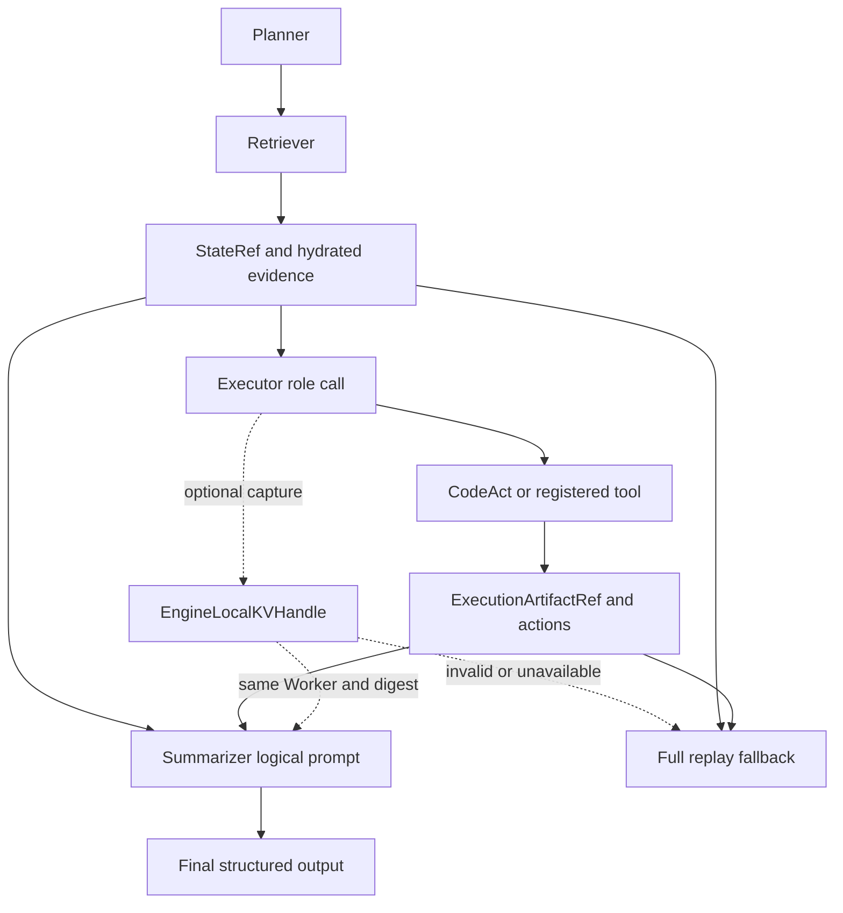

# Engine-Local KV 主链集成与结果导向实验计划

更新时间：2026-07-30

## 1. 当前基线已经保存

本计划以两个已固定的 Git 基点为准：

- 独立 KV mechanism probe：`fbb6377 feat: add engine-local KV continuation probe`
- 主链集成分支：`feat/engine-local-kv-mainline-integration`
- 主链基线：`contest/recovery-core@ac6ec86`
- KV 移植提交：`eb61446 feat: add engine-local KV continuation probe`
- 集成 worktree：`/home/qcrs/statebus/work/engine-local-kv-mainline-integration`

`eb61446` 已保留 `contest/recovery-core` 相对旧 v2 基线的 40 个提交，并完成 KV probe
代码移植。移植后专项测试为 `19 passed`。

当前 `/home/qcrs/statebus/project` 中尚未提交的 prefix/logit/studio 等用户改动不属于本分支，
也没有被覆盖、暂存或提交。第一轮主链集成以已提交主链为准，最后再做兼容回放。

## 2. 最终要形成的叙事

最终不把独立 probe 描述成已经接入 StateBus，而是形成两层递进证据：

1. Engine 机制证据：在同一 Qwen3-32B Worker 内，显式保存和恢复真实 paged KV，
   Consumer 只 forward suffix，证明 KV continuation 本身成立。
2. StateBus 系统证据：Planner、Retriever、Executor、CodeAct、Summarizer 和正式引用链均保留，
   只在一条满足条件的 LLM 角色边增加 engine-local KV sideband，证明它能在完整主链中工作。

对外一句话：

> StateBus 继续通过 typed control、StateRef 和 ExecutionArtifactRef 传递可审计、可重放的
> 语义状态；当两个相邻角色命中同一个长 position-0 上下文且位于同一模型 Worker 时，
> Runtime 额外传递一个短生命周期 KV handle，使下游角色不再重复 prefill 这段上下文。

这条叙事明确区分：

- correctness plane：Protobuf、StateRef、ExecutionArtifactRef、结构化角色输出；
- acceleration sideband：EngineLocalKVHandle；
- handle 失效：用 correctness plane 重新构造完整 prompt；
- handle 成功：逻辑 prompt 不变，只减少模型实际重算。

## 3. 第一轮范围

第一轮只接一条线性边：

```text
Planner -> Retriever -> Executor role call -> CodeAct/tool -> Summarizer
                              |                         ^
                              +-- EngineLocalKVHandle --+
```

具体含义：

- Executor 角色调用仍正常生成 route/tool/action contract，同时捕获其长共享证据前缀 KV；
- CodeAct/tool 继续生成 ExecutionArtifactRef 和结构化执行结果；
- Summarizer 的 suffix 包含 artifact、actions、summary contract；
- Summarizer 通过 handle 恢复共享证据 KV，只计算新的角色 suffix；
- StateRef、ExecutionArtifactRef、Memory、任务 workspace 和输出合同均不删除。

第一轮明确不做：

- 不跑 APC/prefix 对比实验，所有正式 KV lane 均关闭 APC；
- 不做跨 Worker、跨模型、跨 engine generation；
- 不做 TP/PP 大于 1；
- 不做一对多 fan-out；
- 不做并发吞吐优化；
- 不把 handle 持久化到 CAS、MemoryProxy 或 replay ledger；
- 不把 EngineLocalKVHandle 伪装成 StateRef 或 ExecutionArtifactRef；
- 不使用物理卡 0。

## 4. 为什么选择 Executor 到 Summarizer

主链在 Executor 角色调用之后仍会执行真实 CodeAct/tool，并形成 artifact。Summarizer 既需要此前的
长证据，也需要新增 artifact 和 actions。这正好构成：

```text
共享 parent：hydrated evidence + table evidence
Producer suffix：Executor role/tool selection contract
Consumer suffix：artifact + actions + summary contract
```

该边比“为了测 KV 人工重复同一个请求”更符合多 Agent 状态交接，同时又保持一对一、短 TTL、
同 Worker，适合当前 one-shot handle。

若某个任务的 Executor 与 Summarizer 共享 parent token digest 不一致，该任务直接判定 KV
不适用；生产模式走普通请求，正式 B lane 则 fail closed，不把 fallback 记成 KV 成功。

## 5. 目标架构



Handle 只存在于一次 `run_smoke`/task session 的内存上下文。当前角色调用都由同一个 Runtime
进程调度，所以第一轮无需把 raw KV 或 handle 塞入正式 UDS Protobuf。后续若角色调度跨进程，
只增加 typed handle metadata，KV tensor 仍留在 Worker。

## 6. 三通道对比

主链实验使用三个 lane，且三者的任务、模型、逻辑 prompt token IDs、输出合同和生成参数一致。

### N：普通主链

- 完整 Planner -> Retriever -> Executor -> CodeAct -> Summarizer；
- Executor/Summarizer 使用普通 `/v1/chat/completions`；
- 提交完整 prompt；
- APC 关闭；
- 用作当前普通模型通道基线。

### A：KV adapter full replay

- 完整 StateBus 主链不变；
- Executor/Summarizer 经 KV-aware role client 调私有 API；
- Consumer 仍提交和计算 `parent + suffix`；
- 不创建或加载 handle；
- 用于测量 private adapter、tokenization 和 SSE 本身是否改变语义或时间。

### B：显式 KV continuation

- Executor `/produce` 捕获 parent KV；
- Summarizer `/continue` 只提交 handle + suffix；
- engine 内恢复完整逻辑 token IDs；
- scheduler 标记 parent 为 inherited；
- Worker 注入 parent KV，只 forward suffix；
- 结束后显式 release。

三个比较关系：

```text
N vs A：接口适配成本和语义等价性
A vs B：在完整主链内隔离显式 KV 的机制收益
N vs B：相对当前普通链路的最终净收益
```

## 7. 最快实施顺序

### P0：保存与移植，已完成

- [x] probe 独立提交 `fbb6377`
- [x] 从 `contest/recovery-core@ac6ec86` 建集成 worktree
- [x] 移植为 `eb61446`
- [x] KV 专项测试 `19 passed`

### P1：把 prompt 变成可验证的 parent/suffix 合同

修改重点：`v2/runtime/role_path.py`。

1. `RolePromptSlice` 增加稳定 parent 选择：第一轮只取 hydrated text 和 table text，排除
   artifact、actions、memory delta。
2. `compile_prefix_layout` 明确返回：
   - 完整 logical prompt；
   - position-0 shared parent 文本；
   - role suffix 文本；
   - 两者 digest/bytes。
3. 当完整 evidence 为 `parent + delta` 时，只把 delta 留在 suffix，保证 parent 不重复出现。
4. Executor 和 Summarizer 在调用前记录 shared parent digest；不一致则不允许 B lane。
5. prefix layout 只作为 token 对齐手段，APC 保持关闭，不把它作为实验变量。

通过条件：

- Executor/Summarizer parent text digest 一致；
- shared parent 在完整 prompt 中只出现一次；
- artifact/actions 只在 Summarizer suffix；
- 现有 prefix control-plane tests 和角色 prompt tests 全部通过。

### P2：补齐 chat-template 精确 tokenization

修改重点：`v2/integrations/vllm_kv/tokenizer_client.py`。

1. 新增 chat messages tokenization，使用服务端同一 Qwen tokenizer/chat template；
2. 固定 `add_generation_prompt=true` 和 `enable_thinking=false`；
3. 对 Executor 完整 chat prompt 生成 token IDs；
4. 用共同 position-0 token prefix 向下取整到 vLLM block size；
5. Summarizer tokenization 后验证前 `parent_len` token IDs 与 handle digest 完全一致；
6. 记录 raw prompt hash、chat-token digest、parent/suffix token count。

不能使用“分别 tokenize parent 文本和 suffix 文本再拼接”，因为 BPE 边界和 chat template 可能使
拼接 token IDs 不等于完整请求。必须以完整 chat prompt tokenization 为真源，再按已验证边界切分。

通过条件：N/A/B 的完整 logical token digest 一致，parent 长度 block-aligned。

### P3：增加 Runtime task-local KV coordinator

新增建议文件：

- `v2/runtime/engine_local_kv.py`
- `v2/integrations/vllm_kv/role_client.py`

核心对象：

```text
EngineLocalKVMode = off | full_replay | continuation
EngineLocalKVTaskSession
EngineLocalKVRoleClient
EngineLocalKVRuntimeAudit
```

职责：

1. 只拦截配置的 Producer/Consumer role，其他 LLM 调用原样委托；
2. Producer 成功后保存一个 task-local handle；
3. 新 Producer attempt 出现时先 release 旧 handle；
4. Consumer 首次 attempt 使用 handle；
5. handle 已消费后的 JSON retry 走 full replay，且 audit 标明 fallback；
6. `finally` 始终 release；
7. feature flag 默认 `off`；
8. `describe/describe_role` 继续透传，避免破坏现有 rendered-request audit。

环境变量建议：

```text
STATEBUS_ENGINE_LOCAL_KV_MODE=off|full_replay|continuation
STATEBUS_ENGINE_LOCAL_KV_PRODUCER_ROLE=executor
STATEBUS_ENGINE_LOCAL_KV_CONSUMER_ROLE=summarizer
STATEBUS_ENGINE_LOCAL_KV_MIN_PARENT_TOKENS=2048
STATEBUS_ENGINE_LOCAL_KV_STRICT_BENCHMARK=true|false
```

### P4：保持普通 LLM 生成合同

当前私有 KV API 只有 temperature、max_tokens 和 seed。主链还依赖 JSON schema、
`enable_thinking=false`，Executor 还可能依赖 logprobs。

第一轮至少补齐：

- response JSON schema/structured output；
- stop/temperature/max_tokens/seed；
- `enable_thinking=false` 的等价 chat-template 行为；
- usage token accounting；
- model ID；
- Executor top logprobs，或者在正式任务中明确关闭依赖 logit state 的 lane，并保证 N/A/B
  使用相同配置。

优先级：先保证 N/A 输出 token 一致，再进入 B。若 N/A 不一致，不允许生成主链 KV headline。

### P5：接入 `v2.runtime.smoke`

修改重点：`v2/runtime/smoke.py`。

1. 创建每任务独立 KV session；
2. 包装现有 `RoleDispatchLLMClient`，不修改 Planner/Retriever/CodeAct/StateRef 主逻辑；
3. 在 task `finally` 释放 handle；
4. 写入 `logs/engine_local_kv.json`；
5. 将以下值加入 runtime stage metrics：
   - `kv_eligible`
   - `kv_capture_count`
   - `kv_load_count`
   - `kv_release_count`
   - `kv_fallback_count`
   - `kv_store_ms`
   - `kv_load_ms`
   - `kv_inherited_tokens`
   - `kv_computed_prefill_tokens`
   - `kv_consumer_ttft_ms`
   - `kv_consumer_wall_ms`
   - `kv_request_bytes`
6. 保留既有 StateRef、Artifact、hydration、memory、CodeAct 和质量 telemetry。

### P6：测试顺序

先写测试，再开 GPU 服务：

1. prompt parent/delta 去重；
2. chat-template token roundtrip；
3. block-aligned split 与 digest；
4. off 模式完全委托原 LLM client；
5. full-replay lane 不创建 handle；
6. continuation lane produce -> continue -> release；
7. handle 不匹配时生产 fallback、benchmark fail closed；
8. malformed JSON retry 不二次消费 handle；
9. Runtime 正常/异常退出均释放；
10. StateRef/ExecutionArtifactRef 输出不因 KV lane 改变。

最低回归集合：

```text
tests/v2/neural/
tests/v2/test_kv_prefix_control_plane.py
tests/v2/test_smoke.py
tests/v2/test_fixed_answer_and_external_baseline.py
```

## 8. 任务与实验节奏

不重新训练模型，不运行原 prefix 实验。任务使用仓库内离线财报/运营指标材料，构造完整
Planner -> Retriever -> Executor -> CodeAct -> Summarizer 主链。

### 第一枪：4k 单任务

只跑 1 个 4k parent 的 N/A/B microprobe：

- 先验证主链可完成；
- 再验证 N/A logical digest 和输出；
- 最后验证 B inherited/computed proof；
- 任何机制 proof 不完整，先修复，不扩任务。

### 小轮正式任务

通过 4k 后扩成：

| 档位 | shared parent | Consumer suffix 目标 | 目的 |
| --- | ---: | ---: | --- |
| 2k | 2048 token | 约 192 到 320 | break-even 下界 |
| 4k | 4096 token | 约 192 到 320 | 稳定主结果 |
| 6k | 6144 token | 约 192 到 320 | 长上下文 headline |

每档先 warmup 1 次，再正式 repeat 3。N 作为接口兼容控制可先 repeat 1；A/B 使用固定交错顺序，
至少 repeat 3 取 p50。全部请求串行，不能把并发结果用于正式 timing。

服务仍使用 Qwen3-32B、物理卡 1、APC 关闭。模型服务需要 maintenance window 加载 custom
connector；不得占用或改动物理卡 0。

## 9. 指标与成功标准

### 机制成功

B lane 必须同时满足：

```text
inherited_kv_tokens = block-aligned parent tokens > 0
computed_prefill_tokens = suffix tokens
logical_prompt_tokens = inherited + computed
connector_load_count = 1
layer_count = 64
worker proof = scheduler proof
handle released
fallback_count = 0 in formal B
```

### 语义成功

- N/A/B logical token digest 一致；
- N/A 输出 token 一致，或至少固定合同字段和质量完全一致；
- A/B 首 token、完整输出 token、质量一致；
- Planner/Retriever/Executor/CodeAct/Summarizer 均真实执行；
- StateRef、ExecutionArtifactRef、artifact hash 和最终质量门不退化。

### 性能成功

按结果导向排序：

1. B 相对 A 的 computed prefill token 至少下降 70%；
2. B 相对 A 的 Summarizer TTFT 或 role latency 至少下降 20%；
3. B 相对 N 的 Consumer request bytes 明显下降；
4. 完整 StateBus task wall time 只要求如实记录，出现正收益即可作为补充，不要求与 TTFT 同比例；
5. 同时记录 store/load，不能只展示下游 TTFT 而隐藏 capture 成本。

如果完整 task wall time没有下降，但 TTFT/computed token 显著下降，结论写成“下游角色启动加速和
重复 prefill 消除”；不能写成“完整系统吞吐提升”。

## 10. 失败时怎么收缩

### N/A 输出不一致

先检查 chat template、JSON schema、thinking、stop 和 logprobs，不进入 B 正式实验。

### Executor/Summarizer parent 不一致

先限制到 shared hydrated/table evidence，artifact/actions 全部进入 suffix；仍不一致则换用同一
hydration surface 的任务，不通过字符串猜测强行复用。

### B computed token 没下降

检查 scheduler external token accounting、connector metadata 和 block boundary。禁止把只返回
handle 但仍 full replay 的结果记成成功。

### TTFT 降、完整 task 不降

保留结果，拆分说明 store、load、CodeAct、decode 和其他角色成本；下一轮再尝试 pinned host、
GPU-resident lease 或一对多摊销，不在第一轮提前扩实现。

### 主链改动影响现有功能

feature flag 默认 off；off 模式必须与 `ac6ec86` 行为一致。集成失败时可回到 `eb61446`，
KV probe 和正式证据不受影响。

## 11. 最终报告结构

最终新报告按以下顺序写：

1. 为什么普通 StateBus 仍会在角色间重复 prefill 长证据；
2. correctness plane 与 acceleration sideband 的边界；
3. 独立 engine probe 证明了什么；
4. 主链具体接在哪一条角色边；
5. N/A/B 如何保证逻辑 token 和质量公平；
6. computed token、TTFT、Consumer wall、完整 task wall；
7. store/load 和 host memory 成本；
8. 质量、artifact、StateRef 和引用链是否一致；
9. 适用场景与 fallback；
10. 与 APC 的关系：架构互补、当前未联合运行、同一 parent 收益不相加。

最终可用结论模板：

> 在完整 Planner -> Retriever -> Executor -> CodeAct -> Summarizer StateBus 主链中，
> StateRef 和 ExecutionArtifactRef 继续承担语义正确性与重放；Runtime 仅在同一 Qwen3-32B
> Worker 的 Executor-to-Summarizer 线性边上传递短期 KV handle。与主链 full replay 相比，
> 显式 KV continuation 恢复了 X 个 parent token、只重算 Y 个 suffix token，使 Summarizer
> TTFT 从 A 降至 B；包含 Planner、检索、执行、KV store/load、总结和 release 的完整任务时间
> 从 C 变为 D，最终质量和 artifact hash 保持一致。

## 12. 执行优先级

严格按以下顺序推进：

1. parent/suffix prompt 合同；
2. chat-template token 等价；
3. task-local coordinator；
4. 4k N/A/B 单任务；
5. 2k/4k/6k repeat-3；
6. 完整报告；
7. 最后才考虑 Protobuf handle metadata、并发、fan-out、pinned host 或 APC 联合策略。

这条顺序优先拿到一组可复述、可审计的主链结果，不把第一轮时间消耗在生产级泛化上。
