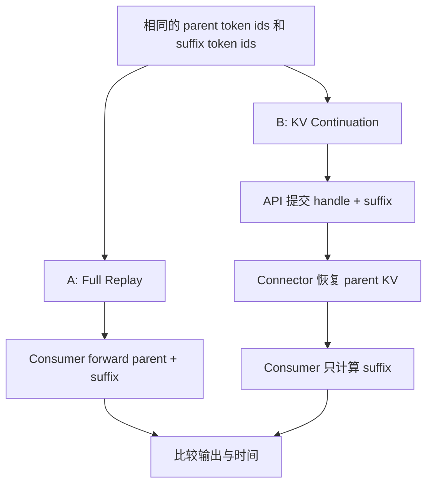

# StateBus Engine-Local KV Continuation 结果导向实现与实验计划

日期：2026-07-29
状态：已执行；正式实验、证据审计和原 latent 服务恢复均完成
目标分支：`feat/engine-local-kv-result-probe`
建议基线：`feat/statebus-v2-container-runtime@cc34e5c`
实验模型：卡 1 既有 `/data/models/Qwen3-32B` vLLM，served model `qwen3-32b`，BF16，单卡
调用环境：`statebus-dev-qcrs` 容器通过 host network 调用 `http://127.0.0.1:53334`

执行结果报告：[`engine_local_kv_continuation_results_20260730.md`](../reports/engine_local_kv_continuation_results_20260730.md)

实际结果 headline：6k Consumer TTFT p50 `2196.691 -> 428.792 ms`，下降 `80.5%`；computed prefill `6395 -> 251`，下降 `96.1%`；完整 chain p50 同时下降 `5.8%`。正式运行使用 `worker_pageable_host`，未使用计划稿中的 pinned-host 假设。

---

## 1. 结论先说

本轮不追求生产级 KV 基础设施，追求一组能够清楚展示收益的真实实验结果。

最终选择如下：

1. 不测试 vLLM Automatic Prefix Caching，也不统计 prefix hit rate。
2. 不做 hidden embedding、latent step、adapter 或重新训练。
3. 使用 Qwen3-32B vLLM 的真实 paged KV cache，不另起 Qwen3-8B 或 Transformers 模型进程。
4. 原始 KV 只在卡 1 的 vLLM worker 内及该 worker 管理的 pinned host buffer 中流转，不进入容器 API payload。
5. StateBus 容器在逻辑 Agent 边上只传递一个短小的 KV handle，并通过私有 API 请求继续生成。
6. 第一轮只做简化 A/B，不做复杂 L0-L3、多后端或严格统计检验。
7. 第一优先结果是下游 Consumer 的 `prefill_ms` 和实际重算 token 数下降。
8. 任务需要新增一组 KV continuation 专用任务，但可复用现有财报素材，不需要推翻当前正式任务集。

2026-07-29 已现场确认：

```text
container=statebus-dev-qcrs
container_network=host
endpoint=http://127.0.0.1:53334
served_model=qwen3-32b
model_path=/data/models/Qwen3-32B
max_model_len=8192
container_to_vllm_api=reachable
```

因此容器不承担 32B 权重和 KV 显存；显存消耗发生在卡 1 的 vLLM。当前服务虽然已经加载 latent worker extension，但它保存的是 hidden embedding，不是 KV block。显式 KV 实验仍需新增 KV connector/API，并在维护窗口重启一次 vLLM 使插件生效。

本路径在项目文档中的规范定位仍是：

> `Experimental Engine-Local Prefix Reuse implemented by explicit KV continuation`

这里的 `Prefix Reuse` 是能力边界名称，不代表本轮测试自动 prefix cache。实验变量是显式 paged-KV handle 是否被下游继续消费。

---

## 2. 本轮要回答的问题

本轮只回答以下三个问题：

1. 容器中的上游 Agent 能否只通过 API/handle，让卡 1 vLLM 中已经计算出的真实 KV 被下游请求继续使用？
2. 当多个 Agent 反复消费同一份长证据时，是否减少下游重复 prefill 的 token 和时间？
3. 这种优化能否在不重新训练、不过度改造 StateBus 主链的条件下形成可展示结果？

本轮不回答：

1. KV 能否跨 GPU、跨 Worker 或跨模型迁移。
2. KV 能否落盘、跨任务恢复或成为长期共享记忆。
3. vLLM block manager 能否被 StateBus 通用接管。
4. 自动 prefix cache 的 schedule、layout 和命中率是否更优。
5. openEuler 环境中的最终兼容性。
6. 生产级多租户安全、鉴权、配额和容灾。

这些内容都不能阻塞第一轮结果。

---

## 3. 为什么不直接沿用已有结果

### 3.1 StateBus 历史分支

| 分支或提交 | 实际内容 | 本轮处理 |
| --- | --- | --- |
| `feat/local-hidden-kv-prototype@d83627d` | KV 转向与就绪分析文档，没有 raw KV 实现 | 不作为代码基础 |
| `feat/local-vllm-kv-prep@167524b` | vLLM 自动 prefix cache、请求排序与 prompt layout | 不进入本轮实验 |
| `feat/native-latent-alignment`，实现检查点 `4bc7812` | hidden embedding 序列、`inputs_embeds` 注入和完整引用合同 | 只借生命周期与兼容校验思想 |
| `feat/kv-prefix-test-chain-integration@18beca` | prefix 测试链集成 | 不进入本轮实验 |

StateBus 历史中没有一组完成的、严格只改变显式 KV continuation 的对照结果。现有卡 1 服务中的 `LatentWorkerExtension`/`LatentHandoffMiddleware` 只能作为“worker RPC + 私有 API + handle 生命周期”的实现模板，不能直接当作 KV 实现。

### 3.2 外部 `kv_latent@f68a592`

外部参考仓库 `/home/qcrs/yzmxdzntxzddkxtxztcdygxjyjz` 已经证明 HuggingFace `past_key_values` 可以保存在模型服务内，并通过 handle 继续 forward。

但是原有实验不能直接作为 KV 收益结论：

| 实验 | B 或 A | D 或 KV | 直接读数 | 为什么不能作为纯 KV 结论 |
| --- | ---: | ---: | --- | --- |
| 数据审计 10 轮 | B `109.0615s` | D `93.5011s` | D 快约 `14.3%` | D 平均 5 次 LLM 调用，B 为 6 次，且 D 混入 latent steps |
| 事故诊断 10 轮 | B `86.3325s` | D `99.9037s` | D 慢约 `15.7%` | D 正确字段 `35/60`，B 为 `38/60` |
| 4-city 10 轮 | B `115.1533s` | D `109.7787s` | D 快约 `4.7%` | B 的解析和结果回退路径失效 |
| SharedStorage 十轮 | text `78.6775s`，structured `70.2694s` | KV `83.9408s` | KV 更慢 | KV 文件和挂载成本进入路径，测试对象不同 |

外部实现还存在以下直接问题：

1. prefill 为获取 hidden state 又重复 forward 一次。
2. decode 结束后把最后一个生成 token 再 forward 一次。
3. `DynamicCache` 可能原地修改，父子 handle 会发生别名污染。
4. 父 handle 没有随着线性消费及时释放。
5. `kv_bytes` 是配置公式估算，不是 tensor 实测值。
6. `copied_bytes=0` 是直接填写，不是观测结果。
7. 没有记录 consumer 实际 forward 了多少 token。
8. Agent 调用次数、工具路径和 prompt 不完全一致。

因此本轮只借用它暴露出的生命周期问题和实验缺口，不复用它的模型后端、业务 Agent 图或历史结果。

---

## 4. 分支与工作区方案

### 4.1 正式选择

从下面的 clean-room 基线创建新分支：

```text
feat/statebus-v2-container-runtime @ cc34e5c
    |
    +-- feat/engine-local-kv-result-probe
```

不在当前 `contest/recovery-core` 工作区直接开发。当前工作区已有大量用户修改和未跟踪文件，KV 实验应放到独立 worktree。

需要注意：`cc34e5c` 不包含当前的 Orion/Nova `kv_prefix_reuse` 素材。这两份报告是在 `2413179` 中加入的。创建实验分支后，只选择性取出以下两个素材文件作为新任务的内容种子，不 cherry-pick 整个 prefix 提交：

```text
2413179:v2/benchmark/samples/continuous_task_families/kv_prefix_reuse/
  orion_factory_ops_report_2026.md
  nova_retail_ops_report_2026.md
```

素材进入新目录后要重新命名和扩展，不能沿用旧 manifest 的自动 prefix-cache 实验语义。

建议执行时使用：

```bash
git worktree add \
  /home/qcrs/statebus/work/engine-local-kv-result-probe \
  -b feat/engine-local-kv-result-probe \
  feat/statebus-v2-container-runtime
```

这条命令只是计划，本文档阶段不执行。

### 4.2 为什么不用 `4bc7812` 做基线

`4bc7812` 一次包含 126 个文件和约 2.9 万行新增内容，主体是 native hidden latent handoff 及同期 remediation。直接基于它改 KV 会带来三个问题：

1. hidden embedding 与 KV cache 的对象语义不同。
2. benchmark 和 middleware 中已经存在 latent 特有字段与 fallback。
3. 很难证明最终结果来自 KV，而不是原有 latent 主链。

正确方式是从 clean base 开始，按需参考以下历史结构：

```text
v2/contracts/neural.py
v2/integrations/vllm_latent/registry.py
v2/integrations/vllm_latent/telemetry.py
tests/v2/neural/test_latent_registry.py
```

不整体 cherry-pick `4bc7812`。

### 4.3 为什么不在外部 `kv_latent` 分支继续

外部仓库只作为参考，原因如下：

1. 它不是 StateBus v2 的包结构和控制面。
2. `f68a592` 同时加入 743 个文件和大量历史产物。
3. 现有代码混合了 latent step、工具兜底和不同 Agent 调用图。
4. 将结果留在外部仓库无法形成 StateBus 自身的实现证据。

---

## 5. 结果优先意味着哪些内容简化

### 5.1 第一轮必须做

1. 使用卡 1 Qwen3-32B vLLM 的真实 paged KV block，并由 connector 执行真实 save/load。
2. A/B 两条路径使用同一个 53334 服务、同一份 task、同一逻辑 token 序列和同一生成参数。
3. 从 vLLM scheduler/connector 记录下游实际计算 token、外部恢复 token和 block 数。
4. 从容器流式 API 记录 TTFT，从 connector 记录 KV store/load 时间；可获取时再记录 engine prefill 时间。
5. 实验服务关闭 Automatic Prefix Caching，避免把 APC 命中当作显式 KV 结果。
6. 每个任务完成后释放 handle 和 pinned host tensor，避免连续运行耗尽主存或显存。
7. connector、handle 或兼容校验失败时直接标记失败，不能静默切换成 full replay 后仍记作 B。

### 5.2 第一轮可以简化

1. handle registry 可以先做成 vLLM worker 内的 Python `dict`，KV value 使用 bounded pinned host tensor。
2. 不要求接入正式 Protobuf schema。
3. 不要求接入 StatePool、CAS、SQLite 或 shared memory。
4. 不要求完整 TTL、LRU、公平配额和多租户鉴权。
5. 不要求跨机器、跨 GPU 或经过 StateBus 容器搬运原始 tensor。
6. 不要求十种负控，只保留一个基本错误 handle smoke test。
7. 不要求 10 个随机种子或显著性检验。
8. 不要求同时提升 token、TTFT、端到端时间、质量和显存。

### 5.3 即使结果优先也不能省略

下面四项如果省略，实验结果会失去含义：

1. A/B 逻辑 token 序列必须一致。
2. A/B LLM 调用次数必须一致。
3. KV 路径必须出现 connector load 证明、`inherited_kv_tokens > 0`，且 scheduler 只计算 suffix；返回一个装饰性 handle 不算实现。
4. 不能用工具或答案回填掩盖模型输出失败。

---

## 6. 最小实现架构

### 6.1 总体流程

```mermaid
flowchart LR
    A[StateBus container: canonical task] --> B[POST /statebus/kv/produce]
    B --> C[Qwen3-32B vLLM prefill]
    C --> D[Connector snapshots paged KV]
    D --> E[EngineLocalKVHandle only]
    E --> F[Container role transition]
    F --> G[POST /statebus/kv/continue: handle + suffix]
    G --> H[Connector restores KV into allocated blocks]
    H --> I[vLLM computes suffix and decodes]
    I --> J[Consumer output and telemetry]
    J --> K[POST /statebus/kv/release]
```



控制面上传递的是 handle。KV tensor 不进入容器、不写入 JSON、不落盘；第一轮允许在同一 vLLM worker 内从 paged GPU blocks 暂存到 pinned host memory，再恢复到新分配的 paged blocks。

### 6.2 A/B 路径



Lane A 和 Lane B 的逻辑序列相同：

```text
logical_consumer_ids = parent_ids + suffix_ids
```

区别只是：

```text
A computed_prefill_tokens = len(parent_ids) + len(suffix_ids)
B computed_prefill_tokens = len(suffix_ids)
```

### 6.3 最小对象

第一轮对象不追求覆盖所有生产字段：

```python
@dataclass
class EngineLocalKVHandle:
    handle_id: str
    engine_id: str
    model_id: str
    tokenizer_digest: str
    task_id: str
    seq_len: int
    token_digest: str
    kv_bytes_actual: int
    block_size: int
    storage_tier: str
    created_at_ns: int
```

模型进程内部 registry entry：

```python
@dataclass
class _KVEntry:
    meta: EngineLocalKVHandle
    layer_tensors: tuple[object, ...]
    token_ids_cpu: list[int]
    consumed: bool = False
```

`token_ids_cpu` 只用于实验一致性检查和 Full Replay 对照，不通过 StateBus 控制面公开。

### 6.4 最小接口

```python
POST /statebus/kv/produce  -> output + EngineLocalKVHandle
POST /statebus/kv/continue -> output + KVDecodeTelemetry
GET  /statebus/kv/health   -> capability/configuration
POST /statebus/kv/release  -> lifecycle result
```

容器内的 `EngineLocalKVClient` 封装这些 HTTP API。middleware 再把请求转换为 vLLM generation request 和 `kv_transfer_params`；StateBus Agent 不直接依赖 vLLM 内部 block ID。

第一轮不需要：

```text
run_latent_steps
inject_hidden_embeddings
export_kv_tensor
import_kv_tensor
persist_kv
clone_handle
branch_handle
```

### 6.5 consume-once 策略

为了避免同一份 KV 被两个请求并发恢复、容量不可控或跨任务误用，第一轮固定线性消费：

```text
parent handle: READY
    -> Consumer 开始
parent handle: CONSUMING
    -> connector 把 KV 恢复到 Consumer 新分配的 blocks
parent handle: CONSUMED
    -> 删除 pinned host tensor，Consumer 自己的 blocks 按 vLLM 生命周期释放
```

同一个 handle 不允许并行交给两个 Consumer。并行 Agent 和多分支 DAG 不在第一轮范围。

---

## 7. 建议代码落点

建议第一轮新增以下目录和文件：

```text
v2/
├── contracts/
│   └── engine_local_kv.py
├── integrations/
│   └── vllm_kv/
│       ├── __init__.py
│       ├── api_models.py
│       ├── client.py
│       ├── connector.py
│       ├── middleware.py
│       ├── registry.py
│       └── telemetry.py
└── benchmark/
    ├── engine_local_kv_experiment.py
    └── samples/
        └── engine_local_kv_continuation/

tests/v2/neural/
├── test_vllm_kv_connector.py
├── test_vllm_kv_middleware.py
├── test_engine_local_kv_registry.py
└── test_engine_local_kv_experiment.py

scripts/
├── start_vllm_qwen3_32b_kv_probe.sh
└── run_engine_local_kv_experiment.py
```

第一轮尽量不修改：

```text
v2/control/statebus_v2.proto
v2/control/transport.py
v2/runtime/driver.py
v2/state/
v2/memory/
```

这样可以先拿到结果，再决定是否接入正式控制面。

---

## 8. 卡 1 Qwen3-32B vLLM 与 API 实现要点

### 8.1 已确认的服务边界

2026-07-29 从宿主机和 `statebus-dev-qcrs` 容器分别请求 `/v1/models`，均确认以下配置：

```text
endpoint=http://127.0.0.1:53334
served_model=qwen3-32b
model=/data/models/Qwen3-32B
architecture=Qwen3ForCausalLM
dtype=bfloat16
tensor_parallel_size=1
max_model_len=8192
max_num_seqs=1
max_num_batched_tokens=8192
gpu_memory_utilization=0.82
vllm_version=0.9.2
```

“卡 1”在本文中指当前承载 53334 服务的物理卡，避免混用人类编号和 `nvidia-smi` 的零基索引。容器使用 `network_mode: host`，所以 API 地址仍是 `127.0.0.1:53334`，不需要 `host.docker.internal`。

当前 53334 进程已经加载：

```text
--enable-prefix-caching
--enable-prompt-embeds
--worker-extension-cls ...LatentWorkerExtension
--middleware ...LatentHandoffMiddleware
```

这说明模型和私有 API 扩展框架可以复用，但当前能力仍是 hidden embedding handoff，不包含显式 KV handle。普通 OpenAI `/v1/chat/completions` 或 `/v1/completions` 也不会自动暴露 `past_key_values`。

### 8.2 实验服务启动方式

KV 实验代码先在容器内完成单元测试和 mock connector 测试。通过后，在维护窗口把同一张卡、同一个 Qwen3-32B 服务重启为专用 KV probe 配置：

```text
VLLM_USE_V1=1
model=/data/models/Qwen3-32B
served_model=qwen3-32b
port=53334
max_model_len=8192
max_num_seqs=1
kv_connector=StateBusLocalKVConnector
kv_role=kv_both
kv_connector_module_path=v2.integrations.vllm_kv.connector
middleware=v2.integrations.vllm_kv.middleware.KVHandoffMiddleware
automatic_prefix_caching=disabled
```

选择 vLLM V1 connector 是因为 0.9.2 的 scheduler 已有“外部 KV token 数、block 分配、worker load/store metadata”接口。第一轮不同时启用 latent 插件，避免 V0 latent hook 与 V1 KV connector 混在同一实验变量里。实验完成后按原启动 manifest 恢复现有服务。

重启前只做容器侧测试，不抢占、不停止当前 53334 任务；真正重启必须安排维护窗口。

### 8.3 Qwen3-32B KV 容量

当前模型配置：

| 字段 | 值 |
| --- | ---: |
| hidden size | 5120 |
| layers | 64 |
| attention heads | 64 |
| KV heads | 8 |
| head dim | 128 |
| max positions | 40960 |

理论 BF16 KV 大小约为：

```text
bytes/token = 2 * layers * kv_heads * head_dim * 2 bytes
            = 262144 bytes/token
            = 256 KiB/token
```

对应：

| KV 长度 | 理论大小 |
| ---: | ---: |
| 2048 token | 约 512 MiB |
| 4096 token | 约 1 GiB |
| 6144 token | 约 1.5 GiB |
| 8192 token | 约 2 GiB |

模型配置支持 40960 position，但当前服务硬限制为 8192，所以 16k 任务不可运行，8k 也无法再容纳 suffix 和输出。第一轮改为 2k/4k/6k parent KV 三档，并把每条请求的总逻辑长度限制在 7168 以内。

实验仍要按 connector 实际保存的 layer tensor shape 计算 `kv_bytes_actual`，理论值只用于容量预估。

### 8.4 Producer：通过 API 保存 KV

容器提交 canonical shared context；middleware 生成随机 handle，并用 `kv_transfer_params` 告诉 connector 保存本次 prefill 对应的 KV：

```json
{
  "task_id": "kv-fin-4k-nova",
  "prompt_token_ids": [1, 2, 3],
  "max_tokens": 1,
  "kv_action": "store"
}
```

`max_tokens=1` 只用于让 vLLM 完成一次合法请求，该 token 不进入 handle 的共享前缀。connector 从本次请求分配的 paged blocks 中抽取精确的 parent token slots，保存到 bounded pinned host registry，然后返回 handle。不能为获取 hidden state 再做第二次 forward。

### 8.5 Consumer：通过 API 导入 handle

容器只提交 handle、suffix 和生成参数：

```json
{
  "task_id": "kv-fin-4k-nova",
  "kv_handle_id": "kv-...",
  "suffix_token_ids": [4, 5, 6],
  "max_tokens": 96,
  "temperature": 0
}
```

middleware 从 registry 读取 parent token IDs，验证 task/model/tokenizer/token digest，然后向 engine 提交完整逻辑序列和 `kv_transfer_params={action: load, handle_id: ...}`。scheduler 仍知道完整位置关系，但把 parent 标记为 external/computed tokens；worker connector 把各层 KV 写入新分配的 slot mapping，模型只计算 suffix。

API 上“只传 suffix”与模型内部“保留完整逻辑 token IDs”不矛盾：前者减少 StateBus payload，后者保证 position、attention 和输出语义正确。报告中的 token 收益必须写成 `computed prefill tokens` 下降，不能写成计费 prompt token 下降。

### 8.6 decode 与 handle 生命周期

第一轮 handle 只表示 Producer 的共享 parent KV，不把 Consumer decode 后的 KV 再导出成新 handle。这样避开最后一个 sampled token 尚未进入下一轮 forward时的边界歧义。

正确处理方式：

1. Producer 只保存已完成 prefill 的 parent slots。
2. Consumer load 成功后把 parent handle 标记为 consumed。
3. Consumer decode 完成后释放本次请求的 vLLM blocks。
4. registry 删除 pinned host tensor；不额外 forward 最后一个 token。

### 8.7 真实 token、KV 与 API 观测

每次模型调用记录：

```text
logical_input_tokens
computed_prefill_tokens
inherited_kv_tokens
suffix_tokens
generated_tokens
cache_seq_len_before
cache_seq_len_after
kv_bytes_actual
kv_store_ms
kv_load_ms
connector_store_count
connector_load_count
api_request_bytes
```

`computed_prefill_tokens` 取 scheduler 实际安排给模型的新 token 数；`inherited_kv_tokens` 取 connector/scheduler 确认恢复的 external token 数。二者都不等于 API 计费 token。B 必须同时满足 `connector_load_count=1`、`inherited_kv_tokens=parent_len` 和 `computed_prefill_tokens=suffix_len`，否则该 run 失败。

---

## 9. 任务是否需要重新设计

### 9.1 结论

需要新增实验专用任务，但不需要重做整个 StateBus benchmark。

现有 `kv_prefix_reuse` 数据集可以复用素材，不能直接复用实验定义。现有数据集原本回答的是：

> cache-friendly schedule 是否比 cache-hostile schedule 获得更高的自动 prefix-cache hit rate。

本轮回答的是：

> 同一条 Agent 链中，显式传递 KV handle 是否减少下游对历史 token 的重复 prefill。

这是两个不同问题。

### 9.2 现有任务不适合直接使用的原因

1. Orion 和 Nova 文档目前各约 1000 个英文词，长上下文压力不足。
2. 原 manifest 的变量是请求顺序，不是显式 KV handle。
3. 原任务以多轮相同 corpus 查询为主，不是单 task 内 Agent continuation。
4. 原链还混入 semantic state、artifact 和 schedule 指标。
5. 旧外部任务存在 LLM 调用次数和工具兜底不一致。

因此，本轮新增：

```text
v2/benchmark/samples/engine_local_kv_continuation/
```

现有 `kv_prefix_reuse/` 保持不变，避免破坏历史 prefix 证据。

由于建议基线 `cc34e5c` 本身没有该目录，实施时从 `2413179` 选择性提取 Orion/Nova 两份 Markdown，放入新的 task family。旧 `README.md`、`manifest.json` 和 schedule 配置不移植。

### 9.3 新任务设计原则

任务必须天然包含：

1. 一份较长、稳定、可离线复现的证据文档。
2. Executor 和 Summarizer 都需要看到相同 shared context，KV handle 只覆盖这段真实共享前缀。
3. Summarizer 在 shared context 后只新增较短的 Executor result 和 role instruction。
4. 最终答案可用固定字段校验。
5. validator 只在输出后评分，不能向模型暴露答案。
6. 不使用可以绕开模型、直接算出最终答案的工具兜底。

任务不能采用无意义地重复同一段文字来填长度。扩展内容应是财报附注、经营风险、区域表现、管理动作和口径定义等有意义的离线材料。

### 9.4 建议的三档任务

| Case | 证据长度目标 | 任务主题 | 最终输出 |
| --- | ---: | --- | --- |
| `kv-fin-2k-orion` | parent KV 约 2k token | Orion 毛利、交付和供应商风险归因 | 6 字段 JSON |
| `kv-fin-4k-nova` | parent KV 约 4k token | Nova 收入、成本、履约和管理动作综合分析 | 8 字段 JSON |
| `kv-fin-6k-cross-company` | parent KV 约 6k token | Orion 与 Nova 跨公司指标、风险和行动对比 | 10 字段 JSON |

每档的硬预算：

```text
shared_parent_tokens = 精确 2048 / 4096 / 6144，并与 vLLM block size 对齐
executor_output_tokens <= 96
summarizer_instruction_tokens <= 128
summarizer_output_tokens <= 96
logical_sequence_tokens <= 7168
service_max_model_len = 8192
```

每档任务都使用相同的四角色逻辑：

```text
Planner
  -> Retriever
  -> Executor/Analytical Consumer
  -> Summarizer
```

角色职责：

| 角色 | 是否读取完整长证据 | 本轮职责 |
| --- | --- | --- |
| Planner | 否 | 生成固定 task spec，避免它成为耗时噪声 |
| Retriever | 是，但以确定性方式 hydration | 读取 repo-local 文档并形成 canonical token sequence |
| Executor | 是，第一次 LLM prefill | 形成结构化分析草稿，同时让 connector 保存 shared context 的 KV |
| Summarizer | 是，第二次 LLM consumer | 导入 shared-context handle，并基于 Executor 输出生成最终 JSON |

显式 KV 发生在：

```text
Executor -- shared-context KV handle + structured draft --> Summarizer
```

handle 不包含 Executor role instruction 和生成文本，只包含 `common_system_ids + evidence_ids`。这保证 Summarizer 的逻辑序列仍是正常文本序列，而不是把 Executor 专属指令错误地继承给另一个角色。

### 9.5 canonical token 序列

本轮不能让 A/B 各自重新调用不同 chat template。正确方式是先冻结 token 序列：

```text
common_system_ids
+ evidence_ids
+ executor_role_ids
+ executor_generated_ids
+ summarizer_role_ids
```

在 Summarizer 边界：

```text
shared_parent_ids = common_system_ids
                  + evidence_ids

suffix_ids = executor_result_delimiter_ids
           + executor_generated_ids
           + summarizer_role_ids
```

Executor 请求是：

```text
shared_parent_ids + executor_role_ids
```

connector 只保存前 `len(shared_parent_ids)` 个 slots。Summarizer 的 Lane A 对 `shared_parent_ids + suffix_ids` 做完整 prefill；Lane B 导入 `shared_parent_ids` 的 KV，只计算 `suffix_ids`。

这样对比的是同一 token 序列，不是两个不同 prompt。

---

## 10. 最小消融设计

用户要求结果优先，因此不做复杂消融矩阵。主实验只保留两条 lane。

### 10.1 Lane A：Full Replay

```text
名称：A_full_replay
模型：卡 1 Qwen3-32B vLLM BF16，经容器 API 调用
自动 prefix cache：服务侧关闭
Consumer 输入：完整 shared_parent_ids + suffix_ids
Consumer KV handle：无
```

Lane A 的 Executor 仍然正常使用 vLLM 生成期 KV 完成 autoregressive decode，不能把 Executor 改成逐轮重算。Summarizer 随后从完整 `shared_parent_ids + suffix_ids` 重新 prefill。A/B 的上游 prompt、生成方法和 LLM 调用次数一致。

### 10.2 Lane B：Explicit KV Continuation

```text
名称：B_kv_continuation
模型：卡 1 Qwen3-32B vLLM BF16，经容器 API 调用
自动 prefix cache：服务侧关闭
Consumer API 输入：kv_handle_id + suffix_ids
Consumer engine 输入：完整逻辑 token IDs + connector load metadata
Consumer 计算：只计算 suffix_ids
```

Lane B 的 Executor prefill 期间，connector 保存 shared context 对应的真实 paged KV；Summarizer 请求恢复该 KV。KV store/load 的成本都保留在原始日志，不能从端到端结果中删除。

### 10.3 可选的小负控

只增加一个不计入主结果的 smoke：

```text
C_wrong_handle
```

它只验证不存在的 handle 会失败，不需要扩展成完整安全消融。

### 10.4 重复与运行顺序

每个 case：

1. 预热 1 次，不计入结果。
2. A/B 各运行 3 次。
3. 运行顺序交替为 `A-B-B-A-A-B` 或按 seed 固定的平衡顺序。
4. 所有运行串行，禁止同时启动多个 API 或模型请求。
5. 保留每次原始记录，不只保留平均数。

首轮总量：

```text
3 cases * 2 lanes * 3 repeats = 18 条计入结果的 chain runs
```

这个规模足以形成第一版表格，又不会把时间消耗在严格统计上。

---

## 11. 指标与结果选择

### 11.1 主指标

第一主指标：

```text
consumer_ttft_ms
```

定义为容器开始发送 Consumer 流式 API 请求，到收到第一个非空生成 token 的 wall time。它包含本机 API、handle lookup、KV load、排队和 prefill，但不包含后续完整 decode；这正是容器实际感知的首 token 延迟。

目标：

```text
4k 和 6k case 的 B 相对 A 至少下降 20%
```

### 11.2 机制证明指标

```text
consumer_computed_prefill_tokens
```

期望关系：

```text
A = len(parent_ids) + len(suffix_ids)
B = len(suffix_ids)
```

计算下降比例：

```text
computed_prefill_reduction
= 1 - B.consumer_computed_prefill_tokens
      / A.consumer_computed_prefill_tokens
```

例如：

```text
parent=4096
suffix=192
reduction=1-192/4288=95.52%
```

这项指标预期最稳定，但报告中要写成“重算 token 减少”，不能写成逻辑 prompt token 或输出 token 减少。

### 11.3 次指标

按以下优先级记录：

1. `consumer_engine_prefill_ms`，仅在 vLLM 内部能可靠拆分时报告
2. `kv_store_ms` 和 `kv_load_ms`
3. `chain_wall_time_ms`
4. `generated_tokens`
5. `logical_input_tokens`
6. `inherited_kv_tokens`
7. `kv_bytes_actual`
8. `output_quality_pass`

不要求这些指标全部改善。

### 11.4 可使用的最终 headline

结果报告按以下顺序选择最强且成立的一条：

1. 如果端到端 chain wall time 下降至少 10%，主标题使用端到端耗时。
2. 否则，如果 Consumer TTFT 或 prefill time 下降至少 20%，主标题使用下游首 token 或 prefill 加速。
3. 否则，只要实际 computed prefill tokens 下降至少 70%，主标题使用重复 prefill 计算消除。

这不是运行后随意挑指标。三层 headline 规则在运行前固定，并在报告中同时展示所有原始指标。

### 11.5 最小质量约束

消融不需要复杂 LLM judge，只检查：

1. JSON 可以解析。
2. 必填字段存在。
3. 数字字段在固定容差内。
4. A/B 的通过任务数相同，或者 B 不低于 A。

质量不要求提升，但不能靠错误答案换取时间。

---

## 12. 计时方法

本轮运行器位于容器，模型位于宿主机 vLLM，因此客户端 wall time 和 worker 内 CUDA copy time 分开记录，不能用容器侧计时冒充纯 GPU kernel 时间。

### 12.1 容器侧 TTFT

Consumer 统一使用 streaming API。`t0` 在发送 HTTP 请求前记录，解析到第一条非空 token delta 时记录 `t_first`：

```python
t0_ns = time.perf_counter_ns()
with client.stream("POST", url, json=payload) as response:
    for event in iter_sse(response):
        if first_non_empty_token(event):
            ttft_ms = (time.perf_counter_ns() - t0_ns) / 1_000_000
            break
```

A/B 使用同一个容器、同一个 `httpx` client 配置、同一个 53334 endpoint，并串行执行。这个指标真实包含本机 API 和 connector 成本，是主结果。

### 12.2 connector store/load 时间

worker 内分别在 paged KV 抽取、GPU 到 pinned host、pinned host 到新 slots 的边界放置 CUDA Event，并在 benchmark 模式同步后记录：

```text
kv_extract_ms
kv_d2h_ms
kv_h2d_ms
kv_inject_ms
kv_store_ms = extract + d2h + registry commit
kv_load_ms = registry lookup + h2d + inject
```

若 vLLM 只能给出 queue + prefill 合并时间，就字段命名为 `consumer_engine_ttft_ms`，不得写成纯 `cuda_prefill_ms`。只有确实包住 model execute 的 CUDA Event 才允许输出 `consumer_engine_prefill_ms`。

### 12.3 端到端 wall time

`chain_wall_time_ms` 从 Executor API 请求开始，到 Summarizer 完整响应和 handle release 结束。它包含 B 的 KV store、load 和两次 decode，因此即使主指标 TTFT 改善，端到端指标也可能不改善，二者都保留。

同时记录 `handle_lookup_ms`、`consumer_queue_ms` 和 API 请求字节数，便于判断收益是否被 registry、排队或序列化开销抵消。

---

## 13. 实验产物格式

每次运行创建独立目录：

```text
runs/engine_local_kv/<run_id>/
├── manifest.json
├── records.jsonl
├── summary.json
├── report.md
├── environment.txt
├── model_config.json
└── raw/
    ├── outputs/
    └── stderr/
```

### 13.1 manifest 必须包含

```text
git_branch
git_commit
dirty_worktree
model_path
model_config_digest
tokenizer_digest
vllm_version
torch_version
cuda_version
gpu_name
container_image_id
vllm_launch_manifest_digest
vllm_engine_generation
kv_connector_name
automatic_prefix_caching
generation_config
case_ids
lane_order
repeat_count
warmup_count
```

### 13.2 单条 record 必须包含

```json
{
  "case_id": "kv-fin-4k-nova",
  "lane": "B_kv_continuation",
  "repeat": 1,
  "logical_input_tokens": 4288,
  "computed_prefill_tokens": 192,
  "inherited_kv_tokens": 4096,
  "suffix_tokens": 192,
  "generated_tokens": 96,
  "consumer_ttft_ms": 0.0,
  "consumer_engine_prefill_ms": 0.0,
  "chain_wall_time_ms": 0.0,
  "kv_store_ms": 0.0,
  "kv_load_ms": 0.0,
  "kv_bytes_actual": 1073741824,
  "connector_load_count": 1,
  "quality_pass": true,
  "error": ""
}
```

### 13.3 summary 必须输出

按 case 和总计分别输出：

```text
A/B count
A/B success count
A/B p50 consumer_ttft_ms
A/B p50 consumer_engine_prefill_ms（仅在内部计时有效时）
A/B p50 chain_wall_time_ms
KV store/load p50
computed prefill token reduction
quality pass count
KV bytes p50/max
peak allocated GPU memory
```

不强制置信区间和显著性检验。

---

## 14. 分阶段执行计划

### Phase 0：独立工作区和环境预检

目标：不影响当前工作区和正在运行的 53334 服务，先固定真实边界。

动作：

1. 从 `cc34e5c` 创建独立 worktree 和新分支。
2. 在容器内使用 `/statebus/work/engine-local-kv-result-probe` 作为代码目录。
3. 从容器请求 `http://127.0.0.1:53334/health` 和 `/v1/models`。
4. 固定容器镜像 ID、vLLM 0.9.2、Torch、CUDA、Qwen3-32B config 和 tokenizer digest。
5. 保存当前 53334 启动参数、latent 插件配置和回滚命令。
6. 只跑一个普通 32-token API smoke，不重启服务、不申请第二份模型显存。

通过条件：容器能调用 `qwen3-32b` 完成 greedy smoke，且当前服务未被中断。

### Phase 1：容器内 connector 与 API 实现

目标：先在容器中完成代码和测试，不操作卡 1 服务。

动作：

1. 实现 `StateBusLocalKVConnector` 的 scheduler/worker 两侧和 bounded registry。
2. 实现 `KVHandoffMiddleware` 的 health/produce/continue/release API。
3. 实现容器侧 `EngineLocalKVClient` 和 A/B runner。
4. 用 fake paged KV tensor 验证 slot extraction/injection、block 对齐和实际字节数。
5. 验证错误 handle、task mismatch、token digest mismatch 和二次消费均 fail closed。
6. 在容器内跑相关单元测试和现有最小回归测试。

通过条件：

1. connector metadata 能表达 store/load 和 inherited token count。
2. API payload 不包含 KV tensor 或原始 block ID。
3. release 后 registry bytes 为 0。
4. 不需要访问 GPU 即可通过合同和生命周期测试。

### Phase 2：实验任务集

目标：形成 2k、4k、6k 三个结果档位。

动作：

1. 复用 Orion、Nova 财报中的真实表格和叙事作为种子。
2. 新增有意义的附注、区域、风险和行动章节。
3. 使用真实 tokenizer 校准到目标长度，而不是按字符估算。
4. 固定每个 case 的 expected JSON。
5. 固定 canonical token IDs 的构造规则。
6. 保存每个 case 的 source/token digest。

通过条件：三个 case 的 `shared_parent_ids` 精确为 2048、4096、6144 token，均按 vLLM block size 对齐；加上 suffix 和输出后不超过 7168。

### Phase 3：维护窗口内真实 KV microprobe

目标：第一次重启卡 1 服务后，先证明 vLLM connector 真实 store/load，再运行 Agent 链。

动作：

1. 确认当前无在途 StateBus 任务，记录旧服务 health 和启动 manifest。
2. 在维护窗口停止旧进程，以 Qwen3-32B + V1 custom connector + KV middleware 启动 53334。
3. 明确不传 `--enable-prefix-caching`，并从 health 返回 `automatic_prefix_caching=false`。
4. 对 512、2048、4096、6144 parent token 做一次 A/B microprobe。
5. 检查 connector store/load count、external token count、实际 KV bytes 和 release。
6. 对比 A/B first token、logprob 和 logical token digest。

通过条件：B 恢复的 token 数等于 block-aligned parent 长度，只计算 suffix；A/B greedy first token 一致，registry 最终为空。任一条件失败则先恢复旧服务，不进入主实验。

### Phase 4：2k 单 case 链路 smoke

目标：用最短 case 跑通完整 Executor 到 Summarizer API continuation。

动作：

1. A 跑一次完整 replay。
2. B 跑一次显式 KV continuation。
3. 验证 Executor/Summarizer 调用次数相同。
4. 验证 A/B Summarizer logical token digest 相同。
5. 验证最终 JSON 可解析且固定字段通过。
6. 生成临时对比表，确认 TTFT 计时能从容器侧复现。

通过条件：B 的 computed prefill tokens 低于 A、connector proof 完整且结果可用。

### Phase 5：18-run 小轮主实验

目标：得到第一版可展示结果。

动作：

1. 三个 case 各预热一次。
2. 每个 case 执行 A/B 各 3 次。
3. 全部串行运行。
4. 记录每条原始 telemetry。
5. 汇总 p50 和相对变化。
6. 输出 `summary.json` 和 `report.md`。

通过条件：至少形成一项符合第 11.4 节规则的正向 headline。

### Phase 6：结果增强与服务恢复

仅在 Phase 4 的结果方向明确后执行：

1. 如果 2k 无收益而 4k/6k 有收益，在 2k 到 6k 之间增加 break-even 长度扫描。
2. 如果 computed tokens 明显下降但 chain wall time 不明显，分别检查 `kv_store_ms`、`kv_load_ms` 和 decode，再决定是否把输出上限固定为 64。
3. 如果 6k 因 KV pool 或上下文预算失败，先降到 block-aligned 5k，不增加 8k/16k，也不落盘。
4. 如果结果足够，增加第二个同长度不同文档 case，避免只有一个样本。
5. 保存全部结果后停止 KV probe 服务，并用 Phase 0 manifest 恢复原 53334 latent 服务及 health。

任何任务或参数调整都要生成新的 `run_id` 和 manifest，不能覆盖原结果。

### Phase 7：StateBus 主链适配，可选

只有结果值得保留时，才把实验 backend 接到正式 Runtime：

1. 新增 feature flag，默认关闭。
2. 在同 engine、线性 Consumer 边上传递 handle。
3. 不替换 `StateRef` 和 `ExecutionArtifactRef`。
4. 不满足条件时回到 full replay。
5. benchmark 模式禁止静默 fallback。

Phase 7 不属于拿到第一版结果的前置条件。

---

## 15. 结果不明显时怎么判断

### 15.1 computed prefill tokens 没下降

说明 KV 没有真实参与 Consumer forward，或者日志统计错误。优先检查：

1. Consumer request 是否携带正确的 `kv_transfer_params` 和 handle。
2. scheduler connector 是否返回非零 external token count。
3. worker connector 是否收到 load metadata 并写入正确 slot mapping。
4. B 是否静默走了 full replay 或 APC。

这种情况下不能继续解释时间结果。

### 15.2 computed tokens 下降，但 prefill 时间不下降

说明机制成立，但当前长度不足以覆盖管理和 attention 读取成本。

处理顺序：

1. 检查容器 TTFT 的 SSE 首 token边界是否一致。
2. 检查 suffix 是否过长。
3. 从 2k 扩到 4k、6k。
4. 分开记录 handle lookup、KV D2H/H2D、queue 和 engine time。
5. 找到时间收益开始为正的 break-even length。

不需要因此增加 latent steps 或重新训练。

### 15.3 prefill 时间下降，但端到端时间不下降

说明 decode、任务编排或输出长度占主导。

可使用的结论是：

> 显式 KV continuation 消除了下游重复 prefill，但当前任务端到端耗时由 decode 或其他阶段主导。

如果需要更明显的演示结果，可以在预先声明的新 run 中缩短输出上限，但不能覆盖原始运行。

### 15.4 A/B 输出不一致

优先视为实现问题，而不是模型质量波动。检查：

1. canonical token digest 是否一致。
2. chat template 是否被分别应用了两次。
3. scheduler 的 external token count、block table 和 slot mapping 是否正确。
4. shared parent 是否在完整 block 边界结束。
5. EOS、Executor result delimiter 和 role delimiter 是否一致。

若只是 BF16 数值微差导致少量文本差异，则保留原始输出并以固定字段质量校验为最低标准。

### 15.5 显存持续增长

优先检查：

1. parent handle 的 pinned host tensor 是否仍保留引用。
2. worker registry 是否删除 entry。
3. output 对象是否仍被 telemetry 捕获。
4. 是否在循环中保存完整 logits。

第一轮不增加 clone/branch，继续坚持 consume-once。

---

## 16. 对现有链路的影响

### 16.1 第一轮

容器内开发和测试没有影响：代码位于独立 worktree、独立包和独立 runner，不修改当前正式 Runtime。

真实 GPU 实验会临时重启 53334，因为 connector 和 middleware 只能在 vLLM 启动时加载。因此 Phase 3 到 Phase 6 必须放在维护窗口，期间现有 latent API 暂不可用；结束后按保存的 manifest 恢复。不能把这部分描述成完全无影响。

### 16.2 后续接入

后续只增加一条可选 sideband：

```text
原链路：
Executor -> structured result / StateRef -> Summarizer

KV 实验链路：
Executor -> structured result / StateRef + EngineLocalKVHandle -> Summarizer
```

KV handle 不能替代：

1. `StateRef`
2. `ExecutionArtifactRef`
3. memory record
4. replay artifact

它只减少同一 task/session 内本地模型重复 prefill。

### 16.3 泄露边界

即使不做完整生产鉴权，实验也应满足：

1. handle 使用随机 ID。
2. handle 绑定 task ID。
3. API 仅监听 loopback，并复用 latent API 的 token-file 鉴权模式。
4. consume 时校验 model、tokenizer、engine generation 和 token digest。
5. 不在日志中输出 token 明文、block ID 或 tensor 内容。
6. handle 使用短 TTL、consume-once，任务结束强制删除。
7. engine 重启后所有 handle 自然失效；错误时 fail closed。

这些约束成本低，可以避免最直接的跨任务上下文泄露。

---

## 17. 预计实现难度

| 工作项 | 难度 | 是否阻塞首轮结果 |
| --- | ---: | --- |
| 容器到既有 Qwen3-32B API client | 低 | 是 |
| bounded pinned-host handle registry | 中 | 是 |
| vLLM V1 scheduler/worker connector | 高 | 是 |
| KV middleware 与私有 API | 中 | 是 |
| 维护窗口启动、health 与回滚 | 中 | 是 |
| consume-once continuation | 中 | 是 |
| canonical token IDs | 中 | 是 |
| connector telemetry 与容器 TTFT | 中 | 是 |
| 三档任务和固定 validator | 中 | 是 |
| Protobuf 正式接入 | 中高 | 否 |
| 跨 GPU KV tensor 传输 | 高 | 否 |
| 生产级多租户与容灾 | 高 | 否 |

最小结果路径预计集中在 9 到 12 个新增代码文件，不需要大规模修改现有 Runtime，但 vLLM connector 是本轮最大的技术风险。

---

## 18. 实施检查表

### 分支和环境

- [x] 从 `feat/statebus-v2-container-runtime@cc34e5c` 创建独立 worktree
- [x] 新分支命名为 `feat/engine-local-kv-result-probe`
- [x] 当前 `contest/recovery-core` 工作区保持不变
- [x] 容器能访问卡 1 的 `qwen3-32b` 53334 API
- [x] vLLM、Torch、CUDA、模型和容器镜像信息落盘
- [x] 原 53334 启动 manifest 和回滚命令落盘

### 实现

- [x] `EngineLocalKVHandle`
- [x] bounded Worker host registry（正式运行使用 pageable host）
- [x] vLLM V1 scheduler/worker connector
- [x] `/statebus/kv` middleware 与容器 API client
- [x] Executor prefill 保存 shared-context KV
- [x] Summarizer handle + suffix continuation
- [x] consume-once 和 release
- [x] actual KV bytes
- [x] computed prefill tokens
- [x] connector store/load time 和容器 TTFT

### 任务

- [x] 新增独立 `engine_local_kv_continuation` task family
- [x] 2k、4k、6k 三档 block-aligned source
- [x] 每档 expected JSON 固定
- [x] validator 不向模型泄露答案
- [x] A/B canonical token digest 相同

### 实验

- [x] 每档 warmup 1 次
- [x] A/B 各 repeat 3
- [x] 串行交替运行
- [x] 输出 18 条原始记录
- [x] 汇总 computed tokens、KV store/load、TTFT、chain wall time 和质量
- [x] 至少形成一条预先定义的正向 headline

### 报告

- [x] 明确写成 engine-local
- [x] 明确写成显式 KV continuation
- [x] 不宣称跨引擎 tensor transfer
- [x] 不把 computed tokens 写成逻辑 token 或计费 token
- [x] 不引用 prefix hit rate 作为本轮结果
- [x] 保留未改善指标和失败记录

---

## 19. 最终推荐

推荐按以下顺序执行，不扩大第一轮范围：

```text
clean v2 base
-> 容器内实现并测试 vLLM KV connector/API
-> 维护窗口重启卡 1 Qwen3-32B KV probe 服务
-> 512/2k/4k/6k live microprobe
-> 2k Agent chain smoke
-> 2k/4k/6k A/B repeat-3
-> 自动汇总报告
-> 恢复原 53334 latent 服务
-> 再决定是否接 StateBus 正式控制面
```

这一方案的关键不是把 KV 做成通用基础设施，而是先证明一个明确结果：

> 在同一模型 Worker、同一 task 和相同逻辑 token 序列下，通过显式 KV handle continuation，下游 Agent 不再重复计算长历史，从而降低实际 prefill token 和 prefill/TTFT 时间。

只要这项结果成立，本轮目标就已经完成；跨 Worker、生产级安全和正式协议接入可以后置。
