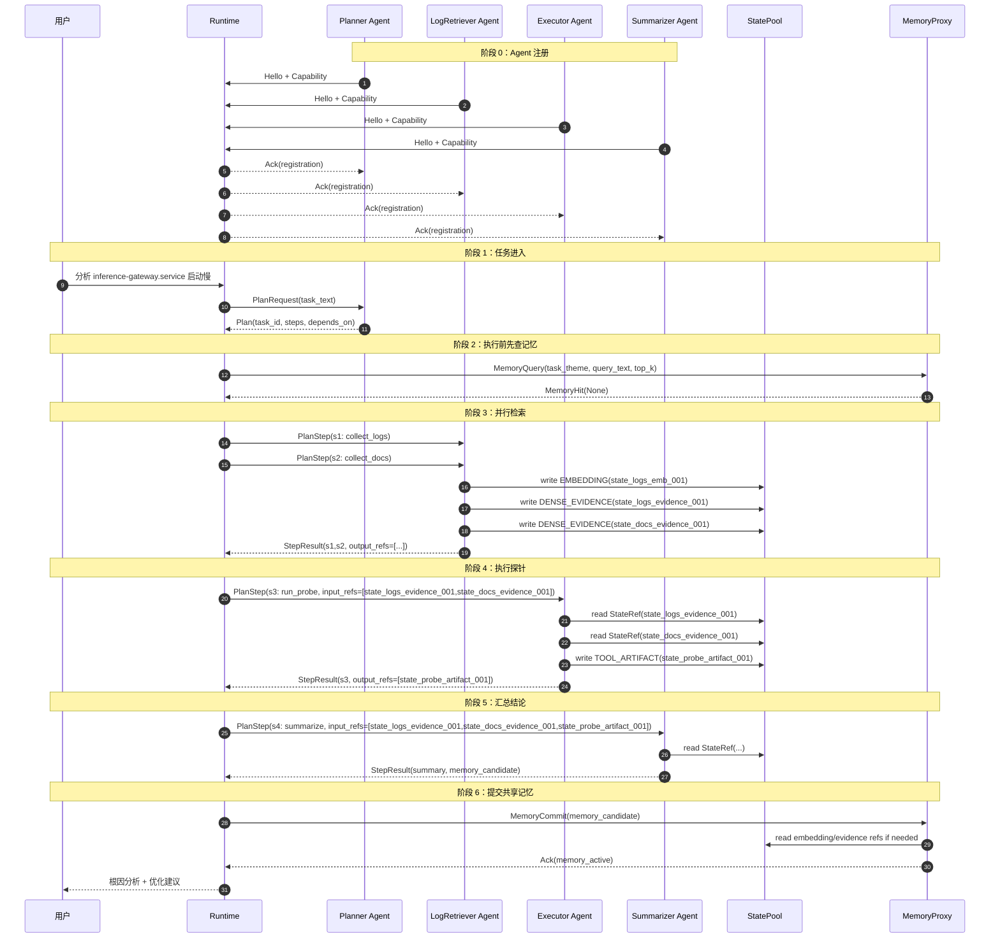
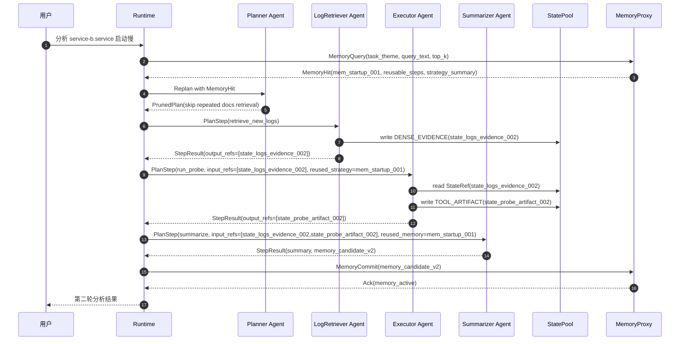

# StateBus 真实场景详解：时序图 + 消息表 + 状态表

适用对象：第一次接触 `StateBus` 的读者  
目标：用一个足够具体的场景，讲清楚 4 个 Agent 如何协同、传什么、怎么传、谁理解这些数据、第二轮任务如何复用第一轮结果

---

## 1. 先说清楚这个例子想回答什么问题

很多人第一次看多 Agent 架构会有两个自然疑问：

1. 多 Agent 不就是把一段文本传给下一个模型吗？
2. 如果你不传大段文本，而是传 `embedding`、`evidence`、`artifact` 这些非文本状态，下一个接收者到底怎么理解？

这份文档就是专门回答这两个问题。

最关键的一句话先说在前面：

> 在 StateBus 里，Agent 协作的主干由控制面协议驱动；重的中间状态放在数据面；下一个接收者并不是默认“直接读裸向量”，而是通过自己的后端适配器消费 `StateRef` 指向的对象。

也就是说：

- **控制面**负责“告诉谁下一步要干什么”
- **数据面**负责“把真正的中间对象传过去”
- **记忆面**负责“把第一轮任务变成第二轮可复用经验”

---

## 2. 场景定义

我们设计两个连续任务。

### 2.1 任务 1

用户任务：

> 在 `openEuler` 上，`inference-gateway.service` 开机后大约 45 秒才进入 ready 状态。请分析启动慢的根因，给出优化建议，并保留可复用经验。

这个任务至少包含：

- 任务规划
- 系统日志检索
- 文档与历史案例检索
- 探针或脚本执行
- 结论汇总
- 经验沉淀

### 2.2 任务 2

第二轮用户任务：

> 继续分析 `service-b.service` 启动慢的问题。环境和现象与前一个任务相似，但对象换成了新的服务。

第二轮任务的作用是验证：

- 第一轮积累的记忆到底怎么命中
- 命中之后如何裁剪 DAG
- 系统怎么做到“不是直接复读旧答案，而是复用旧经验”

---

## 3. 参与者列表

这个场景里有 4 个 Agent，加 2 个系统组件。

| 参与者 | 类型 | 主要职责 | 后端形态 |
|---|---|---|---|
| `Planner Agent` | Agent | 把用户任务拆成 DAG | LLM |
| `LogRetriever Agent` | Agent | 检索日志、检索资料、生成 embedding、组织证据 | 脚本 + 编码器 |
| `Executor Agent` | Agent | 运行探针、脚本或 CodeAct | 脚本/沙箱/可选 LLM 辅助 |
| `Summarizer Agent` | Agent | 汇总证据与探针结果，生成结论 | LLM |
| `Runtime` | 系统组件 | DAG 编译、调度、路由、回滚、复用剪枝 | 运行时 |
| `MemoryProxy` | 系统组件 | 共享记忆查询、提交、SQLite/FAISS 一致性 | 系统服务 |
| `StatePool` | 系统组件 | 持有 `StateRef` 对应的共享对象 | shm/memfd/mmap |

这里最重要的认识是：

> Agent 不等于“纯聊天模型”。

在这个例子里：

- `Planner` 和 `Summarizer` 主要是 LLM 型 Agent
- `LogRetriever` 更像脚本型 Agent
- `Executor` 是混合型 Agent，它可以执行脚本，也可以在必要时用 CodeAct 生成一次性脚本再进沙箱

---

## 4. 三个面在这个场景里分别做什么

| 层面 | 在这个场景里的职责 | 典型对象 |
|---|---|---|
| 控制面 | 让系统知道“谁做什么、依赖谁、结果是否完成” | `Hello` `Capability` `Plan` `PlanStep` `StepResult` `Ack` |
| 数据面 | 存放重的中间状态对象 | `EMBEDDING` `DENSE_EVIDENCE` `TOOL_ARTIFACT` |
| 记忆面 | 存放跨任务复用的摘要、策略、证据链、检索向量 | `MemoryQuery` `MemoryHit` `MemoryCommit` |

---

## 5. 这个例子里会实际用到哪些状态类型

这个主路径里不需要把所有状态类型都用上。  
最现实的主路径只用 3 类：

| 状态类型 | 谁产生 | 谁消费 | 怎么消费 |
|---|---|---|---|
| `EMBEDDING` | `LogRetriever`、`MemoryProxy` | `MemoryProxy`、检索子流程 | 用于相似检索、命中、rerank，不直接给通用 LLM 看 |
| `DENSE_EVIDENCE` | `LogRetriever` | `Executor`、`Summarizer` | 通过 `StateRef` 读取后转成结构化证据或摘要 |
| `TOOL_ARTIFACT` | `Executor` | `Summarizer`、`MemoryProxy` | 作为探针输出、指标结果、报告片段 |

这里特别说明两点：

1. `EMBEDDING` 是主路径里常用的，但它的作用主要是检索和命中，不是让通用 LLM 直接看裸向量。
2. `HIDDEN_STATE` / `KV_PREFILL` 可以作为高级可选路径，但这个例子不把它们放进主链路，因为它们只适合同构本地后端。

---

## 6. 协议对象总览

为了让后面的时序图容易读，先列出这个例子里真正会出现的协议对象。

| 协议对象 | 作用 | 谁发出 |
|---|---|---|
| `Hello` | Agent 启动时注册身份和角色 | 各 Agent |
| `Capability` | 声明动作能力、输入输出契约 | 各 Agent |
| `Plan` | Planner 给出 DAG | `Planner Agent` |
| `PlanStep` | Runtime 调度具体步骤 | `Runtime` |
| `StepResult` | 某一步完成后的输出 | 各执行 Agent |
| `StateRef` | 指向数据面对象的引用 | 由执行 Agent 产出，经控制面携带 |
| `MemoryQuery` | 查询历史记忆 | `Runtime` |
| `MemoryHit` | 记忆命中结果 | `MemoryProxy` |
| `MemoryCommit` | 提交共享记忆候选 | `Summarizer Agent` |
| `Ack/Error/Heartbeat` | 任务闭环、失败与健康状态 | `Runtime` 与各 Agent |

---

## 7. 任务 1 的完整时序图



---

## 8. 任务 1 的详细时间线

### 8.1 阶段 0：Agent 注册

所有 Agent 启动后先向 Runtime 报到。

#### 控制面消息示例

```text
Hello(
  agent_id="planner-1",
  role="planner",
  supported_protocols=["statebus.v1"],
  supported_state_kinds=[],
  supported_tools=[]
)
```

```text
Capability(
  agent_id="retriever-1",
  items=[
    {
      name: "log_retriever",
      kind: "retriever",
      input_schema: "RetrieveInputV1",
      output_schema: "RetrieveOutputV1",
      max_latency_ms: 15000
    }
  ]
)
```

#### Runtime 内部形成能力表

| Agent | action | 输入 | 输出 |
|---|---|---|---|
| `planner-1` | `PLAN` | 用户任务文本 | `Plan` |
| `retriever-1` | `RETRIEVE` | 服务名、时间窗、主题 | `EMBEDDING` `DENSE_EVIDENCE` |
| `executor-1` | `EXECUTE` | 证据 refs、工具参数 | `TOOL_ARTIFACT` |
| `summarizer-1` | `SUMMARIZE` | 证据 refs、执行产物 refs | `SUMMARY` `MEMORY_CANDIDATE` |

这一阶段说明：

- 控制面负责把协作骨架搭起来
- 后续 Runtime 调度时，不需要再问 LLM “谁适合做这一步”

### 8.2 阶段 1：Planner 生成结构化 DAG

用户输入：

> 请分析 `inference-gateway.service` 启动慢的原因，给出优化建议，并保留经验。

Planner 产出的不是大段自然语言计划，而是一个结构化 `Plan`。

```text
Plan(
  task_id="task_boot_slow_001",
  goal="分析 inference-gateway.service 启动慢",
  steps=[
    {step_id="s1", owner_agent="retriever-1", action="RETRIEVE", tool_name="collect_logs", args_json="{service: inference-gateway.service, window: boot}", depends_on=[]},
    {step_id="s2", owner_agent="retriever-1", action="RETRIEVE", tool_name="collect_docs", args_json="{topic: systemd startup slow}", depends_on=[]},
    {step_id="s3", owner_agent="executor-1", action="EXECUTE", tool_name="run_probe", args_json="{target: inference-gateway.service}", depends_on=["s1","s2"]},
    {step_id="s4", owner_agent="summarizer-1", action="SUMMARIZE", args_json="{style: ops_report}", depends_on=["s1","s2","s3"]}
  ]
)
```

这一步控制面真正传输的是：

- `task_id`
- `step_id`
- `owner_agent`
- `action`
- `tool_name`
- `args_json`
- `depends_on`

### 8.3 阶段 2：Runtime 先做 MemoryQuery

真正执行 DAG 之前，Runtime 先查历史记忆：

```text
MemoryQuery(
  task_theme="service_startup_slow",
  query_text="inference-gateway.service startup slow on openEuler",
  top_k=5
)
```

如果这是第一次遇到这个问题，MemoryProxy 返回：

```text
MemoryHit(None)
```

所以 Runtime 按原始 DAG 继续执行。

这一阶段说明：

- 记忆面不是最后才参与
- 任务开始前就可能影响编排

### 8.4 阶段 3：LogRetriever 并行执行 `s1` 和 `s2`

`s1` 和 `s2` 都是 `RETRIEVE`，没有依赖，可以并行。

#### `LogRetriever Agent` 的真实后端动作

它不是纯 LLM，而是脚本型 Agent。  
它内部可能调这些后端动作：

- `journalctl -b -u inference-gateway.service`
- `systemd-analyze blame`
- `systemd-analyze critical-chain`
- 本地案例库检索脚本
- 文档 embedding 编码器

#### 它会产生两类中间对象

1. **日志 embedding**
2. **证据块**

示例数据：

```json
[
  {"ts":"08:00:01","unit":"inference-gateway.service","msg":"waiting for network-online.target"},
  {"ts":"08:00:18","unit":"inference-gateway.service","msg":"cache warmup started"},
  {"ts":"08:00:43","unit":"inference-gateway.service","msg":"ready"}
]
```

写入数据面后得到：

```text
StateRef(
  state_id="state_logs_emb_001",
  kind="EMBEDDING",
  storage="MEMFD",
  handle="fd_token_17",
  offset=0,
  length=32768,
  dtype="float32",
  shape=[128, 768],
  checksum="sha256:...",
  lease_id=9001
)
```

```text
StateRef(
  state_id="state_logs_evidence_001",
  kind="DENSE_EVIDENCE",
  storage="MEMFD",
  handle="fd_token_18",
  offset=0,
  length=81920,
  dtype="bytes",
  shape=[],
  checksum="sha256:...",
  lease_id=9002
)
```

以及：

```text
StateRef(
  state_id="state_docs_evidence_001",
  kind="DENSE_EVIDENCE",
  storage="MEMFD",
  handle="fd_token_20",
  offset=0,
  length=65536,
  dtype="bytes",
  shape=[],
  checksum="sha256:...",
  lease_id=9004
)
```

#### 这一步里，谁理解这些数据

这里很关键：

- `EMBEDDING` 不是给下一个通用 LLM 直接看的
- 它主要给检索/匹配流程使用
- `DENSE_EVIDENCE` 才是后面更可能被执行器和总结器消费的对象

控制面只回：

```text
StepResult(
  step_id="s1",
  output_refs=["state_logs_emb_001", "state_logs_evidence_001"]
)
```

```text
StepResult(
  step_id="s2",
  output_refs=["state_docs_evidence_001"]
)
```

### 8.5 阶段 4：Executor 消费证据而不是读长文本

现在 `s3` 依赖 `s1` 和 `s2`，所以 Runtime 调度给 `Executor Agent`。

Executor 收到的输入不是一大段日志文本，而是：

| 输入 | 类型 |
|---|---|
| `state_logs_evidence_001` | `DENSE_EVIDENCE` |
| `state_docs_evidence_001` | `DENSE_EVIDENCE` |
| `tool_name=run_probe` | 控制面字段 |
| `args_json={target: inference-gateway.service}` | 控制面字段 |

#### Executor 的后端动作

Executor 是混合型 Agent，后端可以是两段式：

1. 如果要临时推断“该跑什么探针”，可以用一次轻量 LLM / CodeAct
2. 真正执行由脚本和沙箱完成

它可能执行：

- `systemd-analyze blame`
- `systemd-analyze critical-chain inference-gateway.service`
- `iostat -x 1 3`
- `journalctl -u inference-gateway.service -b`

#### 数据面怎么被消费

Executor 不会直接看 “fd_token_18” 这种字符串。  
它内部有适配器流程：

```text
接收 StateRef
  -> Runtime 注入 memfd / shm
  -> Executor adapter 根据 handle 打开映射
  -> 读取证据块
  -> 转成脚本输入或本地结构化对象
  -> 运行探针
```

所以这里“理解数据”的不是聊天 LLM，而是：

- Executor 的本地 adapter
- 探针脚本
- 沙箱内程序

探针结果写回数据面：

```text
StateRef(
  state_id="state_probe_artifact_001",
  kind="TOOL_ARTIFACT",
  storage="MEMFD",
  handle="fd_token_19",
  offset=0,
  length=24576,
  dtype="bytes",
  shape=[],
  checksum="sha256:...",
  lease_id=9003
)
```

### 8.6 阶段 5：Summarizer 消费的是“被整理后的状态”

当 `s4` 开始时，Summarizer 拿到的是：

- `state_logs_evidence_001`
- `state_docs_evidence_001`
- `state_probe_artifact_001`

但它也不是直接看裸 fd 或裸 embedding。  
它前面同样有一个 adapter，把这些状态整理成 LLM 能理解的输入包：

```json
{
  "task": "分析 inference-gateway.service 启动慢原因",
  "top_evidence": [
    "服务等待 network-online.target 约 12 秒",
    "critical chain 显示 systemd 依赖链串行化",
    "cache warmup 增加约 14 秒延迟"
  ],
  "probe_metrics": {
    "critical_chain_delay_ms": 18234,
    "network_online_wait_ms": 12000,
    "cache_warmup_ms": 14321
  },
  "doc_hints": [
    "systemd critical-chain optimization",
    "defer non-critical startup jobs"
  ]
}
```

所以 Summarizer 真正“理解”的不是：

- 裸向量
- 裸共享内存句柄

而是：

- 结构化证据摘要
- 指标字段
- 少量必要文本

这一步最能说明：

> 数据面负责传对象，adapter 负责把对象变成接收侧能理解的输入。

### 8.7 阶段 6：MemoryProxy 提交共享记忆

Summarizer 产出两类结果：

1. 面向用户的总结
2. 面向系统的 `memory_candidate`

示例：

```text
MemoryCommit(
  memory_id="mem_startup_001",
  source_agent="summarizer-1",
  task_theme="service_startup_slow",
  summary="启动慢主要由 network-online 等待、systemd 依赖串行化和 cache warmup 叠加造成",
  tags=["openEuler","systemd","startup","network","cache"],
  evidence_state_ids=["state_logs_evidence_001","state_docs_evidence_001","state_probe_artifact_001"],
  embedding_state_id="state_memory_emb_001",
  confidence=0.91,
  version=1
)
```

MemoryProxy 负责：

1. SQLite 写元数据
2. FAISS 写向量索引
3. 保证两边一致

这说明记忆面存的不是整段聊天记录，而是：

- 任务摘要
- 标签
- 证据 refs
- 记忆检索用 embedding

---

## 9. 任务 2 的时序图：如何复用任务 1



---

## 10. 任务 2 的关键变化

第二轮任务最大的不同，不是“答案更快出来”，而是**协作结构本身变了**。

### 10.1 MemoryQuery 命中

新任务进来后，Runtime 先生成 query embedding：

```text
query = "service-b.service startup slow on openEuler"
  -> query embedding
  -> FAISS topK
  -> SQLite filter(status='active', confidence>=threshold)
  -> MemoryHit(mem_startup_001)
```

### 10.2 GraphPruning 裁剪 DAG

第一轮原始 DAG：

```text
RETRIEVE logs
RETRIEVE docs
EXECUTE probe
SUMMARIZE
```

第二轮命中历史记忆后：

```text
RETRIEVE new_logs
EXECUTE new_probe(using reused strategy)
SUMMARIZE
```

即：

- 保留新的日志检索
- 保留新的探针执行
- 复用第一轮的资料组织方式、分析模板和策略摘要
- 跳过部分重复文档检索

### 10.3 复用的不是答案，而是经验结构

这一点非常重要。

StateBus 的复用不是：

> 上一轮说是 I/O 抖动，这一轮也直接说 I/O 抖动。

而是：

> 上一轮已经积累了一种“启动慢类问题”的证据组织方式、探针模板和分析路径；这一轮优先复用这些经验结构，再根据新日志和新探针结果做验证。

---

## 11. 消息表

下面按“任务 1 主路径”列出主要消息。

| 序号 | 阶段 | 发送方 | 接收方 | 消息类型 | 关键字段 | 作用 |
|---|---|---|---|---|---|---|
| M1 | Agent 注册 | 各 Agent | Runtime | `Hello` | `agent_id` `role` `supported_protocols` | 报身份 |
| M2 | Agent 注册 | 各 Agent | Runtime | `Capability` | `actions` `input_schema` `output_schema` | 报能力 |
| M3 | 任务规划 | Runtime | Planner | `PlanRequest` | `task_text` | 请求规划 |
| M4 | 任务规划 | Planner | Runtime | `Plan` | `task_id` `steps` `depends_on` | 返回 DAG |
| M5 | 记忆查询 | Runtime | MemoryProxy | `MemoryQuery` | `task_theme` `query_text` `top_k` | 查历史记忆 |
| M6 | 记忆查询 | MemoryProxy | Runtime | `MemoryHit` | `memory_id` `confidence` `reusable_steps` | 返回命中结果 |
| M7 | 日志检索 | Runtime | LogRetriever | `PlanStep` | `action=RETRIEVE` `tool=collect_logs` | 派发 s1 |
| M8 | 文档检索 | Runtime | LogRetriever | `PlanStep` | `action=RETRIEVE` `tool=collect_docs` | 派发 s2 |
| M9 | 检索完成 | LogRetriever | Runtime | `StepResult` | `output_refs` | 返回日志/文档 refs |
| M10 | 探针执行 | Runtime | Executor | `PlanStep` | `action=EXECUTE` `input_refs` | 派发 s3 |
| M11 | 执行完成 | Executor | Runtime | `StepResult` | `output_refs` | 返回探针产物 ref |
| M12 | 总结汇总 | Runtime | Summarizer | `PlanStep` | `action=SUMMARIZE` `input_refs` | 派发 s4 |
| M13 | 总结完成 | Summarizer | Runtime | `StepResult` | `summary` `memory_candidate` | 返回总结和记忆候选 |
| M14 | 提交记忆 | Runtime | MemoryProxy | `MemoryCommit` | `memory_id` `summary` `tags` `evidence_state_ids` | 提交共享记忆 |
| M15 | 提交完成 | MemoryProxy | Runtime | `Ack` | `memory_active` | 记忆可复用 |

---

## 12. 状态表

下面按“任务 1 主路径”列出主要数据面状态。

| 状态 ID | 类型 | 生产者 | 消费者 | 存储方式 | 内容 | 消费方式 |
|---|---|---|---|---|---|---|
| `state_logs_emb_001` | `EMBEDDING` | LogRetriever | MemoryProxy / 检索流程 | `MEMFD` | 日志语义向量 | 用于相似检索，不直接给通用 LLM 看 |
| `state_logs_evidence_001` | `DENSE_EVIDENCE` | LogRetriever | Executor / Summarizer | `MEMFD` | 日志切块与证据片段 | adapter 解析为结构化证据 |
| `state_docs_evidence_001` | `DENSE_EVIDENCE` | LogRetriever | Executor / Summarizer | `MEMFD` | 文档和历史案例片段 | adapter 解析为证据摘要 |
| `state_probe_artifact_001` | `TOOL_ARTIFACT` | Executor | Summarizer / MemoryProxy | `MEMFD` | 探针结果、指标输出 | 转成指标字段与分析结果 |
| `state_memory_emb_001` | `EMBEDDING` | MemoryProxy 或 Summarizer 后处理 | MemoryProxy | `MEMFD` 或索引缓冲 | 记忆摘要向量 | 用于下次 MemoryQuery 命中 |
| `state_logs_evidence_002` | `DENSE_EVIDENCE` | LogRetriever | Executor / Summarizer | `MEMFD` | 第二轮新日志证据 | 第二轮验证输入 |
| `state_probe_artifact_002` | `TOOL_ARTIFACT` | Executor | Summarizer / MemoryProxy | `MEMFD` | 第二轮探针结果 | 第二轮验证输入 |

---

## 13. 谁在“理解”这些数据

这是最容易困惑的地方，单独列出来。

| 数据 | 下一个接收者 | 真正理解它的组件 | 说明 |
|---|---|---|---|
| `EMBEDDING` | MemoryProxy / 检索流程 | 检索器、FAISS、匹配逻辑 | 不直接给通用 LLM 看 |
| `DENSE_EVIDENCE` | Executor | Executor adapter + 本地脚本 | 先从 `StateRef` 取出，再转为脚本输入 |
| `DENSE_EVIDENCE` | Summarizer | Summarizer adapter | 先整理成证据摘要和结构化字段，再喂给 LLM |
| `TOOL_ARTIFACT` | Summarizer | Summarizer adapter | 转为指标结果和分析输入 |
| `MemoryHit` | Runtime / Planner | Runtime / Planner | 用于剪枝和重规划 |

一句话总结：

> `StateRef` 不是给“任意下一个模型直接看”的，而是给“下一个接收者的适配器和后端”消费的。

---

## 14. 用这个例子回头看，三个面和五个模块为什么就清楚了

### 14.1 三个面

- **控制面**
  - `Hello`
  - `Capability`
  - `Plan`
  - `PlanStep`
  - `StepResult`
  - `MemoryCommit`

  作用：决定协作骨架。

- **数据面**
  - `state_logs_emb_001`
  - `state_logs_evidence_001`
  - `state_docs_evidence_001`
  - `state_probe_artifact_001`

  作用：承载真正的中间状态对象。

- **记忆面**
  - `MemoryQuery`
  - `MemoryHit`
  - `mem_startup_001`
  - `state_memory_emb_001`

  作用：负责跨任务积累和复用。

### 14.2 五个模块

- `Runtime`
  - 编译 DAG
  - 检查依赖
  - 调度 step
  - 做 GraphPruning

- `Protocol Engine`
  - 收 `Hello`
  - 收 `Capability`
  - 解释 `Plan`
  - 传 `StepResult`

- `StatePool`
  - 托管所有 `StateRef`
  - 管 lease / refcount / checksum

- `MemoryProxy / Memory Store`
  - 做 `MemoryQuery`
  - 做 `MemoryCommit`
  - 协调 SQLite + FAISS

- `Eval / Telemetry`
  - 统计 `message_count`
  - 统计 `protocol_bytes`
  - 统计 `state_bytes`
  - 统计 `memory_hit_rate`
  - 统计 `reuse_gain`

---

## 15. 这份例子最后想让读者明白什么

这份例子要传达的不是“我们设计了很多消息类型”，而是下面 5 件事：

1. 多 Agent 协作不必退化成“长文本接力”
2. `StateRef` 可以把重状态从文本里剥离出来
3. 下一个接收者不是直接看裸向量，而是通过自己的 adapter 和后端消费状态
4. `MemoryProxy` 让第一轮任务变成第二轮可复用经验
5. 所谓“三个面”和“五个模块”，最终都要落到一条能跑通的真实协同链路上

如果第一次读的人看完这份文档，能够回答下面两个问题，就说明这个例子讲清楚了：

- `state_logs_emb_001` 是谁产生的，谁消费的，为什么不直接喂给 Summarizer？
- 第二轮任务为什么可以少做一步资料检索，但又不是直接复读第一轮答案？
