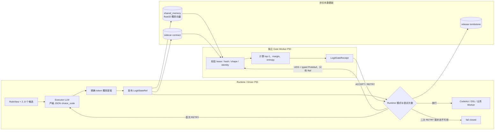
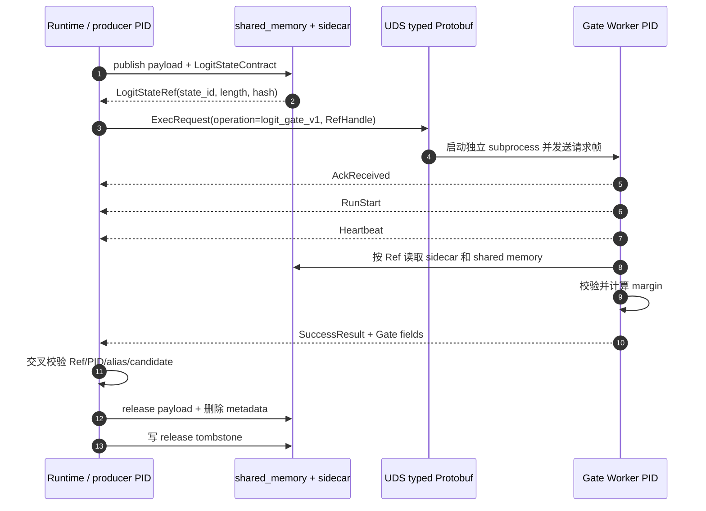
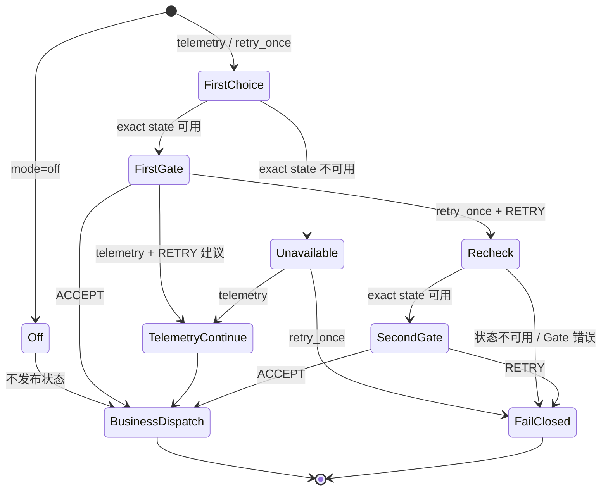
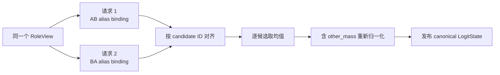

# StateBus Logit Retry Gate 实现机制详解

> 文档性质：基于当前本地代码、测试和有效运行产物的实现说明。
>
> 代码快照：`contest/recovery-core`，`6ffcf8074d46336d1f3f64c6d0f16952bc455901`（2026-07-28）。
>
> 实验产物：`/home/qcrs/statebus/runs/logit_retry_challenge_20260727_222823`。
>
> 关联报告：[StateBus-LogitRetryGate受控机制实验-20260727.md](StateBus-LogitRetryGate受控机制实验-20260727.md)。

## 1. 当前实现结论

Logit Retry Gate 位于 **Executor 闭集候选选择之后、CodeAct 或其他业务 Worker 真正执行之前**。它把模型在选择 token 位置产生的候选概率提取为二进制 `LogitState`，通过 `shared_memory` 发布，再由独立 PID 的 Gate Worker 读取并计算确定性规则。Runtime 最终根据 Gate 回执决定：

1. 直接放行；
2. 在同一闭集候选中重查一次；
3. 第二次仍不满足条件时 fail closed，阻止业务 Worker 启动。

当前 Gate 的核心判据是：

```text
ACCEPT 当且仅当：
  模型实际输出的候选 == 候选概率 top-1
  且 top_margin = p(top-1) - p(top-2) >= 0.10

否则：RETRY
```

当前默认模式仍是 `off`。只有设置 `STATEBUS_LOGIT_GATE_MODE=telemetry` 或 `retry_once` 才会进入 LogitState 路径。

这套实现证明的不是“多问一次模型会更聪明”，而是以下闭环已经存在：

> 真实 token 概率 -> 非文本状态 -> 独立进程消费 -> 确定性 Gate 回执 -> Runtime 控制流改变 -> 状态释放审计

## 2. 它解决什么问题

普通的 LLM 路由通常只有一个文本结果，例如“选择 `detect_outliers`”。Runtime 无法区分以下两种情况：

- 模型对该选择非常确定；
- 两个候选几乎等价，只是解码过程勉强输出了其中一个。

直接让模型再输出一个文本字段 `confidence` 也不可靠，因为那仍是模型生成的自述，而不是生成选择 token 时的实际分布。当前实现因此读取 vLLM 返回的真实 `top_logprobs`，并把数值判断从 Agent 中剥离出来。

这样设计有四个直接目的：

| 目的 | 当前实现手段 |
|:--|:--|
| 不相信模型自报置信度 | 从 `choice_code` 的真实 token 分布提取概率 |
| 不让模型自己决定是否放行 | 独立 Gate PID 执行固定数值规则 |
| 不让不确定重试无限循环 | `retry_once` 最多只允许一次 recheck |
| 不让失败状态产生业务副作用 | fail closed 位于 CodeAct/Worker dispatch 之前 |

## 3. 总体架构



控制面与数据面是分开的：

- 控制面使用 UDS + typed Protobuf，传递 `ExecRequest`、`RefHandle` 和结构化回执；
- 数据面中的概率向量不塞进控制消息，而是放在 `shared_memory`；
- sidecar 保存状态合同，tombstone 保存释放事实。

## 4. 代码组件与职责

| 组件 | 当前职责 |
|:--|:--|
| [`statebus/integrations/llm.py`](../../statebus/integrations/llm.py) | 本地 vLLM 的 Executor 请求开启 `logprobs=True`、`top_logprobs=20` |
| [`statebus/runtime/role_path.py`](../../statebus/runtime/role_path.py) | 构造候选面、闭集 JSON schema、首次选择和 recheck 指令 |
| [`statebus/contracts/logit.py`](../../statebus/contracts/logit.py) | 定义 `CandidateSurfaceV2`、Producer/Gate Receipt、阈值与二进制语义 |
| [`statebus/runtime/logit_state.py`](../../statebus/runtime/logit_state.py) | 从精确选择 token 恢复候选概率并序列化为 `<f4` |
| [`statebus/state/logit_state.py`](../../statebus/state/logit_state.py) | 发布、解析、校验、计算 Gate、释放与 tombstone |
| [`statebus/runtime/logit_gate.py`](../../statebus/runtime/logit_gate.py) | 启动独立 Gate Worker、发送控制请求、交叉验证回执 |
| [`statebus/control/subprocess_worker.py`](../../statebus/control/subprocess_worker.py) | 在独立 PID 中解析 Ref、读取 shared memory、返回 Gate Receipt |
| [`statebus/control/statebus_control.proto`](../../statebus/control/statebus_control.proto) | 定义 Gate 使用的 typed Protobuf 字段 |
| [`statebus/runtime/smoke.py`](../../statebus/runtime/smoke.py) | 接入 `off/telemetry/retry_once` 状态机，并在业务执行前做最终授权 |
| [`statebus/benchmark/logit_retry_challenge.py`](../../statebus/benchmark/logit_retry_challenge.py) | 实现实验专用 RoleView 展开、AB/BA 校准、配对运行和汇总 |

## 5. 候选面：先固定“在比较什么”

### 5.1 `CandidateSurfaceV2`

Gate 只处理 2 到 8 个闭集候选。`CandidateSurfaceV2` 为候选依次绑定 ASCII 别名 `A..H`：

```text
A -> candidate_id_0 + candidate_digest_0
B -> candidate_id_1 + candidate_digest_1
...
H -> candidate_id_7 + candidate_digest_7
```

正式 Runtime 中，candidate digest 覆盖：

- candidate ID；
- route；
- tool name；
- supporting document IDs。

同时保存两类摘要：

- `candidate_surface_digest`：绑定内容和候选面整体摘要；
- `alias_mapping_digest`：`ordinal + alias + candidate_id` 的映射摘要。

这两个摘要会贯穿 Producer Receipt、LogitState sidecar 和 Gate 校验，防止“概率来自候选面 A，但回执被用于候选面 B”。

### 5.2 为什么模型只返回 `choice_code`

开启 Gate 后，Executor 使用封闭 JSON schema：

```json
{
  "type": "object",
  "properties": {
    "choice_code": {"type": "string", "enum": ["A", "B"]}
  },
  "required": ["choice_code"],
  "additionalProperties": false
}
```

模型最终只能返回类似：

```json
{"choice_code":"B"}
```

这里不让模型输出 route、理由或文本置信度，原因是需要把决策位置压缩为一个可精确定位的 ASCII token。候选业务身份通过绑定表恢复，而不是从自由文本猜测。

## 6. 精确概率提取

生产 Gate 路径使用的是 `extract_exact_choice_logit_state()`，不是“找整段输出里熵最高的位置”。提取过程如下：

```mermaid
flowchart TD
    A[completion text + per-token top_logprobs] --> B{JSON 是否严格为\n单字段 choice_code?}
    B -->|否| U[Producer Receipt = UNAVAILABLE]
    B -->|是| C{alias 是否属于候选面?}
    C -->|否| U
    C -->|是| D[在 completion bytes 中定位 alias 字面量]
    D --> E{alias 是否唯一且恰好由\n一个 ASCII token 覆盖?}
    E -->|否| U
    E -->|是| F[读取该 token 位置的 top_logprobs]
    F --> G{A..N 是否全部存在且数值合法?}
    G -->|否| U
    G -->|是| H[p_i = exp(logprob_i)]
    H --> I[other_mass = 1 - sum p_i]
    I --> J[pack little-endian float32]
    J --> K[Producer Receipt = AVAILABLE]
```

关键检查包括：

1. completion 必须能解析为 JSON；
2. JSON 必须只有 `choice_code` 一个字段；
3. alias 必须属于当前候选面；
4. alias 在 completion 中必须只有一个字面量位置；
5. token bytes 必须能重建 completion；
6. alias 必须恰好由一个 token 覆盖；
7. 每一个候选 alias 都必须出现在该位置的 `top_logprobs` 中；
8. logprob 必须是有限且不大于 0 的数；
9. 候选概率总和不能超过 1；
10. 最终概率必须有限、非负且可打包。

任一步失败都返回 `UNAVAILABLE`，例如：

```text
choice_json_invalid
choice_schema_mismatch
choice_alias_outside_surface
choice_alias_not_single_token
completion_token_bytes_mismatch
candidate_alias_missing:B
top_logprob_invalid
candidate_probability_sum_exceeds_one
```

实现不会用 softmax 猜回缺失候选，也不会把模型自报的 confidence 填进去。

### 6.1 `other_mass` 的含义

假设候选为 `A、B`，选择 token 位置还可能存在非候选 token `X、Y...`。载荷保留：

```text
p(A), p(B), other_mass

other_mass = 1 - p(A) - p(B)
```

`other_mass` 让状态保留候选集合之外的剩余概率质量。当前 Gate 的 top-1 和 margin **只在候选概率之间计算**；`other_mass` 参与 entropy，但不参与 top-1 竞争，也没有单独的绝对概率阈值。这是当前策略边界，不应解读成 Gate 已校准全部词表不确定性。

## 7. 二进制布局

当前状态语义固定为：

```text
schema_version        statebus.logit_state.v1
probability_semantics candidate_order_plus_other_mass_v1
dtype                 little-endian float32 (<f4)
candidate_count       2..8
payload_bytes         4 * (candidate_count + 1)
```

对于实验中的两个候选：

```text
byte offset
0          4          8          12
+----------+----------+----------+
| p(A) f32 | p(B) f32 | other f32|
+----------+----------+----------+

总大小 = 3 * 4 B = 12 B
```

对于通用 Runtime，状态大小范围是：

| 候选数 | payload |
|---:|---:|
| 2 | 12 B |
| 3 | 16 B |
| 4 | 20 B |
| 8 | 36 B |

因此报告中的“单次 12 B”只适用于本挑战固定的两候选面，不是所有 LogitState 都固定为 12 B。

## 8. 发布、消费与释放

### 8.1 发布合同

`publish_logit_state()` 会在 Driver PID 中创建 `LogitStateContract`，至少绑定：

- `state_id / task_id / trace_id`；
- `request_id / attempt_id`；
- 完整候选面与两个 digest；
- selected alias、candidate ID 和 ordinal；
- producer PID；
- lease 创建时间和过期时间；
- payload hash 和字节数；
- dtype、byte order 和 probability semantics。

默认 lease TTL 为 60 秒。发布后还会验证物化载体必须是 `StorageKind.SHARED_MEMORY`；若存储策略降级为其他后端，当前实现直接拒绝。

### 8.2 跨进程控制时序



Protobuf `SuccessResult` 中的 Gate 字段包括：

- `gate_action / gate_reason`；
- selected alias / selected candidate ID / top-1 alias；
- selected probability / top margin / normalized entropy / other mass；
- decision ID / margin threshold / candidate count；
- producer PID / consumer PID / consumed state ref ID。

### 8.3 Gate Worker 校验

独立 Worker 在计算前会验证：

- sidecar 存在且合同可解析；
- lease 未过期；
- Ref 的 state ID、hash、length 与合同一致；
- 载体确实是 shared memory；
- shared memory 名称和 payload 存在；
- payload hash 未被篡改；
- float32 shape 与候选数一致；
- 每个概率在 `[0, 1]`；
- 总概率在容差内等于 1。

回到 Runtime 后还会再检查：

- consumed ref 是否就是本次发布的 state；
- transport audit 的 worker PID 是否等于回执 consumer PID；
- producer PID 是否等于发布者；
- selected alias 和 candidate ID 是否等于 Producer 的选择。

`LogitGateReceipt` 本身禁止 producer PID 与 consumer PID 相同，因此“同进程读自己写的数据”不能冒充跨进程闭环。

### 8.4 必定释放

`run_logit_gate_attempt()` 在 `finally` 中调用 `release_logit_state()`。即使 Worker 消费或回执校验抛错，也会释放物理对象和 metadata，并留下 tombstone：

```json
{
  "schema_version": "statebus.logit_state_tombstone.v1",
  "lifecycle_status": "released",
  "release_reason": "consumed",
  "released_bytes": 12,
  "producer_pid": 2285231,
  "consumer_pid": 2285672,
  "blob_hash": "..."
}
```

## 9. Gate 判定公式

设候选概率向量为：

```text
C = [p_0, p_1, ..., p_(N-1)]
```

排序后：

```text
p_(1) = 最大候选概率
p_(2) = 第二大候选概率
top_margin = p_(1) - p_(2)
```

令 `selected` 为模型实际输出的 alias，则：

```text
selected_is_top1 = ordinal(selected) == argmax(C)

action = ACCEPT
  iff selected_is_top1
  and top_margin >= 0.10

otherwise action = RETRY
```

Gate reason 只有三类：

| 条件 | action | reason |
|:--|:--|:--|
| selected 不是候选 top-1 | `RETRY` | `selected_alias_not_top1` |
| selected 是 top-1，但 margin < 0.10 | `RETRY` | `top_margin_below_threshold` |
| selected 是 top-1，且 margin >= 0.10 | `ACCEPT` | `selected_alias_is_top1_and_margin_passed` |

Gate 只返回 `ACCEPT/RETRY`。`fail_closed` 不是 Gate action，而是 Runtime 在第二次仍收到 `RETRY`、状态不可用或跨进程错误时形成的终态。

## 10. 三种 Runtime 模式



| 模式 | 发布/消费状态 | Gate 建议改变控制流 | 失败处理 |
|:--|:--:|:--:|:--|
| `off` | 否 | 否 | 沿用原候选选择路径 |
| `telemetry` | 是 | 否 | 记录 unavailable/error/retry 建议后继续 |
| `retry_once` | 是 | 是 | 首次 RETRY 重查一次；其后 fail closed |

注意：正式 Runtime 的 `off` 不构建专用 Logit candidate surface，也不发布状态。受控实验的 `off` 为了配对公平，仍执行相同 AB/BA 首次选择，但明确不发布状态、不调用 Gate、不重试。两者不能混为一个代码分支解释。

## 11. 两类“重试”不能混淆

代码中存在两个层次的重试：

1. **JSON/schema retry**：一次角色调用内部，若输出格式不符合闭集 schema，最多按 `json_response_max_attempts` 修复格式；usage 会累加，但概率只使用最终有效 completion 的 `top_logprobs`。
2. **Logit Gate retry**：完整的第一次候选选择已通过 schema 校验，但数值 Gate 不授权，于是 Runtime 再调用一次 Executor，并发布第二个独立 LogitState。

实验报告中的“retry once”指第二类，而不是 JSON 格式修复。

## 12. 正式 Runtime 与受控挑战的边界

这是理解当前实现最重要的边界。

| 项目 | 正式 Runtime 默认 Gate 路径 | 2026-07-27 受控挑战 |
|:--|:--|:--|
| 首次候选 | 当前完整 `visible_candidates` | 每个 case 固定两个候选 |
| 第二次候选集合 | 与第一次相同 | 与第一次相同 |
| 第二次输入 Ref/证据 | 沿用相同 `executor_prompt_slice` | 使用 manifest 中专门设计的 `recheck_context/recheck_view` |
| 第二次新增提示 | “未通过数值门，重新评估所有 alias，不要为一致性保留旧 alias” | 明确说明 Gate 拒绝，并展开决定性合同 |
| AB/BA 双请求 | 不启用 | 每个选择阶段启用 |
| 执行终点 | 通过后继续 CodeAct/DSL | 只验证到 Worker dispatch 授权边界 |
| Gold | 后续业务 Validator | 与模型可见 manifest 分离的外部 `gold.json` |

因此可以得出两层结论：

- 通用 Runtime 已经具备“真实概率 -> Gate -> 重试一次/fail closed -> 业务执行边界”的接入；
- 受控挑战额外证明了在明确设计的 RoleView 展开条件下，Gate 能纠正路由并阻断不可判定任务。

不能把实验专用的“低 margin 后展开完整合同”写成所有 Runtime 任务都会自动扩展上下文。正式 Runtime 当前只是保持候选面和输入边界不变，追加 recheck 指令。

## 13. 为什么受控实验需要 AB/BA 校准

预实验发现，受约束 JSON 选择存在明显的首别名 `A` 偏好。如果只请求一次：

```text
A -> candidate_1
B -> candidate_2
```

模型对 `A` 的格式/位置偏好可能被误解为对 `candidate_1` 的语义置信度。受控挑战因此为同一个选择阶段发起两次真实请求：

```text
AB 投影：A -> candidate_1, B -> candidate_2
BA 投影：A -> candidate_2, B -> candidate_1
```

随后按 candidate ID 对齐：

```text
p_hat(candidate_i)
  = mean(
      AB 中 candidate_i 对应 alias 的概率,
      BA 中 candidate_i 对应 alias 的概率
    )
```

再把候选概率和 `other_mass` 一起重新归一化，并在 canonical surface 上取最大值作为选择。



AB/BA 是实验公平性措施，不是 `LogitState` 合同强制要求，也不是正式 Runtime 当前默认开销。

由于校准结果合并了 AB 和 BA 两个真实选择 token，挑战套件生成的汇总 Producer Receipt 将 `decision_token_position` 记为 `-1`；两个底层 probe 仍各自保留原始 completion、概率和 token 提取记录。正式 Runtime 的单次精确提取则记录真实 decision token position。

## 14. 受控挑战的 12 个任务

模型可见任务定义在 [`manifest.json`](../../statebus/benchmark/samples/logit_retry_challenge/manifest.json)，外部期望定义在独立的 [`gold.json`](../../statebus/benchmark/samples/logit_retry_challenge/gold.json)。Gold 不进入提示词。

| 组别 | task ID | 首次可见信息 | recheck 展开的决定性信息 | 期望 |
|:--|:--|:--|:--|:--|
| 简单对照 | `logit-easy-01-anomaly` | IQR 异常与上下界合同完整 | 不升级 | `detect_outliers` |
| 简单对照 | `logit-easy-02-correlation` | 同表已对齐两列、Pearson | 不升级 | `correlate_columns` |
| 简单对照 | `logit-easy-03-trend` | 三季度完整序列与趋势 | 不升级 | `compute_multi_period_trend` |
| 简单对照 | `logit-easy-04-extreme` | 分组均值后选全局最大组 | 不升级 | `aggregate_and_extreme` |
| 简单对照 | `logit-easy-05-dsl` | 单表筛选、排序、列选择 | 不升级 | `execute_analysis_dsl` |
| 受控歧义 | `logit-ambiguous-01-anomaly` | 两候选都只写“结构化分析” | 必须输出逐行 IQR 标记和上下界 | `detect_outliers` |
| 受控歧义 | `logit-ambiguous-02-join` | 只知道有两份数值输入 | `facility+period` 连接并返回逐行记录 | `join_tables` |
| 受控歧义 | `logit-ambiguous-03-trend` | 时间范围和输出形状隐藏 | 三个季度完整序列与趋势方向 | `compute_multi_period_trend` |
| 受控歧义 | `logit-ambiguous-04-extreme` | 是否需要极值选择隐藏 | 分组后只返回全局最低业务单元 | `aggregate_and_extreme` |
| 受控歧义 | `logit-ambiguous-05-python` | 转换算子隐藏 | 自连接加透视，超出 DSL 白名单 | `execute_bounded_python` |
| 不可判定负例 | `logit-unresolved-01-replica` | 两个只读副本等价 | 展开后仍同 hash/版本/预算/授权 | fail closed |
| 不可判定负例 | `logit-unresolved-02-policy` | 两个计划都缺资源授权 | 展开后授权仍缺失 | fail closed |

每个任务分别运行 `off` 与 `retry_once`，共 24 次，并交替运行模式顺序以减弱固定先后顺序影响。12/12 配对任务的首次 candidate 选择一致。

## 15. 实验结果如何对应机制

### 15.1 分组结果

| 分组 | Gate off | Retry once | 重试触发 | 机制解释 |
|:--|--:|--:|--:|:--|
| 简单对照 | 5/5 | 5/5 | 0/5 | 明确任务没有误触发 |
| 受控歧义 | 3/5 | 5/5 | 5/5 | 全部展开合同，2 个错误路由被纠正 |
| 不可判定负例 | 0/2 | 2/2 | 2/2 | 错误 Worker 放行由 2 次降为 0 次 |
| **全部 Validator** | **8/12** | **12/12** | **7/12** | **机制效果门通过** |

这里的 `12/12` 是挑战套件 Validator 结果，不属于正式 `95/95` 基线。

### 15.2 逐任务 margin 轨迹

简单对照在第一次就达到高 margin：

| 任务 | retry_once 首次 margin | Gate |
|:--|--:|:--|
| IQR 异常 | 0.999929 | ACCEPT |
| Pearson 相关 | 0.999951 | ACCEPT |
| 多期趋势 | 0.999961 | ACCEPT |
| 聚合极值 | 0.999867 | ACCEPT |
| DSL 路由 | 0.999962 | ACCEPT |

受控歧义的首次 AB/BA 校准均得到对称概率，margin 为 0；展开合同后全部越过 0.10：

| 任务 | 首次选择 -> recheck 选择 | margin 轨迹 | 是否纠正选择 |
|:--|:--|:--|:--:|
| IQR 异常 | `groupby_aggregate -> detect_outliers` | `0 -> 0.999962` | 是 |
| 跨表连接 | `join_tables -> join_tables` | `0 -> 0.999864` | 否，补足授权依据 |
| 多期趋势 | `compute_multi_period_trend -> compute_multi_period_trend` | `0 -> 0.999964` | 否，补足授权依据 |
| 聚合极值 | `groupby_aggregate -> aggregate_and_extreme` | `0 -> 0.182407` | 是 |
| Python/DSL | `execute_bounded_python -> execute_bounded_python` | `0 -> 0.999736` | 否，补足授权依据 |

不可判定负例在合同展开后仍保持对称：

| 任务 | margin 轨迹 | 第二次 Gate | Worker dispatch |
|:--|:--|:--|--:|
| 等价副本 | `0 -> 0` | RETRY -> Runtime fail closed | 0 |
| 均未授权计划 | `0 -> 0` | RETRY -> Runtime fail closed | 0 |

这说明 Gate 的价值不只体现在“换了答案”。三个歧义任务虽然首次碰巧选对，仍需要 recheck 后的数值授权；两个负例则明确证明系统不会为了必须给出一个 alias 而强行执行。

## 16. 一条真实运行链

以 `logit-ambiguous-01-anomaly` 为例：

```text
首次：
  selected = groupby_aggregate
  probabilities = [0.4999999877, 0.4999999877]
  other_mass = 0.0000000245
  margin = 0
  Gate = RETRY

recheck 展开 IQR 合同后：
  selected = detect_outliers
  probabilities = [0.0000191293, 0.9999808469]
  other_mass = 0.0000000238
  margin = 0.9999617176
  Gate = ACCEPT
```

第一次 Gate 的审计锚点：

```text
state_id       logit-bd77278a212326c5177efb5d
state_bytes    12
storage_kind   shared_memory
producer_pid   2285231
consumer_pid   2285672
action         retry
reason         top_margin_below_threshold
request frames 1
response frames 4
```

第二次使用新的 state ID 和新的 consumer PID `2285742`，并在接受后写入独立 tombstone。第一次状态没有被复用为第二次状态。

## 17. 非文本状态闭环

`retry_once` 的 19 次 Gate 尝试由以下部分组成：

```text
5 个简单对照 * 1 次 = 5
5 个受控歧义 * 2 次 = 10
2 个不可判定负例 * 2 次 = 4
合计 = 19
```

| 指标 | 结果 |
|:--|--:|
| Gate 状态尝试 | 19 |
| 独立 PID 消费 | 19/19 |
| 释放并留下 tombstone | 19/19 |
| 每次状态大小 | 12 B |
| 状态 payload 总量 | 228 B |

有效运行中 producer PID 为 `2285231`；19 次 Gate 都由不同于 producer 的 Worker PID 消费。这里的 228 B 只统计 LogitState payload，不包含 Protobuf 控制帧、sidecar 或进程启动开销，因此不能用来声称端到端传输只有 228 B。

## 18. 成本为什么增加

| 模式 | vLLM 调用 | 总 Token |
|:--|--:|--:|
| Gate off | 24 | 6,110 |
| Retry once | 38 | 9,952 |
| 差值 | +14（+58.33%） | +3,842（+62.88%） |

调用数可以直接拆解：

```text
Gate off:
  12 个任务 * 每阶段 2 次 AB/BA = 24 次

Retry once:
  首次选择 12 * 2 = 24 次
  7 个低 margin 任务 * recheck 2 次 = 14 次
  合计 = 38 次
```

因此耗时和 Token 上升不是异常，而是本实验设计的直接代价：

- 每个阶段都做 AB/BA 双探测；
- 7 个任务触发第二阶段；
- recheck prompt 比初始 prompt 多出完整合同。

这组实验用于验证授权控制与安全边界，不用于证明性能收益。正式 Runtime 当前不默认做 AB/BA，因此不能把本挑战的 38 次调用直接外推为所有线上任务的 Gate 开销。

## 19. 失败策略矩阵

| 失败点 | 代表原因 | `telemetry` | `retry_once` |
|:--|:--|:--|:--|
| 候选面不满足 2..8 个唯一候选 | `candidate_surface_requires_2_to_8_unique_candidates` | 记录后继续 | 状态不可用，拒绝 |
| 精确概率提取失败 | `candidate_alias_missing` 等 | 记录后继续 | 首次直接拒绝；二次 fail closed |
| 发布载体不是 shared memory | `logit_state_requires_shared_memory` | `telemetry_error` 后继续 | fail closed |
| lease 过期 | `logit_state_expired` | `telemetry_error` 后继续 | fail closed |
| payload 被篡改 | `logit_state_blob_hash_mismatch` | `telemetry_error` 后继续 | fail closed |
| selected 不是概率 top-1 | `selected_alias_not_top1` | 只记录 RETRY 建议 | 首次重查，第二次 fail closed |
| margin 低于 0.10 | `top_margin_below_threshold` | 只记录 RETRY 建议 | 首次重查，第二次 fail closed |
| 回执 Ref/PID/候选绑定不一致 | `logit_gate_*_mismatch` | `telemetry_error` 后继续 | fail closed |

无论哪类失败，每个已经发布的 LogitState 都由 `finally` 路径负责释放。

## 20. 测试覆盖

### 20.1 精确状态和跨进程 Gate

[`tests/test_logit_gate.py`](../../tests/test_logit_gate.py) 覆盖：

- 从 alias token 的分布精确恢复候选概率和 `other_mass`；
- 任一候选 alias 缺失时返回 unavailable；
- JSON 内部重试只保留最终 completion 的 logprobs，同时累加 usage；
- Gate 字段通过 typed Protobuf round trip；
- shared memory 被独立 PID 消费并释放；
- 过期 lease 被拒绝；
- payload hash 被篡改时被拒绝；
- 首次低 margin、第二次高 margin 后继续完整 smoke；
- 第二次仍低 margin 时 fail closed，并清理 shared memory。

### 20.2 受控挑战

[`tests/test_logit_retry_challenge.py`](../../tests/test_logit_retry_challenge.py) 覆盖：

- 5/5/2 三组任务和外部 Gold；
- 首次不泄露决定性合同，数值 Gate 后才展开；
- AB/BA 能抵消首 alias 偏差；
- AB/BA 不会抹掉真实语义选择；
- 歧义任务 recheck 后纠正路由；
- 不可判定负例第二次低 margin 后阻止 dispatch。

### 20.3 需要区分的旧序列化器

[`tests/test_logit_state.py`](../../tests/test_logit_state.py) 主要覆盖通用的 `serialize_logit_state_v2()` 峰值熵序列化器。当前生产 Gate 路径调用的是 `extract_exact_choice_logit_state()`；仓库中除测试外没有生产调用点使用 `serialize_logit_state_v2()`。

因此当前 Gate 证据应引用：

- exact candidate probability；
- exact decision token position；
- candidate top gap；
- Gate Receipt；
- 跨 PID 和 release 计数。

不应把旧序列化器的 `varentropy/peak-entropy` 结果当成本挑战已经验证的生产 Gate 信号。

## 21. 当前限制与技术债

1. **默认未开启。** `STATEBUS_LOGIT_GATE_MODE` 默认是 `off`，当前不能表述为所有任务都经过 Gate。
2. **阈值尚未做大规模校准。** `0.10` 是固定策略常量，本挑战证明其在这 12 个受控 case 中有效，不代表已得到跨模型最优阈值。
3. **依赖候选 alias 出现在 top-20。** 本地 vLLM Executor 请求 `top_logprobs=20`；缺失任一候选会 unavailable。
4. **本地 vLLM 是当前完整概率路径。** 代码只为 `local_vllm + executor` 显式请求 top logprobs；其他 Provider 是否返回等价字段必须单独验证。
5. **正式 Runtime 没有 AB/BA。** 线上路径仍可能受到 alias/order 偏差，需要独立校准后再决定是否引入额外请求。
6. **正式 Runtime recheck 不自动扩展输入。** 它沿用相同候选面与 `executor_prompt_slice`，只追加重新评估指令；挑战中的合同展开是实验专用。
7. **Gate 不使用绝对概率门。** 当前只检查候选内 top-1 和 margin；`other_mass` 只进入 entropy。
8. **挑战停在 dispatch 边界。** 它验证路由和授权，不执行每个任务的后续业务计算，不能替代端到端业务基线。
9. **状态很小不等于系统开销很小。** 12 B 是 payload；UDS、Protobuf、sidecar、进程启动和额外 LLM 请求仍有成本。
10. **部分命名仍有历史痕迹。** `LogitStateRef` 的旧注释仍描述“top-k token 向量”，而当前正式合同实际是“候选概率 + other_mass”；应以 `statebus.logit_state.v1` 合同和实现为准。

## 22. 为什么当前方案仍然有意义

即使它增加调用和 Token，当前机制仍完成了纯文本 Agent 系统通常缺失的三件事：

### 22.1 把模型不确定性变成可验证对象

概率不再只存在于一次 API 响应内，而是拥有 state ID、hash、lease、producer、consumer 和释放记录。它能被独立检查，也能在审计时证明“确实被消费过”。

### 22.2 把生成权与执行授权分开

模型负责提出候选，固定数值策略负责判断是否足以执行，Runtime 负责最终 fail closed。三个职责不由同一个文本回答包办。

### 22.3 为昂贵或有副作用的 Worker 增加前置边界

当前 Gate 位于 CodeAct 前。错误候选不是在生成代码、运行 sandbox 或产生业务产物后才被发现，而是可以在更早的授权点停止。

受控实验中最关键的结果也因此不是 `12/12` 本身，而是：

```text
明确任务：0/5 误重试
歧义任务：5/5 触发合同重查，2 个错误路由被纠正
不可判定任务：错误放行 2 -> 0
状态闭环：19/19 跨 PID 消费，19/19 释放
```

## 23. 复现与核验

### 23.1 重新运行挑战

当前容器脚本的 canonical 工作树仍是 `/home/qcrs/statebus/project`：

```bash
cd /home/qcrs/statebus/project
bash scripts/diagnostics/run_logit_retry_challenge_gpu2.sh
```

脚本会：

1. 检查或启动 `statebus-dev-qcrs`；
2. 固定物理 GPU 2、容器内 `cuda:0`；
3. 检查现有 vLLM `http://127.0.0.1:53334/health`；
4. 先执行 preflight；
5. 串行运行 24 个 paired runs；
6. 写出 `summary.json`、`summary.md` 和每个 case 的 `result.json`。

脚本不会启动或重启 vLLM。若从发布副本运行，必须先确认 Docker bind mount 指向该副本；否则容器内固定路径 `/workspace/statebus/project` 仍可能执行 canonical 工作树代码。

### 23.2 核验现有产物

```bash
run_dir=/home/qcrs/statebus/runs/logit_retry_challenge_20260727_222823

jq '{
  case_count,
  paired_run_count,
  infrastructure_ok,
  effect_demonstrated,
  infrastructure_gates,
  behavior_gates,
  aggregate
}' "$run_dir/summary.json"

sha256sum \
  "$run_dir/summary.json" \
  statebus/benchmark/samples/logit_retry_challenge/manifest.json \
  statebus/benchmark/samples/logit_retry_challenge/gold.json
```

当前核验 hash：

```text
b323c153b20a8d7ec635337804c896a3b738b55438759c28ab87a4cedde5b9f1  summary.json
95ffe406adab547da6894117487b36d5ffdfe4145007d320a43053e0a0ebcd90  manifest.json
cf3fd2b46c13794b9cda7233cac3840bbd931262034f8b3212f435fd7714d6f1  gold.json
```

### 23.3 运行相关回归测试

```bash
/home/qcrs/statebus/conda-envs/statebus_host/bin/python -m pytest -q \
  tests/test_logit_gate.py \
  tests/test_logit_retry_challenge.py \
  tests/test_logit_state.py
```

当前复核结果为 `30 passed in 14.47s`。`kv_quant` 环境是 Python 3.10，且未安装本项目的 `openai` 依赖；本仓库声明 `Python >= 3.11`，因此代码回归应使用 `statebus_host` 或容器环境，而不是 `kv_quant`。

## 24. 证据口径

引用本机制时建议使用以下表述：

> StateBus 在 Executor 与业务 Worker 之间实现了 Logit Retry Gate：模型闭集选择 token 的真实候选概率被编码为短生命周期 float32 `LogitState`，通过 shared memory 交给独立 PID 校验；Runtime 仅在 selected 为候选 top-1 且 margin 不低于 0.10 时放行，否则最多重查一次并在二次不确定时 fail closed。受控挑战中，5 个歧义任务由 3/5 提升到 5/5，2 个不可判定负例的错误放行由 2 次降为 0 次，19/19 个状态均跨 PID 消费并完成释放。

同时必须保留以下边界：

> 这是独立受控机制诊断，不更新正式 95/95 基线；AB/BA 和合同展开是挑战套件的实验设计；结果证明控制流与状态闭环，不证明 Token 或时延收益。
