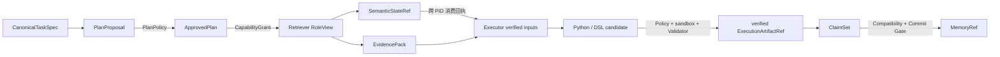

# 整套答辩逻辑与叙事主线

## 这套 PPT 真正要证明什么

StateBus 的核心主张不是“我们搭了四个 Agent”，也不是“我们用了 Protobuf、共享内存和向量数据库”。这些技术单独存在都不新。真正需要让评委接受的是：当多 Agent 协作从一次问答变成长证据、多步骤和连续任务时，传统全文 handoff 把控制指令、数值状态、执行产物和历史经验混在同一文本通道中，导致下游反复读取、重建和重新判断可信性。StateBus 把这些不同对象拆开，由 Runtime 赋予类型、身份、授权、回执、验证和生命周期，再在质量不下降的前提下减少文本与线路负担。

因此整场答辩围绕一句话展开：

> Agent 负责需要模型完成的语义判断，Runtime 负责把每次协作变成受控、可验证、可追溯的对象交接。

这句话同时解释了结构化通信、非文本状态、共享记忆和 CodeAct，避免四项功能看起来像互不相关的模块拼装。

## 28 页的论证链

P4 不是泛泛讲“大模型成本高”，而是指出一个系统设计错误：同一条文本通道承担了三种语义完全不同的对象。控制合同被写成自然语言后不可预检；向量被写成数字列表或摘要后失去数值身份；历史摘要被直接拼入 Prompt 后，相似性被误当成兼容性。P4 给出的是根因，不只是现象。

P5 随即把抽象问题落到一条三轮跨期财报任务上。R1 提取 2026Q1 营收 120，R2 提取 2025Q4 营收 109，R3 计算差值 11 和环比 10.09%。这页的作用不是展示财务知识，而是让评委看到四个角色连续交付时，系统必须同时保证口径、证据、计算和复用。后面所有机制都可以回到这条任务链解释。

P6 给出统一回答。最上层是四角色业务顺序；中间不是一条越来越长的聊天记录，而是 Runtime 管理的三条对象通道：控制合同、非文本状态、验证产物与记忆。控制合同回答“谁获准做什么”；状态引用回答“数值对象在哪里、由谁消费”；产物与记忆回答“结果何时可信、何时能进入下一任务”。这一页是整套 PPT 的总地图。

P8—P14 逐项展开总地图。每个亮点都采用相同论证模板：普通方案能做到什么、StateBus 多解决了哪一层 Runtime 问题、对象怎样流动、边界是什么。这样的讲法比罗列功能更有说服力。

P16—P18 不是重复亮点，而是回答“为什么这件事难”。P16 说明消息格式正确不等于操作获准；P17 说明低复制和可信状态存在张力；P18 说明语义相似和跨任务兼容不是同一维度。难点页为前面的机制提供设计必要性，也为后面的实验指标提供分母。

P20—P25 则把前面的主张逐项变成证据。P20 先定义任务、分层和公平条件；P21 给完整链总览；P22 验证通信与效率；P23 验证非文本状态的跨进程消费和行为效果；P24 验证记忆的候选、兼容、消费与效果；P25 验证不是单任务脚本，也没有依赖 fallback。P27 的演示最后把静态证据还原为一个真实任务的动态对象流。

## 四项机制不是四座孤岛

结构化通信决定 Runtime 怎样表达任务、步骤、尝试、角色、能力和输入引用。没有这层合同，SemanticStateRef 只是一个无法授权的共享内存名称，MemoryRef 也无法限定目标角色，CodeAct 更无法知道自己可以读取哪些输入、必须写出什么结果。

非文本状态把检索阶段的 query/candidate embedding 保持为连续 `float32` 矩阵。控制面只传 Ref，但 Ref 绑定 shape、dtype、hash、encoder signature、manifest、lease 和 producer。另一个 PID 的 Selector 打开同一对象、执行 top-k 并返回 selected IDs，Runtime 再局部 hydrate 原始证据。它依赖结构化控制来传递身份和授权，也为 Executor 提供更小、更明确的证据面。

共享记忆不是状态池的长期版本。SemanticStateRef 服务于一次任务或步骤的短期数值选择；MemoryRef 服务于跨任务的候选检索和安全复用。记忆必须经过混合召回、Compatibility Gate、目标角色 RoleView、真实 consumption 和 behavioral effect。只有这样，历史经验才可能减少当前工作，而不会绕过当前任务质量门。

CodeAct 把执行结果从自然语言回答变成可运行、可验证的文件产物。它读取的是 CapabilityGrant 允许的 EvidencePack、StateRef 或 MemoryRef，输出先成为 candidate Artifact；静态 Policy、bubblewrap 和业务 Validator 全部通过后，才提升为 verified `ExecutionArtifactRef`。Summarizer 和 Memory Commit 只读取 verified 产物，因此 CodeAct 实际上封闭了整条对象链的可信出口。

把四项机制连接起来，可以得到一条稳定对象链：

## 三条贯穿全场的横向主线

第一条是身份链。`task_id` 标识业务任务，`step_id` 标识批准计划中的逻辑步骤，`attempt_id` 标识一次具体执行，`trace_id` 贯穿整次运行。TaskSpec、ApprovedPlan、Grant、StateRef、ArtifactRef 和 MemoryRef 通过 hash 相连。评委看到的不是几个对象名称，而是一条可以从结论回到输入的身份链。

第二条是生成权与批准权分离。Planner 可以提出计划但不能批准；Retriever 可以构造候选但不能宣布证据完整；Executor 可以生成代码但不能验证自己的业务结果；Memory Retriever 可以返回相似历史但不能决定它兼容。所有状态提升都由 Runtime 的确定性策略完成。

第三条是失败也必须形成终态。计划拒绝不启动 Worker，StateRef 校验失败不映射 payload，CodeAct Policy 失败不进入沙箱，Artifact Validator 失败不让 Summarizer 看见，Memory 不兼容则记录原因并重算。成功和失败最终都进入 settlement、Telemetry 和 GC。这是“系统机制”与“演示脚本”的重要区别。

## 亮点、难点与实验怎样一一对应

| 前面提出的主张 | 真正的实现难点 | PPT 实验证据 |
|:--|:--|:--|
| 结构化消息成为可执行合同 | 格式合法不等于语义获准；计划、Grant 和发送瞬间都要校验 | P22：50 条逻辑消息不变，control bytes 降低 83.05%，质量 10/10 |
| 非文本状态跨进程真实消费 | 只传 handle 不可信，重传矩阵又失去低复制价值 | P23：9/9 跨 PID 消费、9/9 改变选择、294,912 B 全量释放 |
| 共享记忆形成实际复用 | 相似度不能判断 schema、lineage、runtime 和角色兼容 | P24：actual-use 7/20；39/48 不兼容候选被拒绝；2 次跳步 |
| CodeAct 形成可信产物 | 模型生成代码、OS 隔离和业务正确性是三个不同边界 | P25：18/18 受限 Python、7/7 DSL、25/25 Validator、0 fallback |
| 完整链降低综合开销 | 必须保持同任务、同角色、同模型、同质量门和串行运行 | P21/P22：Token -47.40%、wire -64.85%、总耗时 -6.32%、质量不变 |

实验页不要孤立地念百分比。每个数字都应回扣一个机制主张。例如讲 `9/9` 时必须同时说“不同 PID、改变选择、最后释放”，否则只证明对象存在；讲 `7/20` 时必须先说明这是查询级分母，再说明 `39/48` 是候选级分母，不能把两者直接相除。

## 与赛题要求的关系

赛题要求至少三类 Agent、结构化通信、非文本中间状态、共享记忆、两组连续任务、通信/时延/复用统计，以及 openEuler 交付。StateBus 使用四角色链回应 Agent 要求；以 UDS + typed Protobuf 和 Runtime 合同回应结构化通信；以 SemanticStateRef 和跨 PID 消费回应非文本状态；以 MemoryRef、Compatibility Gate 和 actual-use 回应共享记忆；以 Financial/Operating 两组各十轮回应连续任务；P20—P25给出统一实验口径；最终以 openEuler 24.03 LTS-SP3 单容器验证回应交付环境。

CodeAct 和 StateBus Studio 是在核心赛题机制之上的加分项。CodeAct 证明执行结果可验证，Studio 证明这些机制不是只能在离线 JSON 中查看，而可以产品化地还原任务、对象、代码和回执。

## 现场表达的重点与边界

不要说“我们让 LLM 直接读取 embedding”。实际消费者是数值 Selector，LLM 读取的是 selected IDs 对应的局部原始证据。不要说“我们实现了 KV cache 或 hidden state 跨 Agent 传递”。当前正式能力是 embedding/candidate matrix；KV 只属于 Future Work / Engine-Local Prefix Reuse。

不要把 18 个 Python 和 7 个 DSL 解释成优劣对比，它们只是 25 个批准任务的执行表示分布。也不要说 95 个不同任务；95 是 40 次效率配置、20 次连续运行、10 次机制真实性和 25 次能力覆盖的正式执行记录。

时延的表述限定为 PPT 固定基线中的 10 个匹配任务总 `task_ms`：315.678 秒降到 295.728 秒。它说明这组固定任务上的描述性结果，不应扩展成“StateBus 在任何负载下都必然加速”。真正稳固且最醒目的主线仍是质量保持、Token 和线路字节显著下降，以及机制真实性闭环。

新增的 Logit Retry Gate 可以在问答中作为“同一 Ref 框架还能承载决策概率状态”的补充：12 个受控 case 中 Validator 从 8/12 提升到 12/12，19/19 数值状态由独立 PID 消费并释放。但它是 7 月 27 日后的独立机制挑战，不属于 PPT 的 95/95 固定基线，也不用于声称 Token 或时延收益。

