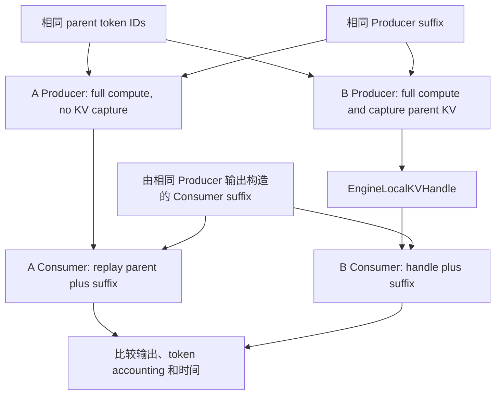
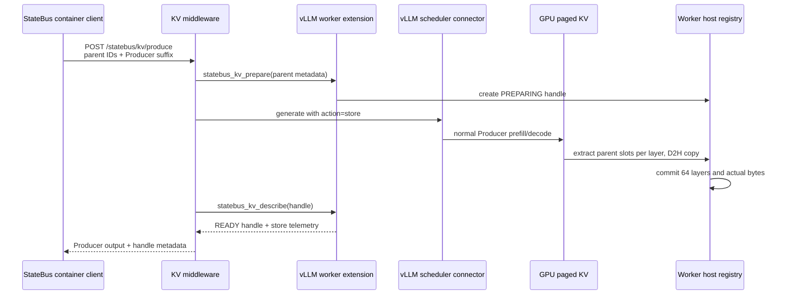
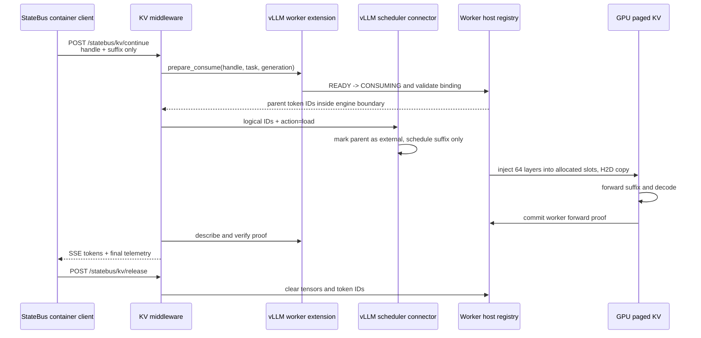
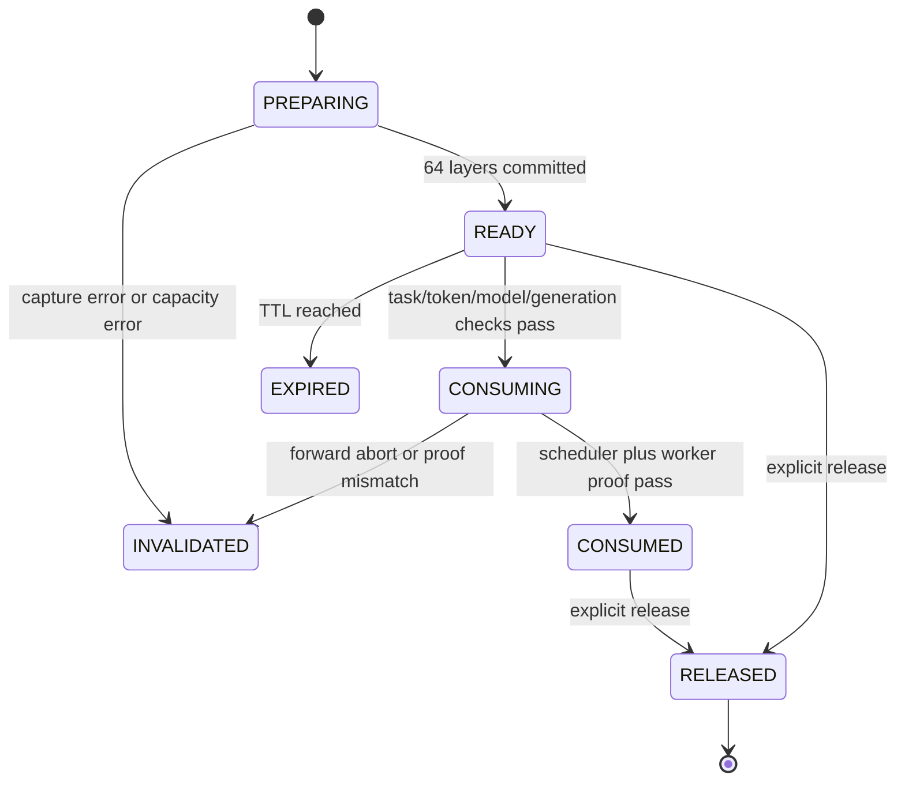

# StateBus 显式 Engine-Local KV Continuation 实现与实验结果报告

日期：2026-07-30（Asia/Shanghai）
状态：正式小轮实验完成，证据审计通过，原 latent 53334 服务已恢复
实验分支：`feat/engine-local-kv-result-probe`
基线提交：`cc34e5c62e27ea50cb34b5961731c7a39b8c6aa4`
正式 run：`kv-formal-ab3-20260730_063534`
术语：`Experimental Engine-Local Prefix Reuse implemented by explicit KV continuation`

---

## 1. 结论

本轮在物理卡 1 的单个 Qwen3-32B vLLM 0.9.2 Worker 内完成了真实 paged KV 的显式保存和恢复。它不是 Automatic Prefix Caching，也不是 hidden embedding 或 latent state。容器侧只通过私有 HTTP API 传递 KV handle 和 Consumer suffix；真实 KV tensor 留在模型 Worker 内，并在 GPU paged cache 与 Worker host buffer 之间执行 D2H/H2D 搬运。

正式实验的主结果如下：

1. 6k 档 Consumer TTFT p50 从 `2196.691 ms` 降至 `428.792 ms`，下降 `80.5%`。
2. 6k 档 Consumer 实际重算 prefill token 从 `6395` 降至 `251`，下降 `96.1%`；另外 `6144` token 由显式 KV 恢复。
3. 三档混合总体 p50 的 TTFT 从 `1453.896 ms` 降至 `377.636 ms`，下降 `74.0%`；computed prefill 从 `4304` 降至 `208`，下降 `95.2%`。
4. Consumer API 请求体总体 p50 从 `18197 B` 降至 `1294 B`，下降 `92.9%`。
5. 包含 Producer、KV store、Consumer、KV load、decode 和 release 的完整 chain wall time，总体 p50 从 `12368.993 ms` 降至 `11423.713 ms`，下降 `7.6%`。
6. 18/18 条正式记录成功，9/9 组 A/B 的逻辑 token digest、Producer 输出 token、Consumer 首 token和 Consumer 完整输出 token 完全一致。
7. 4k 和 6k 的 A/B 质量均为 3/3；2k 的 A/B 均为 0/3，唯一原因是模型风险描述包含 `supplier` 但没有包含评分器要求的字面词 `encoder`。2k 的数值、字段、A/B 输出均一致，未事后改分。
8. 所有 B handle 都已释放；实验结束后 `registry_entries=0`、`registry_bytes=0`。

因此，本轮可以使用的结果是：显式 KV continuation 在同一 Qwen3-32B Worker 内显著减少了下游重复 prefill 计算和首 token 延迟，并带来较小但稳定为正的完整链路收益。它没有减少逻辑 prompt token，也不应表述为计费 token 下降。

---

## 2. 实验边界

本轮只验证以下能力：

- 同一 Worker、同一模型实例、同一 engine generation 内的显式 KV continuation；
- Producer 捕获一个 block-aligned shared parent 的真实 KV；
- Consumer 通过 handle 恢复 parent KV，只计算新的 suffix；
- 任务结束后 consume-once 并释放；
- 不训练、不修改模型权重、不运行 prefix/APC 对照。

本轮不声称以下能力：

- 跨 Worker、跨 GPU、跨实例或跨重启的 KV 迁移；
- KV 落盘、CAS 持久化或 StatePool 长期保存；
- 多租户生产级隔离、并发调度或容灾；
- 自动 prefix cache 命中率提升；
- 逻辑 token、上下文长度或 API 计费 token 减少；
- openEuler VM 最终交付兼容性。

`Prefix Reuse` 只是项目中的能力边界名称。实验变量始终是显式 KV handle 是否参与 Consumer forward，APC 在服务启动参数和 health 中均为关闭状态。

---

## 3. 分支与环境

### 3.1 代码位置

本轮没有在用户当前主工作区直接改造，而是从 clean-room v2 基线建立独立 worktree：

```text
feat/statebus-v2-container-runtime @ cc34e5c
    |
    +-- feat/engine-local-kv-result-probe
        /home/qcrs/statebus/work/engine-local-kv-result-probe
```

正式 manifest 记录了 `dirty_worktree=true`。这表示实现文件尚未提交；`cc34e5c` 是基线提交，不是新增 KV 代码已经落库后的提交。所有新增、修改文件均保留在分支工作区和 manifest 的 `git_status` 中。

### 3.2 运行环境

| 项目 | 实际值 |
| --- | --- |
| 调用容器 | `statebus-dev-qcrs` |
| 容器激活脚本 | `source docker/activate_statebus_container.sh` |
| 调用方式 | 容器通过 URL 调 vLLM，不在调用容器加载 32B 权重 |
| API | `http://127.0.0.1:53334` |
| 临时模型容器 | `statebus-vllm-kv-probe` |
| Docker 网络 | host |
| Docker GPU request | `DeviceIDs=["1"]` |
| 物理 GPU | `1, NVIDIA A100 80GB PCIe` |
| 容器内 GPU 编号 | `cuda:0`，仅表示容器唯一可见设备，映射到物理卡 1 |
| 模型 | `/data/models/Qwen3-32B` |
| served model | `qwen3-32b` |
| vLLM | `0.9.2`, V1 engine |
| dtype | BF16 |
| TP / PP | 1 / 1 |
| max model length | 8192 |
| max sequences | 1 |
| block size | 16 token |
| APC | disabled |
| 采样 | temperature 0, seed 7 |
| host KV tier | `worker_pageable_host` |

物理卡 0 没有运行本轮容器。正式证据审计直接检查 Docker `DeviceRequests`，结果为 `physical_gpu_one_only=true`。卡 0 当时存在其他既有负载，但与本轮 KV 服务无关。

服务启动日志给出的资源事实：

- Qwen3-32B 权重加载占用 `61.0347 GiB`，加载耗时 `14.733 s`；
- 可用于 vLLM GPU KV cache 的空间为 `2.37 GiB`；
- GPU KV cache 容量为 `9696 token`；
- 8192-token 请求的最大并发为 `1.18x`；
- 归档时卡 1 显存为 `69992 / 81920 MiB`，GPU utilization 为 0，说明实验已经结束并空闲。

### 3.3 实验后的服务恢复

正式证据归档后，临时容器 `statebus-vllm-kv-probe` 已正常停止并删除。53334 已恢复为原能力组合：Qwen3-32B、vLLM V0、Automatic Prefix Caching、prompt embeds、`LatentWorkerExtension` 和 `LatentHandoffMiddleware`。

恢复服务运行在容器 `statebus-vllm-latent-restored`。验证结果：

- `GET /health`：200；
- `GET /v1/models`：返回 `qwen3-32b`，`max_model_len=8192`；
- `GET /statebus/latent/health`：`status=ready`；
- `worker_extension_ready=true`；
- `prompt_embeds_enabled=true`；
- `registry_entries=0`、`registry_bytes=0`；
- Docker `DeviceIDs=["1"]`；
- 容器内唯一 GPU 的 UUID 为 `GPU-a53fa601-8471-d782-2971-46e5a8e5d328`，与主机物理卡 1 一致；
- 恢复后物理卡 1 显存为 `66328 / 81920 MiB`，物理卡 0 没有被恢复容器暴露。

容器内日志显示 `cuda_visible_devices=0`，这是 Docker 已先把可见设备限制为物理卡 1 后的局部编号，不是主机物理卡 0。

以上 `/v1/models` 和 latent readiness 也已从 `statebus-dev-qcrs` 内先执行 `source docker/activate_statebus_container.sh`，再通过 URL 复验通过，因此恢复的是实际 StateBus 容器调用路径，不只是宿主机本地访问。

---

## 4. A/B 到底比较什么

### 4.1 相同部分

每一组 A/B 都固定以下条件：

- 同一个 Qwen3-32B 服务；
- 同一个 parent token ID 序列；
- 同一个 Producer suffix；
- 同一个 Producer 生成配置；
- 同一个 Producer 输出 token 序列；
- 同一个 Consumer suffix；
- 同一个 Consumer 生成配置；
- 每条链都是一次 Producer 调用加一次 Consumer 调用；
- Consumer 的逻辑输入都是 `parent_ids + consumer_suffix_ids`。

### 4.2 唯一实验变量



Lane A：

```text
Consumer API payload = parent_token_ids + suffix_token_ids
computed_prefill_tokens = parent_tokens + suffix_tokens
inherited_kv_tokens = 0
```

Lane B：

```text
Consumer API payload = handle_id + suffix_token_ids
logical prompt = parent_token_ids + suffix_token_ids
computed_prefill_tokens = suffix_tokens
inherited_kv_tokens = parent_tokens
```

Lane B 的 middleware 会在 vLLM 内部从 Worker registry 取回 parent token IDs，用于恢复完整的逻辑序列和 scheduler block 分配。长 parent 不经过 StateBus Consumer API 请求体；scheduler 将 parent 标成 external tokens，Worker connector 把 KV 注入新分配的 paged blocks，然后模型只 forward suffix。

这里没有“prefix 命中率为 0”或“prefix 命中率提高”的比较。`num_cached_tokens_reported` 在 B 中等于显式加载的 parent token 数，是 vLLM 对 external KV 的通用字段，不是 APC hit count。

---

## 5. 实现流程

### 5.1 Producer 保存 KV



Producer 的生成 prompt 是 `parent + producer_suffix`，但 connector 只按照 `prefix_len=parent_tokens` 抽取 parent 对应 slots。Producer 角色指令、Producer 生成 token 和后续 Consumer 指令不会被写入该 handle，因此 Consumer 可以在同一个稳定 parent 上追加新的角色 suffix。

### 5.2 Consumer 恢复 KV



### 5.3 Paged KV 搬运

`paged_cache.py` 不假定连续的逻辑 KV，而是从 vLLM block table 构造 slot mapping：

```text
slot = block_id * block_size + offset
```

Store 时逐层执行：

1. 根据 scheduler 分配的 block IDs 生成 parent slot mapping；
2. 从 combined 或 split KV tensor 中 `index_select` 对应逻辑 slots；
3. 将抽出的 tensor 复制到 CPU host tensor；
4. 用真实 `element_size * numel` 累计字节数；
5. 64 层全部到齐后才能将 handle 从 `PREPARING` 提交为 `READY`。

Load 时逐层执行：

1. Consumer scheduler 为完整逻辑序列分配新的 blocks；
2. 从 Worker registry 读取该层 host tensor；
3. 将 source tensor 转到目标 GPU/dtype；
4. 用 `index_copy_` 注入 parent slots；
5. CUDA 同步后记录 load 时间、层数和实际字节数；
6. suffix forward 完成后生成 `KVForwardProof`。

正式运行使用 pageable host memory，不是 pinned memory。启动脚本显式设置 `STATEBUS_KV_PIN_MEMORY=false`，health 和 manifest 也记录 `registry_pin_memory=false`；报告不把它包装成零拷贝或 pinned-host 结果。

### 5.4 Scheduler 和 Worker 双证明

只返回一个 handle 不算 KV 成功。本实现要求两类证明同时成立：

1. Scheduler proof：`inherited_kv_tokens=parent_tokens`，`computed_prefill_tokens=suffix_tokens`，且 APC 的本地 computed tokens 必须为 0。
2. Worker proof：connector 确实加载 1 次、64 层、正确字节数，并绑定 handle、request、task、token digest 和 engine generation。

Middleware 在返回成功前重新读取 Worker proof，并逐字段检查：

```text
logical_prompt_tokens = inherited_kv_tokens + computed_prefill_tokens
computed_prefill_tokens = suffix_tokens
connector_load_count = 1
handle.status = consumed
```

任一项缺失或不一致会返回 `kv_consumer_forward_not_observed`，不会静默回退成 full replay 后仍记作 B。

### 5.5 Handle 生命周期与兼容校验



正式配置：

- `max_entries=2`；
- `max_bytes=2 GiB`；
- `TTL=300 s`；
- `one_shot=true`；
- 每个 handle 在 runner 的 `finally` 中释放；
- 容量不足时只允许淘汰 READY/CONSUMED 的最老 entry，不能覆盖正在 PREPARING/CONSUMING 的 entry。

兼容签名固定以下字段：engine ID、engine generation、model ID、model revision digest、tokenizer digest、dtype、block size、layer count、TP/PP、max sequence、APC 状态和 connector 配置。服务重启或任一关键配置变化后旧 handle 会 fail closed。

### 5.6 API 与安全边界

私有接口：

```text
GET  /statebus/kv/health
POST /statebus/kv/produce
POST /statebus/kv/continue
POST /statebus/kv/release
```

实验实现包含以下低成本约束：

- 仅允许 loopback client；
- Bearer token 从 `0600` token file 读取并用 constant-time compare 校验；
- token file 内容不进入 manifest、报告或日志；
- RPC method 有固定 allowlist；
- request body 上限 8 MiB；
- 私有请求用 asyncio lock 串行执行；
- handle 使用随机 UUID，绑定 task、token digest 和 engine generation；
- API 不返回 raw KV tensor 或内部 block IDs。

本次正式服务启动时 vLLM 默认 INFO request logging 仍然开启，因此归档的 `kv_service_full.log` 包含本轮离线财报 prompt 和 token IDs。它不包含 KV tensor或 API bearer token，但该日志仍应按任务输入数据管理。实验素材是仓库内离线样本，没有接入真实业务数据。发现这一点后，启动脚本已加入 `--disable-log-requests`，后续启动默认不再记录请求正文；本报告仍如实保留正式 run 当时的状态。

这套措施不是生产级多租户安全证明。生产接入还需要日志访问控制、租户级 handle namespace、速率/容量配额和进程内存威胁模型。

---

## 6. 任务适配与“编译器”含义

### 6.1 任务为何重建

原 prefix/APC 任务没有修改也没有运行。本轮新建了独立的 `engine_local_kv_continuation` task family，复用 Orion 与 Nova 离线经营报告作为语义种子，再加入确定性的区域经营台账、供应商/承运商资格登记和月度异常说明，使上下文能稳定达到 2k、4k、6k，同时保持内容有业务意义。

三档任务：

| case | source | parent | Producer suffix | 正式 Consumer suffix | 逻辑 Consumer input | 输出上限 | KV bytes |
| --- | --- | ---: | ---: | ---: | ---: | ---: | ---: |
| `kv-fin-2k-orion` | Orion | 2048 | 96 | 195 | 2243 | 96 | 512 MiB |
| `kv-fin-4k-nova` | Nova | 4096 | 105 | 208 | 4304 | 96 | 1 GiB |
| `kv-fin-6k-cross-company` | Orion + Nova | 6144 | 113 | 251 | 6395 | 160 | 1.5 GiB |

Consumer suffix 包含固定的 Final Summarizer 指令和本轮 Producer draft，因此它的精确长度由 deterministic Producer 输出决定。正式 run 中 A/B 的 Producer 输出 token 完全一致，所以每档 A/B 的 Consumer suffix 也完全一致。

### 6.2 编译器不训练，也不根据答案调 prompt

`compile_engine_local_kv_tasks.py` 的作用只是把文本任务固化成可复现实验 token：

1. 读取离线源文档与确定性附录；
2. 构造统一 system/user shared parent；
3. 调同一 Qwen3-32B vLLM 的 tokenizer endpoint；
4. 按目标 token 数截取 `2048/4096/6144` 个 token ID；
5. detokenize 后再次 tokenize，要求 token IDs 完全 roundtrip；
6. 检查 16-token block 对齐和 7168-token 逻辑预算；
7. 保存 parent text、token IDs、source digest 和 token digest。

它不会提交任务看答案后搜索 prompt，也不修改权重。`expected_json` 只由离线评分器读取，不被拼入模型 prompt。模型能看到的答案依据来自任务本来就提供的 authoritative Metric Table，这属于输入证据，不是评测答案泄露。

### 6.3 适配过程中的两次调整

第一版 6k microprobe 使用 96-token Producer/Consumer 输出上限，A/B 都在同一位置截断 JSON。为了让任务可以完成，随后只对 6k case 将两端输出上限提高到 160。parent token IDs、parent digest、任务指令、A/B 变量均未改变。

第二次 6k probe 已输出完整且数值正确的 JSON，但 `higher_churn` 返回明确简称 `Orion`，原评分器只接受全称 `Orion Factory Systems`。评分规则随后改为接受包含 `Orion` 的明确公司名。该调整只修正等价文本评分，不改变 prompt 或模型输出。

2k 的 `delivery_risk` 结果没有做类似放宽。模型写出 `Supplier misses and training delays...`，但缺少预设关键词 `encoder`，因此正式结果继续保留 A/B 0/3。

---

## 7. 实验方法

### 7.1 正式顺序

每档先执行一次 A warmup 和一次 B warmup，然后固定执行：

```text
A - B - B - A - A - B
```

因此每档正式 A/B 各 3 次，三档共 18 条正式记录；加上 6 条 warmup，共 24 条原始输出。所有调用严格串行，`max_num_seqs=1`，符合 API latency 必须使用 serialized rerun 的项目约束。

正式 run 的 UTC 时间为 `2026-07-29 22:35:48` 到 `22:40:57`，对应上海时间 `2026-07-30 06:35:48` 到 `06:40:57`。

### 7.2 指标定义

| 指标 | 定义 |
| --- | --- |
| logical input tokens | Consumer 语义上看到的 `parent + suffix`，A/B 必须相同 |
| computed prefill tokens | 本次 Consumer forward 实际重算的 prompt token |
| inherited KV tokens | connector 从 handle 恢复的 parent token |
| Consumer TTFT | 调用容器发出 SSE 请求到收到第一个非空 token event |
| server first output | vLLM middleware 调用 generate 到第一个输出 chunk |
| Consumer client wall | Consumer SSE 请求完整结束时间 |
| chain wall | Producer 开始到 Consumer 完成且 handle release 结束 |
| KV store/load | connector 内逐层 D2H/H2D 搬运与同步时间 |
| API request bytes | Consumer `/continue` JSON body 序列化字节数 |
| quality | 固定 JSON key、数值容差和预设关键词校验 |

TTFT 是最直接的下游复用收益。Chain wall 把 B 的 KV capture/store 成本也计算进去，因此更接近“只消费一次 handle”时的真实链路收益。

### 7.3 成功门槛

B 只有同时满足以下条件才记成功：

- `inherited_kv_tokens=parent_tokens>0`；
- `computed_prefill_tokens=suffix_tokens`；
- `connector_load_count=1`；
- 64 层和实际 KV bytes 完整；
- scheduler proof 与 Worker proof 一致；
- A/B logical token digest 相同；
- A/B Producer 和 Consumer 输出 token digest 相同；
- handle 最终 release；
- 无静默 full-replay fallback。

---

## 8. 正式结果汇总

### 8.1 主结果

| 档位 | A TTFT p50 | B TTFT p50 | TTFT 降幅 | A/B computed prefill | 重算降幅 | A/B chain p50 | chain 降幅 |
| --- | ---: | ---: | ---: | ---: | ---: | ---: | ---: |
| 2k | 731.630 ms | 215.164 ms | 70.6% | 2243 / 195 | 91.3% | 10226.176 / 9752.324 ms | 4.6% |
| 4k | 1453.896 ms | 377.636 ms | 74.0% | 4304 / 208 | 95.2% | 12368.993 / 11423.713 ms | 7.6% |
| 6k | 2196.691 ms | 428.792 ms | 80.5% | 6395 / 251 | 96.1% | 17172.241 / 16171.782 ms | 5.8% |
| 总体混合 p50 | 1453.896 ms | 377.636 ms | 74.0% | 4304 / 208 | 95.2% | 12368.993 / 11423.713 ms | 7.6% |

### 8.2 Consumer wall 与 API payload

| 档位 | A/B server first p50 | 降幅 | A/B client wall p50 | 降幅 | A/B request bytes p50 | 降幅 |
| --- | ---: | ---: | ---: | ---: | ---: | ---: |
| 2k | 720.995 / 205.449 ms | 71.5% | 5229.522 / 4527.240 ms | 13.4% | 10367 / 1262 B | 87.8% |
| 4k | 1437.099 / 359.509 ms | 75.0% | 6142.340 / 5231.673 ms | 14.8% | 18197 / 1294 B | 92.9% |
| 6k | 2168.542 / 404.476 ms | 81.3% | 8624.096 / 6817.462 ms | 20.9% | 27630 / 1499 B | 94.6% |

### 8.3 KV 搬运代价

| 档位 | inherited token | KV bytes | B store p50 | B load p50 | registry peak |
| --- | ---: | ---: | ---: | ---: | ---: |
| 2k | 2048 | 536870912 B / 512 MiB | 820.964 ms | 107.786 ms | 1 entry |
| 4k | 4096 | 1073741824 B / 1 GiB | 1533.645 ms | 244.577 ms | 1 entry |
| 6k | 6144 | 1610612736 B / 1.5 GiB | 2581.592 ms | 277.930 ms | 1 entry |

Qwen3-32B BF16 在此 layout 下每个 parent token 对应约 256 KiB KV。KV store 随长度近似增长，是完整链路收益远小于 TTFT 收益的主要原因。Load 明显快于 store，但仍不是零成本。

### 8.4 输出与质量

| 检查 | 2k | 4k | 6k | 总计 |
| --- | ---: | ---: | ---: | ---: |
| A success | 3/3 | 3/3 | 3/3 | 9/9 |
| B success | 3/3 | 3/3 | 3/3 | 9/9 |
| logical token digest match | 3/3 | 3/3 | 3/3 | 9/9 |
| Producer output token match | 3/3 | 3/3 | 3/3 | 9/9 |
| Consumer first token match | 3/3 | 3/3 | 3/3 | 9/9 |
| Consumer complete output token match | 3/3 | 3/3 | 3/3 | 9/9 |
| quality A | 0/3 | 3/3 | 3/3 | 6/9 |
| quality B | 0/3 | 3/3 | 3/3 | 6/9 |
| quality parity | 3/3 | 3/3 | 3/3 | 9/9 |

2k 的实际 Consumer 输出包含正确的 `company=Orion Factory Systems`、`q1_rev=184`、`q3_rev=211`、`rev_delta=27`、`q3_margin=39.7`，风险字段为：

```text
Supplier misses and training delays on the consolidated line reduced on-time delivery to 90.8% in Q3.
```

唯一评分错误是 `delivery_risk_keywords_missing:encoder`。A/B 六条正式输出在 token 层面完全相同，所以这是任务/评分结果，不是 KV 导致的质量回归。

---

## 9. 18 条正式运行明细

`KV MiB` 与 `release` 只对 B 有意义；A 没有创建 handle。

| seq | case | lane | repeat | computed/inherited | TTFT ms | client wall ms | chain ms | store/load ms | KV MiB | request bytes | output tok | quality | release | success |
| ---: | --- | --- | ---: | ---: | ---: | ---: | ---: | ---: | ---: | ---: | ---: | --- | --- | --- |
| 3 | 2k | A | 1 | 2243 / 0 | 728.747 | 5203.163 | 10184.355 | 0 / 0 | 0 | 10367 | 91 | fail: encoder | n/a | true |
| 4 | 2k | B | 1 | 195 / 2048 | 215.164 | 4527.240 | 9752.324 | 820.964 / 107.786 | 512 | 1262 | 91 | fail: encoder | released | true |
| 5 | 2k | B | 2 | 195 / 2048 | 222.315 | 4783.586 | 9899.766 | 741.069 / 110.453 | 512 | 1262 | 91 | fail: encoder | released | true |
| 6 | 2k | A | 2 | 2243 / 0 | 731.630 | 5229.522 | 10226.176 | 0 / 0 | 0 | 10367 | 91 | fail: encoder | n/a | true |
| 7 | 2k | A | 3 | 2243 / 0 | 735.779 | 5242.460 | 10238.901 | 0 / 0 | 0 | 10367 | 91 | fail: encoder | n/a | true |
| 8 | 2k | B | 3 | 195 / 2048 | 210.973 | 4523.420 | 9726.927 | 828.896 / 104.445 | 512 | 1262 | 91 | fail: encoder | released | true |
| 11 | 4k | A | 1 | 4304 / 0 | 1453.896 | 6142.340 | 12368.993 | 0 / 0 | 0 | 18197 | 95 | pass | n/a | true |
| 12 | 4k | B | 1 | 208 / 4096 | 377.636 | 5231.673 | 11423.713 | 1532.195 / 244.577 | 1024 | 1294 | 95 | pass | released | true |
| 13 | 4k | B | 2 | 208 / 4096 | 441.819 | 5272.508 | 11533.846 | 1619.644 / 311.151 | 1024 | 1294 | 95 | pass | released | true |
| 14 | 4k | A | 2 | 4304 / 0 | 1453.706 | 6174.249 | 12134.961 | 0 / 0 | 0 | 18197 | 95 | pass | n/a | true |
| 15 | 4k | A | 3 | 4304 / 0 | 1459.249 | 5978.200 | 13070.412 | 0 / 0 | 0 | 18197 | 95 | pass | n/a | true |
| 16 | 4k | B | 3 | 208 / 4096 | 326.635 | 5038.406 | 11360.170 | 1533.645 / 195.276 | 1024 | 1294 | 95 | pass | released | true |
| 19 | 6k | A | 1 | 6395 / 0 | 2233.481 | 8634.409 | 17227.266 | 0 / 0 | 0 | 27630 | 130 | pass | n/a | true |
| 20 | 6k | B | 1 | 251 / 6144 | 414.369 | 6696.998 | 15826.360 | 2556.349 / 269.458 | 1536 | 1499 | 130 | pass | released | true |
| 21 | 6k | B | 2 | 251 / 6144 | 657.261 | 7033.605 | 16171.782 | 2581.592 / 513.115 | 1536 | 1499 | 130 | pass | released | true |
| 22 | 6k | A | 2 | 6395 / 0 | 2191.779 | 8624.096 | 17171.598 | 0 / 0 | 0 | 27630 | 130 | pass | n/a | true |
| 23 | 6k | A | 3 | 6395 / 0 | 2196.691 | 8590.338 | 17172.241 | 0 / 0 | 0 | 27630 | 130 | pass | n/a | true |
| 24 | 6k | B | 3 | 251 / 6144 | 428.792 | 6817.462 | 16363.039 | 2905.036 / 277.930 | 1536 | 1499 | 130 | pass | released | true |

所有 B 的 `connector_load_count=1`、`layer_count=64`；B 的 `num_cached_tokens_reported` 分别为 2048、4096、6144。所有正式记录 `error_code` 和 `error_detail` 为空。

---

## 10. Warmup 明细

| seq | case | lane | computed/inherited | TTFT ms | chain ms | store/load ms | KV MiB | quality | release | success |
| ---: | --- | --- | ---: | ---: | ---: | ---: | ---: | --- | --- | --- |
| 1 | 2k | A | 2243 / 0 | 734.825 | 10073.003 | 0 / 0 | 0 | fail: encoder | n/a | true |
| 2 | 2k | B | 195 / 2048 | 219.561 | 9697.030 | 818.562 / 107.261 | 512 | fail: encoder | released | true |
| 9 | 4k | A | 4304 / 0 | 1446.389 | 12142.547 | 0 / 0 | 0 | pass | n/a | true |
| 10 | 4k | B | 208 / 4096 | 324.822 | 11208.452 | 1700.580 / 188.946 | 1024 | pass | released | true |
| 17 | 6k | A | 6395 / 0 | 2201.831 | 17238.005 | 0 / 0 | 0 | pass | n/a | true |
| 18 | 6k | B | 251 / 6144 | 510.159 | 16303.184 | 2715.953 / 366.957 | 1536 | pass | released | true |

Warmup 只用于稳定服务状态，没有进入正式 p50。

---

## 11. Microprobe 演进日志

每个 microprobe 都只有一组 A/B，不作为正式 p50；它们完整保留了从机制验证到任务适配的过程。

| run | parent | A/B TTFT ms | TTFT 降幅 | A/B computed | chain A/B ms | store/load ms | KV | A/B quality | 结论 |
| --- | ---: | ---: | ---: | ---: | ---: | ---: | ---: | --- | --- |
| `kv-microprobe-512-20260730_062241` | 512 | 247.286 / 174.760 | 29.3% | 701 / 189 | 8355.438 / 8347.109 | 236.310 / 79.009 | 128 MiB | 1/1, 1/1 | 最小真实 slot store/load 成立；chain 基本持平 |
| `kv-microprobe-2k-20260730_062344` | 2048 | 725.709 / 364.967 | 49.7% | 2243 / 195 | 10310.653 / 9932.854 | 919.403 / 259.518 | 512 MiB | 0/1, 0/1 | 机制成立；同一 encoder 关键词失败 |
| `kv-microprobe-4k-20260730_062512` | 4096 | 1411.092 / 314.715 | 77.7% | 4304 / 208 | 11860.045 / 11549.575 | 1841.963 / 183.780 | 1 GiB | 1/1, 1/1 | 4k TTFT 收益明显 |
| `kv-microprobe-6k-20260730_062619` | 6144 | 2190.514 / 861.779 | 60.7% | 6362 / 218 | 13813.408 / 13427.475 | 2843.415 / 719.681 | 1.5 GiB | 0/1, 0/1 | 96-token 上限使 A/B 同位置截断 JSON |
| `kv-microprobe-6k-output160-20260730_063141` | 6144 | 2137.860 / 1559.653 | 27.0% | 6395 / 251 | 17275.583 / 18630.255 | 2827.507 / 1405.404 | 1.5 GiB | 0/1, 0/1 | 160-token 后 JSON 完整；仅简称 `Orion` 被旧评分器拒绝 |
| `kv-microprobe-6k-quality-20260730_063349` | 6144 | 2191.774 / 892.141 | 59.3% | 6395 / 251 | 17017.093 / 16774.587 | 2951.676 / 739.352 | 1.5 GiB | 1/1, 1/1 | 等价简称评分修复，机制与质量均通过 |

六组 microprobe 均满足 A/B logical digest、首 token、Producer 输出 token 和 Consumer 完整输出 token 一致，B 的 inherited tokens 精确等于 parent，最终 registry 为空。

单次 6k probe 的 B TTFT/load 波动较大，这正是正式实验使用 warmup、固定顺序和 repeat-3 p50 的原因。正式结果不选择某个最好看的 microprobe 数字作为 headline。

---

## 12. 服务级日志与证据完整性

### 12.1 服务生命周期统计

归档后的 vLLM metrics 是临时 KV 服务整个生命周期的累计值，包含六次 microprobe 和正式 run，不能当作正式 18 条记录的独立统计：

| metric | value |
| --- | ---: |
| `vllm:prompt_tokens_total` | 308600 |
| `vllm:generation_tokens_total` | 7564 |
| request success, stop | 68 |
| request success, length | 4 |
| request success, abort | 0 |
| post-run KV cache usage | 0.001650165 |

四个 `length` finish 对应早期 6k/96-token 适配阶段；正式 run 的 6k 已使用 160-token 上限。

完整服务日志共 `510` 行、`1517497` bytes。HTTP 访问日志全部为 200：

| endpoint | count |
| --- | ---: |
| `GET /health` | 1 |
| `GET /v1/models` | 2 |
| `GET /metrics` | 6 |
| `GET /statebus/kv/health` | 30 |
| `POST /tokenize` | 73 |
| `POST /detokenize` | 10 |
| `POST /statebus/kv/produce` | 36 |
| `POST /statebus/kv/continue` | 36 |
| `POST /statebus/kv/release` | 18 |

日志包含 245 条 INFO、5 条 WARNING，没有 ERROR 或 traceback。五条 WARNING 分别是：

1. `--enforce-eager` 下异步输出优化不可用；
2. V1 配合 `--disable-frontend-multiprocessing` 的 vLLM 提示；
3. scheduler 侧 KVConnector V1 API 为 experimental；
4. FlashInfer 不可用，sampling 回退到 PyTorch native；
5. Worker 侧 KVConnector V1 API 为 experimental。

这些告警没有造成请求失败，但说明 connector API 版本和当前服务参数仍不适合作为稳定生产接口承诺。

### 12.2 正式证据审计

`evidence_audit.json` 的 19 项检查全部为 true：

- manifest complete；
- 18 条 formal、6 条 warmup、24 份 raw output；
- raw stderr 文件数为 0；
- formal/warmup 全成功；
- 固定 `A-B-B-A-A-B` 顺序；
- 所有 B handle released；
- summary digest 一致；
- 9 组 pair 全部 logical/first/output/producer token match；
- health ready；
- APC disabled；
- registry empty；
- Docker 只绑定物理 GPU 1。

服务开始时 health 的 `store_count=0, load_count=0`。正式 run 开始前，六组 microprobe 已使计数到 `6/6`；正式 warmup 与正式 B 共增加 12 次，最终为 `store_count=18, load_count=18`。这与 18 个 B handle 完全对应。

---

## 13. 为什么 TTFT 大幅下降但 chain 只下降 4.6% 到 7.6%

显式 KV continuation 消除了 Consumer 的长 parent prefill，所以 TTFT 与 server first output 的下降最明显。完整链路还包含以下不变或新增成本：

- Producer 本身仍要完整 prefill 和 decode；
- B 为捕获 KV 增加 0.82 到 2.58 秒的 D2H store；
- B Consumer 增加 0.11 到 0.28 秒 p50 的 H2D load；
- Producer/Consumer 输出 decode 时间没有因 KV 而消失；
- 当前每个 handle 只消费一次，store 成本没有被多个 Consumer 摊销。

因此这组结果适合两种准确表述：

1. 下游 Consumer TTFT 和重算 token 显著下降；
2. 在包含一次 capture 和一次 consume 的完整两段链路中，wall time 仍下降 4.6% 到 7.6%。

不能把 80.5% TTFT 降幅写成端到端吞吐提升 80.5%。

512-token probe 也显示了 break-even：computed token 已下降 73.0%，但 chain 只下降 0.1%。这说明任务 parent 必须足够长，prefill 节省才覆盖 KV 管理与搬运成本。

---

## 14. 对 StateBus 原链路的影响

### 14.1 当前影响

代码在独立 worktree 和实验包内，没有修改正式 Runtime 的 `StateRef`、`ExecutionArtifactRef`、MemoryProxy 或 Protobuf 主合同。正式 StateBus 容器仍只通过 URL 调模型服务。

真实实验需要在维护窗口替换 53334 的 vLLM 启动配置，因为 custom KV connector、Worker extension 和 middleware 只能在服务启动时加载。实验期间原 latent API 暂停，这部分不是零影响；服务快照和回滚命令已在切换前落盘。

### 14.2 后续接入方式

```text
现有链路：
Executor -> structured output / StateRef -> Summarizer

可选 KV sideband：
Executor -> structured output / StateRef + EngineLocalKVHandle -> Summarizer
```

Handle 不能替代 StateRef、ExecutionArtifactRef、memory record 或 replay artifact。它只在相同 engine generation 的短生命周期线性边上减少模型重复 prefill。

推荐正式接入时保持 feature flag 默认关闭。只有同 engine、同模型、block-aligned parent、短时线性 Consumer 边满足时才选择 KV lane；普通链路继续使用 full replay。基准模式必须 fail closed，不能静默 fallback 后仍记 KV 成功。

### 14.3 当前限制

- `max_num_seqs=1` 和 middleware 全局 request lock 限制了吞吐；
- TP/PP 都必须为 1；
- handle consume-once，不能直接做一对多 fan-out；
- 6k handle 使用 1.5 GiB host memory，2 GiB registry 上限只能同时容纳一个；
- pageable host store 开销较大；
- connector 依赖 vLLM 0.9.2 experimental V1 API；
- 进程崩溃、engine 重启和跨 Worker 都会使 handle 失效。

这些限制不会推翻本轮结果，但决定了它目前只能放在 Experimental Engine-Local Prefix Reuse 范围内。

---

## 15. 代码结构

| 文件 | 职责 |
| --- | --- |
| `v2/contracts/engine_local_kv.py` | handle 状态、兼容字段、Worker forward proof |
| `v2/integrations/vllm_kv/registry.py` | bounded Worker-local registry、TTL、one-shot、release |
| `v2/integrations/vllm_kv/paged_cache.py` | paged KV slot extraction/injection 与真实字节统计 |
| `v2/integrations/vllm_kv/connector.py` | vLLM V1 scheduler/worker store/load connector |
| `v2/integrations/vllm_kv/worker_extension.py` | collective RPC、compatibility health、生命周期控制 |
| `v2/integrations/vllm_kv/middleware.py` | loopback 私有 API、SSE、双 proof gate |
| `v2/integrations/vllm_kv/client.py` | 容器侧 URL client 与 client-observed TTFT |
| `v2/benchmark/engine_local_kv_tasks.py` | 三档任务编译、suffix 构造、固定质量校验 |
| `v2/benchmark/engine_local_kv_experiment.py` | serialized A/B runner、raw evidence、p50 汇总 |
| `scripts/compile_engine_local_kv_tasks.py` | 调真实 tokenizer 固化 token IDs |
| `scripts/run_engine_local_kv_experiment.py` | microprobe 与正式实验入口 |
| `scripts/start_engine_local_kv_probe_service.sh` | 物理卡 1 Qwen3-32B KV probe 启动配置 |
| `scripts/finalize_engine_local_kv_evidence.py` | manifest 修复、服务日志/metrics/health 和审计归档 |
| `tests/v2/neural/` | 合同、registry、paged slots、connector、middleware、runner 测试 |

单元测试覆盖的关键负向路径包括：装饰性或不一致 proof、错误 task/token/model/generation、二次消费、registry 容量、release、unsafe runtime health、combined/split KV layout roundtrip，以及 Consumer client 确实只发送 handle+suffix。

最终验证：

```text
19 passed in 1.44s
python py_compile: pass
bash -n: pass
git diff --check: pass
```

---

## 16. 证据目录

正式证据根目录：

```text
/home/qcrs/statebus/runs/engine_local_kv_continuation/
  kv-formal-ab3-20260730_063534/
```

关键文件：

| 文件 | 内容 |
| --- | --- |
| `manifest.json` | 模型、分支、GPU、case、顺序、采样与 digest |
| `compiled_case_index.json` | 三档任务定义与 source/token digests |
| `records.jsonl` | 18 条正式完整 telemetry |
| `records.csv` | 18 条记录的扁平导出 |
| `warmup_records.jsonl` | 6 条 warmup 完整 telemetry |
| `raw/outputs/*.json` | 24 份 Producer、Consumer、proof、release、quality 原始响应 |
| `raw/stderr/` | 空目录，正式错误文件为 0 |
| `summary.json` | p50、reduction 和 9 组 pair parity |
| `report.md` | runner 自动生成的英文摘要和 18 条表格 |
| `environment.txt` | openEuler/Python/model/vLLM/runtime 配置 |
| `evidence_audit.json` | 19 项证据完整性检查 |
| `post_run_health.json` | registry 清零与最终 store/load count |
| `post_run_metrics.prom` | vLLM 生命周期 Prometheus metrics |
| `kv_service_full.log` | 启动到归档时的完整 stdout+stderr 日志 |

服务切换证据：

```text
/home/qcrs/statebus/runs/engine_local_kv_continuation/
  service-maintenance-20260730_061258/
```

其中包含原 latent 服务快照、回滚命令、KV service startup log、launch manifest、初始 metrics 和权限为 `0600` 的 token file。token 内容从未进入报告或 audit。

Microprobe 证据目录：

```text
kv-microprobe-512-20260730_062241
kv-microprobe-2k-20260730_062344
kv-microprobe-4k-20260730_062512
kv-microprobe-6k-20260730_062619
kv-microprobe-6k-output160-20260730_063141
kv-microprobe-6k-quality-20260730_063349
```

本报告没有用摘要替代原始证据。所有 token IDs、output text、telemetry hash、forward proof hash、request IDs 和逐条 response 都保留在 raw JSON 中；正文只把最重要的字段整理成可读表格。

---

## 17. 最终判断

本轮目标已经达到：

- 显式 KV continuation 不是装饰性 handle，真实 paged KV 的 D2H/H2D 和 suffix-only forward 已有双 proof；
- Qwen3-32B 2k/4k/6k 三档均获得 computed token 和 TTFT 正收益；
- 4k/6k 在质量通过的同时保持输出 token 完全一致；
- 即使把一次性 KV store 成本计入，完整 chain p50 仍有 4.6% 到 7.6% 的正收益；
- 代价与边界也很明确：host memory 大、store 慢、单 Worker/单并发/one-shot、需要维护窗口重启。

结果导向下，最适合对外展示的 headline 是：

> 在物理卡 1 的单个 Qwen3-32B vLLM Worker 内，APC 关闭且 A/B 逻辑 token 序列完全一致时，6k 显式 KV continuation 将 Consumer 实际重算 prefill token 从 6395 降至 251，并将 TTFT p50 从 2196.691 ms 降至 428.792 ms，下降 80.5%；包含 capture、load、decode 和 release 的完整链路 p50 同时下降 5.8%。
