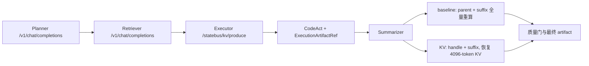

# Engine-Local KV 主链 10 任务分阶段 A/B 结果

更新时间：2026-07-30 09:10 CST
状态：Qwen3-32B、物理 GPU 1、10 任务 / 20 次计量执行完成；原 latent 服务已恢复。
分支：`exp/engine-local-kv-mainline-10round`，基线提交：`4d5bd7b`。

运行 ID：`mainline-10round-20260730T005039Z`
模型：`qwen3-32b`
执行顺序：先 10 个 `full_replay`，再 10 个 `continuation`，全程串行。
每阶段开始前 1 次完整主链预热，预热结果不进入统计。

本文只讨论显式 Engine-Local KV 传递。历史 prefix/APC 任务没有修改、没有运行，vLLM 的
Automatic Prefix Caching 在本轮服务中明确关闭，日志中的 prefix cache hit rate 始终为 0。

本轮回答的是一个具体问题：在完整 StateBus 主链中，Executor 已经计算过 4k 共享长上下文后，
能否把这段 paged KV 通过显式 handle 交给 Summarizer，从而减少后者的请求体、实际 prefill 和 TTFT，
并在包含 KV store 代价后仍得到端到端收益。

## 1. 主结论

| 指标 | baseline p50 | KV p50 | p50 降幅 | 正向任务 |
| --- | ---: | ---: | ---: | ---: |
| Summarizer computed prefill tokens | 4806.500 | 710.500 | 85.22% | 10/10 |
| Summarizer TTFT (ms) | 1618.138 | 620.980 | 61.62% | 10/10 |
| Summarizer wall (ms) | 5218.342 | 4110.769 | 21.22% | 10/10 |
| Summarizer request bytes | 20151.000 | 3210.500 | 84.07% | 10/10 |
| Executor producer wall (ms) | 4346.624 | 4624.557 | -6.39% | 1/10 |
| Executor + Summarizer wall (ms) | 9575.671 | 8742.196 | 8.70% | 10/10 |
| 完整主链 wall (ms) | 30917.693 | 29158.521 | 5.69% | 10/10 |

质量通过：`20/20`；A/B 质量等价：`10/10`；Consumer 输出 token 精确一致：`4/10`；最终 artifact hash 精确一致：`7/10`；结构化 artifact core 精确一致：`10/10`。

显式 KV proof 通过：`10/10`；capture/load 总计：`10/10`；fallback：`0`。

KV lane 的 store p50 为 `1712.952 ms`，load p50 为 `297.430 ms`，单 handle 为 `1.000 GiB`。

最稳妥的结论是：本轮 10 个不同任务中，显式 KV 均把 Summarizer 的 4096 个 parent token
从“再次计算”变成“继承”，computed prefill、TTFT、Consumer 请求字节和完整主链 wall 均为
`10/10` 正向。代价是 Executor 需要捕获并保存 KV，Producer wall p50 增加 6.39%；但该代价被
Summarizer 侧节省覆盖，Executor + Summarizer p50 最终仍下降 8.70%。

### 1.1 分布和配对读法

“p50 降幅”是两条 lane 各自 p50 的比值；“配对降幅 p50”是先按同一任务计算 A/B 降幅，
再对 10 个降幅取中位数。两种口径同时给出，避免只看一个汇总数。

| 指标 | baseline mean / p50 / p95 | KV mean / p50 / p95 | lane p50 降幅 | 配对降幅 p50 | 正向任务 |
| --- | ---: | ---: | ---: | ---: | ---: |
| computed prefill tokens | 4806.1 / 4806.5 / 4809.1 | 710.1 / 710.5 / 713.1 | 85.22% | 85.22% | 10/10 |
| Summarizer TTFT (ms) | 1618.0 / 1618.1 / 1621.6 | 633.3 / 621.0 / 668.3 | 61.62% | 61.60% | 10/10 |
| Summarizer wall (ms) | 5396.8 / 5218.3 / 6919.1 | 4210.5 / 4110.8 / 5889.2 | 21.22% | 19.20% | 10/10 |
| Summarizer request bytes | 20148.3 / 20151.0 / 20197.2 | 3213.3 / 3210.5 / 3234.8 | 84.07% | 84.06% | 10/10 |
| Executor producer wall (ms) | 4381.4 / 4346.6 / 4546.5 | 4652.5 / 4624.6 / 4798.3 | -6.39% | -6.51% | 1/10 |
| Executor + Summarizer wall (ms) | 9778.2 / 9575.7 / 11259.1 | 8863.0 / 8742.2 / 10532.4 | 8.70% | 7.36% | 10/10 |
| 完整主链 wall (ms) | 30779.6 / 30917.7 / 31767.0 | 28938.3 / 29158.5 / 30233.7 | 5.69% | 5.47% | 10/10 |

KV 内部开销分布：

| 指标 | min | p50 | p95 | max |
| --- | ---: | ---: | ---: | ---: |
| inherited tokens | 4096 | 4096 | 4096 | 4096 |
| KV store (ms) | 1686.865 | 1712.952 | 1779.109 | 1792.288 |
| KV load (ms) | 294.896 | 297.430 | 346.080 | 349.418 |
| handle bytes | 1 GiB | 1 GiB | 1 GiB | 1 GiB |

## 2. 实验链路



两条 lane 的 correctness plane 相同。差异只在 Executor 到 Summarizer 之间：baseline 重新提交并计算 parent，KV lane 传递 Worker-local handle，只提交并计算 Summarizer suffix。APC、semantic pruning 和 replay 均关闭。

### 2.1 不是绕开整个普通主链

完整运行仍然是：

```text
CanonicalTaskSpec
  -> Planner
  -> Retriever / evidence hydration
  -> Executor role decision
  -> CodeAct / ExecutionArtifactRef
  -> Summarizer
  -> deterministic quality floor
  -> artifact commit / Runtime GC
```

其中 Planner 和 Retriever 继续走普通 `/v1/chat/completions`。Executor 与 Summarizer 才由
task-local `EngineLocalKVRoleClient` 包装：Executor 走 `/statebus/kv/produce`，Summarizer 走
`/statebus/kv/continue`，结束后走 `/statebus/kv/release`。`StateRef`、`ExecutionArtifactRef`、
CodeAct、质量门和最终 artifact 都没有被 KV handle 替代。

因此，本轮不是独立的 KV microbenchmark，也不是完整绕开 StateBus；它是在完整主链上增加一条
Executor 到 Summarizer 的加速 sideband。当前仍属于最小接入：KV handle 尚未进入正式 Protobuf、
`StateRef` 或 `MemoryProxy`，故 feature flag 默认 `off`，只在本实验 runner 中显式开启。

### 2.2 A/B 的唯一机制差异

两条 lane 对每个任务使用相同文档、相同 CanonicalTaskSpec、相同 4096-token parent、相同
Executor/Summarizer 逻辑 prompt、temperature 0 和 seed 7。

`full_replay`：

1. Executor 正常生成，但 `capture_kv=false`。
2. Summarizer 请求携带完整 4096 parent token IDs 和自身 suffix。
3. vLLM 实际计算 `parent + suffix`，inherited KV 为 0。

`continuation`：

1. Executor 生成时 `capture_kv=true`，Worker 保存 64 层 parent paged KV。
2. CodeAct 与 artifact 阶段照常执行。
3. Summarizer 请求只携带 handle 和自身 suffix token IDs。
4. connector 恢复 4096 inherited tokens，模型只 forward suffix。
5. Consumer 完成后立即 one-shot release，registry 回到 0。

Summarizer 调用前会重新通过服务端 `/tokenize` 编码完整 prompt，并严格验证前 4096 token IDs
与 Executor parent 完全一致；不一致直接失败，不会把 fallback 记成 KV 命中。

### 2.3 与 prefix/APC 的区别和互补关系

| 维度 | 历史 prefix/APC | 本轮显式 KV continuation |
| --- | --- | --- |
| 复用发现 | 服务按相同 token prefix 自动匹配 | StateBus 显式产生、传递、释放 handle |
| 作用范围 | 相互独立请求之间可命中相同 prefix | 同一任务内 Executor -> Summarizer 角色边 |
| Consumer 请求 | 仍发送完整 prefix 文本/token | 只发送 handle + suffix |
| 控制与审计 | 依赖 cache hit counter | capture/load/release、digest 和 scheduler proof |
| 本轮状态 | 未运行，APC=false | 10/10 显式继承 4096 tokens |

两者概念上可以叠加：APC 可服务跨任务、跨请求的相同 prefix，显式 handle 可服务同任务角色边。
但本轮为了单独归因 KV，APC 明确关闭，因此没有给出叠加收益数据。

## 3. 任务设计与执行顺序

### 3.1 10 个任务不是 repeat-10

任务由 2 份离线运营报告乘以 5 个指标组成，均使用
`continuous_long_doc_table_analysis / extract_metric_series_generic`：

| 轮次 | 公司 | 指标 | Q1 / Q2 / Q3 gold |
| ---: | --- | --- | --- |
| 1 | Nova | `revenue_musd` | 142 / 156 / 169 |
| 2 | Nova | `gross_margin_pct` | 36.8 / 37.4 / 36.2 |
| 3 | Nova | `operating_expense_musd` | 44 / 47 / 53 |
| 4 | Nova | `churn_rate_pct` | 2.8 / 3.1 / 4.0 |
| 5 | Nova | `on_time_delivery_pct` | 95.7 / 93.6 / 89.9 |
| 6 | Orion | `revenue_musd` | 184 / 197 / 211 |
| 7 | Orion | `gross_margin_pct` | 41.2 / 40.5 / 39.7 |
| 8 | Orion | `operating_expense_musd` | 57 / 61 / 66 |
| 9 | Orion | `churn_rate_pct` | 3.2 / 3.6 / 4.4 |
| 10 | Orion | `on_time_delivery_pct` | 96.4 / 94.1 / 90.8 |

Nova 使用已有 Qwen 4k compiled parent；Orion 新增独立 compiled parent，并由正在服务的
Qwen3-32B `/tokenize` 和 `/detokenize` 验证为精确 4096 tokens、block size 16 对齐。

### 3.2 分阶段顺序

按本轮约定，时间顺序固定为：

```text
excluded full_replay warmup
  -> Nova 5 baseline
  -> Orion 5 baseline
  -> excluded continuation warmup
  -> Nova 5 KV
  -> Orion 5 KV
```

20 次计量执行完全串行，无并发。每个 KV 任务重新产生自己的 one-shot handle，不跨任务保留；
两次预热均走完整 StateBus 主链并保留原始证据，但不进入任何汇总指标。

## 4. 逐任务配对结果

| # | 公司 / 指标 | computed A→B | TTFT A→B (ms) | Consumer wall 降幅 | 主链 wall 降幅 | inherited | store/load (ms) | 质量 / core / raw token / full artifact |
| ---: | --- | ---: | ---: | ---: | ---: | ---: | ---: | --- |
| 1 | nova / `revenue_musd` | 4808→712 | 1611.4→620.9 | 13.80% | 5.02% | 4096 | 1697.9/295.6 | 1/1/1/1 |
| 2 | nova / `gross_margin_pct` | 4806→710 | 1616.3→672.2 | 48.61% | 12.19% | 4096 | 1747.0/349.4 | 1/1/0/0 |
| 3 | nova / `operating_expense_musd` | 4810→714 | 1615.4→620.6 | 18.73% | 5.51% | 4096 | 1726.3/294.9 | 1/1/0/1 |
| 4 | nova / `churn_rate_pct` | 4807→711 | 1617.5→616.4 | 24.75% | 6.60% | 4096 | 1693.5/297.4 | 1/1/1/1 |
| 5 | nova / `on_time_delivery_pct` | 4807→711 | 1618.2→621.2 | 24.12% | 4.94% | 4096 | 1686.9/297.9 | 1/1/1/1 |
| 6 | orion / `revenue_musd` | 4805→709 | 1621.5→663.3 | 16.29% | 5.43% | 4096 | 1792.3/342.0 | 1/1/0/1 |
| 7 | orion / `gross_margin_pct` | 4803→707 | 1621.7→621.0 | 18.85% | 6.05% | 4096 | 1706.7/297.4 | 1/1/0/0 |
| 8 | orion / `operating_expense_musd` | 4807→711 | 1618.1→620.5 | 21.16% | 5.55% | 4096 | 1699.1/296.8 | 1/1/0/0 |
| 9 | orion / `churn_rate_pct` | 4804→708 | 1620.4→663.5 | 14.85% | 3.51% | 4096 | 1719.2/341.7 | 1/1/0/1 |
| 10 | orion / `on_time_delivery_pct` | 4804→708 | 1619.4→613.8 | 19.56% | 5.20% | 4096 | 1763.0/295.0 | 1/1/1/1 |

逐任务最后一列依次表示：质量门 / 结构化 artifact core / raw Consumer token / 完整 artifact hash。

Consumer request bytes 的逐任务范围为：baseline 20099–20203 B，KV 3195–3237 B；10 个任务
全部下降约 84%。完整逐行标量见 `records.csv`，未压平的所有字段见 `records.jsonl` 和
`summary.json`。

## 5. 正确率、等价性与输出差异

### 5.1 任务正确率

- 20/20 单次执行均通过 deterministic checks。
- 20/20 均通过 fact coverage。
- A/B 的 10 对任务均得到相同 `metric_name / value_q1 / value_q2 / value_q3`。
- 10/10 Producer logical prompt digest 相同。
- 10/10 Producer output token digest 相同。
- 10/10 Consumer logical prompt digest 相同。
- 10/10 去除自由文本 `summary_text` 后的结构化 artifact core 完全相同。

因此，以本任务真正要求的季度指标抽取口径读取，baseline 和 KV 均为 100%，KV 没有造成指标值
错误、字段缺失或证据链变化。

### 5.2 为什么 raw token 不是 10/10

Consumer raw output token digest 为 4/10 完全一致，最终完整 artifact hash 为 7/10 完全一致。
逐字段核查表明：

- 3、6、9 轮 raw token 不同，但 JSON 解析和 artifact 归一化后完全相同。
- 2、7、8 轮完整 artifact 只在自由文本 `summary_text` 上有措辞变化。
- 所有必需数值、route、tool、document hash、retrieval hash、Planner plan 和 evidence 字段均一致。

这部分没有被删除或包装成“精确一致”。报告同时保留 raw token、full artifact 和 structured core
三层口径。即使只读取 raw token 精确一致的 4 对任务，TTFT p50 仍下降 61.76%，完整主链 p50
仍下降 5.07%，说明主时延结论不依赖输出 token 变短的 6 对任务。

## 6. 统计口径与顺序边界

- 10 个任务各执行一次 baseline 和一次 KV，共 20 次计量执行；不是同一任务 repeat-10。
- 执行顺序按要求固定为整组 baseline 后整组 KV，因此逐任务仍配对，但时间顺序没有交错。
- 两阶段预热均排除；服务不在阶段间重启。完整主链 wall 会包含 Planner、Retriever、CodeAct、文件系统与 Runtime 抖动。
- 主结论优先读取 computed prefill、inherited KV、TTFT 和 request bytes；完整主链 wall 单独呈现正向任务数与 p50。
- raw Consumer token 为 4/10 精确一致，full artifact hash 为 7/10；差异任务的必需数值均一致，3 个 artifact hash 差异只涉及自由文本 `summary_text`。
- 在 raw Consumer token 精确一致的 `4` 对任务中，TTFT p50 仍下降 `61.76%`，完整主链 p50 仍下降 `5.07%`。
- 所有请求串行，temperature=0，KV 私有端点 seed=7，Qwen3-32B，4096-token block-aligned parent。

分阶段执行是用户指定的展示顺序，优点是基线与 KV 两个阶段清晰；边界是它没有交错 A/B，
因此完整主链 wall 可能包含随时间变化的系统状态。computed token、inherited token 和 request bytes
是确定性的机制证据；TTFT 在 10/10 任务中下降约 58.4%–62.1%，幅度远大于普通时间漂移。
完整主链 5.69% 作为本次 grouped run 的系统结果呈现，不把每一毫秒都归因于 KV。

## 7. 服务、显存与资源回收

| 配置 | 值 |
| --- | --- |
| 模型 | Qwen3-32B BF16 |
| vLLM | 0.9.2 V1 |
| physical GPU | 1，Docker `DeviceIDs=["1"]` |
| max model len / max seqs | 8192 / 1 |
| APC | false |
| KV connector | `StateBusLocalKVConnector` |
| layer count | 64 |
| registry max entries / bytes | 2 / 2 GiB |
| one-shot / pin memory | true / false |

正式计量前：registry 0、store/load 0/0。正式结束后连同一次排除的 KV warmup：store/load 11/11，
registry peak 为 1 个 handle / 1 GiB，registry 最终为 0 entry / 0 byte。10 个计量任务本身的
capture/load/release 为 10/10/10，fallback 为 0。

实验只切换并使用物理 GPU 1；物理 GPU 0 没有被本轮容器操作触碰。实验结束后 KV 容器停止，
原 `statebus-vllm-latent-restored` 容器重新启动并恢复 53334 服务。

## 8. 实现与适配文件

| 文件 | 作用 |
| --- | --- |
| `scripts/run_engine_local_kv_mainline_ab.py` | 把单任务执行抽成可复用 `MainlineTask`，增加 Producer/Consumer/quality/digest 详细字段 |
| `scripts/run_engine_local_kv_mainline_suite.py` | 10 任务分阶段运行、预热排除、断点恢复、配对聚合、CSV/JSONL/Markdown 输出 |
| `v2/benchmark/samples/engine_local_kv_mainline_10round/suite_manifest.json` | 固定 10 个任务、gold、执行顺序、4096 parent、temperature 和 seed |
| `v2/benchmark/samples/engine_local_kv_mainline_10round/manifest.json` | Orion Qwen tokenizer 编译定义 |
| `v2/benchmark/samples/engine_local_kv_mainline_10round/compiled_cases.json` | Orion 精确 token IDs、digest 和编译元数据 |
| `v2/benchmark/samples/engine_local_kv_mainline_10round/compiled_parents/kv-mainline-4k-orion.txt` | Orion 4096-token parent 文本 |
| `tests/v2/neural/test_engine_local_kv_mainline_suite.py` | 清单、4k 对齐、grouped pairing、聚合和报告测试 |

接入本身仍由上一提交的 `v2/integrations/vllm_kv/role_client.py` 和 `v2/runtime/smoke.py`
提供。本轮没有修改 prefix/APC runner、历史 prefix manifest 或其报告。

## 9. 完整证据目录

根目录：`/home/qcrs/statebus/runs/engine_local_kv_mainline_10round/mainline-10round-grouped-20260730_085030`

- `summary.json`：完整记录、逐任务 comparisons、分布统计和服务前后状态。
- `records.jsonl`：20 条未删字段的计量记录。
- `records.csv`：便于绘图和表格分析的标量字段。
- `rounds/<round-task>/<mode>/record.json`：单次提取、质量、时延、token、digest、store/load/release 汇总。
- `rounds/<round-task>/<mode>/runtime/engine_local_kv_mainline.json`：Producer/Consumer 原始 API telemetry 与 scheduler/forward proof。
- `rounds/<round-task>/<mode>/workspace/<task>/logs/task_metrics.json`：Planner、Retriever、Executor、Summarizer、CodeAct 和 Runtime 指标。
- `rounds/<round-task>/<mode>/workspace/<task>/outputs/result.json`：最终结构化 artifact。
- `warmups/`：两次排除统计的阶段预热，保留完整原始证据。
- `kv_service.log`：本轮 KV 容器从启动、20 次计量到结束的 350 行服务日志。

关键证据数量核对：

- `records.jsonl`：20 行。
- `records.csv`：1 行表头 + 20 行记录。
- `rounds/**/runtime/engine_local_kv_mainline.json`：20 个。
- `warmups/**/runtime/engine_local_kv_mainline.json`：2 个。
- 整个结果目录约 18 MiB，未删除失败或不利字段；本轮无计量失败。

## 10. 复现命令

```bash
python scripts/compile_engine_local_kv_tasks.py \
  --base-url http://127.0.0.1:53334 \
  --model qwen3-32b \
  --case-dir v2/benchmark/samples/engine_local_kv_mainline_10round \
  --output v2/benchmark/samples/engine_local_kv_mainline_10round/compiled_cases.json \
  --parent-text-dir v2/benchmark/samples/engine_local_kv_mainline_10round/compiled_parents

python scripts/run_engine_local_kv_mainline_suite.py \
  --token-file /path/to/kv_api.token \
  --output-dir /home/qcrs/statebus/runs/engine_local_kv_mainline_10round/<run-id>
```

结果目录存在部分记录时可增加 `--resume`；runner 会保留最初 run ID、跳过已有单次记录，重新生成
汇总，不重复运行已完成的 GPU 任务。
