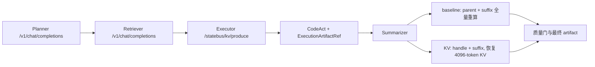
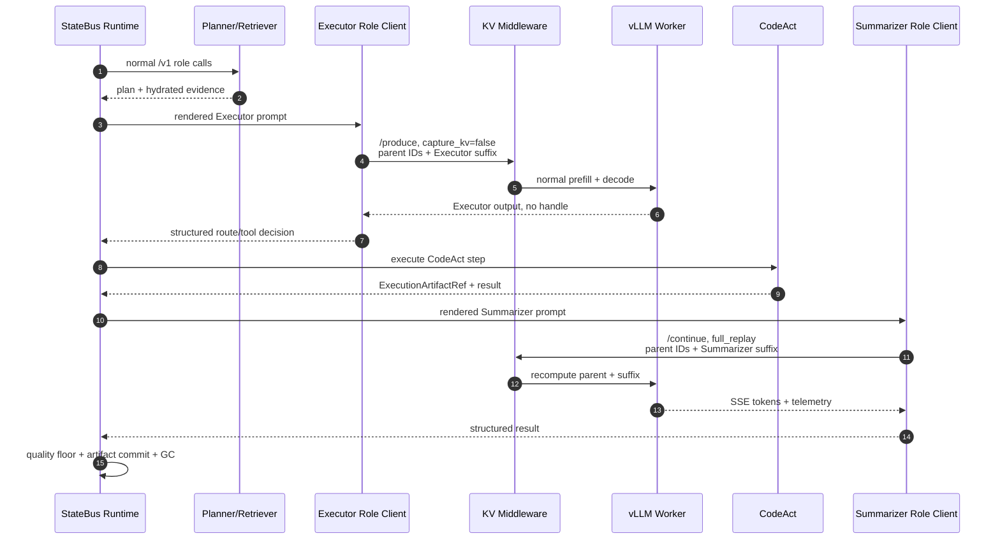
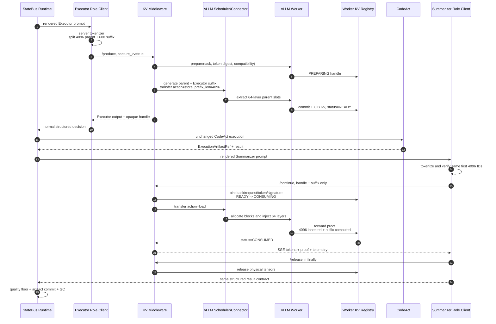
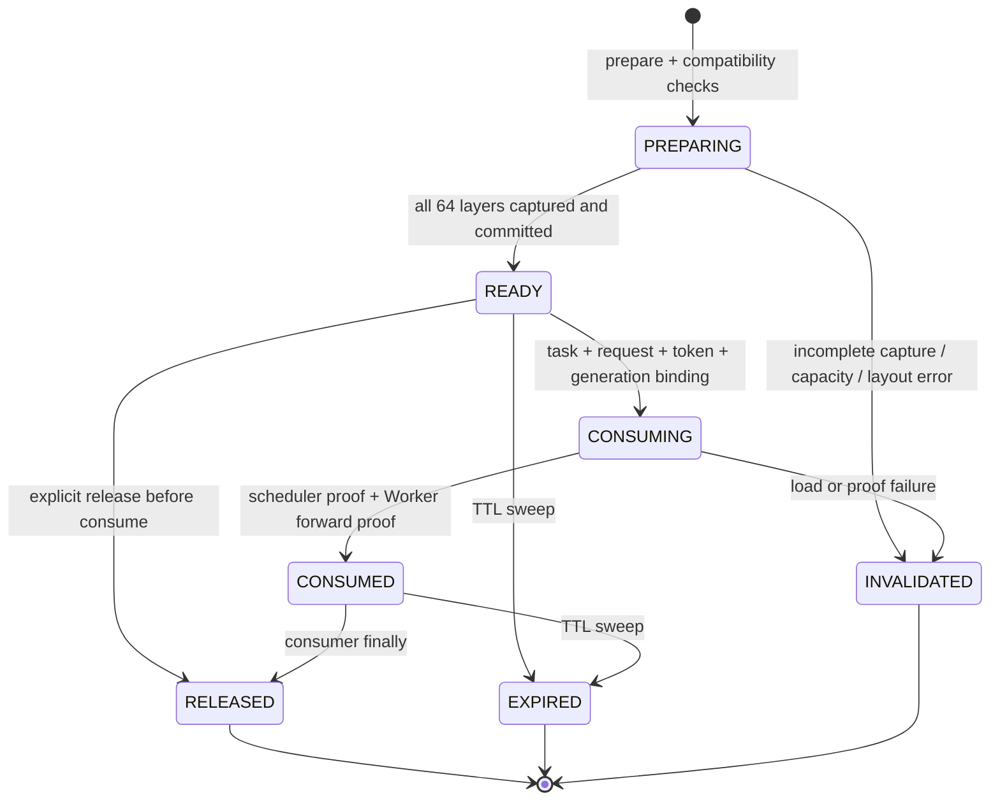
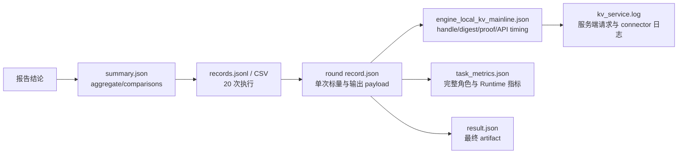

# Engine-Local KV 主链 10 任务分阶段 A/B 结果

更新时间：2026-07-30（实验报告扩展版）
状态：Qwen3-32B、物理 GPU 1、10 任务 / 20 次计量执行完成；原 latent 服务已恢复。
分支：`exp/engine-local-kv-mainline-10round`；主链接入基线：`4d5bd7b`；10 任务套件提交：`ac2a7d5`。

运行 ID：`mainline-10round-20260730T005039Z`
模型：`qwen3-32b`
执行顺序：先 10 个 `full_replay`，再 10 个 `continuation`，全程串行。
每阶段开始前 1 次完整主链预热，预热结果不进入统计。
原始汇总：`/home/qcrs/statebus/runs/engine_local_kv_mainline_10round/mainline-10round-grouped-20260730_085030/summary.json`。

本文只讨论显式 Engine-Local KV 传递。历史 prefix/APC 任务没有修改、没有运行，vLLM 的
Automatic Prefix Caching 在本轮服务中明确关闭，日志中的 prefix cache hit rate 始终为 0。

按仓库正式能力口径，本实现属于实验性的 **Engine-Local Prefix Reuse / explicit KV continuation**：
它不是默认开启的跨模型 KV 传输，也不是可移植 `StateRef` 或正式 hidden-state handoff。

本轮回答的是一个具体问题：在完整 StateBus 主链中，Executor 已经计算过 4k 共享长上下文后，
能否把这段 paged KV 通过显式 handle 交给 Summarizer，从而减少后者的请求体、实际 prefill 和 TTFT，
并在包含 KV store 代价后仍得到端到端收益。

### 报告定位与读取顺序

本文既是结果报告，也是实现说明和证据索引。建议按以下顺序读取：

1. 第 1 节读取主结论、p50 和 10 任务累计结果。
2. 第 2 节理解 KV 如何嵌入普通 StateBus 主链，以及它与 Embedding、Logit、Prefix/APC 的关系。
3. 第 3 节确认 10 个任务、A/B 公平性、执行顺序和统计口径。
4. 第 4 节读取每个任务的全部性能、代价、输出 token 和正确性结果。
5. 第 8 节按代码模块追踪实现，第 9 节按轮次定位原始日志。

本文使用以下缩写：`A` 表示 `full_replay`，`B` 表示显式 `KV continuation`；`Producer` 表示
Executor 的模型调用，`Consumer` 表示 Summarizer 的模型调用。文中所有表格时间显示到 3 位小数，
百分比显示到 2 位小数；计算使用 `summary.json` 中未舍入的原始值。

原始汇总的 SHA-256 为：

```text
b7585eaf5973281498ce4e6162ac06314d8e62e435df4b394cd9948cfca30ba2  summary.json
```

## 1. 主结论

| 指标 | baseline p50 | KV p50 | p50 降幅 | 正向任务 |
| --- | ---: | ---: | ---: | ---: |
| Summarizer computed prefill tokens | 4806.500 | 710.500 | 85.22% | 10/10 |
| Summarizer TTFT (ms) | 1618.138 | 620.980 | 61.62% | 10/10 |
| Summarizer wall (ms) | 5218.342 | 4110.769 | 21.22% | 10/10 |
| Summarizer request bytes | 20151.000 | 3210.500 | 84.07% | 10/10 |
| Executor producer wall (ms) | 4346.624 | 4624.557 | -6.39% | 1/10 |
| Executor + Summarizer wall (ms) | 9575.671 | 8742.196 | 8.70% | 10/10 |
| 完整主链 wall (ms) | 30917.693 | 29158.521 | 5.69% | 10/10 |

质量通过：`20/20`；A/B 质量等价：`10/10`；Consumer 输出 token 精确一致：`4/10`；最终 artifact hash 精确一致：`7/10`；结构化 artifact core 精确一致：`10/10`。

显式 KV proof 通过：`10/10`；capture/load 总计：`10/10`；fallback：`0`。

KV lane 的 store p50 为 `1712.952 ms`，load p50 为 `297.430 ms`，单 handle 为 `1.000 GiB`。

最稳妥的结论是：本轮 10 个不同任务中，显式 KV 均把 Summarizer 的 4096 个 parent token
从“再次计算”变成“继承”，computed prefill、TTFT、Consumer 请求字节和完整主链 wall 均为
`10/10` 正向。代价是 Executor 需要捕获并保存 KV，Producer wall p50 增加 6.39%；但该代价被
Summarizer 侧节省覆盖，Executor + Summarizer p50 最终仍下降 8.70%。

### 1.1 分布和配对读法

“p50 降幅”是两条 lane 各自 p50 的比值；“配对降幅 p50”是先按同一任务计算 A/B 降幅，
再对 10 个降幅取中位数。两种口径同时给出，避免只看一个汇总数。

| 指标 | baseline mean / p50 / p95 | KV mean / p50 / p95 | lane p50 降幅 | 配对降幅 p50 | 正向任务 |
| --- | ---: | ---: | ---: | ---: | ---: |
| computed prefill tokens | 4806.1 / 4806.5 / 4809.1 | 710.1 / 710.5 / 713.1 | 85.22% | 85.22% | 10/10 |
| Summarizer TTFT (ms) | 1618.0 / 1618.1 / 1621.6 | 633.3 / 621.0 / 668.3 | 61.62% | 61.60% | 10/10 |
| Summarizer wall (ms) | 5396.8 / 5218.3 / 6919.1 | 4210.5 / 4110.8 / 5889.2 | 21.22% | 19.20% | 10/10 |
| Summarizer request bytes | 20148.3 / 20151.0 / 20197.2 | 3213.3 / 3210.5 / 3234.8 | 84.07% | 84.06% | 10/10 |
| Executor producer wall (ms) | 4381.4 / 4346.6 / 4546.5 | 4652.5 / 4624.6 / 4798.3 | -6.39% | -6.51% | 1/10 |
| Executor + Summarizer wall (ms) | 9778.2 / 9575.7 / 11259.1 | 8863.0 / 8742.2 / 10532.4 | 8.70% | 7.36% | 10/10 |
| 完整主链 wall (ms) | 30779.6 / 30917.7 / 31767.0 | 28938.3 / 29158.5 / 30233.7 | 5.69% | 5.47% | 10/10 |

KV 内部开销分布：

| 指标 | min | p50 | p95 | max |
| --- | ---: | ---: | ---: | ---: |
| inherited tokens | 4096 | 4096 | 4096 | 4096 |
| KV store (ms) | 1686.865 | 1712.952 | 1779.109 | 1792.288 |
| KV load (ms) | 294.896 | 297.430 | 346.080 | 349.418 |
| handle bytes | 1 GiB | 1 GiB | 1 GiB | 1 GiB |

### 1.2 10 个任务累计结果

p50 描述典型任务，累计值回答整组实验一共执行和节省了多少。10 个任务的累计结果为：

| 指标 | A 累计 | B 累计 | B 相对 A |
| --- | ---: | ---: | ---: |
| Consumer computed prefill tokens | 48,061 | 7,101 | 下降 85.23% |
| inherited KV tokens | 0 | 40,960 | 每个任务 4,096 |
| Consumer TTFT | 16,179.815 ms | 6,333.400 ms | 下降 60.86% |
| Consumer wall | 53.968 s | 42.105 s | 下降 21.98% |
| Consumer request bytes | 201,483 B | 32,133 B | 下降 84.05% |
| Producer wall | 43.814 s | 46.525 s | 增加 6.19% |
| Producer + Consumer wall | 97.782 s | 88.630 s | 下降 9.36% |
| 完整主链 wall | 307.796 s | 289.383 s | 下降 5.98% |

B lane 10 次 KV store 累计 `17,231.783 ms`，10 次 load 累计 `3,108.153 ms`。这两个内部计时
已经分别发生在 Producer 和 Consumer wall 内，不能再额外加到端到端时间上。10 个 one-shot handle
累计产生 10 GiB payload；若按方向计数，store 与 load 各复制 10 GiB。任务串行且每次及时释放，
因此实际 registry 峰值始终只有 1 个 handle / 1 GiB。

### 1.3 结果应该怎样解释

本轮同时回答了三层问题：

1. **机制是否真的生效**：10/10 的 `inherited_kv_tokens=4096`，`computed_prefill_tokens=suffix_tokens`，
   connector load 为 1，APC 命中为 0，fallback 为 0。
2. **局部性能是否改善**：Consumer computed prefill、TTFT、wall 和请求字节在 10/10 任务中下降。
3. **捕获成本能否被覆盖**：Producer p50 因保存 1 GiB KV 增加 6.39%，但 Producer + Consumer p50
   仍下降 8.70%，完整主链 p50 下降 5.69%。

因此最直接的实验结论不是“KV 让所有阶段都变快”，而是“把一个已经计算过的 4096-token
共享 parent 从 Summarizer 的重算路径移出后，Consumer 的首 token 和请求传输显著下降；即使把
Executor 捕获成本保留在账面内，角色对与完整主链仍获得净收益”。

## 2. 实验链路



两条 lane 的 correctness plane 相同。差异只在 Executor 到 Summarizer 之间：baseline 重新提交并计算 parent，KV lane 传递 Worker-local handle，只提交并计算 Summarizer suffix。APC、semantic pruning 和 replay 均关闭。

### 2.1 不是绕开整个普通主链

完整运行仍然是：

```text
CanonicalTaskSpec
  -> Planner
  -> Retriever / evidence hydration
  -> Executor role decision
  -> CodeAct / ExecutionArtifactRef
  -> Summarizer
  -> deterministic quality floor
  -> artifact commit / Runtime GC
```

其中 Planner 和 Retriever 继续走普通 `/v1/chat/completions`。Executor 与 Summarizer 才由
task-local `EngineLocalKVRoleClient` 包装：Executor 走 `/statebus/kv/produce`，Summarizer 走
`/statebus/kv/continue`，结束后走 `/statebus/kv/release`。`StateRef`、`ExecutionArtifactRef`、
CodeAct、质量门和最终 artifact 都没有被 KV handle 替代。

因此，本轮不是独立的 KV microbenchmark，也不是完整绕开 StateBus；它是在完整主链上增加一条
Executor 到 Summarizer 的加速 sideband。当前仍属于最小接入：KV handle 尚未进入正式 Protobuf、
`StateRef` 或 `MemoryProxy`，故 feature flag 默认 `off`，只在本实验 runner 中显式开启。

### 2.2 A/B 的唯一机制差异

两条 lane 对每个任务使用相同文档、相同 CanonicalTaskSpec、相同 4096-token parent、相同
Executor/Summarizer 逻辑 prompt、temperature 0 和 seed 7。

`full_replay`：

1. Executor 正常生成，但 `capture_kv=false`。
2. Summarizer 请求携带完整 4096 parent token IDs 和自身 suffix。
3. vLLM 实际计算 `parent + suffix`，inherited KV 为 0。

`continuation`：

1. Executor 生成时 `capture_kv=true`，Worker 保存 64 层 parent paged KV。
2. CodeAct 与 artifact 阶段照常执行。
3. Summarizer 请求只携带 handle 和自身 suffix token IDs。
4. connector 恢复 4096 inherited tokens，模型只 forward suffix。
5. Consumer 完成后立即 one-shot release，registry 回到 0。

Summarizer 调用前会重新通过服务端 `/tokenize` 编码完整 prompt，并严格验证前 4096 token IDs
与 Executor parent 完全一致；不一致直接失败，不会把 fallback 记成 KV 命中。

### 2.3 与 prefix/APC 的区别和互补关系

| 维度 | 历史 prefix/APC | 本轮显式 KV continuation |
| --- | --- | --- |
| 复用发现 | 服务按相同 token prefix 自动匹配 | StateBus 显式产生、传递、释放 handle |
| 作用范围 | 相互独立请求之间可命中相同 prefix | 同一任务内 Executor -> Summarizer 角色边 |
| Consumer 请求 | 仍发送完整 prefix 文本/token | 只发送 handle + suffix |
| 控制与审计 | 依赖 cache hit counter | capture/load/release、digest 和 scheduler proof |
| 本轮状态 | 未运行，APC=false | 10/10 显式继承 4096 tokens |

两者概念上可以叠加：APC 可服务跨任务、跨请求的相同 prefix，显式 handle 可服务同任务角色边。
但本轮为了单独归因 KV，APC 明确关闭，因此没有给出叠加收益数据。

### 2.4 A/B 完整时序

基线和 KV lane 都执行相同的 Planner、Retriever、Executor、CodeAct、Summarizer、质量门和 GC。
为了隔离变量，Executor 与 Summarizer 两侧都经过同一个私有 middleware；唯一差异是是否捕获和加载
handle。这样不会把 `/v1/chat/completions` 与私有 API 的协议实现差异混入 A/B。



KV lane 的语义步骤不变，只增加短生命周期 sideband：



### 2.5 为什么选择 Executor 到 Summarizer

这条边具备显式 KV 最需要的三个条件：

1. Executor 和 Summarizer 都必须看到同一份长证据，4096-token parent 可以放在 token position 0。
2. 两个角色之间有真实的 CodeAct 与 `ExecutionArtifactRef` 阶段，能够验证 KV sideband 不会替代业务交接。
3. 两个角色使用同一 Qwen3-32B Worker、同一 tokenizer 和同一 generation，满足原生 KV 布局兼容条件。

KV 不是由 CodeAct 产生的。它在 Executor 模型 prefill 时捕获，并跨过 CodeAct 阶段暂存；CodeAct
产生的执行结果、Summarizer 角色指令和输出合同都进入 Summarizer suffix，仍由 Consumer 正常计算。
捕获范围严格是前 4096 个共享 parent token，不包含 Executor 的 600-token 角色 suffix、Executor
生成的 59 个 token，也不包含未来的 Summarizer suffix。

因此它不只适用于“长文档”这个任务名。凡是相邻角色共享较长且 token 完全一致的前缀，例如稳定
政策库、长工具说明、固定证据包或长代码上下文，都可以成为候选；收益随可继承 parent 增长，短上下文
则可能无法覆盖 store/load 成本。当前实验只证明 4k、同 Worker、单 Consumer、one-shot 这一配置。

### 2.6 Handle 生命周期



本轮 registry 配置为 `max_entries=2`、`max_bytes=2 GiB`、`TTL=300 s`、`one_shot=true`、
`pin_memory=false`。所有 10 个正式 B 任务均依次经过 `PREPARING -> READY -> CONSUMING ->
CONSUMED -> RELEASED`，没有二次消费、过期、容量拒绝或 invalidation。

### 2.7 Embedding、Logit、Prefix 与显式 KV 的统一系统叙事

这四种机制不是四个互相替代的“缓存版本”，而是 StateBus 在不同阶段回答四个不同问题：

1. **Embedding / SemanticStateRef**：哪些证据值得进入模型？
2. **LogitStateRef / Retry Gate**：Executor 的闭集选择是否足够可信，可以放行执行？
3. **Prefix / APC**：另一个请求是否已经自动缓存了相同文本前缀？
4. **Explicit KV continuation**：当前任务的上游角色能否显式把已计算的前缀状态交给下游角色？

```mermaid
flowchart LR
    T[CanonicalTaskSpec] --> P[Planner]
    P --> R[Retriever]
    R --> ES[Embedding matrix<br/>SemanticStateRef]
    ES --> HY[Selected evidence hydration]
    HY --> CP[Canonical shared-evidence prefix]
    CP --> E[Executor]
    E --> LG[Candidate probabilities<br/>LogitStateRef]
    LG --> G[Retry / fail-closed Gate]
    G --> CA[CodeAct<br/>ExecutionArtifactRef]
    CA --> S[Summarizer]
    S --> Q[Quality floor + artifact]

    CP -. repeated requests .-> APC[vLLM Prefix/APC]
    APC -. automatic block hit .-> E
    E -. capture parent KV .-> KH[Engine-local KV handle]
    KH -. explicit handle + suffix .-> S
```



| 层 | 数据对象 | 主要消费者 | 复用范围 | 主要目标 | 已有独立实验结果 |
| --- | --- | --- | --- | --- | --- |
| Embedding | little-endian float32 query/candidate matrix + `SemanticStateRef` | 独立 PID 的 semantic consumer / Retriever | 跨进程、可持久化或短时共享 | 选少而准的证据，减少进入 LLM 的文本 | 9/9 数值状态跨 PID 消费并改变 selected IDs；历史完整 L0→L3 对照总 token `33,974→17,870`、wire `36,069→12,677 B`、质量 `10/10→10/10` |
| Logit | 候选概率 + `other_mass` 的 `LogitStateRef` | 独立 Retry Gate PID | 单次执行决策边 | 拦截低置信路由，必要时只重试一次 | Validator `8/12→12/12`；歧义任务 `3/5→5/5`；负例错误放行 `2→0`；代价为调用 `24→38`、token `6,110→9,952` |
| Prefix/APC | 相同 token position-0 文本前缀，由 vLLM 自动维护 KV blocks | 后续独立请求 | 横向、跨请求 | 避免重复前缀 prefill | hit rate `78.016%→0%` 对照；warm TTFT `2,282.935→266.672 ms`，下降 88.3%；请求字节仅差 0.26% |
| Explicit KV | 绑定 task/token/model/engine 的 64 层 paged KV handle | 同任务相邻 Summarizer | 纵向、角色间、engine-local | 显式继承上游已经计算的 parent | 本轮 computed p50 `4806.5→710.5`，TTFT `1618.138→620.980 ms`，请求字节 `20151→3210.5 B`，完整主链 p50 下降 5.69% |

Embedding 层由本地 Qwen embedding 产生 query/candidate float32 matrix，控制面只发送
`SemanticStateRef`，独立 consumer PID 从 shared memory/mmap 水合矩阵并执行 cosine top-k，再用
selected IDs 决定局部 evidence hydration。它传递的是可跨进程读取的语义数值，不依赖某个 LLM
Worker 的 attention layout。

Logit 层位于 Executor 闭集候选选择之后、CodeAct dispatch 之前。受控实验的 payload 是两个候选
概率加一个 `other_mass`，即 `3 × little-endian float32 = 12 B`；独立 Gate PID 读取
`LogitStateRef`、计算 margin，选择 accept、retry once 或 fail closed，然后 Runtime release 状态并
写 tombstone。19/19 个状态均跨 PID 消费和释放。这不是完整词表 logits，也不是 KV cache。

Prefix/APC 层不传 StateBus handle。StateBus compiler 只负责把共同证据稳定放到 token position 0，
每个请求仍发送完整 prompt；vLLM 根据已经驻留的相同 token blocks 自动报告 cache hit。显式 KV
则把具体 Producer、Consumer 和生命周期纳入 StateBus 审计，适用范围更窄，但同时减少 Consumer
请求体，并能证明每次 capture/load/release。

表中 Embedding 的 `33,974→17,870` 和 `36,069→12,677 B` 是历史完整 StateBus L0→L3
组合对照，不能全部归因于 embedding 单一组件；embedding 本身最直接的机制证据是 9/9 跨 PID
数值消费、9/9 改变选择以及 L1→L2 的 prompt token 下降 55.76%。Logit、Prefix 和本轮 KV
数字同样来自各自独立套件，不能把四组百分比相加成一个“总优化率”。

### 2.8 Prefix 与显式 KV 为什么都降低 TTFT，却仍然互补

| 问题 | Prefix/APC | 显式 KV continuation |
| --- | --- | --- |
| 谁决定复用 | vLLM 根据 token block 自动命中 | StateBus 根据任务图显式选择角色边和 handle |
| 输入是否仍含 parent | 是，完整 prompt 仍随请求发送 | 否，Consumer 只发送 handle + suffix |
| 主要适用方向 | 相同 corpus 的多个独立请求，横向复用 | 一个任务内上游到下游，纵向复用 |
| 生命周期 | 引擎 cache eviction 管理 | StateBus one-shot / TTL / release 管理 |
| 归因证据 | block hit/query counter | capture/load/release + scheduler/forward proof |
| 当前实验状态 | APC 明确关闭，hit rate 0 | 10/10 继承 4096 tokens |

它们在整个系统中互补，但不会对同一段 4096-token parent 产生两次收益。当前 connector 在 load
前要求本地 `num_computed_tokens=0`；如果 APC 已经先把同一段 prefix 标为 cached，显式 load 会拒绝，
避免重复注入和重复记账。合理的统一调度策略是：

```text
有同 task / 同 engine / 同 token digest 的 READY handle
  -> 走 explicit KV continuation
否则发送完整 prompt
  -> 允许 APC 自动命中
若 APC 也未命中
  -> 普通 full prefill
```

这是未来统一 Runtime 的分流策略，不是当前同一 Worker 已实现的叠加模式。当前
`StateBusKVWorkerExtension` 的 readiness check 明确要求
`automatic_prefix_caching=false`；要同时部署，需要使用两个 engine lane，或先修改 readiness、
scheduler arbitration 和归因 telemetry，再做独立叠加实验。

所以未来“同时开启”应理解为系统按场景选择两条复用路径，而不是在同一次 Consumer 请求上把
`88.3%` 与 `61.62%` 相加。Embedding 可以先缩短或重排证据，再由 canonical compiler 固定顺序；
Logit Gate 位于执行授权边界，对 prefix/KV 的 prefill 优化基本正交，但会用额外调用换取正确性。

### 2.9 是否绕开普通通道，以及泄露边界

当前实验保留普通语义和 artifact 主链，但 Executor/Summarizer 的模型传输确实使用实验私有 API：

| 组件 | 当前路径 | 是否保留普通语义合同 |
| --- | --- | --- |
| Planner | `/v1/chat/completions` | 是 |
| Retriever | `/v1/chat/completions` + 正常 hydration | 是 |
| Executor | `/statebus/kv/produce` | 是，仍返回普通 `LLMResult` 并进入 route/tool 决策 |
| CodeAct | 正常 workspace / artifact / subprocess 路径 | 是 |
| Summarizer | `/statebus/kv/continue` | 是，仍返回同一结构化输出合同 |
| 质量门与 GC | 正常 Runtime | 是 |

因此它是“主链中的实验加速 sideband”，不是正式控制面已经完全产品化。handle 当前没有进入 typed
Protobuf、`StateRef`、`ExecutionArtifactRef` 或 `MemoryProxy`，feature flag 默认 `off`；关闭后
`maybe_wrap_engine_local_kv_role_client()` 直接返回原 role client。

当前实现针对误用和越界采用以下保护：

- 私有 API 只接受 loopback 请求，client 也拒绝非 loopback base URL。
- Bearer token 从权限不得宽于 `0600` 的普通文件读取，并使用恒时比较。
- handle ID 为随机 UUID，只是定位符，不携带 prompt 文本。
- handle 绑定 engine ID/generation、model revision、tokenizer digest、dtype、block size、task ID、
  parent token digest、TP/PP 和 APC 状态；任一不一致即拒绝。
- Summarizer 在客户端重新 tokenization，并验证前 4096 token IDs 与 Producer parent 完全一致。
- 只捕获共享 parent；Executor suffix、Executor 输出、CodeAct 结果和 Summarizer 指令不会混入 handle。
- Consumer 失败时 abort，成功或异常退出时在 `finally` release；TTL 与容量上限处理遗留对象。
- benchmark 不允许静默 fallback 后仍记成 KV 成功，`fallback_count` 必须为 0。

KV 本身编码了共享 parent 的语义，因此它仍是敏感状态，安全边界是同一受信任 Worker 和 loopback
进程域，而不是可以跨租户公开转发的 token。上述设计避免的是错误任务复用、角色 suffix 污染、陈旧
generation 复用和网络暴露；它不声称对已攻陷的 vLLM Worker 提供密码学隔离。

## 3. 任务设计与执行顺序

### 3.1 10 个任务不是 repeat-10

任务由 2 份离线运营报告乘以 5 个指标组成，均使用
`continuous_long_doc_table_analysis / extract_metric_series_generic`：

| 轮次 | 公司 | 指标 | Q1 / Q2 / Q3 gold |
| ---: | --- | --- | --- |
| 1 | Nova | `revenue_musd` | 142 / 156 / 169 |
| 2 | Nova | `gross_margin_pct` | 36.8 / 37.4 / 36.2 |
| 3 | Nova | `operating_expense_musd` | 44 / 47 / 53 |
| 4 | Nova | `churn_rate_pct` | 2.8 / 3.1 / 4.0 |
| 5 | Nova | `on_time_delivery_pct` | 95.7 / 93.6 / 89.9 |
| 6 | Orion | `revenue_musd` | 184 / 197 / 211 |
| 7 | Orion | `gross_margin_pct` | 41.2 / 40.5 / 39.7 |
| 8 | Orion | `operating_expense_musd` | 57 / 61 / 66 |
| 9 | Orion | `churn_rate_pct` | 3.2 / 3.6 / 4.4 |
| 10 | Orion | `on_time_delivery_pct` | 96.4 / 94.1 / 90.8 |

Nova 使用已有 Qwen 4k compiled parent；Orion 新增独立 compiled parent，并由正在服务的
Qwen3-32B `/tokenize` 和 `/detokenize` 验证为精确 4096 tokens、block size 16 对齐。

### 3.2 分阶段顺序

按本轮约定，时间顺序固定为：

```text
excluded full_replay warmup
  -> Nova 5 baseline
  -> Orion 5 baseline
  -> excluded continuation warmup
  -> Nova 5 KV
  -> Orion 5 KV
```

20 次计量执行完全串行，无并发。每个 KV 任务重新产生自己的 one-shot handle，不跨任务保留；
两次预热均走完整 StateBus 主链并保留原始证据，但不进入任何汇总指标。

### 3.3 A/B 公平性清单

| 项目 | A：full replay | B：KV continuation | 是否相同 |
| --- | --- | --- | --- |
| 任务、公司、指标和 gold | 同一 `suite_manifest.json` | 同一 `suite_manifest.json` | 是 |
| 角色图 | Planner→Retriever→Executor→CodeAct→Summarizer | 相同 | 是 |
| 模型 / tokenizer | Qwen3-32B / 同一服务 tokenizer | 相同 | 是 |
| temperature / seed | 0 / 7 | 0 / 7 | 是 |
| Executor logical prompt | 4096 parent + 600 suffix | 相同 | 是，10/10 digest parity |
| Summarizer logical prompt | 4096 parent + 707–714 suffix | 相同 | 是，10/10 digest parity |
| Executor 生成预算 | 96 tokens | 96 tokens | 是 |
| Summarizer 生成预算 | 128 tokens | 128 tokens | 是 |
| deterministic embedding | 开启 | 开启 | 是 |
| semantic pruning / replay / multi-attempt | 关闭 / 关闭 / 关闭 | 关闭 / 关闭 / 关闭 | 是 |
| Automatic Prefix Caching | 关闭 | 关闭 | 是 |
| Producer capture | `false` | `true` | **唯一核心差异之一** |
| Consumer carrier | parent IDs + suffix IDs | handle + suffix IDs | **唯一核心差异之二** |
| 实际 Consumer prefill | parent + suffix | suffix only | 机制结果 |

两阶段没有交错执行，这是用户指定的 `grouped_baseline_then_kv` 顺序。每阶段各有一次排除的完整主链
预热，服务在两个阶段之间不重启。该设计便于按阶段管理，但不消除随时间变化的系统噪声；因此报告把
token accounting、request bytes 和 proof 作为确定性机制证据，把 TTFT/Consumer wall 作为直接性能
证据，把完整主链 wall 作为包含 Runtime 波动的系统结果。

### 3.4 指标定义

| 指标 | 定义与采集位置 |
| --- | --- |
| logical prompt tokens | Consumer 语义上看到的 `parent + suffix`；A/B 必须相同 |
| computed prefill tokens | 本次 Worker 实际 forward 的 prompt token；A 为 parent+suffix，B 应等于 suffix |
| inherited KV tokens | scheduler 与 Worker proof 确认由 handle 注入的 parent token 数 |
| Consumer TTFT | loopback client 发起 `/continue` 到收到第一个非空 SSE token event 的时间 |
| Consumer wall | client 发起 `/continue` 到收到 final event 并关闭 SSE response 的时间 |
| Producer wall | client 发起 `/produce` 到获得 Executor 输出和 READY handle 的时间；B 已包含 capture/store |
| Producer + Consumer wall | 两个 client wall 的直接和；用于观察角色对，不包含二者之间 CodeAct 时间 |
| 完整主链 wall | `run_smoke()` 从开始到结果、质量门、artifact 和 Runtime GC 全部结束的时间 |
| request bytes | `VllmKVClient` 对 Consumer JSON body 使用紧凑 JSON 序列化后的实际字节数 |
| KV store/load | connector 在 64 层 KV slot 复制上的内部耗时；已包含在对应 client wall 中 |
| quality floor | deterministic checks 与 required fact coverage 均通过；本轮未启用 LLM judge |

每个任务的降幅定义为：

```text
paired_reduction_i = (A_i - B_i) / A_i
```

`lane p50 降幅` 使用两个 lane 各自的中位数计算；`配对降幅 p50` 先计算 10 个任务各自的降幅，
再取中位数。10 任务累计降幅使用 `sum(A)` 与 `sum(B)`。报告不会用某一任务的最大降幅替代整体结果。

## 4. 逐任务配对结果

| # | 公司 / 指标 | computed A→B | TTFT A→B (ms) | Consumer wall 降幅 | 主链 wall 降幅 | inherited | store/load (ms) | 质量 / core / raw token / full artifact |
| ---: | --- | ---: | ---: | ---: | ---: | ---: | ---: | --- |
| 1 | nova / `revenue_musd` | 4808→712 | 1611.4→620.9 | 13.80% | 5.02% | 4096 | 1697.9/295.6 | 1/1/1/1 |
| 2 | nova / `gross_margin_pct` | 4806→710 | 1616.3→672.2 | 48.61% | 12.19% | 4096 | 1747.0/349.4 | 1/1/0/0 |
| 3 | nova / `operating_expense_musd` | 4810→714 | 1615.4→620.6 | 18.73% | 5.51% | 4096 | 1726.3/294.9 | 1/1/0/1 |
| 4 | nova / `churn_rate_pct` | 4807→711 | 1617.5→616.4 | 24.75% | 6.60% | 4096 | 1693.5/297.4 | 1/1/1/1 |
| 5 | nova / `on_time_delivery_pct` | 4807→711 | 1618.2→621.2 | 24.12% | 4.94% | 4096 | 1686.9/297.9 | 1/1/1/1 |
| 6 | orion / `revenue_musd` | 4805→709 | 1621.5→663.3 | 16.29% | 5.43% | 4096 | 1792.3/342.0 | 1/1/0/1 |
| 7 | orion / `gross_margin_pct` | 4803→707 | 1621.7→621.0 | 18.85% | 6.05% | 4096 | 1706.7/297.4 | 1/1/0/0 |
| 8 | orion / `operating_expense_musd` | 4807→711 | 1618.1→620.5 | 21.16% | 5.55% | 4096 | 1699.1/296.8 | 1/1/0/0 |
| 9 | orion / `churn_rate_pct` | 4804→708 | 1620.4→663.5 | 14.85% | 3.51% | 4096 | 1719.2/341.7 | 1/1/0/1 |
| 10 | orion / `on_time_delivery_pct` | 4804→708 | 1619.4→613.8 | 19.56% | 5.20% | 4096 | 1763.0/295.0 | 1/1/1/1 |

逐任务最后一列依次表示：质量门 / 结构化 artifact core / raw Consumer token / 完整 artifact hash。

Consumer request bytes 的逐任务范围为：baseline 20099–20203 B，KV 3195–3237 B；10 个任务
全部下降约 84%。完整逐行标量见 `records.csv`，未压平的所有字段见 `records.jsonl` 和
`summary.json`。

### 4.1 每个任务的 token 计算与请求传输

| # | 任务 | logical tokens A=B | computed A→B | inherited B | request bytes A→B | bytes 降幅 |
| ---: | --- | ---: | ---: | ---: | ---: | ---: |
| 1 | Nova revenue | 4,808 | 4,808→712 | 4,096 | 20,104→3,200 | 84.08% |
| 2 | Nova gross margin | 4,806 | 4,806→710 | 4,096 | 20,112→3,208 | 84.05% |
| 3 | Nova operating expense | 4,810 | 4,810→714 | 4,096 | 20,136→3,232 | 83.95% |
| 4 | Nova churn | 4,807 | 4,807→711 | 4,096 | 20,099→3,195 | 84.10% |
| 5 | Nova on-time delivery | 4,807 | 4,807→711 | 4,096 | 20,123→3,219 | 84.00% |
| 6 | Orion revenue | 4,805 | 4,805→709 | 4,096 | 20,171→3,205 | 84.11% |
| 7 | Orion gross margin | 4,803 | 4,803→707 | 4,096 | 20,179→3,213 | 84.08% |
| 8 | Orion operating expense | 4,807 | 4,807→711 | 4,096 | 20,203→3,237 | 83.98% |
| 9 | Orion churn | 4,804 | 4,804→708 | 4,096 | 20,166→3,200 | 84.13% |
| 10 | Orion on-time delivery | 4,804 | 4,804→708 | 4,096 | 20,190→3,224 | 84.03% |

表中的 `logical tokens` 在 A/B 完全相同，说明 KV lane 没有让模型少“看”业务内容；它只改变这些
逻辑 token 的物理来源。每行都精确满足：

```text
B logical prompt = inherited 4096 + computed suffix
B computed prefill = suffix tokens
A computed prefill = logical prompt tokens
```

### 4.2 每个任务的 Consumer 时延

| # | 任务 | TTFT A→B (ms) | TTFT 降幅 | Consumer wall A→B (ms) | wall 降幅 |
| ---: | --- | ---: | ---: | ---: | ---: |
| 1 | Nova revenue | 1,611.394→620.924 | 61.47% | 7,086.364→6,108.759 | 13.80% |
| 2 | Nova gross margin | 1,616.286→672.208 | 58.41% | 6,134.809→3,152.600 | 48.61% |
| 3 | Nova operating expense | 1,615.393→620.551 | 61.59% | 5,271.905→4,284.286 | 18.73% |
| 4 | Nova churn | 1,617.477→616.443 | 61.89% | 4,026.751→3,030.148 | 24.75% |
| 5 | Nova on-time delivery | 1,618.221→621.195 | 61.61% | 4,124.732→3,129.835 | 24.12% |
| 6 | Orion revenue | 1,621.493→663.286 | 59.09% | 6,714.567→5,620.925 | 16.29% |
| 7 | Orion gross margin | 1,621.736→621.036 | 61.71% | 5,039.004→4,089.314 | 18.85% |
| 8 | Orion operating expense | 1,618.055→620.475 | 61.65% | 5,190.248→4,092.016 | 21.16% |
| 9 | Orion churn | 1,620.353→663.517 | 59.05% | 5,246.436→4,467.337 | 14.85% |
| 10 | Orion on-time delivery | 1,619.408→613.765 | 62.10% | 5,133.401→4,129.521 | 19.56% |

TTFT 的任务间降幅集中在 `58.41%–62.10%`，比完整生成 wall 更稳定，因为 TTFT 主要由 prefill
和 load 决定，尚未被不同输出长度的 decode 放大。第 2 轮 Consumer wall 降幅 48.61% 同时受到
Consumer 输出 token 从 95 降到 52 的影响，所以不把它单独当作 KV 的典型幅度；p50 和 raw-token
精确一致子集会在第 5 节单独给出。

### 4.3 每个任务的 Producer 成本与端到端结果

`Producer B 相对 A` 为正表示 B 更慢、为负表示 B 更快；`store/load` 是 B lane 内部耗时，已经
包含在 Producer/Consumer wall 内。

| # | 任务 | Producer A→B (ms) | B 相对 A | store/load (ms) | Producer+Consumer A→B (ms) | 降幅 | 主链 A→B (ms) | 降幅 |
| ---: | --- | ---: | ---: | ---: | ---: | ---: | ---: | ---: |
| 1 | Nova revenue | 4,334.250→4,601.023 | +6.15% | 1,697.920 / 295.555 | 11,420.614→10,709.781 | 6.22% | 31,410.740→29,834.707 | 5.02% |
| 2 | Nova gross margin | 4,342.321→4,644.850 | +6.97% | 1,746.957 / 349.418 | 10,477.130→7,797.450 | 25.58% | 30,283.095→26,591.310 | 12.19% |
| 3 | Nova operating expense | 4,345.011→4,624.233 | +6.43% | 1,726.331 / 294.896 | 9,616.916→8,908.519 | 7.37% | 32,058.536→30,292.707 | 5.51% |
| 4 | Nova churn | 4,694.669→4,587.977 | -2.27% | 1,693.465 / 297.450 | 8,721.420→7,618.126 | 12.65% | 29,582.002→27,630.404 | 6.60% |
| 5 | Nova on-time delivery | 4,339.152→4,624.881 | +6.58% | 1,686.865 / 297.933 | 8,463.885→7,754.716 | 8.38% | 29,703.399→28,234.951 | 4.94% |
| 6 | Orion revenue | 4,347.227→4,694.705 | +7.99% | 1,792.288 / 342.001 | 11,061.794→10,315.629 | 6.75% | 30,457.783→28,804.784 | 5.43% |
| 7 | Orion gross margin | 4,346.022→4,605.004 | +5.96% | 1,706.661 / 297.410 | 9,385.026→8,694.318 | 7.36% | 30,702.394→28,844.576 | 6.05% |
| 8 | Orion operating expense | 4,365.418→4,598.609 | +5.34% | 1,699.052 / 296.770 | 9,555.666→8,690.625 | 9.05% | 31,205.486→29,472.466 | 5.55% |
| 9 | Orion churn | 4,349.240→4,883.017 | +12.27% | 1,719.243 / 341.700 | 9,595.676→9,350.354 | 2.56% | 31,259.732→30,161.521 | 3.51% |
| 10 | Orion on-time delivery | 4,350.437→4,660.553 | +7.13% | 1,763.001 / 295.021 | 9,483.838→8,790.074 | 7.32% | 31,132.993→29,515.359 | 5.20% |

第 9 轮是本轮最弱的净收益任务：Producer 捕获侧增加 12.27%，且 B 多生成 4 个 Consumer token，
但 Producer+Consumer 仍下降 2.56%，完整主链仍下降 3.51%。第 4 轮是唯一 Producer 本身也更快的
任务。其余 9 轮都清楚展示了“Producer 付费、Consumer 回收、角色对最终净正向”的成本结构。

### 4.4 每个任务的生成 token 与等价性

下表中的 `facts` 是 `metric_name/value_q1/value_q2/value_q3` 精确一致；`logical` 是 Consumer
逻辑 prompt token digest 一致；`raw` 是 Consumer 完整输出 token digest 一致；`core` 是移除
自由文本 `summary_text` 后结构化 artifact 一致；`full` 是最终完整 artifact hash 一致。

| # | 任务 | Producer gen A/B | Consumer gen A/B | quality | facts | logical | raw | core | full |
| ---: | --- | ---: | ---: | :---: | :---: | :---: | :---: | :---: | :---: |
| 1 | Nova revenue | 59 / 59 | 115 / 115 | ✓ | ✓ | ✓ | ✓ | ✓ | ✓ |
| 2 | Nova gross margin | 59 / 59 | 95 / 52 | ✓ | ✓ | ✓ | ✗ | ✓ | ✗ |
| 3 | Nova operating expense | 59 / 59 | 77 / 77 | ✓ | ✓ | ✓ | ✗ | ✓ | ✓ |
| 4 | Nova churn | 59 / 59 | 51 / 51 | ✓ | ✓ | ✓ | ✓ | ✓ | ✓ |
| 5 | Nova on-time delivery | 59 / 59 | 53 / 53 | ✓ | ✓ | ✓ | ✓ | ✓ | ✓ |
| 6 | Orion revenue | 59 / 59 | 107 / 104 | ✓ | ✓ | ✓ | ✗ | ✓ | ✓ |
| 7 | Orion gross margin | 59 / 59 | 72 / 73 | ✓ | ✓ | ✓ | ✗ | ✓ | ✗ |
| 8 | Orion operating expense | 59 / 59 | 75 / 73 | ✓ | ✓ | ✓ | ✗ | ✓ | ✗ |
| 9 | Orion churn | 59 / 59 | 76 / 80 | ✓ | ✓ | ✓ | ✗ | ✓ | ✓ |
| 10 | Orion on-time delivery | 59 / 59 | 74 / 74 | ✓ | ✓ | ✓ | ✓ | ✓ | ✓ |

此外，Producer logical prompt、Producer output token 和 Producer parent token 在 10/10 配对任务中
精确一致。这里保留了所有不一致项：raw 为 4/10，full 为 7/10，而任务必需事实、质量门和
structured core 都是 10/10。

### 4.5 每个任务的服务端 timing 与机制计数

client timing 已用于主结论；下表补充 vLLM generation receipt 中的 server first-output / server wall。
最后一列依次为 B lane 的 `capture/load/release/fallback` 次数。

| # | 任务 | Producer server first A/B (ms) | Producer server wall A/B (ms) | Consumer server first A/B (ms) | Consumer server wall A/B (ms) | C/L/R/F |
| ---: | --- | ---: | ---: | ---: | ---: | ---: |
| 1 | Nova revenue | 1,532.306 / 1,767.023 | 4,313.095 / 4,552.181 | 1,591.672 / 600.057 | 7,055.247 / 6,074.815 | 1/1/1/0 |
| 2 | Nova gross margin | 1,538.056 / 1,813.415 | 4,321.438 / 4,596.956 | 1,595.847 / 653.571 | 6,103.010 / 3,126.372 | 1/1/1/0 |
| 3 | Nova operating expense | 1,541.336 / 1,795.028 | 4,323.563 / 4,578.150 | 1,597.485 / 599.566 | 5,243.002 / 4,250.270 | 1/1/1/0 |
| 4 | Nova churn | 1,542.146 / 1,761.003 | 4,678.095 / 4,542.806 | 1,599.446 / 597.380 | 3,997.694 / 2,998.115 | 1/1/1/0 |
| 5 | Nova on-time delivery | 1,541.196 / 1,798.121 | 4,322.424 / 4,585.053 | 1,600.150 / 601.031 | 4,094.924 / 3,097.421 | 1/1/1/0 |
| 6 | Orion revenue | 1,544.315 / 1,861.736 | 4,326.132 / 4,648.680 | 1,602.710 / 644.341 | 6,684.561 / 5,588.861 | 1/1/1/0 |
| 7 | Orion gross margin | 1,544.171 / 1,774.398 | 4,326.431 / 4,558.508 | 1,602.594 / 600.101 | 5,008.292 / 4,055.529 | 1/1/1/0 |
| 8 | Orion operating expense | 1,548.591 / 1,768.378 | 4,344.799 / 4,552.035 | 1,600.989 / 600.110 | 5,161.794 / 4,058.753 | 1/1/1/0 |
| 9 | Orion churn | 1,544.860 / 1,786.341 | 4,328.182 / 4,841.223 | 1,602.378 / 644.279 | 5,222.778 / 4,435.440 | 1/1/1/0 |
| 10 | Orion on-time delivery | 1,542.517 / 1,831.317 | 4,325.585 / 4,614.169 | 1,601.240 / 595.462 | 5,104.222 / 4,098.364 | 1/1/1/0 |

所有 20 次执行还共同满足：`workflow_step_count=4`、`completed_workflow_step_count=4`、
`attempt_count=1`、`session_state=GC_DONE`、deterministic checks=true、fact coverage=true；LLM judge
为 `null`，因为本轮质量由确定性 gold 与结构化合同判定。

## 5. 正确率、等价性与输出差异

### 5.1 任务正确率

- 20/20 单次执行均通过 deterministic checks。
- 20/20 均通过 fact coverage。
- A/B 的 10 对任务均得到相同 `metric_name / value_q1 / value_q2 / value_q3`。
- 10/10 Producer logical prompt digest 相同。
- 10/10 Producer output token digest 相同。
- 10/10 Consumer logical prompt digest 相同。
- 10/10 去除自由文本 `summary_text` 后的结构化 artifact core 完全相同。

因此，以本任务真正要求的季度指标抽取口径读取，baseline 和 KV 均为 100%，KV 没有造成指标值
错误、字段缺失或证据链变化。

### 5.2 为什么 raw token 不是 10/10

Consumer raw output token digest 为 4/10 完全一致，最终完整 artifact hash 为 7/10 完全一致。
逐字段核查表明：

- 3、6、9 轮 raw token 不同，但 JSON 解析和 artifact 归一化后完全相同。
- 2、7、8 轮完整 artifact 只在自由文本 `summary_text` 上有措辞变化。
- 所有必需数值、route、tool、document hash、retrieval hash、Planner plan 和 evidence 字段均一致。

这部分没有被删除或包装成“精确一致”。报告同时保留 raw token、full artifact 和 structured core
三层口径。即使只读取 raw token 精确一致的 4 对任务，TTFT p50 仍下降 61.76%，完整主链 p50
仍下降 5.07%，说明主时延结论不依赖输出 token 变短的 6 对任务。

## 6. 统计口径与顺序边界

- 10 个任务各执行一次 baseline 和一次 KV，共 20 次计量执行；不是同一任务 repeat-10。
- 执行顺序按要求固定为整组 baseline 后整组 KV，因此逐任务仍配对，但时间顺序没有交错。
- 两阶段预热均排除；服务不在阶段间重启。完整主链 wall 会包含 Planner、Retriever、CodeAct、文件系统与 Runtime 抖动。
- 主结论优先读取 computed prefill、inherited KV、TTFT 和 request bytes；完整主链 wall 单独呈现正向任务数与 p50。
- raw Consumer token 为 4/10 精确一致，full artifact hash 为 7/10；差异任务的必需数值均一致，3 个 artifact hash 差异只涉及自由文本 `summary_text`。
- 在 raw Consumer token 精确一致的 `4` 对任务中，TTFT p50 仍下降 `61.76%`，完整主链 p50 仍下降 `5.07%`。
- 所有请求串行，temperature=0，KV 私有端点 seed=7，Qwen3-32B，4096-token block-aligned parent。

分阶段执行是用户指定的展示顺序，优点是基线与 KV 两个阶段清晰；边界是它没有交错 A/B，
因此完整主链 wall 可能包含随时间变化的系统状态。computed token、inherited token 和 request bytes
是确定性的机制证据；TTFT 在 10/10 任务中下降约 58.4%–62.1%，幅度远大于普通时间漂移。
完整主链 5.69% 作为本次 grouped run 的系统结果呈现，不把每一毫秒都归因于 KV。

## 7. 服务、显存与资源回收

| 配置 | 值 |
| --- | --- |
| 模型 | Qwen3-32B BF16 |
| vLLM | 0.9.2 V1 |
| physical GPU | 1，Docker `DeviceIDs=["1"]` |
| max model len / max seqs | 8192 / 1 |
| APC | false |
| KV connector | `StateBusLocalKVConnector` |
| layer count | 64 |
| registry max entries / bytes | 2 / 2 GiB |
| one-shot / pin memory | true / false |

正式计量前：registry 0、store/load 0/0。正式结束后连同一次排除的 KV warmup：store/load 11/11，
registry peak 为 1 个 handle / 1 GiB，registry 最终为 0 entry / 0 byte。10 个计量任务本身的
capture/load/release 为 10/10/10，fallback 为 0。

实验只切换并使用物理 GPU 1；物理 GPU 0 没有被本轮容器操作触碰。实验结束后 KV 容器停止，
原 `statebus-vllm-latent-restored` 容器重新启动并恢复 53334 服务。

## 8. 实现与适配文件

| 文件 | 作用 |
| --- | --- |
| `scripts/run_engine_local_kv_mainline_ab.py` | 把单任务执行抽成可复用 `MainlineTask`，增加 Producer/Consumer/quality/digest 详细字段 |
| `scripts/run_engine_local_kv_mainline_suite.py` | 10 任务分阶段运行、预热排除、断点恢复、配对聚合、CSV/JSONL/Markdown 输出 |
| `v2/benchmark/samples/engine_local_kv_mainline_10round/suite_manifest.json` | 固定 10 个任务、gold、执行顺序、4096 parent、temperature 和 seed |
| `v2/benchmark/samples/engine_local_kv_mainline_10round/manifest.json` | Orion Qwen tokenizer 编译定义 |
| `v2/benchmark/samples/engine_local_kv_mainline_10round/compiled_cases.json` | Orion 精确 token IDs、digest 和编译元数据 |
| `v2/benchmark/samples/engine_local_kv_mainline_10round/compiled_parents/kv-mainline-4k-orion.txt` | Orion 4096-token parent 文本 |
| `tests/v2/neural/test_engine_local_kv_mainline_suite.py` | 清单、4k 对齐、grouped pairing、聚合和报告测试 |

接入本身仍由上一提交的 `v2/integrations/vllm_kv/role_client.py` 和 `v2/runtime/smoke.py`
提供。本轮没有修改 prefix/APC runner、历史 prefix manifest 或其报告。

### 8.1 分支与提交选择

本实验没有在历史 `kv_latent` 分支上直接修改。实际代码链路为：

```text
contest/recovery-core@ac6ec86
  -> eb61446  feat: add engine-local KV continuation probe
  -> eb7bcaa  docs: plan engine-local KV mainline integration
  -> 4d5bd7b  feat: integrate engine-local KV into StateBus mainline
  -> ac2a7d5  exp: add 10-task grouped KV mainline benchmark
```

选择 `feat/engine-local-kv-mainline-integration` 作为实现基线，是因为 `4d5bd7b` 已同时包含完整
StateBus 主链和可工作的 vLLM KV connector；本轮分支只在其上增加 10 任务清单、分阶段 runner、
配对统计和报告。这样无需把 `kv_latent` 的独立实现重新移植到主链，也避免在结果阶段重构普通
Planner/Retriever/CodeAct/Artifact 路径。

### 8.2 运行时到 Worker 的模块调用图

```mermaid
flowchart TB
    SM[v2/runtime/smoke.py<br/>run_smoke] --> WR[maybe_wrap_engine_local_kv_role_client]
    WR --> RC[role_client.py<br/>Executor/Summarizer adapter]
    RC --> TC[tokenizer_client.py<br/>server /tokenize]
    RC --> CL[client.py<br/>loopback HTTP + SSE timing]
    CL --> MW[middleware.py<br/>health/produce/continue/release]
    MW --> RPC[vLLM collective RPC]
    RPC --> WE[worker_extension.py<br/>compatibility + lifecycle]
    MW --> CO[connector.py<br/>scheduler/Worker hooks]
    CO --> PC[paged_cache.py<br/>slot extract/inject]
    WE --> RG[registry.py<br/>bounded one-shot storage]
    CO --> RG
    MW --> TM[telemetry.py<br/>producer/consumer proof]
    RG --> CT[v2/contracts/engine_local_kv.py<br/>handle + forward proof]
```



核心实现文件及职责如下：

| 文件 | 具体职责 |
| --- | --- |
| `v2/runtime/smoke.py` | 在普通 `RoleDispatchLLMClient` 外调用 `maybe_wrap_engine_local_kv_role_client()`；开关关闭时不改变原链路 |
| `v2/integrations/vllm_kv/role_client.py` | 仅截获 Executor/Summarizer；切分 parent/suffix、验证 token identity、管理 handle、写 task-local audit |
| `v2/integrations/vllm_kv/tokenizer_client.py` | 调同一 vLLM 服务 `/tokenize`，避免本地 tokenizer revision 漂移 |
| `v2/integrations/vllm_kv/client.py` | loopback Bearer client；紧凑 JSON 字节计数；从首个 SSE token 测 client TTFT |
| `v2/integrations/vllm_kv/api_models.py` | `produce/continue/release/sampling` 的 Pydantic 输入合同和 lane 约束 |
| `v2/integrations/vllm_kv/middleware.py` | 注入 vLLM ASGI；实现 health/produce/continue/release、鉴权、请求串行锁、SSE 和 proof 校验 |
| `v2/integrations/vllm_kv/worker_extension.py` | Worker collective RPC；生成 compatibility signature；prepare/consume/describe/release/abort/sweep |
| `v2/integrations/vllm_kv/connector.py` | vLLM V1 scheduler/Worker KV connector；声明 external matched tokens，保存或加载每层 KV，生成 forward proof |
| `v2/integrations/vllm_kv/paged_cache.py` | 将 vLLM block IDs 转为 token slot mapping，兼容 combined/split KV layout，执行 extract/inject |
| `v2/integrations/vllm_kv/registry.py` | Worker-local bounded registry；TTL、容量、one-shot、状态机、layer completeness 和 proof binding |
| `v2/integrations/vllm_kv/telemetry.py` | 定义 Producer/Consumer 可哈希 telemetry，保存 token accounting、store/load 和 server timing |
| `v2/contracts/engine_local_kv.py` | `EngineLocalKVHandle`、`KVHandleStatus`、`KVForwardProof` 及其结构校验 |
| `scripts/start_engine_local_kv_probe_service.sh` | 在物理 GPU 1 启动 Qwen3-32B vLLM 0.9.2 V1、connector、Worker extension 和 middleware |
| `scripts/run_engine_local_kv_mainline_ab.py` | 把完整主链单任务 A/B 抽象为 `MainlineTask` 并采集质量/digest/角色时延 |
| `scripts/run_engine_local_kv_mainline_suite.py` | 10 任务 grouped phases、排除预热、断点恢复、逐轮落盘、配对和分布聚合 |
| `scripts/compile_engine_local_kv_tasks.py` | 用真实服务 tokenizer 固化 parent token IDs、长度、digest 和可复现文本 |
| `tests/v2/neural/test_engine_local_kv_*.py` | 覆盖 task、registry、connector、Worker、middleware/client、role adapter、mainline suite 和负例 |

### 8.3 Prompt 编译与 4096-token 对齐

这里的“compiler”不是先把 prompt 提交给模型，再根据模型输出改写 prompt。流程是确定性的：

```text
CanonicalTaskSpec + hydrated evidence + role contract
  -> StateBus rendered role prompt
  -> shared evidence 固定在 token position 0
  -> role-specific instruction / artifact / output schema 放在 suffix
  -> 同一 vLLM /tokenize 编码
  -> 取 block-aligned 前 4096 token 作为 parent
  -> 其余 token 作为各角色 suffix
```

Nova parent 来自既有 Qwen3-32B 4k compiled case；Orion parent 由本轮新增 manifest 编译。
`compile_engine_local_kv_tasks.py` 调正在服务的 Qwen tokenizer，并执行 `/tokenize`、`/detokenize`、
再次 `/tokenize` 的 roundtrip 校验，最终保存精确 4096 个 token 和 digest。4096 能被 block size 16
整除，需要 256 个完整 block。

运行时仍不盲信离线编译结果。Executor 最终 rendered prompt 再次经服务端 tokenizer 编码并切成：

```text
Executor logical prompt = 4096 parent + 600 role suffix = 4696 tokens
```

Summarizer 最终 rendered prompt 的前 4096 IDs 必须逐 token 等于 Executor parent，后缀按任务为
707–714 tokens。只要长度不足、block 不对齐、suffix 超过私有 API 限制或任一 token 不同，adapter
直接报错，不生成“近似命中”。这也是 current prefix alignment 能够安全转成 KV continuation 的关键适配。

### 8.4 私有 API 的请求与返回

| Endpoint | 关键输入 | 关键输出 | 用途 |
| --- | --- | --- | --- |
| `GET /statebus/kv/health` | Bearer token | engine/model/tokenizer/layout signature、registry counters | 启动前和每个 task adapter 首次调用时检查兼容性 |
| `POST /statebus/kv/produce` | task ID、parent IDs、Producer suffix IDs、capture flag、TTL、sampling、compat digest | Executor text/token、READY handle、store telemetry | 生成 Producer 输出，并可选择捕获 parent KV |
| `POST /statebus/kv/continue` | lane、task ID、suffix IDs，以及 parent IDs 或 handle | SSE token events、final payload、token accounting、forward proof | A 全量重算或 B 显式 continuation |
| `POST /statebus/kv/release` | handle ID | `released` | 释放 one-shot host tensors |

`VllmKVClient.continue_stream()` 对请求体使用 `ensure_ascii=true` 和紧凑分隔符序列化，`api_request_bytes`
就是这段实际 body 的长度。计时起点在发起 HTTP stream 前，首个带文本或 token ID 的 SSE `token`
event 记录 TTFT，收到 `final` 并关闭响应后记录 Consumer wall。因而本报告的 TTFT 是调用者可见时延，
不是仅截取 CUDA kernel 时间。

### 8.5 Producer capture 的内部过程

1. Middleware 校验 model、compatibility digest、context budget 和 token IDs。
2. Worker extension 创建随机 `kv-<uuid>` handle，状态为 `PREPARING`，绑定 task/request/token digest。
3. `/produce` 仍对 `parent + Executor suffix` 做正常推理，但 sampling extra args 带
   `action=store, prefix_len=4096`。
4. Connector 从 scheduler 得到本次请求的 paged block IDs，生成 4096 个逻辑 token 的 slot mapping。
5. 64 个 attention layer 分别调用 `extract_kv_slots()`；只提取 parent slots，不提取 600-token suffix。
6. 每层 K/V tensor 复制到 Worker-local host tensor；本轮 `pin_memory=false`，因此 storage tier 为
   `worker_pageable_host`。
7. 只有 64 层全部存在且 byte count 正常，registry 才 `commit()` 为 `READY`；Middleware 随后
   `describe()` 并确认 seq_len、layer_count 和 bytes 后才把 handle 返回给 Runtime。

Qwen3-32B BF16 在当前配置下单个 4096-token handle 恰为 1 GiB：

```text
4096 tokens × 64 layers × 2(K,V) × 8 KV heads × 128 head_dim × 2 bytes
= 1,073,741,824 bytes
```

该 1 GiB 是 Worker host registry 中的实际 tensor bytes，不是 API request 大小，也不是长期 CAS
对象。当前实现用内存复制换取 Consumer prefill 节省，所以 Producer store p50 达到 1.713 s。

### 8.6 Consumer load 与“真实命中”证明

1. Role client 先验证 Summarizer 前 4096 IDs 与保存的 parent 完全一致，只发送 handle + suffix。
2. Worker `statebus_kv_prepare_consume()` 验证 compatibility、task、generation、token digest 和状态，
   将 handle 从 `READY` 改为 `CONSUMING`。
3. Middleware 在服务端取出 parent IDs，只用于重建逻辑 prompt 和 digest；client 没有重发 parent。
4. Scheduler connector 的 `get_num_new_matched_tokens()` 返回 4096 个 external matched tokens，并
   强制本地 APC computed tokens 必须为 0。
5. vLLM 为 Consumer 分配 paged blocks，Worker 对 64 层调用 `inject_kv_slots()`，把 host KV 写入
   新 slots；scheduler 只安排 suffix tokens 做实际 prefill。
6. Connector 构造 `KVForwardProof`，要求 inherited=4096、computed=suffix、logical=两者之和、
   load_count=1、layer_count=64、bytes=1 GiB，并由 registry `finish_consume()` 改为 `CONSUMED`。
7. Middleware 同时比对 scheduler proof 与 Worker proof。任一字段不一致都返回
   `kv_consumer_forward_not_observed`，不会把仅携带装饰字段的响应算作成功。
8. Role client 再校验服务端返回的 logical token digest，并在 `finally` 调 release。

本轮 B 的 `num_cached_tokens_reported=4096` 来自 external connector 注入；APC 配置为 false，
`prefix cache hit rate=0`。因此这 4096 不能解释为 Automatic Prefix Caching 命中。

### 8.7 Compatibility signature 与失败保护

本轮 health 中的 compatibility digest 为
`febd327e41ed786c41cb9f73b91400eb4ff8b8c3ec6341ef8a88e61d3931d9f4`，其原字段包括：

| 字段 | 本轮值 |
| --- | --- |
| engine ID / generation | `statebus-kv-qwen3-32b-gpu1` / `kv-mainline-20260730_081610` |
| model / revision digest | `qwen3-32b` / `9c1b27cf...a85ba` |
| tokenizer digest | `9cf6610c...531660` |
| dtype / block / layers | `bfloat16` / 16 / 64 |
| TP / PP | 1 / 1 |
| max model len / max seqs | 8192 / 1 |
| APC | false |
| connector / role | `StateBusLocalKVConnector` / `kv_both` |

以下情况均 fail closed：服务不 ready、模型或 digest 不同、非 loopback、token file 权限不安全、
parent 不对齐、task/token/generation 不匹配、handle 已消费或过期、registry 超容量、层数/字节不完整、
scheduler 没有声明 4096 external tokens、Worker load proof 缺失、logical digest 不同。实验 runner 还要求
`capture/load/release=10/10/10`、`fallback=0` 和结束后 registry 为空。

### 8.8 Feature flag 与主链适配范围

| 环境变量 | 本轮值 | 作用 |
| --- | --- | --- |
| `STATEBUS_ENGINE_LOCAL_KV_MODE` | 每阶段设为 `full_replay` 或 `continuation` | 控制 adapter lane；默认 `off` |
| `STATEBUS_ENGINE_LOCAL_KV_PARENT_TOKENS` | `4096` | 目标 parent 长度，运行时按 block size 对齐 |
| `STATEBUS_ENGINE_LOCAL_KV_SEED` | `7` | 私有 Producer/Consumer generation seed |
| `STATEBUS_PREFIX_ALIGNMENT_MODE` | `shared_evidence_prefix` | 让两角色共享证据位于 position 0 |
| `STATEBUS_KV_API_BASE_URL` | `http://127.0.0.1:53334` | loopback KV 服务 |
| `STATEBUS_KV_API_TOKEN_FILE` | 本轮私有 `0600` 文件 | API Bearer token |

当前适配的最小侵入点只有 `smoke.py` 构建 role client 后的一次包装。Planner/Retriever 直接 delegate；
Executor/Summarizer 返回的仍是通用 `LLMResult`，因此上层 `RolePathRunner`、CodeAct、artifact、quality
和 GC 不需要理解 KV handle。该做法出结果快、回退简单，但正式化仍需把 lane selection、handle 元数据、
审计事件和兼容失败纳入 typed control contract，而不是长期依赖实验环境变量和私有 JSON API。

### 8.9 测试覆盖

CPU/模拟单测覆盖：清单合法性、10 个唯一任务、4k block alignment、grouped pairing、resume 与聚合；
role adapter 确实只给 B Consumer 发送 handle+suffix；错误 parent token 立即拒绝；registry 容量、TTL、
one-shot 与 release；错误 task/token/model/generation；combined/split paged KV layout roundtrip；装饰性或
绑定错误的 scheduler/Worker proof；middleware auth、SSE 与错误码。GPU 正式运行进一步给出了真实
Qwen3-32B 的 10 次 capture/load/release 和 20 次完整主链质量结果。

## 9. 完整证据目录

根目录：`/home/qcrs/statebus/runs/engine_local_kv_mainline_10round/mainline-10round-grouped-20260730_085030`

- `summary.json`：完整记录、逐任务 comparisons、分布统计和服务前后状态。
- `records.jsonl`：20 条未删字段的计量记录。
- `records.csv`：便于绘图和表格分析的标量字段。
- `rounds/<round-task>/<mode>/record.json`：单次提取、质量、时延、token、digest、store/load/release 汇总。
- `rounds/<round-task>/<mode>/runtime/engine_local_kv_mainline.json`：Producer/Consumer 原始 API telemetry 与 scheduler/forward proof。
- `rounds/<round-task>/<mode>/workspace/<task>/logs/task_metrics.json`：Planner、Retriever、Executor、Summarizer、CodeAct 和 Runtime 指标。
- `rounds/<round-task>/<mode>/workspace/<task>/outputs/result.json`：最终结构化 artifact。
- `warmups/`：两次排除统计的阶段预热，保留完整原始证据。
- `kv_service.log`：本轮 KV 容器从启动、20 次计量到结束的 350 行服务日志。

关键证据数量核对：

- `records.jsonl`：20 行。
- `records.csv`：1 行表头 + 20 行记录。
- `rounds/**/runtime/engine_local_kv_mainline.json`：20 个。
- `warmups/**/runtime/engine_local_kv_mainline.json`：2 个。
- 整个结果目录约 18 MiB，未删除失败或不利字段；本轮无计量失败。

### 9.1 证据层级

以下用 `RUN_ROOT` 表示：

```text
/home/qcrs/statebus/runs/engine_local_kv_mainline_10round/
  mainline-10round-grouped-20260730_085030
```

完整目录的逻辑层级为：

```text
RUN_ROOT/
├── run_manifest_snapshot.json       # 固定 suite、服务前 health、执行策略
├── progress.json                    # 20/20 完成状态
├── summary.json                     # records + comparisons + aggregate + health before/after
├── records.jsonl                    # 20 条完整标量/结构化记录
├── records.csv                      # 20 条便于绘图的扁平记录
├── report.md                        # runner 自动生成的短报告
├── kv_service.log                   # vLLM/KV middleware/connector/Worker 服务日志，350 行
├── rounds/                          # 10 个任务 × 2 个计量 lane
│   └── <round-task>/<mode>/
│       ├── record.json
│       ├── runtime/
│       │   ├── engine_local_kv_mainline.json
│       │   ├── telemetry/{runtime_events.jsonl,runtime_facts.jsonl}
│       │   ├── manifests/{inputs,artifacts}/
│       │   ├── sidecars/
│       │   ├── registry/
│       │   └── memory_index/
│       └── workspace/<task>/
│           ├── inputs/
│           ├── logs/
│           ├── manifest/
│           ├── outputs/
│           ├── script/
│           └── tmp/
└── warmups/                         # 两次排除统计的完整主链运行
```

证据读取关系如下：



### 9.2 逐任务目录索引

对下表每一行，`D` 是轮次目录，`T` 是 task ID，`M` 分别取 `full_replay` 和 `continuation`。
每个任务的四个核心证据路径均为：

```text
RUN_ROOT/rounds/D/M/record.json
RUN_ROOT/rounds/D/M/runtime/engine_local_kv_mainline.json
RUN_ROOT/rounds/D/M/workspace/T/logs/task_metrics.json
RUN_ROOT/rounds/D/M/workspace/T/outputs/result.json
```

| # | D：轮次目录 | T：task ID | 两个 lane |
| ---: | --- | --- | --- |
| 1 | `01-kv-mainline-nova-revenue-4k` | `kv-mainline-nova-revenue-4k` | `full_replay` / `continuation` |
| 2 | `02-kv-mainline-nova-gross-margin-4k` | `kv-mainline-nova-gross-margin-4k` | `full_replay` / `continuation` |
| 3 | `03-kv-mainline-nova-operating-expense-4k` | `kv-mainline-nova-operating-expense-4k` | `full_replay` / `continuation` |
| 4 | `04-kv-mainline-nova-churn-4k` | `kv-mainline-nova-churn-4k` | `full_replay` / `continuation` |
| 5 | `05-kv-mainline-nova-on-time-delivery-4k` | `kv-mainline-nova-on-time-delivery-4k` | `full_replay` / `continuation` |
| 6 | `06-kv-mainline-orion-revenue-4k` | `kv-mainline-orion-revenue-4k` | `full_replay` / `continuation` |
| 7 | `07-kv-mainline-orion-gross-margin-4k` | `kv-mainline-orion-gross-margin-4k` | `full_replay` / `continuation` |
| 8 | `08-kv-mainline-orion-operating-expense-4k` | `kv-mainline-orion-operating-expense-4k` | `full_replay` / `continuation` |
| 9 | `09-kv-mainline-orion-churn-4k` | `kv-mainline-orion-churn-4k` | `full_replay` / `continuation` |
| 10 | `10-kv-mainline-orion-on-time-delivery-4k` | `kv-mainline-orion-on-time-delivery-4k` | `full_replay` / `continuation` |

因此共有 20 个 `record.json`、20 个 KV audit、20 个 `task_metrics.json` 和 20 个 `result.json`，
实际文件计数均已核对为 20。

### 9.3 单次运行内各类文件记录什么

| 文件或目录 | 主要字段 / 用途 |
| --- | --- |
| `record.json` | task/mode/round、computed/inherited、TTFT/wall/bytes、store/load、generated tokens、quality、output payload、所有 digest 和资源计数 |
| `runtime/engine_local_kv_mainline.json` | health signature、Producer/Consumer request ID、parent/suffix、capture/load/fallback、handle ID、API telemetry、scheduler proof、forward proof hash、release reason |
| `workspace/<T>/logs/task_metrics.json` | Planner/Retriever/Executor/Summarizer、CodeAct、workflow、消息、token、artifact 和 Runtime 总耗时 |
| `workspace/<T>/outputs/result.json` | 最终结构化 artifact；用于 required facts、core 和 full hash 对比 |
| `logs/rendered_llm_requests/*.json` | 四角色最终 rendered request；可检查 shared prefix 与角色 suffix |
| `logs/prompt_slices/*.json` | prompt 可见字段和切片审计；用于确认角色可见边界 |
| `logs/prefix_cache_observation.json` | 本任务 vLLM prefix metric 观测；本轮 APC 关闭、hit rate 为 0 |
| `logs/telemetry.json` | task-local runtime telemetry 汇总 |
| `logs/artifact_audit.json` | artifact 产生、消费和结算审计 |
| `logs/hydration_audit.json` | evidence hydration 和输入边界 |
| `logs/memory_consumption.json` / `replay_audit.json` | memory/replay 观测；本实验 replay 关闭，用于证明未混入复用收益 |
| `logs/step-execute.stdout.json` / `stderr.json` | CodeAct 执行标准输出与错误输出 |
| `inputs/canonical_task_spec.json` | 任务合同、目标实体、季度、工具和必需输出 |
| `inputs/evidence_pack.json` / `hydrate_manifest.json` | 证据包和水合清单 |
| `inputs/step-execute.attempt-1.codeact_bundle.json` | CodeAct 输入 bundle |
| `manifest/step-execute.*manifest.json` | CodeAct 输入/输出 artifact manifest |
| `outputs/artifacts/*.json` | 指标序列的执行 artifact，不等同于 Summarizer 自由文本 |
| `runtime/telemetry/runtime_events.jsonl` | Runtime 事件时间线和状态变化 |
| `runtime/telemetry/runtime_facts.jsonl` | 可审计事实流 |
| `runtime/sidecars/` | validator、retrieval、execution、artifact、memory、session 等内容寻址 sidecar |
| `runtime/manifests/` | 输入和产物内容寻址 manifest |
| `runtime/registry/` / `memory_index/` | 本次 StateRef registry 与 memory SQLite/registry 快照 |

### 9.4 从结论反查原始证据

| 要核查的结论 | 首选文件 | 关键字段 |
| --- | --- | --- |
| 10 任务 p50/mean/p95 和正向任务数 | `summary.json` | `.aggregate.metrics` |
| 某任务 A/B 降幅和 parity | `summary.json` | `.comparisons[]` |
| 某次 TTFT、request bytes、mainline wall | 对应 `record.json` | `consumer_ttft_ms`、`consumer_request_bytes`、`mainline_wall_ms` |
| 是否真实继承 4096 tokens | B 的 KV audit | `consumer_calls[0].telemetry.inherited_kv_tokens`、`scheduler_kv_proof` |
| Worker 是否真的执行 load | B 的 KV audit | `connector_load_count=1`、`forward_proof_hash`、`kv_load_ms` |
| 是否由 APC 带来 | KV audit health + prefix observation | `automatic_prefix_caching=false`、本地 hit 0 |
| parent/suffix 是否相同 | A/B KV audit | `logical_token_digest`、`parent_token_digest`、token counts |
| 任务值是否正确 | `record.json` + `result.json` | `expected_facts` 与 `metric_name/value_q1/value_q2/value_q3` |
| 自由文本为何不同 | A/B `result.json` | 对比 `summary_text`，再核对 structured core |
| CodeAct 和普通主链是否执行 | `task_metrics.json` + sidecars | workflow 4/4、attempt 1、execution/artifact records、`GC_DONE` |
| handle 是否释放 | B KV audit + health after | `release_calls[].status=released`、registry entries/bytes 为 0 |

### 9.5 预热与服务日志

两次预热均使用第 1 个 Nova revenue 任务，但写入独立 task ID 并标记
`warmup=true, excluded_from_summary=true`：

```text
RUN_ROOT/warmups/full_replay/full_replay/record.json
RUN_ROOT/warmups/full_replay/full_replay/runtime/engine_local_kv_mainline.json
RUN_ROOT/warmups/continuation/continuation/record.json
RUN_ROOT/warmups/continuation/continuation/runtime/engine_local_kv_mainline.json
```

预热也保留完整 workspace、runtime telemetry、sidecars 和 artifact，但不进入 `records.jsonl`、
`records.csv`、`.comparisons` 或任何 p50。服务结束 health 的 store/load 为 11/11，是 10 次正式
B 加 1 次排除的 B warmup；正式计量分母始终是 10/10。

`kv_service.log` 共 350 行，覆盖服务 ready、20 次正式执行、2 次预热涉及的私有 API、connector
store/load 和请求完成日志。`records.jsonl` 恰为 20 行，`records.csv` 为 1 行表头加 20 行数据。
这些计数与 `summary.json.aggregate.measured_execution_count=20` 一致。

### 9.6 常用核查命令

```bash
RUN_ROOT=/home/qcrs/statebus/runs/engine_local_kv_mainline_10round/mainline-10round-grouped-20260730_085030

# 查看全局 p50、质量、proof 和资源计数
jq '.aggregate' "$RUN_ROOT/summary.json"

# 查看 10 个任务的完整配对字段
jq '.comparisons[]' "$RUN_ROOT/summary.json"

# 只看第 1 轮 B 的 scheduler/Worker proof 与 release
jq '{consumer_calls,release_calls,capture_count,load_count,fallback_count}' \
  "$RUN_ROOT/rounds/01-kv-mainline-nova-revenue-4k/continuation/runtime/engine_local_kv_mainline.json"

# 核对所有正式记录数和最终 registry 状态
wc -l "$RUN_ROOT/records.jsonl" "$RUN_ROOT/records.csv"
jq '.service_health_after | {store_count,load_count,registry_entries,registry_bytes}' \
  "$RUN_ROOT/summary.json"
```

## 10. 复现命令

```bash
python scripts/compile_engine_local_kv_tasks.py \
  --base-url http://127.0.0.1:53334 \
  --model qwen3-32b \
  --case-dir v2/benchmark/samples/engine_local_kv_mainline_10round \
  --output v2/benchmark/samples/engine_local_kv_mainline_10round/compiled_cases.json \
  --parent-text-dir v2/benchmark/samples/engine_local_kv_mainline_10round/compiled_parents

python scripts/run_engine_local_kv_mainline_suite.py \
  --token-file /path/to/kv_api.token \
  --output-dir /home/qcrs/statebus/runs/engine_local_kv_mainline_10round/<run-id>
```

结果目录存在部分记录时可增加 `--resume`；runner 会保留最初 run ID、跳过已有单次记录，重新生成
汇总，不重复运行已完成的 GPU 任务。

## 11. 实验报告与答辩的推荐叙事

### 11.1 一条统一主线

推荐把 Embedding、Logit、Prefix 和显式 KV 叙述为 StateBus 对多 Agent 协作开销与可靠性的四层治理，
而不是四个互相竞争的实验：

> StateBus 先用 `SemanticStateRef` 传递可数值消费的 embedding 状态，决定哪些证据需要进入模型；
> 再用 `LogitStateRef` 把 Executor 的候选概率交给独立 Gate，决定当前执行选择是否足以放行；
> 对已经形成的 canonical shared-evidence prefix，系统提供两种神经计算复用路径：跨请求相同前缀由
> vLLM APC 自动命中，同一任务相邻角色由显式 engine-local KV handle 继承。前两层减少无效证据与
> 错误执行，后两层减少重复 prefill；结构化控制、CodeAct、artifact、质量门和生命周期审计贯穿全程。

这条主线把四种机制的目标区分清楚：

```text
Embedding：减少“需要进入模型的证据”
Logit：减少“低置信但被错误执行的动作”
Prefix/APC：减少“跨请求重复前缀的自动计算”
Explicit KV：减少“同任务角色边重复前缀的显式计算与重传”
```

### 11.2 当前 KV 实验可直接使用的结论段

> 在物理 GPU 1 的单个 Qwen3-32B vLLM 0.9.2 Worker 上，我们将显式 KV continuation 接入完整
> `Planner→Retriever→Executor→CodeAct→Summarizer` StateBus 主链，并构造 Nova、Orion 两份
> 4k 离线运营报告上的 10 个不同指标抽取任务。实验先串行执行 10 个 full-replay baseline，再串行
> 执行 10 个 KV continuation，每阶段排除一次预热；temperature=0、seed=7，APC、semantic pruning
> 和 replay 均关闭。KV lane 在 Executor prefill 时捕获前 4096 个共享 parent token 的 64 层 KV，
> 通过 one-shot handle 跨过 CodeAct 阶段交给 Summarizer；Consumer 只提交 handle 与 707–714-token
> suffix。10/10 任务均真实继承 4096 tokens，computed prefill p50 从 4806.5 降至 710.5，下降
> 85.22%；TTFT p50 从 1618.138 ms 降至 620.980 ms，下降 61.62%；Consumer 请求体 p50 从
> 20151 B 降至 3210.5 B，下降 84.07%。虽然 1 GiB KV capture 使 Producer wall p50 增加 6.39%，
> Producer+Consumer p50 仍下降 8.70%，完整主链 p50 下降 5.69%，10/10 主链任务均为正向。
> 两个 lane 的 20/20 执行全部通过质量门，必需指标字段和结构化 artifact core 均为 10/10 配对一致；
> 10 次正式 capture/load/release 全部完成，fallback 为 0，运行结束 registry 为 0 entry / 0 byte。

### 11.3 Prefix 与 KV 放在同一页时的说法

推荐用“横向复用 + 纵向传递”表达互补关系：

- Prefix/APC 是横向的：多个独立请求仍提交完整 prompt，引擎自动识别共同 token blocks；历史 warm
  TTFT 下降 88.3%，但请求字节基本不变。
- Explicit KV 是纵向的：同一任务的 Executor 显式产生 handle，Summarizer 只发送 handle+suffix；
  本轮 TTFT p50 下降 61.62%，请求字节同时下降 84.07%。
- 两者都减少 prefill，所以同一 prefix span 不应重复计数；统一系统应优先使用合法显式 handle，
  没有 handle 时再让完整请求尝试 APC。

### 11.4 不应混写的结论

| 不应写法 | 正确写法 |
| --- | --- |
| “Prefix 少发送了 88.3% token” | Prefix 请求大小几乎相同，是 cache hit 让 warm TTFT 下降 88.3% |
| “KV 的 4096 tokens 是 prefix cache hit” | APC=false；4096 来自 explicit connector 的 scheduler/Worker proof |
| “Embedding 直接把 Transformer hidden state 传给下游” | Embedding 是可移植 float32 semantic matrix，经 `SemanticStateRef` 跨 PID 消费 |
| “Logit Gate 同时优化了时延和 token” | Logit Gate 以额外调用/token 换取歧义路由和负例的正确性 |
| “四个百分比可以相加” | 四组数字来自独立实验，作用层和分母不同，只能并列说明系统能力 |
| “KV 已经替代 StateRef/Protobuf 主链” | 当前是 feature-flagged engine-local sideband，普通 correctness plane 仍在 |
| “CodeAct 生成并传递 KV” | KV 在 Executor prefill 捕获；CodeAct 结果仍通过 `ExecutionArtifactRef` 进入 Summarizer suffix |

### 11.5 数据来源清单

| 主题 | 首选报告 / 原始证据 |
| --- | --- |
| 当前显式 KV 主链 10 任务 | 本文 + `RUN_ROOT/summary.json` |
| 显式 KV 2k/4k/6k mechanism probe | `docs/reports/engine_local_kv_continuation_results_20260730.md` |
| 第一次单任务主链接入 | `docs/reports/engine_local_kv_mainline_integration_results_20260730.md` |
| Prefix/APC 实现与实验 | `/home/qcrs/statebus/project/docs/reports/statebus_engine_local_prefix_reuse_implementation_and_experiments_zh.md` |
| Embedding / SemanticStateRef 与完整系统结果 | `/home/qcrs/statebus/project/docs/reports/项目说明书-总-正文.md`、`docs/reports/contest_evidence_closure_final_report_20260720.md` |
| LogitStateRef / Retry Gate | `/home/qcrs/statebus/project/docs/reports/StateBus-v2-LogitRetryGate受控机制实验-20260727.md` |

这些报告共同支撑“统一系统、分层机制、独立实验”的叙事。当前 KV 结论以本次
`mainline-10round-grouped-20260730_085030` 为准，早期单任务和独立 continuation probe 只用于解释
实现演进和长度趋势，不替代本轮 10 任务主链结果。

## 12. 最终结论

本轮已经把显式 KV 从独立 probe 推进到完整 StateBus 主链中的真实角色边：Executor 的共享 parent
KV 在同一 Qwen3-32B Worker 内被捕获，跨过正常 CodeAct/Artifact 阶段后由 Summarizer 显式加载，
随后 one-shot release。它没有替代语义交接，也没有依赖 APC。10 个不同任务全部获得 computed
prefill、TTFT、Consumer wall、请求字节、Producer+Consumer wall 和完整主链 wall 的正向结果；
任务必需事实与结构化 artifact core 保持 10/10 一致。

最适合对外展示的三个主数字是：

```text
computed prefill p50  4806.5 -> 710.5    -85.22%
Consumer TTFT p50     1618.138 -> 620.980 ms  -61.62%
Consumer request p50  20151 -> 3210.5 B  -84.07%
```

完整主链 p50 `30917.693→29158.521 ms`、下降 5.69%，用于证明在保留 1 GiB capture 成本和完整
Runtime 的情况下仍有净系统收益；Producer wall 增加 6.39% 同时保留在报告中，构成完整成本账。
