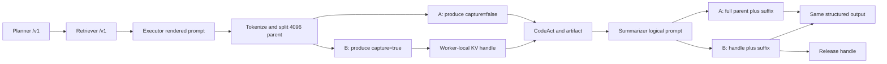

# Engine-Local KV 主链接入与单次 A/B 结果

更新时间：2026-07-30 08:25 CST

状态：最小主链接入完成；Qwen3-32B 物理卡 1 单任务单次 A/B 完成；原 latent 53334 服务已恢复。

后续 10 个不同任务、先 baseline 后 KV 的正式扩展结果见
`docs/reports/engine_local_kv_mainline_10round_results_20260730.md`。该报告应作为主链接入性能结论的
优先读取对象；本文保留为第一次单任务接入证据。

## 1. 结论

本轮已经把独立 KV mechanism probe 接入完整 StateBus smoke 主链：

```text
Planner -> Retriever -> Executor role -> CodeAct -> Summarizer
                              |                         ^
                              +-- EngineLocalKVHandle --+
```

在同一 4k Nova 离线财报任务上，串行执行一次 full replay 和一次显式 KV continuation。结果为：

| 指标 | A：full replay | B：KV continuation | B 相对 A |
| --- | ---: | ---: | ---: |
| Summarizer logical prompt tokens | 4,808 | 4,808 | 完全相同 |
| 实际 computed prefill tokens | 4,808 | 712 | **下降 85.19%** |
| inherited KV tokens | 0 | 4,096 | 增加 4,096 |
| Summarizer TTFT | 1,610.764 ms | 646.490 ms | **下降 59.86%** |
| Summarizer client wall | 7,269.051 ms | 6,199.126 ms | **下降 14.72%** |
| Consumer API request bytes | 20,088 B | 3,184 B | **下降 84.15%** |
| 完整 StateBus 主链 wall | 33,813.521 ms | 30,698.486 ms | **下降 9.21%** |

B lane 的质量门通过，且 A/B 的 Producer 输出 token、Consumer 输出 token、最终 output artifact hash
全部完全一致。B lane 捕获、加载和释放各 1 次，fallback 为 0，结束后 Worker registry 为 0。

这说明当前实现不再只是独立 benchmark runner：KV handle 已经真实跨过 StateBus 的
Executor-to-Summarizer 角色边，同时 Planner、Retriever、CodeAct、typed control、artifact、质量门和
Runtime GC 均保留。

## 2. 实验对象

### 2.1 Git 与代码基线

- 分支：`feat/engine-local-kv-mainline-integration`
- 主链基线：`contest/recovery-core@ac6ec86`
- KV probe 移植：`eb61446`
- 接入规划：`eb7bcaa`
- worktree：`/home/qcrs/statebus/work/engine-local-kv-mainline-integration`

### 2.2 模型与服务

| 项目 | 值 |
| --- | --- |
| 模型 | Qwen3-32B BF16 |
| served model | `qwen3-32b` |
| vLLM | 0.9.2 V1 |
| endpoint | `http://127.0.0.1:53334` |
| 物理 GPU | 1，`GPU-a53fa601-...` |
| tensor / pipeline parallel | 1 / 1 |
| max model len | 8,192 |
| block size | 16 |
| max num seqs | 1 |
| Automatic Prefix Caching | 关闭 |
| KV connector | `StateBusLocalKVConnector` |
| Worker extension | `StateBusKVWorkerExtension` |
| middleware | `KVHandoffMiddleware` |
| engine generation | `kv-mainline-20260730_081610` |

运行期间 vLLM 报告的 prefix cache hit rate 始终为 0。本结果来自显式 handle store/load，
不是 Automatic Prefix Caching 命中。

### 2.3 任务

- task ID：`kv-mainline-nova-4k`
- family：`continuous_long_doc_table_analysis`
- intent：`extract_metric_series_generic`
- 文档：`compiled_parents/kv-fin-4k-nova.txt`
- 目标：提取 Nova `revenue_musd` 的 2026Q1、Q2、Q3 值
- parent：4,096 tokens，按 vLLM block size 16 对齐
- Executor suffix：600 tokens
- Summarizer suffix：712 tokens
- semantic pruning：关闭，保证两个角色看到完整共享 corpus
- replay：关闭
- repeat：1
- 执行顺序：A 后 B，串行，无并发

## 3. 如何接入主链

### 3.1 correctness plane 不变

StateBus 原有正确性链路继续运行：

```text
CanonicalTaskSpec
  -> Planner semantic task plan
  -> Retriever evidence/hydration
  -> Executor structured route/tool decision
  -> CodeAct execution and ExecutionArtifactRef
  -> Summarizer structured output
  -> quality floor, artifact commit, Runtime GC
```

`EngineLocalKVHandle` 没有替代 `StateRef`、`ExecutionArtifactRef`、MemoryProxy 或最终 artifact。
它只是 Executor 和 Summarizer 同 Worker、短生命周期角色边的加速 sideband。

### 3.2 role client 包装

`v2/integrations/vllm_kv/role_client.py` 包装现有 `RoleDispatchLLMClient`：

- Planner、Retriever：继续委托普通 local-vLLM `/v1/chat/completions`；
- Executor：切到 `/statebus/kv/produce`；
- Summarizer：切到 `/statebus/kv/continue`；
- 完成后：调用 `/statebus/kv/release`；
- feature flag 默认 `off`，不开启时 smoke 行为不变。

开关：

```text
STATEBUS_ENGINE_LOCAL_KV_MODE=off|full_replay|continuation
STATEBUS_ENGINE_LOCAL_KV_PARENT_TOKENS=4096
STATEBUS_PREFIX_ALIGNMENT_MODE=shared_evidence_prefix
```

### 3.3 parent/suffix 构造

现有 prompt compiler 已将共享证据放到 position 0：

```text
<statebus-shared-prefix-v1>
  hydrated long evidence
</statebus-shared-prefix-v1>

[STATEBUS_ROLE_SUFFIX:executor|summarizer]
  role-specific instruction, action, artifact and output contract
```

本轮结果导向实现使用服务端同一 `/tokenize` tokenizer 对完整 rendered prompt 编码，再从完整
token 序列切分前 4,096 个 token。Summarizer 调用前严格检查其前 4,096 token IDs 与 Executor
保存的 parent 完全一致；不一致则直接失败，不把 fallback 伪装为 KV 命中。

### 3.4 A/B 两条路径



A lane：

1. Executor `/produce`，`capture_kv=false`；
2. Summarizer `/continue`，`lane=full_replay`；
3. Consumer 请求携带 4,096 parent token IDs 和 712 suffix token IDs；
4. Worker 实际 prefill 4,808 tokens。

B lane：

1. Executor `/produce`，`capture_kv=true`；
2. Worker 保存 64 层、1,073,741,824 bytes 的 parent paged KV；
3. CodeAct 正常执行并形成 artifact；
4. Summarizer `/continue` 只提交 handle 和 712 suffix token IDs；
5. scheduler/connector 恢复 4,096 inherited tokens，只 forward 712 suffix tokens；
6. Consumer 完成后立即 release。

## 4. 详细结果

### 4.1 Producer

| 指标 | A | B |
| --- | ---: | ---: |
| logical input tokens | 4,696 | 4,696 |
| parent / suffix | 4,096 / 600 | 4,096 / 600 |
| computed prefill | 4,696 | 4,696 |
| generated tokens | 59 | 59 |
| client wall | 4,435.463 ms | 5,002.710 ms |
| server first output | 1,534.196 ms | 2,169.138 ms |
| server wall | 4,414.070 ms | 4,959.068 ms |
| KV store | 0 | 2,074.411 ms |
| KV bytes | 0 | 1,073,741,824 |
| layer count | 0 | 64 |

Producer logical token digest 和 output token digest 在 A/B 完全一致。

### 4.2 Consumer

| 指标 | A | B |
| --- | ---: | ---: |
| logical input tokens | 4,808 | 4,808 |
| parent / suffix | 4,096 / 712 | 4,096 / 712 |
| computed prefill | 4,808 | 712 |
| inherited KV | 0 | 4,096 |
| generated tokens | 115 | 115 |
| client TTFT | 1,610.764 ms | 646.490 ms |
| server first output | 1,591.999 ms | 626.271 ms |
| client wall | 7,269.051 ms | 6,199.126 ms |
| server wall | 7,239.069 ms | 6,165.506 ms |
| request bytes | 20,088 | 3,184 |
| connector load count | 0 | 1 |
| KV load | 0 | 320.843 ms |
| `num_cached_tokens_reported` | 0 | 4,096 |

B lane 同时具备 scheduler proof 和 Worker forward proof：

```text
action=load
logical_prompt_tokens=4808
inherited_kv_tokens=4096
computed_prefill_tokens=712
connector_load_count=1
layer_count=64
fallback_count=0
```

### 4.3 完整主链

| 指标 | A | B |
| --- | ---: | ---: |
| 完整 wall | 33,813.521 ms | 30,698.486 ms |
| Planner calls | 1 | 1 |
| Retriever calls | 1 | 1 |
| Executor calls | 1 | 1 |
| Summarizer calls | 1 | 1 |
| workflow steps | 4 / 4 completed | 4 / 4 completed |
| control messages | 4 | 4 |
| CodeAct plan stages/actions | 3 / 3 | 3 / 3 |
| Runtime final state | `GC_DONE` | `GC_DONE` |

这次单次串行 A/B 中，完整链路 wall 下降 3,115.036 ms，即 9.21%。直接 KV 角色段中，
Consumer wall 下降 1,069.925 ms；完整链路还包含 Planner、Retriever、CodeAct、文件系统和 Runtime
阶段的单次时延变化，因此最终叙事以 computed token 与 Summarizer TTFT 作为主要机制指标，完整
wall 作为本次主链观测结果。

## 5. 正确率与一致性

### 5.1 质量门

两条 lane 均为：

```text
quality_floor_pass=true
deterministic_checks_passed=true
fact_coverage_passed=true
quality_floor_fail_reason=""
```

最终提取值：

```text
metric_name = revenue_musd
value_q1 = 142
value_q2 = 156
value_q3 = 169
```

### 5.2 精确等价项

以下 A/B 均完全相同：

- Producer logical token digest；
- Producer output token digest；
- Consumer logical token digest；
- Consumer output token digest；
- Consumer output text digest；
- 最终 output payload digest；
- 最终 output artifact hash：`76060c61cc1cd932fca9f6a4ecd4706ab0b77bb3cd7f3e643209eb243f938b9a`。

因此本轮不是“输出大致相似”，而是 A/B 生成 token 和最终 artifact 的精确一致。

## 6. 运行日志与异常记录

第一次启动主链 runner 时，Planner `max_tokens=256`，其合法 JSON 在 `memory_re...` 处被截断；
RolePathRunner 三次 JSON retry 均在相同上限处失败。该次运行在 Executor/KV producer 之前终止，
没有创建 handle，也没有进入 A/B 统计。

处理方式仅为将 Planner 上限从 256 调至 512，然后重新串行运行完整 A/B。正式结果目录为：

```text
/home/qcrs/statebus/runs/engine_local_kv_mainline/
  mainline-ab-20260730T001932Z/
```

正式运行结束后：

```text
registry_entries=0
registry_bytes=0
store_count=1
load_count=1
registry_peak_entries=1
registry_peak_bytes=1073741824
```

## 7. 证据文件

| 文件 | 内容 |
| --- | --- |
| `summary.json` | A/B 汇总、降幅、所有 digest parity |
| `full_replay/record.json` | A lane 主链、Consumer、质量、artifact 记录 |
| `continuation/record.json` | B lane 主链、store/load/release、质量、artifact 记录 |
| `*/runtime/engine_local_kv_mainline.json` | 原始 Producer/Consumer telemetry 与 proof |
| `*/workspace/kv-mainline-nova-4k/logs/task_metrics.json` | 四角色、CodeAct、control、workflow 指标 |
| `*/workspace/kv-mainline-nova-4k/outputs/result.json` | 最终结构化 artifact |
| `*/runtime/telemetry/runtime_events.jsonl` | Runtime event log |
| `*/runtime/telemetry/runtime_facts.jsonl` | Runtime fact log |

## 8. 代码变更

| 文件 | 作用 |
| --- | --- |
| `v2/integrations/vllm_kv/role_client.py` | task-local Executor/Summarizer KV adapter 与审计 |
| `v2/runtime/smoke.py` | feature flag 注入，不改变默认 off 路径 |
| `v2/integrations/vllm_kv/api_models.py` | role suffix 上限放宽到 4,096 tokens |
| `scripts/run_engine_local_kv_mainline_ab.py` | 单任务单次串行主链 A/B runner |
| `tests/v2/neural/test_engine_local_kv_role_client.py` | A/B 形态、release、prefix mismatch fake tests |

验证结果：

```text
43 passed in 42.68s
python py_compile: pass
git diff --check: pass
```

## 9. 当前边界

这是一版结果导向的最小接入，不是生产级通用实现：

- 只接 Executor-to-Summarizer 一条线性边；
- handle 只在同模型、同 Worker、同 engine generation 内有效；
- 使用 raw rendered prompt 的服务端 tokenizer 切分，尚未补完整 chat-template/JSON-schema 等价层；
- private Executor/Summarizer 路径本轮不返回 top logprobs；
- one-shot handle，不支持 fan-out；
- pageable host KV，4k parent 占 1 GiB；
- 本轮按要求只跑单次，不做 repeat-3；
- 没有运行 prefix/APC 实验，也没有与 APC 联合叠加。

这些边界不影响本轮已证明的事实：在完整 StateBus 主链中，真实 paged KV 被保存和恢复，
Summarizer 只重算 suffix，并在质量、生成 token 和 artifact 完全一致时取得 TTFT、computed token、
request bytes、Consumer wall 和本次完整链路 wall 的正收益。

## 10. 服务恢复

实验只使用物理卡 1，没有停止或修改物理卡 0 上的任务。正式结果归档后：

- `statebus-vllm-kv-mainline` 已停止并保留为 stopped container，日志仍可读取；
- `statebus-vllm-latent-restored` 已重新启动；
- `/v1/models` 返回 `qwen3-32b`；
- `/statebus/latent/health` 返回 `status=ready` 和 `plugin_version=statebus.vllm_latent.v1`。

最终叙事可以直接表述为：

> StateRef、ExecutionArtifactRef 和结构化角色输出继续承担正确性与重放；EngineLocalKVHandle
> 只作为同 Worker 的 Executor-to-Summarizer 性能旁路。在 4k 共享 parent 的完整 StateBus 主链中，
> 显式 KV continuation 继承 4,096 tokens、只重算 712 tokens，使 Summarizer TTFT 下降 59.86%，
> 本次完整链路 wall 下降 9.21%，同时质量门、生成 token 和最终 artifact 保持精确一致。
