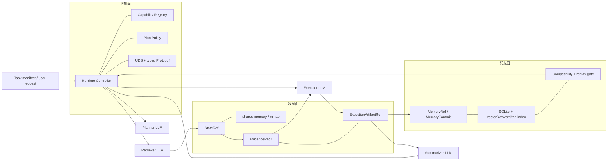
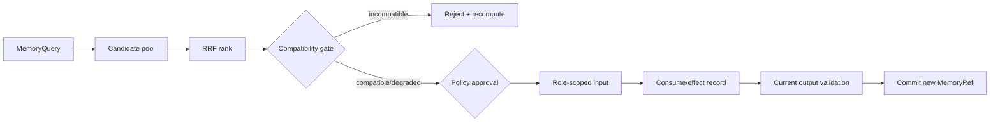
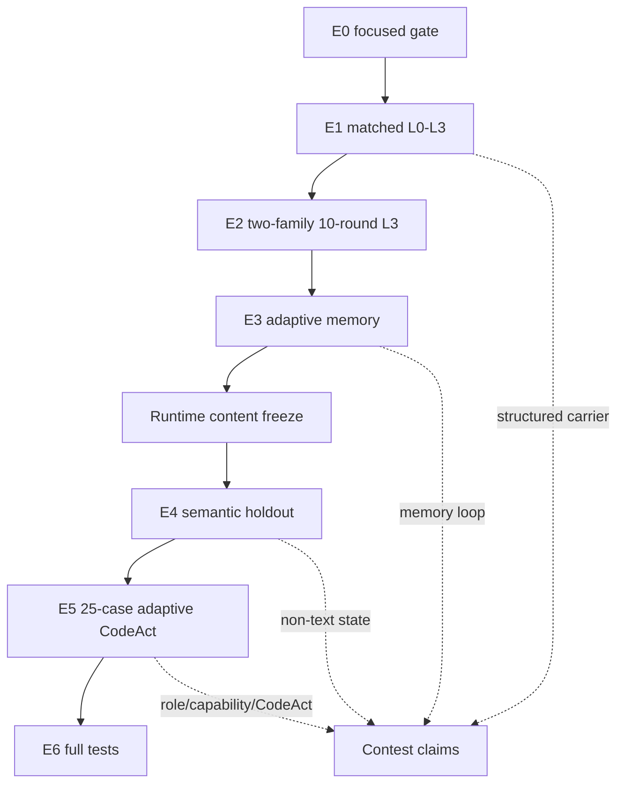

# StateBus v2 全面 Review：协议、状态、记忆、权限与实验可信度

日期：2026-07-20  
Review 对象：`feat/yzm-v2-migration`，当前代码 HEAD `bda17745ecb8a160221efe3b58ca678644dac81a`  
实验对象：`/home/qcrs/statebus/runs/contest_evidence_closure_20260720` 下 E0-E6 canonical runs  
Review 性质：代码与 artifact 的只读审计；本文没有把 review 中发现的问题修改成“已修复”

## 1. 结论先行

StateBus v2 不是只有概念或 Prompt 包装。结构化控制帧、跨进程 embedding matrix、按 Ref hydration、共享记忆检索与兼容性门、CodeAct 沙箱执行、质量重算和审计 artifact 都有真实实现，也有 fresh openEuler 单容器实验支撑。四个角色并非互相传递整段聊天记录；Runtime Controller 把上游产物收敛为 typed contract、Ref 和按角色裁剪的 Prompt surface，再交给下游消费。

但当前实现不能按“所有边界均已闭合、所有复用都已带来效率提升”来汇报。最重要的判断是：

- **结构化协议成立**：E1 在 matched subprocess topology 下证明 Protobuf 相比纯文本显著减少 control bytes 和 total wire bytes；它没有证明 token 同步下降。
- **非文本状态成立**：E4 证明 little-endian float32 embedding matrix 经 shared memory 跨 PID 读取，数值 top-k 的 selected IDs 实际改变 EvidencePack hydration；它不是 hidden state 或 KV tensor handoff。
- **共享记忆机制成立，但消费账需要修正**：commit、load、hybrid retrieval、compatibility、Executor recipe reuse 和拒绝链均存在；E3 记录的 23 条 consumption 中有 15 条 Summarizer 假阳性，且自然任务序列没有稳定省掉 LLM 调用。
- **Agent 分工基本合理**：Planner、Retriever、Executor、Summarizer 有不同的 capability surface 和输出合同；真正拥有 dispatch、Ref 绑定、grant、验证、commit/replay 权限的是 Runtime Controller。
- **embedding 不是一个被“提权”的 Agent**：它是 Runtime 数据面组件。semantic selector subprocess 只做矩阵读取与 cosine top-k，但其 OS 进程继承 Controller 用户身份，且跨进程只校验 grant hash 非空，因此逻辑权限窄、操作系统权限边界仍偏宽。
- **字段消费链大体闭合，但不是完全闭合**：Retriever query 被数值选择器消费，selected IDs 被 hydration 消费，Executor artifact 被 validator 与 Summarizer 消费，MemoryRef 确实进入 bounded-Python Executor；但 Summarizer memory payload 在 worker 内被丢弃后仍被记为 consumed。另一个缺口是 Summarizer 的源级 citation coverage。

综合判断：这是一个**可作为赛题汇总和现场演示基础的完整原型**，工程完整性和状态传递证据较强；通信 token 优势、自然任务记忆节省、跨信任边界授权和 citation 完整性仍需按本文边界诚实陈述。

## 2. Review 方法与证据边界

本轮同时检查了四类证据：

| 证据层 | 检查内容 | 可信度用途 |
| --- | --- | --- |
| 赛题原文 | [题目要求](../reference/题目.md) | 判断功能覆盖与评分口径 |
| 当前源码 | `v2/control`、`v2/runtime`、`v2/state`、`v2/memory`、`v2/benchmark`、`tests/v2` | 判断真实执行路径和逻辑漏洞 |
| canonical artifact | E0-E6 manifest、summary、role request、state/memory consumption、lineage、checksum | 判断某项机制是否在 fresh run 中真的发生 |
| 既有报告 | [最终实验报告](contest_evidence_closure_final_report_20260720.md)、[证据索引](final_v2_contest_evidence_index_20260720.md) | 校验数字、失败历史和 claim boundary |

需要特别区分两个代码身份：canonical E0-E6 的 manifest 记录 HEAD 为 `a3a5ec836d13c5e9d77811edd25d58d24af227b6` 且 `git_dirty=true`，并另有 Runtime content freeze；当前主工作树已导入五个本地提交，HEAD 为 `bda17745...`。因此本文对实验结论引用冻结 artifact，对代码问题引用当前文件内容，不把 dirty snapshot 改写成 clean commit 实验。

## 3. Findings

以下先列问题，再展开架构优点。严重级别表示对赛题陈述、正确性或安全边界的影响，不表示当前所有 benchmark 都已触发。

### R-01 High：step output allowlist 存在可绕过的布尔逻辑

位置：[v2/runtime/plan_policy.py#L285](../../v2/runtime/plan_policy.py#L285)

当前代码先检查 step contract 是否等于 capability descriptor contract，随后使用：

```python
if step.output_contract_version not in envelope.allowed_output_contracts \
        and step.output_contract_version != descriptor.output_contract_version:
    ...
```

如果某个 step 使用 descriptor 自身的 output contract，但该 contract 已被当前 envelope 排除，第二个条件为 false，PlanPolicy 仍可批准。只读构造诊断已经复现：

```text
approved=True
issues=[]
excluded_step_contract=statebus.metric_series.v1
allowed=(statebus.evidence_pack.v2,statebus.cited_report.v1)
```

这不是当前 E5 case 的质量失败，因为 E5 envelope 恰好包含被选 capability 的合同；但它破坏了 envelope 作为任务级输出边界的独立含义。

建议修复：

```python
if step.output_contract_version not in envelope.allowed_output_contracts:
    issues.append(...)
```

验收标准：加入一个 descriptor contract 合法但 envelope 不允许的回归用例，必须得到 `step_output_contract_not_allowed`；同时保留 descriptor mismatch 的独立测试。

### R-02 High：最终 Claim 的源级 citation 没有覆盖全部语义字段

位置：[v2/runtime/claims.py#L63](../../v2/runtime/claims.py#L63)、[v2/benchmark/adaptive_formal_mainline.py#L720](../../v2/benchmark/adaptive_formal_mainline.py#L720)；S4 artifact 见 walkthrough 中的固定路径。

E4 `semantic-holdout-s4` 最终 Claim 是：

```text
In 2026Q2, the Delta Hub had a throughput of 760 units, with a shipment
qualifier of 'capacity-capped pending rail-slot approval'.
```

它只引用 `ctx-section-4`。该 evidence item 是 `Throughput table`，支持 `760`，却不包含 shipment qualifier。qualifier 的源文本位于 `Operating constraint`，在该 case 中对应另一 evidence item。最终 Claim 还引用了已验证的 ExecutionArtifactRef，所以“值完全没有来源”并不准确；准确问题是：**面向原始材料的 citation 不完整，无法从 Claim 的 citation 独立追溯 qualifier**。

[ClaimSetValidator](../../v2/runtime/claims.py#L17) 当前验证：

- evidence/artifact ID 是否存在；
- locator 是否属于 EvidencePack；
- artifact 是否 verified，task/session provenance 是否一致；
- numeric field 是否出现在 verified artifact scalars 中。

它没有验证 `claim_text` 中每个事实字段与相应 evidence text 的语义蕴含关系。上游 `_row_scoped_evidence_items()` 又对每个 output row 只选 token-overlap 分数最高的一条 evidence；一个 row 同时合并 table 与 narrative 时，这个算法天然会丢掉第二来源。S4 的 Summarizer Prompt 因而只提供 Throughput table，模型无法补出正确的 qualifier 源 citation。

建议修复：先修 projection，再修 validator。

1. Summarizer reference catalog 必须覆盖 verified row 的字段级 lineage，例如 `throughput_units -> ctx-section-4`、`shipment_qualifier -> ctx-section-1`。
2. Claim contract 增加 `field_support`，要求每个 factual output field 显式映射到 evidence ID 或 verified derived-artifact field。
3. Validator 对所有非空 factual fields 做 coverage 检查；对 derived field 要求 artifact lineage 最终落到 source locator。

验收标准：S4 旧 Claim 必须 fail closed；同时引用 Throughput table 与 Operating constraint 后才通过。

### R-03 High：跨进程 CapabilityGrant 不是强授权凭证，worker 也未降 OS 权限

位置：

- [v2/contracts/adaptive.py#L541](../../v2/contracts/adaptive.py#L541)
- [v2/control/statebus_v2.proto#L40](../../v2/control/statebus_v2.proto#L40)
- [v2/control/subprocess_worker.py#L166](../../v2/control/subprocess_worker.py#L166)
- [v2/control/transport.py#L559](../../v2/control/transport.py#L559)

主进程内 `CapabilityGrant` 绑定 task/session/step/attempt、capability、input refs、output contract、workspace、runtime、expiry 和 approved plan hash，设计本身合理。但跨进程 `ExecRequest` 只携带 `capability_grant_hash`；worker 只检查它非空，没有拿完整 grant 回查 registry，也没有签名/MAC、nonce/replay 防护或 expiry 校验。

此外 semantic selector worker 由普通 `subprocess.Popen` 启动，继承 `env`、`cwd` 和父进程 Unix identity。它不像 bounded Python CodeAct 那样进入 bwrap 并降到 UID/GID 65534。读取 mmap 时有 state-root containment、hash、shape、lease 和 encoder signature 校验，这能防错误 Ref 和部分路径逃逸，但不是 OS 级最小权限。

因此当前准确表述是“**进程内 capability binding + 跨进程 hash correlation**”，不能称“跨信任边界的不可伪造授权”。embedding selector 也不是一个获得额外 LLM 工具权限的 Agent；它是继承 Runtime 身份的内部数值 worker。

建议：使用 runtime-owned grant registry，由 worker 通过 UDS 上的短期 grant ID 回查完整 canonical payload，或传完整 payload 加 HMAC；校验 peer credentials、expiry、task/step/ref exact match；semantic worker 使用最小只读 mount、独立 UID 或 fd-only shared-memory handoff。

### R-04 High：Summarizer memory consumption 是假阳性，完整 recipe 在 worker 边界被静默丢弃

位置：

- [v2/runtime/adaptive_dispatcher.py#L590](../../v2/runtime/adaptive_dispatcher.py#L590)
- [v2/benchmark/adaptive_formal_mainline.py#L1419](../../v2/benchmark/adaptive_formal_mainline.py#L1419)
- [scripts/v2_diagnostics/run_adaptive_agent_smoke.py#L540](../../scripts/v2_diagnostics/run_adaptive_agent_smoke.py#L540)
- [v2/runtime/role_path.py#L2474](../../v2/runtime/role_path.py#L2474)

`_build_role_memory_inputs()` 为 Executor 和 Summarizer 构造相同结构的 memory payload，其中包含完整 `execution_recipe.source`。formal mainline 又把它放进 isolated Summarizer worker 的 `compatible_memory_inputs` 字段。可是 worker 的 Summarizer 分支只取 evidence、artifact summaries、task goal 和 claim count；调用 `RolePathRunner.build_claim_set()` 时没有传 memory。该方法本身也没有 memory 参数。

持久化的 `benchmark-sample-2` Summarizer request 进一步确认：Prompt 中没有 Q1 memory ID、`2026Q1` recipe 或 execution source。也就是说：

- generic worker subprocess 的 stdin 不必要地接收了完整 recipe；
- recipe 没有进入 Summarizer LLM Prompt，也没有影响 ClaimSet；
- Dispatcher 仍在 Summarizer 返回后无条件调用 `_record_memory_consumption()`，写入 `role_input_augmented`。

E3 的 23 条 consumption 按记录分为 Executor 8、Summarizer 15；后 15 条不能作为“Agent 实际消费 memory”的证据。8 条 Executor 记录也不能一概按逐 ID 消费解释：合成负例一次拿到 5 个 memory inputs，只有一条 recipe 标记 `recipe_recomputed=true`，其余四条在没有生成/repair LLM 调用的情况下仍被统一记为 `role_input_augmented`。这个问题比单纯过宽披露更严重，因为它直接影响赛题核心指标的真实性，也意味着当前只可靠证明跨任务 Executor recipe reuse，尚未证明跨角色 Summarizer memory reuse。

建议同时修数据流与记账：

1. 定义 `summarizer_memory_view`，只包含 summary、source、compatibility、artifact lineage、recipe hash 和验证状态，绝不包含 Python source。
2. 明确把 narrow view 加入 `build_claim_set()` 的 Prompt payload；若产品语义不需要它，则不要发送，也不要记录消费。
3. role factory 返回实际 `consumed_memory_ids`；Dispatcher 只对显式回执的 ID 记 consumption。
4. before/after hash 应绑定 persisted rendered request，而不是绑定“准备发送”的 Python dict。

验收标准：Prompt artifact 中出现允许的 memory summary 且无 recipe source；删除 memory view 时 Prompt hash/输出 surface 产生可观测差异；未渲染的 memory ID 不得生成 consumption record。

### R-05 Medium：固定 L0-L3 worker 普通路径不执行业务计算

位置：[v2/control/subprocess_worker.py#L271](../../v2/control/subprocess_worker.py#L271)、[v2/runtime/driver.py#L434](../../v2/runtime/driver.py#L434)

`semantic_select_v1` 分支真实读取 matrix 并计算 top-k；普通分支只在 ACK/RUN/HEARTBEAT 后回显 state/artifact refs 和 output contract。固定 benchmark 的业务 output artifact 在 exchange 前已由主 Runtime 路径产生。

这不否定 E1：E1 仍然证明 matched text/Protobuf carrier、UDS framing、lifecycle、Ref transport 和字节差异。它限制的是陈述范围：不能说“L0-L3 的 subprocess worker 承担了 Planner/Retriever/Executor/Summarizer 的业务计算”。

建议：文档保持 carrier benchmark 口径；若要证明 remote worker computation，再加一个可验证的 worker-owned operation 和 output hash。

### R-06 Medium：Adaptive Planner 是受控自主性，不是独立生成可执行 DAG

位置：[v2/benchmark/adaptive_formal_mainline.py#L441](../../v2/benchmark/adaptive_formal_mainline.py#L441)

E5 的 25/25 都记录 `planner_schema_normalization_used=true`。其中 20/25 的原始 Summarizer dependency 未覆盖 Retriever evidence，Controller 编译器补上 typed dependency；Controller 还拥有稳定 step ID、input Ref、output contract、required fields 和 failure action。

Planner 真正决定的是：

- registry 内 capability 选择；
- 每一步的语义 goal；
- DSL 与 bounded Python 的路线；
- completion criteria 的候选内容。

Runtime 决定的是可执行性与边界。这个设计是合理的，尤其适合 fail-closed 系统；问题只在于不能把 E5 写成“Planner 无 Controller 修正便独立产生 25 个可执行 DAG”。

建议新增指标：raw plan directly executable、controller-normalized、model-repaired、hard-rejected 四类分开统计。

### R-07 Medium：普通 memory behavioral effect 主要证明输入面改变，不证明质量因果

位置：[v2/runtime/adaptive_dispatcher.py#L692](../../v2/runtime/adaptive_dispatcher.py#L692)

`role_input_augmented` 的 before/after decision-surface hash 会因 `memory_inputs` Python dict 加入而变化，但当前 hash 不是从 persisted rendered Prompt 计算。R-04 已证明 Summarizer 即使没有渲染该字段也会得到 `role_input_augmented`；多候选 Executor 也会在只有一个 recipe 被使用时为其余 ID 记相同 effect。所以该指标至多证明 Dispatcher 准备了 payload；它不能逐 ID 证明“角色读取”，更不能证明：

- 模型读懂或依赖了该记忆；
- 输出内容因记忆而改善；
- token、调用数或时延下降；
- 没有记忆时会得到更差答案。

建议先把 hash 改为绑定实际 rendered request/执行 recipe，再为 assist 类增加 paired no-memory counterfactual，比较 output hash、质量、调用数和 token。修复前不要把该 hash 单独作为消费证据或质量增益。

### R-08 Medium：自然任务 memory 没有稳定跳过 LLM

E3 五个自然 financial cases 均为 `validated_replay_count=0`、`skipped_llm_call_count=0`。唯一一次 skip 来自 `adaptive-memory-negative-runtime` 合成负例。

更值得展示的是 Q1→Q2 的真实链：Q2 向量命中 Q1 recipe，compatibility 为 `degraded`，原因是 canonical task arguments 与 input lineage 改变；Q1 的 2026Q1 recipe 在 Q2 输入上先失败，随后触发一次 LLM repair。Q2 记录 `llm_codeact_generation_count=0`，但 `llm_codeact_repair_count=1` 和 `skipped_llm_call_count=0`。因此它证明 recipe reuse/recompute/repair，不证明自然任务省去模型调用。

建议将 replay eligibility 收紧为“预计无需模型 repair 才可计入 skipped LLM”，并增加真实 exact-input 或参数化 recipe 场景。

### R-09 Medium：semantic state 的 logical owner 与 physical consumer 记账混在一起

位置：[v2/runtime/adaptive_dispatcher.py#L382](../../v2/runtime/adaptive_dispatcher.py#L382)

请求发生在 Retriever step 内，`consumer_step_id="retrieve-evidence"`，但 `target_role` 和 consumption record 写成 `executor`。这不会改变 selected IDs，但会让审阅者误以为 Executor Agent 在 Retriever 阶段被提权。

建议拆成：

```text
logical_owner_role = retriever
physical_consumer_component = runtime_semantic_selector
physical_consumer_pid = ...
downstream_role = executor
```

并将 identity 类字段从可求和 counter 改成 event attribute 或 set/gauge。S4 汇总中的 `semantic_state_consumer_pid=929607` 实际是三个 PID 的和，不是进程号；`publish/consume/transfer=6` 也与三份 metadata、三条 selection/consumption record 的物理基数不一致，存在 stage metric 与 event metric 重复聚合。

### R-10 Medium：能力发现存在，但没有 wire-level Hello/Capability negotiation

[CapabilityRegistry.public_view](../../v2/runtime/capability_registry.py#L44) 向 Planner 提供过滤后的 capability surface，满足赛题“握手、能力发现或协议映射”三选一中的能力发现。Proto event 只有 REQ/ACK/RUN/HEARTBEAT/RESULT/CANCEL/TRAP/GC，没有 Hello、版本协商或 capability advertisement frame。

正式报告可写“进程内 capability registry discovery + typed protocol mapping”，不能写“worker 在 UDS 上完成能力握手”。若现场评委特别关注协议协商，建议补 `HELLO / HELLO_ACK`，携带 protocol version、supported operations、contract versions 和 registry digest。

### R-11 Medium：E5 没有自然选择 semantic Retriever

E5 25/25 都选 `retrieve_table_evidence_v1`；semantic route 的自然覆盖由 E4 的 3/4 case 提供。E5 仍能证明 Adaptive Planner 和 DSL/Python 自然分布，但不能单独证明“25-case adaptive mainline 覆盖 semantic state”。

### R-12 Low：实验与工程债务需要保留在汇总中

- E1 lane 固定 L0→L1→L2→L3，无随机化或反向重复；时延受 vLLM warm state 和顺序影响。
- L0→L1 prompt tokens 为 `+2.88%`，不能宣称 typed Protobuf 自身节省 token。
- E4 是 Runtime 内容冻结后的 holdout，不是双盲或第三方数据集。
- E6 为 `558 passed, 100 warnings`；warning 主要来自旧 Protobuf generated-code deprecation，虽不影响 pass，仍是升级债务。
- CodeAct 的 bwrap、non-root、network unshare 和只读输入是真实隔离，但不是 production-grade sandbox。
- 当前只验证 openEuler 24.03 LTS-SP3 单容器，不代表 openEuler VM、跨机或任意 Linux 已验证。

## 4. 赛题要求逐项映射

| 赛题要求 | 当前实现 | 实验证据 | Review 结论 |
| --- | --- | --- | --- |
| 不少于 3 个 Agent | Planner、Retriever、Executor、Summarizer | E4/E5 role requests 与 model role records | 满足；Controller 不是第五个 LLM Agent |
| 结构化通信含动作、参数、结果、能力 | EventType/operation、typed Ref/contract、Success/Error、CapabilityRegistry | E1、E5 | 满足；能力发现为进程内 registry，不是 wire handshake |
| 纯文本与结构化同任务对比 | L0 `utf8_text`、L1 typed Protobuf，matched topology | E1 40 cases | 满足；比较对象是 carrier，不是两个完全独立系统 |
| 非文本状态直接交换 | float32 embedding matrix、StateRef、shared memory/mmap、cross-PID top-k | E4 | 满足且消费证据强；不是 hidden/KV transfer |
| 共享记忆存储、检索、复用 | MemoryRef/Commit、SQLite、可选 FAISS/向量、keyword/tag、RRF、compatibility gate | E1-E3 | 存储/检索与 Executor 跨任务复用满足；跨角色消费记账失真，自然效率收益偏弱 |
| 至少 2 组关联连续任务 | financial report family、operating metrics family | E1/E2 各 10 轮 | 满足 |
| 消息、文本、状态、时延、命中率、性能 | telemetry 和 contest aggregator | E1-E5 | 基本满足；“命中”必须按漏斗分层，时延仅描述性 |
| 稳定不少于 10 轮 | 两个 family 各 10/10 | E2 | 满足 |
| CodeAct | LLM Python、静态策略、bwrap、schema/provenance/recompute | E4/E5 | 满足鼓励项；不是生产沙箱 |
| openEuler 24.03-LTS-SP3 | 单容器 fresh tests/runs | E0-E6 | 满足当前容器交付门；VM/跨机未证明 |

## 5. 系统结构与责任边界

### 5.1 三个平面



这张图中的 LLM 角色不直接打开任意路径，也不彼此建立自由 RPC。Controller 负责把对象变成该角色可见的 bounded Prompt，并在角色返回后解析、校验、绑定 Ref。

### 5.2 权限矩阵

| 主体 | 可读 | 可决定/可写 | 明确不能做 | Review |
| --- | --- | --- | --- | --- |
| Planner | task goal、输入 Ref 摘要、capability public view、预算 | capability、语义 goal、completion criteria、有限 DAG | dispatch、执行 code、注册 capability、扩大 Ref、选择路径/网络 | 合理；Controller normalization 较重，应透明统计 |
| Retriever | bounded task goal、允许 corpus/evidence type | 1-3 queries、evidence types、candidate budget | 返回答案、读任意 corpus、执行工具、改 target/time scope | 合理；query 确实进入 embedding/top-k |
| Semantic selector | 一个 StateRef、manifest、top-k/budget | selected IDs/scores | LLM 推理、生成答案、写业务 artifact | 不是 Agent；逻辑权限窄，OS identity 仍过宽 |
| Executor | approved source/evidence refs、schema、有限 memory view | DSL 或 bounded Python candidate | shell/network、任意 import/call、修改输入、直接宣布 verified | 分工合理；bwrap + validator 构成主要可信边界 |
| Summarizer | verified rows、有限 evidence catalog、artifact IDs | ClaimSet 文本与引用组合 | 修改 verified rows、生成新数值、执行 recipe | citation projection 有缺口；memory 被记录为消费但未进入 Prompt |
| Runtime Controller | 全部 registry、refs、lineage、policy、validator、telemetry | wiring、grant、dispatch、重试、commit、replay、最终状态 | 不应读取 benchmark gold 做 Runtime 决策 | 权限最大且符合架构；需要强化跨进程 grant 与审计 |

## 6. Producer 到 Consumer 的闭环检查

“产出以后是否有人消费”不能只看文件存在，必须找到真实 consumer 和 observable effect。

| 上游产物 | Producer | 下游 Consumer | 实际用途 | 闭环状态 |
| --- | --- | --- | --- | --- |
| `CanonicalTaskSpec` | task compiler/manifest | Planner、Controller、memory compatibility | goal/schema/filters、plan envelope、query identity | 闭合 |
| raw PlanProposal | Planner | plan parser、Controller compiler、PlanPolicy | capability 选择、goal；补 stable IDs/dependency/Ref | 闭合，但 25/25 经 normalization |
| approved steps | Controller | dispatcher、grant issuer、role Prompt builder | 决定每步角色、capability、输入/输出合同 | 闭合 |
| Retriever queries | Retriever | embedding encoder + semantic fanout | row 0 query vector，驱动 top-k | 闭合；E4 counterfactual candidate set changed |
| dense semantic matrix | embedding runtime | independent selector PID | cosine matrix product、budget pruning | 闭合；hash/shape/encoder/lease 均校验 |
| selected candidate IDs | selector | hydration/projection | 决定 EvidencePack 中实际 evidence | 闭合；decision-surface hash changed |
| EvidencePack | Retriever pipeline | Executor、Summarizer、Claim validator | 分析输入、source citation、coverage validation | 基本闭合；S4 Summarizer projection 漏 qualifier source |
| ExecutionArtifactRef | Executor + Runtime | quality validator、Summarizer、memory commit | verified rows、数值支持、lineage、commit | 闭合 |
| ClaimSet | Summarizer | ClaimSetValidator、terminal report | final cited result | 结构闭合，语义 citation coverage 不完整 |
| MemoryRef candidate | Memory store | compatibility/policy gate | 决定是否可进入角色输入 | 闭合；candidate 不等于消费 |
| approved memory payload | Controller | Executor；Summarizer 路径预期消费 | Executor recipe recompute；Summarizer intended augmentation | Executor 闭合；Summarizer payload 被 worker 丢弃 |
| memory consumption record | Runtime | telemetry/evidence aggregator | 区分 queried/candidate/approved/consumed/effect | 部分失真；E3 有 15 条 Summarizer 假阳性 |

整体不是“拍出来没人用”的演示链：semantic selected IDs 改变 hydration、Executor recipe 在当前输入重算都是强消费证据。但 memory 的 consumer step/downstream Ref 记录不能单独采信，Summarizer 路径正是反例。最明显的下游缺口是 Summarizer memory 假消费与 source citation coverage。

## 7. 结构化协议审计

### 7.1 当前协议实际承载什么

[statebus_v2.proto](../../v2/control/statebus_v2.proto) 定义：

- `ControlHeader`：trace/task/step/attempt/target role/timeout/event type；
- `ExecRequest`：reuse policy、state/artifact/memory Ref、operation、output contract、workspace/manifest、semantic selection 参数和 grant hash；
- lifecycle：`ACK_RECV -> RUN_START -> HEARTBEAT -> RES_SUCC/RES_ERR`；
- terminal control：CANCEL、TRAP、GC。

action type、输入参数、返回结果均在 wire contract 中；capability description 由 registry public view 提供给 Planner，再由 Controller 映射到 operation/output contract。当前 wire 上没有完整 capability descriptor 或 negotiation。

### 7.2 E1 证明与未证明

四个 lane 共享 task/source、角色图、模型配置、subprocess topology、validator 与 capability surface，只改变 carrier、semantic state、memory flags：

| Lane | 主要变量 | 10-case 质量 |
| --- | --- | ---: |
| L0 | matched UTF-8 text carrier | 10/10 |
| L1 | typed Protobuf carrier | 10/10 |
| L2 | L1 + embedding StateRef/hydration | 10/10 |
| L3 | L2 + shared memory reuse | 10/10 |

L0→L1 的 control bytes `-83.05%`、wire bytes `-68.95%`，是强证据；prompt tokens `+2.88%`，所以结构化 carrier 没有单独带来 token 优势。L1→L2 prompt tokens `-55.76%` 与 prompt-visible bytes `-81.10%`，收益主要来自 semantic selection 后少量 hydration，而非 Protobuf 自身。

## 8. 非文本状态审计

### 8.1 生成、发布、接收、消费

1. Retriever 生成 bounded queries。
2. Qwen3-Embedding-0.6B 对 `[query; candidates]` 编码并 L2 normalize。
3. [semantic_state.py](../../v2/state/semantic_state.py) 以 `<f4`、`query_then_candidates` 布局发布；短生命周期对象优先 shared memory，可回退 mmap。
4. `SemanticStateRef` 与 sidecar 携带 state ID、blob hash、shape、dtype、byte order、encoder signature、manifest hash、owner session 和 lease。
5. 独立 subprocess 解析 Ref，校验 metadata、路径、hash、shape、finite、normalization、encoder signature 和 lease。
6. worker 做 cosine top-k/budget pruning，只回传 selected IDs/scores/row indices，不把矩阵转回长文本。
7. Controller 用 selected IDs hydrate EvidencePack，再释放 shared memory。

S4 的三个 query 各形成 `[6,1024]`、24,576 bytes matrix，总计 73,728 bytes；producer PID 308338，consumer PID 309803/309869/309935，三条 record 均为 `behavioral_effect=changed`。这是“直接非文本状态传递并被下游决策消费”的完整链。

### 8.2 准确边界

- 这是 embedding/semantic matrix，不是模型层 hidden state。
- 没有 KV tensor 跨 Agent、跨进程或跨机传递。
- `Engine-Local Prefix Reuse` 的估算或调度信号也不能改写成 KV cache transfer。
- embedding encoder 和 selector 是 Runtime component，不是第五个自主 Agent。

## 9. 共享记忆审计

### 9.1 数据模型与检索

Memory 单元包含 memory ID、source agent/task、创建时间、task theme、summary、tags、artifact lineage、manifest、output contract、runtime signature、validator digest、input lineage 和可选 execution recipe。存储以 SQLite 为持久索引，向量检索可使用 FAISS，缺失时回退 cosine；keyword、tag、vector 三路用 RRF 融合。

关键顺序是：



兼容性在排名之后执行，检查 runtime signature、output contract、validator digest、canonical task/arguments、input schema 与 lineage。高相似度不能绕过 compatibility gate。

### 9.2 指标必须按漏斗读

以下概念不能合并成“命中”：

```text
query
  -> candidate
  -> compatible/degraded or incompatible
  -> policy approved
  -> projected to role input
  -> consumed with observable decision-surface change
  -> assist / validated replay / exact replay
  -> skipped step / skipped LLM call
```

E3 的 `candidate=16` 不等于 16 次有效复用；`approved=15` 也不等于 15 次 replay。聚合记录把同一 memory 对 Executor/Summarizer 的投影计成 23 次 consumption，其中 Executor 8 条、Summarizer 15 条。代码与 rendered request 对照表明 15 条 Summarizer 记录是假阳性，因此 23 不能再作为真实角色消费总数。

### 9.3 当前收益判断

机制证据强于性能收益证据。E1/E2 有两次 validated replay 与两次 skipped step，但 `skipped_llm_call_count=0`；E3 有一次 skipped LLM，来自合成负例。自然 Q1→Q2 发生 recipe reuse、失败和 repair，仍调用模型。正式汇总应强调“跨任务知识已沉淀并进入决策”，将“稳定减少重复计算”列为下一阶段待加强证据。

## 10. CodeAct 审计

Adaptive Executor 可选择 declarative DSL 或 bounded Python：

- Planner 只能从 registry 选择 `execute_analysis_dsl_v2` 或 `execute_bounded_python_v2`；
- LLM 生成的 Python 先经 AST/调用 allowlist 静态策略；
- 输入以只读 workspace materialize，输出目录单独可写；
- bwrap 隔离网络，执行 UID/GID 65534；
- Runtime 检查 exit/timeout、output schema、provenance、completion criteria；
- formal validator 对输出重新计算，只有 verified artifact 可进入 Summarizer 和 memory commit。

E5 25 cases 中 DSL 7、bounded Python 18，fallback 0；18 个 Python execution record 都是 bwrap + UID/GID 65534。S4 还证明拒绝/修复链不是摆设：`re.compile` 静态拒绝、`KeyError` runtime repair、locator quality mismatch、最终 verified。

边界：bwrap 是当前单容器内的轻量隔离证据，不是多租户生产沙箱认证；LLM 生成 code 的安全性最终依赖静态 policy、mount policy、kernel namespace 和 validator 的组合。

## 11. E0-E6 实验证据审计

| ID | canonical run | 主要问题 | 结果 | 能支持的结论 |
| --- | --- | --- | --- | --- |
| E0 | `e0_focused_20260720_142422` | 基础门是否稳定 | 135 passed + preflight | focused 工程门通过 |
| E1 | `e1_causal_serial_20260720_150801` | L0-L3 单变量效果 | 40/40 | carrier bytes、semantic hydration、L3 漏斗 |
| E2 | `e2_stress_serial_20260720_152924` | 两组 10 轮稳定性 | 20/20 | 连续任务稳定；仅 L3，不是四层对照 |
| E3 | `e3_adaptive_memory_final_20260720_160244` | Adaptive memory 闭环 | 6/6 | commit/load/match/consume/reject/recompute |
| E4 | `e4_semantic_holdout_final4_20260720_175430` | 冻结 Runtime 后 semantic holdout | 4/4 | semantic 3、table 1，跨 PID 状态消费 |
| E5 | `e5_adaptive_final_20260720_190107` | Adaptive Planner/DSL/CodeAct | 25/25 | table Retriever 25，DSL 7/Python 18 |
| E6 | `e6_full_final_20260720_201043` | 完整回归 | 558 passed, 100 warnings | 当前容器回归门通过 |

这些是互补实验，不是一次 run 同时证明全部能力：



失败 run 被保留且不进入 canonical 聚合，这一点提高了可信度。E4 从 1/4、2/4、3/4、2/4 到 final4 4/4，E5 从 24/25 到 25/25，E6 从 555/558 到 558/558；应把这解释为 fail-closed 迭代和 fresh rerun，而不是只展示成功样本。

## 12. 修复路线与验收标准

### P0：报告或答辩前应完成

| 项目 | 修改 | 验收 |
| --- | --- | --- |
| PlanPolicy allowlist | 去掉错误 `and`，独立执行 envelope allowlist | excluded descriptor contract 必须 reject |
| S4 citation projection | verified row 字段映射到全部 source evidence | throughput 与 qualifier 均有源 locator |
| Claim field coverage | 新增 field-level support validation | 缺任一事实字段 support 时 fail closed |
| truthful claims | 所有报告使用本文“可/不可声明”口径 | 搜索无 hidden/KV transfer、exact replay、稳定 token/latency superiority 误述 |

### P1：强化角色权限与记忆证据

| 项目 | 修改 | 验收 |
| --- | --- | --- |
| memory consumer truth | 将 narrow summary 真正渲染给 Summarizer或停止记账；禁止发送 source | rendered Prompt、explicit consumed-ID receipt 与 record 三者一致 |
| grant enforcement | 完整 grant registry/HMAC、expiry、peer credentials、exact Ref binding | 伪造/过期/跨 step grant 均 reject |
| semantic worker least privilege | fd-only 或只读 mount + UID drop | worker 无法读取 state root 之外的 canary |
| semantic accounting | logical/physical/downstream 三角色字段分离 | PID 不再作为求和 metric |
| memory counterfactual | paired with/without memory | 输出、质量、token、调用数分别报告 |

### P2：增强评分说服力

| 项目 | 修改 | 验收 |
| --- | --- | --- |
| wire negotiation | Hello/ACK + protocol/capability version | 不兼容 worker 在执行前 fail closed |
| latency design | lane order 随机化或 ABBA、多次独立冷/热重复 | 给出置信区间，不只给单次 p50/p95 |
| natural replay | 参数化 recipe 或 exact-input natural cases | 自然任务稳定出现 non-zero skipped LLM |
| broader holdout | 第三方冻结 manifest/盲测 | Runtime 与 case authoring 分离，保留签名清单 |

## 13. 对外可声明与不可声明

### 可以声明

- 在 matched subprocess topology 下，typed Protobuf 相比 matched text 显著减少 control 与 total-wire bytes。
- Qwen embedding matrix 经 shared-memory StateRef 跨 PID 读取，cosine top-k 改变 selected IDs 与 Prompt hydration。
- MemoryRef 经过 candidate、compatibility 和 approval；bounded-Python Executor 有实际 recipe 消费、current-input recomputation 与 incompatible rejection。现有 Summarizer consumption 数字不可作为真实消费证据。
- Planner、Retriever、Executor、Summarizer 在冻结 capability surface 内分工；Runtime Controller 负责授权、wiring、验证和 commit。
- 25-case Adaptive run 自然选择 DSL 7 次、bounded Python 18 次，全部通过质量门且无 sandbox fallback。
- openEuler 24.03 LTS-SP3 单容器内完成 fresh E0-E6，完整 `tests/v2` 为 558 passed。

### 不可声明

- Protobuf 自身稳定节省 token；本轮 L0→L1 prompt token 实际略升。
- 整体时延稳定优于 baseline；固定顺序单次 run 只支持描述性读数。
- 每个 memory candidate、history artifact 或 approved match 都是 replay/hit。
- 自然任务已经稳定跳过 LLM；当前证据不支持。
- 已实现 hidden-state 或 KV-cache tensor 跨 Agent 传递。
- CapabilityGrant 已构成跨信任边界的强认证授权。
- bwrap 路径已经是 production-grade sandbox。
- 已验证 openEuler VM、跨机器、任意 Linux 或开放域泛化。

## 14. 最终评价

从赛题目标看，StateBus v2 的最有说服力部分不是“四个 Agent 都用了不同 Prompt”，而是它建立了可检查的系统层链条：typed control contract 管动作和生命周期，StateRef 管非文本状态身份与生命周期，ExecutionArtifactRef 管可验证执行输出，MemoryRef 管跨任务经验，并由 Controller 把角色权限和 consumer 关系连接起来。

当前最大风险也恰好位于系统边界，而非模型效果：output allowlist 的布尔逻辑、跨进程 grant 的弱校验、Summarizer memory 假消费及不必要的 worker 级 recipe 传输、以及 source citation 的字段覆盖。这四项修复后，系统会从“机制完整、实验可用的赛题原型”进一步接近“权限与证据语义真正闭合的可信 Runtime”。

关联文档：

- [正式系统、任务与实验报告](statebus_v2_system_task_experiment_report_20260720.md)
- [S4 端到端任务流转说明](statebus_v2_end_to_end_task_walkthrough_20260720.md)
- [赛题证据闭环最终报告](contest_evidence_closure_final_report_20260720.md)
- [canonical artifact 索引](final_v2_contest_evidence_index_20260720.md)
