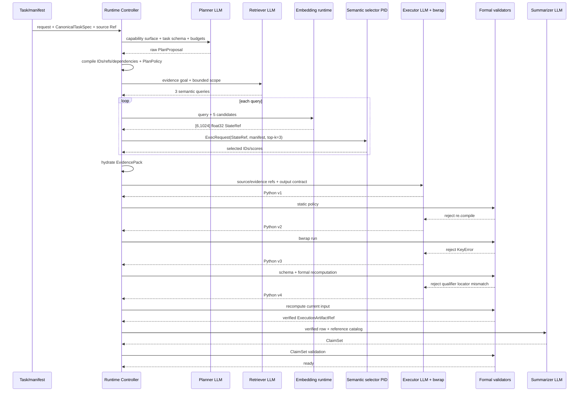
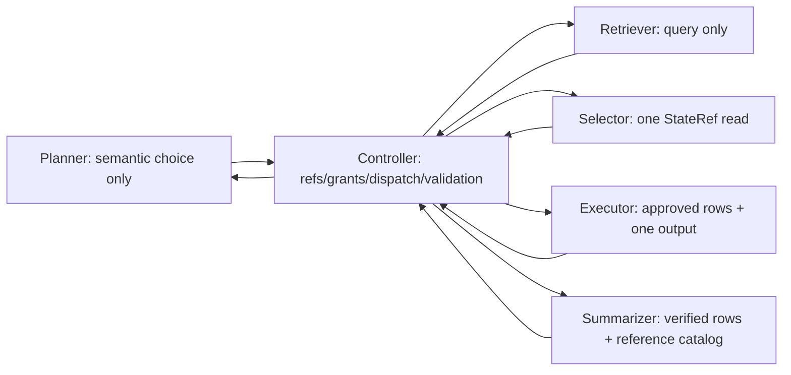

# StateBus v2 端到端任务流转说明：从 S4 到跨任务记忆复用

日期：2026-07-20  
主案例：E4 `semantic-holdout-s4`  
补充案例：E3 `benchmark-sample-1 -> benchmark-sample-2` memory reuse  
目的：逐步说明 Prompt、输入输出字段、Ref、权限、消费者、重试和最终结果

## 1. 为什么选这个任务

S4 不是简单查一个表格单元格。它要求在同一份离线 review 中合并两种来源：

```text
For Delta Hub in 2026Q2, combine the observed throughput row with
the shipment qualification stated in the same review.
Return both source values and the qualifier's section heading.
```

要得到完整答案，系统必须：

1. 在结构化表格中找到 `Delta Hub / 2026Q2 / throughput_units=760`；
2. 在 narrative section 中找到 shipment qualifier；
3. 返回 qualifier 所在 section heading，而不是文件 locator；
4. 把两个来源合并成一个 verified row；
5. 生成有引用的 ClaimSet。

它同时覆盖 Planner capability 选择、Retriever query、embedding StateRef、跨进程 top-k、mixed rows CodeAct、三类 repair、formal recomputation 和 Summarizer citation，因此适合检查“每个上游产物有没有被下游真正消费”。

## 2. 原始证据位置与身份

主 artifact 根：

```text
/home/qcrs/statebus/runs/contest_evidence_closure_20260720/
e4_semantic_holdout_final4_20260720_175430/runtime/semantic-holdout/
semantic_holdout_20260720_095449_678020029/cases/semantic-holdout-s4
```

本文后续称它为 `S4_ROOT`。关键文件：

```text
S4_ROOT/summary.json
S4_ROOT/planner_trace.json
S4_ROOT/source/source_rows.json
S4_ROOT/executor_initial_raw.txt
S4_ROOT/executor_repair_1_raw.txt
S4_ROOT/executor_repair_2_raw.txt
S4_ROOT/executor_repair_3_raw.txt
S4_ROOT/runtime/state/metadata/*.json
S4_ROOT/runtime/state/manifests/*.json
S4_ROOT/runtime/adaptive_attempts/adaptive-attempt-2/
  codeact-quality-repair-3/inputs/task.json
  codeact-quality-repair-3/outputs/result.json
S4_ROOT/runtime/adaptive_attempts/adaptive-attempt-3/
  audits/summarizer_claim_candidate.json
  outputs/claim_set.json
```

聚合后的跨目录切片：

```text
/home/qcrs/statebus/runs/contest_evidence_closure_20260720/
e4_semantic_holdout_final4_20260720_175430/
  role_requests/semantic_holdout-adaptive-semantic-holdout-s4.json
  state_consumption/semantic_holdout-adaptive-semantic-holdout-s4.json
  artifact_lineage/semantic_holdout-adaptive-semantic-holdout-s4.json
```

关键身份：

| 字段 | 值 |
| --- | --- |
| task ID | `semantic-holdout-s4` |
| session ID | `adaptive-session-semantic-holdout-s4` |
| trace ID | `formal-adaptive:semantic-holdout-s4` |
| workflow | `adaptive_bounded` |
| source Ref | `formal-source:semantic-holdout-s4` |
| source row count | 8 |
| approved plan hash | `3632c09cc9f5cf44fe2874d019ecee72dc57b0582fb64da24ac2739db8171fc7` |
| elapsed | 191,845.43 ms |
| role model | `qwen3-32b` |
| benchmark oracle visible | false |

## 3. 全流程总图



粗看结果是 4/4 PASS 中的一条；细看可以看到哪些边界工作正常，也可以看到最终 citation coverage 仍有缺口。

## 4. Step 0：源文档怎样变成授权输入

原始文档是 [delta_hub_review.md](../../v2/benchmark/samples/semantic_holdout/delta_hub_review.md)。Runtime 将它解析为四个 narrative rows 和四个 table rows，共 8 行。两个关键输入是：

```json
{
  "locator": "delta_hub_review.md#section-1",
  "row_kind": "narrative_section",
  "section": "Operating constraint",
  "text": "The shipment qualifier was capacity-capped pending rail-slot approval. ..."
}
```

```json
{
  "locator": "delta_hub_review.md#table-1-row-3",
  "period": "2026Q2",
  "region": "Delta Hub",
  "row_kind": "table_row",
  "throughput_units": 760,
  "variance_pct": 3.4
}
```

这 8 行被绑定到：

```text
ref_id = formal-source:semantic-holdout-s4
source_artifact_hash = 182a3b74c96153b740a8f949e5855e2d91a900622c157a20a9aa59d1716b360e
```

LLM 不获得“可以打开任意 markdown 路径”的权限。Executor 后续只看到 workspace 内 materialize 的 `inputs/task.json`，其中正是这 8 个已授权 row object。

## 5. Step 1：CanonicalTaskSpec

Controller 使用的规范化任务为：

```json
{
  "schema_version": "statebus.canonical_task_spec.v1",
  "task_family": "continuous_long_doc_table_analysis",
  "intent_op": "lookup_table_with_qualifier",
  "target_entities": ["Delta Hub"],
  "time_scope": "2026Q2",
  "required_outputs": [
    "region",
    "period",
    "throughput_units",
    "shipment_qualifier",
    "qualifier_locator"
  ],
  "arguments": {
    "dataset_id": "delta-hub-review",
    "source_kind": "mixed_markdown",
    "filters": {"period": "2026Q2", "region": "Delta Hub"},
    "metric": "throughput_units",
    "fact_selectors": [{
      "label": "The shipment qualifier",
      "section": "Operating constraint",
      "output_field": "shipment_qualifier",
      "locator_field": "qualifier_locator"
    }],
    "output_schema": {
      "period": "string",
      "qualifier_locator": "string",
      "region": "string",
      "shipment_qualifier": "string",
      "throughput_units": "integer"
    }
  }
}
```

这个对象有三个消费者：

- Planner Prompt：告诉模型任务语义和最终 schema；
- Controller：构造 PlanEnvelope、input Ref 和 validator contract；
- memory query：形成 query spec hash。本 S4 没有 memory match，但查询仍有审计记录。

`expected_facts` 不在这个角色可见对象中。它只在 Runtime 完成后做外部 benchmark 对比。

## 6. Step 2：Planner Prompt、原始输出和 Controller 编译

### 6.1 Planner Prompt 是怎样设置的

Planner 收到一个 user message，分为规则文本和 `<sb-adaptive-plan-v1>` JSON block。规则的核心不是告诉答案，而是限制决策范围：

```text
角色：只提出 bounded DAG；不 dispatch、不调用角色、不注册 capability、
     不写代码/shell/path/network。

必须：只从 capability_surface 复制 capability ID；遵守 role_cardinality；
     每步返回 role/capability/goal/dependency/input refs/output contract/
     completion criteria；使用最少 Executor stage。

Controller-owned：stable wiring、failure action、显式 source Ref、预算执行。
```

JSON block 的关键字段为：

```json
{
  "authority": {
    "required_roles": ["retriever", "executor", "summarizer"],
    "role_cardinality": {
      "retriever": {"minimum": 1, "maximum": 1},
      "executor": {"minimum": 1, "maximum": 2},
      "summarizer": {"minimum": 1, "maximum": 1}
    },
    "allow_llm_python": true,
    "allowed_memory_policies": ["none"]
  },
  "budgets": {"max_steps": 4, "max_replans": 0},
  "task": {
    "allowed_inputs": [{
      "ref_id": "formal-source:semantic-holdout-s4",
      "ref_kind": "execution_artifact"
    }],
    "goal": "...Delta Hub...2026Q2...",
    "source_schema": "field names only; no row values or gold"
  },
  "capability_surface": [
    "retrieve_semantic_evidence_v1",
    "retrieve_table_evidence_v1",
    "execute_analysis_dsl_v2",
    "execute_bounded_python_v2",
    "compose_claim_set_v2",
    "compose_risk_memo_v1"
  ]
}
```

Planner 调用用量：2,749 prompt tokens、535 completion tokens。

### 6.2 Planner 的真实原始选择

模型选择：

```text
retrieve_semantic_evidence_v1
  -> execute_bounded_python_v2
  -> compose_claim_set_v2
```

理由是：任务需要把 table row 与 narrative qualifier 合并并解析分类文本，线性 DSL 不足以表达，因而选择 bounded Python。

raw proposal 中还出现两个结构问题：

- 空 dependency/ref 被写成 `['']`，而不是 `[]`；
- Summarizer 只依赖 Executor，没有显式依赖 Retriever evidence。

raw policy report 因 `required_input_kind_not_covered` 拒绝该原始 wiring。这一点没有被隐藏在最终 PASS 中。

### 6.3 Controller 做了什么，没做什么

Controller 保留模型选择的 capability 和语义 goal，但编译以下系统字段：

```text
steps.*.step_id.controller_owned
steps.*.depends_on.controller_owned
steps.*.input_ref_ids.controller_owned
steps.*.input_ref_kinds.controller_owned
steps.*.output_contract_version.controller_owned
steps.analyze_evidence.depends_on.retrieval_context
steps.analyze_evidence.completion_criteria.required_fields.controller_owned
```

最终批准计划为：

| Step | Role | Capability | Dependencies | Input | Output contract |
| --- | --- | --- | --- | --- | --- |
| `retrieve-evidence` | Retriever | `retrieve_semantic_evidence_v1` | none | approved corpus | `statebus.evidence_pack.v2` |
| `execute-analysis` | Executor | `execute_bounded_python_v2` | Retriever | source Ref + EvidencePack | `statebus.analysis_result.v2` |
| `compose-report` | Summarizer | `compose_claim_set_v2` | Retriever + Executor | evidence + verified artifact | `statebus.cited_report.v1` |

effective PlanPolicy 通过，approved plan hash 为 `3632c09c...`。准确解释是：Planner 决定分析路线，Controller 把路线编译成 typed executable wiring。

## 7. Step 3：Retriever Prompt 与三个 query

### 7.1 Retriever Prompt

Retriever Prompt 比 Planner 小得多：

```text
You are StateBus Retriever. Propose a bounded evidence request only.
Return JSON with queries, evidence_types, corpus_scope_ids and max_candidates.
Use only supplied corpus IDs and evidence types.
Do not return an answer, paths, tools, code, or data sources.
```

结构化 block 指定：

```json
{
  "corpus_scope": ["formal-registry-source"],
  "evidence_types": ["semantic_context"],
  "limits": {"max_candidates": 12, "max_queries": 3},
  "step": {"id": "retrieve-evidence", "goal": "..."},
  "task": {"goal": "..."}
}
```

Retriever 无权修改 target entity 或 time scope；这些是 Controller-owned constraint。

### 7.2 Retriever 的真实输出

```json
{
  "queries": [
    "observed throughput for Delta Hub in 2026Q2",
    "shipment qualification for Delta Hub in 2026Q2",
    "section heading for shipment qualification in Delta Hub 2026Q2 review"
  ],
  "evidence_types": ["semantic_context"],
  "corpus_scope_ids": ["formal-registry-source"],
  "max_candidates": 12
}
```

Retriever 用量：355 prompt tokens、103 completion tokens。

这三个 query 没有停留在日志中。每一个都成为下一个阶段矩阵的 row 0，因此属于真实业务输入。

## 8. Step 4：embedding matrix 发布与跨进程消费

### 8.1 每个 query 的矩阵布局

S4 有 5 个 candidate sections。每次 encoder 输入为：

```text
[query, candidate_1, candidate_2, candidate_3, candidate_4, candidate_5]
```

所以每个矩阵：

```text
shape       = [6, 1024]
dtype       = float32
byte order  = little
normalized  = true
row layout  = query_then_candidates
size        = 6 * 1024 * 4 = 24,576 bytes
storage     = shared_memory
producer PID= 308338
```

三个矩阵总计 73,728 bytes。encoder signature 为：

```text
ff416d1a91a5b4e980db409e5d5ac80dfa772deefa122fe1dd3fb23711e76803
```

每个 sidecar 还保存 blob hash、source text hashes、hydrate manifest hash、owner session 和 lease expiry。

### 8.2 控制面只传 Ref

Controller 通过 UDS/Protobuf 发送 `ExecRequest`：

```text
operation                 = semantic_select_v1
state_refs                = exactly one semantic StateRef
hydrate_manifest_id       = semantic-manifest-semantic-holdout-s4-q1
semantic_top_k            = 3
evidence_budget_bytes     = bounded
expected_encoder_signature= ff416d...
capability_grant_hash     = a6d063...
```

matrix bytes 不被转成 JSON 或自然语言塞进这条消息。worker 根据 Ref sidecar 打开 shared memory。

### 8.3 worker 的校验与计算

worker 在计算前验证：

- schema/state ID 与 Ref 一致；
- dtype、byte order、shape、size；
- blob hash；
- encoder signature；
- hydrate manifest hash；
- owner session 与 lease；
- 每行 finite 且 norm 接近 1。

随后执行 cosine top-k/budget pruning。三个真实结果：

| Query | Consumer PID | Selected IDs | Scores | Selected bytes |
| --- | ---: | --- | --- | ---: |
| observed throughput | 309803 | `ctx-section-4`, `ctx-section-1`, `ctx-section-5` | 0.778453, 0.698082, 0.564406 | 568 |
| shipment qualification | 309869 | `ctx-section-5`, `ctx-section-1`, `ctx-section-4` | 0.578070, 0.563843, 0.555990 | 568 |
| qualifier section heading | 309935 | `ctx-section-1`, `ctx-section-5`, `ctx-section-2` | 0.576267, 0.572715, 0.534732 | 555 |

候选含义：

| Evidence ID | 内容 |
| --- | --- |
| `ctx-section-1` | `Operating constraint`，包含 shipment qualifier |
| `ctx-section-2` | `Background` |
| `ctx-section-4` | `Throughput table` |
| `ctx-section-5` | `Review boundary` |

三条 state consumption record 都记录：

```text
operation=cosine_topk_budget_pruning
behavioral_effect=changed
input_decision_surface_hash != output_decision_surface_hash
downstream_ref=evidence:semantic-holdout-s4:retrieve-evidence:adaptive-attempt-1
```

所以链条是：query 影响 matrix，matrix 影响 selected IDs，selected IDs 影响 EvidencePack。这就是非文本状态“被消费”的证据。

### 8.4 embedding selector 是否被提权

它不是 LLM Agent，也没有 Planner/Executor capability。逻辑上只得到一个 StateRef、manifest、top-k 和 budget，返回 IDs/scores。

但 OS 层需要诚实说明：selector subprocess 继承 Runtime 进程的 Unix identity，并非像 CodeAct 一样降为 UID/GID 65534；worker 对 grant hash 也只检查非空。路径 containment、hash 和 lease 提供数据正确性保护，但当前不能称为强跨信任边界授权。这是 Review 中的改进项。

## 9. Step 5：EvidencePack 与 memory query

三个 selection 合并、去重并按 evidence budget hydrate，形成：

```text
evidence Ref = evidence:semantic-holdout-s4:retrieve-evidence:adaptive-attempt-1
evidence pack hash = 4910e066635e6be1b6c4651e901e6c803c3c6beb070500ed5f046a12753d3048
raw evidence bytes seen by LLM = 793
```

EvidencePack 的消费者为：

- Executor Prompt 的 `Retrieved semantic context`；
- Executor artifact 的 evidence provenance；
- Summarizer reference catalog；
- ClaimSetValidator 的 evidence ID/locator index。

同一 Retriever step 还发起一次 hybrid memory query。S4 的 policy 是 `none`，candidate pool 为空：

```text
query=1 -> candidate=0 -> match=0 -> role input=0
retrieval_decision=hybrid_memory_match_missing
```

这是一个有意义的空结果，不是断链。它被 Controller 消费为“本任务不提供 memory input”；S4 最终也明确 `memory_commit_disabled`。后文另用 E3 展示有记忆时的路径。

## 10. Step 6：Executor Prompt 如何设置

### 10.1 Prompt 的固定安全规则

Executor 的 Prompt 由 [build_code_generation_prompt](../../v2/runtime/llm_codeact.py#L83) 生成。它要求只返回一个完整 Python 文件或 `{code: ...}`，并明确：

```text
Allowed imports: json, pathlib, re, statistics, collections
Allowed input path: inputs/task.json
Only output path: outputs/result.json
No network/subprocess/environment/directory discovery/dynamic import/eval/exec
Path must use exact allowed literal
Input is a top-level array of authorized row objects
Retrieved context is grounding only; values must come from verified JSON rows
```

S4 的动态合同字段：

| Prompt field | S4 value |
| --- | --- |
| task goal | 合并 Delta Hub 2026Q2 throughput 与 shipment qualifier |
| output contract | `statebus.analysis_result.v2` |
| expected shape | object |
| required fields | region, period, throughput_units, shipment_qualifier, qualifier_locator |
| validator | formal analysis validator |
| authorized schema | 8 rows的字段类型，不含隐藏答案 |
| retrieval context | selected semantic sections |
| memory inputs | empty |
| input Ref | source Ref + evidence Ref |

Planner/Retriever/Summarizer 的完整 message 被 role-request artifact 保存。Executor artifact 保存 prompt hash、用量、raw responses、request/contract 所需字段和 frozen prompt builder；当前没有单独的完整 rendered-prompt 文本文件。因此可以重建 Prompt 结构和主要值，但不应声称有一份独立原始 Executor prompt 文件。

### 10.2 为什么 `inputs/task.json` 有 8 行

semantic selection 决定给模型看的 grounding context；它不删除 Executor 已授权的 source artifact。Code 在 sandbox 内仍可读取 8 个 source rows，因为任务需要同时操作 narrative row 和 parsed table row。二者作用不同：

- EvidencePack 控制 LLM 语义上下文和 citation 候选；
- source Ref 控制程序可计算的数据行。

## 11. Step 7：四版 CodeAct 和三次 fail-closed repair

### 11.1 生成/修复时间线

| 版本 | 来源 | 问题 | Gate 结果 | 下一步 |
| --- | --- | --- | --- | --- |
| v1 | initial generation | 调用 `re.compile(...)` | static policy `forbidden_call:re.compile` | repair 1 |
| v2 | repair 1 | 对所有 row 使用 `row['region']` | bwrap runtime `KeyError: region` | repair 2 |
| v3 | repair 2 | 输出 file locator，而任务要 section heading | `formal_recomputation_mismatch` | quality repair 3 |
| v4 | repair 3 | 使用 `.get()`、限定 narrative row、输出 section heading | schema/provenance/recompute 全通过 | verified |

这里的 attempt 与 step 不要混淆：整个 Executor 是 `adaptive-attempt-2`；其内部有一轮 initial generation 和三轮 code repair。

### 11.2 v1：静态策略拒绝

v1 直接使用：

```python
pattern = re.compile(...)
match = pattern.search(text)
```

静态 policy 不允许 `compile` call，因此 code 尚未执行就被拒绝。修复后改成允许的：

```python
match = re.search(pattern, text)
```

### 11.3 v2：mixed row schema 触发 runtime error

v2 的过滤条件是：

```python
filtered_data = [
    row for row in data
    if row['region'] == 'Delta Hub' and row['period'] == '2026Q2'
]
```

前四行是 narrative row，没有 `region`，所以 bwrap 运行时抛出 `KeyError: 'region'`。repair 2 改为：

```python
if 'region' in row and 'period' in row ...
```

这说明 input schema 允许多个 row kind，生成代码必须显式处理可空/缺失字段。

### 11.4 v3：程序能运行，但语义错误

v3 返回：

```json
"qualifier_locator": "delta_hub_review.md#section-1"
```

这是合法 source locator，却不是任务要求的“qualifier's section heading”。schema 和 execution 都可通过，但 formal validator 从当前授权 rows 重算期望语义后给出 `formal_recomputation_mismatch`。这一步证明 validator 不只检查 Python exit 0。

### 11.5 v4：最终代码核心

```python
filtered_data = [
    row for row in data
    if row.get('region') == 'Delta Hub'
    and row.get('period') == '2026Q2'
]

operating_constraint_section = next(
    row for row in data
    if row.get('section') == 'Operating constraint'
    and row.get('row_kind') == 'narrative_section'
)

match = re.search(pattern, operating_constraint_section['text'])

result = {
    "period": "2026Q2",
    "region": "Delta Hub",
    "throughput_units": int(filtered_data[0]['throughput_units']),
    "shipment_qualifier": match.group(1).strip(),
    "qualifier_locator": "Operating constraint"
}
```

最终输出：

```json
{
  "period": "2026Q2",
  "region": "Delta Hub",
  "throughput_units": 760,
  "shipment_qualifier": "capacity-capped pending rail-slot approval",
  "qualifier_locator": "Operating constraint"
}
```

### 11.6 sandbox 与 verified artifact

最终执行记录：

```text
backend              = bwrap
requested backend    = bwrap_required
UID/GID              = 65534:65534
network              = unshared
input                 = read-only
only writable output = outputs/result.json
exit code             = 0
timeout               = false
schema valid          = true
quality valid         = true
```

输出 artifact：

```text
artifact ID = llm-codeact-semantic-holdout-s4-execute-analysis-adaptive-attempt-2
output hash = 84d72a169aab5d6b23278e8cb804e3caad3ea3bf25d0f8f22043816f6106165c
verification = verified
```

它的直接消费者是 Summarizer、ClaimSetValidator 和外部 expected-facts scorer。S4 memory commit 关闭，所以本 case 不把它写入 memory。

## 12. Step 8：Summarizer Prompt、输出与 citation 缺口

### 12.1 Summarizer 权限

Summarizer Prompt 要求：

```text
只返回 ClaimSet JSON；
evidence ID、citation locator、artifact ID 是三个不同 typed column；
numeric_fields 只能取 verified_rows 中的数值；
不修改 verified 数字；
每个 verified row 生成一个紧凑 claim；
不得发明引用。
```

S4 的 artifact catalog 正确给出 verified row：

```json
{
  "artifact_ref_id": "llm-codeact-semantic-holdout-s4-execute-analysis-adaptive-attempt-2",
  "status": "verified",
  "numeric_field_names": ["throughput_units"],
  "verified_rows": [{
    "period": "2026Q2",
    "region": "Delta Hub",
    "throughput_units": 760,
    "shipment_qualifier": "capacity-capped pending rail-slot approval",
    "qualifier_locator": "Operating constraint"
  }]
}
```

但 evidence catalog 只给了：

```json
{
  "evidence_id": "ctx-section-4",
  "evidence_text": "Throughput table ... Delta Hub | 2026Q2 | 760 ...",
  "citation_locator": "...canonical_text_id='section-4'..."
}
```

它没有给 `ctx-section-1 / Operating constraint`。因此 Summarizer 在不发明引用的前提下，无从为 qualifier 选择源 citation。

Summarizer 用量：810 prompt tokens、296 completion tokens。

### 12.2 真实 ClaimSet

```json
{
  "claim_text": "In 2026Q2, the Delta Hub had a throughput of 760 units, with a shipment qualifier of 'capacity-capped pending rail-slot approval'.",
  "claim_type": "fact",
  "supporting_evidence_item_ids": ["ctx-section-4"],
  "supporting_artifact_ref_ids": [
    "llm-codeact-semantic-holdout-s4-execute-analysis-adaptive-attempt-2"
  ],
  "numeric_fields": {"throughput_units": 760},
  "status": "ready"
}
```

Validator 返回 `ok=true`，原因是：

- evidence ID/locator 存在；
- artifact 已 verified 且 task/session provenance 一致；
- numeric field 760 存在于 artifact；
- Claim 至少有 evidence/artifact support。

### 12.3 为什么这是一个真实缺口

最终值是正确的，qualifier 也能追到 verified artifact，所以不能说答案“无依据”。但用户面对 Claim 的 source citation，只能看到 Throughput table，不能看到 qualifier 的原始段落。现有 validator 不做字段级语义 coverage。

理想 projection 至少应提供：

```json
{
  "field_support": {
    "throughput_units": ["ctx-section-4"],
    "shipment_qualifier": ["ctx-section-1"],
    "qualifier_locator": ["ctx-section-1"]
  }
}
```

Claim 必须同时引用 `ctx-section-4` 与 `ctx-section-1` 才完成源级闭环。这是本 walkthrough 最重要的 review 发现。

## 13. 最终五个字段的 lineage

| 最终字段 | 原始来源 | 中间表示 | 代码如何产生 | Validator | Summarizer 消费 | 状态 |
| --- | --- | --- | --- | --- | --- | --- |
| `region` | table row `Delta Hub` + task filter | CanonicalTaskSpec/source Ref | filter 后输出 literal | formal recompute | claim text | 闭合 |
| `period` | table row `2026Q2` + time scope | spec/source Ref | filter 后输出 literal | formal recompute | claim text | 闭合 |
| `throughput_units` | table row 760 | source row -> ExecutionArtifactRef | `int(row['throughput_units'])` | numeric/schema/recompute | numeric field + `ctx-section-4` | 闭合 |
| `shipment_qualifier` | Operating constraint text | semantic evidence + source row -> artifact | regex extract | formal recompute | claim text + artifact | 值闭合，source citation 不完整 |
| `qualifier_locator` | section heading `Operating constraint` | task selector + source row | v4 输出 heading | formal recompute | verified row | 值闭合，source citation 不完整 |

## 14. 每个中间产物是否真的被消费

| 产物 | 下游 consumer | observable effect | 判断 |
| --- | --- | --- | --- |
| Planner raw capability choice | Controller compiler | semantic Retriever + bounded Python 被保留 | consumed |
| raw step IDs/空 sentinel | Controller | 被稳定 IDs/empty arrays 替换 | rejected/normalized，而非盲用 |
| Retriever 3 queries | embedding runtime | 三个不同 StateRef | consumed |
| 3 个 float32 matrices | selector PIDs | selected IDs/scores 与 read rows | consumed |
| selected IDs | hydration | EvidencePack hash/793 visible bytes | consumed |
| selected scores | hydration ordering + audit | candidate ordering、state record | consumed；部分只用于排序/审计 |
| EvidencePack | Executor/Summarizer/validator | retrieval context、citation catalog、locator index | consumed，但 Summarizer projection 不完整 |
| source Ref | Executor sandbox | materialize 8 rows | consumed |
| failed Python versions | policy/runtime/quality gate | 三次有原因的 repair | consumed as repair context |
| verified artifact | Summarizer/validators | final row、numeric support | consumed |
| ClaimSet | Claim validator/terminal output | ready result | consumed |
| S4 memory query | Controller | 确定无 memory input | consumed as empty decision |
| telemetry/hash | evidence aggregator/auditor | case gate、lineage和复查 | governance consumer，不是业务输入 |

所以 S4 不是“前面造了一堆对象、后面没用”。问题出在 projection 的完整性和指标语义，而不是主业务链断裂。

## 15. 权限随流程如何变化



没有一个 LLM 角色因为收到 embedding 而获得更多工具权限：

- Planner 不读 source rows；
- Retriever 不读任意文件，只提 query；
- selector 不是 LLM，只读 StateRef；
- Executor 获得本 step 必需的数据读取和一个输出路径；
- Summarizer 只组合 verified row 与 reference。

真正的权限提升发生在 Controller 发出新的 step-scoped grant 时，而不是 Agent 自己把上一步权限带到下一步。当前不足是跨进程只传 grant hash，worker 没有强认证回查；这是实现需要加强的地方。

## 16. Prompt 与 token 时间账

| 调用 | Prompt tokens | Completion tokens | 结果 |
| --- | ---: | ---: | --- |
| Planner | 2,749 | 535 | proposal，经 Controller normalization |
| Retriever | 355 | 103 | 3 queries |
| Executor initial | 2,666 | 381 | static reject |
| Executor repair 1 | 4,257 | 335 | runtime reject |
| Executor repair 2 | 4,671 | 423 | quality reject |
| Executor repair 3 | 4,477 | 431 | verified |
| Summarizer | 810 | 296 | ClaimSet ready |
| **总计** | **19,985** | **2,504** | **22,489 total tokens** |

这个 case 最终正确，但三次 repair 很昂贵。它说明 CodeAct 的 fail-closed 机制有效，也说明“使用结构化协议”不等于每个复杂任务都天然低 token；减少 repair 需要更好的 mixed-row schema提示、静态 policy 反馈和 locator contract。

## 17. Telemetry 怎样正确解读

S4 有三份物理 matrix metadata、三条 state consumption record、三个 selector PID 和三次 release。`summary.telemetry` 中部分 stage metric 又与 event metric相加，出现：

```text
semantic_state_publish_count = 6
semantic_state_consume_count = 6
semantic_state_transfer_count = 6
semantic_state_consumer_pid = 929607
```

这里不能理解为六个 matrix 或 PID 929607。最后一个数恰好是 `309803 + 309869 + 309935`。物理事实应以 metadata/selection/consumption record 的 cardinality 为准，即 3。后续应把 PID 改成 event attribute/set，将同语义 stage/event counters 去重。

其他关键 telemetry：

```text
retriever_model_query_count = 3
retriever_query_changed_candidate_set_count = 3
semantic_state_bytes = 73728
semantic_state_released_bytes = 73728
selected_candidate_count = 9
selected_evidence_bytes = 1691
llm_codeact_generation_count = 1
llm_codeact_repair_count = 3
llm_codeact_verified_count = 1
fallback_used = 0
memory_candidate_count = 0
```

## 18. 补充流：Memory 如何从 Q1 流到 Q2

S4 的 memory 被明确关闭，所以不能用 S4 假装证明 memory reuse。下面使用同一 canonical evidence closure 中的 E3 自然任务序列。

E3 artifact 根：

```text
/home/qcrs/statebus/runs/contest_evidence_closure_20260720/
e3_adaptive_memory_final_20260720_160244/runtime/adaptive-memory/
adaptive_memory_20260720_080301_375359593/cases
```

### 18.1 Q1 产生什么

`benchmark-sample-1`：查 ACME 2026Q1 revenue。

```json
{"metric_name": "revenue", "metric_value": 120}
```

Executor 生成 bounded Python，在 bwrap 中执行并通过 validator。Commit gate 检查 verified artifact、input lineage、output contract 和 validator digest，且记录 `benchmark_gold_used=false`，然后写入：

```text
memory ID = memory:benchmark-sample-1:4f1af3783e75ad4f
source agent = executor
source task = benchmark-sample-1
summary = Verified llm_bounded_python recipe for financial_report_analysis/compare_metric
artifact hash = 4f1af3783e75ad4f...
```

Memory metadata 中保存完整 Q1 Python recipe 和 recipe hash。

### 18.2 Q2 怎样检索和判断

`benchmark-sample-2`：查 ACME 2026Q2 revenue，正确值为 132。

hybrid query 通过 vector 路找到了 Q1：

```text
candidate count = 1
matched_on = hybrid_rrf:vector
raw rank = 1
replay class = validated_replay
compatibility verdict = degraded
reasons = canonical_task_arguments_changed, input_lineage_changed
policy approved = true
```

`degraded` 的意义是：执行环境、capability、output contract 和 validator 兼容，但 task argument 从 2026Q1 变为 2026Q2，输入 lineage 也变化，不能把旧答案 120 直接恢复为当前答案。

### 18.3 谁真正消费了 Q1 memory

同一个 MemoryRef 在 Dispatcher 中被准备给两个角色，但两条路径并不等价：

| 路径 | 实际行为 | downstream Ref | 判断 |
| --- | --- | --- | --- |
| Executor `execute-analysis` | CodeAct 读取并尝试在 Q2 rows 上执行 Q1 recipe | Q2 CodeAct artifact | 真实消费 |
| Summarizer `compose-report` | outer payload 携带 `compatible_memory_inputs`，worker 随后丢弃该字段 | Q2 ClaimSet | 未进入 LLM Prompt，却被记为消费 |

证据来自三处代码和一份 rendered request：

1. `adaptive_formal_mainline.py` 将 `compatible_memory_inputs` 放进 Summarizer worker payload。
2. `_run_role_worker()` 的 Summarizer 分支调用 `build_claim_set()` 时没有读取或传递该字段。
3. `RolePathRunner.build_claim_set()` 没有 memory 参数，Prompt payload 也只有 task goal、evidence 和 artifact catalog。
4. Q2 持久化的 Summarizer request 中没有 Q1 memory ID、`2026Q1` recipe 或 execution source。

尽管如此，Dispatcher 在 worker 返回后仍调用 `_record_memory_consumption()`。所以 Q2 的两条 `role_input_augmented` record 中，只有 Executor 一条代表真实模型/执行输入；Summarizer 一条是假阳性。before/after hash 绑定的是准备好的 Python payload，而不是 persisted rendered Prompt。

正确修复不是简单地把完整 recipe 塞进 Summarizer Prompt。应该先构造不含 Python source 的 narrow view，只保留摘要、lineage、compatibility、recipe hash 和验证状态；若它确实被渲染并由角色回执 consumed memory ID，才记录消费。若报告角色不需要 memory，则应停止发送和记账。

### 18.4 为什么 Q2 没有省掉 LLM

Q1 recipe 把 `2026Q1` 写成 literal。在 Q2 rows 上执行时失败：

```text
AssertionError: No matching row found for ACME revenue in 2026Q1
```

Runtime 随后调用一次 LLM repair，生成适配 Q2 的代码，最终得到：

```json
{"metric_name": "revenue", "metric_value": 132}
```

Q2 telemetry：

```text
llm_codeact_generation_count = 0
llm_codeact_repair_count = 1
llm_codeact_runtime_repair_count = 1
skipped_llm_call_count = 0
validated_replay_count = 0
```

所以正确结论是：**Q2 复用了 Q1 recipe，当前输入重算失败后由 LLM repair；它证明记忆消费和 fail-closed 重算，不证明省掉模型调用。**

这也是为什么 `candidate`、`approved`、`consumed`、`validated replay` 和 `skipped LLM` 必须分开计数。

## 19. 两条流程放在一起看

| 机制 | S4 证明什么 | Q1→Q2 证明什么 | 尚缺什么 |
| --- | --- | --- | --- |
| Structured plan | capability 与 typed wiring | 同样用于 memory task | output allowlist 修复 |
| Non-text state | 三个 cross-PID matrix 真正改变 hydration | 该 Q1/Q2 走 table route，无 semantic matrix | 更广任务覆盖 |
| CodeAct | 三类 repair + formal recompute | history recipe 在当前输入重算 | 降低 repair 成本 |
| Memory | 明确空 query/disabled commit，不伪造复用 | commit、vector match、degraded compatibility、Executor 实际消费；Summarizer 假阳性 | 真实第二角色消费、自然 skipped LLM |
| Claim | verified row 进入 ClaimSet | Q2 Claim 正常生成，但未消费 memory | 字段级 citation、可选 narrow memory view |

E1、E3、E4、E5 必须作为互补证据使用：S4 不证明 memory 性能，Q1→Q2 不证明 semantic StateRef，E1 的 fixed worker carrier 也不等于 E5 的完整 Adaptive business execution。

## 20. 快速复查命令

以下命令只读，可直接复查本文关键字段：

```bash
S4_ROOT=/home/qcrs/statebus/runs/contest_evidence_closure_20260720/e4_semantic_holdout_final4_20260720_175430/runtime/semantic-holdout/semantic_holdout_20260720_095449_678020029/cases/semantic-holdout-s4

jq '{canonical_task_spec, approved_steps, retrieval_requests, output_rows}' \
  "$S4_ROOT/summary.json"

jq '{semantic_state_selections, state_consumption_records, telemetry}' \
  "$S4_ROOT/summary.json"

jq '{generation_attempts, quality_reports, execution_records}' \
  "$S4_ROOT/summary.json"

jq '{claim_sets, claim_validation_reports}' \
  "$S4_ROOT/summary.json"

sed -n '1,220p' "$S4_ROOT/executor_repair_3_raw.txt"
jq . "$S4_ROOT/runtime/adaptive_attempts/adaptive-attempt-2/codeact-quality-repair-3/outputs/result.json"
```

## 21. 最终结论

沿 S4 逐步追踪后，可以确认：

- Planner 的 capability 选择被 Controller 保留并编译，不是固定脚本伪装成模型选择；
- Retriever 的三个 query 被编码成真实 float32 matrix；
- matrix 经 shared memory 在不同 PID 中直接计算，selected IDs 改变 EvidencePack；
- Executor 只读取授权 rows，三次错误都被不同 gate 拒绝，最终 artifact 经当前输入重算验证；
- Summarizer 消费 verified artifact 并生成 typed ClaimSet；
- S4 的 memory 空结果被如实记录，没有把无复用写成命中；
- E3 Q1→Q2 证明 memory recipe 确实进入 Executor，但没有进入 Summarizer Prompt；后者仍被错误记为 consumed。自然任务同时调用了一次 repair LLM。

同时也确认三个不能忽视的缺口：Summarizer memory consumption 存在假阳性；semantic worker 的跨进程授权和 OS 最小权限仍需加强；最终 Claim 的 source citation 没覆盖 qualifier 原文。换言之，主数据链是真实且大体闭合的，但权限、消费记账和证据语义还没有完全闭合。

更高层的架构与实验解释见 [正式系统报告](statebus_v2_system_task_experiment_report_20260720.md)，问题分级与修复验收见 [全面 Review](statebus_v2_comprehensive_review_20260720.md)。
