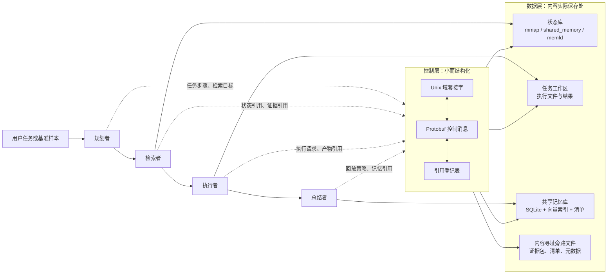
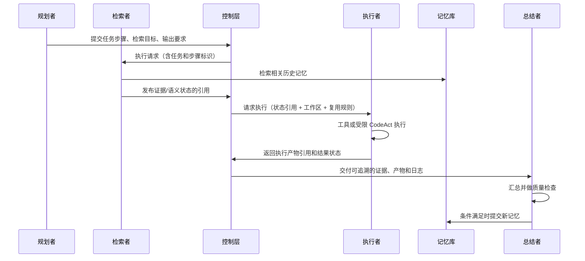
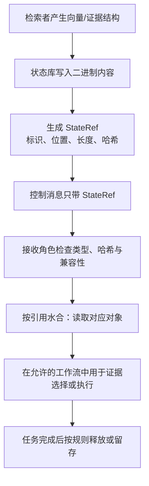
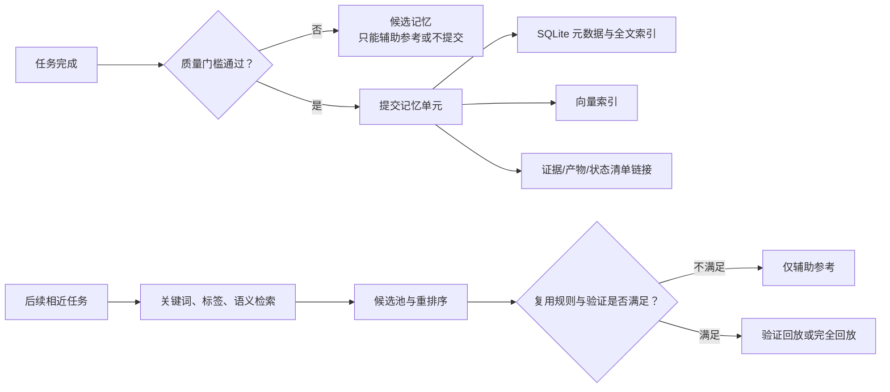
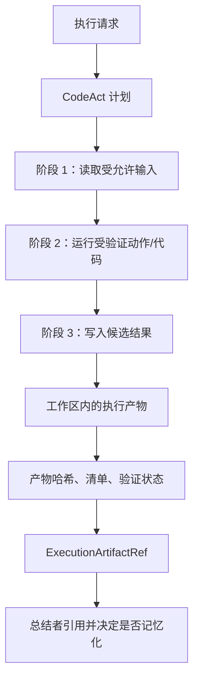
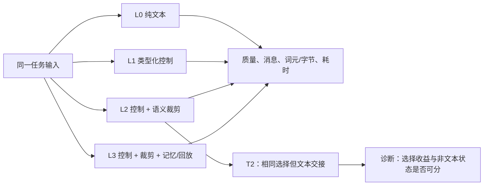

# StateBus v2 实现说明：从赛题要求到当前系统

> 面向对象：希望了解项目而不要求先阅读代码的评审者、答辩成员和新加入的开发者。
>
> 口径：本文描述当前 `v2/` clean-room 实现，以及截至 2026-07-15 已归档的 P0/P1 实验审计结果。文中会刻意区分 **已实现**、**已有执行记录**、**尚未充分证明** 三种状态。代码存在不等于效果已被证明；一次实验通过也不等于完成最终交付。

## 1. 先用三句话说明 StateBus 做什么

普通多智能体协作常把上一个智能体得到的材料，重新整理成很长的自然语言，再塞给下一个智能体。这样容易重复传输、重复阅读，也很难知道谁做了什么、哪些内容可以复用。

StateBus 的做法是把协作拆成两层：

1. **控制层**传递小而明确的结构化指令，例如“谁处理、处理哪一步、引用哪些资料、允许怎样复用”。
2. **数据层**保存较大的证据、向量、文件和执行结果；控制层只传它们的“凭据”或“引用”，不把全部内容塞进消息。
3. 任务结束后，将经过质量检查的摘要、证据和执行结果沉淀为共享记忆，供后续相近任务检索和按规则复用。

因此，StateBus 不是另一个聊天提示词模板，而是一个为多智能体协作增加“协议、状态、记忆、工作区和评测”的运行时原型。

## 2. 赛题要求如何映射到设计

赛题原文见 [题目](../reference/题目.md)。它要求的重点可归为六件事：多角色协作、结构化通信、非文本状态、共享记忆、连续任务验证和可量化评测。StateBus v2 的对应关系如下。

| 赛题要求 | StateBus v2 的设计回应 | 当前边界 |
| --- | --- | --- |
| 至少 3 个智能体、完成多步骤任务 | 固定为规划、检索、执行、总结 4 个角色，按顺序完成任务 | 四角色路径有代码与执行记录；但不能仅凭角色被调用就推断每个角色都产生了独立因果收益 |
| 结构化通信，不只传长文本 | 本机 Unix 域套接字加 Protobuf（协议缓冲）控制消息，带事件、参数、能力/目标角色和引用 | 已有类型化控制与子进程传输记录；不是所有角色都已部署成独立进程 |
| 纯文本和结构化两种协作模式 | 评测阶梯把纯文本、仅控制协议、语义裁剪、记忆复放分开 | 历史比较中有多个变量同时变化，不能把所有差异都归因于“协议载体”本身 |
| 非文本中间状态 | 语义状态引用可指向 embedding、稠密语义状态、证据清单等二进制或结构化对象 | 已记录发布与接收端水合；尚缺独立的“消费并改变后续决策”事件证据 |
| 共享记忆、检索、复用 | SQLite/全文检索/标签/向量检索，外加回放等级和质量门槛 | 记忆命中不等于自动少做工作，需按复用等级和逐任务指标解释 |
| 至少两组连续任务、10 轮稳定运行 | 采用关联财报、跨期分析、表格、长文档、回放等连续任务族 | 已有 10 轮族级记录；结论只适用于对应任务族 |
| 通信、时延、状态、复用指标 | 每个角色、每个任务及评测层级均记录消息、字节/词元、状态和复用指标 | 现有历史证据不能支持“总体时延更快”的结论；需要新的串行、匹配对照复跑 |
| 鼓励 CodeAct 与隔离执行 | 执行器支持受约束的 CodeAct 计划、工作区和轻量沙箱路径 | 是原型能力，不可表述为生产级安全沙箱或最终 openEuler 隔离验证 |

## 3. 总体结构：一条小消息，指向一份大对象

下面的图是理解系统的关键。实线消息并不携带完整的大文档或大向量，而是携带其标识、位置、哈希和权限规则；真正的内容留在状态库、记忆库或任务工作区中。



可以把它类比为图书馆：控制消息像借书单，里面写着书号、借阅者、截止时间和用途；书籍本身仍放在书架上。这样既方便审计，又避免把整本书反复抄到每张借书单上。

## 4. 四个角色各做什么

角色划分来自 `v2/runtime/role_contract.py`，并且每个角色有应记录的指标、应产出的对象和不应越过的职责边界。

| 角色 | 通俗职责 | 主要产出 | 明确不做什么 |
| --- | --- | --- | --- |
| 规划者 | 把“用户想要什么”拆成可执行步骤，说明需要找什么资料、最终要交什么 | 工作流步骤、检索目标、交接说明 | 不直接跑工具、不写最终产物、不提交记忆 |
| 检索者 | 从限定资料中找证据，挑选候选工具/路线，形成语义状态与检索日志 | 证据包、引用水合清单、查询向量、检索日志 | 不改任务交付要求、不写最终答案、不结算执行产物 |
| 执行者 | 在验证过的工具或受限代码动作中执行，形成可检查的结果文件 | 执行产物引用、产物清单、执行步骤记录 | 不越过检索范围去“暗中找资料”，不自行提交记忆摘要 |
| 总结者 | 基于可追溯证据和执行产物生成答复，做质量检查，并决定哪些内容可写入记忆 | 总结产物、记忆提交、回放账本 | 不重选工具、不改写执行产物的原始内容 |

一次任务的正常生命周期如下。`状态引用`和`执行产物引用`故意分离：前者是供角色理解和决策使用的语义对象，后者是工具运行留下的文件结果；两者的生命周期、校验和复用规则不同。



## 5. 结构化控制层：为什么要用 Unix 域套接字和 Protobuf

### 5.1 两个概念

- **Unix 域套接字（UDS）**：同一台机器上两个进程互相传消息的本地通道。它不经过网络网卡，适合把运行时与执行子进程连接起来。
- **Protobuf**：预先定义每种消息应有哪些字段、字段是什么类型的格式。它比临时拼接一大段自然语言更容易校验、记录和向后兼容。

`v2/control/statebus_v2.proto` 定义了控制信封。一个请求至少能说明：本次任务、步骤、尝试编号、目标角色、超时、协议版本，以及状态/产物/记忆的引用。它还定义了复用许可，例如是否允许“辅助参考”“经验证回放”“完全一致回放”。

控制事件可看作一次可追踪的工单流转：

```text
REQ_EXEC  请求执行
   |
ACK_RECV  接收方确认收到
   |
RUN_START 开始工作
   |
HEARTBEAT 仍在运行，避免误判失联
   |
   +--> RES_SUCC 成功，返回新的状态/产物引用
   |
   +--> RES_ERR  失败，返回错误码与说明

CMD_CANCEL 取消请求     TRAP_FATAL 致命异常     CMD_GC 清理不用的引用
```

这种设计回答了赛题的“动作类型、输入参数、返回结果和能力/握手”要求：角色不是通过一段模糊文本猜测“下一步做什么”，而是读取有类型的请求、确认接收、上报开始和心跳，并以成功或失败的结构化结果结束。

从进程视角看，当前实现不是“所有角色永远各占一个操作系统进程”。角色合同、状态登记和调度可以在运行时主进程内完成；执行器有 UDS/子进程通路。这样既能验证类型化跨进程控制，也不把当前原型过度包装成已完成的分布式集群。

```text
                    同一 Linux 主机

  +-----------------------------------------------+
  | StateBus 运行时主进程                         |
  |                                               |
  |  规划 -> 检索 -> 调度 -> 总结                  |
  |     |       |                 |                |
  |     +-------+----[引用登记表]--+                |
  +----------------------|------------------------+
                         | UDS：长度确定的 Protobuf 消息
                         | REQ_EXEC / ACK / START / RESULT
  +----------------------v------------------------+
  | 执行子进程（当前可选路径）                    |
  |  验证动作、CodeAct、生成任务工作区产物         |
  +----------------------|------------------------+
                         | 返回 ExecutionArtifactRef
  +----------------------v------------------------+
  | 工作区 / 状态库 / 记忆库                       |
  +-----------------------------------------------+
```

### 5.2 纯文本模式与协议模式的区别

| 模式/层级 | 允许什么 | 主要用途 |
| --- | --- | --- |
| L0：纯文本冷启动 | 角色之间使用全文本交接；不启用结构化控制、语义裁剪、回放 | 作为最基础参照 |
| L1：仅类型化控制 | 启用结构化控制，但不启用语义裁剪和记忆回放 | 观察控制协议本身带来的工程变化 |
| L2：控制 + 语义裁剪 | 在 L1 基础上选择有限证据，并传递语义状态引用 | 观察“少让后续角色看无关材料”的路径 |
| L3：完整复用栈 | 在 L2 基础上允许符合规则的记忆和回放 | 观察跨任务积累和避免重复步骤的条件 |
| T2：诊断文本对照 | 保持与 L2 相同的语义选择，但不用语义状态引用而改用文本交接 | 尝试区分“选得更少”与“非文本状态本身”的影响；它是诊断对照，不是独立正式优势结论 |

这里最容易误解的是：L0 到 L3 不是只改了一个开关。因此，即使 L3 的通信量更低，也不能自动说“仅仅因为 Protobuf 所以更快”。只有把任务、模型、资料、工具、输出检查、缓存状态和请求顺序固定，再做串行的匹配 A/B 或 AB/BA 重复，才可作单变量因果结论。

## 6. 非文本状态：传的是“可读的机器对象”，不是大模型隐藏层

### 6.1 什么是 `StateRef`

`SemanticStateRef` 是“语义状态引用”。它记录状态标识、对象类型、实际存储位置、字节数、内容哈希、来源文档哈希、兼容性提示和清单信息。接收者拿到的是一张可核验的取件单，而不是把向量或长证据直接写进控制消息。

典型流程如下：



从设计上，语义状态可以包括：

- 检索查询的 embedding（数字向量）；
- 稠密语义特征；
- 证据选择结果和水合清单；
- 路由/工具候选等小型特征包；
- 与执行结果关联、可校验的元数据。

这满足赛题所说的 embedding、语义向量或其他中间表示的“生成、传递、接收、后续使用”机制设计。但在实验口径上必须更谨慎：归档 P0/P1 记录到 `STATE_PUBLISHED=1380`、`STATE_HYDRATED=4140`，而独立 `STATE_CONSUME=0`。因此目前可以说“状态被发布并被接收端水合”，不能说“已由独立事件证明每次状态都改变了下游决策”。

### 6.2 三种存储后端为什么同时存在

不同对象的寿命和使用方式不同，不适合只用一种技术。`v2/state/store.py` 使用分层存储策略。

| 后端 | 通俗理解 | 更适合的对象 | 优点 | 当前限制 |
| --- | --- | --- | --- | --- |
| `mmap` 文件映射 | 把一个文件映射进内存，像内存一样读，但内容落在文件 | 较大、需要重读的证据、清单、长期语义对象 | 文件可追踪、可重新打开、适合审计 | 读写仍依赖文件系统；不是零成本 |
| `shared_memory` 共享内存 | 在同一主机上开一块带名字的公共内存区域 | 短寿命 embedding、稠密语义状态 | 避免同机进程间反复复制大块数据 | 要显式关闭和释放；受内存预算限制 |
| `memfd` 匿名内存文件 | 内核中的匿名文件描述符，没有普通可见文件名 | 需要通过子进程路径处理的短命对象，默认优先用于 LogitState | 可在文件描述符语义下读写，不污染目录 | 需要正确传递/管理描述符；当前只形成了有限子进程实现证据 |
| 内容寻址旁路文件 | 内容按哈希和清单登记，避免“同名文件覆盖” | 规范证据包、记忆提交、清单 | 易做一致性校验与追溯 | 不是通用数据库事务替代品 |
| 任务工作区 | 每个任务/步骤自己的目录 | 执行代码的输入、临时文件、结果文件 | 把执行产物与语义状态分开 | 需依赖工作区清理和产物校验 |

存储决策不是固定的：默认时，embedding 和稠密语义状态优先 `shared_memory`，空间不足才回退到 `mmap`；规范证据和记忆优先内容寻址旁路文件；执行产物留在工作区；LogitState 倾向 `memfd`，再回退到共享内存或文件映射。为了做后端验证，系统也允许强制选择一种后端。

P1 的后端矩阵记录了三种功能路径：`mmap_loopback`、`shared_memory_loopback`、`memfd_subprocess`。三者在记录任务上均完成质量检查；但前两者是**本进程回环**，不能写成跨进程共享内存证明，只有 `memfd_subprocess` 是有限的子进程通路。该矩阵的目标是证明“后端可实际被选中并完成任务”，不是证明某种后端在所有工作负载下更快。

下图进一步说明“控制消息”和“实际载荷”的区别。即使状态实际在共享内存或文件里，控制消息仍只携带定位与校验信息。

```text
检索者进程/角色
  1. 形成 embedding 或证据对象：  [0.14, -0.02, ...] / 二进制证据包
  2. 写入选定后端：               mmap 文件 | shared_memory | memfd
  3. 计算哈希、长度、对象类型
  4. 发送小控制消息：

     {状态编号, 类型, 后端, 长度, 内容哈希, 清单编号}
                         |
                         | 不是把整个向量、整篇文档塞进控制消息
                         v
执行者或总结者
  5. 校验引用是否还有效、类型是否匹配
  6. 按后端读取实际字节
  7. 在允许的步骤中使用，任务结束后释放短命状态
```

### 6.3 状态引用和执行产物为什么不合并

| 项目 | 语义状态引用 | 执行产物引用 |
| --- | --- | --- |
| 主要含义 | 供角色理解、检索、路由或裁剪的中间信息 | 工具/代码实际产生的文件或结果 |
| 典型内容 | 向量、证据选择、特征、清单 | 表格、JSON 结果、日志、生成文件 |
| 典型存储 | 共享内存、文件映射、内容寻址旁路文件 | 任务工作区，必要时进入内容寻址存储 |
| 是否需要验证 | 要检查类型、长度、哈希与兼容性 | 还要检查来源步骤、路径、哈希、验证状态和回放资格 |

若把两者混成一种“万能引用”，会无法回答“这个对象是给模型看，还是工具真正生成的？”、“是否可回放？”、“谁负责清理？”等问题。因此 v2 保持 `SemanticStateRef` 和 `ExecutionArtifactRef` 两条类型链路。

## 7. 共享记忆：不是聊天记录，而是带来源和规则的知识单元

### 7.1 记忆里保存什么

`MemoryRef` 为一条记忆至少保留：记忆 ID、类型、相关度、来源任务、来源智能体、创建时间、任务主题、标签、摘要；并可链接规范任务规格、执行产物、语义状态、向量、清单、验证状态和回放资格。这比简单保存“上一轮对话全文”更容易检索、审计和失效处理。



### 7.2 怎么检索

系统有三类互补的检索方式：

1. **关键词检索**：优先使用 SQLite FTS5 全文检索；运行环境不支持时回退到普通 SQL 条件。适合明确术语或指标名。
2. **标签检索**：先用 SQL 筛选，再按标签重合度排序。适合任务族、行业、文档类型等明确分类。
3. **语义检索**：把任务和记忆摘要编码为 `StructuredEmbedding` 向量；安装 FAISS 时用内积索引检索，未安装时用余弦相似度回退。适合同义但措辞不同的任务。

系统先形成候选池，再重排序并显式记录选中了哪些记忆。这一点很重要：评审可以区分“数据库里有什么”“检索命中了什么”“最终为什么选它”，而不是只看到一个不透明的最终答案。

### 7.3 “复用”有不同强度，不能混为一个数字

| 复用等级 | 含义 | 能否直接省掉工作 | 需要怎样解释 |
| --- | --- | --- | --- |
| 辅助参考 | 把历史摘要/证据当作提示，仍重新完成关键工作 | 不保证 | 只能说历史信息被参考 |
| 经验证回放 | 使用历史对象前重新核验任务契约、产物或质量条件 | 视逐任务记录而定 | 需要同时看验证结果、调用数、词元、工具步骤和输出质量 |
| 完全回放 | 当前任务与可复用对象严格匹配，且回放条件满足 | 才可能避免部分重复步骤 | 仍需逐例证明输出/产物一致，以及实际少做了哪些步骤 |

所以“memory hit（记忆命中）”“答复被恢复”“少调了一次模型”“少跑了一步工具”“复用收益为正”是五件不同的事。当前审计中，跨任务回放是相对较强的证据方向，但仍需遵守上述逐类边界，不能把所有命中都宣传为节省。

用决策树表示，一条历史记忆不会因为“相似”就直接替代新任务：

```text
新任务到来
   |
   v
关键词 / 标签 / 语义相似度找候选
   |
   +-- 没有候选 ----------> 正常执行，并可能产生新记忆
   |
   +-- 有候选
          |
          v
      任务规格、输出合同、来源产物是否兼容？
          |
          +-- 否 ----------> 只作为辅助提示，关键步骤仍重做
          |
          +-- 是
                 |
                 v
          历史结果是否通过验证、回放政策是否允许？
                 |
                 +-- 否 -----> 降级为辅助提示
                 |
                 +-- 是 ----> 经验证回放 / 完全回放
                                  |
                                  v
                            记录真正跳过的步骤、调用和质量校验
```

## 8. CodeAct 与任务工作区：让执行有计划、有边界、可复核

CodeAct 的目标不是让模型无限制地执行任意脚本，而是将执行拆成可检查的计划、阶段、动作和输入输出路径：



具体而言，计划中会包含执行目标、阶段、动作、输入相对路径、输出相对路径和参数；执行记录保留脚本、请求、输出哈希等审计信息。工作区限制了文件的归属，避免一个任务的临时文件不清不楚地影响另一个任务。

轻量隔离策略按可用能力选择：优先使用 `bwrap`（Bubblewrap）命名空间和只读绑定；不可用时使用带资源限制的子进程回退；也存在显式不隔离模式用于受控开发。可配置的限制包括 CPU 时间、地址空间、输出大小、文件描述符数量、子进程数量和总超时。

这已经是“CodeAct 受控执行原型”，但尚不是安全终态：当前没有独立安全评估、没有 `nsjail` 证明，也没有最终 openEuler 环境中的隔离验证。因此演示时应称为“轻量沙箱/回退路径”，不应称为生产级安全执行环境。

## 9. 前缀缓存、Transformer KV、embedding 与 LogitState：分清四层，才能说清设计

“embedding”“KV cache”“非文本状态”都不是文本，因此很容易被混写成“把模型中间状态传给下一个 Agent”。这在工程上并不准确。它们的生产者、消费者、生命周期和可移植性完全不同。

先给出一句话版本：**embedding 用来判断哪些资料、记忆和策略值得找回；StateRef 用来在运行时交接这些可核验对象；稳定的文本证据前缀让同一推理引擎有机会复用它自己的 KV cache；KV 张量本身始终留在该推理引擎内部。**

| 层次 | 对象是什么 | 谁产生、谁消费 | 生命周期与位置 | 当前定位 |
| --- | --- | --- | --- | --- |
| 语义检索层 | embedding、标签、摘要、记忆元数据 | embedding 模型产生；MemoryProxy、FAISS/余弦检索和重排序消费 | 可持久化；向量库、内容寻址存储或短命 StatePool | 已实现的检索/记忆主线 |
| StateBus 数据层 | `SemanticStateRef` 指向的向量、特征、证据清单等 | Retriever/Executor 等角色发布；允许的运行时步骤水合 | `shared_memory`、`mmap`、`memfd` 或文件；可被引用和审计 | 已有发布与接收端水合记录，消费因果还未单独记录 |
| 推理引擎层 | Transformer 注意力的 Key/Value 张量，即 KV cache | 同一模型实例的预填充和生成内核 | GPU/引擎内部短命缓存；受缓存淘汰策略控制 | 仅按“引擎本地前缀复用”探索，不作为 StateBus 数据面对象 |
| 输出遥测层 | LogitState 的候选概率与不确定性摘要 | 模型响应产生；未来可供复核策略消费 | 当前只在任务指标投影中观察到 | 不是隐藏状态，也不是 KV cache |

### 9.1 现在实际做了什么：让 vLLM 更容易复用自己的前缀缓存，并观察是否真的命中

先说结论：**自动前缀缓存是 vLLM 原生能力，不是 StateBus 实现的 KV cache。** vLLM 自己负责把已处理词元的注意力 KV 张量留在显存中、匹配后续请求、决定命中与淘汰。StateBus **没有创建、导出或传输 vLLM 的 KV 张量**；我们实现的是它上面的“缓存感知协作层”：识别哪些任务很可能共享同一长证据前缀，把它们安排得更靠近，并在本地 vLLM 开启自动前缀缓存时，从 `/metrics` 读取请求窗口前后的命中计数。

两者的职责必须严格分开：

| vLLM 原生实现 | StateBus 在 vLLM 之上实现 | 为什么还需要 StateBus 这一层 |
| --- | --- | --- |
| 对收到的词元请求做自动前缀缓存匹配 | 为同一语料和精确证据构造稳定的 `corpus_prefix_hash` / `evidence_prefix_hash` | vLLM 只看到当前 HTTP 请求，不知道两个任务在业务上是否都依赖同一份报告 |
| 分配、保留、复用和淘汰 GPU 中的 KV 块 | 将相同语料的任务排成相邻的 `cache_friendly` 顺序，或故意交错成 `cache_hostile` 对照 | 任务调度决定“下一条请求是否还来得及复用上一条请求的前缀” |
| 在服务端累计查询/命中计数，提供 `/metrics` | 请求前后采样计数器，校验单调性后计算本次任务窗口的增量命中率 | 服务生命周期总命中率不能说明某个 StateBus 任务是否命中 |
| 受显存、并发和淘汰策略影响真实命中 | 登记候选前缀、预估复用机会，并将预测与观测差异反馈给调度器 | StateBus 需要知道“调度上看似可复用”是否真的被引擎接受 |

因此，StateBus 的价值不在于替换 vLLM 的缓存内核，而在于把多角色任务的**语义关联、证据身份和请求顺序**暴露给调度器，尽量让 vLLM 原本已有的缓存能力有机会命中，并把结果变成可审计的实验数据。

这里的“少算”只针对推理引擎的预填充，并不等于：

- 不再发送请求，也不等于网络传输自动变少；
- 不再给模型看该段证据，也不等于任务词元一定减少；
- StateBus 把某个角色的模型内部 KV 交给另一个角色。

当前真实路径可以按五步理解：

```text
同一份长运营报告的多轮问题
          |
          v
1. 计算两类前缀身份：语料身份 + 精确证据前缀身份
          |
          v
2. 用“引擎、会话、模型、分词器、前缀哈希”登记候选复用柄
          |
          v
3. 以同语料组为单位排队：相邻运行（cache_friendly）或交错运行（cache_hostile）
          |
          v
4. 角色仍把完整请求交给同一 vLLM；vLLM 自己决定是否命中、是否淘汰缓存
          |
          v
5. 请求窗口前后抓取 vLLM /metrics，计算查询增量、命中增量和 TTFT
```

| 已有组件 | 具体做什么 | 为了什么 | 不能误读成 |
| --- | --- | --- | --- |
| `NeuralPrefixIdentity` | 从源文档哈希、系统提示版本、证据包和水合清单生成 `corpus_prefix_hash` 与更严格的 `evidence_prefix_hash` | 区分“同一份语料”与“同一份已渲染证据”，让调度和审计有稳定标识 | KV 内容哈希，或 GPU 缓存地址 |
| `EngineLocalPrefixRegistry` | 以 `engine_id + session_id + prefix_hash + model_id + tokenizer_id` 为键登记 `NeuralStateHandle` | 在控制面记录哪些角色/请求**候选**共享前缀，以及预计寿命、淘汰风险和优先级 | 已由 vLLM 确认的真实 KV 命中 |
| 前缀估算 | 根据共享证据字节和可消费角色数，给出预计预填充词元、可复用次数和节省估算 | 在没有本地 vLLM 时也能检查调度合同是否形成了复用机会 | GPU 原始命中数；估算中按 4 字节/词元换算，必须与真实计数分开 |
| `kv_prefix_reuse_v1` 任务族 | 使用 Orion 工厂和 Nova 零售两份运营报告；同语料相邻为 `cache_friendly`，两份语料交错为 `cache_hostile` | 在不改任务语义的前提下，只改变“相同长前缀是否连续出现” | 正式业务质量基准，或跨引擎 KV 实验 |
| `vllm_metrics.py` | 从本地 vLLM `/metrics` 解析前后两次 `queries_total`、`hits_total`，仅在计数器单调且有效时计算窗口命中率 | 用引擎自身的累计计数验证第 2、3 步是否真的对应缓存观察 | 只凭一个服务生命周期命中率表盘就认定单个任务命中 |
| `PrefixCacheFeedbackLoop` | 比较控制面预测命中率与 vLLM 观察值；在 `local_vllm` 的前缀探针路径中可据误差建议重排未执行轮次 | 防止调度器把“理论共享前缀”误当作“引擎实际缓存仍在” | 直接操控 vLLM 显存或缓存淘汰策略 |

有一个名称非常容易造成误会：`EngineLocalPrefixRegistry.ensure_handle()` 返回的 `cache_hit=True`，含义只是“控制面已经见过同一兼容键的登记柄”。它表示**候选复用机会**，不是 vLLM 返回的 GPU 命中。真实引擎观察只能来自第 5 步的 `/metrics` 计数差分；文档和报告中的 `neural_prefix_*_estimate` 也必须标为估算值。

为什么要特意设计 `cache_friendly` 与 `cache_hostile` 两种顺序？因为相同长报告在服务端缓存中是否还存活，与请求顺序有关。前者将同一报告的预热和多个指标问题连续运行，最大化连续的同前缀窗口；后者在 Orion/Nova 两份报告之间交错，故意打散这种窗口。任务问题、质量检查和报告内容不变，变化的是调度器是否给引擎留下复用机会。

```text
cache_friendly： Orion 预热 -> Orion 收入 -> Orion 利润率 -> ... -> Nova 预热 -> Nova 指标
                              同一份长前缀连续出现

cache_hostile ： Orion 预热 -> Nova 预热 -> Orion 收入 -> Nova 收入 -> ...
                              同一份长前缀被另一份报告打断
```

当前观测因此只服务于一个目标：验证“**在同一 vLLM 服务里，StateBus 的前缀身份和任务排队是否能创造更多引擎本地缓存机会**”。Stage 09 记录共享前缀为 1,376/1,769（77.78%），独立前缀为 0/1,810；Stage 18 的保留产物也有共享/独立计数，但该阶段历史失败且采用连续服务窗口。它们可以说明有引擎本地前缀现象，不能证明稳定的端到端加速，更不能证明任何 Agent 间 KV 转移。

### 9.2 先区分：embedding 向量不是 Transformer KV，StateRef 也不是 KV 引用

embedding 是把一段文本、表格或摘要编码成一个固定长度的数字向量。它回答的是“这两段内容在语义上是否接近”。例如，`Retriever` 可以用任务查询的 embedding 从记忆库中找出“同一公司、相近指标、相似表格结构”的历史证据。

Transformer KV 则是模型在逐词处理输入时，为每一层注意力计算出的内部 Key/Value 张量。它回答的是“这段**完全相同的词元前缀**已经做过哪些注意力计算”。这不是语义相似度对象：两段意思相近但分词后序列不同的文字，通常不能复用同一段 KV。

| 比较项 | embedding / 语义向量 | Transformer KV cache |
| --- | --- | --- |
| 主要问题 | 哪些历史信息与当前任务相关？ | 哪段已输入的词元不用重复预填充？ |
| 典型形状 | 一个文本/证据对象对应一个固定维度向量 | 每层、每个注意力头、每个词元位置的一组张量 |
| 直接消费者 | 向量索引、检索、重排序、规则 | 同一推理引擎中的模型内核 |
| 命中条件 | 编码器、向量维度、索引和相似度规则兼容；允许“相近” | 模型配置和引擎缓存上下文兼容，且前缀词元必须精确一致 |
| 是否适合通用 LLM 直接阅读 | 否，浮点数组本身不等同自然语言证据 | 否，模型内部张量不具通用、可解释的数据交换格式 |
| StateBus 当前如何处理 | 可通过 `StateRef` 保存、检索和水合；再由 adapter 整理成证据 | 不通过 `StateRef` 传递；只让同一引擎按自身缓存规则尝试复用 |

因此，`shared_memory` 中放置一段 embedding，并不意味着把这段 embedding“喂给”下一个大模型；它通常由检索组件或规则组件读取。通用 LLM 最终看到的是 adapter 根据检索结果生成的短证据、结构化字段、来源和任务合同。反过来，推理引擎里存在 KV cache，也不意味着 StateBus 可以把它当普通二进制文件跨角色、跨进程或跨引擎传走。

```text
容易混淆的两条路径

任务问题
   |
   v
本地 embedding 模型 ----> 向量检索 / 记忆重排序 ----> 选中证据、策略、StateRef
                                                        |
                                                        v
                                          adapter 形成短而稳定的证据文本
                                                        |
                                                        v
角色请求: [稳定公共前缀] + [本角色特有问题]
                                                        |
                                                        v
同一推理引擎内部 ----> 可能命中自己的 KV cache

左侧是“找什么”；中间是“交接什么”；右侧是“同一引擎少算什么”。
没有一条箭头表示把 embedding 直接变成 KV，或把 KV 经 StateRef 发给另一台引擎。
```

### 9.3 我们设想的复用闭环：语义选择与引擎本地前缀复用可以协同，但不能互相替代

StateBus 的目标不是让所有角色共享一大段不透明 GPU 内存，而是把可解释的语义对象和不可移植的模型内部缓存分层处理。理想工作流如下：

```text
1. 检索者用 query embedding 找到相关记忆、证据与已验证策略
                    |
2. 运行时通过 StateRef 交接对象的身份、位置、哈希和兼容性
                    |
3. adapter 按确定顺序将“任务合同 + 已选证据 + 来源摘要”渲染为公共前缀
                    |
4. Planner / Retriever / Executor / Summarizer 向同一推理引擎发起请求
                    |
5. 引擎自行判断该公共前缀是否能命中 KV cache，再处理各角色特有后缀
                    |
6. StateBus 只记录兼容性、请求顺序、前后计数器与观测结果，不读取或搬运 KV 张量
```

这里有两个可分别发生的收益来源：

| 情形 | 语义检索/StateRef | 引擎前缀缓存 | 正确解释 |
| --- | --- | --- | --- |
| A | 命中 | 命中 | 找到了相关材料，且同一引擎恰好复用了相同公共前缀；两种机制同时发生，但仍需实验拆分归因 |
| B | 命中 | 未命中 | 语义选择仍可能减少无关材料；请求文本或服务缓存条件不满足，不能期待 KV 收益 |
| C | 未命中 | 命中 | 本轮没有复用历史记忆，但恰好与近期请求共享了模型前缀；这是引擎局部行为 |
| D | 未命中 | 未命中 | 正常冷路径；系统仍应保证任务正确完成 |

这也是为什么“L2/L3 提示词更少”不能自动等价为“KV cache 生效”，而“前缀命中率较高”也不能自动等价为“记忆检索更好”。前者主要反映证据选择、裁剪和回放，后者只反映特定服务窗口内的引擎缓存行为。

为了让第 5 步更可能发生，公共前缀必须稳定，而不是仅仅“意思差不多”。实际需要稳定的通常包括：系统提示、任务合同格式、资料排序、引用编号、证据摘要模板和序列化细节。仅把同一批资料随机换序，分词后的前缀就可能不同，缓存也无法复用。因此，**adapter 的确定性渲染是连接语义检索与前缀复用的关键桥梁**；它是下一步需要被显式测量的设计假设，不是当前已经证明的因果结论。

### 9.4 Engine-Local Prefix Reuse 的当前控制面与后续边界：协调引擎，不转运 KV 张量

本项目对 KV 方向的正式规划名称是 **Engine-Local Prefix Reuse（引擎本地前缀复用）**。它的边界很明确：多个角色可以把请求发送到同一个兼容推理引擎，StateBus 负责让公共输入可识别、可复现、可审计；KV cache 的创建、保存、命中和淘汰仍由推理引擎负责。

```text
                 StateBus 控制面                         推理引擎内部

角色 A -- 请求 + 前缀兼容性描述 -->  同一 vLLM 实例  -->  KV cache
角色 B -- 请求 + 前缀兼容性描述 -->  同一 vLLM 实例  -->  KV cache
角色 C -- 请求 + 前缀兼容性描述 -->  同一 vLLM 实例  -->  KV cache
                    |                                      |
                    |                                      +-- 命中、淘汰、显存布局由引擎决定
                    +-- 只保存描述、请求顺序和观测计数

不发送：KV 张量、GPU 地址、设备指针、跨引擎缓存文件或“万能隐藏状态”
```

当前控制面已经用 `NeuralPrefixIdentity`、`NeuralStateHandle` 和 `EngineLocalPrefixRegistry` 记录了基础身份与兼容键；它们仍只是候选复用控制面，不是 GPU KV 数据面。后续可将这些字段统一纳入 `RuntimeCompatibilitySignature`，或增加单独的 `PrefixReuseIntent` 事件，使“候选、请求、引擎观察、失效”形成一条显式事件链。后两者属于后续演进接口，不能当成已完成能力。无论采用哪种消息名称，描述符都必须是小型、可审计的“复用意图”，而不是缓存内容本身。它至少应记录：

| 字段类别 | 应记录的信息 | 为什么需要 |
| --- | --- | --- |
| 引擎身份 | 引擎实例/缓存命名空间、服务代次、缓存政策 | 同一模型名不代表同一份可用缓存 |
| 模型兼容性 | 模型权重标识、量化/精度、RoPE 与并行配置、引擎版本 | KV 的张量形状和解释依赖模型及运行配置 |
| 词元兼容性 | 分词器标识、公共前缀的词元 ID 哈希和长度 | 语义相同但词元不同也不能安全复用 |
| 提示构造 | 系统提示、任务合同、证据排序和渲染模板哈希 | 防止“看似同一输入、实际前缀不一样” |
| 生命周期 | 创建时间、有效期、缓存服务窗口、允许的复用范围 | 缓存会被淘汰，连续服务与干净服务需要分开统计 |
| 观测结果 | 查询前后计数器、引擎返回的命中/拒绝原因、TTFT | 将“希望复用”与“实际观察到复用”分开 |

即使这些字段全部一致，StateBus 也只应把请求标记为“候选可复用”。是否真的命中，仍取决于 vLLM 等引擎内部的缓存容量、淘汰和调度。相反，只要模型、分词器、前缀词元、位置编码、精度/量化、并行布局或引擎实例不兼容，就不应尝试把一个引擎的 KV 当作另一个引擎的输入。这正是当前不把“Agent-to-Agent KV 传递”列为已实现功能的原因。

### 9.5 当前已经做了什么，尚未完成什么

当前实现和归档证据支撑的是“前缀探针与计数观测”，不是 KV 数据面。下表把已完成与待完成分开，避免后续文档或答辩越界。

| 项目 | 当前状态 | 现有证据或限制 | 下一步达到什么才算完成 |
| --- | --- | --- | --- |
| 非文本语义状态 | 已有 `StateRef`、`mmap`、共享内存、`memfd` 路径 | 记录到发布 1,380 次、水合 4,140 次，但独立消费事件为 0 | 按角色、引用、字段记录消费，并用开/关或扰动证明影响了后续路由、工具或答案 |
| embedding 检索与记忆 | 已作为检索、重排序和记忆复用主线设计 | 不能把浮点向量本身解释为通用 LLM 直接消费的上下文 | 保存编码器版本、向量/来源对应关系与选择原因，并对检索开/关做匹配比较 |
| vLLM 前缀计数 | 已有共享/独立前缀探针与请求窗口计数读取 | Stage 09 共享前缀为 1,376/1,769（77.78%），独立条件为 0/1,810；这是引擎观测 | 为每次请求记录候选资格、精确前缀签名、计数器差值和引擎拒绝原因 |
| Stage 18 配对前缀实验 | 保留了两份语料、四组 AB/BA 请求产物 | 共享/独立计数为 5,691/7,553（75.35%）与 66/7,571（0.87%）；但 `clean_service_requested=False`，且历史 Stage 18 为失败 | 在新命名阶段中分别做干净服务与连续服务实验，保存完整配置、计数和配对结果 |
| 引擎本地前缀复用控制面 | 已有前缀身份、同引擎登记、调度计划、估算与反馈逻辑 | `EngineLocalPrefixRegistry` 的“命中”只是候选登记复用；没有把候选、vLLM 实际命中、淘汰原因连成逐请求事件链 | 增加 `PrefixReuseIntent` 或等价事件，记录“eligible / requested / observed hit-or-miss / invalidated”；四种状态必须分开 |
| KV/隐藏状态张量交接 | 不做为当前路径 | 没有张量序列化、设备内存交换、跨引擎兼容层或接收端消费证据 | 仍属远期研究；在本项目当前边界内只描述为 Engine-Local Prefix Reuse，不宣称 Agent 间交接 |

因此，P1 Stage 18 的产物即使在修复后的静态校验下可读，也不等于一次新的通过：它仍是历史失败阶段，而且服务窗口连续，暖机、顺序和缓存残留会影响 TTFT。它能支持的最强表述只是：**已在两份运营报告、四组 AB/BA 请求的连续服务窗口中观察到引擎本地共享前缀的较高计数。** 它不能支持“整体时延已经更快”或“角色之间已经迁移 KV”。

### 9.6 下一轮应怎样把设想变成可验证实现

KV 方向最重要的不是先把 GPU 张量塞进共享内存，而是建立从“有资格复用”到“引擎实际命中”再到“任务收益”的完整证据链。建议顺序如下：

```text
确定性 adapter 与公共前缀签名
              |
              v
兼容性门：记录为什么 eligible / ineligible
              |
              v
同一引擎 adapter：记录实际 cache hit / miss 与原因
              |
              v
干净服务、连续服务两套 AB/BA 配对实验
              |
              v
分别报告 TTFT、请求时延、任务时延、词元、质量与缓存计数
              |
              v
在任务/模型/工具/证据固定时，才讨论可归因收益
```

每个实验应同时保留以下对照，才能回答“究竟是哪一层带来了变化”：

| 对照 | 固定什么 | 只改变什么 | 能回答的问题 |
| --- | --- | --- | --- |
| 检索对照 | 同一任务、模型和评分 | embedding 检索/记忆开或关 | 语义选择是否降低无关证据并保持质量？ |
| 渲染对照 | 同一已选证据 | 确定性公共前缀或随机/不稳定渲染 | 稳定 adapter 是否提高可复用前缀比例？ |
| 前缀对照 | 同一引擎、模型、词元前缀和角色后缀 | 共享前缀或刻意打散前缀 | 引擎本地缓存是否改变 TTFT/预填充观察值？ |
| 服务政策对照 | 同一请求集和 AB/BA 顺序 | 每轮干净启动或连续服务 | 结果是否依赖暖机、残留缓存或请求顺序？ |
| 端到端对照 | 同一任务合同、工具和质量门 | 使用完整复用栈或基线 | 语义选择、回放和前缀复用的组合是否带来可复查收益？ |

只有最后一类端到端对照可以讨论任务成本或任务时延；前三类分别证明检索、渲染和引擎缓存的局部行为。把它们混成一张“KV 加速”表，会再次失去因果边界。

### 9.7 LogitState：实际记录模型“输出犹豫度”，为未来复核留接口，不是 KV

这里的 `LogitState` 不是 logistic 回归，也不是模型隐藏层。它来自模型**已经返回的输出候选词元概率**。当 Executor 通过兼容接口拿到 `top_logprobs` 后，`logit_state.py` 会将候选对数概率归一化，选出不确定性最高的位置，并计算：峰值熵、平均/聚合熵、熵方差、最高两候选概率差、候选决策熵和置信度代理；其中一小段候选概率可序列化为 `float32` 字节负载。

```text
Executor 的模型输出
      |
      +-- 正常答案、工具参数、执行结果 ----------> 当前任务主路径
      |
      +-- top_logprobs（候选词元概率）
                 |
                 v
          LogitState：熵、top-gap、置信度代理、峰值位置、可选概率负载
                 |
                 v
          当前：写入任务指标，供离线分析
                 |
                 +-- 未来才可能：低置信度 -> 复检证据 / 调 Verifier / 重试工具
```

做它的目的不是省掉模型预填充，而是回答另一类问题：模型在哪个输出位置最犹豫，是否值得在低置信度时触发额外核验。这与 vLLM 前缀缓存是两条不同路线：前缀缓存试图减少重复的输入计算；LogitState 试图为输出质量控制提供信号。

| 项目 | 当前已做 | 尚未做，因此不能宣称 |
| --- | --- | --- |
| 概率处理 | 可从 `top_logprobs` 形成紧凑负载和熵、方差、top-gap 等指标 | 未证明这些指标可靠预测答案错误 |
| 指标记录 | 任务指标记录 `logit_state_transfer_count`、熵、置信度门、方差、top-gap、峰值位置等 | 没有把概率负载的字节数/哈希稳定持久化到归档产物 |
| 决策使用 | 代码保留“低置信度可触发核验”的指标入口 | 归档中置信度门触发总和为 0；没有由 LogitState 驱动的检索、路由、工具、重试或 Verifier 行为 |
| 角色交接 | 概念上可作为短命非文本特征处理 | 没有 `LogitStateRef` 登记、接收角色、水合/消费事件或 on/off A/B |

归档中有 848 条带正 `logit_state_transfer_count` 的主记录行，这只能说明运行时曾从 Executor 输出得到这种遥测投影；审计没有找到持久化的 `logit_state_bytes`、引用登记、接收者或行为效果。因此 LogitState 目前应称为**输出不确定性遥测**，而不是已经闭环的决策机制，更不是 KV cache 或隐藏状态交接。

## 10. 任务设计：为什么以财报和运营指标为主

赛题要求至少三类任务和至少两组关联性连续任务。v2 将正式任务集中在离线、可复现的财务报告和运营指标分析，不依赖宿主机上真实系统日志。这便于固定输入、标准答案和质量检查，也减少权限与环境差异对结果的干扰。

### 10.1 先回答：为什么既有 25 个正式任务，又有 10 轮连续任务

二者解决的是**不同维度**的问题，不应相互替代。

```text
                         任务设计的两条轴

             横向：题型覆盖                         纵向：跨轮积累

       “系统能处理多少种问题？”               “系统会不会记住上一轮？”
                    |                                      |
                    v                                      v
       25 个相对独立的正式样例                  同一主题连续 10 轮
       5 类数据/推理操作                         前一轮产物会成为后一轮输入
       每例可独立评分                            显式声明依赖、产出和可复用对象
                    |                                      |
                    +---------------+----------------------+
                                    |
                                    v
                  同时验证“广度”与“记忆、状态、回放的时间连续性”
```

赛题的“至少 3 类任务”需要横向多样性，因而有 25 个正式样例；赛题的“至少 2 组关联性连续任务、稳定执行不少于 10 轮”需要纵向依赖链，因而有十轮连续任务。若只做 25 个互不相关的题，无法说明记忆是否真的跨任务工作；若只做一条十轮链，又很难说明系统面对不同数据形态时是否仍能正确执行。

当前仓库的任务清单可以这样数：

```text
正式样例：5 个任务族，共 25 个独立样例

连续样例：8 个任务族 × 每族 10 轮 = 80 个带前后依赖的轮次

任务定义总量：25 + 80 = 105

注意：105 是“仓库定义的任务单元”数量。
      它不表示每次实验都会运行全部 105 个，也不表示 105 个都有同等强度的归档证据。
```

归档 P0 的连续主证据重点是两条十轮链：`csv_table_profile` 与 `cross_period_financial`。这两条才是回答赛题“至少两组关联性连续任务、每组不少于 10 轮”的直接对象。其余连续族用于补充长文档、回放、通用状态机、诊断和前缀缓存等机制，但各自的证据等级和可作结论范围不同。

### 10.2 正式任务：25 个样例，5 个任务族

注册表 `v2/benchmark/task_registry.py` 明确加载 25 个正式样例：

| 任务族 | 数量 | 主要考察什么 |
| --- | ---: | --- |
| 财务报告指标提取 | 8 | 从报表/材料中定位单一指标并正确抽取 |
| 多期趋势分析 | 5 | 对多个时间点的指标做方向、变化或趋势判断 |
| 跨表关联分析 | 5 | 把不同表或文档中的实体、季度、指标关联起来 |
| 条件聚合 | 4 | 在限定条件下筛选、汇总或比较数据 |
| 异常检测 | 3 | 找出与规则、历史范围或同组对象不一致的值 |

这些任务共同覆盖了“查找、关联、计算、判断、总结”的多步骤过程。它们是正式评测输入，不应与开发中方便调试的固定回答或演示样例混为一谈。

### 10.3 连续任务：8 个任务族，研究状态与记忆能否跨轮积累

连续任务样本位于 `v2/benchmark/samples/continuous_task_families/`，当前包含 8 个方向：

| 连续任务族 | 主要目的 | 口径定位 |
| --- | --- | --- |
| `cross_period_financial` | 连续追问跨季度/跨年度财务指标 | 核心连续财报方向 |
| `csv_table_profile` | 多轮认识同一 CSV 的字段、范围、缺失与统计特征 | 核心连续表格方向 |
| `csv_correlation_replay` | 在相关的 CSV 问题中验证经验证回放 | 回放机制方向 |
| `long_doc_metric_replay` | 在长文档中连续抽取运营指标并测试回放 | 长文档与回放方向 |
| `long_doc_table` | 在长文档表格中持续检索和复用上下文 | 语义裁剪/历史复用方向 |
| `gridops_world` | 以网格运行世界模拟多步状态变化 | 通用多步执行诊断 |
| `incident_diagnosis` | 对事件材料做连续诊断与回放 | 诊断性任务，不作为当前 headline 证据 |
| `kv_prefix_reuse` | 构造共享前缀与交错前缀条件，观察引擎本地缓存 | 前缀机制探针，不是 Agent 间 KV 传输 |

P0 的核心连续证据包括 10 轮 `csv_table_profile` 链和 10 轮 `cross_period_financial` 链，满足“至少两组关联连续任务、稳定执行不少于 10 轮”的设计目标。P1 Stage 17 还覆盖了长文档表格与诊断性族。每个任务族的结论应局限在其数据形态和复用条件内，例如不能把长文档回放的结果推广成所有开放式问答都会同样受益。

#### 10.3.1 核心链一：CSV 表格画像与跨数据集策略复用（10 轮）

这条链使用疾病统计表和天气表。第一阶段先认识“数据长什么样”，中间阶段完成统计、相关性、异常检测和清洗，最后阶段综合两条数据来源。它不是把同一道题机械重复十次，而是在前一轮的模式、结果文件和处理策略基础上继续推进。

```text
Round 1  疾病表：识别字段类型、行数、缺失率
            产出：schema profile + 缺失值处理策略
              |
Round 2  疾病表：均值、最大死亡值
            消费：Round 1 的 schema profile
            产出：统计结果文件
              |
Round 3  疾病表：病例/死亡相关性
            消费：字段画像 + 缺失值策略
            产出：相关性结果文件
              |
Round 4  疾病表：IQR 异常值检测
            消费：画像、统计、异常检测策略
              |
Round 5  疾病表：生成清洗后的表
            消费：缺失值与异常值决策
            产出：清洗表产物
              |
Round 6  天气表：建立第二张表的 schema profile
            复用：画像/处理的代码策略模板（不是疾病表的具体数值）
              |
Round 7  天气表：按月份统计风速
            消费：日期解析与分组策略
              |
Round 8  天气表：检测气压异常值
              |
Round 9  天气表：生成清洗后的天气表
              |
Round 10 综合：串起疾病与天气两条证据链，形成复用报告
```

这一链特别适合验证三件事：L2 是否减少后续角色看到的原始表格内容；L3 是否命中 schema/统计/清洗等历史对象；最终答案和产物是否仍通过数值、字段和产物清单检查。它的 L3 目标复用轮为第 4、5、7、8、9、10 轮，但“目标”不等于未经审计即可宣称每一轮都节省了相同资源。

#### 10.3.2 核心链二：跨季度财务指标与经验证回放（10 轮）

这条链围绕 ACME、BETA 的多个季度收入。它先抽取基本事实，再基于已取得的数值计算环比/趋势，并在相同“查找某公司某季度某指标”的合同下测试经验证回放。

```text
Round 1  取 ACME 2026Q1 收入
            产出：指标事实 + “跨期查指标”执行策略
              |
Round 2  取 ACME 2025Q4 收入
            消费：Round 1 的策略
            允许：经验证回放
              |
Round 3  计算 2025Q4 -> 2026Q1 环比
            消费：Round 1、2 的指标事实
              |
Round 4  取 ACME 2025Q3 收入（相同策略，允许经验证回放）
              |
Round 5  汇总 ACME 三季度趋势
              |
Round 6  取 BETA 2026Q1 收入（相同任务形状，数据实体不同）
              |
Round 7  比较 ACME 与 BETA 2026Q1 收入
              |
Round 8  取 BETA 2025Q4 收入（相同策略，允许经验证回放）
              |
Round 9  计算 BETA 2025Q4 -> 2026Q1 收入趋势
              |
Round 10  输出最后的跨期结论与可追溯摘要
```

它刻意把“同样的执行策略可复用”与“具体财务数字可直接照抄”分开。第 2、4、6、8 轮的设计目标是验证经验证回放；第 3、5、7、9、10 轮继续依赖当前任务状态进行计算或综合，避免把记忆系统误写成一个只会返回旧答案的缓存。

#### 10.3.3 其余六条十轮链分别补什么

| 任务族 | 十轮链中的关联方式 | 主要补充机制 | 不能替代的证据 |
| --- | --- | --- | --- |
| `csv_correlation_replay` | 多个列对反复使用相同缺失处理与相关性计算合同 | 经验证回放的细粒度场景 | 不能代表所有 CSV 分析 |
| `long_doc_metric_replay` | 在同一长文档中连续抽取、比较、回放运营指标 | 长文档回放 | 不能外推为开放式长文档问答 |
| `long_doc_table` | 先建立实体/指标索引，再查指标、叙述、归因和报告 | 语义裁剪、历史产物复用 | 不等同于跨模型隐藏状态传递 |
| `gridops_world` | 地图、门钥规则、路径与能耗约束逐轮变化 | 多步骤状态与策略复用的可视化诊断 | 是演示/次级任务，不承载正式主结论 |
| `incident_diagnosis` | 多个服务日志之间连续诊断并校验回放 | 诊断类回放实验 | 当前是诊断性任务，不作为 headline |
| `kv_prefix_reuse` | 两份文档按共享或交错前缀安排十轮请求 | 引擎本地前缀缓存探针 | 不能证明 Agent 间 KV 转移 |

连续链真正传递的不是“上轮整段聊天记录”，而是可验证的对象和依赖关系。每一轮清单中均可声明：本轮依赖哪些轮次、消费什么对象、产生什么对象、最小允许的复用等级、应满足哪些质量检查、以及预期记录什么指标。

```text
第 N 轮任务合同
  输入：当前问题 + 指向原始资料的引用 + 依赖轮次 [1, 3, 5]
  可消费：schema_profile / 指标事实 / 执行策略 / 已验证产物
  不可跳过：本轮特有的输入核验、输出合同与质量检查
  输出：新事实、执行产物、摘要、可候选记忆
  记录：状态传递、命中、回放等级、实际跳过步骤、质量结果
```

### 10.4 每个任务到底测什么



评测会保留角色调用、控制字节、可见提示字节、状态传递次数/大小、任务总耗时、质量门槛、记忆候选/选中情况、回放等级、产物哈希等信息。这样可以回答不同问题：

- 文本通信是不是减少了？看文本/提示字节和词元；
- 后续角色是否少看了原始材料？看裁剪前后的可见证据量；
- 非文本状态是否被发送、接收？看状态发布、传递和水合记录；
- 记忆是否真的减少重复劳动？看复用等级、调用数、工具步骤、词元与产物/答案校验；
- 是否更快？必须在相同负载和缓存策略下看串行时间分布，不能只看单次结果。

## 11. 当前完成度：已做成什么，哪些还不能替代最终交付

### 11.1 可以稳定、准确地介绍的实现事实

- 已有四角色运行时与职责契约。
- 已有 UDS + Protobuf 的类型化控制消息、事件生命周期和引用式请求。
- 已有独立的语义状态引用、执行产物引用、记忆引用和登记链路。
- 已有 `mmap`、`shared_memory`、`memfd` 的分层存储实现与后端功能矩阵。
- 已有 SQLite/FTS5（可回退）、标签和向量检索，FAISS 也可选用。
- 已有包含 25 个正式样例、5 个正式族和 8 个连续任务族的基准框架。
- 已有 CodeAct 计划、工作区、执行产物和轻量隔离回退路径。
- 已有前缀复用和 LogitState 的边界化探针与遥测字段。

### 11.2 已有归档执行证据，但结论必须收窄

- P0/P1 审计总计规范化了 948 条主执行记录，覆盖系统级比较、回放、连续任务、正式任务、UDS 子进程、后端矩阵、前缀探查等。
- 三种状态后端在记录的功能矩阵中均完成相应质量检查；其中 `memfd_subprocess` 是有限的跨子进程路径。
- 语义状态的发布和接收端水合有记录，记忆/回放也有按等级划分的记录。
- 历史 P0 有 16 个阶段标签，但 `01_pytest_v2` 当时失败；之后的仅 pytest 修复日志不能改写这条历史矩阵。P1 的第 18 阶段也保留历史失败状态。

### 11.3 当前不能宣称的事情

- 不能说历史 P0 是“16/16 全绿”，也不能说 P1 第 18 阶段已经重新运行并通过。
- 不能把现有系统级比较表述为“Protobuf 载体本身造成了通信、时延或质量提升”。
- 不能把 StateRef 表述为大模型隐藏状态、Agent 间 KV cache 或跨引擎神经状态传递。
- 不能把 LogitState 表述为已驱动路由、工具选择、重试或质量提升的机制。
- 不能把引擎本地前缀探查表述为端到端整体提速，或表述为 Agent-to-Agent KV 复用。
- 不能把 CodeAct 回退隔离表述为生产级安全沙箱。
- 不能说已经完成 openEuler 24.03-LTS-SP3 上的最终编译、运行、测试交付；归档 P0/P1 中没有这项最终交付验证，也没有已审计的演示视频交付清单。

## 12. 后续最小补强顺序

要把“功能原型”进一步变成“可提交、可证明的赛题交付”，建议按依赖关系推进：

1. 为 `StateRef` 增加角色、引用、字段级的消费事件，并做 StateRef 开/关或扰动对照，证明状态不仅被读取而且影响后续行为。
2. 为 LogitState 记录负载字节数/哈希、登记、接收者、消费者和决策结果，再做成对开关实验。
3. 冻结纯文本与结构化模式的任务、模型、证据、工具、评分和缓存策略，进行串行 AB/BA 多次重复，单独分析质量、通信和时延。
4. 将前缀缓存的干净服务与连续服务两种实验分开；坚持其“同引擎内部”边界。
5. 重新运行一个有独立名称、全流程完整的测试与实验矩阵，保留旧 P0/P1 历史而不修改历史状态。
6. 在 openEuler 24.03-LTS-SP3 形成版本化部署包、完整日志、复现说明和源码/设计/部署/报告/视频清单，才可称为最终交付。

## 13. 给初学者的词汇表

| 词汇 | 简明解释 |
| --- | --- |
| 智能体 | 一个分工明确的任务角色，不一定是独立模型或独立进程 |
| 控制层 | 告诉谁做什么、引用什么、何时超时、如何结束的结构化小消息 |
| 数据层 | 真正保存向量、证据、文件、结果的地方 |
| 引用 | 对大对象的可核验凭据，包含标识、位置、大小、哈希等 |
| 水合 | 根据引用重新取回实际内容并恢复为可使用对象 |
| embedding | 把文本/证据编码成数字向量，便于计算“语义相近” |
| `mmap` | 文件映射内存，让文件可像内存一样读 |
| `shared_memory` | 同机进程可共同访问的一块命名内存 |
| `memfd` | 内核里的匿名文件描述符，不需要普通文件路径 |
| 内容哈希 | 根据内容算出的指纹，用于确认数据没有被偷偷换掉 |
| 回放 | 符合规则时复用历史的已验证结果、证据或执行产物 |
| 前缀缓存/KV cache | 推理引擎对相同输入前缀保存的内部计算缓存，不等同于 StateBus 语义状态 |
| Logit | 模型输出候选词元前的分数；LogitState 在这里是由候选概率形成的不确定性摘要 |

## 14. 进一步阅读与代码定位

- 赛题：[`docs/reference/题目.md`](../reference/题目.md)
- 四角色职责：[`v2/runtime/role_contract.py`](../../v2/runtime/role_contract.py)
- 控制协议：[`v2/control/statebus_v2.proto`](../../v2/control/statebus_v2.proto)
- 状态引用与执行产物引用：[`v2/refs/models.py`](../../v2/refs/models.py)
- 分层状态存储：[`v2/state/store.py`](../../v2/state/store.py)
- 记忆模型与检索：[`v2/memory/models.py`](../../v2/memory/models.py)、[`v2/memory/store.py`](../../v2/memory/store.py)
- CodeAct 与轻量沙箱：[`v2/runtime/codeact.py`](../../v2/runtime/codeact.py)、[`v2/runtime/codeact_sandbox.py`](../../v2/runtime/codeact_sandbox.py)
- 前缀复用与 vLLM 指标：[`v2/runtime/neural_state.py`](../../v2/runtime/neural_state.py)、[`v2/runtime/vllm_metrics.py`](../../v2/runtime/vllm_metrics.py)
- LogitState：[`v2/runtime/logit_state.py`](../../v2/runtime/logit_state.py)
- 正式任务注册表：[`v2/benchmark/task_registry.py`](../../v2/benchmark/task_registry.py)
- 当前实验真实性审计：[`04_full_experiment_truth_audit.md`](../improvement/22_qwen3_p0_p1_experiment_evidence_audit_20260715/04_full_experiment_truth_audit.md)
- 赛题完成度与交付缺口：[`06_contest_completion_audit.md`](../improvement/22_qwen3_p0_p1_experiment_evidence_audit_20260715/06_contest_completion_audit.md)

这两份审计是本文所有“尚未证明”“不能宣称”表述的依据；展示系统时，应优先保留这些边界，而不是只展示功能列表。
