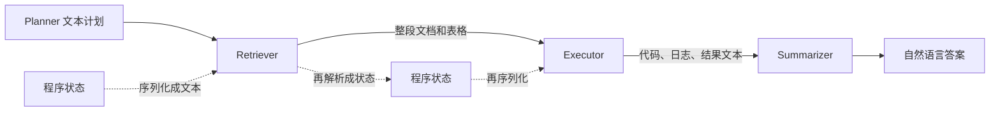
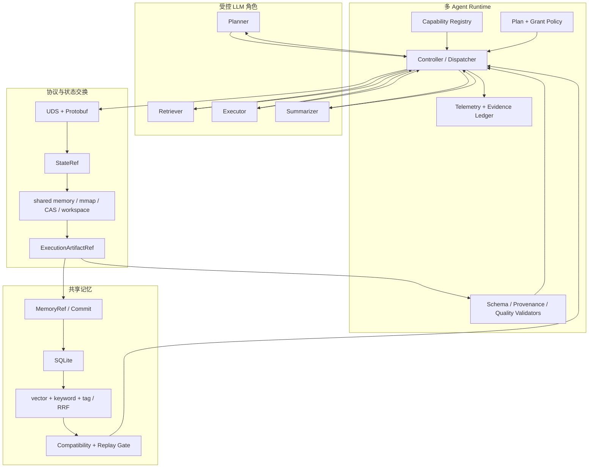
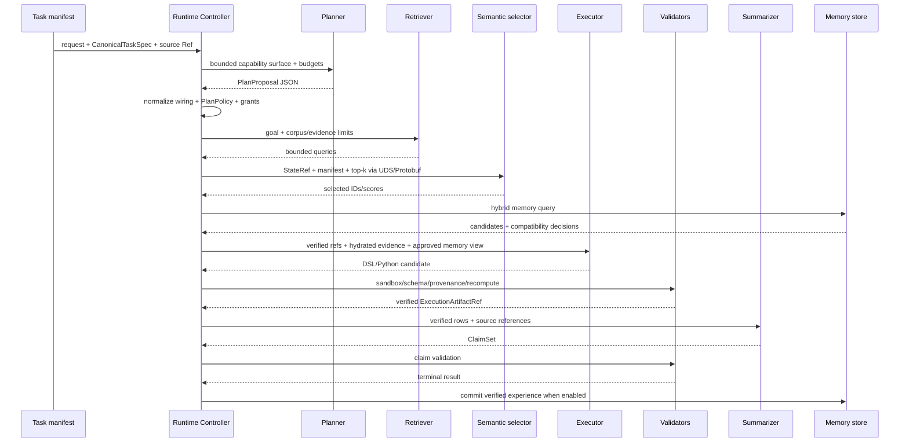
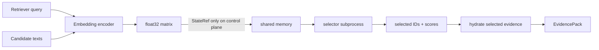
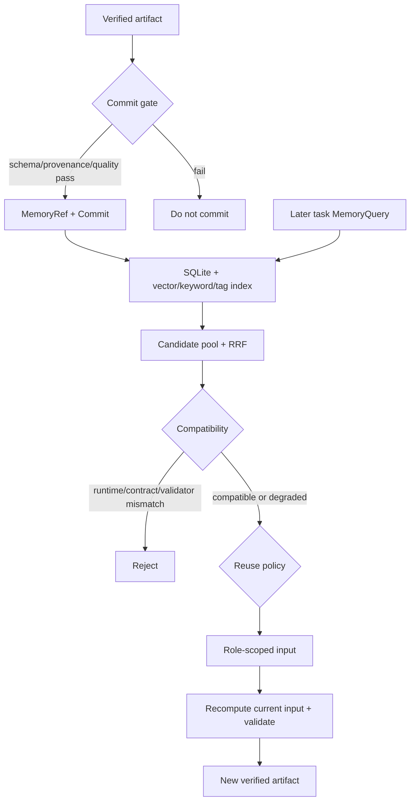

# StateBus v2 正式系统、任务与实验报告

日期：2026-07-20  
版本：赛题汇总版  
适用读者：第一次接触 StateBus 的评审、研发人员和项目协作者

## 摘要

多 Agent 系统通常让 Planner、Retriever、Executor、Summarizer 通过自然语言或大段 JSON 交换中间结果。这样做容易实现，却会重复传递上下文、反复把程序状态转成文本再解析回来，也很难回答“上一个任务的经验在下一个任务里到底有没有被使用”。StateBus v2 的目标，是把这类协作从一串不可审计的聊天，改造成由 **结构化控制协议、非文本状态引用和共享记忆合同** 共同驱动的 Runtime。

系统实现四个 LLM 角色，并由一个非 LLM 的 Runtime Controller 负责调度和安全边界。控制面使用 UDS + typed Protobuf 传递动作、Ref、合同和生命周期事件；数据面将 embedding matrix 作为 StateRef 发布到 shared memory 或 mmap，由独立进程直接做 cosine top-k；记忆面将 verified artifact、来源、摘要、标签、兼容性签名和可选执行 recipe 持久化，后续任务必须通过检索、兼容性和 policy gate 才能消费。Executor 可选择 declarative DSL 或 CodeAct bounded Python，生成代码经过静态策略、bwrap、schema、provenance 和 formal recomputation 后才能成为 verified artifact。

本轮在 openEuler 24.03 LTS-SP3 单容器中完成 E0-E6 canonical runs。主要结果为：

- matched L0→L1 中，typed Protobuf 使 control bytes 降低 83.05%、total wire bytes 降低 68.95%；prompt tokens 上升 2.88%，因此不宣称 Protobuf 自身节省 token；
- L1→L2 加入 embedding StateRef 与按需 hydration 后，prompt tokens 降低 55.76%、prompt-visible bytes 降低 81.10%；
- 两组连续任务均稳定完成 10/10；E2 合计 20/20；
- E3 完成 memory 的 commit、load、candidate、compatibility、Executor recipe reuse 和 incompatible rejection；但 23 条 recorded consumption 中有 15 条 Summarizer 假阳性，自然任务也尚未稳定减少 LLM 调用；
- E4 holdout 为 4/4，其中 semantic Retriever 3、table Retriever 1；
- E5 Adaptive 25/25，DSL 7、bounded Python 18、fallback 0；
- E6 完整回归为 558 passed、100 warnings。

这些结果证明原型机制可运行且可审计，但不证明 token、时延或自然记忆复用在所有任务上都稳定优于 baseline，也不代表已实现 hidden state/KV tensor 跨 Agent 传递或 production-grade sandbox。

## 1. 为什么要做 StateBus

### 1.1 传统文本协作的问题

设想一个财报任务：Planner 先写一段计划，Retriever 再把整张表和几段原文返回，Executor 重新解析这些文本并算数，Summarizer 最后又收到一遍任务、计划、表格和计算结果。系统表面上有四个 Agent，实际上每一步都在重复发送与重新解释同一批文本。



这种方法有三个系统性问题：

1. **通信密度低**：任务 ID、动作、参数、结果状态被包在自然语言中，同一上下文反复出现。
2. **状态有损且难验证**：向量、表格 lineage、执行状态先转成长文本，下游还要猜字段和来源。
3. **经验无法安全复用**：相似任务可能命中过去结果，但系统缺少身份、兼容性、消费与重算记录，只能“把旧答案贴进 Prompt”。

赛题要求解决的正是这三个问题，而不是再做一个固定工作流界面。

### 1.2 StateBus 的核心回答

StateBus 将协作信息分成三类：

| 信息 | 表示 | 为什么这样做 |
| --- | --- | --- |
| 动作和生命周期 | typed Protobuf frame | 字段固定、可校验、可精确统计 wire bytes |
| 中间数值状态 | StateRef 指向 shared memory/mmap | 不把 embedding 重新编码成自然语言 |
| 可复用经验 | MemoryRef + compatibility metadata | 相似度只找候选，兼容性和验证决定能否复用 |

一句话概括：**模型负责提出受限的语义决策，Runtime 负责身份、权限、数据移动、验证和记忆生命周期。**

### 1.3 设计目标与非目标

目标：

- 同一 Runtime 同时支持 matched text 与 structured carrier；
- 至少三个角色完成多步骤任务，本实现为四个；
- 非文本 embedding 在不同 PID 间直接传递并实际影响下游选择；
- 历史工件可检索、可拒绝、可消费、可重算；
- 每一步都有输入、输出、Ref、hash、consumer 和 quality record；
- 在 openEuler 单容器中可复现运行。

非目标：

- 不把模型 hidden state 或 KV tensor 在 Agent 间直接迁移；
- 不允许 Agent 自由执行 shell、访问网络或扩大输入路径；
- 不把相似 memory candidate 自动当成正确答案；
- 不以一次 benchmark 证明开放域泛化或生产安全认证。

## 2. 总体架构

### 2.1 四层结构



四层分别解决不同问题：

- **角色层**：谁负责计划、找证据、执行、表达结论。
- **Runtime 层**：谁有权调度、绑定 Ref、发 grant、重试和验证。
- **协议/状态层**：数据如何跨进程移动，以及如何避免全部文本化。
- **记忆层**：历史结果如何保存、检索、判断兼容和进入当前任务。

### 2.2 为什么 Controller 权限最大

四个 LLM 角色都可能产生格式错误或越权内容，所以它们不能直接拥有全局状态。Controller 保留以下权力：

- 将用户请求编译成 `CanonicalTaskSpec`；
- 将 capability registry 的 public view 发给 Planner；
- 为 step 绑定稳定 ID、dependency、input Ref 和 output contract；
- 签发 task/session/step-scoped `CapabilityGrant`；
- 发布/释放 StateRef 和创建 execution workspace；
- 运行 schema、provenance、formal recomputation 和 Claim validator；
- 只有 terminal verified artifact 才能 commit 为 memory。

这不是削弱 Agent，而是把“语义选择”与“系统授权”分开。Planner 选择做什么，Controller 判断该选择是否在已注册边界内并把它变成可执行对象。

## 3. 四个 Agent 各做什么

| 角色 | 输入 | 模型输出 | 下游如何消费 | 权限边界 |
| --- | --- | --- | --- | --- |
| Planner | goal、输入 Ref 摘要、capability surface、预算 | capability、step goal、completion criteria、有限 DAG | Controller 编译并经 PlanPolicy 批准 | 不 dispatch、不写代码、不发路径/网络、不注册 capability |
| Retriever | approved goal、corpus/evidence allowlist、query budget | 1-3 queries、evidence types、scope、candidate count | query 被 embedding/table retrieval 消费 | 不返回最终答案、不扩大 corpus/time/entity |
| Executor | verified source/evidence、required output schema、有限 memory view | DSL 或 bounded Python | sandbox 执行，结果进入 validators | 不自行宣布 verified，不访问网络/任意文件 |
| Summarizer | verified rows、evidence catalog、artifact IDs | typed ClaimSet | ClaimSetValidator 检查引用和数值 | 不修改 verified 数值、不执行代码 |

embedding encoder 和 semantic selector 不计作 Agent。前者把 query/candidate 文本变为向量，后者在独立进程里做矩阵乘积和 top-k；二者不生成计划或答案。

## 4. 关键数据合同

### 4.1 `CanonicalTaskSpec`

它把自然语言任务收敛为：

```text
schema_version
task_family
intent_op
target_entities
time_scope
arguments / filters
required_outputs
required_tools
```

同一 task spec 同时用于 Planner 约束、memory query identity 和 benchmark lineage，避免每个角色各自重新理解任务边界。

### 4.2 `StateRef`

StateRef 描述短生命周期或可寻址状态，而不是直接把 bytes 塞进控制消息。dense semantic state 的合同包括：

```text
state_id, blob_hash, size_bytes
shape, dtype=float32, byte_order=little
row_layout=query_then_candidates, normalized=true
encoder_id/revision/signature
hydrate_manifest_id/hash
owner_session_id, lease_expires_at_ns
storage_kind=shared_memory|mmap
```

接收方同时验证 Ref 与 sidecar，读取后再验证 hash、shape、finite 和 L2 norm。

### 4.3 `ExecutionArtifactRef`

执行输出与 StateRef 分开。ExecutionArtifactRef 表示 workspace/CAS 中的业务结果，携带 task/session、content hash、schema、verification state 和 lineage。这样短期 embedding 不会被误当成可重放业务工件。

### 4.4 `MemoryRef`

MemoryRef 保存的是“可检索经验单元”，包括：

- memory ID、source Agent、source task、创建时间；
- task theme、summary、tags；
- verified artifact ID/hash、manifest 和 input lineage；
- output contract、validator digest、runtime signature；
- 可选 execution recipe 和 recipe hash。

Memory candidate 只有经过 compatibility 和 policy approval 后，才会投影成某个角色的输入。当前 bounded-Python Executor 能真实读取或执行 recipe；Summarizer 路径存在实现缺口：外层 payload 携带 memory，isolated worker 却未把它渲染进模型 Prompt，后续仍错误记录为 consumed。

## 5. 一次任务怎样运行



任何一条箭头都不等于“把所有上游对话发给下游”。Controller 为每个角色重新构造最小 Prompt surface；Ref 内容只有在该 step 被授权时才 materialize。

## 6. 结构化通信机制

### 6.1 Wire contract

控制面使用 AF_UNIX socket。主要事件为：

```text
REQ_EXEC
  -> ACK_RECV
  -> RUN_START
  -> HEARTBEAT
  -> RES_SUCC | RES_ERR

可选控制：CANCEL、TRAP_FATAL、GC
```

`ExecRequest` 包含 header、reuse policy、state/artifact/memory refs、operation、workspace root、input manifest hash、output contract 和 semantic selection 参数。`SuccessResult` 返回 output contract、被消费的 state ID、selected candidate IDs/scores/indices、bytes 和 producer/consumer PID。

能力发现由进程内 `CapabilityRegistry.public_view()` 完成：Planner 只看到允许的 capability ID、role、execution kind、input/output contract、completion criteria 和 side-effect class。当前没有 wire-level Hello/Capability negotiation，因此正式口径是“registry capability discovery + protocol mapping”。

### 6.2 为什么保留纯文本 lane

如果只测结构化协议，很难知道收益来自协议还是任务、模型、进程拓扑变化。系统因此保留 `utf8_text` carrier，并在 E1 中与 Protobuf 使用相同任务、角色图、模型、validator 和 subprocess topology。这样 L0→L1 只比较 carrier。

## 7. 非文本中间状态

### 7.1 为什么传 embedding，而不是把所有文本都发下去

Retriever 面对长文档时，Executor 真正需要的是少量相关 evidence。StateBus 将 query 和候选都编码为向量矩阵：

```text
row 0      = query embedding
row 1..N   = candidate embeddings
matrix     = little-endian float32, L2-normalized
```

矩阵通过 shared memory/mmap 暴露给独立 selector PID。selector 直接计算 `candidate_matrix @ query_vector`，结合 top-k 和 evidence byte budget 返回 candidate IDs。只有这些 IDs 对应的原文被 hydrate 给后续角色。



### 7.2 为什么这算“被消费”

系统不仅统计 publish。每次 selection 都记录：

- state Ref ID、read row IDs；
- producer PID 与不同的 consumer PID；
- selected IDs/scores；
- input candidate-surface hash 与 output decision-surface hash；
- downstream EvidencePack Ref；
- release count 与 released bytes。

E4 S4 的三个 query 各产生 `[6,1024]` matrix，单个 24,576 bytes，总计 73,728 bytes；三个独立 consumer PID 返回不同排序，selected IDs 最终决定下游 EvidencePack。这比“生成过 embedding 文件”更强，因为它证明数值结果改变了后续可见信息。

## 8. 共享记忆机制

### 8.1 从保存到复用



相似度只决定“值得检查谁”，不能决定“谁可以直接复用”。Compatibility 会比较 runtime signature、output contract、validator digest、canonical task 参数、schema 和 input lineage。即使 recipe 来自 verified artifact，只要当前参数或输入 lineage 改变，也必须在当前输入上重算。

### 8.2 五种容易混淆的概念

| 名称 | 含义 | 是否等于省一次 LLM |
| --- | --- | --- |
| candidate | keyword/tag/vector 找到的候选 | 否 |
| compatible/approved | 通过兼容性和 policy | 否 |
| history artifact reuse | 当前任务读取历史工件/策略 | 否 |
| assist | 历史信息进入角色输入，当前任务仍执行 | 否 |
| validated replay | 复用已验证 recipe/步骤并在当前输入重算 | 不一定 |
| exact replay | 输入、合同、lineage 等完全一致的强复用 | 当前 canonical run 为 0 |

因此实验报告采用完整 funnel，而不是一个含糊的“memory hit rate”。

## 9. CodeAct 执行机制

复杂表格分析、跨行对齐、分类标签和自定义解析不一定能用固定 DSL 表达。Planner 可以从 registry 选择 `execute_bounded_python_v2`。执行链为：

```text
LLM Python candidate
  -> AST/static-call policy
  -> isolated workspace
  -> bwrap, no network, read-only input, one writable output
  -> UID/GID 65534:65534
  -> output schema
  -> artifact provenance
  -> formal recomputation
  -> verified ExecutionArtifactRef
```

任何一层失败都会 fail closed 或进入有上限的 repair。S4 的真实路径经历静态策略拒绝、runtime `KeyError`、formal recomputation mismatch，第四版才通过。这说明 repair 和 validator 是主路径的一部分，而不是只在单元测试中存在。

## 10. 任务设计

### 10.1 为什么选择离线财报和运营指标

正式任务默认使用 repo-local 离线材料，原因是：

- 输入可以冻结、hash 和复查，不受互联网变化影响；
- 表格数值、段落 qualifier、schema drift 都能做确定性重算；
- 连续任务之间有真实依赖，不需要人为复制同一问题；
- 可以同时覆盖检索、计算、报告、记忆和失败兼容性。

### 10.2 连续任务组 A：跨期财报

`formal_financial_reports_v1` 围绕 ACME/BETA 的多季度 revenue：

| 轮次 | 任务阶段 | 复用意图 |
| --- | --- | --- |
| R1-R2 | 提取 ACME 2026Q1/2025Q4 revenue | R1 产生 extraction strategy，R2 可 validated replay |
| R3 | 计算 ACME QoQ delta | 消费前两轮 verified metrics |
| R4 | 提取 BETA 2026Q1 revenue | 复用同类 extraction strategy |
| R5 | 比较 ACME/BETA | 消费 R1/R4 事实 |
| R6-R7 | BETA 2025Q4 与 delta | 复用策略并形成新 analysis |
| R8 | schema-drift report alias resolution | 测试 schema/alias lineage |
| R9 | ACME 2025Q3 + incompatible fixture | 验证候选可见但拒绝 |
| R10 | 三季度双公司汇总 | 汇合前九轮 lineage |

### 10.3 连续任务组 B：运营指标

`formal_operating_metrics_v1` 从 disease CSV 逐步迁移到 weather CSV：

| 轮次 | 任务阶段 | 复用意图 |
| --- | --- | --- |
| R1 | schema profile + missingness | 产生 schema/profile strategy |
| R2 | mean cases + max deaths | 消费 schema profile |
| R3 | IQR outlier 与均值对比 | 产生统计策略 |
| R4 | weather profile + mean wind speed | 跨数据集复用 profile/mean strategy |
| R5 | 前四轮 reuse summary | 汇总 declared artifacts |
| R6-R7 | monthly groupby、BARO outlier | 当前数据重算，复用 schema/strategy |
| R8 | weather schema drift/alias | 验证 alias 与 source lineage |
| R9 | outlier replacement + imputation | 生成 cleaned table 并注入不兼容候选 |
| R10 | 九轮 lineage summary | 汇总 schema、stats、outlier、cleaning、reject |

两组任务都不是十次独立问答；manifest 显式声明 `depends_on_rounds`、produces/consumes 和 minimum reuse class。

### 10.4 Semantic holdout 与 25-case Adaptive 集

E4 另用四个 frozen repo-local holdout：narrative only、table only、mixed narrative+table，测试 Planner 是否在未修改 Runtime 的条件下选择 semantic/table Retriever 和 DSL/Python。

E5 使用 25 个 formal analysis cases，覆盖 lookup、trend、aggregation、anomaly 等任务。它用于观察 capability 选择和 CodeAct，而不是重复 E1 的 carrier 对照。25 个 case 都选 table Retriever；semantic 自然覆盖由 E4 提供。

## 11. 实验设计

### 11.1 L0-L3 单变量矩阵

| Lane | Control carrier | Semantic state | Shared memory | 目的 |
| --- | --- | --- | --- | --- |
| L0 | matched UTF-8 text | off | off | 纯文本基线 |
| L1 | typed Protobuf | off | off | 隔离结构化 carrier 效果 |
| L2 | typed Protobuf | on | off | 隔离 embedding selection/hydration 效果 |
| L3 | typed Protobuf | on | on | 观察跨任务 memory 效果 |

E1 取两个 family 的 causal-core 前五轮，形成 `2 families x 5 tasks x 4 lanes = 40` 个串行 case。fairness manifest 检查 task/source、角色图、模型配置、Executor/validator、capability surface 和 subprocess topology 一致，仅允许 layer feature flags 变化。

### 11.2 E0-E6 分工


| ID | 问题 | canonical run | 结果 |
| --- | --- | --- | --- |
| E0 | 基础组件是否通过 focused gate | `e0_focused_20260720_142422` | 135 passed |
| E1 | carrier/state/memory 分层效果是什么 | `e1_causal_serial_20260720_150801` | 40/40 |
| E2 | 两组连续任务能否稳定跑 10 轮 | `e2_stress_serial_20260720_152924` | 20/20 |
| E3 | Adaptive memory 是否真的 commit/consume/reject | `e3_adaptive_memory_final_20260720_160244` | 6/6 |
| E4 | 冻结 Runtime 后能否处理 semantic holdout | `e4_semantic_holdout_final4_20260720_175430` | 4/4 |
| E5 | Planner/DSL/CodeAct 在 formal cases 上如何选择 | `e5_adaptive_final_20260720_190107` | 25/25 |
| E6 | 完整回归是否通过 | `e6_full_final_20260720_201043` | 558 passed |

## 12. 实验结果

### 12.1 E1 通信与 Prompt 开销

每个 lane 10 cases：

| Lane | control bytes | total wire bytes | prompt tokens | total tokens | prompt-visible bytes | LLM calls | task elapsed ms 合计 |
| --- | ---: | ---: | ---: | ---: | ---: | ---: | ---: |
| L0 | 25,196 | 36,069 | 29,876 | 33,974 | 75,926 | 40 | 315,678 |
| L1 | 4,270 | 11,200 | 30,737 | 34,891 | 75,926 | 40 | 302,063 |
| L2 | 4,507 | 11,827 | 13,599 | 17,739 | 14,353 | 40 | 305,237 |
| L3 | 5,357 | 12,677 | 13,885 | 17,870 | 15,847 | 40 | 295,728 |

分层分析：

- **L0→L1**：control `-83.05%`，wire `-68.95%`，prompt tokens `+2.88%`。结论是协议 bytes 显著下降，不是 token 下降。
- **L1→L2**：prompt tokens `-55.76%`，prompt-visible bytes `-81.10%`。这是 semantic selection 后减少原文 hydration 的效果。
- **L2→L3**：tokens/visible bytes 略增，说明 memory metadata 自身有成本；本轮不能说 memory 必然降低 Prompt。

E1 的描述性时延为：

| Lane | p50 | p95 |
| --- | ---: | ---: |
| L0 | 31.953 s | 33.440 s |
| L1 | 32.355 s | 35.589 s |
| L2 | 32.391 s | 36.336 s |
| L3 | 29.135 s | 35.212 s |

由于只做一次固定 L0→L3 顺序，未随机化或反向重复，时延只作运行读数，不能推出稳定 superiority。

### 12.2 E1/E2 记忆漏斗

| 实验 | query | candidate | compatible/approved | consumed/effect | assist | validated replay | exact replay | skipped step | skipped LLM |
| --- | ---: | ---: | ---: | ---: | ---: | ---: | ---: | ---: | ---: |
| E1 L3 | 10 | 15 | 2 | 2 | 0 | 2 | 0 | 2 | 0 |
| E2 L3 | 20 | 48 | 9 | 9 | 7 | 2 | 0 | 2 | 0 |
| E3 | 6 | 16 | 15 | 23 | 0 | 1 | 0 | 1 | 1 |

E2 中 financial family 有两次 validated replay；operating family 是 history-backed reuse，没有升级为 replay。E2 另有 44 次 history-backed artifact reuse，但不能称 44 次 replay。

E3 聚合的 `consumed=23` 高于 approved match 15，表面原因是同一 MemoryRef 被分别投影给 Executor 和 Summarizer。进一步代码与 rendered-request 审计表明：23 条记录由 Executor 8、Summarizer 15 组成；`compatible_memory_inputs` 在 Summarizer worker 中被丢弃，15 条没有进入 LLM Prompt，却仍被记录为 `role_input_augmented`。合成负例还一次性为 5 个 Executor inputs 记账，实际只有一条 recipe 标记为 recomputed，其余四条没有模型调用可供消费。因此该表保留 canonical recorded value 以便复现，但真实 Agent 消费不能写成 23，也不能把 8 条 Executor record 全部视为逐 ID 消费。E3 唯一 skipped LLM 来自 synthetic negative case；五个自然任务都没有 skipped LLM。

### 12.3 E4 非文本状态 holdout

| Case | 输入形态 | Retriever | Executor | 质量 |
| --- | --- | --- | --- | --- |
| S1 | narrative only | semantic | bounded Python | PASS |
| S2 | narrative only | semantic | bounded Python | PASS |
| S3 | table only | table | DSL | PASS |
| S4 | narrative + table | semantic | bounded Python | PASS |

S1/S2 单个 query matrix 为 `[9,1024]`、36,864 bytes；S4 为 `[6,1024]`、24,576 bytes。三个 semantic cases 都使用 shared memory、真实 Qwen embedding、不同 producer/consumer PID，且 selected IDs 改变下游 evidence surface。所有 state 都有 release count/bytes 闭环。

E4 的 `expected_facts` 只在 Runtime 结束后用于外部评分，`benchmark_oracle_visible_to_roles=false`。它是 content-freeze 后的有限 holdout，不是双盲开放域评测。

### 12.4 E5 Adaptive 与 CodeAct

| 指标 | 结果 |
| --- | ---: |
| formal cases | 25/25 PASS |
| table Retriever | 25 |
| semantic Retriever | 0 |
| declarative DSL | 7 |
| bounded Python | 18 |
| Summarizer ClaimSet | 23 |
| Summarizer risk memo | 2 |
| model/runtime/sandbox fallback | 0 |
| Planner schema normalization | 25 |

全部 18 个 Python execution record 使用 bwrap、UID/GID 65534。25/25 schema normalization 表示 Planner 提供语义方案，Controller 负责 typed wiring；20/25 原始计划缺少 Summarizer 对 Retriever evidence 的 dependency，随后由 Controller 补全。因此 E5 证明的是受控自主性，不是模型单独生成可直接执行 DAG。

### 12.5 E0/E6 工程门

- E0：`135 passed in 632.42s`，deterministic preflight OK。
- E6：`558 passed, 100 warnings in 858.69s`，deterministic preflight OK。

100 条 warning 主要是 Protobuf generated-code descriptor deprecation 等依赖升级问题，不影响 pass，但应在后续升级中清理。

## 13. 结果意味着什么

### 13.1 已经得到支持的假设

1. **结构化 carrier 可以显著降低控制面 bytes。** E1 是 matched topology，差异清晰。
2. **非文本 semantic state 可以影响真实下游决策。** 不是只 publish，而是跨 PID 数值计算、selected IDs、hydration 和 release 完整闭环。
3. **记忆可以从历史 verified artifact 进入后续 bounded-Python Executor。** E3 能追踪 candidate、compatibility、被选 recipe 的 current-input recomputation 和 downstream Ref；Summarizer 的 consumer record 当前是假阳性，批量 Executor record 也不等于每个 ID 都被读取。
4. **错误历史不会因相似度高而直接绕过验证。** incompatible fixture 被记录并拒绝，当前输入重新计算。
5. **Adaptive capability 选择与 CodeAct 可在 formal tasks 上稳定运行。** DSL/Python 都有覆盖，Python sandbox 和 quality repair 有真实 artifact。

### 13.2 尚未得到支持的假设

1. Protobuf 自身稳定减少 token。
2. 四层系统在时延上有统计显著优势。
3. 自然任务 memory 已稳定减少 LLM 调用。
4. history artifact、candidate、assist 都等于 replay。
5. 已完成 hidden state 或 KV cache tensor handoff。
6. 当前 grant 和 bwrap 已达到跨租户生产安全等级。
7. 单容器结果可以外推到 VM、跨机或开放域任务。

## 14. 已知问题与改进方向

正式系统报告不隐藏通过结果中的问题。当前优先项为：

- 修复 PlanPolicy step output allowlist 的布尔逻辑；
- 为 Claim 增加字段级 source support，修复 S4 qualifier citation 不完整；
- 修复 Summarizer memory 假消费：只将摘要、lineage、compatibility 和验证状态真正渲染到 Prompt，或不渲染且停止记账；完整 Python source 不应发送到该 worker；
- 将 capability grant 从非空 hash correlation 提升为带 expiry、peer、task/step/ref 校验的强授权；
- 给 semantic selector 降 OS 权限，并区分 logical role、physical component 和 downstream role；
- 对 memory assist 做 paired no-memory counterfactual；
- 用随机/反向 lane 顺序和多次独立重复给出时延置信区间；
- 构造自然的参数化 recipe 或 exact-input sequence，验证真实 skipped LLM。

详细代码证据、严重级别和验收标准见 [全面 Review](statebus_v2_comprehensive_review_20260720.md)。

## 15. 赛题评分维度对应

| 评分项 | 当前最强证据 | 保守判断 |
| --- | --- | --- |
| 通信效率 25 | E1 L0/L1 control/wire bytes | bytes 证据强，token 证据不能归因给 Protobuf |
| 状态传递创新 20 | E4 shared-memory matrix + cross-PID top-k + hydration effect | 当前最完整、最有辨识度的部分 |
| 记忆复用 20 | E1-E3 funnel、Executor recipe reuse、compatibility rejection | 存储/检索/Executor 复用成立；Summarizer 15 条消费需剔除，稳定性能收益仍需补 |
| 系统完整性 20 | 四角色、Controller、protocol/state/memory/eval、E6 558 tests | 完整性强；跨进程授权需强化 |
| 实验验证 15 | E0-E6、fairness manifest、失败 run 保留、checksums | 证据链完整；时延重复和自然 replay 不足 |

## 16. 复现身份与证据入口

环境身份：

| 字段 | 值 |
| --- | --- |
| OS | openEuler 24.03 LTS-SP3 单容器 |
| Python | 3.11.6 `/usr/bin/python3` |
| role model | qwen3-32b，temperature 0 |
| embedding | Qwen3-Embedding-0.6B，revision 4.51.3，CUDA |
| container image digest | `sha256:715ded05373ca023f3acf33d180b8db2e0c4f2b1361b6c2a31c58c33c1fb6647` |
| capability registry digest | `239fdc32997c4f81e13e614b8f1fe5c99cf099d3a40e07164b2652d54000ac57` |

证据入口：

- [canonical evidence index](final_v2_contest_evidence_index_20260720.md)
- [E0-E6 最终结果报告](contest_evidence_closure_final_report_20260720.md)
- [完成审计](../improvement/25_contest_evidence_closure_20260720/01_completion_audit_20260720.md)
- host artifact root：`/home/qcrs/statebus/runs/contest_evidence_closure_20260720`

canonical manifest 如实记录实验时 `git_dirty=true` 与 HEAD `a3a5ec836...`；E4 另以 59-file content ledger 证明 Runtime freeze 未变化。当前仓库 HEAD 已前进到 `bda17745...`，不能反向改写原实验身份。

## 17. 总结

StateBus v2 解决的不是“让四个模型轮流说话”，而是让多 Agent 中间产物拥有清晰的类型、身份、生命周期、消费者和验证条件。结构化协议降低控制面开销；embedding StateRef 把数值选择留在数据面；ExecutionArtifactRef 把代码输出和验证绑定；MemoryRef 让历史经验可以被检索，同时又不能越过兼容性和当前输入重算。Review 同时发现，消费 ledger 也必须绑定真实 rendered input，不能只因 Controller 构造过 payload 就宣布下游已消费。

这轮实验足以把系统作为一个完整、可运行、可复查的赛题原型进行汇总。最稳妥的展示重点应放在：matched carrier bytes、cross-PID semantic consumption、memory compatibility 与经 consumer truth audit 修正后的复用链、CodeAct fail-closed validation，以及两组 10 轮连续任务。对 token、时延、自然 LLM skip 和安全等级保持边界，反而会让整个证据体系更可信。

一个具体任务从 Prompt 到 StateRef、CodeAct、ClaimSet 的逐字段说明见 [端到端任务流转说明](statebus_v2_end_to_end_task_walkthrough_20260720.md)。
